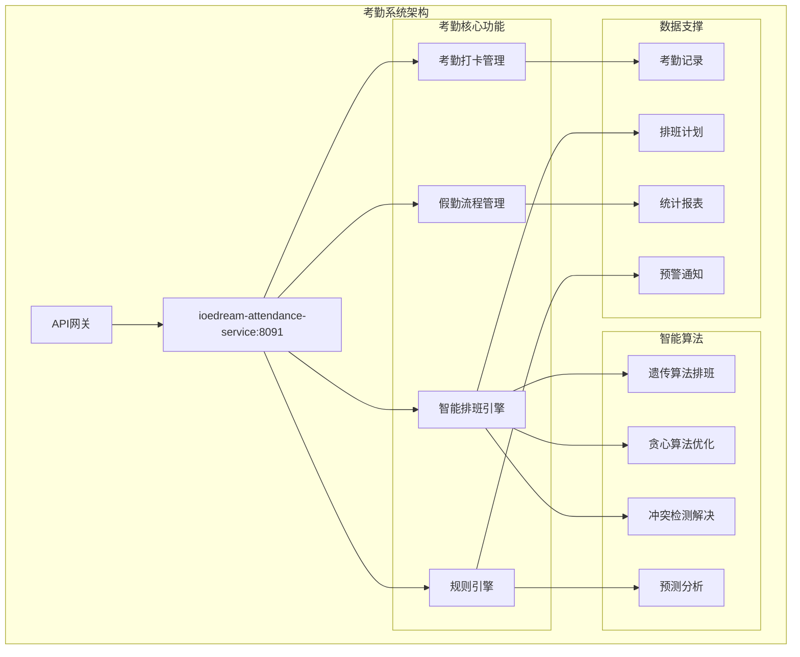
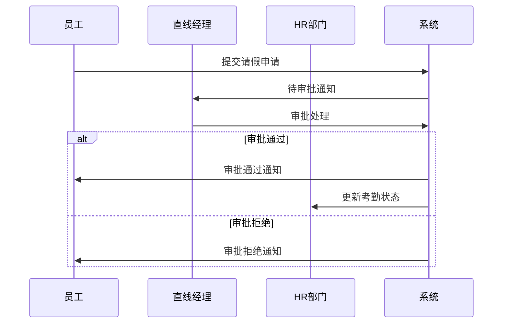

# 考勤系统业务功能说明

> **模块定位**: 智慧园区安防综合管理平台核心考勤管理
> **核心功能**: 智能排班 + 考勤打卡 + 假勤管理 + 数据统计分析
> **技术架构**: Spring Boot 3.5.8 + 规则引擎 + 智能算法
> **服务端口**: 8091 (ioedream-attendance-service)
> **更新日期**: 2025-12-16

---

## 📋 模块概述

考勤系统是IOE-DREAM智慧园区安防综合管理平台的核心人力资源管理模块，提供完整的考勤管理解决方案，支持多种打卡方式、智能排班算法、假勤流程管理和全面的考勤数据分析。

### 🎯 核心价值

- **智能考勤管理**: 基于AI的多模态生物识别考勤，防止代打卡
- **灵活排班算法**: 支持遗传算法、贪心算法等多种智能排班策略
- **全流程假勤管理**: 完整的请假、加班、调班、出差流程管理
- **实时监控预警**: 考勤异常实时检测和智能预警机制
- **数据驱动决策**: 基于大数据的考勤分析和人力资源优化建议

### 🏗️ 技术架构



---

## 🎯 核心业务功能

### 📅 1. 智能排班管理

#### 1.1 排班计划管理
- **排班类型**: 固定排班、循环排班、弹性排班、智能排班
- **排班算法**: 遗传算法、贪心算法、回溯算法
- **约束条件**: 工时长短、技能匹配、合规要求、员工偏好
- **冲突解决**: 自动检测、手动处理、优先级策略

**主要特性**:
- ✅ 支持1000+员工规模的大型企业排班
- ✅ 支持三班倒、四班三倒等复杂轮班模式
- ✅ 智能检测排班冲突并提供解决方案
- ✅ 支持排班优化目标：成本最小化、员工满意度最大化

#### 1.2 轮班规则配置
```json
{
  "rotation_type": "四班三倒",
  "cycle_days": 4,
  "rotation_shifts": [
    {"shift": "早班", "time": "08:00-16:00", "days": 1},
    {"shift": "中班", "time": "16:00-24:00", "days": 1},
    {"shift": "夜班", "time": "00:00-08:00", "days": 1},
    {"shift": "休息", "time": "全天休息", "days": 1}
  ],
  "auto_rotate": true,
  "conflict_handling": "PRIORITY"
}
```

#### 1.3 个人排班管理
- **排班来源**: 手动创建、自动生成、批量导入、外部同步
- **优先级管理**: 普通优先级、重要优先级、紧急优先级
- **冲突标识**: 时间冲突、人员冲突、资源冲突
- **状态管理**: 正常、请假、调班、加班、替班

### ⏰ 2. 考勤打卡管理

#### 2.1 多模态打卡方式
- **生物识别**: 人脸识别、指纹识别、虹膜识别
- **卡片打卡**: IC卡、身份证、员工卡
- **移动打卡**: 手机APP打卡、GPS定位验证
- **设备打卡**: 考勤机、门禁联动打卡

#### 2.2 打卡规则配置
```json
{
  "work_time": {
    "start_time": "09:00",
    "end_time": "18:00",
    "grace_period": 5,
    "break_time": "12:00-13:00"
  },
  "location_rules": {
    "required": true,
    "allowed_range": 100,
    "office_locations": ["总部大楼", "分部A区"]
  },
  "abnormal_detection": {
    "late_threshold": 5,
    "early_threshold": 30,
    "absent_threshold": 60
  }
}
```

#### 2.3 考勤异常处理
- **迟到早退**: 自动检测、分级处理、预警通知
- **缺勤管理**: 自动识别、原因分析、后续处理
- **位置异常**: GPS验证、地点限制、异常提醒
- **设备异常**: 网络故障、设备离线、数据同步

### 📝 3. 假勤流程管理

#### 3.1 请假管理
- **请假类型**: 病假、事假、年假、调休、婚假、产假等
- **流程配置**: 多级审批、条件路由、自动流转
- **时间计算**: 自动计算时长、扣减年假、统计剩余
- **附件管理**: 病假条、请假条、相关证明

**请假流程示例**:


#### 3.2 加班管理
- **加班申请**: 事前申请、事中确认、事后补报
- **加班类型**: 工作日加班、周末加班、节假日加班
- **计算规则**: 加班费计算、调休时间、合规检查
- **统计分析**: 加班时长统计、成本分析、趋势预测

#### 3.3 调班管理
- **调班类型**: 个人调班、集体调班、临时调班
- **调班流程**: 申请、审批、通知、执行
- **冲突检测**: 时间冲突、人员冲突、资源冲突
- **历史记录**: 调班历史、变更记录、影响分析

#### 3.4 出差管理
- **出差申请**: 出差计划、预算申请、审批流程
- **考勤处理**: 出差期间考勤状态、特殊考勤规则
- **费用管理**: 差旅费用、报销流程、成本控制
- **位置管理**: 出差地点考勤、异地打卡验证

### ⚙️ 4. 规则引擎系统

#### 4.1 规则配置管理
- **规则分类**: 时间规则、地点规则、缺勤规则、加班规则
- **条件配置**: 逻辑条件、时间条件、人员条件、部门条件
- **动作配置**: 自动处理、通知发送、数据更新、流程触发
- **优先级管理**: 规则优先级、执行顺序、冲突解决

#### 4.2 规则执行引擎
```json
{
  "rule_example": {
    "name": "迟到检测规则",
    "condition": {
      "arrival_time": "> 09:05",
      "work_days": ["Monday", "Tuesday", "Wednesday", "Thursday", "Friday"],
      "departments": ["技术部", "产品部"]
    },
    "action": {
      "status": "LATE",
      "penalty": "扣除半小时工资",
      "notification": "发送迟到通知给直线经理"
    },
    "priority": 100
  }
}
```

#### 4.3 异常检测规则
- **迟到早退**: 时间阈值、频率限制、分级处理
- **缺勤旷工**: 连续缺勤、异常模式、自动预警
- **位置异常**: 地点验证、范围限制、异常提醒
- **设备异常**: 网络问题、设备故障、数据完整性

### 📊 5. 数据统计分析

#### 5.1 考勤统计报表
- **出勤统计**: 出勤率、缺勤率、准时率、异常率
- **加班统计**: 加班时长、加班成本、部门对比、趋势分析
- **假勤统计**: 请假天数、请假类型、季节分析、成本影响
- **个人报告**: 个人考勤报告、月度总结、年度汇总

#### 5.2 管理驾驶舱
- **实时监控**: 当日出勤、实时异常、预警信息
- **趋势分析**: 历史趋势、同比环比、预测分析
- **部门对比**: 部门效率、成本对比、绩效分析
- **成本分析**: 人力成本、加班成本、假勤成本

#### 5.3 数据导出功能
- **报表导出**: Excel格式、PDF格式、自定义模板
- **数据接口**: API接口、数据推送、实时同步
- **定期报告**: 自动生成、邮件发送、归档管理

---

## 🎨 用户界面设计

### 🖥️ Web端功能

#### 1. 考勤管理控制台
- **仪表板**: 实时考勤状态、异常预警、统计数据
- **排班管理**: 排班日历、排班列表、冲突解决
- **打卡记录**: 打卡查询、异常处理、数据修正
- **报表分析**: 各类报表、趋势图表、数据导出

#### 2. 员工自助服务
- **我的考勤**: 个人打卡记录、考勤统计、异常提醒
- **请假申请**: 在线申请、审批进度、历史记录
- **排班查看**: 个人排班、排班变更、调班申请
- **考勤申诉**: 异常申诉、处理进度、结果通知

### 📱 移动端功能

#### 1. 移动打卡
- **快速打卡**: 一键打卡、人脸识别、位置验证
- **拍照打卡**: 拍照记录、地点标记、时间戳
- **离线打卡**: 网络异常支持、数据同步、缓存处理
- **异常提醒**: 打卡异常、位置异常、设备异常

#### 2. 移动审批
- **待办审批**: 请假审批、加班审批、调班审批
- **审批历史**: 审批记录、处理意见、审批轨迹
- **快速处理**: 同意、拒绝、转交、批量处理
- **消息通知**: 审批提醒、异常告警、系统通知

---

## 🔧 技术特性

### ⚡ 性能指标
- **打卡响应时间**: ≤ 200ms
- **排班算法效率**: 1000人排班 ≤ 10秒
- **数据统计延迟**: ≤ 3秒
- **系统可用性**: 99.9%

### 🔒 安全特性
- **生物识别安全**: 活体检测、防伪攻击、数据加密
- **位置验证安全**: GPS防伪造、地理围栏、异常检测
- **数据安全**: 敏感数据加密、访问控制、审计日志
- **接口安全**: JWT认证、HTTPS传输、API限流

### 🌐 集成能力
- **门禁系统集成**: 联动打卡、权限验证、数据同步
- **OA系统集成**: 审批流程、组织架构、人员信息
- **薪酬系统集成**: 考勤数据、薪资计算、成本核算
- **第三方集成**: 企业微信、钉钉、其他HR系统

---

## 🎯 业务价值

### 📈 管理价值
- **效率提升**: 自动化考勤管理，减少80%手工操作
- **成本控制**: 精确计算加班成本，优化人力配置
- **合规保障**: 确保考勤合规，降低法律风险
- **决策支持**: 基于数据的人力资源决策支持

### 👥 员工价值
- **便捷体验**: 多种打卡方式，提升员工满意度
- **透明公正**: 公开透明的考勤规则和数据处理
- **自助服务**: 便捷的移动端自助服务
- **及时反馈**: 实时的考勤状态和异常提醒

### 🏢 企业价值
- **人力资源优化**: 基于数据的排班优化和人员配置
- **运营效率提升**: 自动化流程减少管理成本
- **合规风险降低**: 标准化的考勤规则和流程
- **数据驱动决策**: 全面的考勤数据分析和洞察

---

## 📚 相关文档

### 📋 业务文档
- [考勤系统数据库设计](./02-考勤系统数据库设计.md)
- [考勤系统业务流程设计](./03-考勤系统业务流程设计.md)
- [考勤系统跨模块业务流程说明](./04-考勤系统跨模块业务流程说明.md)
- [考勤系统用户故事](./05-考勤系统用户故事.md)
- [考勤系统界面设计](./06-考勤系统界面设计.md)
- [考勤系统页面交互说明](./07-考勤系统页面交互说明.md)

### 🔧 技术文档
- [考勤系统API接口文档](../../api/attendance/attendance-api-contract.md)
- [考勤系统部署指南](../../deployment/attendance/attendance-deployment-guide.md)
- [考勤系统监控运维](../../maintenance/attendance/attendance-monitoring-guide.md)

---

**💡 考勤系统作为智慧园区人力资源管理的重要组成部分，将持续优化算法和用户体验，为企业提供更加智能、高效的考勤管理解决方案。**