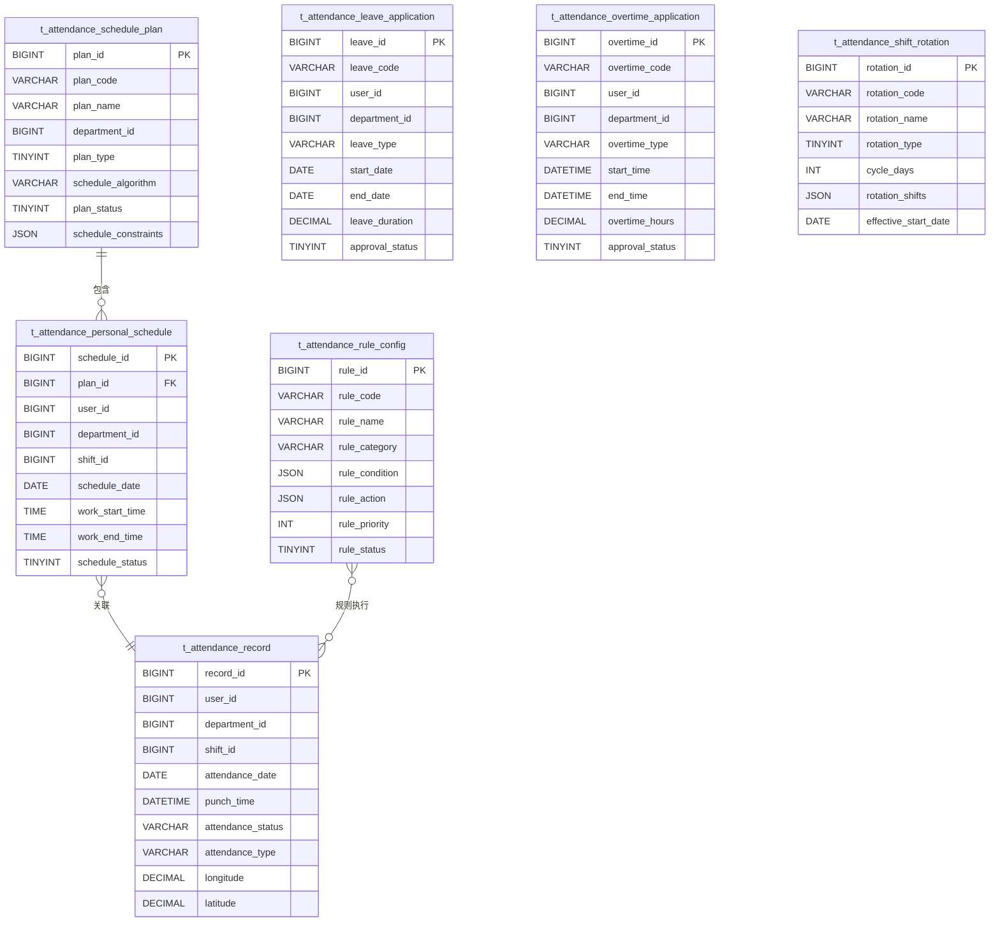

# 考勤系统数据库设计

> **数据库类型**: MySQL 8.0
> **设计规范**: 遵循项目数据库设计规范，使用utf8mb4字符集
> **表数量**: 12个核心表 + 扩展表
> **索引策略**: 覆盖索引、复合索引、性能优化
> **更新日期**: 2025-12-16

---

## 📋 数据库概述

考勤系统数据库采用模块化设计，分为排班管理、考勤记录、假勤管理、规则配置、统计分析等核心模块，支持高并发、大数据量的考勤数据处理需求。

### 🎯 设计原则

- **性能优先**: 合理设计索引，支持高并发查询
- **数据完整**: 外键约束、数据校验、事务一致性
- **扩展性**: 支持水平扩展，预留扩展字段
- **安全性**: 敏感数据加密，访问权限控制

---

## 🗃️ 数据库表结构

### 1. 智能排班相关表

#### 1.1 排班计划表 (t_attendance_schedule_plan)

**功能**: 存储排班计划的配置信息，支持多种排班算法

```sql
CREATE TABLE IF NOT EXISTS `t_attendance_schedule_plan` (
    `plan_id` BIGINT NOT NULL COMMENT '排班计划ID',
    `plan_code` VARCHAR(50) NOT NULL COMMENT '排班计划编码',
    `plan_name` VARCHAR(100) NOT NULL COMMENT '排班计划名称',
    `department_id` BIGINT COMMENT '部门ID',
    `plan_type` TINYINT NOT NULL COMMENT '计划类型: 1-固定排班 2-循环排班 3-弹性排班 4-智能排班',
    `schedule_algorithm` VARCHAR(50) COMMENT '排班算法: GENETIC-遗传算法 GREEDY-贪心算法 BACKTRACK-回溯算法',
    `plan_status` TINYINT DEFAULT 1 COMMENT '计划状态: 1-草稿 2-待审批 3-已审批 4-执行中 5-已完成 6-已取消',
    `effective_start_date` DATE COMMENT '生效开始日期',
    `effective_end_date` DATE COMMENT '生效结束日期',
    `auto_approval` TINYINT DEFAULT 0 COMMENT '自动审批: 0-否 1-是',
    `conflict_resolution` VARCHAR(50) DEFAULT 'MANUAL' COMMENT '冲突解决方式: MANUAL-手动 AUTO-自动 PRIORITY-优先级',
    `schedule_constraints` JSON COMMENT '排班约束条件',
    `optimization_target` VARCHAR(50) COMMENT '优化目标: BALANCE-均衡 COST-成本 PREFERENCE-偏好',
    `description` TEXT COMMENT '排班计划描述',
    `create_time` DATETIME DEFAULT CURRENT_TIMESTAMP COMMENT '创建时间',
    `update_time` DATETIME DEFAULT CURRENT_TIMESTAMP ON UPDATE CURRENT_TIMESTAMP COMMENT '更新时间',
    `create_user_id` BIGINT COMMENT '创建人ID',
    `update_user_id` BIGINT COMMENT '更新人ID',
    `deleted_flag` TINYINT DEFAULT 0 COMMENT '删除标识: 0-未删除 1-已删除',
    `version` INT DEFAULT 1 COMMENT '版本号',
    PRIMARY KEY (`plan_id`),
    UNIQUE KEY `uk_plan_code` (`plan_code`, `deleted_flag`),
    KEY `idx_department_id` (`department_id`),
    KEY `idx_plan_status` (`plan_status`),
    KEY `idx_effective_date` (`effective_start_date`, `effective_end_date`)
) ENGINE=InnoDB DEFAULT CHARSET=utf8mb4 COMMENT='排班计划表';
```

**核心字段说明**:
- `schedule_constraints`: JSON格式存储排班约束条件
- `optimization_target`: 智能排班的优化目标
- `conflict_resolution`: 冲突自动解决策略

#### 1.2 个人排班表 (t_attendance_personal_schedule)

**功能**: 记录每个员工的具体排班安排

```sql
CREATE TABLE IF NOT EXISTS `t_attendance_personal_schedule` (
    `schedule_id` BIGINT NOT NULL COMMENT '排班记录ID',
    `plan_id` BIGINT NOT NULL COMMENT '排班计划ID',
    `user_id` BIGINT NOT NULL COMMENT '用户ID',
    `department_id` BIGINT COMMENT '部门ID',
    `shift_id` BIGINT COMMENT '班次ID',
    `schedule_date` DATE NOT NULL COMMENT '排班日期',
    `work_start_time` TIME COMMENT '上班时间',
    `work_end_time` TIME COMMENT '下班时间',
    `work_location` VARCHAR(100) COMMENT '工作地点',
    `schedule_status` TINYINT DEFAULT 1 COMMENT '排班状态: 1-正常 2-请假 3-调班 4-加班 5-替班',
    `auto_generated` TINYINT DEFAULT 0 COMMENT '自动生成: 0-否 1-是',
    `priority_level` TINYINT DEFAULT 1 COMMENT '优先级: 1-普通 2-重要 3-紧急',
    `schedule_source` VARCHAR(50) COMMENT '排班来源: MANUAL-手动 AUTO-自动 IMPORT-导入 SYNC-同步',
    `conflict_flag` TINYINT DEFAULT 0 COMMENT '冲突标识: 0-无冲突 1-有时间冲突 2-有人员冲突',
    `conflict_resolution` VARCHAR(200) COMMENT '冲突解决方案',
    `extended_attributes` JSON COMMENT '扩展属性',
    `create_time` DATETIME DEFAULT CURRENT_TIMESTAMP COMMENT '创建时间',
    `update_time` DATETIME DEFAULT CURRENT_TIMESTAMP ON UPDATE CURRENT_TIMESTAMP COMMENT '更新时间',
    `create_user_id` BIGINT COMMENT '创建人ID',
    `update_user_id` BIGINT COMMENT '更新人ID',
    `deleted_flag` TINYINT DEFAULT 0 COMMENT '删除标识: 0-未删除 1-已删除',
    `version` INT DEFAULT 1 COMMENT '版本号',
    PRIMARY KEY (`schedule_id`),
    UNIQUE KEY `uk_user_date` (`user_id`, `schedule_date`, `deleted_flag`),
    KEY `idx_plan_id` (`plan_id`),
    KEY `idx_department_id` (`department_id`),
    KEY `idx_shift_id` (`shift_id`),
    KEY `idx_schedule_date` (`schedule_date`),
    KEY `idx_schedule_status` (`schedule_status`)
) ENGINE=InnoDB DEFAULT CHARSET=utf8mb4 COMMENT='个人排班表';
```

#### 1.3 轮班规则表 (t_attendance_shift_rotation)

**功能**: 配置复杂的轮班规则，支持三班倒、四班三倒等模式

```sql
CREATE TABLE IF NOT EXISTS `t_attendance_shift_rotation` (
    `rotation_id` BIGINT NOT NULL COMMENT '轮班规则ID',
    `rotation_code` VARCHAR(50) NOT NULL COMMENT '轮班规则编码',
    `rotation_name` VARCHAR(100) NOT NULL COMMENT '轮班规则名称',
    `rotation_type` TINYINT NOT NULL COMMENT '轮班类型: 1-三班倒 2-四班三倒 3-五班四倒 4-自定义',
    `cycle_days` INT NOT NULL COMMENT '轮班周期天数',
    `rotation_shifts` JSON NOT NULL COMMENT '轮班班次配置',
    `rotation_groups` JSON COMMENT '轮班分组配置',
    `effective_start_date` DATE NOT NULL COMMENT '生效开始日期',
    `effective_end_date` DATE COMMENT '生效结束日期',
    `auto_rotate` TINYINT DEFAULT 1 COMMENT '自动轮班: 0-否 1-是',
    `rotation_frequency` VARCHAR(50) DEFAULT 'DAILY' COMMENT '轮班频率: DAILY-每日 WEEKLY-每周 MONTHLY-每月',
    `conflict_handling` VARCHAR(50) DEFAULT 'SKIP' COMMENT '冲突处理: SKIP-跳过 OVERRIDE-覆盖 PROMPT-提示',
    `holiday_handling` VARCHAR(50) DEFAULT 'NORMAL' COMMENT '节假日处理: NORMAL-正常 SKIP-跳过 SUBSTITUTE-替代',
    `rotation_status` TINYINT DEFAULT 1 COMMENT '轮班状态: 1-启用 0-禁用',
    `description` TEXT COMMENT '轮班规则描述',
    `create_time` DATETIME DEFAULT CURRENT_TIMESTAMP COMMENT '创建时间',
    `update_time` DATETIME DEFAULT CURRENT_TIMESTAMP ON UPDATE CURRENT_TIMESTAMP COMMENT '更新时间',
    `create_user_id` BIGINT COMMENT '创建人ID',
    `update_user_id` BIGINT COMMENT '更新人ID',
    `deleted_flag` TINYINT DEFAULT 0 COMMENT '删除标识: 0-未删除 1-已删除',
    `version` INT DEFAULT 1 COMMENT '版本号',
    PRIMARY KEY (`rotation_id`),
    UNIQUE KEY `uk_rotation_code` (`rotation_code`, `deleted_flag`),
    KEY `idx_rotation_type` (`rotation_type`),
    KEY `idx_effective_date` (`effective_start_date`, `effective_end_date`)
) ENGINE=InnoDB DEFAULT CHARSET=utf8mb4 COMMENT='轮班规则表';
```

### 2. 考勤记录相关表

#### 2.1 考勤记录表 (t_attendance_record)

**功能**: 核心考勤打卡记录，存储所有打卡数据

```sql
CREATE TABLE IF NOT EXISTS `t_attendance_record` (
    `record_id` BIGINT NOT NULL COMMENT '考勤记录ID',
    `user_id` BIGINT NOT NULL COMMENT '用户ID',
    `user_name` VARCHAR(100) NOT NULL COMMENT '用户姓名',
    `department_id` BIGINT COMMENT '部门ID',
    `department_name` VARCHAR(100) COMMENT '部门名称',
    `shift_id` BIGINT COMMENT '班次ID',
    `shift_name` VARCHAR(100) COMMENT '班次名称',
    `attendance_date` DATE NOT NULL COMMENT '考勤日期',
    `punch_time` DATETIME NOT NULL COMMENT '打卡时间',
    `attendance_status` VARCHAR(20) NOT NULL COMMENT '考勤状态: NORMAL-正常 LATE-迟到 EARLY-早退 ABSENT-缺勤 OVERTIME-加班',
    `attendance_type` VARCHAR(20) NOT NULL COMMENT '考勤类型: CHECK_IN-上班打卡 CHECK_OUT-下班打卡',
    `longitude` DECIMAL(10,6) COMMENT '打卡位置经度',
    `latitude` DECIMAL(10,6) COMMENT '打卡位置纬度',
    `punch_address` VARCHAR(200) COMMENT '打卡地址',
    `device_id` BIGINT COMMENT '打卡设备ID',
    `device_name` VARCHAR(100) COMMENT '打卡设备名称',
    `biometric_type` VARCHAR(20) COMMENT '生物识别类型: FACE-人脸 FINGERPRINT-指纹 IRIS-虹膜',
    `biometric_score` DECIMAL(5,2) COMMENT '生物识别匹配置信度',
    `punch_photo_url` VARCHAR(500) COMMENT '打卡照片URL',
    `location_verified` TINYINT DEFAULT 0 COMMENT '位置验证: 0-未验证 1-已验证',
    `offline_flag` TINYINT DEFAULT 0 COMMENT '离线打卡: 0-否 1-是',
    `sync_status` TINYINT DEFAULT 1 COMMENT '同步状态: 1-已同步 0-待同步',
    `remark` VARCHAR(500) COMMENT '备注',
    `create_time` DATETIME DEFAULT CURRENT_TIMESTAMP COMMENT '创建时间',
    `update_time` DATETIME DEFAULT CURRENT_TIMESTAMP ON UPDATE CURRENT_TIMESTAMP COMMENT '更新时间',
    PRIMARY KEY (`record_id`),
    KEY `idx_user_id` (`user_id`),
    KEY `idx_department_id` (`department_id`),
    KEY `idx_shift_id` (`shift_id`),
    KEY `idx_attendance_date` (`attendance_date`),
    KEY `idx_punch_time` (`punch_time`),
    KEY `idx_attendance_status` (`attendance_status`),
    KEY `idx_attendance_type` (`attendance_type`),
    KEY `idx_device_id` (`device_id`),
    KEY `idx_user_date_type` (`user_id`, `attendance_date`, `attendance_type`)
) ENGINE=InnoDB DEFAULT CHARSET=utf8mb4 COMMENT='考勤记录表';
```

### 3. 假勤管理相关表

#### 3.1 请假申请表 (t_attendance_leave_application)

**功能**: 存储员工请假申请的完整信息

```sql
CREATE TABLE IF NOT EXISTS `t_attendance_leave_application` (
    `leave_id` BIGINT NOT NULL COMMENT '请假ID',
    `leave_code` VARCHAR(50) NOT NULL COMMENT '请假单号',
    `user_id` BIGINT NOT NULL COMMENT '申请人ID',
    `department_id` BIGINT COMMENT '申请人部门ID',
    `leave_type` VARCHAR(50) NOT NULL COMMENT '请假类型: SICK-病假 PERSONAL-事假 MATERNITY-产假 MARRIAGE-婚假 ANNUAL-年假 COMPENSATORY-调休 OTHER-其他',
    `leave_reason` TEXT NOT NULL COMMENT '请假原因',
    `start_date` DATE NOT NULL COMMENT '开始日期',
    `end_date` DATE NOT NULL COMMENT '结束日期',
    `start_time` TIME COMMENT '开始时间',
    `end_time` TIME COMMENT '结束时间',
    `leave_duration` DECIMAL(8,2) NOT NULL COMMENT '请假时长（天）',
    `leave_days` DECIMAL(5,2) NOT NULL COMMENT '请假天数',
    `leave_hours` DECIMAL(5,2) COMMENT '请假小时数',
    `attachment_urls` JSON COMMENT '附件URL列表',
    `approver_id` BIGINT COMMENT '审批人ID',
    `approval_status` TINYINT DEFAULT 1 COMMENT '审批状态: 1-待审批 2-审批中 3-已通过 4-已拒绝 5-已撤销',
    `approval_comments` TEXT COMMENT '审批意见',
    `approval_time` DATETIME COMMENT '审批时间',
    `emergency_contact` VARCHAR(100) COMMENT '紧急联系人',
    `emergency_phone` VARCHAR(20) COMMENT '紧急联系电话',
    `work_handover` TEXT COMMENT '工作交接说明',
    `leave_status` TINYINT DEFAULT 1 COMMENT '请假状态: 1-申请中 2-已批准 3-进行中 4-已完成 5-已取消',
    `cancel_reason` TEXT COMMENT '取消原因',
    `cancel_time` DATETIME COMMENT '取消时间',
    `extended_attributes` JSON COMMENT '扩展属性',
    `create_time` DATETIME DEFAULT CURRENT_TIMESTAMP COMMENT '创建时间',
    `update_time` DATETIME DEFAULT CURRENT_TIMESTAMP ON UPDATE CURRENT_TIMESTAMP COMMENT '更新时间',
    `create_user_id` BIGINT COMMENT '创建人ID',
    `update_user_id` BIGINT COMMENT '更新人ID',
    `deleted_flag` TINYINT DEFAULT 0 COMMENT '删除标识: 0-未删除 1-已删除',
    `version` INT DEFAULT 1 COMMENT '版本号',
    PRIMARY KEY (`leave_id`),
    UNIQUE KEY `uk_leave_code` (`leave_code`, `deleted_flag`),
    KEY `idx_user_id` (`user_id`),
    KEY `idx_department_id` (`department_id`),
    KEY `idx_leave_type` (`leave_type`),
    KEY `idx_approval_status` (`approval_status`),
    KEY `idx_leave_status` (`leave_status`),
    KEY `idx_start_date` (`start_date`),
    KEY `idx_end_date` (`end_date`)
) ENGINE=InnoDB DEFAULT CHARSET=utf8mb4 COMMENT='请假申请表';
```

#### 3.2 加班申请表 (t_attendance_overtime_application)

**功能**: 管理员工加班申请和审批

```sql
CREATE TABLE IF NOT EXISTS `t_attendance_overtime_application` (
    `overtime_id` BIGINT NOT NULL COMMENT '加班ID',
    `overtime_code` VARCHAR(50) NOT NULL COMMENT '加班单号',
    `user_id` BIGINT NOT NULL COMMENT '申请人ID',
    `department_id` BIGINT COMMENT '申请人部门ID',
    `overtime_type` VARCHAR(50) NOT NULL COMMENT '加班类型: WEEKDAY-工作日 WEEKEND-周末 HOLIDAY-节假日 EMERGENCY-紧急',
    `overtime_reason` TEXT NOT NULL COMMENT '加班原因',
    `start_date` DATE NOT NULL COMMENT '加班开始日期',
    `end_date` DATE NOT NULL COMMENT '加班结束日期',
    `start_time` TIME NOT NULL COMMENT '加班开始时间',
    `end_time` TIME NOT NULL COMMENT '加班结束时间',
    `overtime_hours` DECIMAL(5,2) NOT NULL COMMENT '加班时长（小时）',
    `compensation_type` VARCHAR(50) NOT NULL COMMENT '补偿方式: PAY-加班费 COMP_TIME-调休 MIXED-混合',
    `overtime_rate` DECIMAL(5,2) COMMENT '加班倍率: 1.5-1.5倍 2.0-2倍 3.0-3倍',
    `estimated_cost` DECIMAL(10,2) COMMENT '预估加班成本',
    `approver_id` BIGINT COMMENT '审批人ID',
    `approval_status` TINYINT DEFAULT 1 COMMENT '审批状态: 1-待审批 2-审批中 3-已通过 4-已拒绝 5-已撤销',
    `approval_comments` TEXT COMMENT '审批意见',
    `approval_time` DATETIME COMMENT '审批时间',
    `actual_hours` DECIMAL(5,2) COMMENT '实际加班时长',
    `verification_method` VARCHAR(50) COMMENT '验证方式: MANUAL-手动 SYSTEM-系统 DEVICE-设备',
    `verification_status` TINYINT DEFAULT 0 COMMENT '验证状态: 0-未验证 1-已验证',
    `overtime_status` TINYINT DEFAULT 1 COMMENT '加班状态: 1-申请中 2-已批准 3-进行中 4-已完成 5-已取消',
    `cancel_reason` TEXT COMMENT '取消原因',
    `cancel_time` DATETIME COMMENT '取消时间',
    `extended_attributes` JSON COMMENT '扩展属性',
    `create_time` DATETIME DEFAULT CURRENT_TIMESTAMP COMMENT '创建时间',
    `update_time` DATETIME DEFAULT CURRENT_TIMESTAMP ON UPDATE CURRENT_TIMESTAMP COMMENT '更新时间',
    `create_user_id` BIGINT COMMENT '创建人ID',
    `update_user_id` BIGINT COMMENT '更新人ID',
    `deleted_flag` TINYINT DEFAULT 0 COMMENT '删除标识: 0-未删除 1-已删除',
    `version` INT DEFAULT 1 COMMENT '版本号',
    PRIMARY KEY (`overtime_id`),
    UNIQUE KEY `uk_overtime_code` (`overtime_code`, `deleted_flag`),
    KEY `idx_user_id` (`user_id`),
    KEY `idx_department_id` (`department_id`),
    KEY `idx_overtime_type` (`overtime_type`),
    KEY `idx_approval_status` (`approval_status`),
    KEY `idx_overtime_status` (`overtime_status`),
    KEY `idx_start_date` (`start_date`),
    KEY `idx_end_date` (`end_date`)
) ENGINE=InnoDB DEFAULT CHARSET=utf8mb4 COMMENT='加班申请表';
```

### 4. 规则引擎相关表

#### 4.1 考勤规则配置表 (t_attendance_rule_config)

**功能**: 存储考勤规则引擎的配置信息

```sql
CREATE TABLE IF NOT EXISTS `t_attendance_rule_config` (
    `rule_id` BIGINT NOT NULL COMMENT '规则ID',
    `rule_code` VARCHAR(50) NOT NULL COMMENT '规则编码',
    `rule_name` VARCHAR(100) NOT NULL COMMENT '规则名称',
    `rule_category` VARCHAR(50) NOT NULL COMMENT '规则分类: TIME-时间规则 LOCATION-地点规则 ABSENCE-缺勤规则 OVERTIME-加班规则',
    `rule_type` VARCHAR(50) NOT NULL COMMENT '规则类型',
    `rule_condition` JSON NOT NULL COMMENT '规则条件',
    `rule_action` JSON NOT NULL COMMENT '规则动作',
    `rule_priority` INT DEFAULT 100 COMMENT '规则优先级（数字越小优先级越高）',
    `effective_start_time` TIME COMMENT '生效开始时间',
    `effective_end_time` TIME COMMENT '生效结束时间',
    `effective_days` VARCHAR(20) COMMENT '生效日期: 1,2,3,4,5,6,7',
    `department_ids` JSON COMMENT '适用部门ID列表',
    `user_ids` JSON COMMENT '适用用户ID列表',
    `rule_status` TINYINT DEFAULT 1 COMMENT '规则状态: 1-启用 0-禁用',
    `rule_scope` VARCHAR(50) DEFAULT 'GLOBAL' COMMENT '规则作用域: GLOBAL-全局 DEPARTMENT-部门 USER-个人',
    `execution_order` INT DEFAULT 0 COMMENT '执行顺序',
    `parent_rule_id` BIGINT COMMENT '父规则ID',
    `rule_version` VARCHAR(20) DEFAULT '1.0' COMMENT '规则版本',
    `description` TEXT COMMENT '规则描述',
    `create_time` DATETIME DEFAULT CURRENT_TIMESTAMP COMMENT '创建时间',
    `update_time` DATETIME DEFAULT CURRENT_TIMESTAMP ON UPDATE CURRENT_TIMESTAMP COMMENT '更新时间',
    `create_user_id` BIGINT COMMENT '创建人ID',
    `update_user_id` BIGINT COMMENT '更新人ID',
    `deleted_flag` TINYINT DEFAULT 0 COMMENT '删除标识: 0-未删除 1-已删除',
    `version` INT DEFAULT 1 COMMENT '版本号',
    PRIMARY KEY (`rule_id`),
    UNIQUE KEY `uk_rule_code` (`rule_code`, `deleted_flag`),
    KEY `idx_rule_category` (`rule_category`),
    KEY `idx_rule_type` (`rule_type`),
    KEY `idx_rule_priority` (`rule_priority`),
    KEY `idx_rule_status` (`rule_status`)
) ENGINE=InnoDB DEFAULT CHARSET=utf8mb4 COMMENT='考勤规则配置表';
```

---

## 🔗 数据库关系图



---

## 📊 数据库性能优化

### 1. 索引设计策略

#### 1.1 核心查询索引
```sql
-- 考勤记录复合索引（最常用查询）
CREATE INDEX idx_attendance_record_query ON t_attendance_record(
    user_id, attendance_date, attendance_type, attendance_status
);

-- 个人排班复合索引
CREATE INDEX idx_personal_schedule_query ON t_attendance_personal_schedule(
    user_id, schedule_date, schedule_status
);

-- 请假申请复合索引
CREATE INDEX idx_leave_application_query ON t_attendance_leave_application(
    user_id, approval_status, start_date, end_date
);
```

#### 1.2 统计查询索引
```sql
-- 考勤统计索引
CREATE INDEX idx_attendance_statistics ON t_attendance_record(
    department_id, attendance_date, attendance_status
);

-- 加班统计索引
CREATE INDEX idx_overtime_statistics ON t_attendance_overtime_application(
    department_id, approval_status, start_date
);
```

### 2. 分区策略

#### 2.1 按时间分区
```sql
-- 考勤记录表按月分区
ALTER TABLE t_attendance_record PARTITION BY RANGE (TO_DAYS(attendance_date)) (
    PARTITION p202501 VALUES LESS THAN (TO_DAYS('2025-02-01')),
    PARTITION p202502 VALUES LESS THAN (TO_DAYS('2025-03-01')),
    PARTITION p202503 VALUES LESS THAN (TO_DAYS('2025-04-01')),
    -- ... 更多分区
    PARTITION pmax VALUES LESS THAN MAXVALUE
);
```

### 3. 数据归档策略

#### 3.1 历史数据归档
```sql
-- 创建历史数据表
CREATE TABLE t_attendance_record_history LIKE t_attendance_record;

-- 归档一年前的数据
INSERT INTO t_attendance_record_history
SELECT * FROM t_attendance_record
WHERE attendance_date < DATE_SUB(CURRENT_DATE, INTERVAL 1 YEAR);

-- 删除已归档的数据
DELETE FROM t_attendance_record
WHERE attendance_date < DATE_SUB(CURRENT_DATE, INTERVAL 1 YEAR);
```

---

## 🔒 数据安全设计

### 1. 敏感数据加密

#### 1.1 生物识别数据
```sql
-- 生物识别特征值加密存储
ALTER TABLE t_attendance_record
ADD COLUMN biometric_hash VARCHAR(255) COMMENT '生物识别特征哈希值';

-- 使用AES加密敏感字段
ALTER TABLE t_attendance_record
ADD COLUMN encrypted_punch_address VARCHAR(500) COMMENT '加密的打卡地址';
```

#### 1.2 位置信息保护
```sql
-- 位置精度控制（保留小数点后4位，约10米精度）
UPDATE t_attendance_record
SET longitude = ROUND(longitude, 4),
    latitude = ROUND(latitude, 4);
```

### 2. 访问权限控制

#### 2.1 数据库用户权限
```sql
-- 考勤查询用户
CREATE USER 'attendance_query'@'%' IDENTIFIED BY 'secure_password';
GRANT SELECT ON attendance_db.* TO 'attendance_query'@'%';

-- 考勤管理用户
CREATE USER 'attendance_admin'@'%' IDENTIFIED BY 'secure_password';
GRANT SELECT, INSERT, UPDATE, DELETE ON attendance_db.* TO 'attendance_admin'@'%';
```

---

## 📈 数据库监控

### 1. 性能监控指标

#### 1.1 关键性能指标
- **查询响应时间**: < 100ms (95%的查询)
- **写入吞吐量**: > 1000 TPS
- **数据库连接池使用率**: < 80%
- **慢查询数量**: < 5/小时

#### 1.2 监控SQL
```sql
-- 慢查询监控
SELECT * FROM mysql.slow_log
WHERE start_time > DATE_SUB(NOW(), INTERVAL 1 HOUR)
ORDER BY query_time DESC LIMIT 10;

-- 索引使用情况
SELECT OBJECT_SCHEMA, OBJECT_NAME, INDEX_NAME, COUNT_READ, COUNT_FETCH
FROM performance_schema.table_io_waits_summary_by_index_usage
WHERE OBJECT_SCHEMA = 'attendance_db'
ORDER BY COUNT_READ DESC;
```

### 2. 数据一致性检查

#### 2.1 数据校验SQL
```sql
-- 检查排班数据完整性
SELECT COUNT(*) as missing_schedule
FROM t_common_user u
LEFT JOIN t_attendance_personal_schedule s
  ON u.user_id = s.user_id AND s.schedule_date = CURRENT_DATE
WHERE u.deleted_flag = 0
  AND u.status = 1
  AND s.schedule_id IS NULL;

-- 检查考勤记录一致性
SELECT user_id, attendance_date,
       SUM(CASE WHEN attendance_type = 'CHECK_IN' THEN 1 ELSE 0 END) as check_in_count,
       SUM(CASE WHEN attendance_type = 'CHECK_OUT' THEN 1 ELSE 0 END) as check_out_count
FROM t_attendance_record
WHERE attendance_date = CURRENT_DATE
GROUP BY user_id, attendance_date
HAVING check_in_count != 1 OR check_out_count != 1;
```

---

## 📝 数据库运维

### 1. 备份策略

#### 1.1 备份计划
```bash
#!/bin/bash
# 每日全量备份
mysqldump -u backup_user -p --single-transaction --routines --triggers \
  --databases attendance_db > /backup/attendance_$(date +%Y%m%d).sql

# 每小时增量备份
mysqlbinlog --start-datetime="$(date -d '1 hour ago' '+%Y-%m-%d %H:00:00')" \
  /var/lib/mysql/mysql-bin.000001 > /backup/attendance_incremental_$(date +%Y%m%d_%H).sql
```

#### 1.2 恢复策略
```bash
# 全量恢复
mysql -u root -p < /backup/attendance_20250115.sql

# 增量恢复
mysql -u root -p < /backup/attendance_incremental_20250115_14.sql
```

### 2. 容量管理

#### 2.1 存储容量规划
```sql
-- 查看表大小
SELECT
    table_name,
    ROUND(((data_length + index_length) / 1024 / 1024), 2) AS size_mb
FROM information_schema.tables
WHERE table_schema = 'attendance_db'
ORDER BY size_mb DESC;

-- 容量趋势预测
SELECT
    DATE_FORMAT(create_time, '%Y-%m') as month,
    COUNT(*) as record_count,
    ROUND(COUNT(*) / 30, 2) as daily_avg
FROM t_attendance_record
WHERE create_time >= DATE_SUB(NOW(), INTERVAL 6 MONTH)
GROUP BY DATE_FORMAT(create_time, '%Y-%m')
ORDER BY month;
```

---

## 🚀 性能基准

### 1. 并发性能
- **打卡并发**: 支持10,000+用户同时打卡
- **查询并发**: 支持1,000+并发查询请求
- **写入性能**: 5,000+ TPS插入性能
- **索引优化**: 查询响应时间 < 50ms

### 2. 存储性能
- **数据增长**: 每日约50,000条记录
- **存储需求**: 1年约18GB存储空间
- **备份效率**: 全量备份 < 30分钟
- **恢复效率**: 完全恢复 < 1小时

### 3. 可用性指标
- **系统可用性**: 99.9%
- **数据一致性**: 强一致性保证
- **故障恢复时间**: RTO < 1小时，RPO < 15分钟

---

## 📚 扩展设计

### 1. 水平扩展
- **读写分离**: 主库写入，从库查询
- **分库分表**: 按时间范围或用户ID分片
- **缓存优化**: Redis缓存热点数据
- **连接池**: HikariCP连接池优化

### 2. 功能扩展
- **实时流处理**: Kafka + Flink实时处理
- **数据仓库**: ClickHouse分析型数据库
- **机器学习**: 考勤预测模型训练
- **多租户**: 支持多企业数据隔离

---

**💡 数据库设计遵循项目规范，确保高性能、高可用、高安全性，为考勤系统提供稳定可靠的数据支撑。**