# 考勤系统业务流程设计

> **流程类型**: 智能考勤管理全流程
> **覆盖范围**: 排班管理 + 考勤打卡 + 假勤审批 + 异常处理 + 数据统计
> **技术支撑**: 规则引擎 + 智能算法 + 实时监控 + 自动化流程
> **更新日期**: 2025-12-16

---

## 📋 流程概述

考勤系统业务流程涵盖从排班计划制定到考勤数据统计分析的完整业务链条，通过智能化、自动化的流程设计，实现高效、准确的考勤管理，为人力资源决策提供数据支撑。

### 🎯 流程设计原则

- **自动化优先**: 减少人工干预，提高处理效率
- **智能决策**: 基于算法和规则引擎的智能处理
- **异常预警**: 实时检测异常情况，及时预警通知
- **流程闭环**: 每个业务场景形成完整的处理闭环
- **数据驱动**: 基于历史数据进行预测和优化

---

## 🔄 核心业务流程

### 1. 智能排班流程

#### 1.1 排班计划制定流程

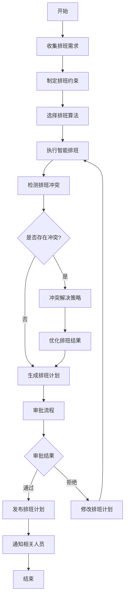

**流程说明**:
1. **需求收集**: 收集部门排班需求、员工偏好、业务约束
2. **算法选择**: 根据排班复杂度选择合适的算法（遗传算法、贪心算法）
3. **冲突检测**: 自动检测时间冲突、人员冲突、技能冲突
4. **智能优化**: 基于优化目标（成本、满意度、合规性）进行排班优化
5. **审批发布**: 多级审批流程，审批通过后自动通知相关人员

#### 1.2 轮班流程

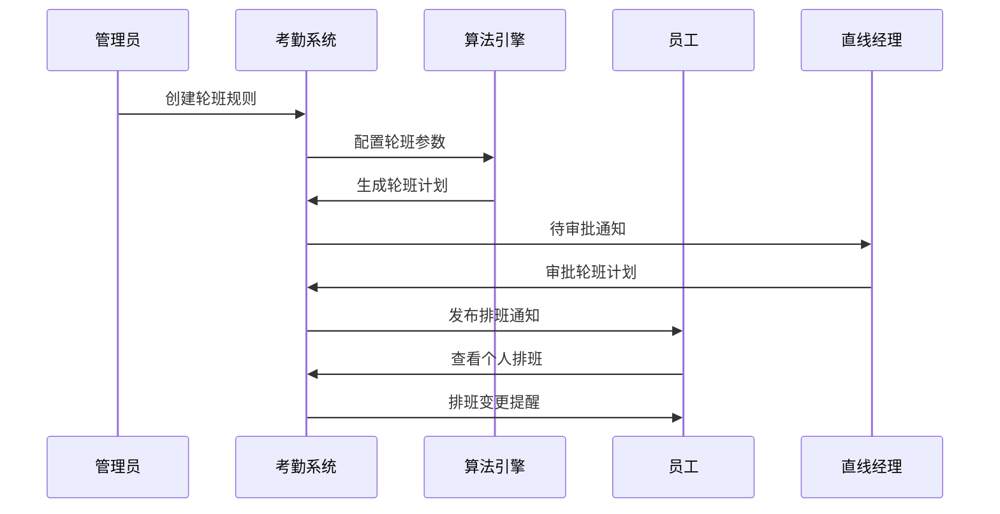

### 2. 考勤打卡流程

#### 2.1 多模态打卡流程

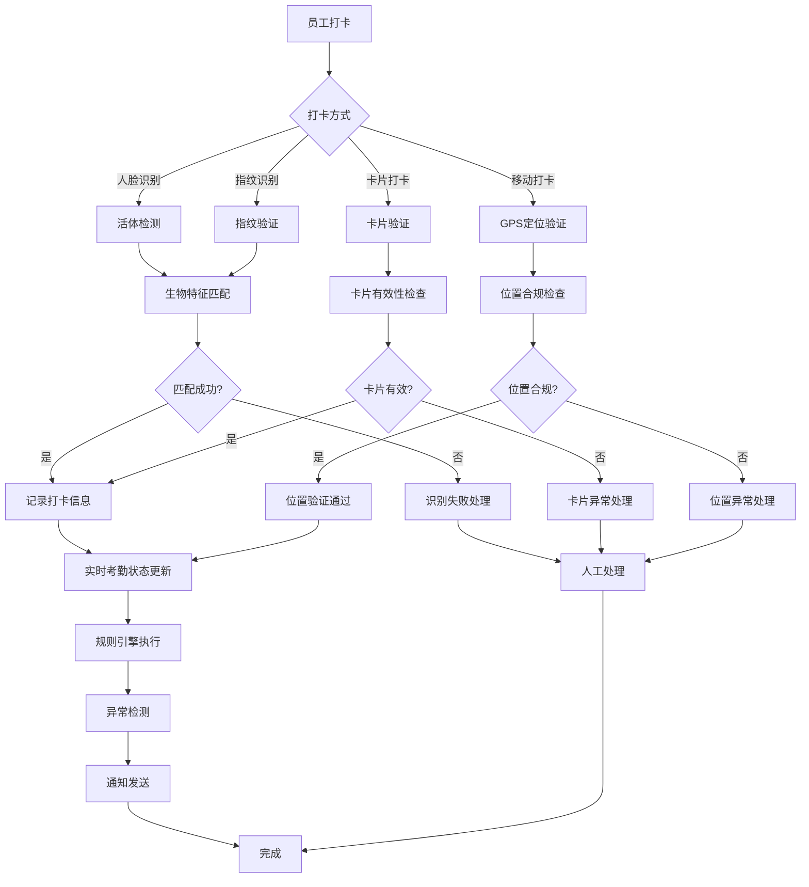

**关键特性**:
- **多模态融合**: 支持多种打卡方式，提高识别准确率
- **活体检测**: 防止照片、视频等欺诈行为
- **实时验证**: 打卡过程中的实时身份验证和位置验证
- **异常处理**: 针对异常情况的多层次处理机制

#### 2.2 考勤异常处理流程

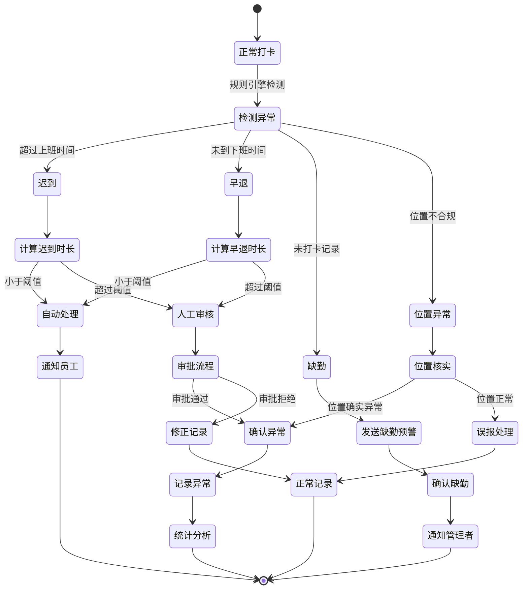

### 3. 假勤管理流程

#### 3.1 请假申请流程

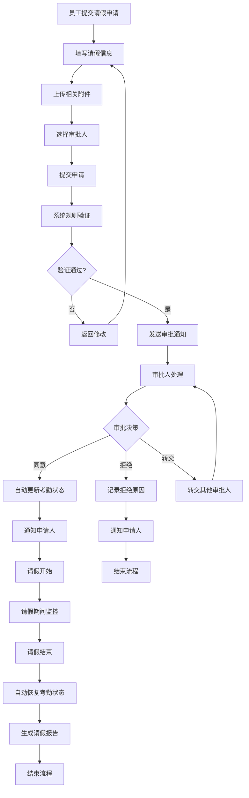

#### 3.2 加班申请流程

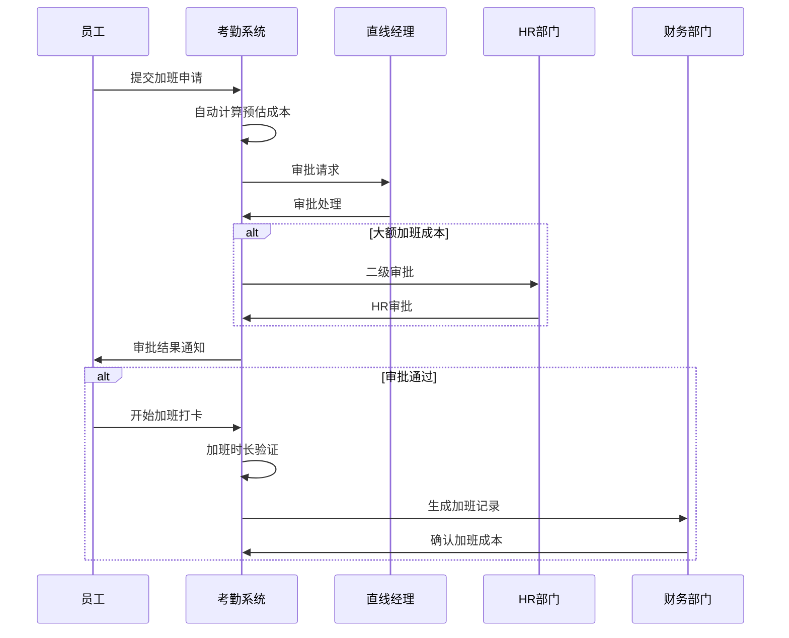

### 4. 考勤统计流程

#### 4.1 实时考勤统计

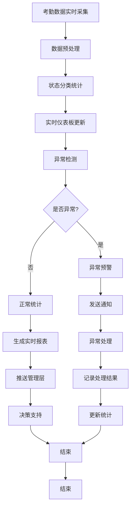

#### 4.2 月度考勤汇总流程

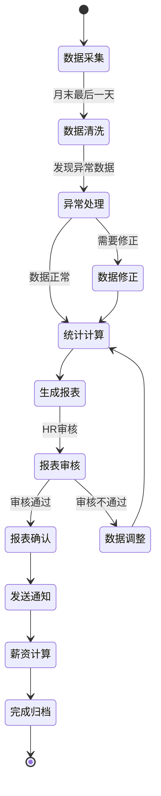

---

## 🔗 跨模块业务流程

### 1. 考勤-门禁联动流程

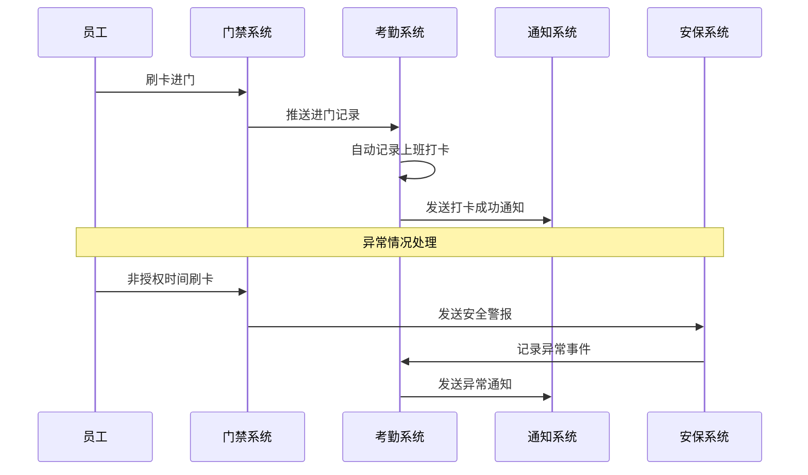

### 2. 考勤-薪酬联动流程

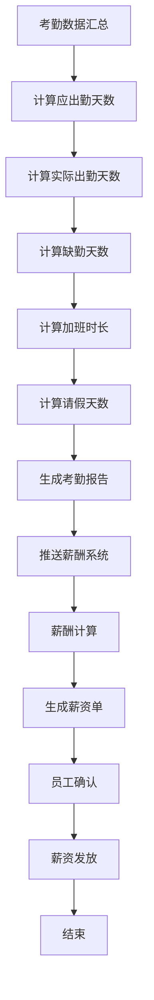

### 3. 考勤-OA系统联动流程

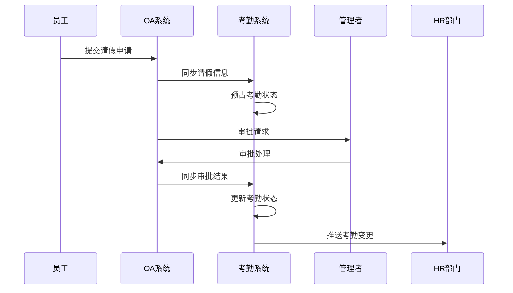

---

## ⚙️ 规则引擎处理流程

### 1. 规则执行引擎

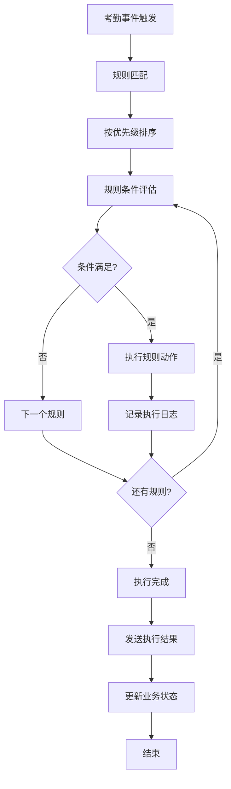

### 2. 异常规则处理

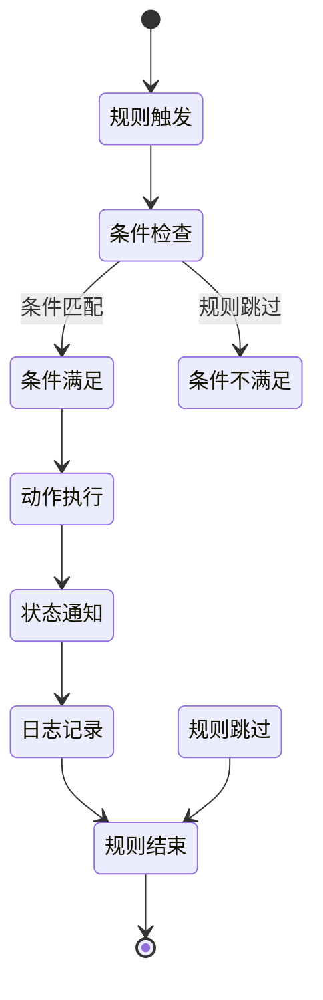

---

## 📱 移动端业务流程

### 1. 移动打卡流程

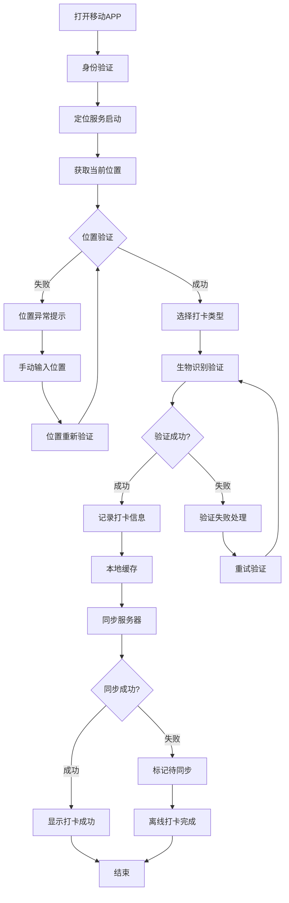

### 2. 移动审批流程

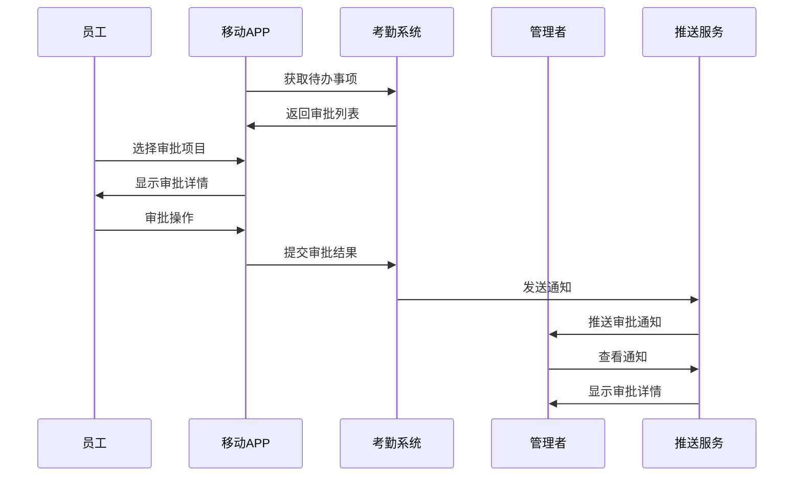

---

## 🔄 异常处理流程

### 1. 数据异常处理

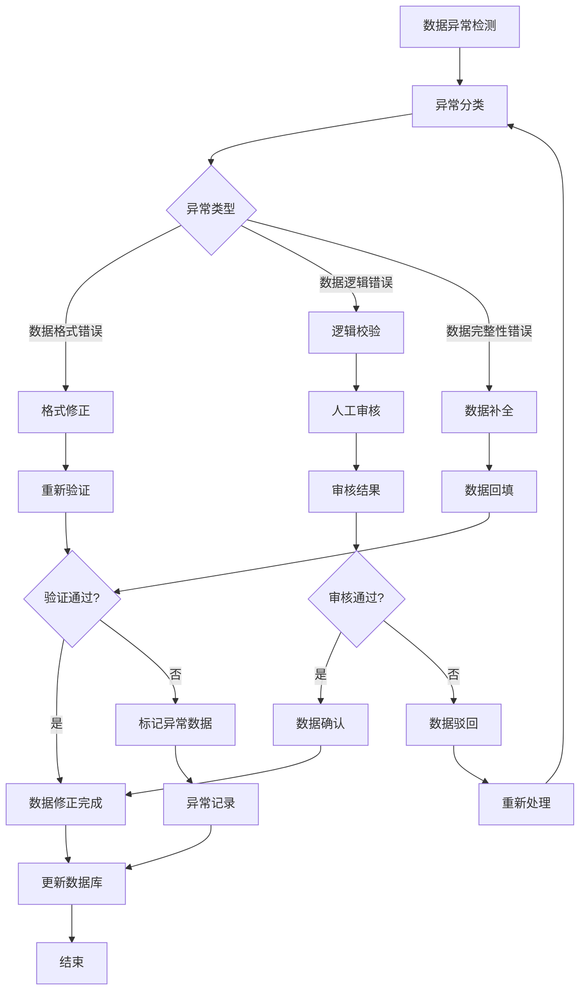

### 2. 系统异常处理

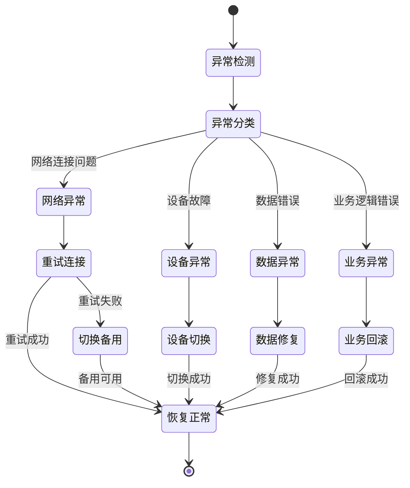

---

## 📊 统计分析流程

### 1. 实时统计流程

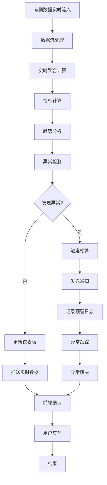

### 2. 定期统计流程

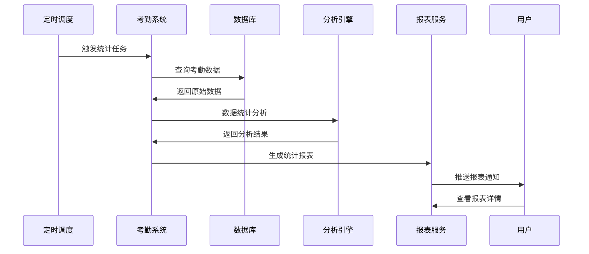

---

## 🔔 通知推送流程

### 1. 实时通知流程

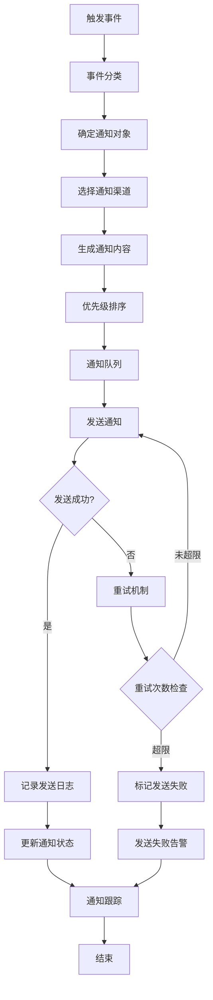

### 2. 批量通知流程

```mermaid
stateDiagram-v2
    [*] --> 批量通知任务
    批量通知任务 --> 接收人分组
    接收人分组 --> 内容模板化
    内容模板化 --> 批量发送
    批量发送 --> 发送监控
    发送监控 --> 发送完成
    发送完成 --> 统计分析
    统计分析 --> [*]

    批量发送 --> 发送失败
    发送失败 --> 失败处理
    失败处理 --> 重试发送
    重试发送 --> 发送监控
```

---

## 🎯 业务优化流程

### 1. 智能优化流程

```mermaid
flowchart TD
    A[历史数据分析] --> B[模式识别]
    B --> C[问题诊断]
    C --> D[优化方案生成]
    D --> E[方案评估]
    E --> F{方案可行性?}
    F -->|是| G[方案实施]
    F -->|否| H[方案调整]
    H --> D
    G --> I[效果监控]
    I --> J[效果评估]
    J --> K{效果满意?}
    K -->|是| L[方案固化]
    K -->|否| M[反馈优化]
    M --> B
    L --> N[持续监控]
    N --> O[结束]
```

### 2. 排班优化流程

```mermaid
sequenceDiagram
    participant Admin as 管理员
    participant System as 考勤系统
    participant Algorithm as 优化算法
    participant DataCollector as 数据收集器
    participant Feedback as 反馈系统

    Admin->>System: 触发排班优化
    System->>DataCollector: 收集历史数据
    DataCollector->>Algorithm: 提供优化输入
    Algorithm->>Algorithm: 执行优化算法
    Algorithm->>System: 返回优化方案
    System->>Admin: 展示优化结果
    Admin->>Feedback: 提供优化反馈
    Feedback->>Algorithm: 算法参数调整
    Algorithm->>System: 重新优化
```

---

## 📚 流程监控与改进

### 1. 流程监控指标

- **执行效率**: 各环节处理时间、整体流程耗时
- **准确率**: 数据处理准确率、异常检测准确率
- **用户满意度**: 流易用性、响应及时性
- **系统稳定性**: 流程成功率、异常处理率

### 2. 持续改进机制

- **定期评估**: 月度流程效率评估和优化建议
- **用户反馈**: 收集用户使用反馈，持续优化流程
- **技术升级**: 引入新技术提升流程自动化水平
- **最佳实践**: 总结最佳实践，推广到其他业务场景

---

**💡 考勤系统业务流程设计以用户为中心，通过智能化、自动化的流程管理，实现高效、准确的考勤管理，为企业人力资源管理提供强有力的技术支撑。**