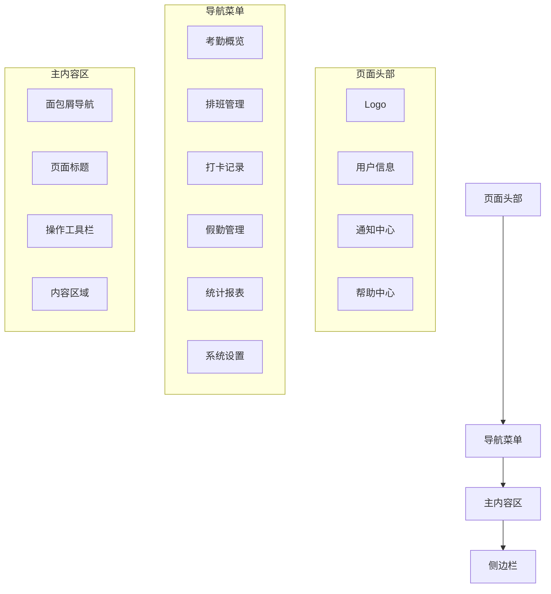

# 考勤系统界面设计

> **设计风格**: 现代化、简洁、高效
> **设计原则**: 以用户为中心、直观易用、响应式设计
> **技术框架**: Vue 3 + Ant Design Vue + Vite
> **设计规范**: 遵循项目UI设计规范，保持视觉一致性
> **更新日期**: 2025-12-16

---

## 📋 界面设计概述

考勤系统界面设计以提升用户体验为核心，采用现代化的设计语言和交互模式，为不同角色的用户提供直观、高效的界面体验，确保功能的易用性和美观性的平衡。

### 🎯 设计目标

- **用户体验优先**: 简化操作流程，降低学习成本
- **视觉一致性**: 统一的设计语言和组件库
- **响应式设计**: 适配不同设备和屏幕尺寸
- **信息可视化**: 通过图表和颜色直观展示数据
- **操作便捷性**: 提供快捷操作和智能提示

---

## 🎨 设计规范

### 1. 色彩规范

#### 1.1 主色调
```css
/* 主色调 - 蓝色系 */
--primary-color: #1890ff;        /* 主按钮、链接 */
--primary-hover: #40a9ff;       /* 主按钮悬停 */
--primary-active: #096dd9;      /* 主按钮激活 */
--primary-light: #e6f7ff;        /* 主按钮浅色背景 */

/* 辅助色调 */
--success-color: #52c41a;        /* 成功状态 */
--warning-color: #faad14;        /* 警告状态 */
--error-color: #f5222d;          /* 错误状态 */
--info-color: #13c2c2;           /* 信息状态 */

/* 中性色 */
--text-primary: #262626;        /* 主要文字 */
--text-secondary: #595959;      /* 次要文字 */
--text-disabled: #bfbfbf;        /* 禁用文字 */
--border-color: #d9d9d9;         /* 边框色 */
--background-color: #fafafa;     /* 背景色 */
```

#### 1.2 功能色彩映射
```css
/* 考勤状态色彩 */
--attendance-normal: #52c41a;    /* 正常出勤 - 绿色 */
--attendance-late: #faad14;       /* 迟到 - 橙色 */
--attendance-early: #1890ff;      /* 早退 - 蓝色 */
--attendance-absent: #f5222d;     /* 缺勤 - 红色 */
--attendance-leave: #722ed1;      /* 请假 - 紫色 */
--attendance-overtime: #fa8c16;   /* 加班 - 橙红色 */
```

### 2. 字体规范

#### 2.1 字体大小
```css
/* 字体大小 */
--font-size-xs: 12px;            /* 辅助信息 */
--font-size-sm: 14px;            /* 正文小字 */
--font-size-base: 16px;          /* 正文 */
--font-size-lg: 18px;            /* 小标题 */
--font-size-xl: 20px;            /* 标题 */
--font-size-xxl: 24px;           /* 大标题 */
```

#### 2.2 字重
```css
/* 字重 */
--font-weight-normal: 400;
--font-weight-medium: 500;
--font-weight-semibold: 600;
--font-weight-bold: 700;
```

### 3. 间距规范

#### 3.1 标准间距
```css
/* 间距 */
--spacing-xs: 4px;               /* 超小间距 */
--spacing-sm: 8px;               /* 小间距 */
--spacing-md: 16px;              /* 中等间距 */
--spacing-lg: 24px;              /* 大间距 */
--spacing-xl: 32px;              /* 超大间距 */
```

---

## 🖥️ Web端界面设计

### 1. 整体布局

#### 1.1 页面结构


#### 1.2 响应式布局
```css
/* 响应式断点 */
@media (max-width: 768px) {
  /* 移动端布局 */
  .sidebar {
    transform: translateX(-100%);
  }

  .main-content {
    margin-left: 0;
  }
}

@media (min-width: 769px) and (max-width: 1024px) {
  /* 平板端布局 */
  .sidebar {
    width: 200px;
  }
}

@media (min-width: 1025px) {
  /* 桌面端布局 */
  .sidebar {
    width: 240px;
  }
}
```

### 2. 核心页面设计

#### 2.1 考勤概览仪表板

**页面描述**: 提供考勤数据的实时监控和分析
**布局设计**:

```
┌─────────────────────────────────────────────────────────────┐
│  考勤概览仪表板                                            │
├─────────────────────────────────────────────────────────────┤
│  今日考勤状态                                              │
│  ┌─────────┬─────────┬─────────┬─────────┬─────────┐         │
│  │ 总人数   │ 出勤    │ 缺勤    │ 迟到    │ 早退    │         │
│  │  1,250  │  1,180  │   45    │   18    │    7    │         │
│  │   🟢   │   🟢   │   🔴   │   🟡   │   🔵   │         │
│  └─────────┴─────────┴─────────┴─────────┴─────────┘         │
├─────────────────────────────────────────────────────────────┤
│  实时考勤活动                                              │
│  ┌─────────────────────────────────────────────────────────┐ │
│  │ 时间轴：09:00  员工张三   打卡成功   设备：前台考勤机        │ │
│  │        09:05  销售李四   迟到5分钟    原因：交通拥堵        │ │
│  │        09:10  技术王五   请假申请    类型：事假           │ │
│  └─────────────────────────────────────────────────────────┘ │
├─────────────────────────────────────────────────────────────┤
│  部门考勤率统计                                              │
│  ┌─────────────────────────────────────────────────────────┐ │
│  │ 技术部 ████████████████████████████████████████████ 95% │ │
│  │ 销售部 ████████████████████████████████████████████ 92% │ │
│  │ 行政部 ████████████████████████████████████████████ 98% │ │
│  │ 财务部 ████████████████████████████████████████████ 100%│ │
│  └─────────────────────────────────────────────────────────┘ │
└─────────────────────────────────────────────────────────────┘
```

**设计要点**:
- **数据可视化**: 使用图表、进度条、颜色编码直观展示数据
- **实时更新**: 关键数据实时更新，提供即时反馈
- **信息层次**: 重要信息突出显示，次要信息适当弱化
- **交互友好**: 支持点击查看详细信息和时间范围筛选

#### 2.2 排班管理页面

**页面描述**: 管理员工排班计划和时间安排
**布局设计**:

```
┌─────────────────────────────────────────────────────────────┐
│  排班管理                                                  │
├─────────────────────────────────────────────────────────────┤
│  [新建排班] [导入排班] [智能排班] [发布排班]                  │
├─────────────────────────────────────────────────────────────┤
│  筛选条件：部门选择 │ 时间范围 │ 班次类型 │ 状态           │
├─────────────────────────────────────────────────────────────┤
│  排班日历视图                                              │
│  ┌─────────────────────────────────────────────────────────┐ │
│  │   一月 2025                                              │ │
│  │  日  一  二  三  四  五  六  日                           │ │
│  │                ┌───┐              ┌───┐                    │ │
│  │  1   │   │   │ │ 张三 │              │ 李四 │                    │ │
│  │        │   │   │ 白班 │              │ 夜班 │                    │ │
│  │        │   │   └───┘              └───┘                    │ │
│  │  2   │   │   │                      ┌───┐                    │ │
│  │        │   │   │                      │ 王五 │                    │ │
│  │        │   │   │                      │ 轮休 │                    │ │
│  │        │   │   │                      └───┘                    │ │
│  └─────────────────────────────────────────────────────────┘ │
├─────────────────────────────────────────────────────────────┤
│  排班列表                                                  │
│  ┌─────────────────────────────────────────────────────────┐ │
│  │ 日期    │ 员工   │ 班次   │ 工作时间     │ 状态     │ 操作    │ │
│  │ 01-15  │ 张三  │ 白班  │ 09:00-18:00 │ 正常     │ 编辑    │ │
│  │ 01-15  │ 李四  │ 夜班  │ 22:00-06:00 │ 正常     │ 编辑    │ │
│  │ 01-15  │ 王五  │ 轮休  │ -           │ 休息     │ -      │ │
│  └─────────────────────────────────────────────────────────┘ │
└─────────────────────────────────────────────────────────────┘
```

**设计要点**:
- **日历视图**: 使用日历形式直观展示排班安排
- **颜色编码**: 不同班次使用不同颜色区分
- **拖拽操作**: 支持拖拽调整排班安排
- **冲突提示**: 排班冲突时明显提示并提供解决方案

#### 2.3 考勤记录页面

**页面描述**: 查看和管理考勤打卡记录
**布局设计**:

```
┌─────────────────────────────────────────────────────────────┐
│  考勤记录                                                  │
├─────────────────────────────────────────────────────────────┤
│  查询条件：时间范围 │ 员工姓名 │ 部门 │ 考勤状态 │ [查询] [重置] │
├─────────────────────────────────────────────────────────────┤
│  [导出记录] [批量处理] [异常处理]                            │
├─────────────────────────────────────────────────────────────┤
│  考勤记录列表                                              │
│  ┌─────────────────────────────────────────────────────────┐ │
│  │ 日期    │ 员工   │ 打卡时间    │ 类型 │ 状态  │ 操作     │ │
│  │ 01-15  │ 张三  │ 09:00:00   │ 上班 │ 正常  │ [详情]   │ │
│  │ 01-15  │ 张三  │ 18:30:00   │ 下班 │ 早退 │ [编辑]   │ │
│  │ 01-15  │ 李四  │ 08:58:00   │ 上班 │ 正常  │ [详情]   │ │
│  │ 01-15  │ 李四  │ 18:02:00   │ 下班 │ 正常  │ [详情]   │ │
│  │ 01-15  │ 王五  │ -           │ -    │ 缺勤 │ [补卡]   │ │
│  └─────────────────────────────────────────────────────────┘ │
├─────────────────────────────────────────────────────────────┤
│  分页：上一页 1 2 3 ... 10 下一页  共 250 条记录              │
└─────────────────────────────────────────────────────────────┘
```

**设计要点**:
- **状态标识**: 使用图标和颜色标识不同考勤状态
- **快速操作**: 提供详情查看、编辑、补卡等快捷操作
- **筛选排序**: 支持多条件筛选和排序功能
- **数据导出**: 支持Excel、PDF格式数据导出

#### 2.4 假勤管理页面

**页面描述**: 管理请假、加班、调班等假勤申请
**布局设计**:

```
┌─────────────────────────────────────────────────────────────┐
│  假勤管理                                                  │
├─────────────────────────────────────────────────────────────┤
│  [请假申请] [加班申请] [调班申请] [出差申请]                  │
├─────────────────────────────────────────────────────────────┤
│  筛选：申请类型 │ 审批状态 │ 申请日期 │ 申请人             │
├─────────────────────────────────────────────────────────────┤
│  申请列表                                                  │
│  ┌─────────────────────────────────────────────────────────┐ │
│  │ 申请单号   │ 申请人 │ 类型    │ 时间范围   │ 状态     │ 操作  │ │
│  │ LE202501015│ 张三  │ 事假   │ 01-16~01-17│ 待审批 │ [审批]│ │
│  │ OV202501015│ 李四  │ 工作日 │ 01-15 19:00 │ 已通过 │ [详情]│ │
│  │ SW202501015│ 王五  │ 调班   │ 01-16     │ 待审批 │ [审批]│ │
│  │ TR202501015│ 赵六  │ 出差   │ 01-18~01-20│ 审批中 │ [详情]│ │
│  └─────────────────────────────────────────────────────────┘ │
├─────────────────────────────────────────────────────────────┤
│  我申请的假勤                                              │
│  ┌─────────────────────────────────────────────────────────┐ │
│  │ 申请中：2个  已批准：8个  已拒绝：1个                  │ │
│  │ ─────────────────────────────────────────────────────── │ │
│  │ 最近申请：                                                │ │
│  │ • 事假申请 01-16~01-17 2025-01-15 提交                   │ │
│  │ • 加班申请 01-15 19:00~22:00 2025-01-14 提交             │ │
│  └─────────────────────────────────────────────────────────┘ │
└─────────────────────────────────────────────────────────────┘
```

**设计要点**:
- **分类管理**: 不同类型假勤申请分类管理
- **状态跟踪**: 清晰的审批状态跟踪
- **批量操作**: 支持批量审批和处理
- **个人中心**: 我申请的假勤集中展示

#### 2.5 统计报表页面

**页面描述**: 生成和查看各类考勤统计报表
**布局设计**:

```
┌─────────────────────────────────────────────────────────────┐
│  统计报表                                                  │
├─────────────────────────────────────────────────────────────┤
│  [生成报表] [模板管理] [定时发送]                            │
├─────────────────────────────────────────────────────────────┤
│  报表类型：考勤月报 │ 出勤统计 │ 加班分析 │ 假勤统计         │
├─────────────────────────────────────────────────────────────┤
│  图表展示                                                  │
│  ┌─────────────────────────────────────────────────────────┐ │
│  │ 部门出勤率趋势图                                        │ │
│  │ 100% ────────────────────────────────────────           │ │
│  │  95% ────────┐                                        │ │
│  │  90% ──────┐   ────────┐                              │ │
│  │     1月   2月   3月   4月   5月   6月                   │ │
│  └─────────────────────────────────────────────────────────┘ │
│  ┌─────────────────────────────────────────────────────────┐ │
│  │ 加班时长分布图                                          │ │
│  │  0-2小时  ████████████████████████████████████ 45%    │ │
│  │  2-4小时  ████████████████ 20%                        │ │
│  │  4-6小时  ████████ 10%                                 │ │
│  │  6小时以上  ██ 5%                                      │ │
│  └─────────────────────────────────────────────────────────┘ │
├─────────────────────────────────────────────────────────────┤
│  数据表格                                                  │
│  ┌─────────────────────────────────────────────────────────┐ │
│  │ 指标       │ 本月数值 │ 上月数值 │ 同比变化  │ 备注      │ │
│  │ 总出勤率   │ 95.8%   │ 94.2%   │ +1.6%   │          │ │
│  │ 平均加班时长│ 3.2h/人 │ 3.5h/人 │ -8.6%   │          │ │
│  │ 请假率     │ 4.2%    │ 5.1%    │ -17.6%  │          │ │
│  └─────────────────────────────────────────────────────────┘ │
└─────────────────────────────────────────────────────────────┘
```

**设计要点**:
- **图表可视化**: 使用柱状图、饼图、折线图等展示数据
- **数据对比**: 支持同比、环比分析
- **交互功能**: 图表支持交互式操作
- **导出功能**: 支持图表和数据表格导出

### 3. 移动端界面设计

#### 3.1 移动端首页

**页面描述**: 移动端首页，提供快速访问入口
**布局设计**:

```
┌─────────────────────────┐
│  考勤管理                 │
├─────────────────────────┤
│  👋 早上好，张三          │
│  今日：正常出勤           │
├─────────────────────────┤
│  🎯 快捷操作             │
│  ┌─────┬─────┬─────┐     │
│  │ 打卡 │ 请假 │ 加班 │     │
│  └─────┴─────┴─────┘     │
├─────────────────────────┤
│  📊 今日考勤状态         │
│  ┌─────────────────────┐ │
│  │ 出勤: 1,180人       │ │
│  │ 缺勤: 45人          │ │
│  │ 迟到: 18人          │ │
│  │ 早退: 7人           │ │
│  └─────────────────────┘ │
├─────────────────────────┤
│  📋 最近活动             │
│  • 09:00 打卡成功        │
│  • 10:30 收到加班审批    │
│  • 14:20 请假申请已批准  │
├─────────────────────────┤
│  📱 底部导航             │
│  [首页][打卡][记录][我的] │
└─────────────────────────┘
```

#### 3.2 移动端打卡页面

**页面描述**: 移动端打卡功能页面
**布局设计**:

```
┌─────────────────────────┐
│  考勤打卡                 │
├─────────────────────────┤
│  📍 当前位置：总部大楼    │
│  ⏰ 当前时间：09:00:25    │
├─────────────────────────┤
│  🎯 打卡方式             │
│  ┌─────────────────────┐ │
│  │    👤 人脸识别       │ │
│  │   [开始人脸识别]      │ │
│  └─────────────────────┘ │
│  ┌─────────────────────┐ │
│  │    👆 指纹识别       │ │
│  │   [开始指纹识别]      │ │
│  └─────────────────────┘ │
│  ┌─────────────────────┐ │
│  │    📱 手机验证       │ │
│  │   [验证位置并打卡]   │ │
│  └─────────────────────┘ │
├─────────────────────────┤
│  📊 今日考勤记录         │
│  上班：08:58 ✅          │
│  下班：--:-- ⏳          │
├─────────────────────────┤
│  [历史记录] [设置] [帮助] │
└─────────────────────────┘
```

---

## 🎨 组件设计规范

### 1. 表单组件

#### 1.1 请假申请表单
```vue
<template>
  <a-form :model="form" :rules="rules" layout="vertical">
    <a-form-item label="请假类型" name="leaveType" required>
      <a-select v-model:value="form.leaveType" placeholder="请选择请假类型">
        <a-select-option value="SICK">病假</a-select-option>
        <a-select-option value="PERSONAL">事假</a-select-option>
        <a-select-option value="ANNUAL">年假</a-select-option>
      </a-select>
    </a-form-item>

    <a-form-item label="请假时间" name="dateRange" required>
      <a-range-picker
        v-model:value="form.dateRange"
        show-time
        format="YYYY-MM-DD HH:mm"
      />
    </a-form-item>

    <a-form-item label="请假原因" name="reason" required>
      <a-textarea
        v-model:value="form.reason"
        :rows="4"
        placeholder="请输入请假原因"
      />
    </a-form-item>

    <a-form-item label="附件" name="attachments">
      <a-upload
        v-model:file-list="form.attachments"
        :before-upload="() => false"
      >
        <a-button>
          <upload-outlined />
          上传附件
        </a-button>
      </a-upload>
    </a-form-item>
  </a-form>
</template>
```

### 2. 图表组件

#### 2.1 考勤趋势图
```vue
<template>
  <div class="attendance-chart">
    <div class="chart-header">
      <h3>出勤率趋势</h3>
      <a-radio-group v-model:value="timeRange">
        <a-radio-button value="week">周</a-radio-button>
        <a-radio-button value="month">月</a-radio-button>
        <a-radio-button value="year">年</a-radio-button>
      </a-radio-group>
    </div>
    <div ref="chartRef" class="chart-container"></div>
  </div>
</template>
```

### 3. 状态指示器

#### 3.1 考勤状态标签
```vue
<template>
  <a-tag
    :color="getStatusColor(status)"
    class="attendance-status-tag"
  >
    <template #icon>
      <component :is="getStatusIcon(status)" />
    </template>
    {{ getStatusText(status) }}
  </a-tag>
</template>

<script setup>
const getStatusColor = (status) => {
  const colors = {
    NORMAL: 'success',
    LATE: 'warning',
    EARLY: 'processing',
    ABSENT: 'error',
    LEAVE: 'purple'
  }
  return colors[status] || 'default'
}
</script>
```

---

## 📱 响应式设计

### 1. 移动端适配

#### 1.1 断点设置
```css
/* 移动端断点 */
@media (max-width: 768px) {
  .container {
    padding: 16px;
  }

  .card {
    margin-bottom: 16px;
    border-radius: 8px;
  }

  .table-container {
    overflow-x: auto;
  }
}
```

#### 1.2 触摸优化
```css
/* 触摸优化 */
.btn {
  min-height: 44px;
  min-width: 44px;
}

.clickable {
  cursor: pointer;
  -webkit-tap-highlight-color: transparent;
}

.swipe-action {
  touch-action: pan-y;
}
```

### 2. 暗色主题支持

#### 2.1 暗色模式
```css
/* 暗色主题 */
[data-theme="dark"] {
  --bg-color: #141414;
  --text-color: #ffffff;
  --border-color: #434343;
  --primary-color: #177ddc;
}

.dark-mode-toggle {
  position: fixed;
  top: 20px;
  right: 20px;
  z-index: 1000;
}
```

---

## 🎯 交互设计

### 1. 操作反馈

#### 1.1 加载状态
```vue
<template>
  <a-spin :spinning="loading">
    <div class="content">
      <!-- 内容 -->
    </div>
  </a-spin>
</template>
```

#### 1.2 操作确认
```vue
<template>
  <a-modal
    v-model:visible="visible"
    title="确认删除"
    @ok="handleConfirm"
  >
    <p>确定要删除这条记录吗？此操作不可恢复。</p>
  </a-modal>
</template>
```

### 2. 数据展示

#### 2.1 空状态
```vue
<template>
  <a-empty
    v-if="!hasData"
    description="暂无数据"
  >
    <template #image>
      
    </template>
    <a-button type="primary" @click="handleRefresh">
      刷新数据
    </a-button>
  </a-empty>
</template>
```

---

## 🔧 可访问性设计

### 1. 键盘导航

```css
/* 键盘导航焦点样式 */
.focusable:focus {
  outline: 2px solid #1890ff;
  outline-offset: 2px;
}

.skip-link {
  position: absolute;
  top: -40px;
  left: 6px;
  background: #1890ff;
  color: white;
  padding: 8px;
  text-decoration: none;
  z-index: 1000;
}

.skip-link:focus {
  top: 6px;
}
```

### 2. 屏幕阅读器支持

```html
<!-- 语义化标签 -->
<main role="main" aria-label="考勤管理">
  <section aria-labelledby="attendance-overview">
    <h2 id="attendance-overview">考勤概览</h2>
    <!-- 内容 -->
  </section>
</main>

<!-- ARIA标签 -->
<button
  aria-label="删除记录"
  aria-describedby="delete-warning"
>
  删除
</button>
<div id="delete-warning" class="sr-only">
  删除操作不可恢复，请谨慎操作
</div>
```

---

## 📚 设计系统文档

### 1. 设计原则
- **用户中心**: 以用户需求和体验为中心
- **一致性**: 保持视觉和交互的一致性
- **简洁性**: 界面简洁明了，操作流程清晰
- **高效性**: 提供高效的完成任务路径
- **可访问性**: 支持无障碍访问

### 2. 设计资源
- **色彩规范**: 标准化的色彩搭配和使用指南
- **字体规范**: 统一的字体大小和行高规范
- **图标规范**: 一致的图标风格和使用规则
- **组件库**: 可复用的UI组件和模式

### 3. 质量标准
- **可用性**: 用户能够顺利完成目标任务
- **满意度**: 用户对界面体验的满意度
- **效率性**: 完成任务的时间和步骤数
- **错误率**: 用户操作错误的频率

---

**💡 考勤系统界面设计遵循现代化设计理念，通过统一的设计语言和交互模式，为用户提供直观、高效、美观的使用体验。**