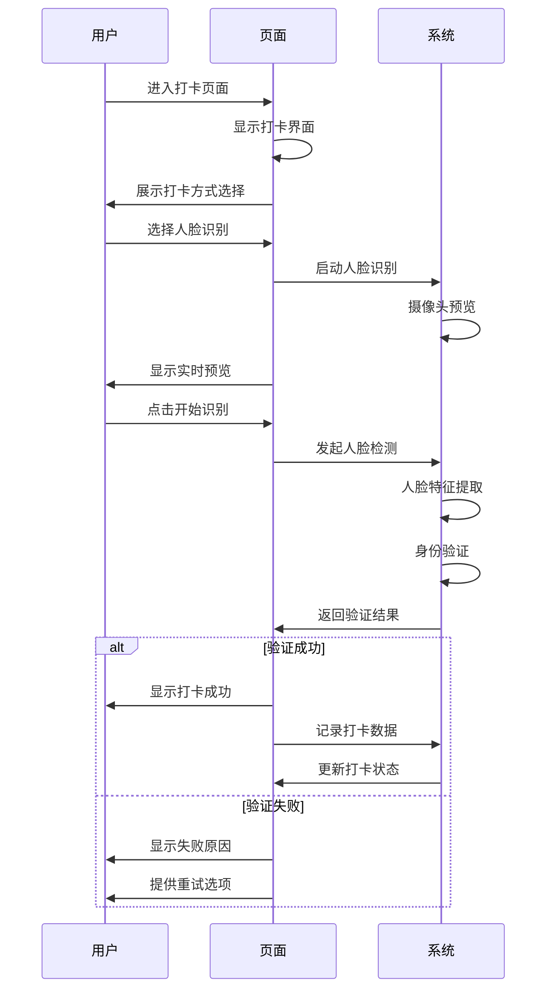
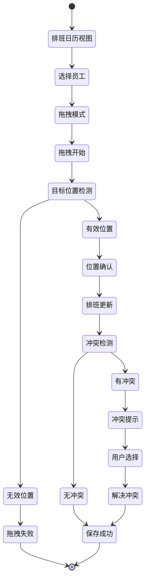
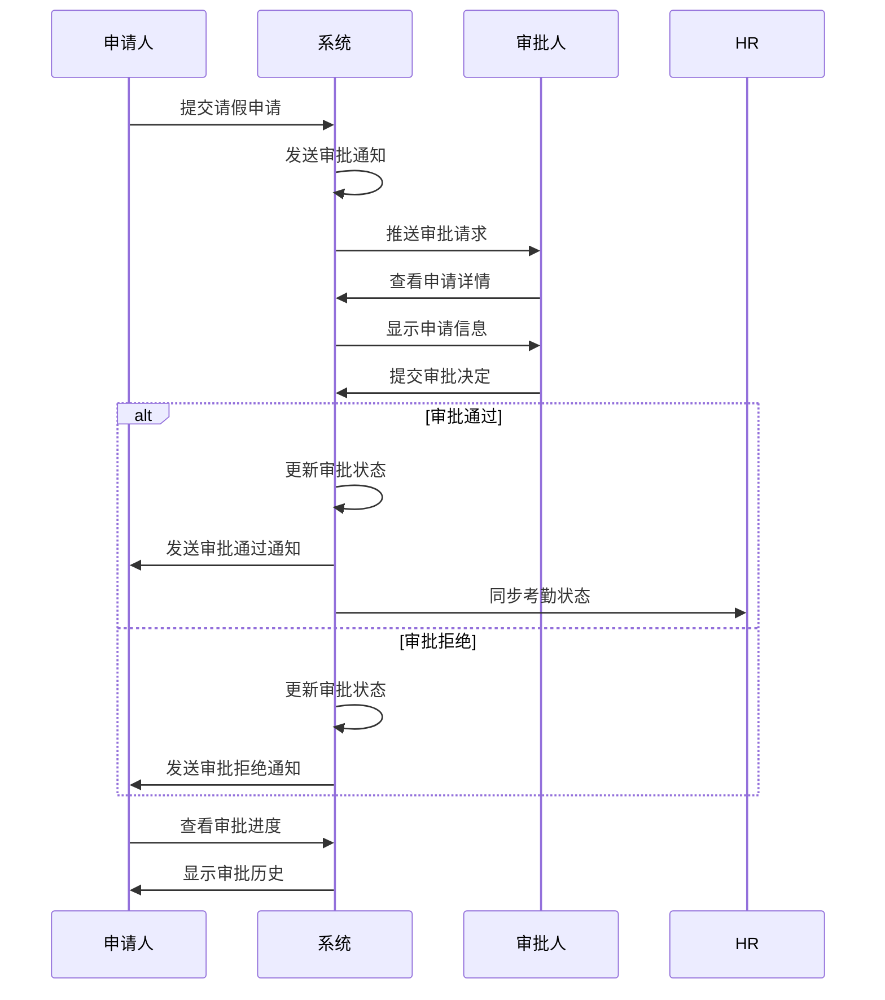

# 考勤系统页面交互说明

> **交互目标**: 提供直观、高效、易用的用户交互体验
> **交互原则**: 简化操作流程、减少认知负荷、提供即时反馈
> **技术实现**: Vue 3 + Ant Design Vue + 手势识别
> **适用平台**: Web端 + 移动端 (Android/iOS)
> **更新日期**: 2025-12-16

---

## 📋 交互设计概述

考勤系统页面交互设计以用户为中心，通过科学的交互模式和友好的界面反馈，为不同角色用户提供高效、直观的操作体验，确保用户能够快速完成各项考勤任务。

### 🎯 交互设计原则

- **效率优先**: 提供最短路径完成目标任务
- **认知减负**: 减少用户思考和记忆负担
- **反馈及时**: 每个操作都有明确的反馈
- **容错设计**: 允许用户犯错并提供恢复机制
- **一致性**: 保持交互模式的一致性

---

## 🖥️ Web端交互设计

### 1. 考勤打卡交互

#### 1.1 打卡流程



**交互细节**:
- **视觉反馈**: 识别过程中显示加载动画和进度提示
- **声音反馈**: 识别成功/失败时播放不同音效
- **错误处理**: 识别失败时显示具体原因和解决方案
- **自动完成**: 成功后自动跳转到结果页面

#### 1.2 多方式打卡切换

**交互流程**:
```vue
<template>
  <div class="punch-methods">
    <div
      v-for="method in methods"
      :key="method.id"
      :class="['method-item', { active: activeMethod === method.id }]"
      @click="switchMethod(method.id)"
    >
      <div class="method-icon">
        <component :is="method.icon" />
      </div>
      <div class="method-name">{{ method.name }}</div>
      <div class="method-desc">{{ method.description }}</div>
    </div>
  </div>
</template>

<script>
const switchMethod = (methodId) => {
  activeMethod.value = methodId
  // 根据选择的打卡方式更新界面
  updatePunchInterface(methodId)
}
</script>
```

**交互特性**:
- **平滑过渡**: 切换打卡方式时有平滑的动画效果
- **状态保持**: 记住用户上一次的打卡方式选择
- **快捷键**: 支持数字键快捷切换打卡方式

### 2. 排班管理交互

#### 2.1 拖拽排班

**交互说明**:


**拖拽交互代码**:
```vue
<template>
  <div
    class="draggable-employee"
    :class="{ dragging: isDragging }"
    draggable="true"
    @dragstart="handleDragStart"
    @dragend="handleDragEnd"
    @dragover.prevent="handleDragOver"
    @drop.prevent="handleDrop"
  >
    {{ employee.name }}
  </div>
</template>

<script>
const handleDragStart = (event) => {
  isDragging.value = true
  // 设置拖拽数据
  event.dataTransfer.setData('text/plain', JSON.stringify(employee.value))
}

const handleDrop = (event) => {
  isDragging.value = false
  // 获取拖拽数据
  const data = JSON.parse(event.dataTransfer.getData('text/plain'))
  // 处理排班逻辑
  handleScheduleChange(data, targetSlot)
}
</script>
```

#### 2.2 排班冲突处理

**交互流程**:
1. **冲突检测**: 实时检测排班冲突
2. **冲突提示**: 在界面上明显标识冲突
3. **解决方案**: 提供多种冲突解决方案
4. **智能推荐**: 系统推荐最优解决方案

```vue
<template>
  <a-modal
    v-model:visible="conflictModal"
    title="排班冲突处理"
    @ok="handleConflictResolution"
  >
    <div class="conflict-content">
      <a-alert
        type="warning"
        show-icon
        :message="conflictMessage"
      />

      <div class="solutions">
        <h4>解决方案：</h4>
        <a-radio-group v-model:value="selectedSolution">
          <a-radio :value="1">
            <span>调整时间：{{ solution1.time }}</span>
            <span class="impact">影响：{{ solution1.impact }}</span>
          </a-radio>
          <a-radio :value="2">
            <span>更换人员：{{ solution2.person }}</span>
            <span class="impact">影响：{{ solution2.impact }}</span>
          </a-radio>
          <a-radio :value="3">
            <span>手动处理</span>
          </a-radio>
        </a-radio-group>
      </div>
    </div>
  </a-modal>
</template>
```

### 3. 请假申请交互

#### 3.1 智能请假时间计算

**交互特性**:
- **智能计算**: 根据选择的请假类型自动计算请假时长
- **日历联动**: 选择日期时自动排除节假日
- **实时预览**: 实时显示请假对排班的影响
- **冲突提示**: 自动检测请假与重要排班的冲突

```vue
<template>
  <div class="leave-application">
    <a-form-item label="请假时间" required>
      <a-range-picker
        v-model:value="dateRange"
        show-time
        format="YYYY-MM-DD HH:mm"
        :disabled-date="disabledDate"
        @change="calculateDuration"
      />
    </a-form-item>

    <a-form-item label="请假时长">
      <div class="duration-display">
        <span class="days">{{ calculatedDays }}天</span>
        <span class="hours">{{ calculatedHours }}小时</span>
      </div>
    </a-form-item>

    <div class="impact-preview" v-if="showPreview">
      <h4>排班影响预览</h4>
      <a-timeline>
        <a-timeline-item
          v-for="impact in scheduleImpacts"
          :key="impact.date"
          :color="impact.color"
        >
          {{ impact.date }}: {{ impact.message }}
        </a-timeline-item>
      </a-timeline>
    </div>
  </div>
</template>
```

#### 3.2 审批进度追踪

**交互流程**:


**进度追踪界面**:
```vue
<template>
  <div class="approval-tracking">
    <a-steps :current="currentStep" status="process">
      <a-step title="提交申请" :description="submitTime" />
      <a-step title="等待审批" :description="waitingTime" />
      <a-step title="审批中" :description="processingTime" />
      <a-step title="审批完成" :description="completedTime" />
    </a-steps>

    <div class="approval-actions">
      <a-button @click="withdrawApplication" v-if="canWithdraw">
        撤销申请
      </a-button>
      <a-button type="primary" @click="viewDetails">
        查看详情
      </a-button>
    </div>
  </div>
</template>
```

---

## 📱 移动端交互设计

### 1. 移动端打卡交互

#### 1.1 手势识别

**支持的手势**:
- **点击**: 基本操作（选择、确认）
- **滑动**: 切换页面、查看更多
- **长按**: 显示上下文菜单
- **双击**: 快速操作（详情查看）

```vue
<template>
  <div class="mobile-punch" @touchstart="handleTouchStart" @touchmove="handleTouchMove" @touchend="handleTouchEnd">
    <div class="punch-button" :class="{ active: isActive }">
      <div class="punch-icon">
        <fingerprint-outlined />
      </div>
      <div class="punch-text">点击打卡</div>
    </div>

    <!-- 长按菜单 -->
    <div class="context-menu" v-if="showContextMenu" :style="menuStyle">
      <div class="menu-item" @click="switchMethod">
        <swap-outlined /> 切换方式
      </div>
      <div class="menu-item" @click="viewHistory">
        <history-outlined /> 历史记录
      </div>
    </div>
  </div>
</template>

<script>
let touchStartTime = 0
let touchStartY = 0

const handleTouchStart = (event) => {
  touchStartTime = Date.now()
  touchStartY = event.touches[0].clientY
}

const handleTouchEnd = (event) => {
  const touchDuration = Date.now() - touchStartTime
  const touchEndY = event.changedTouches[0].clientY

  // 长按判断
  if (touchDuration > 500) {
    showContextMenu.value = true
    menuStyle.value = {
      top: `${touchStartY}px`
    }
  }
}
</script>
```

#### 1.2 位置验证交互

**交互流程**:
1. **自动定位**: 自动获取当前位置
2. **地图显示**: 在地图上显示当前位置
3. **验证范围**: 显示允许的打卡范围
4. **手动调整**: 支持手动调整位置

```vue
<template>
  <div class="location-verification">
    <div class="map-container">
      <div class="current-location">
        <div class="location-marker"></div>
      </div>
      <div class="allowed-area"></div>
    </div>

    <div class="location-info">
      <p>当前位置：{{ currentAddress }}</p>
      <p>距离办公地点：{{ distance }}米</p>
    </div>

    <div class="location-status" :class="locationStatus">
      <a-tag :color="statusColor">
        <template #icon>
          <check-circle-outlined v-if="isWithinRange" />
          <close-circle-outlined v-else />
        </template>
        {{ statusText }}
      </a-tag>
    </div>

    <div class="location-actions" v-if="!isWithinRange">
      <a-button @click="refreshLocation">刷新位置</a-button>
      <a-button @click="manualLocation">手动定位</a-button>
    </div>
  </div>
</template>
```

### 2. 移动端审批交互

#### 2.1 快速审批手势

**支持的操作**:
- **上滑**: 快速同意
- **下滑**: 快速拒绝
- **左滑**: 转交他人
- **右滑**: 查看详情

```vue
<template>
  <div
    class="approval-card"
    @touchstart="handleSwipeStart"
    @touchend="handleSwipeEnd"
    @touchmove="handleSwipeMove"
  >
    <div class="card-content">
      <div class="applicant-info">
        <a-avatar :src="applicant.avatar" />
        <div class="applicant-details">
          <div class="name">{{ applicant.name }}</div>
          <div class="department">{{ applicant.department }}</div>
        </div>
      </div>

      <div class="request-info">
        <div class="request-type">{{ request.type }}</div>
        <div class="request-time">{{ request.duration }}</div>
      </div>
    </div>

    <div class="swipe-actions" :class="swipeDirection">
      <div class="action approve" v-if="swipeDirection === 'left'">
        <thumb-up-outlined />
        同意
      </div>
      <div class="action reject" v-if="swipeDirection === 'right'">
        <thumb-down-outlined />
        拒绝
      </div>
    </div>
  </div>
</template>

<script>
let startX = 0
let currentX = 0
let swipeDirection = null

const handleSwipeStart = (event) => {
  startX = event.touches[0].clientX
  swipeDirection = null
}

const handleSwipeEnd = (event) => {
  const endX = event.changedTouches[0].clientX
  const deltaX = endX - startX

  if (Math.abs(deltaX) > 50) {
    swipeDirection = deltaX > 0 ? 'right' : 'left'
    handleApproval(swipeDirection)
  }
}
</script>
```

---

## 🎨 通用交互模式

### 1. 表单交互

#### 1.1 实时验证

**验证时机**:
- **输入时**: 用户输入过程中实时验证
- **失焦时**: 输入框失焦时验证
- **提交时**: 表单提交前完整验证

```vue
<template>
  <a-form
    :model="form"
    :rules="rules"
    @finish="handleSubmit"
    @validate="handleValidate"
  >
    <a-form-item
      label="请假原因"
      name="reason"
      :validate-status="validateStatus.reason"
      :help="helpText.reason"
    >
      <a-textarea
        v-model:value="form.reason"
        :rows="4"
        placeholder="请输入请假原因"
        @blur="validateField('reason')"
      />
    </a-form-item>
  </a-form>
</template>

<script>
const validateField = async (fieldName) => {
  try {
    await formRef.value.validateField(fieldName)
    validateStatus.value[fieldName] = 'success'
    helpText.value[fieldName] = ''
  } catch (error) {
    validateStatus.value[fieldName] = 'error'
    helpText.value[fieldName] = error.message
  }
}
</script>
```

#### 1.2 智能提示

**提示类型**:
- **输入提示**: 根据用户输入提供智能建议
- **错误提示**: 明确的错误原因和解决方案
- **操作提示**: 引导用户完成操作
- **上下文提示**: 基于当前场景的个性化建议

```vue
<template>
  <a-auto-complete
    v-model:value="searchValue"
    :options="options"
    placeholder="搜索员工姓名"
    @search="handleSearch"
    @select="handleSelect"
  >
    <template #notFoundContent>
      <div class="search-suggestions">
        <p>搜索建议：</p>
        <ul>
          <li @click="selectSuggestion('张三')">搜索"张三"的相关记录</li>
          <li @click="selectSuggestion('技术部')">搜索技术部所有员工</li>
          <li @click="selectSuggestion('今日请假')">搜索今日请假申请</li>
        </ul>
      </div>
    </template>
  </a-auto-complete>
</template>
```

### 2. 数据展示交互

#### 2.1 无限滚动

**交互特性**:
- **自动加载**: 滚动到底部时自动加载更多数据
- **加载状态**: 显示加载动画和进度
- **错误处理**: 加载失败时提供重试选项

```vue
<template>
  <div class="infinite-scroll" @scroll="handleScroll">
    <div class="content">
      <div
        v-for="item in items"
        :key="item.id"
        class="list-item"
      >
        {{ item.content }}
      </div>
    </div>

    <div v-if="loading" class="loading-more">
      <a-spin tip="加载中...">
        <a-skeleton avatar :paragraph="{ rows: 2 }" />
      </a-spin>
    </div>

    <div v-if="!hasMore && !loading" class="no-more">
      <a-empty description="没有更多数据" />
    </div>
  </div>
</template>

<script>
const handleScroll = (event) => {
  const { scrollTop, scrollHeight, clientHeight } = event.target

  if (scrollTop + clientHeight >= scrollHeight - 50) {
    loadMoreData()
  }
}

const loadMoreData = async () => {
  if (loading.value || !hasMore.value) return

  loading.value = true
  try {
    const newData = await fetchMoreItems()
    items.value.push(...newData)
    hasMore.value = newData.length > 0
  } catch (error) {
    console.error('加载失败:', error)
    message.error('加载失败，请重试')
  } finally {
    loading.value = false
  }
}
</script>
```

#### 2.2 数据筛选和排序

**交互设计**:
- **多条件筛选**: 支持多个筛选条件的组合
- **快捷筛选**: 提供常用筛选条件快捷按钮
- **排序功能**: 支持多字段排序
- **保存筛选**: 支持保存和加载筛选条件

```vue
<template>
  <div class="data-filter">
    <div class="filter-bar">
      <a-space>
        <a-select
          v-model:value="filters.status"
          placeholder="考勤状态"
          style="width: 120px"
          @change="handleFilterChange"
        >
          <a-select-option value="">全部</a-select-option>
          <a-select-option value="NORMAL">正常</a-select-option>
          <a-select-option value="LATE">迟到</a-select-option>
        </a-select>

        <a-range-picker
          v-model:value="filters.dateRange"
          @change="handleFilterChange"
        />

        <a-button-group>
          <a-button
            v-for="shortcut in shortcuts"
            :key="shortcut.key"
            :type="activeShortcut === shortcut.key ? 'primary' : 'default'"
            @click="applyShortcut(shortcut)"
          >
            {{ shortcut.label }}
          </a-button>
        </a-button-group>
      </a-space>
    </div>

    <div class="sort-bar">
      <span>排序：</span>
      <a-select
        v-model:value="sortBy"
        style="width: 100px"
        @change="handleSortChange"
      >
        <a-select-option value="date">日期</a-select-option>
        <a-select-option value="name">姓名</a-select-option>
        <a-select-option value="status">状态</a-select-option>
      </a-select>

      <a-button
        :type="sortOrder === 'asc' ? 'default' : 'primary'"
        @click="toggleSortOrder"
      >
        <sort-ascending-outlined />
      </a-button>
    </div>
  </div>
</template>
```

---

## 🔔 通知交互设计

### 1. 实时通知

#### 1.1 通知弹窗

**交互特性**:
- **优先级显示**: 重要通知优先显示
- **自动消失**: 非重要通知自动消失
- **操作按钮**: 提供查看、忽略、设置等操作
- **历史记录**: 显示通知历史和未读数量

```vue
<template>
  <a-notification
    :key="notification.id"
    :title="notification.title"
    :message="notification.message"
    :duration="notification.duration"
    :type="notification.type"
    @click="handleNotificationClick"
  >
    <template #icon>
      <component :is="getNotificationIcon(notification.type)" />
    </template>

    <template #action>
      <a-space>
        <a-button size="small" @click="viewDetails(notification)">
          查看详情
        </a-button>
        <a-button size="small" @click="dismissNotification(notification)">
          忽略
        </a-button>
      </a-space>
    </template>
  </a-notification>
</template>
```

#### 1.2 消息中心

**交互设计**:
- **分类显示**: 按类型和优先级分类显示
- **批量操作**: 支持批量标记已读和删除
- **搜索功能**: 支持关键词搜索历史消息
- **设置管理**: 支持通知偏好设置

```vue
<template>
  <div class="message-center">
    <div class="message-filters">
      <a-radio-group v-model:value="activeFilter" button-style="solid">
        <a-radio-button value="all">全部</a-radio-button>
        <a-radio-button value="unread">未读</a-radio-button>
        <a-radio-button value="important">重要</a-radio-button>
      </a-radio-group>
    </div>

    <div class="message-list">
      <div
        v-for="message in filteredMessages"
        :key="message.id"
        class="message-item"
        :class="{ unread: !message.read }"
        @click="handleMessageClick(message)"
      >
        <div class="message-icon">
          <component :is="getMessageIcon(message.type)" />
        </div>
        <div class="message-content">
          <div class="message-title">{{ message.title }}</div>
          <div class="message-desc">{{ message.content }}</div>
          <div class="message-time">{{ formatTime(message.time) }}</div>
        </div>
        <div class="message-actions">
          <a-dropdown>
            <template #overlay>
              <a-menu @click="markAsRead(message)">
                <a-menu-item key="mark-read">标记已读</a-menu-item>
                <a-menu-item key="mark-important">标记重要</a-menu-item>
                <a-menu-item key="delete">删除</a-menu-item>
              </a-menu>
            </template>
            <a-button type="text" size="small">
              <more-outlined />
            </a-button>
          </a-dropdown>
        </div>
      </div>
    </div>
  </div>
</template>
```

---

## ⚡ 性能优化交互

### 1. 延迟加载

#### 1.1 图片懒加载

```vue
<template>
  <div class="lazy-image-container">
    
    <div v-if="loading" class="image-placeholder">
      <a-spin size="small" />
      <span>加载中...</span>
    </div>
  </div>
</template>
```

#### 1.2 组件按需加载

```vue
<template>
  <div class="heavy-component">
    <async-component
      :is="componentName"
      :loader="componentLoader"
      @loaded="handleComponentLoaded"
    />
  </div>
</template>

<script>
const componentLoader = () => ({
  component: import('./HeavyComponent.vue')
})
</script>
```

### 2. 虚拟滚动

```vue
<template>
  <div class="virtual-scroll-container">
    <div
      ref="scrollContainer"
      class="scroll-container"
      :style="{ height: containerHeight + 'px' }"
      @scroll="handleScroll"
    >
      <div
        class="scroll-content"
        :style="{ height: contentHeight + 'px', transform: `translateY(${offset}px)` }"
      >
        <div
          v-for="item in visibleItems"
          :key="item.id"
          class="scroll-item"
          :style="{ height: itemHeight + 'px' }"
        >
          <component :is="item.component" v-bind="item.props" />
        </div>
      </div>
    </div>
  </div>
</template>

<script>
const handleScroll = throttle((event) => {
  const scrollTop = event.target.scrollTop
  offset.value = Math.min(scrollTop, maxOffset)
  updateVisibleItems()
}, 16)
</script>
```

---

## 🔧 无障碍交互

### 1. 键盘导航

```css
/* 键盘导航样式 */
.focus-visible:focus {
  outline: 2px solid #1890ff;
  outline-offset: 2px;
}

/* 跳过链接 */
.skip-link {
  position: absolute;
  top: -40px;
  left: 6px;
  background: #1890ff;
  color: white;
  padding: 8px;
  text-decoration: none;
  z-index: 1000;
}

.skip-link:focus {
  top: 6px;
}
```

### 2. 屏幕阅读器支持

```html
<!-- ARIA标签 -->
<button
  aria-label="删除记录"
  aria-describedby="delete-confirm"
  @click="deleteRecord"
>
  删除
</button>

<div id="delete-confirm" class="sr-only">
  此操作将永久删除记录，确定要继续吗？
</div>
```

---

## 📊 交互数据统计

### 1. 用户行为分析

- **页面访问**: 统计各页面访问频率和停留时间
- **功能使用**: 统计功能使用频率和操作路径
- **错误统计**: 统计操作错误和异常情况
- **性能监控**: 统计页面加载时间和交互响应时间

### 2. 优化指标

- **任务完成率**: 用户成功完成目标任务的比例
- **操作效率**: 用户完成操作的平均时间和步骤数
- **用户满意度**: 用户对交互体验的满意度评分
- **系统可用性**: 系统响应时间和稳定性指标

---

**💡 考勤系统页面交互设计通过科学的交互模式和友好的界面反馈，为用户提供直观、高效、愉悦的使用体验，提升系统的可用性和用户满意度。**