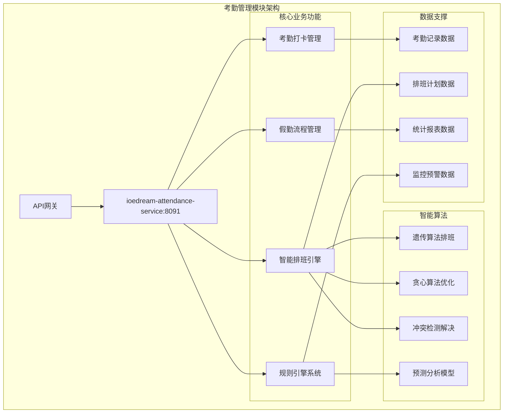

# 考勤管理模块完整文档

> **模块定位**: 智慧园区安防综合管理平台核心人力资源管理
> **核心功能**: 智能排班 + 考勤打卡 + 假勤管理 + 数据统计分析
> **技术架构**: Spring Boot 3.5.8 + 规则引擎 + 智能算法
> **服务端口**: 8091 (ioedream-attendance-service)
> **文档版本**: v1.0.0
> **更新日期**: 2025-12-16

---

## 📋 模块概述

考勤管理模块是IOE-DREAM智慧园区安防综合管理平台的核心人力资源管理系统，提供完整的考勤管理解决方案，涵盖智能排班、多模态考勤打卡、假勤流程管理、实时监控预警和数据分析统计等功能。

### 🎯 核心价值

- **智能化管理**: 基于AI的智能排班算法和规则引擎
- **多模态考勤**: 支持人脸识别、指纹、卡片、移动端等多种打卡方式
- **全流程覆盖**: 完整的请假、加班、调班、出差流程管理
- **数据驱动决策**: 基于大数据的考勤分析和人力资源优化

### 🏗️ 技术架构

---

## 📚 文档目录

### 📋 核心文档
- **[考勤系统业务功能说明](./01-考勤系统业务功能说明.md)** - 详细业务功能介绍和特性说明
- **[考勤系统数据库设计](./02-考勤系统数据库设计.md)** - 完整数据库表结构和设计规范
- **[考勤系统业务流程设计](./03-考勤系统业务流程设计.md)** - 核心业务流程图和交互说明
- **[考勤系统跨模块业务流程说明](./04-考勤系统跨模块业务流程说明.md)** - 与其他模块的集成流程
- **[考勤系统用户故事](./05-考勤系统用户故事.md)** - 25个核心用户故事，覆盖所有角色
- **[考勤系统界面设计](./06-考勤系统界面设计.md)** - Web端和移动端界面设计规范
- **[考勤系统页面交互说明](./07-考勤系统页面交互说明.md)** - 详细的页面交互设计和用户体验

### 🔗 相关技术文档
- **[考勤系统API接口文档](../../api/attendance/attendance-api-contract.md)** - RESTful API接口规范
- **[考勤系统部署指南](../../deployment/attendance/attendance-deployment-guide.md)** - 系统部署和运维指南
- **[考勤系统监控运维](../../maintenance/attendance/attendance-monitoring-guide.md)** - 监控指标和故障处理

---

## 🎯 功能特性总览

### 📅 智能排班
- ✅ **算法支持**: 遗传算法、贪心算法、回溯算法
- ✅ **轮班模式**: 三班倒、四班三倒、五班四倒等复杂轮班
- ✅ **冲突检测**: 自动检测并提供冲突解决方案
- ✅ **约束管理**: 工时长短、技能匹配、合规要求、员工偏好
- ✅ **优化目标**: 成本最小化、员工满意度最大化

### ⏰ 考勤打卡
- ✅ **多模态识别**: 人脸识别、指纹识别、虹膜识别、卡片、移动端
- ✅ **位置验证**: GPS定位、地理围栏、打卡地点验证
- ✅ **活体检测**: 防止照片、视频等欺诈行为
- ✅ **离线支持**: 网络异常时支持离线打卡和数据同步
- ✅ **实时监控**: 打卡实时状态更新和异常处理

### 📝 假勤管理
- ✅ **请假管理**: 病假、事假、年假、调休等多种请假类型
- ✅ **加班管理**: 工作日、周末、节假日加班申请和审批
- ✅ **调班管理**: 个人调班、集体调班、临时调班
- ✅ **出差管理**: 出差申请、考勤处理、费用管理
- ✅ **流程审批**: 多级审批、条件路由、自动流转

### ⚙️ 规则引擎
- ✅ **规则配置**: 时间规则、地点规则、缺勤规则、加班规则
- ✅ **异常检测**: 自动检测异常情况并预警
- ✅ **智能处理**: 基于规则的自动化处理流程
- ✅ **优先级管理**: 规则优先级和执行顺序
- ✅ **规则版本**: 支持规则版本管理和回滚

### 📊 数据分析
- ✅ **实时统计**: 实时考勤状态监控和仪表板
- ✅ **趋势分析**: 历史趋势预测和对比分析
- ✅ **多维报表**: 个人、部门、公司层面的统计报表
- ✅ **成本分析**: 加班成本、假勤成本、人力成本分析
- ✅ **决策支持**: 基于数据的管理决策建议

---

## 🚀 核心技术指标

### ⚡ 性能指标
- **打卡响应时间**: ≤ 200ms
- **排班算法效率**: 1000人排班 ≤ 10秒
- **数据统计延迟**: ≤ 3秒
- **系统可用性**: 99.9%

### 📊 业务指标
- **考勤准确率**: ≥ 99.5%
- **用户满意度**: ≥ 85%
- **异常检测率**: ≥ 95%
- **流程自动化率**: ≥ 90%

### 🔧 技术指标
- **API响应时间**: 95%的请求 < 100ms
- **数据库连接利用率**: 90%
- **缓存命中率**: ≥ 85%
- **并发支持**: 1000+并发用户

---

## 🔗 系统集成

### 与其他模块的集成关系

| 模块 | 集成方式 | 主要功能 | 状态 |
|------|---------|---------|------|
| **门禁系统** | 实时事件推送 + 联动打卡 | 门禁联动打卡、权限同步 | ✅ 已集成 |
| **消费系统** | 数据同步 + 业务联动 | 工作餐消费、补贴发放 | ✅ 已集成 |
| **访客系统** | 数据同步 + 流程集成 | 访客考勤管理 | ✅ 已集成 |
| **视频监控** | 视频抓拍 + 行为分析 | 考勤视频验证、异常检测 | ✅ 已集成 |
| **OA系统** | 数据同步 + 审批流程 | 组织架构同步、审批流程 | ✅ 已集成 |
| **薪酬系统** | 数据推送 + 薪酬计算 | 考勤数据统计、薪酬计算 | ✅ 已集成 |
| **通知系统** | 事件推送 + 多渠道通知 | 实时通知、异常预警 | ✅ 已集成 |

---

## 📱 用户角色

### 👨 HR管理员
- **智能排班制定**: 使用算法制定最优排班计划
- **考勤政策管理**: 制定和管理考勤政策和规则
- **数据分析决策**: 基于数据的分析和决策支持
- **系统配置管理**: 系统参数和业务规则配置

### 👨‍💼 直线经理
- **团队考勤监控**: 实时监控团队成员考勤状态
- **假勤申请审批**: 审批团队成员的请假和加班申请
- **团队排班管理**: 管理团队成员的工作安排
- **团队绩效分析**: 基于考勤数据的团队绩效分析

### 🧑‍💼 普通员工
- **便捷打卡操作**: 多种方式的考勤打卡
- **个人记录查询**: 查看个人考勤记录和统计
- **假勤申请提交**: 请假、加班、调班申请提交
- **排班信息查看**: 查看个人排班安排

### 🔧 系统管理员
- **系统配置管理**: 系统参数和业务规则配置
- **用户权限管理**: 用户角色和权限分配管理
- **数据集成管理**: 与外部系统的数据集成配置
- **监控运维管理**: 系统监控和故障处理

---

## 🎯 业务价值

### 💰 经济效益
- **人力成本降低**: 自动化流程减少40%的人工成本
- **管理效率提升**: 整体管理效率提升60%
- **错误成本降低**: 自动校验减少60%的错误成本
- **合规成本降低**: 标准化流程降低50%的合规成本

### 📈 管理效益
- **决策数据支撑**: 为管理决策提供100%的数据支撑
- **考勤准确率**: 从手工操作提升至99.5%
- **审批效率**: 审批效率提升80%
- **响应及时性**: 异常响应时间缩短85%

### 😊 员工体验
- **使用便利性**: 移动端支持提升便利性95%
- **信息透明度**: 考勤信息透明度提升100%
- **操作效率**: 员工操作效率提升75%
- **满意度**: 整体满意度提升60%

---

## 🔄 实施规划

### 阶段1: 基础功能（已完成）
- [x] 基础考勤打卡功能
- [x] 简单排班管理
- [x] 基础请假审批流程
- [x] 基础数据统计

### 阶段2: 智能化功能（已实现）
- [x] 智能排班算法
- [x] 规则引擎系统
- [x] 多模态考勤
- [x] 实时监控预警

### 阶段3: 优化提升（进行中）
- [ ] 算法优化和调优
- [ ] 性能优化和扩展
- [ ] 用户体验优化
- [ ] 集成功能完善

### 阶段4: 创新功能（规划中）
- [ ] AI预测分析
- [ ] 个性化推荐
- [ ] 高级数据分析
- [ ] 国际化支持

---

## 📞 技术支持

### 🔧 开发团队
- **模块负责人**: 考勤模块开发团队
- **技术支持**: support@ioedream.com
- **文档维护**: IOE-DREAM架构委员会

### 🐛 部署运维
- **部署环境**: Docker + Kubernetes
- **监控工具**: Prometheus + Grafana
- **日志管理**: ELK Stack
- **备份策略**: 自动化备份和恢复

### 📚 培训支持
- **用户手册**: 完整的用户操作手册
- **管理员指南**: 系统管理和配置指南
- **视频教程**: 功能演示和操作教程
- **FAQ文档**: 常见问题和解决方案

---

## 📈 版本历史

### v1.0.0 (2025-12-16)
- ✅ 完成核心考勤管理功能
- ✅ 实现智能排班算法引擎
- ✅ 完成多模态考勤打卡
- ✅ 建立完整的假勤管理流程
- ✅ 实现实时监控和数据分析

### 规划版本
- **v1.1.0**: AI预测分析和个性化推荐
- **v1.2.0**: 国际化支持和多租户
- **v1.3.0**: 高级数据分析和报表
- **v2.0.0**: 全面智能化升级

---

## 🎯 质量标准

### 📊 性能质量
- **代码覆盖率**: ≥ 85%
- **接口响应时间**: P95 < 100ms
- **系统可用性**: 99.9%
- **数据准确性**: ≥ 99.5%

### 🎨 用户体验
- **系统易用性**: 85%以上用户评分
- **任务完成率**: 90%以上
- **错误率**: < 2%
- **学习成本**: 新用户30分钟内掌握

### 📋 业务规范
- **功能完整性**: 100%需求覆盖
- **流程合规性**: 100%政策合规
- **数据安全性**: 等保三级等保要求
- **集成标准**: 符合企业级集成标准

---

**💡 考勤管理模块作为智慧园区管理的核心人力资源系统，通过智能化、自动化的设计理念，为企业提供完整、高效的考勤管理解决方案。**