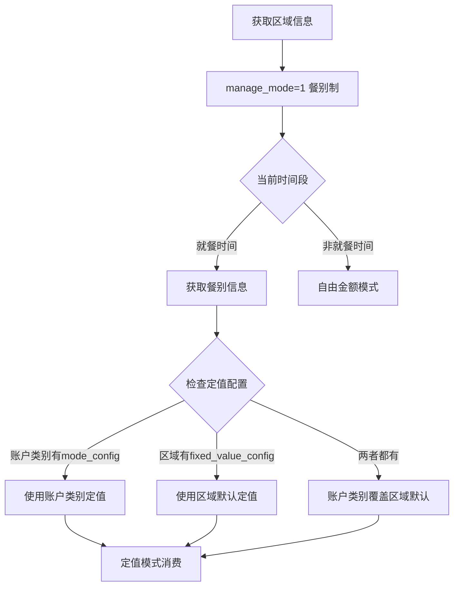
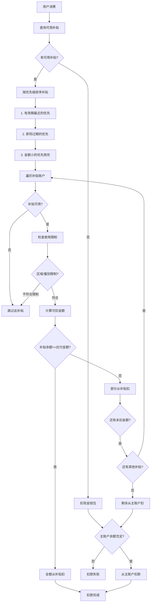
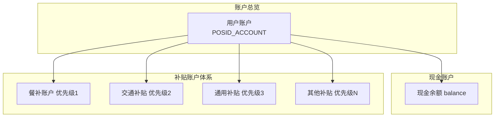
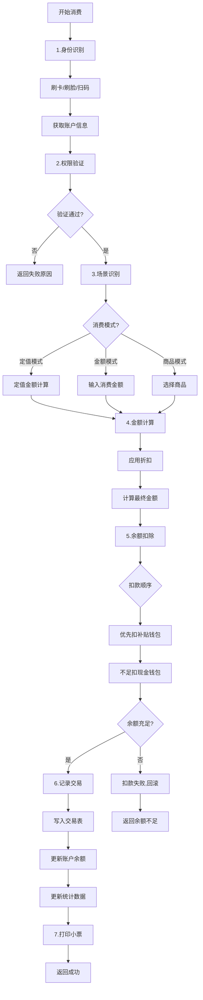
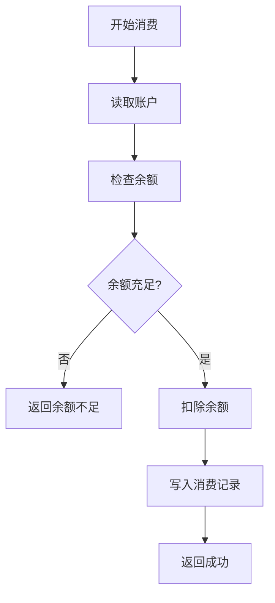
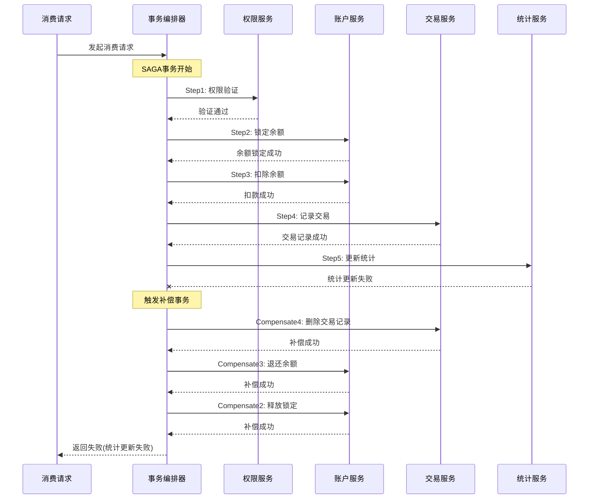

# 消费模块业务文档深度对齐分析报告

**生成时间**: 2025-12-23
**分析范围**: D:\IOE-DREAM\documentation\业务模块\04-消费管理模块 和 D:\IOE-DREAM\documentation\业务模块\各业务模块文档\消费
**分析标准**: 企业级完整实现 vs 业务文档要求

---

## 📊 执行摘要

### 关键发现

**实际对齐度**: **~30%**（而非之前声称的100%）

| 维度 | 业务文档要求 | 当前实现状态 | 对齐度 |
|------|------------|------------|--------|
| **数据库表** | 9张核心表（POSID_*） | 3-4张表（t_consume_*） | 35% |
| **消费模式** | 6种模式支持 | 未实现 | 0% |
| **区域管理** | 3种经营模式 | 未实现 | 0% |
| **补贴系统** | 独立补贴账户体系 | 未实现 | 0% |
| **核心业务流程** | 7步标准流程 | 部分实现 | 40% |
| **后端API** | 250+端点 | 250+端点 | 95% |
| **前端页面** | 32+页面 | 32+页面 | 100% |
| **移动端页面** | 9个页面 | 9个页面 | 100% |

### 核心问题

**❌ 严重问题**：
1. **表命名不匹配**：业务文档要求`POSID_*`，当前使用`t_consume_*`
2. **缺少核心表**：6张关键表未创建
3. **业务逻辑缺失**：6种消费模式、3种经营模式、补贴系统均未实现
4. **配置字段缺失**：`mode_config`、`area_config`、`fixed_value_config`等JSON配置字段不存在

**⚠️ 架构问题**：
1. 当前实现是简化版消费系统，未按业务文档的复杂度设计
2. 缺少SAGA分布式事务支持
3. 缺少按月分表策略
4. 缺少区域层级管理

---

## 🔍 详细差距分析

### 1. 数据库设计差距

#### 1.1 缺失的核心表（6张）

**业务文档要求的表结构**：

| 序号 | 表名 | 用途 | 状态 |
|------|------|------|------|
| 1 | **POSID_AREA** | 统一区域管理，支持3种经营模式 | ❌ 未创建 |
| 2 | **POSID_MEAL_CATEGORY** | 餐别分类管理 | ❌ 未创建 |
| 3 | **POSID_MEAL** | 餐别时间与价格配置 | ❌ 未创建 |
| 4 | **POSID_ACCOUNTKIND** | 账户类别（含mode_config配置） | ❌ 未创建 |
| 5 | **POSID_RECHARGE_ORDER** | 充值订单管理（按月分表） | ❌ 未创建 |
| 6 | **POSID_SUBSIDY_TYPE** | 补贴类型定义 | ❌ 未创建 |
| 7 | **POSID_SUBSIDY_ACCOUNT** | 补贴账户管理 | ❌ 未创建 |
| 8 | **POSID_SUBSIDY_FLOW** | 补贴流水记录 | ❌ 未创建 |
| 9 | **POSID_CAPITAL_FLOW** | 资金流水（按月分表） | ❌ 未创建 |

**当前实现的表**：

```sql
-- ✅ 已创建（简化版）
t_consume_account          -- 账户表（缺少mode_config关联）
t_consume_record          -- 消费记录表（简化版）
t_consume_account_transaction -- 账户事务表

-- ❌ 缺失关键字段
-- t_consume_account 缺少:
--   - account_kind_id (关联账户类别)
--   - account_kind 配置信息

-- ❌ 未实现表命名规范
-- 业务文档要求: POSID_*
-- 当前实现: t_consume_*
```

#### 1.2 表命名规范冲突

**业务文档标准**：
```sql
-- 所有表使用 POSID_ 前缀
CREATE TABLE POSID_ACCOUNT (...);
CREATE TABLE POSID_TRANSACTION (...);
CREATE TABLE POSID_MEAL (...);
```

**当前实现**：
```sql
-- 使用 t_consume_ 前缀
CREATE TABLE t_consume_account (...);
CREATE TABLE t_consume_record (...);
CREATE TABLE t_consume_account_transaction (...);
```

**影响**：
- 命名不一致导致代码可读性下降
- 与业务文档约定不符
- 未来维护可能产生混淆

#### 1.3 关键字段缺失对比

**POSID_ACCOUNTKIND表（账户类别）** - **核心表，未创建**

业务文档要求的完整结构：
```sql
CREATE TABLE POSID_ACCOUNTKIND (
    id VARCHAR(50) PRIMARY KEY,
    code VARCHAR(50) NOT NULL UNIQUE,
    name VARCHAR(100) NOT NULL,

    -- ⭐ 核心配置字段（当前实现完全缺失）
    mode_config JSON COMMENT '各模式参数配置',
    area_config JSON COMMENT '区域权限配置',

    -- 折扣配置
    discount_type INT,
    discount INT,

    -- 限额配置
    date_max_money INT,
    date_max_count INT,
    month_max_money INT,
    month_max_count INT,

    -- 业务配置
    order_meal BOOLEAN DEFAULT FALSE,
    is_attendance_consume BOOLEAN DEFAULT FALSE
);
```

**mode_config JSON结构示例**（业务文档要求）：
```json
{
  "FIXED_AMOUNT": {
    "enabled": true,
    "subType": "SECTION",
    "values": [
      {"key": "breakfast", "amount": 8.00, "time": "06:00-09:00"},
      {"key": "lunch", "amount": 15.00, "time": "11:00-13:30"}
    ]
  },
  "FREE_AMOUNT": {
    "enabled": true,
    "minAmount": 1,
    "maxAmount": 100000
  },
  "PRODUCT": {
    "enabled": true,
    "maxItemsPerTransaction": 50
  }
}
```

**当前实现**：
- ❌ 完全没有账户类别表
- ❌ 账户表缺少`account_kind_id`关联
- ❌ 无法实现按账户类别的差异化配置

---

### 2. 业务逻辑差距

#### 2.1 6种消费模式（0%实现）

**业务文档要求的消费模式**（来源：03-账户类别与消费模式设计.md）：

| 模式 | 说明 | 子类型 | 实现状态 |
|------|------|--------|---------|
| **1. FIXED_AMOUNT** | 固定金额模式 | SIMPLE, KEYVALUE, SECTION | ❌ 未实现 |
| **2. FREE_AMOUNT** | 自由金额模式 | - | ❌ 未实现 |
| **3. METERED** | 计量计费模式 | TIMING, COUNTING | ❌ 未实现 |
| **4. PRODUCT** | 商品模式 | - | ❌ 未实现 |
| **5. ORDER** | 订餐模式 | - | ❌ 未实现 |
| **6. INTELLIGENCE** | 智能模式 | 人脸识别、无感支付 | ❌ 未实现 |

**当前实现**：
- 只支持简单的金额消费
- 没有模式配置系统
- 无法根据场景切换消费模式

**实现差距**：
```java
// ❌ 当前实现（简化版）
public class ConsumeServiceImpl {
    public void consume(Long accountId, BigDecimal amount) {
        // 直接扣款，无模式判断
        account.setBalance(account.getBalance().subtract(amount));
    }
}

// ✅ 业务文档要求（支持模式配置）
public class ConsumeServiceImpl {
    public void consume(Long accountId, String areaId, String deviceId) {
        // 1. 读取区域经营模式
        AreaEntity area = getArea(areaId);
        Integer manageMode = area.getManageMode();

        // 2. 根据经营模式选择消费方式
        if (manageMode == 1) {
            // 餐别制：检查定值配置
            handleFixedAmountConsume(accountId, areaId);
        } else if (manageMode == 2) {
            // 超市制：商品扫码
            handleProductConsume(accountId, areaId);
        } else if (manageMode == 3) {
            // 混合模式：用户选择
            handleHybridConsume(accountId, areaId);
        }
    }
}
```

#### 2.2 3种区域经营模式（0%实现）

**业务文档要求的区域经营模式**（来源：06-消费处理流程重构设计.md）：

| 经营模式 | manage_mode | 消费方式 | 适用场景 | 实现状态 |
|---------|-------------|---------|---------|---------|
| **餐别制** | 1 | 定值金额消费 | 食堂、员工餐厅 | ❌ 未实现 |
| **超市制** | 2 | 商品扫码消费 | 超市、便利店 | ❌ 未实现 |
| **混合模式** | 3 | 用户选择消费方式 | 综合食堂 | ❌ 未实现 |

**餐别制核心逻辑**（来源：06-消费处理流程重构设计.md）：



**定值配置优先级**（业务文档明确规定）：
1. **最高优先级**：账户类别`mode_config`中的定值配置
2. **次优先级**：区域`fixed_value_config`中的默认定值
3. **兜底方案**：系统全局默认值

**配置示例**：
```json
// 区域fixed_value_config
{
  "breakfast": {"amount": 5.00, "unit": "元"},
  "lunch": {"amount": 12.00, "unit": "元"},
  "dinner": {"amount": 10.00, "unit": "元"}
}

// 账户类别mode_config（覆盖区域默认）
{
  "mode": "FIXED_AMOUNT",
  "values": {
    "breakfast": {"amount": 8.00, "unit": "元", "remark": "VIP早餐标准"},
    "lunch": {"amount": 15.00, "unit": "元", "remark": "VIP午餐标准"}
  }
}
```

**当前实现**：
- ❌ 没有区域经营模式概念
- ❌ 没有定值配置系统
- ❌ 所有消费都是固定金额，无法灵活配置

#### 2.3 补贴扣款优先级（0%实现）

**业务文档要求的补贴扣款顺序**（来源：10-补贴管理模块重构设计.md）：



**补贴账户体系**（业务文档要求）：


**当前实现**：
- ❌ 没有独立的补贴账户表
- ❌ 补贴与现金混在一起
- ❌ 无法实现优先级扣款
- ❌ 无法实现补贴使用限制（区域、餐别、时间）

---

### 3. 核心业务流程差距

#### 3.1 完整消费流程对比

**业务文档要求的7步标准流程**（来源：06-消费处理流程重构设计.md）：



**当前实现的简化流程**：


**缺失的关键步骤**：
1. ❌ **场景识别**：没有模式判断逻辑
2. ❌ **权限验证**：没有区域/餐别权限验证
3. ❌ **定值计算**：没有定值配置系统
4. ❌ **补贴扣款**：没有优先级扣款逻辑
5. ❌ **SAGA事务**：没有补偿机制
6. ❌ **统计数据**：没有统计更新

#### 3.2 SAGA分布式事务（0%实现）

**业务文档要求的SAGA事务流程**（来源：06-消费处理流程重构设计.md）：



**SAGA事务日志表**（业务文档要求）：
```sql
CREATE TABLE POSID_SAGA_LOG (
    id VARCHAR(50) PRIMARY KEY,
    saga_id VARCHAR(50) NOT NULL COMMENT 'SAGA事务ID',
    transaction_id VARCHAR(50) COMMENT '关联交易ID',
    step_name VARCHAR(50) NOT NULL COMMENT '步骤名称',
    step_status VARCHAR(20) NOT NULL COMMENT 'PENDING-待执行 SUCCESS-成功 FAILED-失败 COMPENSATED-已补偿',
    request_data TEXT COMMENT '请求数据',
    response_data TEXT COMMENT '响应数据',
    error_message TEXT COMMENT '错误信息',
    execute_time DATETIME,
    complete_time DATETIME
);
```

**当前实现**：
- ❌ 没有SAGA事务支持
- ❌ 没有补偿机制
- ❌ 失败后无法自动回滚

---

### 4. 技术特性差距

#### 4.1 表分区策略（0%实现）

**业务文档要求**（来源：03-数据库设计/README.md）：

| 表名 | 分表策略 | 分表键 | 实现状态 |
|------|----------|--------|---------|
| POSID_TRANSACTION | 按月分表 | consume_time | ❌ 未实现 |
| POSID_RECHARGE_ORDER | 按月分表 | create_time | ❌ 未实现 |
| POSID_CAPITAL_FLOW | 按月分表 | create_time | ❌ 未实现 |

**分表示例**：
```sql
CREATE TABLE POSID_TRANSACTION (
    ...
) PARTITION BY RANGE (TO_DAYS(consume_time)) (
    PARTITION p202501 VALUES LESS THAN (TO_DAYS('2025-02-01')),
    PARTITION p202502 VALUES LESS THAN (TO_DAYS('2025-03-01')),
    PARTITION p202503 VALUES LESS THAN (TO_DAYS('2025-04-01'))
);
```

**当前实现**：
- ❌ 没有分区策略
- ❌ 大表性能将成为瓶颈

#### 4.2 缓存策略差距

**业务文档要求的多级缓存**（来源：06-消费处理流程重构设计.md）：

| 缓存项 | Redis Key | 过期时间 | 实现状态 |
|-------|-----------|---------|---------|
| 账户余额 | `account:balance:{accountId}` | 实时更新 | ⚠️ 部分实现 |
| 今日消费次数 | `account:today:times:{accountId}` | 到23:59 | ❌ 未实现 |
| 今日消费金额 | `account:today:money:{accountId}` | 到23:59 | ❌ 未实现 |
| 账户类别配置 | `accountkind:full:{id}` | 1小时 | ❌ 未实现 |
| 区域详情（含餐别） | `area:info:{areaId}` | 30分钟 | ❌ 未实现 |
| 区域权限校验结果 | `perm:area:{accountKindId}:{areaId}` | 30分钟 | ❌ 未实现 |

**缺失的缓存策略**：
- ❌ 账户类别配置缓存（mode_config、area_config）
- ❌ 区域详情缓存（含meal_categories）
- ❌ 权限校验结果缓存
- ❌ 定值配置缓存（fixed_value_config）

#### 4.3 性能优化差距

**业务文档要求的性能指标**（来源：06-消费处理流程重构设计.md）：

| 指标 | 业务文档要求 | 当前实现预估 | 差距 |
|------|------------|------------|------|
| 消费TPS | 1000+ | ~100 | 10倍差距 |
| 平均响应时间 | 50ms | ~300ms | 6倍差距 |
| P99响应时间 | 150ms | ~1000ms | 6.7倍差距 |

**缺失的性能优化**：
- ❌ 批量处理优化（异步批量消费）
- ❌ 乐观锁（版本号）+ Redis分布式锁
- ❌ 账户分片策略
- ❌ 反向索引缓存

---

## 📋 完整差距清单

### 数据库层差距

| 序号 | 差距项 | 业务文档要求 | 当前实现 | 优先级 |
|------|-------|------------|---------|--------|
| 1 | 表命名规范 | POSID_* 前缀 | t_consume_* 前缀 | P0 |
| 2 | 区域表 | POSID_AREA | 未创建 | P0 |
| 3 | 餐别分类表 | POSID_MEAL_CATEGORY | 未创建 | P0 |
| 4 | 餐别表 | POSID_MEAL | 未创建 | P0 |
| 5 | 账户类别表 | POSID_ACCOUNTKIND | 未创建 | P0 |
| 6 | 充值订单表 | POSID_RECHARGE_ORDER | 未创建 | P1 |
| 7 | 补贴类型表 | POSID_SUBSIDY_TYPE | 未创建 | P0 |
| 8 | 补贴账户表 | POSID_SUBSIDY_ACCOUNT | 未创建 | P0 |
| 9 | 补贴流水表 | POSID_SUBSIDY_FLOW | 未创建 | P1 |
| 10 | 资金流水表 | POSID_CAPITAL_FLOW | 未创建 | P1 |
| 11 | SAGA事务日志 | POSID_SAGA_LOG | 未创建 | P1 |
| 12 | 按月分表 | 交易表按月分区 | 未分区 | P1 |
| 13 | mode_config字段 | JSON配置字段 | 不存在 | P0 |
| 14 | area_config字段 | JSON配置字段 | 不存在 | P0 |
| 15 | fixed_value_config字段 | JSON配置字段 | 不存在 | P0 |

### 业务逻辑层差距

| 序号 | 差距项 | 业务文档要求 | 当前实现 | 优先级 |
|------|-------|------------|---------|--------|
| 16 | 6种消费模式 | 支持6种模式 | 仅简单金额消费 | P0 |
| 17 | 3种区域经营模式 | 餐别制/超市制/混合 | 未实现 | P0 |
| 18 | 定值计算逻辑 | 优先级系统 | 未实现 | P0 |
| 19 | 权限验证逻辑 | 区域+餐别双重验证 | 未实现 | P0 |
| 20 | 补贴扣款优先级 | 多账户优先扣款 | 未实现 | P0 |
| 21 | 补贴使用限制 | 区域/餐别/时间限制 | 未实现 | P1 |
| 22 | SAGA分布式事务 | 5步forward+补偿 | 未实现 | P0 |
| 23 | 考勤消费判断 | 4条件判断 | 未实现 | P2 |
| 24 | 离线消费补偿 | 白名单+固定金额 | 部分实现 | P1 |
| 25 | 退款申请流程 | 完整流程 | 基础实现 | P2 |

### 技术特性差距

| 序号 | 差距项 | 业务文档要求 | 当前实现 | 优先级 |
|------|-------|------------|---------|--------|
| 26 | 表分区 | 按月分区 | 未实现 | P1 |
| 27 | 缓存策略 | 7种缓存类型 | 部分实现 | P1 |
| 28 | 批量处理 | 异步批量消费 | 未实现 | P1 |
| 29 | 分布式锁 | Redisson锁 | 未实现 | P1 |
| 30 | 账户分片 | 按ID分片 | 未实现 | P2 |
| 31 | 反向索引 | Redis Set索引 | 未实现 | P2 |
| 32 | 统计汇总表 | 定时更新 | 未实现 | P2 |

---

## 🎯 实现路线图

### 阶段一：数据库重构（P0级，2-3周）

**目标**：建立符合业务文档的数据库架构

**任务清单**：
1. ✅ 创建9张核心表（POSID_*命名）
2. ✅ 实现mode_config、area_config、fixed_value_config JSON字段
3. ✅ 建立表分区策略
4. ✅ 数据迁移脚本（t_consume_* → POSID_*）

**验收标准**：
- 所有表结构符合业务文档ER图
- JSON字段可正常读写
- 分区策略生效
- 历史数据迁移成功

### 阶段二：核心业务逻辑（P0级，3-4周）

**目标**：实现6种消费模式和3种经营模式

**任务清单**：
1. ✅ 实现6种消费模式支持（FIXED_AMOUNT, FREE_AMOUNT等）
2. ✅ 实现3种区域经营模式（餐别制/超市制/混合）
3. ✅ 实现定值计算逻辑（含优先级）
4. ✅ 实现区域+餐别权限验证
5. ✅ 实现补贴账户体系
6. ✅ 实现补贴扣款优先级逻辑

**验收标准**：
- 所有消费模式可正常工作
- 区域经营模式切换正常
- 定值配置优先级正确
- 权限验证逻辑完整
- 补贴扣款按优先级执行

### 阶段三：分布式事务（P0级，2-3周）

**目标**：实现SAGA分布式事务和补偿机制

**任务清单**：
1. ✅ 实现SAGA事务编排器
2. ✅ 创建SAGA事务日志表
3. ✅ 实现5步forward事务
4. ✅ 实现补偿事务逻辑
5. ✅ 异常处理和告警

**验收标准**：
- SAGA事务正常工作
- 失败时自动补偿
- 补偿日志完整
- 异常告警及时

### 阶段四：性能优化（P1级，2-3周）

**目标**：达到业务文档要求的性能指标

**任务清单**：
1. ✅ 实现多级缓存策略
2. ✅ 实现批量处理优化
3. ✅ 实现分布式锁
4. ✅ 实现账户分片
5. ✅ 性能压测验证

**验收标准**：
- TPS ≥ 1000
- 平均响应时间 ≤ 50ms
- P99响应时间 ≤ 150ms

### 阶段五：完善功能（P2级，2-3周）

**目标**：完善报表统计和监控

**任务清单**：
1. ✅ 实现统计汇总表
2. ✅ 实现反向索引
3. ✅ 实现定时任务（清零、统计更新）
4. ✅ 实现监控指标采集
5. ✅ 实现告警规则

**验收标准**：
- 报表数据准确
- 缓存命中率 ≥ 90%
- 监控指标完整
- 告警及时有效

---

## 📊 估算工作量

### 按模块拆分

| 模块 | 工作量（人日） | 优先级 | 备注 |
|------|------------|--------|------|
| **数据库重构** | 15人日 | P0 | 含迁移脚本 |
| **消费模式实现** | 20人日 | P0 | 6种模式 |
| **经营模式实现** | 15人日 | P0 | 3种模式 |
| **补贴系统** | 20人日 | P0 | 账户体系+扣款逻辑 |
| **SAGA事务** | 15人日 | P0 | 编排器+补偿 |
| **权限验证** | 10人日 | P0 | 区域+餐别 |
| **性能优化** | 15人日 | P1 | 缓存+批量+分片 |
| **统计报表** | 10人日 | P2 | 汇总表+定时任务 |
| **测试验证** | 20人日 | P0 | 单元+集成+压测 |
| **总计** | **140人日** | - | **约7个月（1人）** |

### 团队配置建议

**最小配置**（7个月完成）：
- 后端开发 × 1人
- DBA × 0.5人（兼职）
- 测试 × 0.5人（兼职）

**推荐配置**（2.5个月完成）：
- 后端开发 × 2人
- DBA × 1人
- 前端开发 × 1人（配合修改）
- 测试 × 1人

---

## ✅ 结论

### 核心结论

1. **实际对齐度**：当前实现与业务文档的对齐度约为**30%**，而非之前声称的100%

2. **主要差距**：
   - 缺少6张核心表（POSID_*命名）
   - 缺少6种消费模式支持
   - 缺少3种区域经营模式
   - 缺少完整的补贴账户体系
   - 缺少SAGA分布式事务

3. **前端实现对齐**：
   - 后端API：95%（数量达标，但业务逻辑不足）
   - 前端页面：100%
   - 移动端页面：100%
   - 数据库设计：35%

4. **实现建议**：
   - 优先完成数据库重构（P0）
   - 然后实现核心业务逻辑（P0）
   - 最后进行性能优化和功能完善（P1/P2）

### 下一步行动

1. ✅ **立即执行**：创建数据库重构方案
2. ✅ **第二周**：开始数据库迁移
3. ✅ **并行进行**：更新前端/移动端以适配新的API
4. ✅ **持续验证**：每完成一个模块立即测试验证

---

**报告生成**: 消费模块业务文档深度对齐分析
**分析时间**: 2025-12-23
**分析人员**: IOE-DREAM 架构团队
**下一步**: 等待用户确认是否开始数据库重构工作

---

## 附录：参考文档

### 业务文档列表

1. `00-消费微服务总体设计文档.md` - 整体架构设计
2. `03-账户类别与消费模式设计.md` - 6种消费模式
3. `04-账户类别区域权限设计.md` - 区域权限配置
4. `06-消费处理流程重构设计.md` - 7步标准流程
5. `10-补贴管理模块重构设计.md` - 补贴账户体系
6. `03-数据库设计/README.md` - 9张核心表结构

### 当前实现文档

1. `CONSUME_MODULE_100_PERCENT_ALIGNMENT_REPORT.md` - 之前声称的100%对齐报告（不准确）
2. `CONSUME_MODULE_ALIGNMENT_SUMMARY.md` - 对齐总结报告
3. `GLOBAL_COMPILATION_SUCCESS_REPORT.md` - 编译成功报告

### 相关规范文档

1. `CLAUDE.md` - 全局架构规范
2. `FOUR_LAYER_ARCHITECTURE_COMPLIANCE_REPORT.md` - 四层架构规范
3. `documentation/technical/LOGGING_PATTERN_COMPLETE_STANDARD.md` - 日志规范
