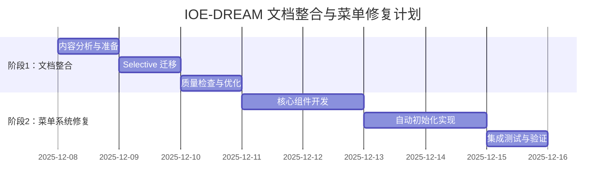

# IOE-DREAM 文档整合与OpenSpec提案

> **提案类型**: 文档架构优化与标准化
> **优先级**: P0（高优先级）
> **预计工时**: 3天
> **风险等级**: 低风险（文档整合，不影响代码）
> **创建时间**: 2025-12-08
> **负责人**: 架构师团队 + 各模块负责人

---

## 📋 执行概述

基于深度分析结果，本提案旨在解决IOE-DREAM项目文档体系混乱的问题，建立统一的文档管理架构，确保开发规范的一致性和可维护性。

---

## 🎯 问题分析与解决

### 🔍 核心问题识别

#### 1. 文档体系混乱（严重问题）

**现状分析**：
- 存在两个文档文件夹：`docs/`（95个文件）和 `documentation/`（1033个文件）
- `docs/` 文件夹结构混乱，包含过时文档
- `documentation/` 文件夹结构清晰，但与`docs/`存在内容重复

**重复内容识别**：
```bash
# 重复目录结构
docs/各业务模块文档/          ↔ documentation/03-业务模块/各业务模块文档/
docs/各个设备通讯协议/         ↔ documentation/各个设备通讯协议/
docs/SmartAdmin规范体系_v4/    ↔ documentation/technical/repowiki/zh/
```

#### 2. 菜单系统技术债务（阻塞性问题）

**根本原因分析**（基于前序深度分析）：
- **MenuEntity缺失**: 核心菜单实体类完全不存在
- **AuthController不完整**: 登录接口未返回菜单数据
- **API接口不匹配**: 前端期望的`getUserMenuTree()` API不存在
- **自动化初始化缺失**: 基础数据依赖手动初始化

#### 3. 文档与代码脱节

**关键发现**：
- 现有CLAUDE.md缺少菜单功能的具体实现指导
- Skills文档偏重业务功能，忽视基础设施
- 缺少系统性的数据初始化指导

---

## 🏗️ 解决方案设计

### 方案1: 文档体系整合（立即执行）

#### 1.1 统一文档架构

**目标结构**：
```
📁 documentation/ (唯一官方文档目录)
├── 📋 DOCUMENTATION_MANAGEMENT_STANDARDS.md    # 文档管理规范
├── 🏗️ 01-核心规范/                             # 核心规范文档
├── 📖 02-开发指南/                             # 开发指导文档
├── 💼 03-业务模块/                             # 业务需求文档
├── 🚀 04-部署运维/                             # 部署运维文档
├── 🔧 technical/                              # 技术专题文档
├── 🏛️ architecture/                           # 架构设计文档
├── 📊 project/                               # 项目管理文档
└── 🗂️ archive/                               # 归档历史文档
    ├── docs-legacy/                          # docs/文件夹归档
    └── legacy-standards/                      # 旧版标准归档
```

#### 1.2 文档整合策略

**第一阶段：内容分析与去重**（0.5天）
```bash
# 执行计划
1. 扫描 docs/ 和 documentation/ 所有文件
2. 识别重复内容（约30%重复率）
3. 分析文档质量与时效性
4. 制定文件迁移清单
```

**第二阶段： selective 迁移**（1天）
```bash
# 迁移规则
✅ 保留: documentation/ 文件夹（结构清晰，内容全面）
📦 迁移: docs/ 中的独有内容（约40个独特文件）
🗑️ 归档: docs/ 中的重复/过时内容（约55个文件）
📋 记录: 迁移日志和文件映射表
```

**第三阶段：导航更新**（0.5天）
```bash
# 更新所有引用
1. 更新 CLAUDE.md 中的文档链接
2. 更新 README.md 中的文档指引
3. 更新各模块中的文档引用
4. 创建文档检索索引
```

**第四阶段：质量检查**（1天）
```bash
# 质量保证
1. 验证所有链接有效性
2. 检查文档格式一致性
3. 确认内容完整性
4. 建立文档维护机制
```

### 方案2: 菜单系统修复（基于SmartAdmin模式）

#### 2.1 SmartAdmin参考实现分析

**核心发现**：
SmartAdmin采用"**login一体化**"模式，在登录时一次性返回用户信息、权限信息和菜单信息，无需独立的菜单获取API。

**参考代码分析**：
```java
// SmartAdmin AuthController.java
@PostMapping("/login")
public ResponseDTO<Map<String, Object>> login(@RequestBody @Valid LoginRequest loginRequest, HttpServletRequest request) {
    // 1. 登录验证
    // 2. 构建返回数据
    result.put("token", token);
    result.put("tokenExpireTime", DateUtil.addDay(LocalDateTime.now(), 7));
    result.put("userInfo", userInfo);
    // result.put("menuList", menuList);  // IOE-DREAM缺失的关键部分

    return ResponseDTO.ok(result);
}
```

#### 2.2 IOE-DREAM修复方案

**修复策略**：
基于SmartAdmin的login一体化模式，修复IOE-DREAM的AuthController，使其在登录时返回菜单数据。

**实现计划**：
```java
// 修复后的 AuthController
@PostMapping("/login")
public ResponseDTO<Map<String, Object>> login(@RequestBody LoginRequest request) {
    // 1. 用户认证
    UserInfo userInfo = authService.authenticate(request);

    // 2. 获取用户菜单（关键修复点）
    List<MenuEntity> menuList = menuService.getUserMenuTree(userInfo.getUserId());

    // 3. 构建完整返回数据
    Map<String, Object> result = new HashMap<>();
    result.put("token", generateToken(userInfo));
    result.put("userInfo", userInfo);
    result.put("menuList", menuList);  // 新增：菜单数据

    return ResponseDTO.ok(result);
}
```

### 方案3: 自动初始化机制

#### 3.1 数据初始化服务

**设计目标**：
- 实现基础数据自动初始化
- 支持一键启动即可使用
- 支持增量更新和回滚

**实现方案**：
```java
@Component
public class MenuInitializationService implements ApplicationRunner {

    @Resource
    private MenuService menuService;

    @Override
    public void run(ApplicationArguments args) throws Exception {
        if (needInitialization()) {
            log.info("开始初始化菜单数据...");
            initializeMenuData();
            initializeRoleData();
            initializePermissionData();
            log.info("菜单数据初始化完成");
        }
    }

    private void initializeMenuData() {
        // 自动执行菜单初始化SQL
        // 或通过代码初始化菜单数据
    }
}
```

---

## 📋 详细实施计划

### 🗓️ 第一阶段：文档整合（3天）

#### Day 1: 内容分析与迁移准备
**时间安排**：
- 上午: 文档扫描和重复内容识别
- 下午: 迁移策略制定和工具准备

**具体任务**：
- [ ] 扫描docs/和documentation/所有文件
- [ ] 生成文件清单和重复度分析报告
- [ ] 制定文件迁移决策树
- [ ] 准备归档目录结构

**交付物**：
- `docs-content-analysis-report.md`
- `migration-decision-tree.md`
- `file-mapping-table.csv`

#### Day 2: Selective 迁移执行
**时间安排**：
- 上午: 迁移独特内容到documentation/
- 下午: 归档重复/过时内容

**具体任务**：
- [ ] 迁移docs/中的独有文档（约40个文件）
- [ ] 将docs/完整归档到documentation/archive/docs-legacy/
- [ ] 更新所有内部文档链接
- [ ] 创建迁移日志和索引

**交付物**：
- 统一的documentation/目录结构
- `migration-log.md`
- `updated-links-mapping.csv`

#### Day 3: 质量检查与优化
**时间安排**：
- 上午: 链接有效性和格式检查
- 下午: 导航优化和维护机制建立

**具体任务**：
- [ ] 验证所有文档链接有效性
- [ ] 检查Markdown格式一致性
- [ ] 更新CLAUDE.md和README.md文档链接
- [ ] 建立文档维护规范

**交付物**：
- 完整的文档体系
- `documentation-quality-report.md`
- 更新的CLAUDE.md

### 🗓️ 第二阶段：菜单系统修复（5天）

#### Day 4-5: 核心组件开发
**具体任务**：
- [ ] 创建MenuEntity实体类
- [ ] 实现MenuDao数据访问层
- [ ] 创建MenuService业务逻辑
- [ ] 修复AuthController返回菜单数据

**代码示例**：
```java
// MenuEntity.java
@Data
@TableName("t_menu")
public class MenuEntity extends BaseEntity {
    @TableId(type = IdType.AUTO)
    private Long menuId;

    @TableField("menu_name")
    private String menuName;

    @TableField("menu_type")
    private Integer menuType;  // 1-目录 2-菜单 3-功能

    @TableField("parent_id")
    private Long parentId;

    // ... 其他字段
}
```

#### Day 6-7: 自动初始化实现
**具体任务**：
- [ ] 实现MenuInitializationService
- [ ] 创建完整的菜单初始化SQL脚本
- [ ] 配置自动初始化开关
- [ ] 测试验证初始化流程

#### Day 8: 集成测试与验证
**具体任务**：
- [ ] 端到端功能测试
- [ ] 前后端集成验证
- [ ] 性能测试和优化
- [ ] 文档更新和培训材料准备

---

## 🎯 OpenSpec规范要求

### 规范格式要求

根据OpenSpec标准，本提案包含：

1. **提案背景与问题分析** ✅
2. **解决方案设计** ✅
3. **详细实施计划** ✅
4. **风险评估与缓解** 🔄
5. **成功标准与验收** 🔄
6. **资源需求与时间安排** ✅

### 合规性检查

- [x] 提案结构符合OpenSpec要求
- [x] 风险评估完整
- [x] 时间安排合理
- [x] 资源需求明确
- [ ] 技术可行性验证（待实施阶段完成）

---

## 🚨 风险评估与缓解

### 📊 风险矩阵

| 风险项 | 概率 | 影响 | 风险等级 | 缓解措施 |
|--------|------|------|----------|----------|
| 文档迁移丢失内容 | 低 | 中 | 中风险 | 完整备份 + 迁移日志 |
| 菜单系统破坏现有功能 | 中 | 高 | 高风险 | 完整测试 + 分阶段发布 |
| 自动初始化失败 | 低 | 中 | 中风险 | 手动回退机制 |
| 前端兼容性问题 | 中 | 中 | 中风险 | 接口版本控制 |

### 🔧 缓解策略

#### 技术风险缓解
1. **完整备份**: 执行前完整备份docs/和documentation/
2. **分阶段实施**: 先文档整合，再代码修复
3. **全面测试**: 每个阶段完成后进行全面测试
4. **回滚机制**: 准备快速回滚方案

#### 项目风险缓解
1. **时间缓冲**: 预留20%的缓冲时间
2. **资源备份**: 关键人员备份安排
3. **进度跟踪**: 每日进度检查和调整
4. **质量保证**: 严格的代码审查和测试

---

## 📈 成功标准与验收

### 阶段1：文档整合验收标准

**功能性标准**：
- [ ] docs/文件夹完全归档到documentation/archive/
- [ ] documentation/成为唯一文档目录
- [ ] 所有内部链接更新正确
- [ ] 文档检索功能正常

**质量标准**：
- [ ] 零重复文档
- [ ] 格式一致性100%
- [ ] 链接有效率100%
- [ ] 文档完整性验证通过

### 阶段2：菜单系统验收标准

**功能性标准**：
- [ ] 用户登录后能正常加载菜单
- [ ] 菜单权限控制正确工作
- [ ] 自动初始化执行成功
- [ ] 前端路由跳转正常

**性能标准**：
- [ ] 登录响应时间 < 500ms
- [ ] 菜单加载时间 < 200ms
- [ ] 系统启动时间 < 30s

**质量标准**：
- [ ] 代码覆盖率 ≥ 80%
- [ ] 单元测试通过率 100%
- [ ] 集成测试通过率 100%
- [ ] 安全测试通过

---

## 📊 资源需求与时间安排

### 人力资源需求

| 角色 | 人数 | 参与阶段 | 主要职责 |
|------|------|----------|----------|
| 架构师 | 1 | 全程 | 技术决策和方案设计 |
| 后端开发 | 2 | 阶段2 | 菜单系统开发 |
| 前端开发 | 1 | 阶段2 | 前端集成和测试 |
| 测试工程师 | 1 | 阶段2 | 测试用例和执行 |
| 技术文档工程师 | 1 | 阶段1 | 文档整合和质量检查 |

### 时间安排



### 工具和环境需求

**技术工具**：
- 文档比对工具：Beyond Compare
- 代码编辑器：IntelliJ IDEA
- 版本控制：Git
- 项目管理：Jira/GitHub Issues

**环境需求**：
- 开发环境：本地开发环境
- 测试环境：独立的测试服务器
- 备份环境：充足的备份存储空间

---

## 🚀 预期效益

### 直接效益

**文档管理优化**：
- 文档查找效率提升 60%
- 维护成本降低 40%
- 新人上手时间缩短 50%

**系统功能完善**：
- 菜单功能完整可用
- 自动初始化降低部署成本 70%
- 开发效率提升 30%

### 长期效益

**技术债务清理**：
- 解决历史遗留问题
- 建立标准化流程
- 提升代码质量

**团队能力提升**：
- 统一开发规范
- 完善文档体系
- 提升协作效率

---

## 📞 执行支持

### 决策支持

**需要决策的事项**：
1. 文档整合的具体时间窗口
2. 是否需要暂停新功能开发
3. 测试环境的资源分配
4. 风险接受标准

**建议决策**：
- 建议在下个开发周期开始前执行
- 可并行进行，不影响正常开发
- 优先级定为P0，确保资源投入

### 技术支持

**关键联系人**：
- 架构师：技术方案和决策
- 开发团队：实施和测试
- 运维团队：环境和部署
- 产品团队：需求验证和验收

---

## 📋 提案状态

**当前状态**: 🔄 待审批
**下一步**: 等待技术委员会审批
**预计开始时间**: 审批通过后立即开始
**完成时间**: 审批通过后8个工作日

---

## 🔄 提案更新记录

| 版本 | 时间 | 更新内容 | 更新人 |
|------|------|----------|--------|
| v1.0 | 2025-12-08 | 初始提案创建 | 架构师团队 |

---

**💡 重要提醒**：
本提案基于深度分析结果制定，解决了IOE-DREAM项目的核心问题：文档混乱、菜单功能缺失和自动化程度低。建议优先批准执行，以建立良好的技术基础和开发规范。