# IOE-DREAM 智能管理系统业务流程图集

## 概述

基于IOE-DREAM项目的深度业务分析，本文档提供了完整的业务流程图，采用PlantUML格式生成，涵盖了系统的核心业务场景和微服务交互流程。

## 目录

1. [核心业务流程图](#核心业务流程图)
2. [微服务交互流程图](#微服务交互流程图)
3. [业务规则流程图](#业务规则流程图)
4. [异常处理流程图](#异常处理流程图)

---

## 核心业务流程图

### 1. 用户完整生命周期流程图

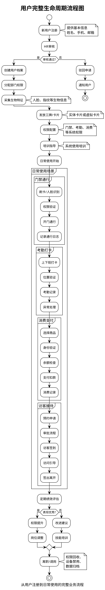

### 2. 门禁通行完整流程图

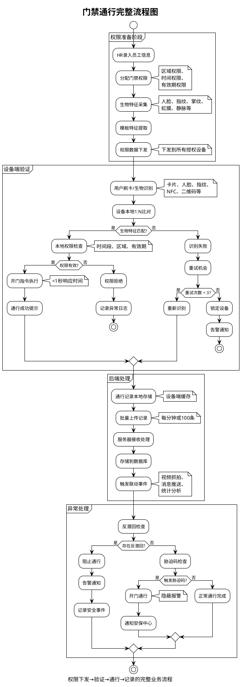

### 3. 考勤打卡完整流程图

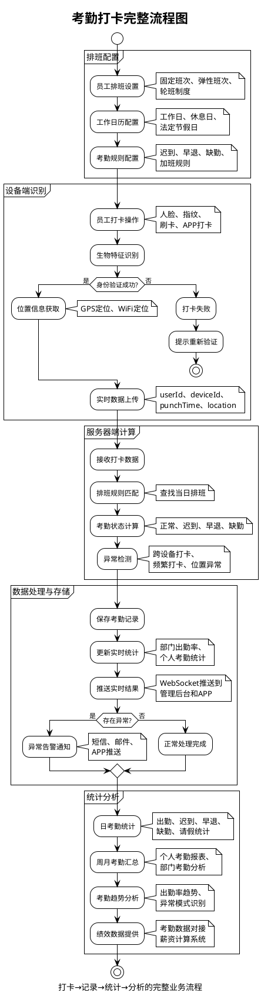

### 4. 消费支付完整流程图

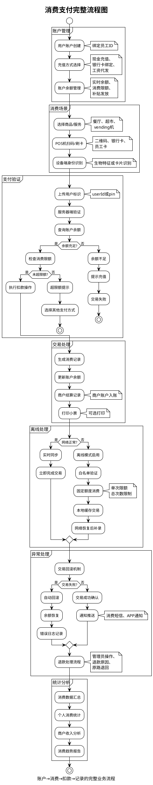

### 5. 访客接待完整流程图

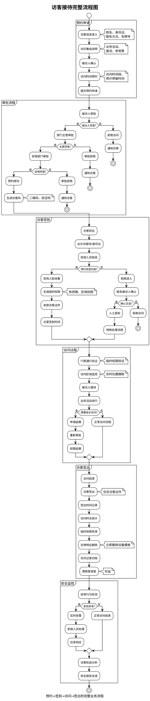

### 6. 视频监控完整流程图

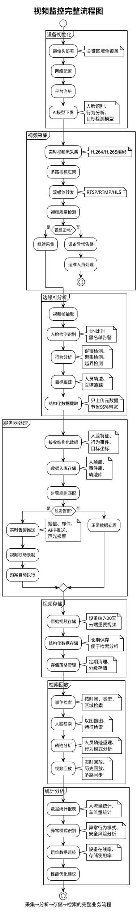

---

## 微服务交互流程图

### 1. 微服务间调用关系图

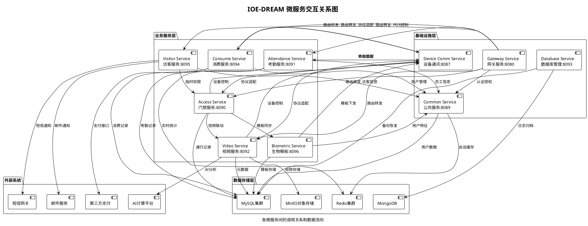

### 2. 数据流转和依赖关系图

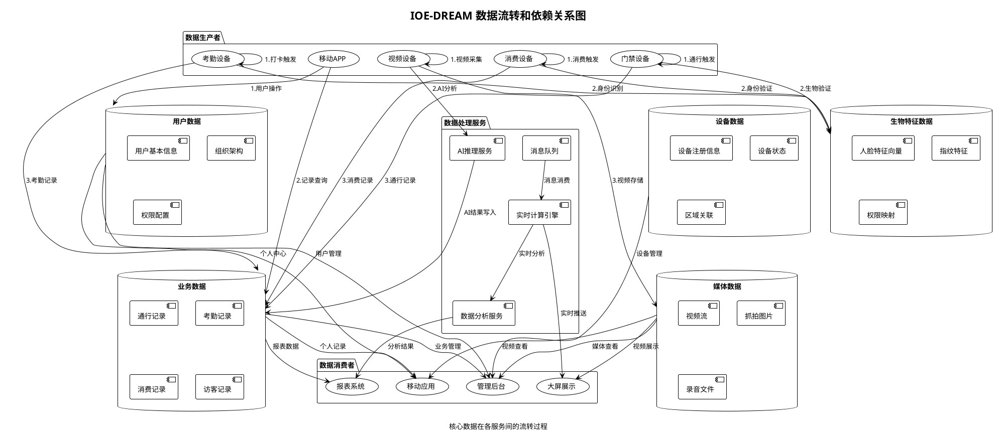

### 3. 跨服务业务流程图

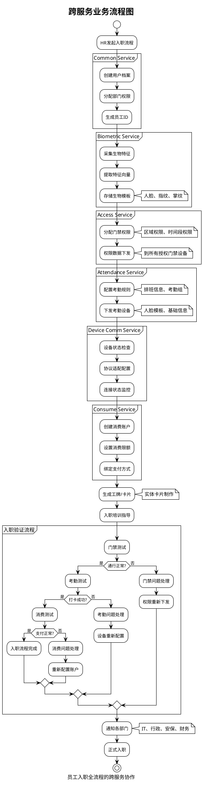

---

## 业务规则流程图

### 1. 权限管理和授权流程

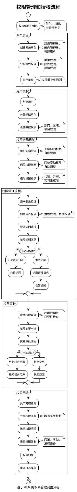

### 2. 异常处理和恢复流程

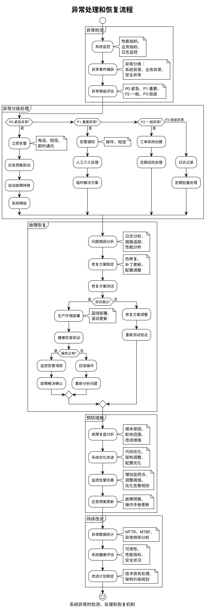

### 3. 数据同步和一致性保障流程

```plantuml
@startuml DataSyncConsistencyFlow
!theme plain
skinparam backgroundColor #FFF
skinparam defaultFontName "Microsoft YaHei"
skinparam shadowing false

title 数据同步和一致性保障流程
caption 分布式环境下的数据一致性保障机制

start

partition "数据变更" {
  :业务操作触发;
  note right: 用户操作、\n设备数据、\n系统配置

  :数据变更事件;
  :变更类型识别;
  note right: 创建、更新、\n删除、批量操作
}

partition "事务处理" {
  :本地事务开始;
  :数据变更执行;

  if (变更成功?) then (是)
    :事务日志记录;
    :发布变更事件;
    note right: 消息队列、\n事件总线
  else (否)
    :本地事务回滚;
    :错误处理;
    stop
  endif
}

partition "分布式同步" {
  :消息队列投递;
  note right: 可靠消息、\n顺序保证

  :消费者接收;
  :远程事务执行;

  if (远程成功?) then (是)
    :确认消息;
    :同步完成;
  else (否)
    :重试机制;
    note right: 指数退避、\n最大重试次数

    if (重试成功?) then (是)
      :同步完成;
    else (否)
      :死信队列;
      :人工介入处理;
    endif
  endif
}

partition "一致性验证" {
  :数据校验触发;
  note right: 定时任务、\n手动触发、\n事件触发

  :数据比对检查;
  note right: 哈希比对、\n记录数比对、\n关键字段比对

  if (数据一致?) then (是)
    :验证通过;
    :清理临时数据;
  else (否)
    :差异记录;
    :自动修复尝试;

    if (修复成功?) then (是)
      :修复确认;
    else (否)
      :告警通知;
      :人工处理;
    endif
  endif
}

partition "冲突解决" {
  :冲突检测;
  note right: 并发更新、\n网络分区、\n时钟漂移

  :冲突类型分析;
  note right: 写-写冲突、\n读-写冲突、\n版本冲突

  :冲突解决策略;
  note right: 最后写入胜利、\n业务规则优先、\n人工裁定

  :数据合并执行;
  :冲突解决确认;
}

partition "备份恢复" {
  :数据备份策略;
  note right: 全量备份、\n增量备份、\n实时备份

  :备份验证执行;
  :恢复流程测试;

  if (需要恢复?) then (是)
    :恢复点选择;
    :数据恢复执行;
    :一致性验证;

    if (验证通过?) then (是)
      :服务切换;
      :业务恢复;
    else (否)
      :恢复失败处理;
      :应急方案启动;
    endif
  endif
}

stop

@enduml
```

---

## 总结

本文档提供了IOE-DREAM智能管理系统的完整业务流程图集，涵盖了：

### 核心业务流程
1. **用户生命周期**：从注册到日常使用的完整闭环
2. **门禁通行**：边缘验证+后端管理的高效模式
3. **考勤管理**：设备识别+中心计算的混合架构
4. **消费支付**：在线验证+离线降级的双重保障
5. **访客接待**：临时权限+全程跟踪的安全管理
6. **视频监控**：边缘AI+云端分析的智能架构

### 微服务交互
1. **服务调用关系**：清晰的依赖和调用链路
2. **数据流转**：完整的数据产生到消费过程
3. **跨服务协作**：典型的入职流程跨服务示例

### 业务规则
1. **权限管理**：基于RBAC的权限体系
2. **异常处理**：分级响应和自动恢复机制
3. **数据一致性**：分布式环境下的保障策略

所有流程图都采用标准的PlantUML格式，可以直接渲染使用，为系统设计和业务理解提供了清晰的可视化指导。

---

*文档版本：v1.0.0*
*生成时间：2025-12-21*
*作者：IOE-DREAM架构团队*