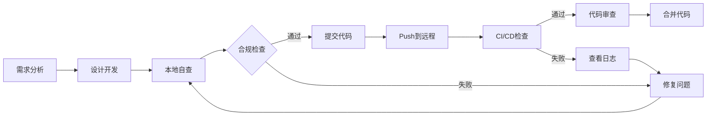

# 📚 IOE-DREAM CI/CD架构合规性检查培训指南

**培训版本**: v1.0.0  
**培训对象**: IOE-DREAM全体开发人员  
**培训时长**: 60分钟  
**培训类型**: 必修课程  
**更新日期**: 2025-12-02

---

## 🎯 培训目标

完成本培训后，开发人员能够：
- ✅ 理解IOE-DREAM架构规范的核心要求
- ✅ 掌握本地代码合规性自查方法
- ✅ 熟练使用CI/CD流水线
- ✅ 快速定位并修复合规性问题
- ✅ 避免常见的架构违规错误

---

## 📋 第一章：架构规范核心要点

### 1.1 四层架构铁律（P0级）

```
Controller → Service → Manager → DAO
```

**核心原则**:
- ❌ 禁止跨层访问
- ❌ 禁止DAO包含业务逻辑
- ❌ 禁止Controller处理事务
- ✅ 事务只在Service和DAO层

### 1.2 依赖注入规范（P0级）

```java
// ✅ 正确 - 必须使用@Resource
@Service
public class UserServiceImpl implements UserService {
    @Resource
    private UserDao userDao;
    
    @Resource
    private UserManager userManager;
}

// ❌ 错误 - 禁止使用@Autowired
@Service
public class UserServiceImpl implements UserService {
    @Autowired  // 违规！
    private UserDao userDao;
}
```

### 1.3 DAO层命名规范（P0级）

```java
// ✅ 正确 - 使用@Mapper和Dao后缀
@Mapper
public interface UserDao extends BaseMapper<UserEntity> {
    // MyBatis-Plus方法
}

// ❌ 错误 - 禁止@Repository和Repository后缀
@Repository  // 违规！
public interface UserRepository extends JpaRepository<UserEntity, Long> {
    // JPA方法 - 违规！
}
```

### 1.4 Jakarta包名规范（P0级）

```java
// ✅ 正确 - 使用jakarta包名
import jakarta.annotation.Resource;
import jakarta.validation.Valid;
import jakarta.validation.constraints.*;

// ❌ 错误 - 禁止使用javax包名
import javax.annotation.Resource;  // 违规！
import javax.validation.Valid;     // 违规！
```

### 1.5 连接池配置规范（P0级）

```yaml
# ✅ 正确 - 使用Druid连接池
spring:
  datasource:
    type: com.alibaba.druid.pool.DruidDataSource
    druid:
      initial-size: 5
      min-idle: 5
      max-active: 20
      validation-query: SELECT 1

# ❌ 错误 - 禁止使用HikariCP
spring:
  datasource:
    type: com.zaxxer.hikari.HikariDataSource  # 违规！
    hikari:
      maximum-pool-size: 20
```

---

## 🔍 第二章：本地自查方法

### 2.1 提交代码前检查清单

#### Windows PowerShell检查命令

```powershell
# 进入项目根目录
cd D:\IOE-DREAM

# 1. 检查@Repository违规
Select-String -Path "microservices\*\*.java" -Pattern "import org\.springframework\.stereotype\.Repository" -Recurse

# 2. 检查@Autowired违规
Select-String -Path "microservices\*\*.java" -Pattern "import org\.springframework\.beans\.factory\.annotation\.Autowired" -Recurse

# 3. 检查javax包名
Select-String -Path "microservices\*\*.java" -Pattern "import javax\.validation" -Recurse

# 4. 检查HikariCP配置
Select-String -Path "microservices\*\application*.yml" -Pattern "hikari:" -Recurse

# 5. 本地编译验证
mvn clean compile -DskipTests
```

#### 快速自查脚本

创建快速检查脚本 `check-compliance.ps1`:

```powershell
Write-Host "===== IOE-DREAM架构合规性自查 =====" -ForegroundColor Cyan

$violations = 0

# 检查@Repository
Write-Host "`n1. 检查@Repository违规..." -ForegroundColor Yellow
$results = Select-String -Path "microservices\*\*.java" -Pattern "import org\.springframework\.stereotype\.Repository" -Recurse
if ($results) {
    Write-Host "  ❌ 发现 $($results.Count) 个违规" -ForegroundColor Red
    $violations++
} else {
    Write-Host "  ✅ 通过" -ForegroundColor Green
}

# 检查@Autowired
Write-Host "`n2. 检查@Autowired违规..." -ForegroundColor Yellow
$results = Select-String -Path "microservices\*\*.java" -Pattern "import org\.springframework\.beans\.factory\.annotation\.Autowired" -Recurse
if ($results) {
    Write-Host "  ❌ 发现 $($results.Count) 个违规" -ForegroundColor Red
    $violations++
} else {
    Write-Host "  ✅ 通过" -ForegroundColor Green
}

# 检查javax包名
Write-Host "`n3. 检查javax包名违规..." -ForegroundColor Yellow
$results = Select-String -Path "microservices\*\*.java" -Pattern "import javax\.validation" -Recurse
if ($results) {
    Write-Host "  ❌ 发现 $($results.Count) 个违规" -ForegroundColor Red
    $violations++
} else {
    Write-Host "  ✅ 通过" -ForegroundColor Green
}

# 检查HikariCP
Write-Host "`n4. 检查HikariCP配置违规..." -ForegroundColor Yellow
$results = Select-String -Path "microservices\*\application*.yml" -Pattern "hikari:" -Recurse
if ($results) {
    Write-Host "  ❌ 发现 $($results.Count) 个违规" -ForegroundColor Red
    $violations++
} else {
    Write-Host "  ✅ 通过" -ForegroundColor Green
}

# 总结
Write-Host "`n===== 检查完成 =====" -ForegroundColor Cyan
if ($violations -eq 0) {
    Write-Host "✅ 全部通过！可以提交代码" -ForegroundColor Green
} else {
    Write-Host "❌ 发现 $violations 类违规，请修复后再提交" -ForegroundColor Red
    exit 1
}
```

### 2.2 自动化修复工具

项目提供了3个自动化修复脚本：

```powershell
# 修复@Repository违规
.\scripts\fix-repository-violations.ps1

# 修复javax包名
.\scripts\fix-javax-violations.ps1

# 修复HikariCP配置
.\scripts\fix-hikari-to-druid.ps1

# 修复Maven插件版本
.\scripts\fix-maven-plugin-version.ps1
```

---

## 🚀 第三章：CI/CD流水线使用

### 3.1 GitLab CI/CD流水线

#### 触发条件
- Push到develop或main分支
- 创建Merge Request
- 手动触发（workflow_dispatch）

#### 流水线阶段

**阶段1: compliance（合规性检查）**
```yaml
├── repository-violation-check    # @Repository检查
├── autowired-violation-check     # @Autowired检查
├── javax-package-check           # javax包名检查
├── hikari-config-check           # HikariCP配置检查
├── dao-naming-check              # DAO命名检查
└── password-security-check       # 密码安全检查
```

**阶段2: build（编译构建）**
```yaml
└── maven-compile                 # Maven多线程编译
```

**阶段3: test（测试验证）**
```yaml
├── unit-test                     # 单元测试
└── integration-test              # 集成测试
```

**阶段4: package（打包）**
```yaml
├── jar-package                   # JAR包打包
└── docker-build                  # Docker镜像构建
```

**阶段5: deploy（部署）**
```yaml
├── deploy-dev                    # 部署到开发环境
└── deploy-prod                   # 部署到生产环境
```

#### 查看流水线状态

**GitLab界面**:
1. 进入项目页面
2. 点击左侧菜单 "CI/CD" → "Pipelines"
3. 查看最新流水线状态
4. 点击任务查看详细日志

**命令行查看**:
```bash
# 查看最新流水线状态
gitlab-runner status

# 查看流水线日志
gitlab-runner logs
```

### 3.2 GitHub Actions工作流

#### 触发条件
- Push到main或develop分支
- 创建Pull Request

#### 工作流任务
```yaml
合规性检查任务:
├── repository-violation-check
├── autowired-violation-check
├── javax-package-check
├── hikari-config-check
├── dao-naming-check
├── maven-compile
├── password-security-check
└── generate-report
```

#### 查看工作流状态

**GitHub界面**:
1. 进入仓库页面
2. 点击 "Actions" 标签
3. 查看工作流运行历史
4. 点击具体运行查看详情

**下载检查报告**:
1. 进入工作流运行详情
2. 滚动到底部 "Artifacts"
3. 下载 `compliance-report.md`

---

## 🛠️ 第四章：常见问题与解决方案

### 4.1 @Repository违规问题

**问题描述**:
```
❌ 发现@Repository违规！必须使用@Mapper
```

**解决步骤**:
```java
// 1. 移除@Repository import
- import org.springframework.stereotype.Repository;

// 2. 确保有@Mapper import
+ import org.apache.ibatis.annotations.Mapper;

// 3. 替换注解
- @Repository
+ @Mapper
```

**自动修复**:
```powershell
.\scripts\fix-repository-violations.ps1
```

### 4.2 @Autowired违规问题

**问题描述**:
```
❌ 发现@Autowired违规！必须使用@Resource
```

**解决步骤**:
```java
// 1. 移除@Autowired import
- import org.springframework.beans.factory.annotation.Autowired;

// 2. 添加@Resource import
+ import jakarta.annotation.Resource;

// 3. 替换注解
- @Autowired
+ @Resource
```

### 4.3 javax包名违规问题

**问题描述**:
```
❌ 发现javax.validation违规！必须使用jakarta.validation
```

**解决步骤**:
```java
// 统一替换包名
- import javax.validation.Valid;
- import javax.validation.constraints.*;
+ import jakarta.validation.Valid;
+ import jakarta.validation.constraints.*;
```

**自动修复**:
```powershell
.\scripts\fix-javax-violations.ps1
```

### 4.4 HikariCP配置违规问题

**问题描述**:
```
❌ 发现HikariCP配置！必须使用Druid连接池
```

**解决步骤**:
```yaml
# 1. 修改数据源类型
spring:
  datasource:
-   type: com.zaxxer.hikari.HikariDataSource
+   type: com.alibaba.druid.pool.DruidDataSource

# 2. 替换配置块
-   hikari:
-     maximum-pool-size: 20
+   druid:
+     initial-size: 5
+     min-idle: 5
+     max-active: 20
```

**自动修复**:
```powershell
.\scripts\fix-hikari-to-druid.ps1
```

### 4.5 编译失败问题

**常见编译错误**:

1. **依赖版本缺失**
```xml
<!-- 在根pom.xml的dependencyManagement中添加 -->
<dependency>
    <groupId>org.springframework.cloud</groupId>
    <artifactId>spring-cloud-starter-sleuth</artifactId>
    <version>${sleuth.version}</version>
</dependency>
```

2. **父POM引用错误**
```xml
<parent>
    <groupId>net.lab1024.sa</groupId>
    <artifactId>smart-admin-microservices</artifactId>
    <version>1.0.0</version>
    <relativePath>../../pom.xml</relativePath>
</parent>
```

3. **插件版本缺失**
```xml
<plugin>
    <groupId>org.springframework.boot</groupId>
    <artifactId>spring-boot-maven-plugin</artifactId>
    <version>${spring-boot.version}</version>
</plugin>
```

---

## 📝 第五章：开发工作流程

### 5.1 日常开发流程



### 5.2 代码提交前检查清单

```
开发完成后，按顺序执行：

□ 1. 运行本地自查脚本
    .\check-compliance.ps1

□ 2. 本地编译验证
    mvn clean compile -DskipTests

□ 3. 运行单元测试
    mvn test

□ 4. 代码格式化
    mvn spotless:apply

□ 5. 提交代码
    git add .
    git commit -m "feat(module): description"
    git push

□ 6. 查看CI/CD状态
    检查GitLab Pipeline或GitHub Actions

□ 7. 修复CI/CD发现的问题（如有）
```

### 5.3 Pull Request流程

```
1. 创建功能分支
   git checkout -b feature/your-feature

2. 开发并本地测试
   (遵循上述检查清单)

3. 推送到远程
   git push origin feature/your-feature

4. 创建Pull Request
   - 填写详细的PR描述
   - 关联相关Issue
   - 等待CI/CD检查

5. CI/CD自动检查
   ✅ 架构合规性检查
   ✅ 编译验证
   ✅ 单元测试
   ✅ 代码覆盖率

6. 代码审查
   - 至少1位审查者批准
   - 解决所有审查意见

7. 合并代码
   - Squash合并（保持提交历史清晰）
```

---

## 🎓 第六章：实战演练

### 演练1：修复@Repository违规

**场景**: 你创建了一个新的DAO接口

**错误代码**:
```java
package net.lab1024.sa.user.repository;

import org.springframework.stereotype.Repository;
import org.springframework.data.jpa.repository.JpaRepository;
import net.lab1024.sa.user.entity.UserEntity;

@Repository
public interface UserRepository extends JpaRepository<UserEntity, Long> {
}
```

**任务**: 请修复为符合规范的代码

**正确代码**:
```java
package net.lab1024.sa.user.dao;

import org.apache.ibatis.annotations.Mapper;
import com.baomidou.mybatisplus.core.mapper.BaseMapper;
import net.lab1024.sa.user.entity.UserEntity;

/**
 * 用户DAO接口
 * 严格遵循CLAUDE.md规范：
 * - 使用@Mapper注解（禁止@Repository）
 * - 使用Dao后缀（禁止Repository后缀）
 * - 继承BaseMapper（使用MyBatis-Plus）
 */
@Mapper
public interface UserDao extends BaseMapper<UserEntity> {
}
```

**修复要点**:
1. ✅ 目录从repository改为dao
2. ✅ 文件名从UserRepository改为UserDao
3. ✅ 注解从@Repository改为@Mapper
4. ✅ 继承从JpaRepository改为BaseMapper
5. ✅ 添加规范注释

### 演练2：配置数据库连接池

**场景**: 新建微服务需要配置数据库连接

**错误配置**:
```yaml
spring:
  datasource:
    url: jdbc:mysql://localhost:3306/db
    username: root
    password: root
    hikari:
      maximum-pool-size: 20
```

**任务**: 请修改为符合规范的配置

**正确配置**:
```yaml
spring:
  datasource:
    driver-class-name: com.mysql.cj.jdbc.Driver
    url: jdbc:mysql://localhost:3306/db?useUnicode=true&characterEncoding=utf8&serverTimezone=GMT%2B8
    username: ${DB_USERNAME:root}
    password: ${DB_PASSWORD:root}
    type: com.alibaba.druid.pool.DruidDataSource
    druid:
      initial-size: 5
      min-idle: 5
      max-active: 20
      max-wait: 60000
      validation-query: SELECT 1
      test-while-idle: true
      test-on-borrow: false
      test-on-return: false
```

**修复要点**:
1. ✅ 使用Druid数据源
2. ✅ 完整的JDBC URL配置
3. ✅ 使用环境变量（避免明文密码）
4. ✅ 合理的连接池参数

### 演练3：CI/CD失败排查

**场景**: Pipeline失败，显示架构违规

**失败日志**:
```
❌ 发现@Repository违规！
File: UserRepository.java
Line: 7
必须使用@Mapper注解
```

**排查步骤**:
```bash
# 1. 查看详细日志
   点击失败的Job → 查看完整日志

# 2. 本地重现问题
   grep -r "@Repository" --include="*.java" microservices/

# 3. 使用修复脚本
   .\scripts\fix-repository-violations.ps1

# 4. 本地验证
   mvn clean compile -DskipTests

# 5. 重新提交
   git add .
   git commit --amend --no-edit
   git push --force-with-lease
```

---

## 📊 第七章：质量指标监控

### 7.1 关键质量指标

| 指标 | 目标值 | 说明 |
|------|--------|------|
| 架构合规率 | 100% | 无任何架构违规 |
| 编译成功率 | >95% | 每次提交编译成功 |
| 测试覆盖率 | >80% | 单元测试覆盖率 |
| 代码重复率 | <3% | 代码复用性 |
| Pipeline成功率 | >90% | CI/CD稳定性 |

### 7.2 个人质量看板

每位开发者应该关注：
- 📊 最近10次提交的CI/CD成功率
- 📈 代码审查通过时间
- 🐛 引入的Bug数量
- ✅ 测试覆盖率贡献

---

## 🎯 第八章：最佳实践

### 8.1 代码提交最佳实践

**Commit Message规范**:
```bash
<type>(<scope>): <subject>

# type类型：
feat     - 新功能
fix      - Bug修复
docs     - 文档更新
style    - 代码格式调整
refactor - 重构
test     - 测试相关
chore    - 构建/工具变动
perf     - 性能优化

# 示例：
feat(access): 添加门禁设备批量导入功能

- 支持Excel文件导入
- 数据验证和错误提示
- 异步处理大批量数据

Closes #123
```

### 8.2 代码审查最佳实践

**审查者检查清单**:
```
□ 架构规范：是否符合四层架构
□ 命名规范：DAO层使用Dao后缀
□ 注入规范：使用@Resource注解
□ 包名规范：使用jakarta包名
□ 配置规范：使用Druid连接池
□ 异常处理：完整的try-catch
□ 事务管理：正确的@Transactional
□ 日志记录：关键操作有日志
□ 单元测试：测试覆盖率达标
□ 代码注释：清晰的JavaDoc
```

### 8.3 性能优化最佳实践

**数据库优化**:
```java
// ✅ 使用索引优化查询
@Select("SELECT * FROM user WHERE login_name = #{loginName} AND deleted = 0")
UserEntity selectByLoginName(@Param("loginName") String loginName);

// ✅ 避免深度分页
default Page<UserEntity> selectPageOptimized(Long lastId, Integer pageSize) {
    LambdaQueryWrapper<UserEntity> wrapper = new LambdaQueryWrapper<>();
    wrapper.gt(lastId != null, UserEntity::getId, lastId)
           .eq(UserEntity::getDeleted, 0)
           .orderByAsc(UserEntity::getId)
           .last("LIMIT " + pageSize);
    return selectPage(new Page<>(1, pageSize), wrapper);
}
```

**缓存优化**:
```java
// ✅ 使用多级缓存
@Component
public class UserCacheManager {
    @Resource
    private RedisTemplate<String, Object> redisTemplate;
    
    private Cache<String, UserEntity> localCache = Caffeine.newBuilder()
            .maximumSize(1000)
            .expireAfterWrite(Duration.ofMinutes(5))
            .build();
    
    public UserEntity getUserWithCache(Long userId) {
        // L1本地缓存
        String key = "user:" + userId;
        UserEntity user = localCache.getIfPresent(key);
        if (user != null) return user;
        
        // L2 Redis缓存
        user = (UserEntity) redisTemplate.opsForValue().get(key);
        if (user != null) {
            localCache.put(key, user);
            return user;
        }
        
        // L3数据库查询
        user = userDao.selectById(userId);
        if (user != null) {
            localCache.put(key, user);
            redisTemplate.opsForValue().set(key, user, Duration.ofMinutes(30));
        }
        return user;
    }
}
```

---

## 🎖️ 第九章：认证与考核

### 9.1 认证要求

完成以下任务可获得"IOE-DREAM架构规范认证"：

```
□ 1. 阅读CLAUDE.md架构规范（30分钟）
□ 2. 完成本培训指南学习（60分钟）
□ 3. 完成3个实战演练（30分钟）
□ 4. 通过架构规范测验（20题，>=80分）
□ 5. 成功提交一次无违规的PR
□ 6. 独立修复一次CI/CD失败
```

### 9.2 测验示例题

**题目1**: 以下哪个依赖注入注解符合规范？
- A. @Autowired
- B. @Inject
- C. @Resource ✅
- D. 构造函数注入

**题目2**: DAO层接口应该使用什么注解？
- A. @Repository
- B. @Component
- C. @Service
- D. @Mapper ✅

**题目3**: 以下哪个包名符合规范？
- A. javax.validation.Valid
- B. jakarta.validation.Valid ✅
- C. javax.annotation.Resource
- D. javax.persistence.Entity

---

## 📞 第十章：支持与帮助

### 10.1 获取帮助

**遇到问题时**:
1. 查看本培训文档
2. 查看CLAUDE.md架构规范
3. 查看CI/CD日志
4. 咨询架构委员会
5. 在项目Issues提问

**联系方式**:
- 📧 架构委员会邮箱: architecture@ioedream.com
- 💬 企业微信群: IOE-DREAM技术支持
- 📝 Issue追踪: GitLab/GitHub Issues

### 10.2 持续改进

**反馈渠道**:
- 提交Issue改进建议
- 参加每月技术分享会
- 贡献最佳实践案例
- 更新培训材料

---

## 📚 附录

### 附录A：快速参考卡片

```
╔═══════════════════════════════════════╗
║   IOE-DREAM架构规范速查卡片           ║
╠═══════════════════════════════════════╣
║ ✅ 使用 @Resource                     ║
║ ✅ 使用 @Mapper                       ║
║ ✅ 使用 Dao后缀                       ║
║ ✅ 使用 jakarta.*                     ║
║ ✅ 使用 Druid连接池                   ║
║                                       ║
║ ❌ 禁止 @Autowired                    ║
║ ❌ 禁止 @Repository                   ║
║ ❌ 禁止 Repository后缀                ║
║ ❌ 禁止 javax.validation              ║
║ ❌ 禁止 HikariCP                      ║
╚═══════════════════════════════════════╝
```

### 附录B：相关文档链接

- 📖 [CLAUDE.md](../CLAUDE.md) - 全局架构规范
- 📋 [修复报告](../GLOBAL_COMPLIANCE_FIX_REPORT_20251202.md)
- 🔧 [验证报告](../VERIFICATION_FINAL_REPORT.md)
- 🚀 [GitLab CI配置](../.gitlab-ci.yml)
- 🔄 [GitHub Actions配置](../.github/workflows/compliance-check.yml)

### 附录C：自查脚本下载

所有自查和修复脚本位于：`D:\IOE-DREAM\scripts\`

```
check-compliance.ps1              - 快速自查脚本
fix-repository-violations.ps1     - 修复@Repository
fix-javax-violations.ps1          - 修复javax包名
fix-hikari-to-druid.ps1          - 修复HikariCP
fix-maven-plugin-version.ps1     - 修复插件版本
```

---

## ✅ 培训完成确认

**我已完成本培训，承诺**:
- ✅ 严格遵循CLAUDE.md架构规范
- ✅ 提交前执行本地自查
- ✅ 关注CI/CD检查结果
- ✅ 及时修复合规性问题
- ✅ 持续学习和改进

**姓名**: _______________  
**日期**: _______________  
**签字**: _______________

---

**培训版本**: v1.0.0  
**维护团队**: IOE-DREAM架构委员会  
**更新周期**: 每季度更新一次  
**反馈邮箱**: architecture@ioedream.com

