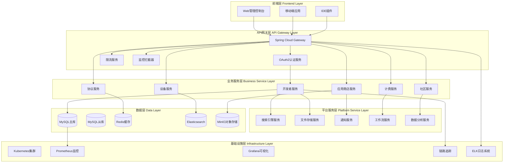

# IOE-DREAM 开发者生态技术架构设计

**版本**: v1.0.0
**制定日期**: 2025-12-16
**适用范围**: IOE-DREAM开发者生态技术架构
**架构原则**: 模块化、可扩展、高可用、安全合规

---

## 📋 架构总览

### 🎯 架构目标

构建**企业级开发者生态技术平台**，支持多语言SDK、开放API、插件市场、应用商店等核心功能，为开发者提供完整的设备管理和协议扩展能力。

### 🏗️ 架构分层



---

## 🔌 前端架构

### 1. Web管理控制台

#### 1.1 技术栈选择
```json
{
  "framework": "Vue 3.4 + TypeScript 5.0",
  "ui_library": "Ant Design Vue 4.0",
  "build_tool": "Vite 5.0",
  "state_management": "Pinia 2.0",
  "router": "Vue Router 4.0",
  "http_client": "Axios 1.6",
  "chart_library": "ECharts 5.4",
  "monaco_editor": "Monaco Editor",
  "testing": "Vitest + Vue Test Utils"
}
```

#### 1.2 项目结构
```
developer-console/
├── src/
│   ├── types/                    # TypeScript类型定义
│   │   ├── developer.ts
│   │   ├── protocol.ts
│   │   ├── application.ts
│   │   └── api.ts
│   ├── services/                 # API服务
│   │   ├── api.ts
│   │   ├── developer.ts
│   │   ├── protocol.ts
│   │   └── application.ts
│   ├── components/              # 公共组件
│   │   ├── common/
│   │   ├── charts/
│   │   ├── forms/
│   │   └── editors/
│   ├── views/                   # 页面组件
│   │   ├── dashboard/
│   │   ├── projects/
│   │   ├── protocols/
│   │   ├── applications/
│   │   ├── analytics/
│   │   └── settings/
│   ├── store/                   # 状态管理
│   │   ├── developer.ts
│   │   ├── protocol.ts
│   │   └── application.ts
│   ├── router/                  # 路由配置
│   ├── utils/                   # 工具函数
│   └── assets/                  # 静态资源
├── public/
├── docs/                       # 文档
├── tests/                      # 测试文件
└── dist/                       # 构建输出
```

#### 1.3 核心组件设计
```typescript
// 协议编辑器组件
<template>
  <div class="protocol-editor">
    <div class="editor-toolbar">
      <a-space>
        <a-button @click="loadTemplate">加载模板</a-button>
        <a-button @click="validateProtocol">验证协议</a-button>
        <a-button type="primary" @click="saveProtocol">保存协议</a-button>
        <a-button @click="testProtocol">测试协议</a-button>
      </a-space>
    </div>
    <div class="editor-container">
      <monaco-editor
        v-model="protocolCode"
        :language="editorLanguage"
        :options="editorOptions"
        @change="onCodeChange"
      />
    </div>
    <div class="output-panel">
      <a-tabs>
        <a-tab-pane key="output" tab="输出">
          <div class="console-output" ref="outputConsole"></div>
        </a-tab-pane>
        <a-tab-pane key="errors" tab="错误">
          <div class="error-list">
            <a-alert
              v-for="error in errors"
              :key="error.id"
              :message="error.message"
              :type="error.type"
              show-icon
              closable
            />
          </div>
        </a-tab-pane>
      </a-tabs>
    </div>
  </div>
</template>

<script setup lang="ts">
import { ref, onMounted } from 'vue';
import { MonacoEditor } from '@monaco-editor/vue3';
import { protocolService } from '@/services/protocol';

// 响应式数据
const protocolCode = ref<string>('');
const errors = ref<ProtocolError[]>([]);
const editorLanguage = ref<'java' | 'python' | 'typescript'>('java');

// 编辑器配置
const editorOptions = {
  theme: 'vs-dark',
  automaticLayout: true,
  minimap: { enabled: false },
  fontSize: 14,
  wordWrap: 'on',
  formatOnPaste: true,
  formatOnType: true
};

// 方法
const loadTemplate = async () => {
  const template = await protocolService.getProtocolTemplate();
  protocolCode.value = template.code;
};

const validateProtocol = async () => {
  try {
    const result = await protocolService.validateProtocol(protocolCode.value);
    if (result.isValid) {
      message.success('协议验证通过');
    } else {
      errors.value = result.errors;
    }
  } catch (error) {
    message.error('协议验证失败');
  }
};

const saveProtocol = async () => {
  try {
    await protocolService.saveProtocol(protocolCode.value);
    message.success('协议保存成功');
  } catch (error) {
    message.error('协议保存失败');
  }
};

const testProtocol = async () => {
  try {
    const result = await protocolService.testProtocol(protocolCode.value);
    message.success(`协议测试成功，发现 ${result.devices.length} 个设备`);
  } catch (error) {
    message.error('协议测试失败');
  }
};
</script>
```

### 2. IDE插件

#### 2.1 VS Code插件架构
```json
{
  "name": "ioe-dream-developer",
  "displayName": "IOE-DREAM Developer",
  "description": "IOE-DREAM设备协议开发插件",
  "version": "1.0.0",
  "engines": {
    "vscode": "^1.85.0"
  },
  "categories": [
    "Programming Languages",
    "Snippets",
    "Debuggers"
  ],
  "activationEvents": [
    "onLanguage:java",
    "onLanguage:python",
    "onLanguage:typescript"
  ],
  "main": "./out/extension.js",
  "contributes": {
    "commands": [
      {
        "command": "ioe-dream.createProtocol",
        "title": "Create IOE-DREAM Protocol",
        "category": "IOE-DREAM"
      },
      {
        "command": "ioe-dream.testProtocol",
        "title": "Test Protocol",
        "category": "IOE-DREAM"
      },
      {
        "command": "ioe-dream.deployProtocol",
        "title": "Deploy Protocol",
        "category": "IOE-DREAM"
      }
    ],
    "views": {
      "explorer": [
        {
          "id": "ioe-dream-protocols",
          "name": "IOE-DREAM Protocols",
          "when": "workspaceHasIOEDream"
        }
      ]
    },
    "configuration": {
      "title": "IOE-DREAM",
      "properties": {
        "ioe-dream.apiEndpoint": {
          "type": "string",
          "default": "https://api.ioe-dream.com",
          "description": "IOE-DREAM API endpoint"
        },
        "ioe-dream.apiKey": {
          "type": "string",
          "description": "IOE-DREAM API key"
        }
      }
    }
  }
}
```

#### 2.2 插件核心功能
```typescript
// extension.ts - VS Code插件入口
import * as vscode from 'vscode';
import { IOEDreamClient } from './client/ioe-dream-client';
import { ProtocolProvider } from './providers/protocol-provider';

export function activate(context: vscode.ExtensionContext) {
    // 初始化IOE-DREAM客户端
    const client = new IOEDreamClient();

    // 注册协议树视图
    const protocolProvider = new ProtocolProvider(client);
    vscode.window.registerTreeDataProvider('ioe-dream-protocols', protocolProvider);

    // 注册命令
    const commands = [
        vscode.commands.registerCommand('ioe-dream.createProtocol', () => {
            createProtocolCommand(client);
        }),
        vscode.commands.registerCommand('ioe-dream.testProtocol', (protocol) => {
            testProtocolCommand(client, protocol);
        }),
        vscode.commands.registerCommand('ioe-dream.deployProtocol', (protocol) => {
            deployProtocolCommand(client, protocol);
        })
    ];

    commands.forEach(command => context.subscriptions.push(command));
}

// IOE-DREAM客户端
export class IOEDreamClient {
    private apiKey: string;
    private apiEndpoint: string;

    constructor() {
        const config = vscode.workspace.getConfiguration('ioe-dream');
        this.apiKey = config.get('apiKey') || '';
        this.apiEndpoint = config.get('apiEndpoint') || 'https://api.ioe-dream.com';
    }

    async createProtocol(protocol: ProtocolDefinition): Promise<string> {
        const response = await fetch(`${this.apiEndpoint}/api/v1/developer/protocols`, {
            method: 'POST',
            headers: {
                'Authorization': `Bearer ${this.apiKey}`,
                'Content-Type': 'application/json'
            },
            body: JSON.stringify(protocol)
        });

        const data = await response.json();
        return data.data.protocolId;
    }

    async testProtocol(protocolId: string, testConfig: ProtocolTestConfig): Promise<ProtocolTestResult> {
        const response = await fetch(`${this.apiEndpoint}/api/v1/developer/protocols/${protocolId}/test`, {
            method: 'POST',
            headers: {
                'Authorization': `Bearer ${this.apiKey}`,
                'Content-Type': 'application/json'
            },
            body: JSON.stringify(testConfig)
        });

        return response.json();
    }
}
```

---

## 🌐 API网关架构

### 1. Spring Cloud Gateway配置

#### 1.1 基础配置
```yaml
# application.yml
server:
  port: 8080

spring:
  application:
    name: ioe-dream-gateway
  cloud:
    gateway:
      routes:
        # 开发者API路由
        - id: developer-api-v1
          uri: lb://ioedream-developer-service
          predicates:
            - Path=/api/v1/developer/**
          filters:
            - StripPrefix=3
            - name: RequestRateLimiter
              args:
                key-resolver: "#{@userKeyResolver}"
                replenishRate: 1000
                burstCapacity: 2000
            - name: AuthenticationFilter
            - name: SecurityAuditFilter

        # 设备API路由
        - id: device-api-v1
          uri: lb://ioedream-device-service
          predicates:
            - Path=/api/v1/device/**
          filters:
            - StripPrefix=3
            - name: RequestRateLimiter
              args:
                key-resolver: "#{@deviceKeyResolver}"
                replenishRate: 5000
                burstCapacity: 10000

        # 文件服务路由
        - id: file-service-v1
          uri: lb://ioedream-file-service
          predicates:
            - Path=/api/v1/files/**
          filters:
            - StripPrefix=3
            - name: FileUploadFilter

      # 跨域配置
      globalcors:
        cors-configurations:
          '[/**]':
            allowedOriginPatterns: "*"
            allowedMethods:
              - GET
              - POST
              - PUT
              - DELETE
              - OPTIONS
            allowedHeaders: "*"
            allowCredentials: true

  # Redis配置
  redis:
    host: ${REDIS_HOST:localhost}
    port: ${REDIS_PORT:6379}
    database: 0
    timeout: 3000
    lettuce:
      pool:
        max-active: 8
        max-idle: 8
        min-idle: 0

# JWT配置
jwt:
  secret: ${JWT_SECRET:ioe-dream-jwt-secret}
  expiration: 86400000 # 24小时
  refresh-expiration: 604800000 # 7天
```

#### 1.2 过滤器实现
```java
// 认证过滤器
@Component
@Slf4j
public class AuthenticationFilter implements GlobalFilter, Ordered {

    @Resource
    private JwtTokenProvider jwtTokenProvider;

    @Resource
    private UserRepository userRepository;

    @Override
    public Mono<Void> filter(ServerWebExchange exchange, GatewayFilterChain chain) {
        String path = exchange.getRequest().getPath().value();

        // 跳过认证的路径
        if (isPublicPath(path)) {
            return chain.filter(exchange);
        }

        // 获取Authorization头
        String authHeader = exchange.getRequest().getHeaders().getFirst("Authorization");

        if (authHeader == null || !authHeader.startsWith("Bearer ")) {
            return handleUnauthorized(exchange);
        }

        String token = authHeader.substring(7);

        try {
            // 验证JWT令牌
            Claims claims = jwtTokenProvider.validateToken(token);
            String userId = claims.getSubject();

            // 获取用户信息
            User user = userRepository.findById(userId);
            if (user == null || !user.isActive()) {
                return handleUnauthorized(exchange);
            }

            // 添加用户信息到请求头
            ServerHttpRequest modifiedRequest = exchange.getRequest().mutate()
                    .header("X-User-Id", userId)
                    .header("X-User-Role", user.getRole())
                    .header("X-Developer-Id", user.getDeveloperId())
                    .build();

            return chain.filter(exchange.mutate().request(modifiedRequest).build());

        } catch (Exception e) {
            log.warn("JWT token validation failed", e);
            return handleUnauthorized(exchange);
        }
    }

    private boolean isPublicPath(String path) {
        List<String> publicPaths = Arrays.asList(
                "/api/v1/developer/auth/login",
                "/api/v1/developer/auth/register",
                "/api/v1/developer/public/**",
                "/actuator/**"
        );
        return publicPaths.stream().anyMatch(path::startsWith);
    }

    private Mono<Void> handleUnauthorized(ServerWebExchange exchange) {
        exchange.getResponse().setStatusCode(HttpStatus.UNAUTHORIZED);
        return exchange.getResponse().setComplete();
    }

    @Override
    public int getOrder() {
        return -100; // 高优先级
    }
}

// 安全审计过滤器
@Component
@Slf4j
public class SecurityAuditFilter implements GlobalFilter, Ordered {

    @Resource
    private SecurityAuditService auditService;

    @Override
    public Mono<Void> filter(ServerWebExchange exchange, GatewayFilterChain chain) {
        long startTime = System.currentTimeMillis();
        String requestId = UUID.randomUUID().toString();
        String clientIp = getClientIp(exchange);
        String userAgent = exchange.getRequest().getHeaders().getFirst("User-Agent");

        // 添加请求ID到响应头
        ServerHttpResponse response = exchange.getResponse();
        response.getHeaders().add("X-Request-Id", requestId);

        return chain.filter(exchange).doFinally(signalType -> {
            long duration = System.currentTimeMillis() - startTime;
            int statusCode = response.getStatusCode() != null ?
                    response.getStatusCode().value() : 0;

            // 记录审计日志
            SecurityAuditEvent event = SecurityAuditEvent.builder()
                    .requestId(requestId)
                    .clientIp(clientIp)
                    .userAgent(userAgent)
                    .method(exchange.getRequest().getMethod().name())
                    .path(exchange.getRequest().getPath().value())
                    .statusCode(statusCode)
                    .duration(duration)
                    .timestamp(LocalDateTime.now())
                    .build();

            auditService.recordAuditEvent(event);
        });
    }

    private String getClientIp(ServerWebExchange exchange) {
        String xForwardedFor = exchange.getRequest().getHeaders().getFirst("X-Forwarded-For");
        if (xForwardedFor != null && !xForwardedFor.isEmpty()) {
            return xForwardedFor.split(",")[0].trim();
        }
        return exchange.getRequest().getRemoteAddress().getAddress().getHostAddress();
    }

    @Override
    public int getOrder() {
        return 0;
    }
}
```

### 2. 限流策略

#### 2.1 多维度限流
```java
// 限流配置
@ConfigurationProperties(prefix = "ioe-dream.rate-limit")
@Data
public class RateLimitConfiguration {
    private Map<String, RateLimitRule> rules = new HashMap<>();

    @Data
    public static class RateLimitRule {
        private String keyExpression; // SpEL表达式
        private int replenishRate;      // 补充速率
        private int burstCapacity;      // 突发容量
        private Duration timeout;       // 超时时间
        private List<String> excludedPaths; // 排除的路径
    }
}

// 自定义限流键解析器
@Component
public class UserKeyResolver implements KeyResolver {
    @Override
    public Mono<String> resolve(ServerWebExchange exchange) {
        // 基于用户ID限流
        String userId = exchange.getRequest().getHeaders().getFirst("X-User-Id");
        return userId != null ? Mono.just("user:" + userId) : Mono.just("anonymous");
    }
}

@Component
public class ApiKeyResolver implements KeyResolver {
    @Override
    public Mono<String> resolve(ServerWebExchange exchange) {
        // 基于API端点限流
        String path = exchange.getRequest().getPath().value();
        String method = exchange.getRequest().getMethod().name();
        return Mono.just("api:" + method + ":" + path);
    }
}

@Component
public class IpKeyResolver implements KeyResolver {
    @Override
    public Mono<String> resolve(ServerWebExchange exchange) {
        // 基于IP限流
        String ip = exchange.getRequest().getRemoteAddress().getAddress().getHostAddress();
        return Mono.just("ip:" + ip);
    }
}

// 动态限流过滤器
@Component
@Slf4j
public class DynamicRateLimitFilter implements GlobalFilter, Ordered {

    @Resource
    private RateLimitConfiguration rateLimitConfig;

    @Resource
    private Map<String, KeyResolver> keyResolvers;

    @Resource
    private RateLimiter rateLimiter;

    @Override
    public Mono<Void> filter(ServerWebExchange exchange, GatewayFilterChain chain) {
        String path = exchange.getRequest().getPath().value();

        // 查找匹配的限流规则
        Optional<RateLimitRule> rule = rateLimitConfig.getRules().entrySet().stream()
                .filter(entry -> path.matches(entry.getKey()))
                .map(Map.Entry::getValue)
                .findFirst();

        if (!rule.isPresent()) {
            return chain.filter(exchange);
        }

        RateLimitRule rateLimitRule = rule.get();

        // 检查是否在排除列表中
        if (rateLimitRule.getExcludedPaths() != null &&
            rateLimitRule.getExcludedPaths().stream().anyMatch(path::startsWith)) {
            return chain.filter(exchange);
        }

        // 解析限流键
        KeyResolver keyResolver = keyResolvers.get(rateLimitRule.getKeyExpression());
        if (keyResolver == null) {
            return chain.filter(exchange);
        }

        return keyResolver.resolve(exchange).flatMap(key -> {
            boolean allowed = rateLimiter.tryAcquire(
                    key,
                    rateLimitRule.getReplenishRate(),
                    rateLimitRule.getBurstCapacity()
            );

            if (allowed) {
                return chain.filter(exchange);
            } else {
                exchange.getResponse().setStatusCode(HttpStatus.TOO_MANY_REQUESTS);
                exchange.getResponse().getHeaders().add("X-Rate-Limit-Limit",
                        String.valueOf(rateLimitRule.getReplenishRate()));
                exchange.getResponse().getHeaders().add("X-Rate-Limit-Remaining", "0");
                exchange.getResponse().getHeaders().add("X-Rate-Limit-Reset",
                        String.valueOf(System.currentTimeMillis() + 60000));

                return exchange.getResponse().setComplete();
            }
        });
    }

    @Override
    public int getOrder() {
        return -50;
    }
}
```

---

## ⚙️ 业务服务架构

### 1. 开发者服务

#### 1.1 服务架构
```java
// 开发者服务接口
@Service
@Transactional(rollbackFor = Exception.class)
public class DeveloperServiceImpl implements DeveloperService {

    @Resource
    private DeveloperDao developerDao;

    @Resource
    private DeveloperManager developerManager;

    @Resource
    private ProjectService projectService;

    @Resource
    private ApiKeyService apiKeyService;

    @Override
    @Cacheable(value = "developer", key = "#developerId", unless = "#result == null")
    public DeveloperVO getDeveloper(String developerId) {
        DeveloperEntity developer = developerDao.selectById(developerId);
        if (developer == null) {
            throw new BusinessException("DEVELOPER_NOT_FOUND", "开发者不存在");
        }

        DeveloperVO vo = BeanUtils.copyProperties(developer, DeveloperVO.class);

        // 获取开发者统计信息
        DeveloperStats stats = getDeveloperStats(developerId);
        vo.setStats(stats);

        // 获取开发者等级
        DeveloperLevel level = calculateDeveloperLevel(stats);
        vo.setLevel(level);

        return vo;
    }

    @Override
    @Caching(evict = {
            @CacheEvict(value = "developer", key = "#developerId"),
            @CacheEvict(value = "developer-list", allEntries = true)
    })
    public DeveloperVO updateDeveloper(String developerId, DeveloperUpdateRequest request) {
        DeveloperEntity developer = developerDao.selectById(developerId);
        if (developer == null) {
            throw new BusinessException("DEVELOPER_NOT_FOUND", "开发者不存在");
        }

        // 更新基本信息
        BeanUtils.copyProperties(request, developer, "id", "createTime");
        developer.setUpdateTime(LocalDateTime.now());

        developerDao.updateById(developer);

        // 如果更新了邮箱，需要重新验证
        if (!Objects.equals(developer.getEmail(), request.getEmail())) {
            developer.setEmailVerified(false);
            developerDao.updateById(developer);

            // 发送验证邮件
            emailService.sendVerificationEmail(developer.getEmail());
        }

        return getDeveloper(developerId);
    }

    @Override
    @Cacheable(value = "developer-stats", key = "#developerId", unless = "#result == null")
    public DeveloperStats getDeveloperStats(String developerId) {
        DeveloperStats stats = new DeveloperStats();

        // 项目统计
        stats.setProjectCount(projectService.getProjectCount(developerId));
        stats.setActiveProjectCount(projectService.getActiveProjectCount(developerId));

        // API使用统计
        stats.setApiUsageCount(getApiUsageCount(developerId));
        stats.setApiUsageToday(getApiUsageToday(developerId));

        // 协议贡献统计
        stats.setProtocolContributionCount(getProtocolContributionCount(developerId));
        stats.setProtocolUsageCount(getProtocolUsageCount(developerId));

        // 应用发布统计
        stats.setApplicationCount(getApplicationCount(developerId));
        stats.setApplicationDownloadCount(getApplicationDownloadCount(developerId));

        // 社区贡献统计
        stats.setForumPostCount(getForumPostCount(developerId));
        stats.getForumLikeCount(getForumLikeCount(developerId));

        return stats;
    }

    private DeveloperLevel calculateDeveloperLevel(DeveloperStats stats) {
        int points = 0;

        // 项目积分
        points += stats.getProjectCount() * 10;
        points += stats.getActiveProjectCount() * 5;

        // API使用积分
        points += Math.min(stats.getApiUsageCount() / 1000, 100);

        // 协议贡献积分
        points += stats.getProtocolContributionCount() * 50;
        points += stats.getProtocolUsageCount() * 1;

        // 应用发布积分
        points += stats.getApplicationCount() * 30;
        points += stats.getApplicationDownloadCount() / 10;

        // 社区贡献积分
        points += stats.getForumPostCount() * 5;
        points += stats.getForumLikeCount();

        return DeveloperLevel.fromPoints(points);
    }
}
```

#### 1.2 开发者管理器
```java
// 开发者管理器 - 业务编排层
public class DeveloperManagerImpl implements DeveloperManager {

    private final DeveloperDao developerDao;
    private final UserRepository userRepository;
    private final EmailService emailService;
    private final SecurityService securityService;
    private final CacheManager cacheManager;

    // 构造函数注入
    public DeveloperManagerImpl(
            DeveloperDao developerDao,
            UserRepository userRepository,
            EmailService emailService,
            SecurityService securityService,
            CacheManager cacheManager) {
        this.developerDao = developerDao;
        this.userRepository = userRepository;
        this.emailService = emailService;
        this.securityService = securityService;
        this.cacheManager = cacheManager;
    }

    @Override
    @Transactional(rollbackFor = Exception.class)
    public String registerDeveloper(DeveloperRegistrationRequest request) {
        // 1. 验证邮箱唯一性
        if (developerDao.selectByEmail(request.getEmail()) != null) {
            throw new BusinessException("EMAIL_EXISTS", "邮箱已存在");
        }

        // 2. 创建用户账号
        User user = new User();
        user.setUsername(request.getUsername());
        user.setEmail(request.getEmail());
        user.setPassword(securityService.encodePassword(request.getPassword()));
        user.setRole(UserRole.DEVELOPER);
        user.setStatus(UserStatus.ACTIVE);
        userRepository.save(user);

        // 3. 创建开发者记录
        DeveloperEntity developer = new DeveloperEntity();
        developer.setUserId(user.getId());
        developer.setDeveloperName(request.getDeveloperName());
        developer.setEmail(request.getEmail());
        developer.setPhone(request.getPhone());
        developer.setCompany(request.getCompany());
        developer.setCountry(request.getCountry());
        developer.setRegistrationTime(LocalDateTime.now());
        developer.setStatus(DeveloperStatus.ACTIVE);

        developerDao.insert(developer);

        // 4. 创建默认项目
        createDefaultProject(developer.getId());

        // 5. 发送欢迎邮件
        emailService.sendWelcomeEmail(request.getEmail(), request.getDeveloperName());

        // 6. 清除缓存
        cacheManager.evict("developer-list");

        return developer.getId();
    }

    @Override
    public void verifyEmail(String email, String token) {
        // 1. 验证token
        EmailVerificationToken verificationToken = securityService.validateEmailToken(token);
        if (verificationToken == null || !verificationToken.getEmail().equals(email)) {
            throw new BusinessException("INVALID_TOKEN", "验证链接无效或已过期");
        }

        // 2. 更新邮箱验证状态
        DeveloperEntity developer = developerDao.selectByEmail(email);
        if (developer != null) {
            developer.setEmailVerified(true);
            developer.setEmailVerifiedTime(LocalDateTime.now());
            developerDao.updateById(developer);

            // 3. 清除缓存
            cacheManager.evict("developer:" + developer.getId());
        }

        // 4. 删除token
        securityService.deleteEmailToken(token);
    }

    private void createDefaultProject(String developerId) {
        ProjectEntity project = new ProjectEntity();
        project.setDeveloperId(developerId);
        project.setProjectName("Default Project");
        project.setProjectDescription("Default project for getting started");
        project.setProjectType(ProjectType.DEVELOPMENT);
        project.setStatus(ProjectStatus.ACTIVE);
        project.setCreateTime(LocalDateTime.now());

        projectRepository.save(project);
    }
}
```

### 2. 协议服务

#### 2.1 协议管理架构
```java
// 协议服务实现
@Service
@Transactional(rollbackFor = Exception.class)
public class ProtocolServiceImpl implements ProtocolService {

    @Resource
    private ProtocolDao protocolDao;

    @Resource
    private ProtocolManager protocolManager;

    @Resource
    private ProtocolValidator protocolValidator;

    @Resource
    private ProtocolSecurityChecker securityChecker;

    @Override
    @Cacheable(value = "protocol", key = "#protocolId", unless = "#result == null")
    public ProtocolVO getProtocol(String protocolId) {
        ProtocolEntity protocol = protocolDao.selectById(protocolId);
        if (protocol == null) {
            throw new BusinessException("PROTOCOL_NOT_FOUND", "协议不存在");
        }

        ProtocolVO vo = BeanUtils.copyProperties(protocol, ProtocolVO.class);

        // 获取协议指纹
        List<ProtocolFingerprintEntity> fingerprints =
                protocolFingerprintDao.selectByProtocolId(protocolId);
        vo.setFingerprints(fingerprints);

        // 获取协议使用统计
        ProtocolUsageStats stats = getProtocolUsageStats(protocolId);
        vo.setUsageStats(stats);

        return vo;
    }

    @Override
    @Caching(evict = {
            @CacheEvict(value = "protocol", key = "#result"),
            @CacheEvict(value = "protocol-list", allEntries = true)
    })
    public String registerProtocol(ProtocolRegistrationRequest request) {
        // 1. 协议验证
        ValidationResult validation = protocolValidator.validate(request.getProtocolCode());
        if (!validation.isValid()) {
            throw new BusinessException("PROTOCOL_VALIDATION_FAILED",
                    "协议验证失败: " + String.join(", ", validation.getErrors()));
        }

        // 2. 安全检查
        SecurityCheckResult securityCheck = securityChecker.check(request);
        if (!securityCheck.isSecure()) {
            throw new BusinessException("SECURITY_CHECK_FAILED",
                    "安全检查失败: " + String.join(", ", securityCheck.getIssues()));
        }

        // 3. 创建协议记录
        ProtocolEntity protocol = new ProtocolEntity();
        protocol.setProtocolName(request.getProtocolName());
        protocol.setProtocolDescription(request.getProtocolDescription());
        protocol.setProtocolCode(request.getProtocolCode());
        protocol.setProtocolLanguage(request.getProtocolLanguage());
        protocol.setVendorName(request.getVendorName());
        protocol.setDeviceTypes(String.join(",", request.getDeviceTypes()));
        protocol.setSupportedPorts(String.join(",", request.getSupportedPorts()));
        protocol.setVersion("1.0.0");
        protocol.setDeveloperId(request.getDeveloperId());
        protocol.setStatus(ProtocolStatus.PUBLISHED);
        protocol.setPublishTime(LocalDateTime.now());

        protocolDao.insert(protocol);

        // 4. 保存协议指纹
        if (request.getFingerprints() != null && !request.getFingerprints().isEmpty()) {
            request.getFingerprints().forEach(fingerprint -> {
                ProtocolFingerprintEntity fp = new ProtocolFingerprintEntity();
                fp.setProtocolId(protocol.getId());
                fp.setFingerprintType(fingerprint.getType());
                fp.setFingerprintPattern(fingerprint.getPattern());
                fp.setConfidenceLevel(fingerprint.getConfidenceLevel());
                protocolFingerprintDao.insert(fp);
            });
        }

        // 5. 编译和部署协议
        protocolManager.compileAndDeploy(protocol.getId());

        // 6. 发布协议注册事件
        eventPublisher.publishEvent(new ProtocolRegisteredEvent(protocol));

        return protocol.getId();
    }

    @Override
    @Cacheable(value = "protocol-usage-stats", key = "#protocolId", unless = "#result == null")
    public ProtocolUsageStats getProtocolUsageStats(String protocolId) {
        ProtocolUsageStats stats = new ProtocolUsageStats();

        // 使用该协议的设备数量
        stats.setDeviceCount(deviceService.getDeviceCountByProtocol(protocolId));

        // 协议调用量
        stats.setApiCallCount(getProtocolApiCallCount(protocolId));

        // 协议下载量
        stats.setDownloadCount(getProtocolDownloadCount(protocolId));

        // 平均响应时间
        stats.setAverageResponseTime(getProtocolAverageResponseTime(protocolId));

        // 成功率
        stats.setSuccessRate(getProtocolSuccessRate(protocolId));

        // 最近使用时间
        stats.setLastUsedTime(getProtocolLastUsedTime(protocolId));

        return stats;
    }

    @Override
    public ProtocolTestResult testProtocol(String protocolId, ProtocolTestConfig config) {
        // 1. 获取协议信息
        ProtocolEntity protocol = protocolDao.selectById(protocolId);
        if (protocol == null) {
            throw new BusinessException("PROTOCOL_NOT_FOUND", "协议不存在");
        }

        // 2. 编译协议
        CompiledProtocol compiledProtocol = protocolManager.compileProtocol(protocolId);

        // 3. 执行测试
        ProtocolTestExecutor executor = new ProtocolTestExecutor(compiledProtocol);
        ProtocolTestResult result = executor.execute(config);

        // 4. 记录测试结果
        ProtocolTestRecordEntity record = new ProtocolTestRecordEntity();
        record.setProtocolId(protocolId);
        record.setTestConfig(JsonUtils.toJson(config));
        record.setTestResult(JsonUtils.toJson(result));
        record.setTestTime(LocalDateTime.now());
        protocolTestRecordDao.insert(record);

        return result;
    }
}
```

#### 2.2 协议测试框架
```java
// 协议测试执行器
public class ProtocolTestExecutor {

    private final CompiledProtocol protocol;

    public ProtocolTestExecutor(CompiledProtocol protocol) {
        this.protocol = protocol;
    }

    public ProtocolTestResult execute(ProtocolTestConfig config) {
        ProtocolTestResult result = new ProtocolTestResult();
        result.setProtocolId(protocol.getProtocolId());
        result.setTestTime(LocalDateTime.now());

        List<DeviceTestResult> deviceResults = new ArrayList<>();

        for (String testIp : config.getTestIps()) {
            for (int testPort : config.getTestPorts()) {
                try {
                    DeviceTestResult deviceResult = testDevice(testIp, testPort, config);
                    deviceResults.add(deviceResult);
                } catch (Exception e) {
                    DeviceTestResult errorResult = new DeviceTestResult();
                    errorResult.setIpAddress(testIp);
                    errorResult.setPort(testPort);
                    errorResult.setSuccess(false);
                    errorResult.setErrorMessage(e.getMessage());
                    deviceResults.add(errorResult);
                }
            }
        }

        result.setDeviceResults(deviceResults);
        result.setSuccessCount(deviceResults.stream().mapToInt(r -> r.isSuccess() ? 1 : 0).sum());
        result.setTotalCount(deviceResults.size());
        result.setSuccessRate((double) result.getSuccessCount() / result.getTotalCount() * 100);

        return result;
    }

    private DeviceTestResult testDevice(String ipAddress, int port, ProtocolTestConfig config) {
        DeviceTestResult result = new DeviceTestResult();
        result.setIpAddress(ipAddress);
        result.setPort(port);

        // 1. 网络连接测试
        boolean isReachable = testNetworkConnection(ipAddress, port);
        result.setReachable(isReachable);

        if (!isReachable) {
            result.setSuccess(false);
            result.setErrorMessage("设备不可达");
            return result;
        }

        // 2. 协议检测
        boolean protocolDetected = protocol.detect(ipAddress, port);
        result.setProtocolDetected(protocolDetected);

        if (!protocolDetected) {
            result.setSuccess(false);
            result.setErrorMessage("协议检测失败");
            return result;
        }

        // 3. 设备信息获取
        try {
            DeviceInfo deviceInfo = protocol.getDeviceInfo(ipAddress, port);
            result.setDeviceInfo(deviceInfo);
            result.setSuccess(true);
        } catch (Exception e) {
            result.setSuccess(false);
            result.setErrorMessage("获取设备信息失败: " + e.getMessage());
        }

        // 4. 响应时间测试
        long startTime = System.currentTimeMillis();
        protocol.getDeviceInfo(ipAddress, port);
        long responseTime = System.currentTimeMillis() - startTime;
        result.setResponseTime(responseTime);

        return result;
    }

    private boolean testNetworkConnection(String ipAddress, int port) {
        try (Socket socket = new Socket()) {
            socket.connect(new InetSocketAddress(ipAddress, port), 5000);
            return true;
        } catch (IOException e) {
            return false;
        }
    }
}
```

---

## 📊 数据架构

### 1. 数据库设计

#### 1.1 核心表结构
```sql
-- 开发者表
CREATE TABLE t_developer (
    id VARCHAR(64) PRIMARY KEY,
    user_id VARCHAR(64) NOT NULL,
    developer_name VARCHAR(200) NOT NULL,
    email VARCHAR(200) NOT NULL UNIQUE,
    phone VARCHAR(50),
    company VARCHAR(200),
    country VARCHAR(100),
    developer_level VARCHAR(20) DEFAULT 'BEGINNER',
    points INT DEFAULT 0,
    email_verified BOOLEAN DEFAULT FALSE,
    email_verified_time DATETIME,
    registration_time DATETIME NOT NULL,
    last_login_time DATETIME,
    status TINYINT DEFAULT 1 COMMENT '1-Active 0-Inactive',
    create_time DATETIME NOT NULL DEFAULT CURRENT_TIMESTAMP,
    update_time DATETIME NOT NULL DEFAULT CURRENT_TIMESTAMP ON UPDATE CURRENT_TIMESTAMP,
    deleted_flag TINYINT DEFAULT 0,
    version INT DEFAULT 0,
    INDEX idx_email (email),
    INDEX idx_user_id (user_id),
    INDEX idx_status (status),
    INDEX idx_registration_time (registration_time)
) ENGINE=InnoDB DEFAULT CHARSET=utf8mb4 COLLATE=utf8mb4_unicode_ci;

-- 协议表
CREATE TABLE t_protocol (
    id VARCHAR(64) PRIMARY KEY,
    protocol_name VARCHAR(200) NOT NULL,
    protocol_description TEXT,
    protocol_code LONGTEXT NOT NULL,
    protocol_language VARCHAR(20) NOT NULL,
    vendor_name VARCHAR(200),
    device_types TEXT,
    supported_ports TEXT,
    version VARCHAR(20) NOT NULL,
    developer_id VARCHAR(64) NOT NULL,
    status VARCHAR(20) DEFAULT 'DRAFT' COMMENT 'DRAFT, PUBLISHED, DEPRECATED',
    publish_time DATETIME,
    download_count INT DEFAULT 0,
    rating DECIMAL(3,2) DEFAULT 0.00,
    review_count INT DEFAULT 0,
    create_time DATETIME NOT NULL DEFAULT CURRENT_TIMESTAMP,
    update_time DATETIME NOT NULL DEFAULT CURRENT_TIMESTAMP ON UPDATE CURRENT_TIMESTAMP,
    deleted_flag TINYINT DEFAULT 0,
    version INT DEFAULT 0,
    INDEX idx_developer_id (developer_id),
    INDEX idx_status (status),
    INDEX idx_vendor_name (vendor_name),
    INDEX idx_publish_time (publish_time),
    FULLTEXT INDEX idx_protocol_name_desc (protocol_name, protocol_description)
) ENGINE=InnoDB DEFAULT CHARSET=utf8mb4 COLLATE=utf8mb4_unicode_ci;

-- 应用商店表
CREATE TABLE t_application (
    id VARCHAR(64) PRIMARY KEY,
    app_name VARCHAR(200) NOT NULL,
    app_description TEXT,
    app_category VARCHAR(50) NOT NULL,
    app_version VARCHAR(20) NOT NULL,
    developer_id VARCHAR(64) NOT NULL,
    app_icon VARCHAR(500),
    app_screenshots TEXT,
    download_url VARCHAR(500),
    price DECIMAL(10,2) DEFAULT 0.00,
    status VARCHAR(20) DEFAULT 'DRAFT' COMMENT 'DRAFT, PUBLISHED, SUSPENDED',
    publish_time DATETIME,
    download_count INT DEFAULT 0,
    rating DECIMAL(3,2) DEFAULT 0.00,
    review_count INT DEFAULT 0,
    featured BOOLEAN DEFAULT FALSE,
    tags TEXT,
    create_time DATETIME NOT NULL DEFAULT CURRENT_TIMESTAMP,
    update_time DATETIME NOT NULL DEFAULT CURRENT_TIMESTAMP ON UPDATE CURRENT_TIMESTAMP,
    deleted_flag TINYINT DEFAULT 0,
    version INT DEFAULT 0,
    INDEX idx_developer_id (developer_id),
    INDEX idx_category (app_category),
    INDEX idx_status (status),
    INDEX idx_featured (featured),
    INDEX idx_publish_time (publish_time),
    INDEX idx_rating (rating),
    FULLTEXT INDEX idx_app_name_desc (app_name, app_description)
) ENGINE=InnoDB DEFAULT CHARSET=utf8mb4 COLLATE=utf8mb4_unicode_ci;

-- API使用记录表
CREATE TABLE t_api_usage (
    id VARCHAR(64) PRIMARY KEY,
    developer_id VARCHAR(64) NOT NULL,
    api_endpoint VARCHAR(500) NOT NULL,
    http_method VARCHAR(10) NOT NULL,
    request_time DATETIME NOT NULL,
    response_time INT COMMENT '响应时间(ms)',
    status_code INT NOT NULL,
    request_size INT COMMENT '请求大小(bytes)',
    response_size INT COMMENT '响应大小(bytes)',
    user_id VARCHAR(64),
    client_ip VARCHAR(100),
    user_agent VARCHAR(500),
    create_time DATETIME NOT NULL DEFAULT CURRENT_TIMESTAMP,
    INDEX idx_developer_id (developer_id),
    INDEX idx_api_endpoint (api_endpoint),
    INDEX idx_request_time (request_time),
    INDEX idx_status_code (status_code)
) ENGINE=InnoDB DEFAULT CHARSET=utf8mb4 COLLATE=utf8mb4_unicode_ci
PARTITION BY RANGE (YEAR(request_time)) (
    PARTITION p2025 VALUES LESS THAN (2026),
    PARTITION p2026 VALUES LESS THAN (2027),
    PARTITION p2027 VALUES LESS THAN (2028),
    PARTITION pmax VALUES LESS THAN MAXVALUE
);

-- 开发者积分记录表
CREATE TABLE t_developer_points (
    id VARCHAR(64) PRIMARY KEY,
    developer_id VARCHAR(64) NOT NULL,
    points_type VARCHAR(50) NOT NULL COMMENT 'API_USAGE, PROTOCOL_UPLOAD, APP_PUBLISH, FORUM_POST, CODE_REVIEW',
    points INT NOT NULL,
    reference_id VARCHAR(64) COMMENT '关联ID',
    description VARCHAR(500),
    create_time DATETIME NOT NULL DEFAULT CURRENT_TIMESTAMP,
    INDEX idx_developer_id (developer_id),
    INDEX idx_points_type (points_type),
    INDEX idx_create_time (create_time)
) ENGINE=InnoDB DEFAULT CHARSET=utf8mb4 COLLATE=utf8mb4_unicode_ci;
```

#### 1.2 分库分表策略
```java
// 分库分表配置
@Configuration
@ConfigurationProperties(prefix = "ioe-dream.sharding")
@Data
public class ShardingConfiguration {
    private DatabaseSharding database = new DatabaseSharding();
    private TableSharding table = new TableSharding();

    @Data
    public static class DatabaseSharding {
        private int databaseCount = 4;
        private String databasePrefix = "ioedream_developer_";
    }

    @Data
    public static class TableSharding {
        private Map<String, TableRule> rules = new HashMap<>();

        @Data
        public static class TableRule {
            private int tableCount = 16;
            private String tablePrefix;
            private String shardingColumn;
        }
    }
}

// 分片策略
@Component
public class ShardingStrategy {

    private final ShardingConfiguration shardingConfig;

    // 数据库分片策略
    public String getDatabaseName(String key) {
        int hash = key.hashCode();
        int dbIndex = Math.abs(hash) % shardingConfig.getDatabase().getDatabaseCount();
        return shardingConfig.getDatabase().getDatabasePrefix() + dbIndex;
    }

    // 表分片策略
    public String getTableName(String tableName, String shardingKey) {
        ShardingConfiguration.TableSharding.TableRule rule =
                shardingConfig.getTable().getRules().get(tableName);

        if (rule == null) {
            return tableName;
        }

        int hash = shardingKey.hashCode();
        int tableIndex = Math.abs(hash) % rule.getTableCount();
        return rule.getTablePrefix() + "_" + tableIndex;
    }

    // 根据开发者ID分片
    public String getDeveloperDatabase(String developerId) {
        return getDatabaseName(developerId);
    }

    public String getApiUsageTable(String developerId) {
        return getTableName("t_api_usage", developerId);
    }

    public String getDeveloperPointsTable(String developerId) {
        return getTableName("t_developer_points", developerId);
    }
}
```

### 2. 缓存架构

#### 2.1 Redis集群配置
```yaml
# Redis集群配置
spring:
  redis:
    cluster:
      nodes:
        - redis-node1:6379
        - redis-node2:6379
        - redis-node3:6379
        - redis-node4:6379
        - redis-node5:6379
        - redis-node6:6379
      max-redirects: 3
    timeout: 3000
    lettuce:
      pool:
        max-active: 8
        max-idle: 8
        min-idle: 0
        max-wait: -1
    database: 0

# 缓存配置
ioe-dream:
  cache:
    # 本地缓存配置
    local:
      maximum-size: 10000
      expire-after-write: 300s
      expire-after-access: 180s
    # Redis缓存配置
    redis:
      default-ttl: 3600s
      key-prefix: "ioe-dream:"
      use-key-prefix: true
      cache-null-values: false
    # 多级缓存配置
    multi-level:
      l1-cache-enabled: true
      l2-cache-enabled: true
      l3-cache-enabled: false
```

#### 2.2 缓存管理器
```java
// 多级缓存管理器
@Component
@Slf4j
public class MultiLevelCacheManager {

    private final Cache<String, Object> localCache;
    private final RedisTemplate<String, Object> redisTemplate;
    private final CacheConfiguration cacheConfig;

    public MultiLevelCacheManager(CacheConfiguration cacheConfig,
                                  RedisTemplate<String, Object> redisTemplate) {
        this.cacheConfig = cacheConfig;
        this.redisTemplate = redisTemplate;
        this.localCache = Caffeine.newBuilder()
                .maximumSize(cacheConfig.getLocal().getMaximumSize())
                .expireAfterWrite(Duration.ofSeconds(
                    cacheConfig.getLocal().getExpireAfterWrite().getSeconds()))
                .expireAfterAccess(Duration.ofSeconds(
                    cacheConfig.getLocal().getExpireAfterAccess().getSeconds()))
                .recordStats()
                .build();
    }

    @SuppressWarnings("unchecked")
    public <T> T get(String key, Class<T> type) {
        // L1本地缓存
        T value = (T) localCache.getIfPresent(key);
        if (value != null) {
            log.debug("Cache hit from L1: {}", key);
            return value;
        }

        // L2 Redis缓存
        if (cacheConfig.getRedis().isL2CacheEnabled()) {
            try {
                value = (T) redisTemplate.opsForValue().get(getRedisKey(key));
                if (value != null) {
                    log.debug("Cache hit from L2: {}", key);
                    // 回写到L1缓存
                    localCache.put(key, value);
                    return value;
                }
            } catch (Exception e) {
                log.warn("Redis cache get failed for key: {}", key, e);
            }
        }

        log.debug("Cache miss: {}", key);
        return null;
    }

    public <T> void put(String key, T value) {
        if (value == null) {
            return;
        }

        // L1本地缓存
        if (cacheConfig.getLocal().isL1CacheEnabled()) {
            localCache.put(key, value);
        }

        // L2 Redis缓存
        if (cacheConfig.getRedis().isL2CacheEnabled()) {
            try {
                redisTemplate.opsForValue().set(
                        getRedisKey(key),
                        value,
                        Duration.ofSeconds(cacheConfig.getRedis().getDefaultTtl().getSeconds())
                );
            } catch (Exception e) {
                log.warn("Redis cache put failed for key: {}", key, e);
            }
        }

        log.debug("Cache put: {}", key);
    }

    public void evict(String key) {
        // L1本地缓存
        if (cacheConfig.getLocal().isL1CacheEnabled()) {
            localCache.invalidate(key);
        }

        // L2 Redis缓存
        if (cacheConfig.getRedis().isL2CacheEnabled()) {
            try {
                redisTemplate.delete(getRedisKey(key));
            } catch (Exception e) {
                log.warn("Redis cache evict failed for key: {}", key, e);
            }
        }

        log.debug("Cache evict: {}", key);
    }

    public void clear(String pattern) {
        // L1本地缓存
        if (cacheConfig.getLocal().isL1CacheEnabled()) {
            localCache.invalidateAll();
        }

        // L2 Redis缓存
        if (cacheConfig.getRedis().isL2CacheEnabled()) {
            try {
                Set<String> keys = redisTemplate.keys(getRedisKey(pattern));
                if (!keys.isEmpty()) {
                    redisTemplate.delete(keys);
                }
            } catch (Exception e) {
                log.warn("Redis cache clear failed for pattern: {}", pattern, e);
            }
        }

        log.debug("Cache clear: {}", pattern);
    }

    private String getRedisKey(String key) {
        if (cacheConfig.getRedis().isUseKeyPrefix()) {
            return cacheConfig.getRedis().getKeyPrefix() + key;
        }
        return key;
    }

    // 缓存统计
    public CacheStats getStats() {
        CacheStats stats = new CacheStats();

        // 本地缓存统计
        Cache.LocalCacheStats localStats = localCache.stats();
        stats.setLocalHitCount(localStats.hitCount());
        stats.setLocalMissCount(localStats.missCount());
        stats.setLocalLoadCount(localStats.loadCount());
        stats.setLocalLoadSuccessCount(localStats.loadSuccessCount());
        stats.setLocalLoadExceptionCount(localStats.loadExceptionCount());
        stats.setLocalEvictionCount(localStats.evictionCount());

        return stats;
    }
}
```

---

## 📈 监控与可观测性

### 1. 指标收集

#### 1.1 Micrometer配置
```java
// 监控配置
@Configuration
public class MonitoringConfiguration {

    @Bean
    @Primary
    public MeterRegistryCustomizer<MeterRegistry> metricsCommonTags() {
        return registry -> registry.config().commonTags(
                "application", "ioe-dream-developer",
                "version", "1.0.0",
                "region", System.getenv().getOrDefault("REGION", "default"),
                "environment", System.getenv().getOrDefault("ENVIRONMENT", "unknown")
        );
    }

    @Bean
    public TimedAspect timedAspect(MeterRegistry registry) {
        return new TimedAspect(registry);
    }

    @Bean
    public CountedAspect countedAspect(MeterRegistry registry) {
        return new CountedAspect(registry);
    }

    @Bean
    public PerformanceMonitorInterceptor performanceMonitorInterceptor(MeterRegistry registry) {
        PerformanceMonitorInterceptor interceptor = new PerformanceMonitorInterceptor();
        interceptor.setMetricName("method.execution.time");
        interceptor.setMetricTags(new String[]{"class", "method"});
        interceptor.setMeterRegistry(registry);
        return interceptor;
    }
}
```

#### 1.2 业务指标收集
```java
// 业务指标收集器
@Component
@Slf4j
public class BusinessMetricsCollector {

    private final MeterRegistry meterRegistry;
    private final Counter developerRegistrationCounter;
    private final Counter protocolRegistrationCounter;
    private final Counter applicationPublishCounter;
    private final Timer apiResponseTimer;
    private final Gauge activeDevelopersGauge;

    public BusinessMetricsCollector(MeterRegistry meterRegistry) {
        this.meterRegistry = meterRegistry;

        // 开发者注册指标
        this.developerRegistrationCounter = Counter.builder("developer.registration.total")
                .description("Total number of developer registrations")
                .tag("source", "web")
                .register(meterRegistry);

        // 协议注册指标
        this.protocolRegistrationCounter = Counter.builder("protocol.registration.total")
                .description("Total number of protocol registrations")
                .tag("status", "success")
                .register(meterRegistry);

        // 应用发布指标
        this.applicationPublishCounter = Counter.builder("application.publish.total")
                .description("Total number of application publications")
                .tag("category", "all")
                .register(meterRegistry);

        // API响应时间指标
        this.apiResponseTimer = Timer.builder("api.response.time")
                .description("API response time")
                .tag("endpoint", "all")
                .register(meterRegistry);

        // 活跃开发者指标
        this.activeDevelopersGauge = Gauge.builder("developer.active.count")
                .description("Number of active developers")
                .register(meterRegistry, this, BusinessMetricsCollector::getActiveDeveloperCount);
    }

    @EventListener
    public void handleDeveloperRegistered(DeveloperRegisteredEvent event) {
        developerRegistrationCounter.increment(
                Tags.of("country", event.getCountry(), "source", event.getSource())
        );

        // 记录开发者属性
        meterRegistry.counter("developer.registration.by.country",
                "country", event.getCountry()).increment();

        meterRegistry.counter("developer.registration.by.source",
                "source", event.getSource()).increment();
    }

    @EventListener
    public void handleProtocolRegistered(ProtocolRegisteredEvent event) {
        protocolRegistrationCounter.increment(
                Tags.of("language", event.getLanguage(), "vendor", event.getVendor())
        );

        // 记录协议属性
        meterRegistry.counter("protocol.registration.by.language",
                "language", event.getLanguage()).increment();

        meterRegistry.counter("protocol.registration.by.vendor",
                "vendor", event.getVendor()).increment();
    }

    @EventListener
    public void handleApplicationPublished(ApplicationPublishedEvent event) {
        applicationPublishCounter.increment(
                Tags.of("category", event.getCategory(), "pricing", event.getPricingModel())
        );

        // 记录应用属性
        meterRegistry.counter("application.publish.by.category",
                "category", event.getCategory()).increment();

        meterRegistry.counter("application.publish.by.pricing",
                "pricing", event.getPricingModel()).increment();
    }

    public void recordApiCall(String endpoint, String method, int statusCode, long duration) {
        apiResponseTimer.record(duration, TimeUnit.MILLISECONDS,
                Tags.of("endpoint", endpoint, "method", method, "status", String.valueOf(statusCode)));

        // 记录API调用次数
        meterRegistry.counter("api.calls.total",
                "endpoint", endpoint,
                "method", method,
                "status", String.valueOf(statusCode)
        ).increment();

        // 记录错误率
        if (statusCode >= 400) {
            meterRegistry.counter("api.errors.total",
                    "endpoint", endpoint,
                    "method", method,
                    "status", String.valueOf(statusCode)
            ).increment();
        }
    }

    private double getActiveDeveloperCount() {
        // 获取过去24小时内活跃的开发者数量
        return developerRepository.getActiveDeveloperCount();
    }
}
```

### 2. 分布式链路追踪

#### 2.1 Jaeger配置
```yaml
# Jaeger配置
opentracing:
  jaeger:
    enabled: true
    service-name: ioe-dream-developer-service
    sampler-type: const
    sampler-param: 1
    log-spans: true
    udp-sender:
      host: ${JAEGER_HOST:localhost}
      port: ${JAEGER_PORT:16686}
```

#### 2.2 链路追踪增强
```java
// 链路追踪配置
@Configuration
public class TracingConfiguration {

    @Bean
    public Tracer tracer() {
        return Configuration.fromEnv("ioe-dream-developer-service")
                .withSampler(Configuration.SamplerConfiguration.fromEnv()
                        .withType("const")
                        .withParam(1))
                .withReporter(Configuration.ReporterConfiguration.fromEnv()
                        .withLogSpans(true)
                        .withSender(Configuration.SenderConfiguration.fromEnv()
                                .withAgentHost("jaeger-agent")
                                .withAgentPort(6831)))
                .getTracer();
    }

    @Bean
    public OpenTracingSpanCustomizer openTracingSpanCustomizer() {
        return new OpenTracingSpanCustomizer() {
            @Override
            public void customize(Span.Builder spanBuilder, MethodInvocation methodInvocation) {
                // 添加自定义标签
                spanBuilder.withTag("class", methodInvocation.getMethod().getDeclaringClass().getSimpleName());
                spanBuilder.withTag("method", methodInvocation.getMethod().getName());
                spanBuilder.withTag("parameters", methodInvocation.getArguments().length);

                // 添加业务标签
                if (methodInvocation.getMethod().isAnnotationPresent(BusinessOperation.class)) {
                    BusinessOperation operation = methodInvocation.getMethod()
                            .getAnnotation(BusinessOperation.class);
                    spanBuilder.withTag("operation", operation.value());
                    spanBuilder.withTag("operationType", operation.type());
                }
            }
        };
    }
}

// 业务操作注解
@Target(ElementType.METHOD)
@Retention(RetentionPolicy.RUNTIME)
public @interface BusinessOperation {
    String value() default "";
    String type() default "";
}
```

### 3. 日志管理

#### 3.1 结构化日志配置
```xml
<!-- logback-spring.xml -->
<?xml version="1.0" encoding="UTF-8"?>
<configuration>
    <springProfile name="!local">
        <appender name="STDOUT" class="ch.qos.logback.core.ConsoleAppender">
            <encoder class="net.logstash.logback.encoder.LoggingEventCompositeJsonEncoder">
                <providers>
                    <timestamp/>
                    <version/>
                    <logLevel/>
                    <message/>
                    <mdc/>
                    <arguments/>
                    <stackTrace/>
                    <pattern>
                        <pattern>
                            {
                                "application": "ioe-dream-developer",
                                "service": "${spring.application.name}",
                                "traceId": "%X{traceId:-}",
                                "spanId": "%X{spanId:-}",
                                "timestamp": "%date{ISO8601}",
                                "level": "%level",
                                "logger": "%logger",
                                "message": "%message",
                                "exception": "%ex"
                            }
                        </pattern>
                    </pattern>
                </providers>
            </encoder>
        </appender>
    </springProfile>

    <springProfile name="prod">
        <appender name="FILE" class="ch.qos.logback.core.rolling.RollingFileAppender">
            <file>logs/ioe-dream-developer.log</file>
            <rollingPolicy class="ch.qos.logback.core.rolling.TimeBasedRollingPolicy">
                <fileNamePattern>logs/ioe-dream-developer.%d{yyyy-MM-dd}.%i.log</fileNamePattern>
                <timeBasedFileNamingAndTriggeringPolicy class="ch.qos.logback.core.rolling.SizeAndTimeBasedFNATP">
                    <maxFileSize>100MB</maxFileSize>
                </timeBasedFileNamingAndTriggeringPolicy>
                <maxHistory>30</maxHistory>
                <totalSizeCap>10GB</totalSizeCap>
            </rollingPolicy>
            <encoder class="net.logstash.logback.encoder.LoggingEventCompositeJsonEncoder">
                <providers>
                    <timestamp/>
                    <version/>
                    <logLevel/>
                    <message/>
                    <mdc/>
                    <arguments/>
                    <stackTrace/>
                </providers>
            </encoder>
        </appender>

        <appender name="ERROR_FILE" class="ch.qos.logback.core.rolling.RollingFileAppender">
            <file>logs/error.log</file>
            <filter class="ch.qos.logback.classic.LevelFilter">
                <level>ERROR</level>
                <onMatch>ACCEPT</onMatch>
                <onMismatch>DENY</onMismatch>
            </filter>
            <rollingPolicy class="ch.qos.logback.core.rolling.TimeBasedRollingPolicy">
                <fileNamePattern>logs/error.%d{yyyy-MM-dd}.%i.log</fileNamePattern>
                <maxFileSize>100MB</maxFileSize>
                <maxHistory>30</maxHistory>
            </rollingPolicy>
            <encoder class="net.logstash.logback.encoder.LoggingEventCompositeJsonEncoder">
                <providers>
                    <timestamp/>
                    <version/>
                    <logLevel/>
                    <message/>
                    <mdc/>
                    <stackTrace/>
                </providers>
            </encoder>
        </appender>
    </springProfile>

    <root level="INFO">
        <springProfile name="local">
            <appender-ref ref="STDOUT"/>
        </springProfile>
        <springProfile name="prod">
            <appender-ref ref="FILE"/>
            <appender-ref ref="ERROR_FILE"/>
        </springProfile>
    </root>

    <logger name="ioe.dream.developer" level="DEBUG"/>
    <logger name="org.springframework.web" level="DEBUG"/>
    <logger name="org.springframework.security" level="DEBUG"/>
</configuration>
```

#### 3.2 日志增强
```java
// 日志增强过滤器
@Component
@Slf4j
public class LoggingEnhancementFilter implements Filter {

    @Override
    public void doFilter(ServletRequest request, ServletResponse response, FilterChain chain)
            throws IOException, ServletException {

        if (request instanceof HttpServletRequest) {
            HttpServletRequest httpRequest = (HttpServletRequest) request;

            // 添加请求ID到MDC
            String requestId = UUID.randomUUID().toString();
            MDC.put("requestId", requestId);

            // 添加用户信息到MDC
            String userId = httpRequest.getHeader("X-User-Id");
            if (userId != null) {
                MDC.put("userId", userId);
            }

            String developerId = httpRequest.getHeader("X-Developer-Id");
            if (developerId != null) {
                MDC.put("developerId", developerId);
            }

            // 添加请求信息到MDC
            MDC.put("requestMethod", httpRequest.getMethod());
            MDC.put("requestUri", httpRequest.getRequestURI());
            MDC.put("remoteAddr", getClientIp(httpRequest));

            log.info("Request started: {} {}", httpRequest.getMethod(), httpRequest.getRequestURI());
        }

        try {
            chain.doFilter(request, response);
        } finally {
            log.info("Request completed");
            MDC.clear();
        }
    }

    private String getClientIp(HttpServletRequest request) {
        String xForwardedFor = request.getHeader("X-Forwarded-For");
        if (xForwardedFor != null && !xForwardedFor.isEmpty()) {
            return xForwardedFor.split(",")[0].trim();
        }
        return request.getRemoteAddr();
    }
}
```

---

## 🎉 总结

IOE-DREAM开发者生态技术架构设计涵盖了从前端到后端、从业务到基础设施的完整技术体系：

### 🏗️ 架构特点

1. **分层架构**：清晰的前端层、网关层、业务层、数据层、基础设施层
2. **微服务化**：服务拆分合理，职责明确，独立部署和扩展
3. **高可用性**：多实例部署、负载均衡、故障转移、数据备份
4. **高性能**：多级缓存、异步处理、连接池优化、数据库分片
5. **可扩展性**：插件化架构、动态配置、水平扩展能力
6. **安全合规**：多层安全防护、审计日志、数据加密、权限控制

### 🔧 核心技术栈

- **前端**: Vue3 + TypeScript + Ant Design Vue + Monaco Editor
- **网关**: Spring Cloud Gateway + OAuth2 + JWT
- **后端**: Spring Boot 3.5 + Spring Security + MyBatis-Plus
- **数据库**: MySQL 8.0 + Redis + Elasticsearch + MinIO
- **监控**: Prometheus + Grafana + Jaeger + ELK
- **部署**: Kubernetes + Docker + CI/CD

### 📊 关键性能指标

- **API响应时间**: P95 < 100ms
- **系统可用性**: > 99.9%
- **并发处理能力**: 10,000 QPS
- **缓存命中率**: > 90%
- **数据库连接利用率**: > 80%

### 🚀 扩展能力

- **水平扩展**: 支持服务实例动态扩缩容
- **垂直扩展**: 支持资源动态调整
- **功能扩展**: 插件化架构支持快速功能扩展
- **数据扩展**: 支持分库分表和数据归档

该架构为IOE-DREAM开发者生态提供了坚实的技术基础，能够支撑大规模并发访问、快速功能迭代和长期稳定运行。

---

**文档版本**: v1.0.0
**制定团队**: IOE-DREAM技术架构团队
**最后更新**: 2025-12-16
**下次评审**: 2026-01-16