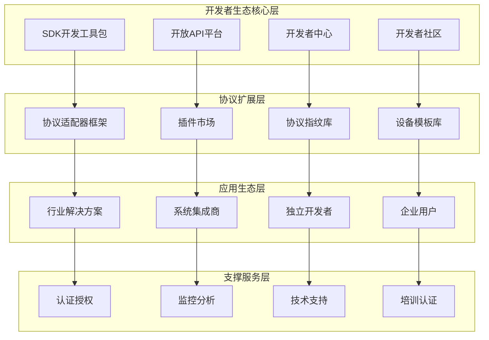

# IOE-DREAM 开放开发者生态完整设计方案

**版本**: v1.0.0
**制定日期**: 2025-12-16
**适用范围**: IOE-DREAM智能管理系统开发者生态建设
**目标**: 建立完整、开放、可持续的开发者生态系统，推动IOE-DREAM平台生态繁荣

---

## 📋 生态建设概述

### 🎯 生态愿景

打造**企业级智能设备管理领域的开放生态平台**，通过标准化的协议框架、丰富的开发工具、完善的商业支持，使IOE-DREAM成为设备智能化转型的首选技术底座。

### 🏗️ 生态架构总览



---

## 🛠️ 核心组件设计

### 1. SDK开发工具包

#### 1.1 多语言SDK支持

**Java SDK (核心)**:
```java
// 设备协议开发SDK
<dependency>
    <groupId>ioe-dream</groupId>
    <artifactId>device-protocol-sdk</artifactId>
    <version>1.0.0</version>
</dependency>

// 使用示例
public class CustomCameraProtocol implements DeviceProtocol {
    @Override
    public boolean detect(String ipAddress, int port) {
        // 自定义协议检测逻辑
        return CustomCameraDetector.detect(ipAddress, port);
    }

    @Override
    public DeviceInfo getDeviceInfo(String ipAddress, int port) {
        // 设备信息获取
        return CustomCameraClient.getInfo(ipAddress, port);
    }
}

// 注册协议
ProtocolRegistry.register(new CustomCameraProtocol());
```

**Python SDK**:
```python
# 设备协议Python SDK
from ioe_dream.device_protocol import DeviceProtocol, ProtocolRegistry
from ioe_dream.device_client import DeviceClient

class CustomCameraProtocol(DeviceProtocol):
    def detect(self, ip_address: str, port: int) -> bool:
        return custom_camera_detector.detect(ip_address, port)

    def get_device_info(self, ip_address: str, port: int) -> dict:
        return custom_camera_client.get_info(ip_address, port)

# 注册协议
protocol = CustomCameraProtocol()
ProtocolRegistry.register(protocol)
```

**JavaScript/TypeScript SDK**:
```typescript
// 设备协议TypeScript SDK
import { DeviceProtocol, ProtocolRegistry } from '@ioe-dream/device-protocol-sdk';
import { DeviceClient } from '@ioe-dream/device-client-sdk';

class CustomCameraProtocol implements DeviceProtocol {
    detect(ipAddress: string, port: number): boolean {
        return CustomCameraDetector.detect(ipAddress, port);
    }

    getDeviceInfo(ipAddress: string, port: number): DeviceInfo {
        return CustomCameraClient.getInfo(ipAddress, port);
    }
}

// 注册协议
const protocol = new CustomCameraProtocol();
ProtocolRegistry.register(protocol);
```

#### 1.2 SDK核心功能

**设备协议开发框架**:
- 标准化的协议接口定义
- 设备发现和识别基础设施
- 协议指纹匹配算法
- 多线程并发处理支持

**设备通信客户端**:
- 统一的设备连接管理
- 命令发送和响应处理
- 事件监听和数据订阅
- 连接池和重连机制

**数据处理工具集**:
- 设备数据解析和转换
- 数据格式标准化
- 数据验证和清洗
- 数据存储和查询

### 2. 开放API平台

#### 2.1 API架构设计

**API网关层**:
```yaml
# API网关配置
spring:
  cloud:
    gateway:
      routes:
        - id: developer-api
          uri: lb://ioedream-developer-service
          predicates:
            - Path=/api/v1/developer/**
          filters:
            - StripPrefix=2
            - RateLimiter=1000
            - AuthFilter
```

**API服务层**:
```java
@RestController
@RequestMapping("/api/v1/developer")
@Tag(name = "开发者API", description = "面向开发者的开放API")
public class DeveloperApiController {

    @Resource
    private DeveloperApiService developerApiService;

    @PostMapping("/protocol/register")
    @Operation(summary = "注册新协议", description = "开发者注册自定义设备协议")
    public ResponseDTO<ProtocolRegistrationResult> registerProtocol(
            @Valid @RequestBody ProtocolRegistrationRequest request) {

        return developerApiService.registerProtocol(request);
    }

    @GetMapping("/protocols/{protocolId}/devices")
    @Operation(summary = "获取设备列表", description = "获取使用指定协议的设备列表")
    public ResponseDTO<List<DeviceInfo>> getProtocolDevices(
            @PathVariable String protocolId,
            @ParameterObject ProtocolDeviceQuery query) {

        return developerApiService.getProtocolDevices(protocolId, query);
    }

    @PostMapping("/devices/{deviceId}/command")
    @Operation(summary = "发送设备命令", description = "向指定设备发送控制命令")
    public ResponseDTO<CommandResult> sendCommand(
            @PathVariable String deviceId,
            @Valid @RequestBody DeviceCommandRequest request) {

        return developerApiService.sendCommand(deviceId, request);
    }
}
```

#### 2.2 API分类体系

**设备管理API**:
- 设备注册和注销
- 设备信息查询和更新
- 设备状态监控和控制
- 设备配置管理

**协议扩展API**:
- 协议适配器注册和管理
- 协议指纹上传和更新
- 协议检测和识别
- 协议版本管理

**数据访问API**:
- 设备数据查询和导出
- 实时数据流订阅
- 历史数据分析
- 数据可视化配置

**开发者工具API**:
- 开发者认证和授权
- API使用统计和配额
- 错误日志和诊断
- 开发者配置管理

### 3. 开发者中心

#### 3.1 功能模块设计

**控制台Dashboard**:
```typescript
interface DeveloperDashboard {
    // 项目概览
    projects: Project[];
    activeDevices: number;
    apiUsage: ApiUsageStats;

    // 协议管理
    protocols: Protocol[];
    protocolVersions: ProtocolVersion[];

    // 设备管理
    devices: Device[];
    deviceGroups: DeviceGroup[];

    // 数据分析
    dataAnalytics: DataAnalytics;
    performanceMetrics: PerformanceMetrics;
}
```

**协议开发工具**:
- 在线协议编辑器
- 协议测试工具
- 设备模拟器
- 调试日志分析

**API文档系统**:
- 交互式API文档
- 代码示例库
- SDK使用指南
- 最佳实践文档

**应用管理**:
- 应用创建和配置
- API密钥管理
- 权限和配额设置
- 使用统计监控

### 4. 开发者社区

#### 4.1 社区平台架构

**技术论坛系统**:
```java
@Entity
@Table(name = "t_developer_forum_post")
public class ForumPostEntity {

    @TableId(type = IdType.ASSIGN_ID)
    private String postId;

    @TableField("title")
    private String title;

    @TableField("content")
    private String content;

    @TableField("category")
    private String category; // 协议开发、API使用、问题求助、经验分享

    @TableField("tags")
    private String tags;

    @TableField("author_id")
    private String authorId;

    @TableField("view_count")
    private Integer viewCount;

    @TableField("like_count")
    private Integer likeCount;

    @TableField("reply_count")
    private Integer replyCount;
}
```

**知识库系统**:
- 技术文章管理
- 视频教程库
- 开发案例库
- FAQ知识库

**代码共享平台**:
- 协议适配器代码库
- 开源项目托管
- 代码片段分享
- 项目协作工具

---

## 🔌 协议扩展框架

### 1. 协议适配器标准

#### 1.1 协议接口定义

**核心协议接口**:
```java
public interface DeviceProtocol {

    /**
     * 协议基本信息
     */
    ProtocolMetadata getMetadata();

    /**
     * 设备检测
     */
    boolean detect(DeviceConnection connection);

    /**
     * 获取设备信息
     */
    DeviceInfo getDeviceInfo(DeviceConnection connection);

    /**
     * 设备连接
     */
    DeviceSession connect(DeviceConnection connection);

    /**
     * 发送命令
     */
    CommandResult sendCommand(DeviceSession session, Command command);

    /**
     * 订阅数据
     */
    void subscribeData(DeviceSession session, DataSubscription subscription);

    /**
     * 协议健康检查
     */
    ProtocolHealthStatus healthCheck();
}
```

**协议元数据定义**:
```java
@Data
public class ProtocolMetadata {

    private String protocolId;          // 协议唯一标识
    private String protocolName;        // 协议名称
    private String protocolVersion;     // 协议版本
    private String vendorName;          // 厂商名称
    private List<String> deviceTypes;   // 支持的设备类型
    private List<String> supportedPorts; // 支持的端口
    private List<ProtocolCapability> capabilities; // 协议能力

    // 协议指纹信息
    private List<ProtocolFingerprint> fingerprints;

    // 协议依赖
    private List<ProtocolDependency> dependencies;

    // 协议配置
    private ProtocolConfiguration configuration;
}
```

#### 1.2 协议注册机制

**协议注册服务**:
```java
@Service
public class ProtocolRegistrationService {

    @Resource
    private ProtocolRegistry protocolRegistry;

    @Resource
    private ProtocolValidator protocolValidator;

    @Resource
    private ProtocolSecurityChecker securityChecker;

    public RegistrationResult registerProtocol(ProtocolDefinition definition) {
        // 1. 协议验证
        ValidationResult validation = protocolValidator.validate(definition);
        if (!validation.isValid()) {
            return RegistrationResult.failure(validation.getErrors());
        }

        // 2. 安全检查
        SecurityCheckResult securityCheck = securityChecker.check(definition);
        if (!securityCheck.isSecure()) {
            return RegistrationResult.failure(securityCheck.getIssues());
        }

        // 3. 注册协议
        Protocol protocol = ProtocolFactory.create(definition);
        protocolRegistry.register(protocol);

        // 4. 发布协议注册事件
        eventPublisher.publishEvent(new ProtocolRegisteredEvent(protocol));

        return RegistrationResult.success(protocol.getMetadata().getProtocolId());
    }
}
```

### 2. 插件市场

#### 2.1 插件架构设计

**插件接口定义**:
```java
public interface Plugin {

    /**
     * 插件元数据
     */
    PluginMetadata getMetadata();

    /**
     * 插件生命周期
     */
    void initialize(PluginContext context);

    /**
     * 插件功能
     */
    List<PluginFeature> getFeatures();

    /**
     * 插件配置
     */
    PluginConfiguration getConfiguration();

    /**
     * 插件卸载
     */
    void shutdown();
}
```

**插件管理系统**:
```java
@RestController
@RequestMapping("/api/v1/developer/plugins")
public class PluginMarketController {

    @GetMapping("/market")
    public ResponseDTO<PageResult<PluginInfo>> getMarketPlugins(
            @ParameterObject PluginMarketQuery query) {

        return pluginMarketService.searchPlugins(query);
    }

    @PostMapping("/{pluginId}/install")
    public ResponseDTO<Void> installPlugin(
            @PathVariable String pluginId,
            @RequestBody PluginInstallRequest request) {

        return pluginMarketService.installPlugin(pluginId, request);
    }

    @GetMapping("/installed")
    public ResponseDTO<List<InstalledPlugin>> getInstalledPlugins() {

        return pluginMarketService.getInstalledPlugins();
    }
}
```

#### 2.2 插件分类体系

**协议适配器插件**:
- 厂商特定协议支持
- 行业标准协议实现
- 自定义协议扩展
- 协议转换器

**数据处理插件**:
- 数据解析器
- 数据转换器
- 数据验证器
- 数据过滤器

**应用集成插件**:
- 第三方系统集成
- 云平台连接器
- 数据库适配器
- 消息队列集成

**工具类插件**:
- 设备模拟器
- 协议测试工具
- 性能监控工具
- 调试分析工具

### 3. 协议指纹库

#### 3.1 指纹管理系统

**指纹数据结构**:
```java
@Data
@TableName("t_protocol_fingerprint")
public class ProtocolFingerprintEntity {

    @TableId(type = IdType.ASSIGN_ID)
    private String fingerprintId;

    @TableField("protocol_id")
    private String protocolId;

    @TableField("fingerprint_type")
    private String fingerprintType; // HTTP_HEADER, BANNER, SNMP_OID, MODBUS_REGISTER

    @TableField("fingerprint_pattern")
    private String fingerprintPattern; // 正则表达式或匹配规则

    @TableField("confidence_level")
    private Integer confidenceLevel; // 置信度 1-100

    @TableField("vendor_specific")
    private Boolean vendorSpecific; // 是否厂商特定

    @TableField("device_types")
    private String deviceTypes; // JSON数组

    @TableField("detection_method")
    private String detectionMethod; // 检测方法

    @TableField("created_time")
    private LocalDateTime createdTime;

    @TableField("updated_time")
    private LocalDateTime updatedTime;
}
```

**指纹匹配引擎**:
```java
@Component
public class FingerprintMatchingEngine {

    @Resource
    private ProtocolFingerprintDao fingerprintDao;

    public List<FingerprintMatch> matchFingerprints(DeviceConnection connection) {
        List<FingerprintMatch> matches = new ArrayList<>();

        // 获取所有活跃指纹
        List<ProtocolFingerprintEntity> fingerprints = fingerprintDao.selectActiveFingerprints();

        // 并行匹配
        fingerprints.parallelStream().forEach(fingerprint -> {
            FingerprintMatch match = matchSingleFingerprint(connection, fingerprint);
            if (match != null) {
                matches.add(match);
            }
        });

        // 按置信度排序
        matches.sort((m1, m2) -> m2.getConfidence() - m1.getConfidence());

        return matches;
    }

    private FingerprintMatch matchSingleFingerprint(DeviceConnection connection,
                                                  ProtocolFingerprintEntity fingerprint) {
        try {
            boolean isMatch = FingerprintMatcher.match(connection, fingerprint);
            if (isMatch) {
                return new FingerprintMatch(
                    fingerprint.getProtocolId(),
                    fingerprint.getConfidenceLevel(),
                    fingerprint.getDeviceTypes()
                );
            }
        } catch (Exception e) {
            log.warn("指纹匹配失败: {}", fingerprint.getFingerprintId(), e);
        }

        return null;
    }
}
```

### 4. 设备模板库

#### 4.1 模板管理系统

**设备模板数据结构**:
```java
@Data
@TableName("t_device_template")
public class DeviceTemplateEntity {

    @TableId(type = IdType.ASSIGN_ID)
    private String templateId;

    @TableField("template_name")
    private String templateName;

    @TableField("vendor_name")
    private String vendorName;

    @TableField("device_type")
    private String deviceType;

    @TableField("protocol_id")
    private String protocolId;

    @TableField("template_config")
    private String templateConfig; // JSON格式的模板配置

    @TableField("default_parameters")
    private String defaultParameters; // JSON格式的默认参数

    @TableField("supported_commands")
    private String supportedCommands; // JSON格式的支持命令

    @TableField("data_points")
    private String dataPoints; // JSON格式的数据点定义

    @TableField("template_version")
    private String templateVersion;

    @TableField("status")
    private Integer status; // 1-草稿 2-发布 3-废弃

    @TableField("author_id")
    private String authorId;

    @TableField("download_count")
    private Integer downloadCount;

    @TableField("rating")
    private BigDecimal rating; // 模板评分
}
```

**模板使用API**:
```java
@RestController
@RequestMapping("/api/v1/developer/templates")
public class DeviceTemplateController {

    @GetMapping("/market")
    public ResponseDTO<PageResult<DeviceTemplateVO>> getTemplateMarket(
            @ParameterObject TemplateMarketQuery query) {

        return deviceTemplateService.searchTemplates(query);
    }

    @GetMapping("/{templateId}")
    public ResponseDTO<DeviceTemplateDetailVO> getTemplateDetail(
            @PathVariable String templateId) {

        return deviceTemplateService.getTemplateDetail(templateId);
    }

    @PostMapping("/{templateId}/use")
    public ResponseDTO<DeviceInstanceVO> useTemplate(
            @PathVariable String templateId,
            @RequestBody DeviceInstanceRequest request) {

        return deviceTemplateService.createInstanceFromTemplate(templateId, request);
    }
}
```

---

## 🎯 应用生态建设

### 1. 行业解决方案

#### 1.1 智慧园区解决方案

**园区综合管理平台**:
```typescript
interface SmartCampusSolution {
    // 核心功能
    accessControl: AccessControlSystem;
    attendanceManagement: AttendanceSystem;
    visitorManagement: VisitorSystem;
    videoSurveillance: VideoSystem;
    consumeManagement: ConsumeSystem;

    // 扩展功能
    parkingManagement: ParkingSystem;
    energyManagement: EnergySystem;
    environmentalMonitoring: EnvironmentalSystem;

    // 集成能力
    thirdPartyIntegration: ThirdPartyIntegration;
    mobileAppSupport: MobileAppSupport;
    dataAnalytics: DataAnalytics;
}
```

**开发者支持**:
- 园区管理SDK
- 设备接入指南
- 解决方案模板
- 最佳实践文档

#### 1.2 工业自动化解决方案

**工业设备监控系统**:
```java
@Component
public class IndustrialMonitoringSystem {

    @Resource
    private DeviceProtocolManager protocolManager;

    @Resource
    private IndustrialDeviceRegistry deviceRegistry;

    public void registerIndustrialDevice(IndustrialDeviceDefinition definition) {
        // 注册工业设备协议
        DeviceProtocol protocol = protocolManager.createProtocol(definition.getProtocol());
        protocolManager.registerProtocol(protocol);

        // 注册设备类型
        deviceRegistry.registerDeviceType(definition.getDeviceType());

        // 创建监控配置
        MonitoringConfig config = createMonitoringConfig(definition);
        monitoringService.createMonitoring(config);
    }
}
```

**支持的工业协议**:
- Modbus TCP/RTU
- OPC UA
- Profinet
- EtherNet/IP
- CAN总线
- 自定义工业协议

#### 1.3 智能建筑解决方案

**楼宇自动化集成**:
```yaml
# BACnet协议适配器配置
bacnet:
  adapter:
    enabled: true
    network-interface: eth0
    port: 47808
    device-instance-range: 0-9999
    local-device-id: 1001

  discovery:
    auto-discovery: true
    discovery-interval: 300s
    broadcast-address: 255.255.255.255

  devices:
    hvac: # 暖通空调
      device-types: [ac_unit, ventilation_system, boiler]
      monitoring-points: [temperature, humidity, pressure, flow]

    lighting: # 照明
      device-types: [dimmer, switch, sensor]
      control-points: [brightness, on_off, scene]

    security: # 安防
      device-types: [camera, door_sensor, alarm]
      monitoring-points: [motion, intrusion, status]
```

### 2. 系统集成商支持

#### 2.1 SI合作伙伴计划

**合作伙伴等级体系**:
```java
public enum PartnerLevel {
    BRONZE("铜牌", 1000, 10),    // 年营收1000万，10个项目
    SILVER("银牌", 5000, 50),    // 年营收5000万，50个项目
    GOLD("金牌", 10000, 100),   // 年营收1亿，100个项目
    PLATINUM("铂金", 50000, 500); // 年营收5亿，500个项目

    private final String displayName;
    private final long minRevenue;
    private final int minProjects;
}
```

**技术支持服务**:
- 专属技术支持团队
- 定制化开发服务
- 现场技术支持
- 培训认证服务

**商业支持政策**:
- 销售佣金激励
- 市场推广支持
- 联合营销活动
- 客户资源共享

#### 2.2 系统集成工具包

**项目实施工具**:
```java
@Component
public class ProjectImplementationTool {

    /**
     * 快速部署工具
     */
    public DeploymentResult deployRapidly(ProjectConfig config) {
        // 1. 环境检查
        EnvironmentCheckResult envCheck = checkEnvironment(config);

        // 2. 自动部署
        AutoDeploymentResult deployment = autoDeploy(config);

        // 3. 配置初始化
        InitializationResult init = initializeConfig(config);

        // 4. 设备自动发现
        DiscoveryResult discovery = autoDiscoverDevices(config);

        // 5. 测试验证
        ValidationResult validation = validateDeployment(config);

        return new DeploymentResult(envCheck, deployment, init, discovery, validation);
    }

    /**
     * 数据迁移工具
     */
    public MigrationResult migrateData(MigrationConfig config) {
        DataMigrationTool tool = new DataMigrationTool();
        return tool.migrate(config);
    }
}
```

**配置管理工具**:
- 批量设备配置
- 协议参数配置
- 业务规则配置
- 系统参数配置

### 3. 独立开发者支持

#### 3.1 开发者激励计划

**应用开发竞赛**:
```java
@Entity
@Table(name = "t_developer_contest")
public class DeveloperContestEntity {

    @TableId(type = IdType.ASSIGN_ID)
    private String contestId;

    @TableField("contest_name")
    private String contestName;

    @TableField("contest_type")
    private String contestType; // 协议开发、应用开发、创新应用

    @TableField("prize_pool")
    private BigDecimal prizePool;

    @TableField("start_time")
    private LocalDateTime startTime;

    @TableField("end_time")
    private LocalDateTime endTime;

    @TableField("judging_criteria")
    private String judgingCriteria; // JSON格式

    @TableField("submission_requirements")
    private String submissionRequirements; // JSON格式
}
```

**开发者收益分成**:
- 应用商店销售分成
- API调用收益分成
- 技术服务收益
- 培训课程收益

#### 3.2 开发者成长路径

**技能认证体系**:
```java
public enum DeveloperCertification {

    JUNIOR_PROTOCOL_DEVELOPER("初级协议开发", 100),
    SENIOR_PROTOCOL_DEVELOPER("高级协议开发", 300),
    EXPERT_PROTOCOL_DEVELOPER("专家级协议开发", 1000),

    JUNIOR_INTEGRATION_DEVELOPER("初级集成开发", 200),
    SENIOR_INTEGRATION_DEVELOPER("高级集成开发", 500),
    EXPERT_INTEGRATION_DEVELOPER("专家级集成开发", 1500);

    private final String displayName;
    private final int requiredPoints;
}
```

**技术支持体系**:
- 开发者社区支持
- 专家技术咨询
- 技术文档支持
- 培训课程体系

### 4. 企业用户支持

#### 4.1 企业版服务

**企业版功能特性**:
```java
@Configuration
@ConfigurationProperties(prefix = "ioedream.enterprise")
public class EnterpriseConfiguration {

    // 高可用性配置
    private HighAvailabilityConfig highAvailability;

    // 安全性配置
    private SecurityConfig security;

    // 性能优化配置
    private PerformanceConfig performance;

    // 扩展性配置
    private ScalabilityConfig scalability;

    // 企业级监控
    private EnterpriseMonitoringConfig monitoring;

    // 数据备份和恢复
    private BackupConfig backup;
}
```

**定制化服务**:
- 私有云部署
- 定制化开发
- 数据迁移服务
- 运维托管服务

#### 4.2 企业支持体系

**技术支持服务**:
- 24/7技术支持
- 远程诊断服务
- 现场技术支持
- 系统健康检查

**培训服务**:
- 管理员培训
- 开发者培训
- 运维人员培训
- 最终用户培训

---

## 🔒 生态安全与合规

### 1. 安全架构设计

#### 1.1 多层安全防护

**网络安全层**:
```java
@Configuration
@EnableWebSecurity
public class DeveloperSecurityConfig {

    @Bean
    public SecurityFilterChain developerSecurityFilterChain(HttpSecurity http) throws Exception {
        http
            .securityMatcher("/api/v1/developer/**")
            .authorizeHttpRequests(auth -> auth
                .requestMatchers("/api/v1/developer/auth/**").permitAll()
                .requestMatchers("/api/v1/developer/public/**").permitAll()
                .anyRequest().authenticated()
            )
            .oauth2ResourceServer(oauth2 -> oauth2.jwt())
            .sessionManagement(session -> session.sessionCreationPolicy(SessionCreationPolicy.STATELESS))
            .addFilterBefore(new DeveloperRateLimitFilter(), UsernamePasswordAuthenticationFilter.class)
            .addFilterBefore(new DeveloperSecurityAuditFilter(), UsernamePasswordAuthenticationFilter.class);

        return http.build();
    }
}
```

**API安全**:
- OAuth2.0/JWT认证
- API密钥管理
- 访问控制和权限管理
- 请求签名验证

**数据安全**:
- 数据传输加密(TLS 1.3)
- 数据存储加密
- 敏感数据脱敏
- 数据备份和恢复

#### 1.2 安全监控体系

**安全事件监控**:
```java
@Component
public class SecurityMonitoringService {

    @EventListener
    public void handleSecurityEvent(SecurityEvent event) {
        // 记录安全事件
        securityEventLogger.log(event);

        // 实时告警
        if (event.getSeverity() == Severity.HIGH) {
            alertService.sendAlert(event);
        }

        // 自动响应
        autoResponseService.handle(event);
    }

    @Scheduled(fixedRate = 60000) // 每分钟检查
    public void detectAnomalies() {
        // 异常检测
        List<SecurityAnomaly> anomalies = anomalyDetector.detect();

        // 威胁评估
        ThreatAssessment assessment = threatAssessor.assess(anomalies);

        // 风险控制
        if (assessment.getRiskLevel() >= RiskLevel.HIGH) {
            riskControlService.activateControls(assessment);
        }
    }
}
```

### 2. 合规性管理

#### 2.1 法律合规要求

**数据保护合规**:
- GDPR合规性
- 等保三级合规
- 行业安全标准
- 数据本地化要求

**开发者协议**:
```java
@Data
public class DeveloperAgreement {

    private String agreementId;
    private String developerId;
    private LocalDateTime agreementDate;
    private AgreementType agreementType;

    // 权利和义务
    private DeveloperRights rights;
    private DeveloperObligations obligations;

    // 知识产权
    private IntellectualPropertyTerms ipTerms;

    // 责任限制
    private LiabilityLimitations liabilityLimitations;

    // 争议解决
    private DisputeResolution disputeResolution;

    // 合规条款
    private ComplianceTerms complianceTerms;
}
```

#### 2.2 质量保障体系

**代码质量标准**:
```java
@Component
public class CodeQualityChecker {

    public QualityCheckResult checkPluginCode(PluginCode code) {
        QualityCheckResult result = new QualityCheckResult();

        // 安全检查
        SecurityCheckResult security = securityChecker.check(code);
        result.setSecurityScore(security.getScore());

        // 性能检查
        PerformanceCheckResult performance = performanceChecker.check(code);
        result.setPerformanceScore(performance.getScore());

        // 可维护性检查
        MaintainabilityCheckResult maintainability = maintainabilityChecker.check(code);
        result.setMaintainabilityScore(maintainability.getScore());

        // 测试覆盖率检查
        TestCoverageCheckResult testCoverage = testCoverageChecker.check(code);
        result.setTestCoverageScore(testCoverage.getScore());

        // 文档完整性检查
        DocumentationCheckResult documentation = documentationChecker.check(code);
        result.setDocumentationScore(documentation.getScore());

        return result;
    }
}
```

---

## 📊 生态运营与管理

### 1. 开发者运营

#### 1.1 开发者生命周期管理

**开发者招募**:
```java
@Service
public class DeveloperRecruitmentService {

    public RecruitmentResult recruitDeveloper(RecruitmentCampaign campaign) {
        // 1. 目标分析
        TargetAnalysis analysis = analyzeTarget(campaign);

        // 2. 渠道选择
        List<RecruitmentChannel> channels = selectChannels(analysis);

        // 3. 内容制作
        RecruitmentContent content = createContent(campaign, channels);

        // 4. 推广执行
        PromotionExecution execution = executePromotion(content, channels);

        // 5. 效果跟踪
        EffectTracking tracking = trackEffect(execution);

        return new RecruitmentResult(analysis, channels, content, execution, tracking);
    }
}
```

**开发者活跃度提升**:
- 技术沙龙和交流会
- 开发者挑战赛
- 技术博客和教程
- 开源项目贡献激励

#### 1.2 内容运营策略

**技术内容生产**:
```java
@Component
public class ContentCreationService {

    public ContentProductionPlan createContentPlan(ContentStrategy strategy) {
        ContentProductionPlan plan = new ContentProductionPlan();

        // 教程制作
        plan.addTutorialPlan(createTutorialPlan(strategy));

        // 案例研究
        plan.addCaseStudyPlan(createCaseStudyPlan(strategy));

        // 技术博客
        plan.addBlogPlan(createBlogPlan(strategy));

        // 视频教程
        plan.addVideoPlan(createVideoPlan(strategy));

        // API文档更新
        plan.addDocumentationPlan(createDocumentationPlan(strategy));

        return plan;
    }
}
```

**社区氛围营造**:
- 技术问答积分奖励
- 优质内容推荐机制
- 开发者等级体系
- 社区活动组织

### 2. 生态数据分析

#### 2.1 生态健康度监控

**关键指标体系**:
```java
@Data
public class EcosystemHealthMetrics {

    // 开发者指标
    private DeveloperMetrics developerMetrics;

    // 应用指标
    private ApplicationMetrics applicationMetrics;

    // 设备指标
    private DeviceMetrics deviceMetrics;

    // API使用指标
    private ApiUsageMetrics apiUsageMetrics;

    // 商业指标
    private BusinessMetrics businessMetrics;

    // 技术指标
    private TechnicalMetrics technicalMetrics;
}

@Component
public class EcosystemHealthMonitor {

    @Scheduled(cron = "0 0 * * * *") // 每小时
    public EcosystemHealthReport generateReport() {
        EcosystemHealthMetrics metrics = collectMetrics();
        HealthAnalysis analysis = analyzeHealth(metrics);
        HealthTrends trends = analyzeTrends(metrics);

        return new EcosystemHealthReport(metrics, analysis, trends);
    }
}
```

#### 2.2 数据驱动的决策支持

**智能推荐系统**:
```java
@Service
public class DeveloperRecommendationService {

    public RecommendationResult recommendToDeveloper(String developerId) {
        DeveloperProfile profile = developerProfileService.getProfile(developerId);

        // 协议推荐
        List<ProtocolRecommendation> protocolRecs = recommendProtocols(profile);

        // 工具推荐
        List<ToolRecommendation> toolRecs = recommendTools(profile);

        // 学习资源推荐
        List<LearningRecommendation> learningRecs = recommendLearning(profile);

        // 合作机会推荐
        List<CollaborationRecommendation> collaborationRecs = recommendCollaborations(profile);

        return new RecommendationResult(protocolRecs, toolRecs, learningRecs, collaborationRecs);
    }
}
```

### 3. 商业模式设计

#### 3.1 收入来源分析

**多元化收入模式**:
```java
public enum RevenueModel {

    // API使用费用
    API_USAGE_SUBSCRIPTION("API使用订阅"),
    API_USAGE_PAY_PER_CALL("API按次付费"),
    API_USAGE_TIERED("API阶梯定价"),

    // 软件许可费用
    SOFTWARE_LICENSE("软件许可费"),
    ENTERPRISE_LICENSE("企业版许可费"),
    OEM_LICENSE("OEM许可费"),

    // 服务费用
    CONSULTING_SERVICE("咨询服务费"),
    TRAINING_SERVICE("培训服务费"),
    SUPPORT_SERVICE("技术支持费"),
    IMPLEMENTATION_SERVICE("实施服务费"),

    // 生态费用
    MARKETPLACE_COMMISSION("应用市场佣金"),
    PLUGIN_REVENUE_SHARE("插件收入分成"),
    CERTIFICATION_FEE("认证考试费"),

    // 数据服务
    DATA_ANALYTICS("数据分析服务"),
    INSIGHT_REPORT("行业洞察报告");
}
```

#### 3.2 生态合作伙伴管理

**合作伙伴关系管理**:
```java
@Entity
@Table(name = "t_ecosystem_partner")
public class EcosystemPartnerEntity {

    @TableId(type = IdType.ASSIGN_ID)
    private String partnerId;

    @TableField("partner_name")
    private String partnerName;

    @TableField("partner_type")
    private String partnerType; // SI, ISV, VAR, Technology Provider

    @TableField("partner_level")
    private String partnerLevel; // Bronze, Silver, Gold, Platinum

    @TableField("cooperation_model")
    private String cooperationModel; // Reseller, Integration, Development, Consulting

    @TableField("revenue_share_model")
    private String revenueShareModel; // Fixed, Percentage, Tiered

    @TableField("support_level")
    private String supportLevel; // Basic, Enhanced, Premium

    @TableField("status")
    private Integer status; // 1-Active 2-Inactive 3-Suspended
}
```

---

## 🚀 实施路线图

### 第一阶段：基础平台建设 (6个月)

#### Q1: 核心基础设施
- [ ] SDK开发框架 (Java/Python/JS)
- [ ] 开放API平台
- [ ] 开发者中心基础版
- [ ] 协议适配器框架
- [ ] 基础安全体系

#### Q2: 协议扩展能力
- [ ] 协议指纹库建设
- [ ] 插件市场v1.0
- [ ] 设备模板库
- [ ] 协议开发工具
- [ ] 自动化测试框架

**里程碑**:
- SDK下载量 > 1000
- 注册开发者 > 100
- 上传协议适配器 > 20
- API调用次数 > 10万/月

### 第二阶段：生态功能完善 (6个月)

#### Q3: 生态运营体系
- [ ] 开发者社区平台
- [ ] 内容运营体系
- [ ] 开发者激励计划
- [ ] 合作伙伴管理
- [ ] 数据分析平台

#### Q4: 商业化能力
- [ ] 应用商店
- [ ] 企业版服务
- [ ] 认证培训体系
- [ ] 技术支持体系
- [ ] 商业智能平台

**里程碑**:
- 注册开发者 > 1000
- 上传应用 > 50
- 商业合作伙伴 > 20
- 月度收入 > 50万

### 第三阶段：生态规模扩展 (12个月)

#### Y2 Q1: 行业解决方案
- [ ] 智慧园区解决方案包
- [ ] 工业自动化解决方案
- [ ] 智能建筑解决方案
- [ ] 行业最佳实践库
- [ ] 解决方案模板

#### Y2 Q2: 全球化扩展
- [ ] 多语言支持
- [ ] 国际化API
- [ ] 全球数据中心
- [ ] 本地化服务
- [ ] 国际合作伙伴

**里程碑**:
- 注册开发者 > 5000
- 上传应用 > 200
- 国际用户 > 1000
- 月度收入 > 200万

### 第四阶段：生态成熟运营 (持续)

#### Y2 Q3-Q4: 生态优化
- [ ] AI驱动的开发者助手
- [ ] 智能化推荐系统
- [ ] 自动化运维平台
- [ ] 生态系统健康监测
- [ ] 持续创新机制

**长期目标**:
- 成为设备智能化领域的标准平台
- 建立活跃的开发者生态
- 实现可持续的商业模式
- 推动行业数字化转型

---

## 📈 成功指标与KPI

### 1. 开发者生态指标

**开发者增长指标**:
- 注册开发者数量：Y1目标1000，Y2目标5000
- 活跃开发者比例：Y1目标20%，Y2目标30%
- 开发者留存率：Y1目标60%，Y2目标75%
- 开发者满意度：NPS目标 > 50

**内容贡献指标**:
- 上传协议适配器数量：Y1目标100，Y2目标500
- 发布应用数量：Y1目标50，Y2目标200
- 技术文章数量：Y1目标500，Y2目标2000
- 代码贡献量：Y1目标10万行，Y2目标50万行

### 2. 技术生态指标

**技术质量指标**:
- API可用性：目标 > 99.9%
- API响应时间：P95 < 100ms
- 代码质量评分：目标 > 85分
- 安全事件数量：目标 < 5次/年

**平台能力指标**:
- 支持协议数量：Y1目标50，Y2目标200
- 支持设备类型：Y1目标200，Y2目标1000
- API调用量：Y1目标1000万次/月，Y2目标5000万次/月
- 并发处理能力：Y1目标1万QPS，Y2目标5万QPS

### 3. 商业生态指标

**收入增长指标**:
- 年度收入：Y1目标1000万，Y2目标5000万
- 付费用户数量：Y1目标100，Y2目标500
- 客户续约率：目标 > 80%
- 客户满意度：CSAT目标 > 85%

**合作伙伴指标**:
- 合作伙伴数量：Y1目标50，Y2目标200
- 合作伙伴收入占比：目标 > 40%
- 合作伙伴满意度：目标 > 80%
- 联合解决方案数量：Y1目标20，Y2目标100

---

## 🎯 风险分析与应对策略

### 1. 技术风险

**风险识别**:
- 协议兼容性问题
- 系统性能瓶颈
- 安全漏洞风险
- 技术架构升级风险

**应对策略**:
```java
@Component
public class TechnologyRiskManager {

    @PreAuthorize("hasRole('TECH_RISK_MANAGER')")
    public RiskAssessment assessTechnologyRisk(TechnologyComponent component) {
        RiskAssessment assessment = new RiskAssessment();

        // 兼容性风险评估
        CompatibilityRisk compatibilityRisk = assessCompatibilityRisk(component);
        assessment.addRisk(compatibilityRisk);

        // 性能风险评估
        PerformanceRisk performanceRisk = assessPerformanceRisk(component);
        assessment.addRisk(performanceRisk);

        // 安全风险评估
        SecurityRisk securityRisk = assessSecurityRisk(component);
        assessment.addRisk(securityRisk);

        // 升级风险评估
        UpgradeRisk upgradeRisk = assessUpgradeRisk(component);
        assessment.addRisk(upgradeRisk);

        return assessment;
    }
}
```

### 2. 市场风险

**竞争风险分析**:
- 竞争对手分析
- 市场份额威胁
- 技术替代风险
- 价格竞争压力

**差异化竞争策略**:
- 技术领先优势
- 生态系统锁定
- 客户粘性建设
- 成本优势构建

### 3. 运营风险

**安全合规风险**:
- 数据保护法规变化
- 行业安全标准升级
- 国际贸易政策影响
- 知识产权风险

**质量保障风险**:
- 代码质量下降
- 安全漏洞频发
- 性能退化问题
- 用户体验下降

---

## 🎉 总结与展望

IOE-DREAM开放开发者生态建设是一个系统性工程，需要技术、产品、运营、市场多方面的协同配合。通过本设计方案的实施，我们将：

### 核心价值创造

1. **技术创新价值**：
   - 建立标准化的设备协议开发框架
   - 推动物联网设备互联互通
   - 促进技术创新和标准化

2. **商业价值创造**：
   - 构建可持续的商业模式
   - 创造新的收入来源
   - 提升市场竞争力

3. **生态系统价值**：
   - 建立活跃的开发者社区
   - 促进产业协同发展
   - 推动数字化转型

### 长期愿景

**成为设备智能化领域的开放平台标准**，通过技术创新、生态建设和商业成功，为全球企业和开发者提供最优秀的设备管理解决方案，推动物联网产业的繁荣发展。

让我们一起构建IOE-DREAM开放开发者生态，共同创造智能化的未来！

---

**文档版本**: v1.0.0
**制定团队**: IOE-DREAM架构委员会
**最后更新**: 2025-12-16
**下次评审**: 2026-01-16