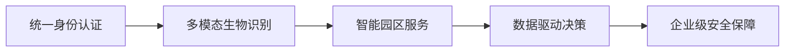
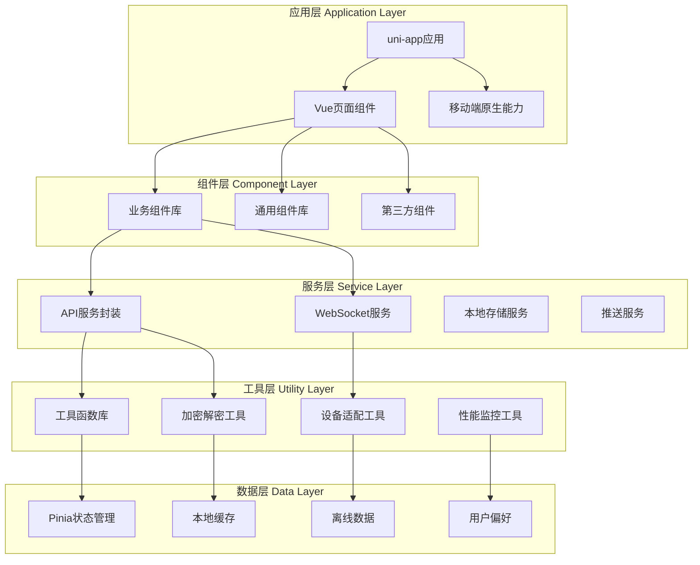
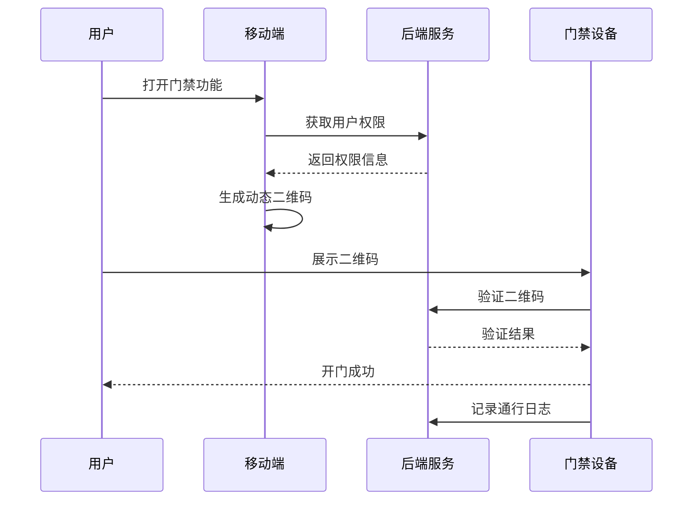
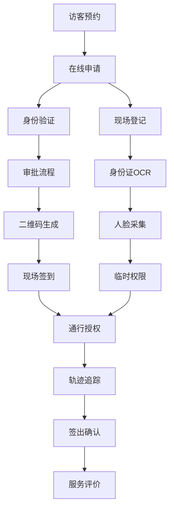

# IOE-DREAM 智慧园区一卡通管理平台
## 移动端完整功能设计文档

> **文档版本**: v2.0.0
> **创建时间**: 2025-12-16
> **最后更新**: 2025-12-16
> **文档负责人**: IOE-DREAM架构委员会
> **技术架构**: Vue 3 + TypeScript + Vant 4 + uni-app
> **适用范围**: IOE-DREAM移动端应用设计、开发、测试、运维全流程

---

## 📋 目录

1. [项目概述](#项目概述)
2. [技术架构体系](#技术架构体系)
3. [业务模块深度设计](#业务模块深度设计)
4. [用户体验设计](#用户体验设计)
5. [安全体系设计](#安全体系设计)
6. [性能优化体系](#性能优化体系)
7. [API接口规范](#api接口规范)
8. [组件库设计](#组件库设计)
9. [开发规范体系](#开发规范体系)
10. [测试策略](#测试策略)
11. [多端适配方案](#多端适配方案)
12. [部署运维](#部署运维)
13. [质量保障](#质量保障)

---

## 📱 项目概述

### 1.1 项目定位

IOE-DREAM移动端是**企业级智慧园区一卡通管理平台**的核心移动应用，基于**uni-app 3.0 + Vue 3 + TypeScript + Vant 4**技术栈构建，为智慧园区提供**统一移动入口**。移动端深度集成**七微服务架构**，实现**门禁、考勤、消费、访客、视频监控、OA工作流**等核心业务的全面移动化。

### 1.2 核心价值主张



**四大核心价值**:
- **身份统一**: 一脸通全园区，生物识别+卡片+密码多模态认证
- **服务融合**: 门禁+考勤+消费+访客+视频+OA一体化服务
- **数据智能**: 实时数据分析、趋势预测、智能告警
- **安全保障**: 企业级加密、权限控制、审计追溯

### 1.3 用户角色矩阵

| 用户类型 | 核心需求 | 使用频率 | 关键功能 |
|---------|---------|---------|---------|
| **企业员工** | 日常通行、考勤打卡 | 高频(每日) | 门禁通行、考勤打卡、消费支付 |
| **部门主管** | 团队管理、审批处理 | 中频(每周) | 审批管理、考勤查看、团队统计 |
| **系统管理员** | 系统管理、设备控制 | 中频(每周) | 设备管理、权限配置、系统监控 |
| **访客** | 预约拜访、临时通行 | 低频(按需) | 在线预约、身份登记、轨迹查询 |
| **安保人员** | 安全监控、应急处理 | 高频(每日) | 视频监控、告警处理、访客追踪 |

---

## 🏗️ 技术架构体系

### 2.1 技术栈架构

```yaml
前端技术栈:
  框架: uni-app 3.0 + Vue 3.4.45
  语言: TypeScript 5.0+
  UI组件: Vant 4.8.0+ (移动端专用)
  状态管理: Pinia 2.1.7+
  路由管理: uni-app原生路由
  构建工具: Vite 5.0+
  包管理: pnpm 8.0+

移动端技术:
  跨平台: iOS/Android/H5/小程序
  原生能力: NFC + 蓝牙 + 相机 + GPS
  生物识别: WebAuthn + 原生SDK
  推送服务: 极光推送/个推
  地图服务: 高德地图/百度地图

通信技术:
  HTTP请求: Axios 1.6.0+
  实时通信: WebSocket + Socket.IO
  音视频: WebRTC + Video.js
  文件传输: multipart/form-data
```

### 2.2 架构分层设计



### 2.3 项目目录结构

```
ioedream-mobile/
├── src/
│   ├── components/                    # 组件库
│   │   ├── common/                    # 通用组件
│   │   │   ├── smart-button/          # 智能按钮
│   │   │   ├── smart-card/            # 智能卡片
│   │   │   ├── smart-list/            # 智能列表
│   │   │   ├── smart-form/            # 智能表单
│   │   │   ├── smart-modal/           # 智能弹窗
│   │   │   ├── smart-loading/         # 智能加载
│   │   │   └── smart-error/           # 智能错误
│   │   ├── business/                  # 业务组件
│   │   │   ├── access/                # 门禁组件
│   │   │   │   ├── QRCodeGenerator/   # 二维码生成
│   │   │   │   ├── NFCHandler/         # NFC处理
│   │   │   │   ├── RemoteController/  # 远程控制
│   │   │   │   ├── DeviceStatus/      # 设备状态
│   │   │   │   └── AccessRecord/      # 通行记录
│   │   │   ├── attendance/            # 考勤组件
│   │   │   │   ├── ClockButton/        # 打卡按钮
│   │   │   │   ├── LocationVerifier/  # 位置验证
│   │   │   │   ├── BiometricAuth/     # 生物识别
│   │   │   │   ├── ScheduleCalendar/  # 排班日历
│   │   │   │   └── AttendanceChart/  # 考勤图表
│   │   │   ├── consume/               # 消费组件
│   │   │   │   ├── PaymentButton/     # 支付按钮
│   │   │   │   ├── QRCodeScanner/     # 二维码扫描
│   │   │   │   ├── AccountCard/       # 账户卡片
│   │   │   │   ├── TransactionList/   # 交易列表
│   │   │   │   └── RechargeForm/      # 充值表单
│   │   │   ├── visitor/               # 访客组件
│   │   │   │   ├── AppointmentForm/   # 预约表单
│   │   │   │   ├── VisitorCard/       # 访客卡片
│   │   │   │   ├── VerificationPanel/ # 验证面板
│   │   │   │   ├── CheckInOutButton/  # 签到签出
│   │   │   │   └── VisitorCalendar/   # 访客日历
│   │   │   ├── video/                 # 视频组件
│   │   │   │   ├── VideoPlayer/        # 视频播放器
│   │   │   │   ├── PTZController/     # PTZ控制
│   │   │   │   ├── DeviceGrid/        # 设备网格
│   │   │   │   ├── AIDetection/       # AI检测
│   │   │   │   └── AlarmPanel/        # 告警面板
│   │   │   └── oa/                    # OA组件
│   │   │       ├── ApprovalFlow/      # 审批流程
│   │   │       ├── DocumentViewer/    # 文档查看器
│   │   │       ├── SignaturePad/      # 电子签名
│   │   │       └── WorkflowTracker/   # 工作流追踪
│   │   └── layout/                    # 布局组件
│   │       ├── AppLayout/             # 应用布局
│   │       ├── TabBar/                # 底部导航
│   │       ├── NavBar/                # 顶部导航
│   │       └── SideBar/               # 侧边栏
│   ├── pages/                          # 页面文件
│   │   ├── index/                     # 首页
│   │   │   ├── home.vue               # 首页主界面
│   │   │   ├── dashboard.vue          # 仪表盘
│   │   │   └── quick-actions.vue      # 快捷操作
│   │   ├── auth/                      # 认证模块
│   │   │   ├── login.vue              # 登录页
│   │   │   ├── register.vue           # 注册页
│   │   │   ├── forgot-password.vue    # 忘记密码
│   │   │   └── biometric-setup.vue    # 生物识别设置
│   │   ├── access/                    # 门禁模块
│   │   │   ├── monitor.vue            # 实时监控
│   │   │   ├── device.vue             # 设备管理
│   │   │   ├── qrcode.vue             # 二维码门禁
│   │   │   ├── nfc.vue                # NFC门禁
│   │   │   ├── remote-control.vue     # 远程控制
│   │   │   └── records.vue            # 通行记录
│   │   ├── attendance/                # 考勤模块
│   │   │   ├── clock.vue              # 打卡页
│   │   │   ├── schedule.vue           # 排班查看
│   │   │   ├── history.vue            # 考勤历史
│   │   │   ├── leave.vue              # 请假申请
│   │   │   ├── overtime.vue           # 加班申请
│   │   │   └── statistics.vue         # 考勤统计
│   │   ├── consume/                   # 消费模块
│   │   │   ├── payment.vue            # 支付页
│   │   │   ├── account.vue            # 账户管理
│   │   │   ├── recharge.vue           # 充值页
│   │   │   ├── history.vue            # 消费记录
│   │   │   ├── refund.vue             # 退款申请
│   │   │   └── statistics.vue         # 消费统计
│   │   ├── visitor/                   # 访客模块
│   │   │   ├── appointment.vue        # 预约申请
│   │   │   ├── registration.vue       # 现场登记
│   │   │   ├── tracking.vue           # 轨迹查询
│   │   │   ├── verification.vue       # 身份验证
│   │   │   ├── records.vue            # 访客记录
│   │   │   └── evaluation.vue         # 服务评价
│   │   ├── video/                     # 视频模块
│   │   │   ├── live.vue               # 实时监控
│   │   │   ├── playback.vue           # 录像回放
│   │   │   ├── device.vue             # 设备管理
│   │   │   ├── alert.vue              # 告警管理
│   │   │   ├── ai-analysis.vue        # AI分析
│   │   │   └── map.vue                # 地图定位
│   │   ├── oa/                        # OA模块
│   │   │   ├── workflow.vue           # 工作流
│   │   │   ├── approval.vue           # 审批中心
│   │   │   ├── document.vue           # 文档中心
│   │   │   ├── calendar.vue           # 日程管理
│   │   │   ├── notice.vue             # 通知公告
│   │   │   └── report.vue             # 工作报告
│   │   ├── profile/                   # 个人中心
│   │   │   ├── profile.vue            # 个人信息
│   │   │   ├── settings.vue           # 系统设置
│   │   │   ├── security.vue           # 安全设置
│   │   │   ├── notification.vue       # 通知设置
│   │   │   └── about.vue              # 关于应用
│   │   └── error/                     # 错误页面
│   │       ├── 404.vue                # 页面不存在
│   │       ├── 500.vue                # 服务器错误
│   │       └── network.vue            # 网络错误
│   ├── api/                           # API接口
│   │   ├── modules/                   # 按模块分组
│   │   │   ├── auth/                  # 认证API
│   │   │   │   ├── login-api.js       # 登录接口
│   │   │   │   ├── biometric-api.js   # 生物识别接口
│   │   │   │   └── user-api.js        # 用户接口
│   │   │   ├── access/                # 门禁API
│   │   │   │   ├── device-api.js      # 设备接口
│   │   │   │   ├── control-api.js     # 控制接口
│   │   │   │   └── record-api.js      # 记录接口
│   │   │   ├── attendance/            # 考勤API
│   │   │   │   ├── clock-api.js       # 打卡接口
│   │   │   │   ├── schedule-api.js    # 排班接口
│   │   │   │   └── statistics-api.js  # 统计接口
│   │   │   ├── consume/               # 消费API
│   │   │   │   ├── payment-api.js     # 支付接口
│   │   │   │   ├── account-api.js     # 账户接口
│   │   │   │   └── transaction-api.js # 交易接口
│   │   │   ├── visitor/               # 访客API
│   │   │   │   ├── appointment-api.js # 预约接口
│   │   │   │   ├── verification-api.js # 验证接口
│   │   │   │   └── tracking-api.js    # 轨迹接口
│   │   │   ├── video/                 # 视频API
│   │   │   │   ├── stream-api.js      # 流媒体接口
│   │   │   │   ├── device-api.js      # 设备接口
│   │   │   │   └── alert-api.js       # 告警接口
│   │   │   └── oa/                    # OA API
│   │   │       ├── workflow-api.js    # 工作流接口
│   │   │       ├── approval-api.js    # 审批接口
│   │   │       └── document-api.js    # 文档接口
│   │   ├── common/                    # 通用API
│   │   │   ├── request.js             # 请求封装
│   │   │   ├── response.js            # 响应处理
│   │   │   ├── interceptors.js        # 拦截器
│   │   │   └── websocket.js           # WebSocket
│   │   └── index.js                   # API入口
│   ├── store/                         # 状态管理
│   │   ├── modules/                   # 状态模块
│   │   │   ├── auth.ts                # 认证状态
│   │   │   ├── user.ts                # 用户状态
│   │   │   ├── access.ts              # 门禁状态
│   │   │   ├── attendance.ts          # 考勤状态
│   │   │   ├── consume.ts             # 消费状态
│   │   │   ├── visitor.ts             # 访客状态
│   │   │   ├── video.ts               # 视频状态
│   │   │   ├── oa.ts                  # OA状态
│   │   │   ├── app.ts                 # 应用状态
│   │   │   └── notification.ts        # 通知状态
│   │   ├── index.ts                   # 状态入口
│   │   └── plugins/                   # 状态插件
│   ├── utils/                         # 工具函数
│   │   ├── auth.ts                    # 认证工具
│   │   ├── storage.ts                 # 存储工具
│   │   ├── format.ts                  # 格式化工具
│   │   ├── validate.ts                # 验证工具
│   │   ├── date.ts                    # 日期工具
│   │   ├── device.ts                  # 设备工具
│   │   ├── network.ts                 # 网络工具
│   │   ├── encryption.ts              # 加密工具
│   │   ├── biometric.ts               # 生物识别工具
│   │   ├── location.ts                # 定位工具
│   │   ├── camera.ts                  # 相机工具
│   │   ├── nfc.ts                     # NFC工具
│   │   └── logger.ts                  # 日志工具
│   ├── constants/                     # 常量定义
│   │   ├── config.ts                  # 配置常量
│   │   ├── enums.ts                   # 枚举常量
│   │   ├── api.ts                     # API常量
│   │   └── storage.ts                 # 存储常量
│   ├── types/                         # 类型定义
│   │   ├── api.ts                     # API类型
│   │   ├── user.ts                    # 用户类型
│   │   ├── device.ts                  # 设备类型
│   │   ├── business.ts                # 业务类型
│   │   └── common.ts                  # 通用类型
│   ├── styles/                        # 样式文件
│   │   ├── variables.scss             # 变量定义
│   │   ├── mixins.scss                # 混入样式
│   │   ├── reset.scss                 # 重置样式
│   │   ├── common.scss                # 通用样式
│   │   ├── themes/                    # 主题样式
│   │   │   ├── light.scss             # 浅色主题
│   │   │   ├── dark.scss              # 深色主题
│   │   │   └── custom.scss            # 自定义主题
│   │   └── components/                # 组件样式
│   ├── plugins/                       # 插件
│   │   ├── uni-permissions.js         # 权限插件
│   │   ├── uni-storage.js             # 存储插件
│   │   ├── uni-socket.js              # Socket插件
│   │   └── uni-push.js                # 推送插件
│   ├── App.vue                        # 根组件
│   ├── main.ts                        # 入口文件
│   ├── manifest.json                  # 应用配置
│   ├── pages.json                     # 页面配置
│   └── uni.scss                       # 全局样式
├── static/                             # 静态资源
│   ├── images/                        # 图片资源
│   ├── icons/                         # 图标资源
│   ├── fonts/                         # 字体资源
│   └── media/                         # 媒体资源
├── uni_modules/                        # uni-app插件
├── docs/                              # 文档
├── scripts/                           # 脚本
├── tests/                             # 测试
├── .env.development                   # 开发环境
├── .env.production                    # 生产环境
├── .env.test                          # 测试环境
├── package.json                      # 依赖配置
├── tsconfig.json                      # TypeScript配置
├── vite.config.ts                     # Vite配置
└── README.md                          # 项目说明
```

---

## 🎯 业务模块深度设计

### 3.1 智慧门禁模块

#### 3.1.1 核心功能矩阵

| 功能类别 | 功能描述 | 技术实现 | 用户场景 |
|---------|---------|---------|---------|
| **身份认证** | 人脸识别、指纹识别、NFC、二维码 | WebAuthn + 原生SDK + NFC API | 员工通行、访客验证 |
| **远程控制** | 远程开门、设备控制、状态监控 | WebSocket + HTTP API | 管理员远程操作 |
| **通行记录** | 实时记录、历史查询、统计分析 | REST API + 本地缓存 | 个人通行历史 |
| **权限管理** | 权限分配、时效控制、区域限制 | RBAC + 时间控制 | 精细化权限管理 |
| **异常告警** | 实时告警、推送通知、处理流程 | WebSocket + 推送服务 | 安全事件响应 |

#### 3.1.2 移动端特有功能

**二维码门禁系统**:
```typescript
interface QRCodeAccess {
  // 动态二维码生成
  generateQRCode: () => Promise<{
    qrData: string;
    expireTime: number;
    signature: string;
  }>;

  // 离线二维码支持
  generateOfflineQRCode: () => Promise<{
    offlineData: string;
    validPeriod: number;
    encryptedKey: string;
  }>;
}
```

**NFC门禁集成**:
```typescript
interface NFCAccess {
  // NFC读卡
  readNFCCard: () => Promise<{
    cardId: string;
    cardType: string;
    permissions: string[];
  }>;

  // NFC模拟门禁卡
  simulateNFCCard: (cardData: CardData) => Promise<boolean>;
}
```

#### 3.1.3 用户交互流程



### 3.2 智能考勤模块

#### 3.2.1 核心功能架构

```typescript
interface AttendanceSystem {
  // 多模态打卡
  clockIn: {
    method: 'GPS' | 'WiFi' | 'Face' | 'Fingerprint' | 'QRCode';
    location?: LocationData;
    biometric?: BiometricData;
    photo?: string;
  };

  // 智能排班
  schedule: {
    workShifts: WorkShift[];
    autoScheduling: boolean;
    conflictDetection: boolean;
  };

  // 异常处理
  exception: {
    leaveApplication: LeaveRequest;
    overtimeApplication: OvertimeRequest;
    makeUpClock: MakeUpClockRequest;
  };
}
```

#### 3.2.2 生物识别打卡

**人脸识别打卡流程**:
```vue
<template>
  <view class="face-clock-page">
    <!-- 相机预览 -->
    <camera
      device-position="front"
      :flash="flashMode"
      @ready="onCameraReady"
      @error="onCameraError"
    />

    <!-- 人脸检测框 -->
    <view class="face-detection-box">
      <canvas
        canvas-id="faceCanvas"
        :style="canvasStyle"
        @touchstart="startDetection"
      />
    </view>

    <!-- 打卡状态 -->
    <view class="clock-status">
      <text class="status-text">{{ statusText }}</text>
      <text class="location-text">{{ locationText }}</text>
    </view>

    <!-- 打卡按钮 -->
    <button
      class="clock-button"
      :disabled="isProcessing"
      @click="handleClockIn"
    >
      {{ clockButtonText }}
    </button>
  </view>
</template>
```

#### 3.2.3 GPS定位打卡

**精确定位策略**:
```typescript
interface LocationBasedClock {
  // 定位配置
  locationConfig: {
    accuracy: 'high' | 'medium' | 'low';
    timeout: number;
    maxRetries: number;
    requiredAccuracy: number; // 米
  };

  // 地理围栏
  geoFence: {
    enabled: boolean;
    radius: number; // 米
    centerPoints: Coordinates[];
    allowedDeviation: number; // 米
  };

  // WiFi定位
  wifiLocation: {
    enabled: boolean;
    ssids: string[];
    bssidWhitelist: string[];
    signalThreshold: number;
  };
}
```

### 3.3 智能消费模块

#### 3.3.1 支付系统架构

```typescript
interface PaymentSystem {
  // 支付方式
  paymentMethods: {
    wechat: WechatPayConfig;
    alipay: AlipayConfigConfig;
    unionPay: UnionPayConfig;
    balance: BalancePayConfig;
    nfc: NFCPayConfig;
  };

  // 支付流程
  paymentFlow: {
    orderCreation: Order;
    paymentVerification: Verification;
    receiptGeneration: Receipt;
    notification: Notification;
  };

  // 离线支付
  offlinePayment: {
    enabled: boolean;
    maxAmount: number;
    syncQueue: OfflineTransaction[];
    conflictResolution: ConflictResolution;
  };
}
```

#### 3.3.2 智能支付组件

**多方式支付选择器**:
```vue
<template>
  <view class="payment-method-selector">
    <view class="payment-title">选择支付方式</view>

    <!-- 支付方式列表 -->
    <radio-group @change="onPaymentMethodChange">
      <label
        v-for="method in availableMethods"
        :key="method.id"
        class="payment-method-item"
      >
        <view class="method-content">
          <image :src="method.icon" class="method-icon" />
          <view class="method-info">
            <text class="method-name">{{ method.name }}</text>
            <text class="method-desc">{{ method.description }}</text>
          </view>
          <radio
            :value="method.id"
            :checked="selectedMethod === method.id"
            color="#1989fa"
          />
        </view>
      </label>
    </radio-group>

    <!-- 支付确认 -->
    <button
      class="confirm-button"
      :disabled="!selectedMethod"
      @click="confirmPayment"
    >
      确认支付 ¥{{ amount }}
    </button>
  </view>
</template>
```

#### 3.3.3 账户管理系统

**实时余额同步**:
```typescript
interface AccountManagement {
  // 余额查询
  getBalance: () => Promise<{
    available: number;
    frozen: number;
    currency: string;
    updateTime: Date;
  }>;

  // 交易记录
  getTransactions: (params: TransactionParams) => Promise<{
    list: Transaction[];
    total: number;
    page: number;
    pageSize: number;
  }>;

  // 充值功能
  recharge: (amount: number, method: PaymentMethod) => Promise<{
    orderId: string;
    paymentUrl: string;
    qrCode: string;
  }>;
}
```

### 3.4 智能访客模块

#### 3.4.1 访客管理全流程



#### 3.4.2 智能预约系统

**预约表单组件**:
```vue
<template>
  <view class="visitor-appointment-form">
    <!-- 基本信息 -->
    <view class="form-section">
      <view class="section-title">访客信息</view>
      <van-field
        v-model="form.visitorName"
        label="姓名"
        placeholder="请输入访客姓名"
        required
      />
      <van-field
        v-model="form.phoneNumber"
        label="手机号"
        placeholder="请输入手机号"
        type="tel"
        required
      />
      <van-field
        v-model="form.idCard"
        label="身份证号"
        placeholder="请输入身份证号"
        required
        @blur="validateIdCard"
      />
    </view>

    <!-- 身份证件上传 -->
    <view class="form-section">
      <view class="section-title">身份验证</view>
      <view class="id-card-upload">
        <view class="upload-item" @click="uploadIdCard('front')">
          <image v-if="form.idCardFront" :src="form.idCardFront" />
          <view v-else class="upload-placeholder">
            <van-icon name="photograph" size="32" />
            <text>身份证正面</text>
          </view>
        </view>
        <view class="upload-item" @click="uploadIdCard('back')">
          <image v-if="form.idCardBack" :src="form.idCardBack" />
          <view v-else class="upload-placeholder">
            <van-icon name="photograph" size="32" />
            <text>身份证反面</text>
          </view>
        </view>
      </view>
    </view>

    <!-- 拜访信息 -->
    <view class="form-section">
      <view class="section-title">拜访安排</view>
      <van-field
        v-model="form.visitDate"
        label="拜访日期"
        placeholder="选择拜访日期"
        readonly
        @click="showDatePicker = true"
      />
      <van-field
        v-model="form.visitTime"
        label="拜访时间"
        placeholder="选择拜访时间"
        readonly
        @click="showTimePicker = true"
      />
      <van-field
        v-model="form.visitReason"
        label="拜访事由"
        placeholder="请输入拜访事由"
        type="textarea"
      />
    </view>

    <!-- 被访人信息 -->
    <view class="form-section">
      <view class="section-title">被访人信息</view>
      <van-field
        v-model="form.visiteeName"
        label="被访人"
        placeholder="选择被访人"
        readonly
        @click="showVisiteePicker = true"
      />
    </view>
  </view>
</template>
```

### 3.5 智能视频模块

#### 3.5.1 视频监控系统

**实时视频播放**:
```vue
<template>
  <view class="video-monitor-page">
    <!-- 视频播放器 -->
    <view class="video-container">
      <video
        :id="videoId"
        :src="videoUrl"
        :controls="showControls"
        :autoplay="autoplay"
        :muted="muted"
        :loop="loop"
        :object-fit="objectFit"
        @play="onVideoPlay"
        @pause="onVideoPause"
        @error="onVideoError"
        @loadedmetadata="onVideoLoaded"
      />

      <!-- 加载状态 -->
      <view v-if="isLoading" class="video-loading">
        <van-loading type="spinner" size="24" />
        <text>加载中...</text>
      </view>

      <!-- 控制层 -->
      <view class="video-controls" v-if="showControls">
        <view class="control-left">
          <button @click="togglePlay" class="control-btn">
            <van-icon :name="isPlaying ? 'pause' : 'play'" />
          </button>
          <button @click="toggleMute" class="control-btn">
            <van-icon :name="isMuted ? 'volume-o' : 'volume'" />
          </button>
        </view>
        <view class="control-right">
          <button @click="toggleFullscreen" class="control-btn">
            <van-icon name="fullscreen-o" />
          </button>
        </view>
      </view>
    </view>

    <!-- PTZ控制 -->
    <view class="ptz-controls">
      <view class="ptz-pad">
        <button @click="ptzControl('up')" class="ptz-btn up">↑</button>
        <button @click="ptzControl('left')" class="ptz-btn left">←</button>
        <button @click="ptzControl('home')" class="ptz-btn home">●</button>
        <button @click="ptzControl('right')" class="ptz-btn right">→</button>
        <button @click="ptzControl('down')" class="ptz-btn down">↓</button>
      </view>
      <view class="ptz-zoom">
        <button @click="ptzControl('zoomIn')" class="zoom-btn">+</button>
        <button @click="ptzControl('zoomOut')" class="zoom-btn">-</button>
      </view>
    </view>

    <!-- 设备列表 -->
    <view class="device-list">
      <scroll-view scroll-x="true">
        <view
          v-for="device in deviceList"
          :key="device.id"
          class="device-item"
          :class="{ active: selectedDevice === device.id }"
          @click="switchDevice(device.id)"
        >
          <image :src="device.thumbnail" class="device-thumbnail" />
          <text class="device-name">{{ device.name }}</text>
          <view class="device-status" :class="device.status">
            {{ device.statusText }}
          </view>
        </view>
      </scroll-view>
    </view>
  </view>
</template>
```

#### 3.5.2 AI智能分析

**行为分析集成**:
```typescript
interface AIAnalysisSystem {
  // 人脸识别
  faceRecognition: {
    detection: FaceDetection[];
    recognition: FaceRecognition[];
    tracking: FaceTracking[];
  };

  // 行为分析
  behaviorAnalysis: {
    crowdDetection: CrowdDetection;
    motionDetection: MotionDetection;
    objectTracking: ObjectTracking[];
    anomalyDetection: AnomalyDetection[];
  };

  // 实时告警
  realTimeAlert: {
    alertTypes: AlertType[];
    notificationChannels: NotificationChannel[];
    alertProcessing: AlertProcessing;
  };
}
```

### 3.6 OA工作流模块

#### 3.6.1 移动审批流程

**审批任务处理**:
```vue
<template>
  <view class="approval-task-page">
    <!-- 任务信息 -->
    <view class="task-header">
      <view class="task-title">{{ taskInfo.title }}</view>
      <view class="task-meta">
        <text class="task-number">编号: {{ taskInfo.taskNumber }}</text>
        <text class="task-priority" :class="taskInfo.priority">
          {{ taskInfo.priorityText }}
        </text>
        <text class="task-deadline">
          截止时间: {{ formatTime(taskInfo.deadline) }}
        </text>
      </view>
    </view>

    <!-- 流程信息 -->
    <view class="process-info">
      <view class="process-title">流程信息</view>
      <view class="process-steps">
        <van-steps
          :active="currentStep"
          direction="vertical"
          active-color="#1989fa"
        >
          <van-step
            v-for="(step, index) in processSteps"
            :key="index"
            :title="step.title"
            :description="step.description"
          >
            <view class="step-content">
              <text class="step-user">{{ step.user }}</text>
              <text class="step-time">{{ step.time }}</text>
              <view class="step-actions" v-if="step.actions">
                <button
                  v-for="action in step.actions"
                  :key="action.id"
                  class="action-btn"
                  @click="handleAction(action)"
                >
                  {{ action.name }}
                </button>
              </view>
            </view>
          </van-step>
        </van-steps>
      </view>
    </view>

    <!-- 表单内容 -->
    <view class="form-content">
      <view class="form-title">表单内容</view>
      <dynamic-form
        :form-schema="formSchema"
        :form-data="formData"
        @change="onFormChange"
      />
    </view>

    <!-- 附件列表 -->
    <view class="attachments" v-if="attachments.length > 0">
      <view class="attachments-title">附件</view>
      <view
        v-for="attachment in attachments"
        :key="attachment.id"
        class="attachment-item"
        @click="previewAttachment(attachment)"
      >
        <image
          :src="attachment.thumbnail"
          class="attachment-thumbnail"
        />
        <view class="attachment-info">
          <text class="attachment-name">{{ attachment.name }}</text>
          <text class="attachment-size">{{ formatSize(attachment.size) }}</text>
        </view>
        <button class="download-btn" @click.stop="downloadAttachment(attachment)">
          下载
        </button>
      </view>
    </view>

    <!-- 审批操作 -->
    <view class="approval-actions">
      <button
        class="action-btn reject"
        @click="showRejectDialog = true"
      >
        驳回
      </button>
      <button
        class="action-btn approve"
        @click="showApproveDialog = true"
      >
        通过
      </button>
      <button
        class="action-btn forward"
        @click="showForwardDialog = true"
      >
        转发
      </button>
    </view>
  </view>
</template>
```

#### 3.6.2 电子签名功能

**手写签名组件**:
```vue
<template>
  <view class="signature-pad">
    <canvas
      :id="canvasId"
      canvas-id="signatureCanvas"
      :style="canvasStyle"
      @touchstart="startSignature"
      @touchmove="drawSignature"
      @touchend="endSignature"
    />

    <!-- 工具栏 -->
    <view class="signature-toolbar">
      <button @click="clearCanvas" class="tool-btn">清除</button>
      <button @click="undoSignature" class="tool-btn">撤销</button>
      <button @click="changeColor" class="tool-btn">颜色</button>
      <button @click="changeWidth" class="tool-btn">粗细</button>
    </view>

    <!-- 签名信息 -->
    <view class="signature-info">
      <van-field
        v-model="signatureInfo.signerName"
        label="签名人"
        placeholder="请输入签名人姓名"
      />
      <van-field
        v-model="signatureInfo.signTime"
        label="签名时间"
        placeholder="自动获取签名时间"
        readonly
      />
      <van-field
        v-model="signatureInfo.comment"
        label="备注"
        placeholder="请输入签名备注"
        type="textarea"
      />
    </view>
  </view>
</template>
```

---

## 🎨 用户体验设计

### 4.1 设计原则

#### 4.1.1 移动优先原则

- **触摸友好**: 按钮最小点击区域 44px × 44px
- **手势支持**: 滑动、长按、双击、捏合等手势
- **反馈机制**: 震动反馈、声音提示、视觉反馈
- **离线优先**: 关键功能支持离线操作

#### 4.1.2 一致性原则

**统一的视觉语言**:
```scss
// 色彩系统
:root {
  // 主色调
  --primary-color: #1989fa;
  --success-color: #07c160;
  --warning-color: #ff976a;
  --error-color: #ee0a24;

  // 中性色
  --text-primary: #323233;
  --text-secondary: #969799;
  --text-disabled: #c8c9cc;

  // 背景色
  --bg-primary: #ffffff;
  --bg-secondary: #f7f8fa;
  --bg-disabled: #f2f3f5;

  // 边框色
  --border-primary: #ebedf0;
  --border-secondary: #dcdee0;
}
```

**统一的间距系统**:
```scss
// 间距规范
$spacing-xs: 8rpx;    // 4px
$spacing-sm: 16rpx;   // 8px
$spacing-md: 24rpx;   // 12px
$spacing-lg: 32rpx;   // 16px
$spacing-xl: 48rpx;   // 24px
$spacing-xxl: 64rpx;  // 32px
```

### 4.2 交互设计

#### 4.2.1 手势交互

**滑动操作**:
```vue
<template>
  <view class="swipeable-item">
    <van-swipe-cell
      :right-width="actionWidth"
      :disabled="isDisabled"
      @open="onSwipeOpen"
      @close="onSwipeClose"
    >
      <view class="item-content" @click="onItemClick">
        <!-- 内容区域 -->
      </view>

      <template #right>
        <view class="swipe-actions">
          <button
            v-for="action in swipeActions"
            :key="action.id"
            :class="['action-btn', action.type]"
            @click="onActionClick(action)"
          >
            {{ action.text }}
          </button>
        </view>
      </template>
    </van-swipe-cell>
  </view>
</template>
```

#### 4.2.2 反馈机制

**多模态反馈**:
```typescript
interface FeedbackSystem {
  // 触觉反馈
  hapticFeedback: {
    light: () => void;      // 轻微震动
    medium: () => void;     // 中等震动
    heavy: () => void;       // 强烈震动
    success: () => void;    // 成功反馈
    warning: () => void;     // 警告反馈
    error: () => void;       // 错误反馈
  };

  // 声音反馈
  audioFeedback: {
    click: () => void;       // 点击声音
    success: () => void;    // 成功声音
    warning: () => void;     // 警告声音
    error: () => void;       // 错误声音
  };

  // 视觉反馈
  visualFeedback: {
    loading: boolean;       // 加载状态
    progress: number;       // 进度条
    animation: string;      // 动画效果
  };
}
```

### 4.3 无障碍设计

#### 4.3.1 可访问性支持

- **屏幕阅读器**: 支持VoiceOver、TalkBack
- **字体缩放**: 支持系统字体缩放
- **高对比度**: 支持高对比度模式
- **颜色盲友好**: 不仅依赖颜色传达信息

---

## 🔒 安全体系设计

### 5.1 身份认证安全

#### 5.1.1 多因子认证(MFA)

```typescript
interface MultiFactorAuthentication {
  // 第一因子：知识因子
  knowledgeFactors: {
    password: {
      minLength: 8;
      complexity: ['uppercase', 'lowercase', 'number', 'special'];
      expireDays: 90;
    };
    pinCode: {
      length: 6;
      numeric: true;
      attemptLimit: 3;
    };
  };

  // 第二因子：生物因子
  biometricFactors: {
    face: {
      livenessDetection: true;
      confidenceThreshold: 0.8;
      antiReplayAttack: true;
    };
    fingerprint: {
      matchThreshold: 0.85;
      templateEncryption: true;
    };
    voice: {
      voicePrintVerification: true;
      antiRecordingAttack: true;
    };
  };

  // 第三因子：设备因子
  deviceFactors: {
    deviceFingerprint: boolean;
    deviceBinding: boolean;
    locationVerification: boolean;
    networkVerification: boolean;
  };
}
```

#### 5.1.2 生物识别安全

**活体检测算法**:
```typescript
interface LivenessDetection {
  // 人脸活体检测
  faceLiveness: {
    blinkDetection: boolean;      // 眨眼检测
    mouthMovement: boolean;       // 嘴部动作
    headPose: PoseAngle;           // 头部姿态
    challengeResponse: boolean;   // 随机挑战响应
  };

  // 指纹活体检测
  fingerprintLiveness: {
    temperature: boolean;          // 温度检测
    pressure: boolean;            // 压力检测
    capacitance: boolean;         // 电容检测
  };

  // 防重放攻击
  antiReplayAttack: {
    timestamp: number;             // 时间戳验证
    nonce: string;                 // 随机数
    signature: string;             // 数字签名
  };
}
```

### 5.2 数据传输安全

#### 5.2.1 传输加密

```typescript
interface SecureTransmission {
  // HTTPS配置
  httpsConfig: {
    certificateValidation: boolean;
    hsts: boolean;                  // HTTP严格传输安全
    csp: boolean;                   // 内容安全策略
    certificatePinning: boolean;   // 证书固定
  };

  // API加密
  apiEncryption: {
    requestEncryption: boolean;    // 请求加密
    responseEncryption: boolean;   // 响应加密
    encryptionAlgorithm: 'AES-256-GCM';
    keyRotation: boolean;          // 密钥轮换
  };

  // WebSocket安全
  websocketSecurity: {
    wssProtocol: boolean;          // WebSocket安全协议
    authentication: boolean;        // 认证机制
    rateLimiting: boolean;         // 速率限制
    messageIntegrity: boolean;     // 消息完整性
  };
}
```

### 5.3 本地数据安全

#### 5.3.1 数据加密存储

```typescript
interface SecureLocalStorage {
  // 敏感数据加密
  sensitiveDataEncryption: {
    algorithm: 'AES-256-CBC';
    keyDerivation: 'PBKDF2';
    saltLength: 32;
    iterations: 100000;
  };

  // 数据脱敏
  dataMasking: {
    phone: string;                 // 手机号脱敏
    idCard: string;                // 身份证脱敏
    bankCard: string;              // 银行卡脱敏
    email: string;                 // 邮箱脱敏
  };

  // 安全清理
  secureCleanup: {
    secureDelete: boolean;         // 安全删除
    memoryCleanup: boolean;        // 内存清理
    cacheCleanup: boolean;         // 缓存清理
  };
}
```

---

## ⚡ 性能优化体系

### 6.1 启动性能优化

#### 6.1.1 启动流程优化

```typescript
interface StartupOptimization {
  // 预加载策略
  preloading: {
    criticalComponents: string[];  // 关键组件预加载
    lazyComponents: string[];      // 懒加载组件
    prefetchData: string[];         // 预取数据
  };

  // 启动优化
  startupOptimization: {
    codeSplitting: boolean;         // 代码分割
    treeShaking: boolean;           // 树摇优化
    minification: boolean;          // 代码压缩
    imageOptimization: boolean;     // 图片优化
  };

  // 性能指标
  performanceMetrics: {
    coldStartTime: number;          // 冷启动时间 (目标 < 3s)
    hotStartTime: number;           // 热启动时间 (目标 < 1s)
    firstPaint: number;             // 首次绘制时间 (目标 < 1s)
    firstContentfulPaint: number;   // 首次内容绘制时间 (目标 < 2s)
  };
}
```

#### 6.1.2 资源优化

**图片优化策略**:
```typescript
interface ImageOptimization {
  // 格式选择
  formatSelection: {
    webp: boolean;                  // WebP格式
    avif: boolean;                  // AVIF格式
    fallback: 'jpeg' | 'png';      // 降级格式
  };

  // 响应式图片
  responsiveImages: {
    srcset: boolean;                // 响应式图片集
    sizes: boolean;                 // 尺寸描述
    lazyLoading: boolean;           // 懒加载
  };

  // 压缩优化
  compressionOptimization: {
    quality: number;                // 压缩质量 (0-100)
    progressive: boolean;           // 渐进式加载
    optimizeForMobile: boolean;     // 移动端优化
  };
}
```

### 6.2 运行时性能优化

#### 6.2.1 内存管理

```typescript
interface MemoryManagement {
  // 内存监控
  memoryMonitoring: {
    heapSizeLimit: number;          // 堆内存限制
    gcTriggerThreshold: number;     // GC触发阈值
    memoryLeakDetection: boolean;   // 内存泄漏检测
  };

  // 组件优化
  componentOptimization: {
    lazyLoading: boolean;           // 组件懒加载
    keepAlive: boolean;             // 组件缓存
    unmountOptimization: boolean;   // 组件卸载优化
  };

  // 数据管理
  dataManagement: {
    virtualScrolling: boolean;      // 虚拟滚动
    pagination: boolean;            // 分页加载
    dataCaching: boolean;           // 数据缓存
    cacheExpiration: number;        // 缓存过期时间
  };
}
```

#### 6.2.2 渲染优化

```typescript
interface RenderingOptimization {
  // 渲染优化
  renderingOptimization: {
    shouldComponentUpdate: boolean; // 组件更新优化
    memoization: boolean;           // 记忆化优化
    pureComponents: boolean;        // 纯组件优化
  };

  // 动画优化
  animationOptimization: {
    requestAnimationFrame: boolean;   // RAF优化
    cssAnimations: boolean;         // CSS动画
    webAnimations: boolean;         // Web动画
    gpuAcceleration: boolean;       // GPU加速
  };

  // 布局优化
  layoutOptimization: {
    flexboxOptimization: boolean;   // Flexbox优化
    cssGridOptimization: boolean;   // CSS Grid优化
    reflowAvoidance: boolean;       // 避免重排
    repaintOptimization: boolean;   // 重绘优化
  };
}
```

---

## 🔌 API接口规范

### 7.1 接口设计标准

#### 7.1.1 RESTful API规范

```typescript
interface RESTfulAPIStandard {
  // URL设计规范
  urlDesign: {
    baseUrl: 'https://api.ioedream.com/v1';
    resourceNaming: 'kebab-case';
    httpMethods: {
      GET: 'query';      // 查询
      POST: 'create';    // 创建
      PUT: 'update';     // 更新
      PATCH: 'partial';   // 部分更新
      DELETE: 'delete';   // 删除
    };
  };

  // 请求规范
  requestFormat: {
    contentType: 'application/json';
    accept: 'application/json';
    charset: 'UTF-8';
    compression: 'gzip';
  };

  // 响应规范
  responseFormat: {
    success: {
      code: 200;
      message: 'success';
      data: T;
      timestamp: number;
      traceId: string;
    };
    error: {
      code: number;
      message: string;
      error: string;
      details: Record<string, any>;
      timestamp: number;
      traceId: string;
    };
  };
}
```

#### 7.1.2 统一响应格式

```typescript
interface UnifiedResponse<T = any> {
  code: number;                    // 业务状态码
  message: string;                  // 提示信息
  data?: T;                         // 响应数据
  timestamp: number;                // 时间戳
  traceId: string;                  // 链路追踪ID
  pagination?: {                   // 分页信息
    page: number;
    pageSize: number;
    total: number;
    totalPages: number;
  };
}
```

### 7.2 移动端专用API

#### 7.2.1 认证API

```typescript
interface AuthenticationAPI {
  // 登录接口
  login: {
    url: '/auth/login';
    method: 'POST';
    body: {
      username: string;
      password: string;
      captcha: string;
      deviceId: string;
      deviceInfo: DeviceInfo;
    };
    response: UnifiedResponse<{
      token: string;
      refreshToken: string;
      userInfo: UserInfo;
      permissions: string[];
    }>;
  };

  // 生物识别登录
  biometricLogin: {
    url: '/auth/biometric/login';
    method: 'POST';
    body: {
      biometricData: BiometricData;
      deviceId: string;
    };
    response: UnifiedResponse<{
      token: string;
      refreshToken: string;
      userInfo: UserInfo;
    }>;
  };

  // 刷新Token
  refreshToken: {
    url: '/auth/refresh-token';
    method: 'POST';
    body: {
      refreshToken: string;
    };
    response: UnifiedResponse<{
      token: string;
      refreshToken: string;
    }>;
  };
}
```

#### 7.2.2 业务API接口

```typescript
interface BusinessAPIs {
  // 门禁API
  accessAPI: {
    generateQRCode: {
      url: '/access/qrcode/generate';
      method: 'POST';
      response: UnifiedResponse<{
        qrData: string;
        expireTime: number;
      }>;
    };

    remoteControl: {
      url: '/access/devices/{deviceId}/control';
      method: 'POST';
      body: {
        action: 'open' | 'close' | 'lock';
        reason?: string;
      };
      response: UnifiedResponse<boolean>;
    };
  };

  // 考勤API
  attendanceAPI: {
    clockIn: {
      url: '/attendance/clock';
      method: 'POST';
      body: {
        clockType: 'IN' | 'OUT';
        location: LocationData;
        biometricData?: BiometricData;
        deviceId?: string;
      };
      response: UnifiedResponse<{
        recordId: string;
        clockTime: string;
        location?: LocationData;
      }>;
    };
  };

  // 消费API
  consumeAPI: {
    payment: {
      url: '/consume/payment';
      method: 'POST';
      body: {
        amount: number;
        paymentMethod: PaymentMethod;
        merchantId: string;
        description?: string;
      };
      response: UnifiedResponse<{
        orderId: string;
        paymentUrl?: string;
        qrCode?: string;
      }>;
    };
  };
}
```

### 7.3 WebSocket实时通信

#### 7.3.1 连接管理

```typescript
interface WebSocketManager {
  // 连接配置
  connection: {
    url: string;                    // WebSocket URL
    protocols: string[];            // 支持的协议
    heartbeatInterval: number;       // 心跳间隔
    reconnectInterval: number;      // 重连间隔
    maxReconnectAttempts: number;    // 最大重连次数
  };

  // 消息类型
  messageTypes: {
    heartbeat: 'ping' | 'pong';      // 心跳消息
    notification: NotificationMessage; // 通知消息
    alert: AlertMessage;              // 告警消息
    dataUpdate: DataUpdateMessage;    // 数据更新消息
  };

  // 连接状态
  connectionStatus: {
    connecting: 'connecting';        // 连接中
    connected: 'connected';          // 已连接
    disconnected: 'disconnected';    // 已断开
    error: 'error';                  // 连接错误
  };
}
```

---

## 🧩 组件库设计

### 8.1 组件设计原则

#### 8.1.1 组件化原则

- **单一职责**: 每个组件只负责一个功能
- **可复用性**: 组件可以在多个场景中复用
- **可配置性**: 通过props配置组件行为
- **可扩展性**: 支持插槽和事件扩展
- **可测试性**: 组件易于单元测试

#### 8.1.2 组件规范

```typescript
interface ComponentStandard {
  // 组件接口
  componentInterface: {
    props: ComponentProps;         // 属性定义
    emits: ComponentEmits;         // 事件定义
    slots: ComponentSlots;          // 插槽定义
    methods: ComponentMethods;      // 方法定义
  };

  // 组件实现
  componentImplementation: {
    name: string;                   // 组件名称
    components: Record<string, any>; // 子组件
    data: () => any;                 // 响应式数据
    computed: Record<string, any>;    // 计算属性
    watch: Record<string, any>;       // 监听器
    methods: Record<string, Function>; // 方法
  };

  // 组件样式
  componentStyles: {
    scoped: boolean;                 // 作用域样式
    modules: Record<string, any>;    // CSS模块
    variables: Record<string, any>;   // CSS变量
  };
}
```

### 8.2 通用组件库

#### 8.2.1 按钮组件

```vue
<template>
  <button
    :class="buttonClasses"
    :disabled="disabled || loading"
    @click="handleClick"
  >
    <!-- 加载状态 -->
    <van-loading
      v-if="loading"
      size="16px"
      color="currentColor"
    />

    <!-- 图标 -->
    <van-icon
      v-if="icon && !loading"
      :name="icon"
      :size="iconSize"
    />

    <!-- 文本内容 -->
    <text v-if="$slots.default">
      <slot />
    </text>
  </button>
</template>

<script setup lang="ts">
interface Props {
  type?: 'primary' | 'success' | 'warning' | 'danger';
  size?: 'small' | 'normal' | 'large';
  icon?: string;
  loading?: boolean;
  disabled?: boolean;
  block?: boolean;
  round?: boolean;
  plain?: boolean;
}

const props = withDefaults(defineProps<Props>(), {
  type: 'primary',
  size: 'normal',
  loading: false,
  disabled: false,
  block: false,
  round: false,
  plain: false
});

const emit = defineEmits<{
  click: [event: MouseEvent];
}>();

// 计算样式类
const buttonClasses = computed(() => {
  return [
    'smart-button',
    `smart-button--${props.type}`,
    `smart-button--${props.size}`,
    {
      'smart-button--loading': props.loading,
      'smart-button--disabled': props.disabled,
      'smart-button--block': props.block,
      'smart-button--round': props.round,
      'smart-button--plain': props.plain
    }
  ];
});

// 计算图标大小
const iconSize = computed(() => {
  const sizeMap = {
    small: 16,
    normal: 20,
    large: 24
  };
  return sizeMap[props.size];
});

// 处理点击事件
const handleClick = (event: MouseEvent) => {
  if (!props.disabled && !props.loading) {
    emit('click', event);
  }
};
</script>

<style lang="scss" scoped>
.smart-button {
  display: inline-flex;
  align-items: center;
  justify-content: center;
  border: none;
  border-radius: 4px;
  font-size: 14px;
  font-weight: 500;
  cursor: pointer;
  transition: all 0.3s ease;
  outline: none;
  user-select: none;

  // 类型样式
  &--primary {
    background-color: var(--primary-color);
    color: white;

    &:hover {
      background-color: lighten(var(--primary-color), 10%);
    }
  }

  &--success {
    background-color: var(--success-color);
    color: white;

    &:hover {
      background-color: lighten(var(--success-color), 10%);
    }
  }

  // 尺寸样式
  &--small {
    padding: 6px 12px;
    font-size: 12px;
  }

  &--normal {
    padding: 8px 16px;
    font-size: 14px;
  }

  &--large {
    padding: 12px 24px;
    font-size: 16px;
  }

  // 状态样式
  &--loading {
    opacity: 0.7;
    cursor: not-allowed;
  }

  &--disabled {
    opacity: 0.5;
    cursor: not-allowed;
  }

  // 布局样式
  &--block {
    display: flex;
    width: 100%;
  }

  &--round {
    border-radius: 20px;
  }
}
</style>
```

#### 8.2.2 卡片组件

```vue
<template>
  <view class="smart-card" :class="cardClasses">
    <!-- 标题区域 -->
    <view v-if="title || $slots.title" class="smart-card__header">
      <view class="smart-card__title">
        <slot name="title">
          {{ title }}
        </slot>
      </view>
      <view v-if="extra || $slots.extra" class="smart-card__extra">
        <slot name="extra">
          {{ extra }}
        </slot>
      </view>
    </view>

    <!-- 内容区域 -->
    <view class="smart-card__body">
      <slot />
    </view>

    <!-- 底部区域 -->
    <view v-if="$slots.footer" class="smart-card__footer">
      <slot name="footer" />
    </view>
  </view>
</template>

<script setup lang="ts">
interface Props {
  title?: string;
  extra?: string;
  shadow?: 'always' | 'hover' | 'never';
  padding?: string;
  margin?: string;
  round?: boolean;
  border?: boolean;
}

const props = withDefaults(defineProps<Props>(), {
  shadow: 'always',
  padding: '16px',
  margin: '0',
  round: false,
  border: true
});

const cardClasses = computed(() => {
  return [
    'smart-card',
    {
      'smart-card--shadow-always': props.shadow === 'always',
      'smart-card--shadow-hover': props.shadow === 'hover',
      'smart-card--round': props.round,
      'smart-card--border': props.border
    }
  ];
});
</script>

<style lang="scss" scoped>
.smart-card {
  background-color: var(--bg-primary);
  border-radius: 8px;

  &--round {
    border-radius: 12px;
  }

  &--border {
    border: 1px solid var(--border-primary);
  }

  &--shadow-always {
    box-shadow: 0 2px 8px rgba(0, 0, 0, 0.1);
  }

  &--shadow-hover {
    box-shadow: 0 2px 8px rgba(0, 0, 0, 0.1);

    &:hover {
      box-shadow: 0 4px 16px rgba(0, 0, 0, 0.15);
    }
  }

  &__header {
    display: flex;
    justify-content: space-between;
    align-items: center;
    padding: 16px;
    border-bottom: 1px solid var(--border-primary);
  }

  &__title {
    font-size: 16px;
    font-weight: 600;
    color: var(--text-primary);
  }

  &__extra {
    color: var(--text-secondary);
    font-size: 14px;
  }

  &__body {
    padding: v-bind(padding);
  }

  &__footer {
    padding: 16px;
    border-top: 1px solid var(--border-primary);
  }
}
</style>
```

### 8.3 业务组件

#### 8.3.1 二维码生成器

```vue
<template>
  <view class="qr-code-generator">
    <canvas
      :id="canvasId"
      canvas-id="qrCanvas"
      :style="canvasStyle"
    />

    <!-- 操作按钮 -->
    <view class="qr-actions">
      <button @click="saveToAlbum" class="action-btn">
        保存到相册
      </button>
      <button @click="shareQRCode" class="action-btn">
        分享二维码
      </button>
    </view>
  </view>
</template>

<script setup lang="ts">
import QRCode from 'qrcode';

interface Props {
  value: string;
  size?: number;
  margin?: number;
  color?: string;
  backgroundColor?: string;
  logo?: string;
  logoSize?: number;
  logoMargin?: number;
}

const props = withDefaults(defineProps<Props>(), {
  size: 200,
  margin: 4,
  color: '#000000',
  backgroundColor: '#ffffff',
  logoSize: 40,
  logoMargin: 2
});

const emit = defineEmits<{
  generate: [qrCode: string];
}>();

// 计算画布样式
const canvasStyle = computed(() => {
  return {
    width: `${props.size}px`,
    height: `${props.size}px`
  };
});

// 生成二维码
const generateQRCode = async () => {
  try {
    // 生成二维码数据
    const qrData = await QRCode.toDataURL(props.value, {
      width: props.size,
      margin: props.margin,
      color: {
        dark: props.color,
        light: props.backgroundColor
      }
    });

    // 绘制到画布
    const canvas = document.getElementById(props.canvasId);
    const ctx = canvas.getContext('2d');

    if (ctx) {
      const img = new Image();
      img.onload = () => {
        ctx.clearRect(0, 0, props.size, props.size);
        ctx.drawImage(img, 0, 0, props.size, props.size);

        // 添加Logo
        if (props.logo) {
          addLogo(ctx);
        }
      };
      img.src = qrData;
    }

    emit('generate', qrData);
  } catch (error) {
    console.error('生成二维码失败:', error);
  }
};

// 添加Logo
const addLogo = (ctx: CanvasRenderingContext2D) => {
  const img = new Image();
  img.onload = () => {
    const logoSize = props.logoSize;
    const logoX = (props.size - logoSize) / 2;
    const logoY = (props.size - logoSize) / 2;

    // 绘制Logo背景
    ctx.fillStyle = props.backgroundColor;
    ctx.fillRect(
      logoX - props.logoMargin,
      logoY - props.logoMargin,
      logoSize + props.logoMargin * 2,
      logoSize + props.logoMargin * 2
    );

    // 绘制Logo
    ctx.drawImage(img, logoX, logoY, logoSize, logoSize);
  };
  img.src = props.logo;
};

// 保存到相册
const saveToAlbum = () => {
  const canvas = document.getElementById(props.canvasId);
  const tempFilePath = canvas.toDataURL('image/png');

  uni.saveImageToPhotosAlbum({
    filePath: tempFilePath,
    success: () => {
      uni.showToast({
        title: '保存成功',
        icon: 'success'
      });
    },
    fail: (error) => {
      uni.showToast({
        title: '保存失败',
        icon: 'error'
      });
    }
  });
};

// 分享二维码
const shareQRCode = () => {
  uni.share({
    provider: 'weixin',
    scene: 'QR_CODE',
    type: 0,
    href: 'https://ioedream.com',
    success: () => {
      uni.showToast({
        title: '分享成功',
        icon: 'success'
      });
    }
  });
};

// 监听props变化
watch(() => props.value, () => {
  generateQRCode();
}, { immediate: true });
</script>
```

---

## 📝 开发规范体系

### 9.1 代码规范

#### 9.1.1 命名规范

```typescript
// 命名规范示例
interface NamingConvention {
  // 文件命名：kebab-case
  fileName: 'user-profile.vue';
  componentFileName: 'smart-button.vue';
  serviceFileName: 'user.service.ts';
  utilFileName: 'date.util.ts';

  // 组件命名：PascalCase
  componentName: 'UserProfile';
  componentProps: 'UserProfileProps';
  componentEmits: 'UserProfileEmits';

  // 变量命名：camelCase
  variableName: 'userName';
  functionName: 'getUserInfo';
  methodName: 'handleClick';

  // 常量命名：UPPER_SNAKE_CASE
  constantName: 'API_BASE_URL';
  enumName: 'USER_STATUS_ENUM';

  // CSS类命名：kebab-case with BEM
  cssClass: 'smart-button';
  cssModifier: 'smart-button--primary';
  cssElement: 'smart-button__icon';
}
```

#### 9.1.2 TypeScript类型规范

```typescript
// 类型定义规范
interface UserInterface {
  id: number;
  name: string;
  email: string;
  phone: string;
  avatar?: string;
  createdAt: Date;
  updatedAt?: Date;
}

type UserStatus = 'active' | 'inactive' | 'suspended';

// 泛型类型
interface ApiResponse<T = any> {
  code: number;
  message: string;
  data: T;
}

// 联合类型
type HttpMethod = 'GET' | 'POST' | 'PUT' | 'DELETE';

// 枚举类型
enum UserStatusEnum {
  ACTIVE = 'active',
  INACTIVE = 'inactive',
  SUSPENDED = 'suspended'
}
```

### 9.2 Git规范

#### 9.2.1 提交规范

```bash
# 提交信息格式
<type>(<scope>): <subject>

<body>

<footer>

# 示例
feat(access): 添加二维码门禁功能

- 新增二维码生成组件
- 实现动态二维码时效控制
- 添加离线二维码支持

Closes #123
```

#### 9.2.2 分支规范

```bash
# 分支命名规范
feature/user-profile          # 功能开发
bugfix/login-error           # 错误修复
hotfix/security-patch       # 紧急修复
refactor/component-library   # 代码重构
docs/api-documentation       # 文档更新
test/unit-tests             # 测试相关
```

### 9.3 代码质量

#### 9.3.1 ESLint配置

```json
{
  "extends": [
    "@vue/typescript/recommended",
    "@vue/prettier",
    "@vue/standard"
  ],
  "rules": {
    "vue/multi-word-component-names": "error",
    "vue/component-name-in-template-casing": "error",
    "vue/prop-name-casing": "error",
    "vue/attribute-hyphenation": "error",
    "vue/v-slot-style": "error",
    "typescript-eslint/no-unused-vars": "error",
    "typescript-eslint/explicit-function-return-type": "error"
  }
}
```

#### 9.3.2 Prettier配置

```json
{
  "semi": false,
  "singleQuote": true,
  "tabWidth": 2,
  "trailingComma": "none",
  "printWidth": 80,
  "bracketSpacing": true,
  "arrowParens": "avoid"
}
```

---

## 🧪 测试策略

### 10.1 测试金字塔

#### 10.1.1 单元测试

```typescript
// 组件单元测试示例
import { mount } from '@vue/test-utils';
import { describe, it, expect, beforeEach } from 'vitest';
import SmartButton from '@/components/common/smart-button/index.vue';

describe('SmartButton', () => {
  let wrapper: any;

  beforeEach(() => {
    wrapper = mount(SmartButton, {
      props: {
        type: 'primary',
        size: 'normal'
      }
    });
  });

  it('renders correctly with default props', () => {
    expect(wrapper.exists()).toBe(true);
    expect(wrapper.classes()).toContain('smart-button--primary');
    expect(wrapper.classes()).toContain('smart-button--normal');
  });

  it('emits click event when clicked', async () => {
    await wrapper.trigger('click');
    expect(wrapper.emitted('click')).toHaveLength(1);
  });

  it('shows loading state when loading prop is true', () => {
    wrapper = mount(SmartButton, {
      props: {
        loading: true
      }
    });
    expect(wrapper.classes()).toContain('smart-button--loading');
    expect(wrapper.findComponent({ name: 'van-loading' }).exists()).toBe(true);
  });

  it('is disabled when disabled prop is true', () => {
    wrapper = mount(SmartButton, {
      props: {
        disabled: true
      }
    });
    expect(wrapper.classes()).toContain('smart-button--disabled');
    expect(wrapper.attributes('disabled')).toBeDefined();
  });
});
```

#### 10.1.2 集成测试

```typescript
// API集成测试示例
import { describe, it, expect, beforeEach } from 'vitest';
import { authApi } from '@/api/modules/auth/auth-api';

describe('Auth API Integration', () => {
  beforeEach(() => {
    // 设置测试环境
    process.env.VITE_APP_API_BASE_URL = 'https://test-api.ioedream.com';
  });

  it('should login successfully with valid credentials', async () => {
    const credentials = {
      username: 'test@example.com',
      password: 'testpassword',
      captcha: 'testcaptcha',
      deviceId: 'test-device-id',
      deviceInfo: {
        platform: 'android',
        version: '1.0.0',
        model: 'test-model'
      }
    };

    const response = await authApi.login(credentials);

    expect(response.code).toBe(200);
    expect(response.data.token).toBeDefined();
    expect(response.data.refreshToken).toBeDefined();
    expect(response.data.userInfo).toBeDefined();
  });

  it('should fail login with invalid credentials', async () => {
    const credentials = {
      username: 'invalid@example.com',
      password: 'invalidpassword',
      captcha: 'invalidcaptcha',
      deviceId: 'test-device-id',
      deviceInfo: {
        platform: 'android',
        version: '1.0.0',
        model: 'test-model'
      }
    };

    const response = await authApi.login(credentials);

    expect(response.code).toBe(401);
    expect(response.message).toContain('用户名或密码错误');
  });
});
```

#### 10.1.3 端到端测试

```typescript
// E2E测试示例
import { describe, it, expect } from 'vitest';
import { driver } from '@wdio/globals';

describe('User Login Flow', () => {
  it('should login successfully', async () => {
    // 导航到登录页
    await driver.url('https://app.ioedream.com/login');

    // 填写用户名
    const usernameInput = await driver.$('#username');
    await usernameInput.setValue('test@example.com');

    // 填写密码
    const passwordInput = await driver.$('#password');
    await passwordInput.setValue('testpassword');

    // 点击登录按钮
    const loginButton = await driver.$('#login-button');
    await loginButton.click();

    // 验证登录成功
    const homePage = await driver.$('.home-page');
    await expect(homePage).toBeExisting();

    // 验证用户信息
    const userAvatar = await driver.$('.user-avatar');
    await expect(userAvatar).toBeExisting();
  });
});
```

### 10.2 测试覆盖率

#### 10.2.1 覆盖率目标

| 测试类型 | 覆盖率目标 | 重要性 |
|---------|-----------|--------|
| 单元测试 | ≥ 80% | 高 |
| 集成测试 | ≥ 70% | 中 |
| E2E测试 | ≥ 60% | 低 |
| 组件测试 | ≥ 85% | 高 |

#### 10.2.2 测试报告

```typescript
interface TestReport {
  summary: {
    totalTests: number;
    passedTests: number;
    failedTests: number;
    skippedTests: number;
    coverage: {
      lines: number;
      functions: number;
      branches: number;
      statements: number;
    };
  };
  details: {
    unitTests: TestDetail[];
    integrationTests: TestDetail[];
    e2eTests: TestDetail[];
  };
}
```

---

## 📱 多端适配方案

### 11.1 平台支持

#### 11.1.1 支持平台矩阵

| 平台 | 版本要求 | 功能完整性 | 性能要求 |
|------|---------|-----------|----------|
| **iOS App** | iOS 12.0+ | 100% | 高 |
| **Android App** | Android 6.0+ | 100% | 高 |
| **H5** | 现代浏览器 | 90% | 中 |
| **微信小程序** | 基础库2.0+ | 85% | 中 |
| **支付宝小程序** | 基础库1.0+ | 80% | 中 |
| **百度小程序** | 基础库3.0+ | 75% | 低 |
| **字节跳动小程序** | 基础库1.0+ | 75% | 低 |

#### 11.1.2 条件编译配置

```typescript
// 平台差异化处理
// #ifdef APP-PLUS
import { plus } from 'plus';
// #endif

// #ifdef H5
import { browser } from '@/utils/browser';
// #endif

// #ifdef MP-WEIXIN
import wx from 'weixin-js-sdk';
// #endif

// 平台工具函数
const platformUtils = {
  // 获取平台信息
  getPlatformInfo: () => {
    // #ifdef APP-PLUS
    return plus.device.getInfo();
    // #endif

    // #ifdef H5
    return {
      platform: 'h5',
      userAgent: navigator.userAgent
    };
    // #endif
  },

  // 生物识别支持
  isBiometricSupported: () => {
    // #ifdef APP-PLUS
    return plus.device.hasFingerprint() || plus.device.hasFaceID();
    // #endif

    // #ifdef H5
    return 'credentials' in navigator;
    // #endif

    return false;
  },

  // NFC支持
  isNFCSupported: () => {
    // #ifdef APP-PLUS
    return plus.device.hasNFC();
    // #endif

    // #ifdef H5
    return 'NDEFReader' in window;
    // #endif

    return false;
  }
};
```

### 11.2 性能适配

#### 11.2.1 性能优化策略

```typescript
interface PerformanceOptimization {
  // 加载性能
  loadingPerformance: {
    lazyLoading: boolean;           // 懒加载
    codeSplitting: boolean;         // 代码分割
    imageOptimization: boolean;     // 图片优化
    fontOptimization: boolean;      // 字体优化
  };

  // 运行性能
  runtimePerformance: {
    memoryManagement: boolean;       // 内存管理
    gpuAcceleration: boolean;        // GPU加速
    animationOptimization: boolean; // 动画优化
    layoutOptimization: boolean;    // 布局优化
  };

  // 平台特定优化
  platformOptimization: {
    ios: {
      metalAcceleration: boolean;    // Metal加速
      threadOptimization: boolean;  // 线程优化
    };
    android: {
      vulkanAcceleration: boolean;  // Vulkan加速
      backgroundOptimization: boolean; // 后台优化
    };
    h5: {
      webWorkerOptimization: boolean; // WebWorker优化
      serviceWorkerOptimization: boolean; // ServiceWorker优化
    };
  };
}
```

---

## 🚀 部署运维

### 12.1 构建配置

#### 12.1.1 环境配置

```typescript
// 环境变量配置
interface EnvironmentConfig {
  // 开发环境
  development: {
    API_BASE_URL: 'https://dev-api.ioedream.com';
    WS_URL: 'wss://dev-ws.ioedream.com';
    DEBUG_MODE: true;
    LOG_LEVEL: 'debug';
    MOCK_API: true;
  };

  // 测试环境
  test: {
    API_BASE_URL: 'https://test-api.ioedream.com';
    WS_URL: 'wss://test-ws.ioedream.com';
    DEBUG_MODE: false;
    LOG_LEVEL: 'info';
    MOCK_API: false;
  };

  // 生产环境
  production: {
    API_BASE_URL: 'https://api.ioedream.com';
    WS_URL: 'wss://ws.ioedream.com';
    DEBUG_MODE: false;
    LOG_LEVEL: 'error';
    MOCK_API: false;
  };
}
```

#### 12.1.2 构建脚本

```json
{
  "scripts": {
    "dev": "uni build --mode development",
    "dev:h5": "uni build --mode development --platform h5",
    "dev:mp-weixin": "uni build --mode development --platform mp-weixin",
    "dev:app": "uni build --mode development --platform app-plus",

    "build": "uni build --mode production",
    "build:h5": "uni build --mode production --platform h5",
    "build:mp-weixin": "uni build --mode production --platform mp-weixin",
    "build:app": "uni build --mode production --platform app-plus",

    "build:analyze": "uni build --mode production --analyze",
    "build:report": "uni build --mode production --report",

    "test": "vitest",
    "test:coverage": "vitest --coverage",
    "test:e2e": "wdio run",

    "lint": "eslint . --ext .vue,.js,.ts",
    "lint:fix": "eslint . --ext .vue,.js,.ts --fix",
    "type-check": "vue-tsc --noEmit",

    "preview": "uni preview",
    "upload": "uni upload",
    "release": "uni build --mode production && uni upload"
  }
}
```

### 12.2 CI/CD流水线

#### 12.2.1 GitHub Actions配置

```yaml
name: CI/CD Pipeline

on:
  push:
    branches: [main, develop]
  pull_request:
    branches: [main]
  release:
    types: [published]

jobs:
  test:
    runs-on: ubuntu-latest
    steps:
      - uses: actions/checkout@v3
      - uses: actions/setup-node@v3
        with:
          node-version: '18'
          cache: 'npm'

      - name: Install dependencies
        run: npm ci

      - name: Run tests
        run: npm run test:coverage

      - name: Upload coverage
        uses: codecov/codecov-action@v3

  build:
    needs: test
    runs-on: ubuntu-latest
    strategy:
      matrix:
        platform: [h5, mp-weixin, app-plus]
    steps:
      - uses: actions/checkout@v3
      - uses: actions/setup-node@v3
        with:
          node-version: '18'
          cache: 'npm'

      - name: Install dependencies
        run: npm ci

      - name: Build for ${{ matrix.platform }}
        run: npm run build:${{ matrix.platform }}

      - name: Upload artifacts
        uses: actions/upload-artifact@v3
        with:
          name: dist-${{ matrix.platform }}
          path: dist/

  deploy:
    needs: build
    runs-on: ubuntu-latest
    if: github.ref == 'refs/heads/main'
    steps:
      - name: Deploy to staging
        run: |
          echo "Deploying to staging environment"
          # 部署到预发布环境

      - name: Deploy to production
        if: startsWith(github.ref, 'refs/tags/')
        run: |
          echo "Deploying to production environment"
          # 部署到生产环境
```

---

## 📊 质量保障

### 13.1 质量指标

#### 13.1.1 性能指标

| 指标 | 目标值 | 监控方式 |
|------|--------|----------|
| **启动时间** | 冷启动 < 3s，热启动 < 1s | 性能监控 |
| **页面加载** | 首屏加载 < 2s | 性能监控 |
| **交互响应** | 按钮响应 < 200ms | 性能监控 |
| **内存占用** | 运行内存 < 200MB | 性能监控 |
| **网络请求** | API响应 < 1s | 性能监控 |
| **CPU使用率** | 平均 < 30% | 性能监控 |

#### 13.1.2 可用性指标

| 指标 | 目标值 | 监控方式 |
|------|--------|----------|
| **应用可用性** | ≥ 99.9% | 监控系统 |
| **错误率** | ≤ 0.1% | 错误监控 |
| **崩溃率** | ≤ 0.05% | 崩溃监控 |
| **ANR率** | ≤ 0.1% | ANR监控 |
| **网络错误率** | ≤ 0.5% | 网络监控 |

### 13.2 监控体系

#### 13.2.1 监控系统

```typescript
interface MonitoringSystem {
  // 性能监控
  performanceMonitoring: {
    appLaunch: AppLaunchMetrics;
    pageLoad: PageLoadMetrics;
    apiResponse: ApiResponseMetrics;
    memoryUsage: MemoryUsageMetrics;
    cpuUsage: CPUUsageMetrics;
  };

  // 错误监控
  errorMonitoring: {
    jsErrors: JSErrorMonitoring;
    apiErrors: ApiErrorMonitoring;
    nativeErrors: NativeErrorMonitoring;
    resourceErrors: ResourceErrorMonitoring;
  };

  // 用户行为监控
  userBehaviorMonitoring: {
    pageViews: PageViewMetrics;
    userInteraction: UserInteractionMetrics;
    featureUsage: FeatureUsageMetrics;
    conversionRate: ConversionRateMetrics;
  };

  // 业务监控
  businessMonitoring: {
    authentication: AuthenticationMetrics;
    transaction: TransactionMetrics;
    engagement: EngagementMetrics;
    retention: RetentionMetrics;
  };
}
```

### 13.3 日志系统

#### 13.3.1 日志规范

```typescript
interface LogSystem {
  // 日志级别
  logLevel: {
    error: 'error';
    warn: 'warn';
    info: 'info';
    debug: 'debug';
  };

  // 日志格式
  logFormat: {
    timestamp: string;      // 时间戳
    level: string;          // 日志级别
    message: string;        // 日志消息
    context: any;          // 上下文信息
    userId?: string;        // 用户ID
    sessionId?: string;     // 会话ID
    traceId?: string;       // 链路ID
  };

  // 日志收集
  logCollection: {
    local: boolean;         // 本地日志
    remote: boolean;        // 远程日志
    uploadInterval: number; // 上传间隔
    batchSize: number;     // 批量大小
  };
}
```

---

## 📚 附录

### A. 相关文档

- [IOE-DREAM项目整体架构设计](../../architecture/项目整体架构设计.md)
- [后端API接口文档](../../api/README.md)
- [前端开发规范](../../technical/Vue3开发规范.md)
- [数据库设计文档](../../database/数据库设计文档.md)
- [安全设计规范](../../security/安全设计规范.md)

### B. 技术支持

- **架构团队**: 负责整体架构设计和技术决策
- **前端团队**: 负责移动端开发和技术实现
- **后端团队**: 负责API开发和服务支持
- **测试团队**: 负责质量保证和测试验证
- **运维团队**: 负责部署发布和运维保障

### C. 常见问题解答

**Q1: 如何处理不同平台的兼容性问题？**

A: 使用uni-app的条件编译功能，针对不同平台编写特定代码。建立平台兼容性测试矩阵，确保在所有支持的平台上都能正常运行。

**Q2: 如何优化移动端性能？**

A: 采用代码分割、图片优化、缓存策略、虚拟列表等多种优化手段。使用性能监控工具持续跟踪和优化性能指标。

**Q3: 如何保障移动端安全？**

A: 实施多层安全防护，包括身份认证、数据加密、传输安全、权限控制。定期进行安全审计和漏洞扫描。

**Q4: 如何进行移动端测试？**

A: 建立完整的测试体系，包括单元测试、集成测试、端到端测试。使用自动化测试工具提高测试效率。

### D. 版本历史

| 版本 | 发布日期 | 主要更新 |
|------|---------|----------|
| v2.0.0 | 2025-12-16 | 完整重构，支持7大业务模块移动化 |
| v1.5.0 | 2025-11-01 | 新增AI分析、智能推荐功能 |
| v1.0.0 | 2025-09-01 | 初始版本，基础功能实现 |

---

## 📞 联系方式

- **项目地址**: https://github.com/ioedream/mobile
- **技术文档**: https://docs.ioedream.com
- **问题反馈**: https://github.com/ioedream/mobile/issues
- **技术支持**: tech-support@ioedream.com

---

**© 2025 IOE-DREAM智慧园区一卡通管理平台. All rights reserved.**