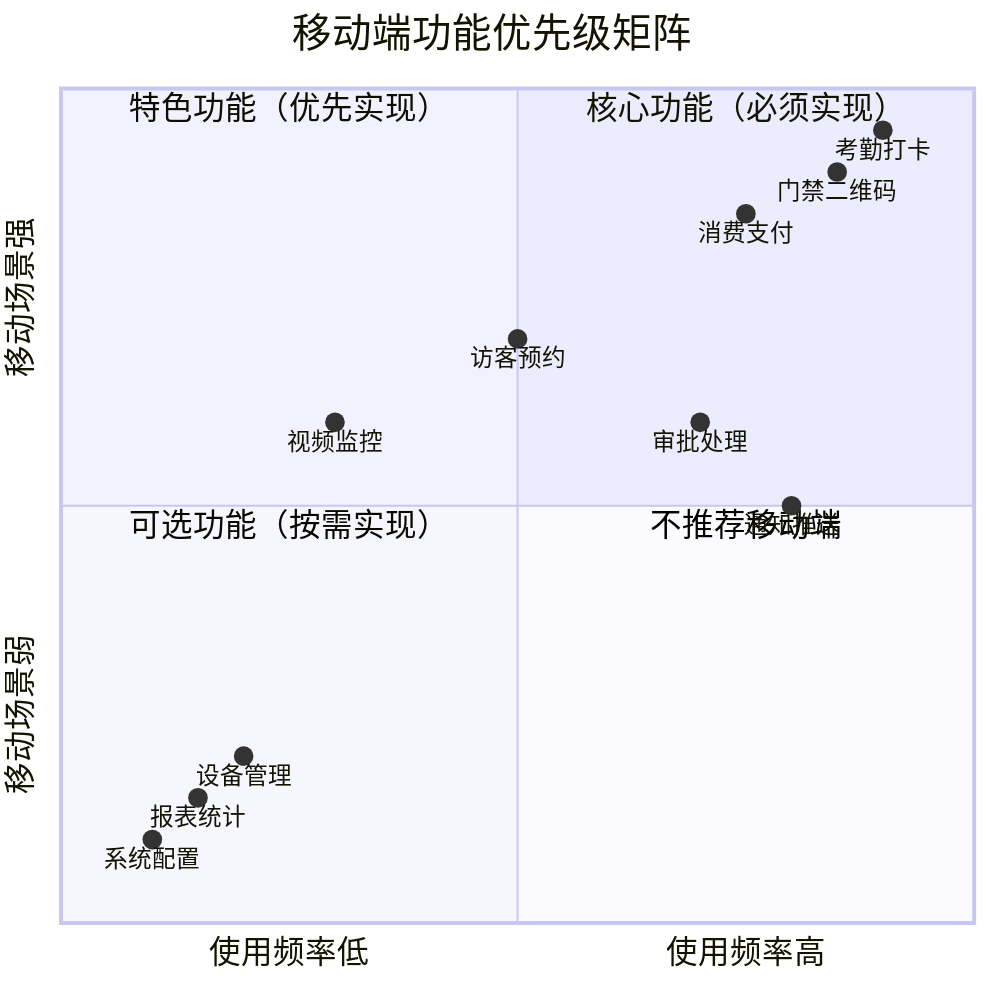

# IOE-DREAM 智慧园区移动端功能设计规范

> **版本**: v2.1.0  
> **创建时间**: 2025-12-17  
> **最后更新**: 2025-12-17  
> **文档负责人**: IOE-DREAM架构委员会

---

## 📋 目录

1. [移动端功能定位原则](#移动端功能定位原则)
2. [功能筛选矩阵](#功能筛选矩阵)
3. [核心移动端功能](#核心移动端功能)
4. [各模块移动端功能设计](#各模块移动端功能设计)
5. [不适合移动端的功能](#不适合移动端的功能)
6. [技术实现要点](#技术实现要点)

---

## 🎯 移动端功能定位原则

### 1.1 核心原则

移动端**不是**PC端的简单移植，而是针对移动场景的**专属设计**：

| 原则 | 说明 | 示例 |
|------|------|------|
| **高频优先** | 每日使用的核心功能 | 考勤打卡、门禁通行 |
| **移动场景** | 需要手机特有能力的功能 | 定位打卡、NFC开门、扫码支付 |
| **即时响应** | 需要实时处理的功能 | 报警通知、审批提醒 |
| **简化操作** | 一键完成的快捷功能 | 一键打卡、快速审批 |
| **离线支持** | 网络不稳定时可用 | 离线打卡、本地缓存 |

### 1.2 用户角色与使用频率



---

## 📊 功能筛选矩阵

### 2.1 按模块功能筛选

| 业务模块 | 移动端核心功能 | 移动端可选功能 | 不建议移动端 |
|---------|---------------|---------------|-------------|
| **考勤管理** | 打卡、排班查看、请假申请 | 统计查看、异常申诉 | 排班管理、规则配置 |
| **门禁管理** | 二维码/NFC通行、远程开门 | 通行记录查看 | 设备配置、区域管理 |
| **消费管理** | 扫码支付、余额查询、充值 | 消费记录查看 | 账户管理、商户配置 |
| **访客管理** | 预约申请、签到签出 | 访客记录查看 | 审批配置、权限管理 |
| **视频监控** | 实时查看、告警接收 | 录像回放 | 设备管理、存储配置 |
| **OA审批** | 审批处理、流程查看 | 申请提交 | 流程配置、表单设计 |

### 2.2 功能优先级定义

**P0 - 必须实现**（上线前必须完成）
- 考勤打卡（GPS/WiFi定位）
- 门禁二维码通行
- 消费扫码支付
- 消息推送接收
- 个人信息查看

**P1 - 优先实现**（首版本完成）
- NFC门禁通行
- 远程开门控制
- 请假/加班申请
- 审批处理
- 访客预约

**P2 - 按需实现**（后续版本）
- 视频监控查看
- 考勤统计图表
- 消费记录详情
- 通行记录查询
- 人脸识别登录

**P3 - 不推荐移动端**
- 设备配置管理
- 系统参数设置
- 复杂报表生成
- 批量数据导入导出
- 权限角色配置

---

## 🚀 核心移动端功能

### 3.1 考勤模块（已实现后端API）

基于现有 `AttendanceMobileService` 和 `AttendanceMobileController`：

#### 核心功能列表

| 功能 | API接口 | 优先级 | 说明 |
|------|---------|--------|------|
| 用户登录 | `POST /login` | P0 | 支持密码/生物识别登录 |
| 上班打卡 | `POST /clock-in` | P0 | GPS+WiFi双重定位验证 |
| 下班打卡 | `POST /clock-out` | P0 | 支持加班自动识别 |
| 今日状态 | `GET /today/status` | P0 | 显示打卡状态和工作时长 |
| 考勤记录 | `GET /records` | P1 | 查看历史打卡记录 |
| 请假申请 | `POST /leave/apply` | P1 | 提交请假申请流程 |
| 排班查看 | `GET /schedule` | P1 | 查看个人排班 |
| 考勤日历 | `GET /calendar` | P2 | 日历形式查看考勤 |
| 考勤统计 | `GET /statistics` | P2 | 月度考勤统计 |
| 生物识别 | `POST /biometric/verify` | P1 | 人脸/指纹验证 |

#### 移动端特有能力

```typescript
// 考勤打卡移动端特有能力
interface MobileClockCapabilities {
  // GPS定位打卡
  gpsLocation: {
    accuracy: number;           // 精度要求(米)
    geoFencing: boolean;        // 地理围栏验证
    allowedRadius: number;      // 允许偏差范围
  };

  // WiFi定位打卡
  wifiLocation: {
    ssidWhitelist: string[];    // 允许的WiFi名称
    bssidValidation: boolean;   // MAC地址验证
  };

  // 生物识别打卡
  biometric: {
    faceRecognition: boolean;   // 人脸识别
    fingerprint: boolean;       // 指纹识别
    livenessDetection: boolean; // 活体检测
  };

  // 离线打卡
  offlineClock: {
    enabled: boolean;           // 离线打卡开关
    maxOfflineRecords: number;  // 最大离线记录数
    autoSync: boolean;          // 网络恢复自动同步
  };
}
```

### 3.2 门禁模块

基于现有 `access-service` 静态资源和API：

#### 核心功能列表

| 功能 | 优先级 | 移动端能力 |
|------|--------|-----------|
| 动态二维码通行 | P0 | 每30秒刷新，防截图 |
| NFC门禁卡模拟 | P1 | HCE卡模拟技术 |
| 蓝牙门禁 | P2 | BLE低功耗连接 |
| 远程开门 | P1 | WebSocket实时控制 |
| 通行记录 | P2 | 查看个人通行历史 |
| 告警通知 | P0 | 推送门禁异常告警 |

#### 门禁二维码设计

```typescript
interface AccessQRCode {
  // 二维码数据
  qrData: {
    userId: string;
    timestamp: number;
    expireTime: number;       // 有效期30秒
    signature: string;        // 数字签名防伪
    deviceId: string;         // 绑定设备
  };

  // 刷新策略
  refreshStrategy: {
    interval: 30000;          // 30秒刷新
    preloadTime: 5000;        // 提前5秒预加载
    offlineSupport: boolean;  // 离线二维码
  };

  // 安全策略
  security: {
    screenshotPrevention: boolean;  // 防截图
    deviceBinding: boolean;         // 设备绑定
    oneTimeUse: boolean;            // 一次性使用
  };
}
```

### 3.3 消费模块

#### 核心功能列表

| 功能 | 优先级 | 说明 |
|------|--------|------|
| 扫码支付 | P0 | 扫商户二维码支付 |
| 付款码 | P0 | 展示付款二维码 |
| 余额查询 | P0 | 实时余额查看 |
| 消费记录 | P1 | 历史消费明细 |
| 在线充值 | P1 | 微信/支付宝充值 |
| NFC支付 | P2 | 模拟一卡通支付 |

### 3.4 访客模块

#### 核心功能列表

| 功能 | 优先级 | 说明 |
|------|--------|------|
| 预约申请 | P0 | 提交访客预约 |
| 预约审批 | P1 | 审批访客预约 |
| 访客二维码 | P0 | 生成访客通行码 |
| 签到签出 | P1 | 访客到访登记 |
| 预约记录 | P2 | 查看预约历史 |

### 3.5 视频监控模块

#### 移动端功能（精简版）

| 功能 | 优先级 | 说明 |
|------|--------|------|
| 实时预览 | P1 | 单路视频查看 |
| 告警接收 | P0 | 推送视频告警 |
| 告警处理 | P1 | 确认/处理告警 |
| 录像回放 | P2 | 事件关联回放 |

**注意**：移动端不建议实现多画面分屏、PTZ高级控制、AI分析配置等复杂功能。

### 3.6 OA审批模块

#### 移动端功能

| 功能 | 优先级 | 说明 |
|------|--------|------|
| 待办列表 | P0 | 查看待审批任务 |
| 快速审批 | P0 | 同意/拒绝操作 |
| 审批详情 | P1 | 查看申请详情 |
| 审批记录 | P1 | 查看已处理记录 |
| 电子签名 | P2 | 手写签名 |

---

## 📱 各模块移动端功能设计

### 4.1 移动端首页设计

```
┌─────────────────────────────────────┐
│  IOE-DREAM 智慧园区                  │
│  👤 张三 | 研发部                    │
├─────────────────────────────────────┤
│                                     │
│  ┌─────────┐ ┌─────────┐           │
│  │  打卡   │ │  门禁   │           │
│  │  ⏰    │ │  🚪    │           │
│  └─────────┘ └─────────┘           │
│                                     │
│  ┌─────────┐ ┌─────────┐           │
│  │  消费   │ │  审批   │           │
│  │  💳    │ │  ✅    │           │
│  └─────────┘ └─────────┘           │
│                                     │
├─────────────────────────────────────┤
│  📋 待办事项 (3)                     │
│  • 张经理的请假申请待审批            │
│  • 访客李四即将到访                  │
│  • 设备异常告警待处理                │
├─────────────────────────────────────┤
│  🏠首页  📊考勤  🔔消息  👤我的      │
└─────────────────────────────────────┘
```

### 4.2 考勤打卡页面设计

```
┌─────────────────────────────────────┐
│  ← 考勤打卡                         │
├─────────────────────────────────────┤
│                                     │
│           ┌─────────┐              │
│           │ 09:00  │              │
│           │   ✓    │              │
│           │ 已打卡  │              │
│           └─────────┘              │
│                                     │
│  📍 北京市海淀区中关村软件园         │
│  📶 WiFi: IOE-DREAM-Office         │
│                                     │
│  ┌───────────────────────────────┐ │
│  │      [ 下班打卡 ]             │ │
│  └───────────────────────────────┘ │
│                                     │
│  今日工作时长: 8小时23分             │
│                                     │
├─────────────────────────────────────┤
│  本月考勤                           │
│  出勤: 20天 | 迟到: 1次 | 早退: 0次 │
└─────────────────────────────────────┘
```

### 4.3 门禁二维码页面设计

```
┌─────────────────────────────────────┐
│  ← 门禁通行                         │
├─────────────────────────────────────┤
│                                     │
│       ┌─────────────────┐          │
│       │                 │          │
│       │   ▓▓▓▓▓▓▓▓▓▓▓  │          │
│       │   ▓         ▓  │          │
│       │   ▓  二维码  ▓  │          │
│       │   ▓         ▓  │          │
│       │   ▓▓▓▓▓▓▓▓▓▓▓  │          │
│       │                 │          │
│       └─────────────────┘          │
│                                     │
│       有效期: 28秒 🔄               │
│                                     │
│  将二维码对准门禁扫描区域            │
│                                     │
├─────────────────────────────────────┤
│  🔵 NFC通行  |  📱 蓝牙开门         │
└─────────────────────────────────────┘
```

---

## ❌ 不适合移动端的功能

### 5.1 明确不推荐移动端的功能

| 功能类别 | 具体功能 | 原因 |
|---------|---------|------|
| **系统配置** | 系统参数设置、权限配置 | 操作复杂，需要PC端大屏幕 |
| **设备管理** | 设备注册、配置、固件升级 | 专业操作，需要稳定网络 |
| **报表生成** | 复杂统计报表、数据导出 | 数据量大，展示不友好 |
| **批量操作** | 批量导入、批量修改 | 操作繁琐，易出错 |
| **流程配置** | 审批流程设计、表单设计 | 需要可视化设计器 |
| **区域管理** | 区域层级配置、地图标注 | 需要大屏幕地图操作 |
| **视频配置** | 录像计划、存储策略 | 专业配置，参数复杂 |
| **日志审计** | 操作日志查询、安全审计 | 数据量大，筛选复杂 |

### 5.2 PC端与移动端功能对比

```
┌─────────────────┬──────────────────┬──────────────────┐
│    功能维度     │     PC端         │     移动端       │
├─────────────────┼──────────────────┼──────────────────┤
│ 系统管理        │ ✅ 完整功能       │ ❌ 不支持        │
│ 设备管理        │ ✅ 完整功能       │ ⚠️ 仅查看状态    │
│ 区域权限        │ ✅ 完整功能       │ ❌ 不支持        │
│ 考勤管理        │ ✅ 完整功能       │ ✅ 打卡/查看     │
│ 门禁管理        │ ✅ 完整功能       │ ✅ 通行/开门     │
│ 消费管理        │ ✅ 完整功能       │ ✅ 支付/查询     │
│ 访客管理        │ ✅ 完整功能       │ ✅ 预约/接待     │
│ 视频监控        │ ✅ 多画面/AI     │ ⚠️ 单画面预览    │
│ OA审批         │ ✅ 完整功能       │ ✅ 审批处理      │
│ 报表统计        │ ✅ 完整功能       │ ⚠️ 简化图表     │
└─────────────────┴──────────────────┴──────────────────┘
```

---

## 🔧 技术实现要点

### 6.1 现有后端API对接

基于已实现的 `AttendanceMobileController`，移动端需要对接的关键接口：

```java
// 已实现的核心API
@RestController
@RequestMapping("/api/mobile/v1/attendance")
public class AttendanceMobileController {
    // 认证相关
    POST /login                    // 用户登录
    POST /logout                   // 用户登出
    POST /refresh                  // 刷新令牌
    
    // 打卡相关
    POST /clock-in                 // 上班打卡
    POST /clock-out                // 下班打卡
    GET  /today/status             // 今日状态
    
    // 记录查询
    GET  /records                  // 考勤记录
    GET  /statistics               // 考勤统计
    GET  /calendar                 // 考勤日历
    
    // 请假管理
    POST /leave/apply              // 请假申请
    GET  /leave/records            // 请假记录
    
    // 生物识别
    POST /biometric/verify         // 生物识别验证
    
    // 位置相关
    GET  /location/current         // 获取位置
    POST /location/report          // 位置上报
    
    // 离线支持
    GET  /data/offline             // 获取离线数据
    POST /data/offline/upload      // 上传离线数据
}
```

### 6.2 其他模块需要新增的移动端API

```java
// 门禁移动端API (需新增)
@RequestMapping("/api/mobile/v1/access")
public interface AccessMobileService {
    POST /qrcode/generate          // 生成通行二维码
    POST /remote/open              // 远程开门
    GET  /records                  // 通行记录
    GET  /permissions              // 我的权限
}

// 消费移动端API (需新增)
@RequestMapping("/api/mobile/v1/consume")
public interface ConsumeMobileService {
    POST /payment/create           // 创建支付
    GET  /balance                  // 余额查询
    GET  /transactions             // 消费记录
    POST /recharge                 // 在线充值
}

// 访客移动端API (需新增)
@RequestMapping("/api/mobile/v1/visitor")
public interface VisitorMobileService {
    POST /appointment/create       // 预约申请
    GET  /appointment/list         // 预约列表
    POST /checkin                  // 访客签到
    POST /checkout                 // 访客签出
}
```

### 6.3 前端技术要求

```typescript
// uni-app + Vue3 + TypeScript 技术栈
const techStack = {
  framework: 'uni-app 3.0',
  language: 'TypeScript 5.0+',
  ui: 'Vant 4.8.0+',
  state: 'Pinia 2.1.7+',
  http: 'uni.request封装',
  storage: 'uni.setStorage',
  
  // 移动端特有
  location: 'uni.getLocation',
  camera: 'uni.chooseImage',
  nfc: 'plus.nfc (APP-PLUS)',
  biometric: 'plus.fingerprint / plus.faceID'
};
```

---

## 📝 总结

### 移动端功能实施建议

1. **第一阶段（MVP）**
   - 考勤打卡（GPS/WiFi）
   - 门禁二维码
   - 消费支付
   - 消息推送

2. **第二阶段（增强）**
   - NFC门禁
   - 请假申请
   - 审批处理
   - 访客预约

3. **第三阶段（完善）**
   - 视频预览
   - 统计图表
   - 电子签名
   - 离线功能

### 核心原则再强调

> **移动端 ≠ PC端的缩小版**  
> 只做移动场景下真正需要的功能，拒绝功能堆砌

---

**© 2025 IOE-DREAM智慧园区一卡通管理平台. All rights reserved.**
