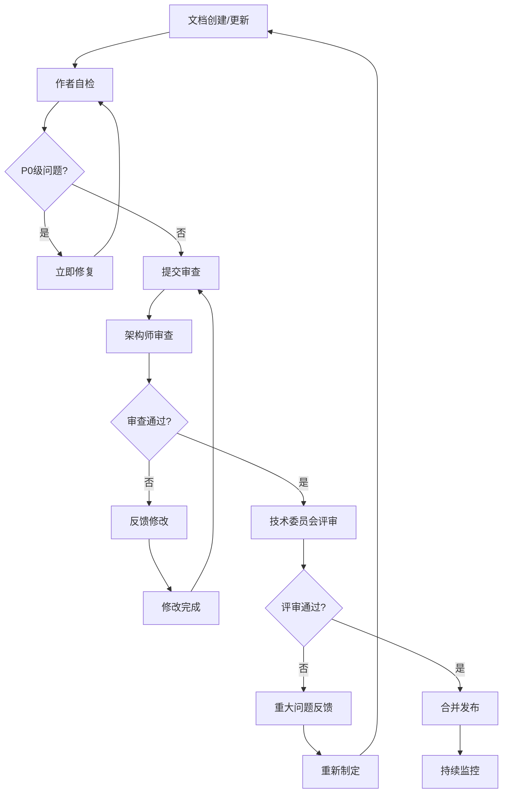
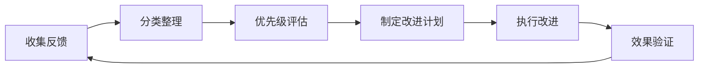

# IOE-DREAM 文档审查机制

**版本**: v1.0.0
**适用范围**: IOE-DREAM智能管理系统所有技术文档
**生效日期**: 2025-12-02
**维护团队**: IOE-DREAM架构委员会

---

## 🎯 审查机制概述

为确保IOE-DREAM项目文档的持续合规性和高质量，特建立此文档审查机制。该机制基于IOE-DREAM全局架构规范CLAUDE.md，对所有技术文档进行系统性审查和持续改进。

### 审查目标
- ✅ **架构合规性**: 100%符合IOE-DREAM七微服务架构标准
- ✅ **零容忍规则**: 强制执行所有架构规范零容忍规则
- ✅ **内容一致性**: 确保文档与实际代码实现一致
- ✅ **质量标准**: 企业级文档质量和可维护性

---

## 🔍 审查维度与标准

### 1. 架构合规性审查 (P0级)

#### 📋 检查清单
- [ ] **七微服务架构描述**: 必须准确描述7个核心微服务
- [ ] **四层架构规范**: 必须正确描述Controller → Service → Manager → DAO
- [ ] **技术栈一致性**: Spring Boot 3.5.8 + Java 17 + Jakarta EE
- [ ] **技术栈标准引用**: 必须引用 [技术栈标准规范](../technical/TECHNOLOGY_STACK_STANDARD.md)
- [ ] **架构边界清晰**: 明确各层职责和边界

#### ✅ 合规标准
```yaml
架构标准:
  微服务数量: 7个 (Gateway, Common, DeviceComm, OA, Access, Attendance, Video, Consume, Visitor)
  架构分层: 4层 (Controller, Service, Manager, DAO)
  技术栈: Spring Boot 3.5.8, Java 17, Jakarta EE 3.0+
  技术栈标准: 必须引用 TECHNOLOGY_STACK_STANDARD.md
  连接池: Druid (强制)
  缓存: Redis + Caffeine多级缓存
```

#### 🔍 技术栈一致性检查 (P0级)
- [ ] **技术栈标准引用**: 文档必须引用 [技术栈标准规范](../technical/TECHNOLOGY_STACK_STANDARD.md)
- [ ] **版本一致性**: 所有技术栈版本必须与标准规范一致
- [ ] **无硬编码版本**: 禁止在文档中硬编码技术栈版本
- [ ] **标准版本检查**:
  - Spring Boot: 必须为 **3.5.8**
  - Spring Cloud: 必须为 **2025.0.0**
  - Spring Cloud Alibaba: 必须为 **2025.0.0.0**
  - Java: 必须为 **17**
  - MyBatis-Plus: 必须为 **3.5.15**
  - MySQL: 必须为 **8.0.35**
  - Druid: 必须为 **1.2.25**
  - Lombok: 必须为 **1.18.42**

### 2. 零容忍规则审查 (P0级)

#### 📋 核心规则检查
- [ ] **依赖注入**: 禁止@Autowired，强制@Resource
- [ ] **DAO层规范**: 禁止@Repository，强制@Mapper + Dao后缀
- [ ] **事务管理**: 正确使用@Transactional注解
- [ ] **跨层访问**: 禁止跨层访问，严格分层调用

#### ❌ 违规示例识别
```java
// 必须识别的违规模式
@Autowired                    // ❌ 禁止
@Repository                 // ❌ 禁止
public interface XxxRepository // ❌ 禁止
@Service直接调用DAO           // ❌ 禁止跨层访问
```

### 3. 内容一致性审查 (P1级)

#### 📋 一致性检查
- [ ] **代码示例正确性**: 所有代码示例必须可执行
- [ ] **配置文件一致性**: application.yml配置与实际项目一致
- [ ] **API描述准确性**: 接口文档与实际API实现一致
- [ ] **数据库设计**: 表结构与实际数据库一致

#### 🔄 验证机制
```bash
# 代码示例验证
mvn compile -q  # 验证代码示例可编译

# 配置文件验证
./scripts/validate-config.sh

# API文档验证
./scripts/validate-api-docs.sh
```

### 4. 质量标准审查 (P1级)

#### 📋 文档质量标准
- [ ] **结构完整**: 包含概述、架构、实现、示例、检查清单
- [ ] **图表清晰**: Mermaid图表语法正确、内容清晰
- [ ] **代码注释**: 所有代码示例有详细注释
- [ ] **实用性强**: 提供可操作的指导和模板

#### 📊 质量指标
| 指标 | 目标值 | 衡量方式 |
|------|--------|----------|
| 文档完整性 | 100% | 必要章节齐全 |
| 代码正确性 | 100% | 可编译可执行 |
| 示例实用性 | ≥90% | 用户反馈良好 |
| 更新及时性 | 7天内 | 跟随代码更新 |

---

## 🔧 审查流程与机制

### 审查流程图



### 审查角色与职责

#### 🔵 文档作者
- **职责**: 创建、更新文档内容
- **自检要求**: 执行完整的自检清单
- **质量标准**: 确保无P0级问题

#### 🔵 架构师
- **职责**: 架构合规性和技术标准审查
- **审查重点**: 零容忍规则、架构一致性
- **响应时间**: 2个工作日内完成审查

#### 🔵 技术委员会
- **职责**: 最终质量评审和批准
- **评审标准**: 企业级文档质量标准
- **决策权**: 批准或驳回文档发布

### 审查工具支持

#### 🔧 自动化检查工具
```bash
#!/bin/bash
# 文档合规性自动检查脚本

echo "🔍 开始IOE-DREAM文档合规性检查..."

# 1. 架构合规性检查
echo "检查架构合规性..."
grep -r "七微服务" documentation/ || echo "❌ 缺少七微服务架构描述"
grep -r "四层架构" documentation/ || echo "❌ 缺少四层架构规范"

# 2. 零容忍规则检查
echo "检查零容忍规则..."
grep -r "@Autowired" documentation/ && echo "❌ 发现@Autowired违规"
grep -r "@Repository" documentation/ && echo "❌ 发现@Repository违规"
grep -r "Repository后缀" documentation/ && echo "❌ 发现Repository命名违规"

# 3. 文档质量检查
echo "检查文档质量..."
find documentation/ -name "*.md" -exec grep -l "```mermaid" {} \; | wc -l
echo "包含图表的文档数量: $(find documentation/ -name "*.md" -exec grep -l '```mermaid' {} \; | wc -l)"

echo "✅ 文档合规性检查完成"
```

#### 🔧 CI/CD集成检查
```yaml
# .github/workflows/docs-review.yml
name: Documentation Review

on:
  pull_request:
    paths:
      - 'documentation/**'

jobs:
  docs-review:
    runs-on: ubuntu-latest
    steps:
      - uses: actions/checkout@v3

      - name: Check Documentation Compliance
        run: |
          chmod +x ./scripts/docs-compliance-check.sh
          ./scripts/docs-compliance-check.sh

      - name: Validate Code Examples
        run: |
          find documentation/ -name "*.md" -exec grep -l "```java" {} \; | \
          xargs -I {} sh -c 'echo "Validating {}" && \
            grep -o "```java.*?```" {} | sed "s/```java//g" | sed "s/```//g" > /tmp/code.java && \
            javac -cp ".:target/*" /tmp/code.java 2>/dev/null || echo "❌ 代码示例编译失败"'
```

---

## 📊 审查结果管理

### 审查结果分类

#### 🟢 通过 (Approved)
- **标准**: 无P0/P1级问题，符合所有质量标准
- **处理**: 直接合并发布
- **标识**: ✅ APPROVED

#### 🟡 有条件通过 (Conditional)
- **标准**: 存在P2级问题，但不影响核心功能
- **处理**: 修复后发布，或记录待修复
- **标识**: ⚠️ CONDITIONAL

#### 🔴 拒绝 (Rejected)
- **标准**: 存在P0/P1级问题
- **处理**: 必须修复后重新提交
- **标识**: ❌ REJECTED

### 审查记录模板

```markdown
## 文档审查记录

**文档名称**: [文档标题]
**审查日期**: [YYYY-MM-DD]
**审查人员**: [审查人员姓名]
**审查版本**: [文档版本]

### 审查结果: [通过/有条件通过/拒绝]

### 发现问题

#### P0级问题 (必须修复)
- [ ] 问题描述
- [ ] 位置说明
- [ ] 修复建议

#### P1级问题 (建议修复)
- [ ] 问题描述
- [ ] 位置说明
- [ ] 修复建议

#### P2级问题 (可选修复)
- [ ] 问题描述
- [ ] 位置说明
- [ ] 修复建议

### 审查结论
[总体评价和建议]

### 后续行动
- [ ] 修复P0级问题
- [ ] 重新提交审查
- [ ] 计划修复P1级问题
- [ ] 持续监控
```

---

## 🔄 持续改进机制

### 定期审查计划

#### 📅 月度审查
- **时间**: 每月最后一周
- **范围**: 所有核心架构文档
- **重点**: 架构合规性和零容忍规则

#### 📅 季度审查
- **时间**: 每季度末
- **范围**: 全量技术文档
- **重点**: 内容一致性和质量标准

#### 📅 即时审查
- **触发**: 文档重大更新
- **范围**: 更新的文档及其依赖文档
- **重点**: 变更影响分析

### 反馈收集机制

#### 📝 用户反馈渠道
```yaml
反馈渠道:
  - GitHub Issues: 项目仓库问题追踪
  - 团队会议: 每周技术会议反馈
  - 问卷调查: 季度文档质量调查
  - 一对一沟通: 重要问题直接沟通
```

#### 📈 反馈分析处理


---

## 🎯 成功指标与监控

### 关键指标 (KPIs)

| 指标名称 | 目标值 | 当前值 | 监控频率 |
|---------|--------|--------|----------|
| 文档合规率 | 100% | [计算中] | 每周 |
| P0问题数 | 0个 | [统计中] | 实时 |
| 审查周期 | ≤2天 | [测量中] | 每月 |
| 用户满意度 | ≥90% | [收集中] | 季度 |
| 文档更新及时性 | ≤7天 | [跟踪中] | 每月 |

### 监控仪表板

```yaml
仪表板数据源:
  - Git提交记录: 文档更新频率
  - CI/CD检查结果: 合规性检查结果
  - 用户反馈数据: 满意度和问题统计
  - 代码仓库分析: 架构一致性检查

报告机制:
  - 周报: 审查状态和问题统计
  - 月报: 质量趋势和改进建议
  - 季报: 整体评估和规划调整
```

---

## 📞 支持与联系

### 技术支持
- **架构委员会**: 负责最终解释和决策
- **文档维护团队**: 负责日常维护和更新
- **质量保障团队**: 负责审查流程执行

### 联系方式
- **技术问题**: 通过团队群或架构师直接联系
- **流程建议**: 提交GitHub Issues或团队会议讨论
- **紧急问题**: 直接联系架构委员会成员

---

## 📝 附录

### A. 快速检查清单

#### 作者自检清单 (5分钟)
```markdown
- [ ] 描述了七微服务架构
- [ ] 说明了四层架构
- [ ] 无@Autowired违规
- [ ] 无@Repository违规
- [ ] 代码示例可执行
- [ ] 包含实用检查清单
```

#### 架构师审查清单 (15分钟)
```markdown
- [ ] 架构描述准确完整
- [ ] 零容忍规则执行
- [ ] 技术栈一致性
- [ ] 内容实用性验证
- [ ] 质量标准符合
- [ ] 图表和示例正确
```

### B. 常见问题解答

#### Q: 如何处理紧急文档更新？
A: 紧急更新可先发布，但必须在3个工作日内完成审查流程。

#### Q: 代码示例编译错误如何处理？
A: 代码示例必须保证可编译，建议使用实际项目代码作为示例。

#### Q: 文档审查周期过长怎么办？
A: 优先处理核心架构文档，非核心文档可采用并行审查机制。

---

**文档版本**: v1.0.0
**最后更新**: 2025-12-02
**下次审查**: 2025-12-09
**状态**: ✅ 已生效

**🎯 让我们一起确保IOE-DREAM文档体系始终保持高质量和高标准！**
