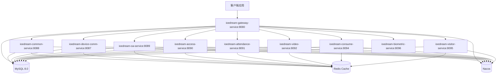
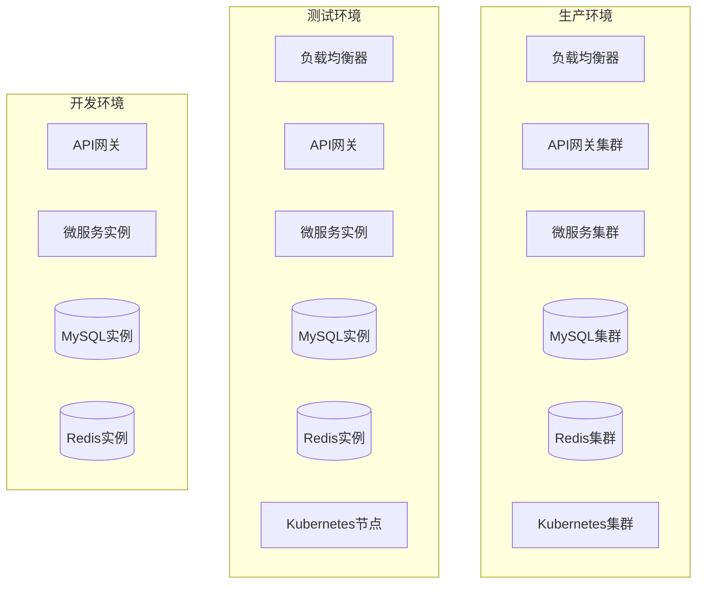
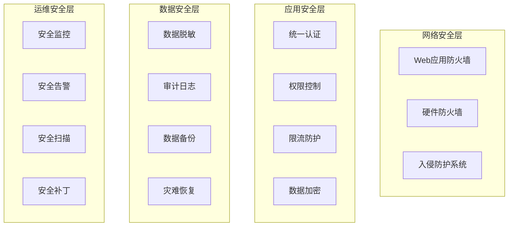

# 🏗️ IOE-DREAM 微服务架构全景图

> **📅 文档创建日期**: 2025-12-16
> **📋 文档版本**: v1.0.0
> **🎯 文档范围**: 所有微服务架构和子模块详细清单
> **✅ 文档状态**: 已完成
> **📦 数据来源**: 代码库深度分析 + 备份文档整合

---

## 📋 微服务架构总览

### 架构概览

IOE-DREAM采用**11微服务架构模式**，包含11个核心微服务（1个API网关 + 10个业务服务）：



### 微服务清单

| 序号 | 微服务名称 | 端口 | 职责定位 | 核心模块数 | 主要业务场景 | 设备交互模式 |
|------|-----------|------|----------|-----------|-------------|-------------|
| 1 | **ioedream-gateway-service** | 8080 | API网关 | 3 | 路由转发、认证授权、限流熔断 | - |
| 2 | **ioedream-common-service** | 8088 | 公共业务 | 8 | 用户管理、权限管理、字典管理 | - |
| 3 | **ioedream-device-comm-service** | 8087 | 设备通讯 | 4 | 设备协议、连接管理、模板下发 ⚠️ 不做识别 | 模板下发 |
| 4 | **ioedream-oa-service** | 8089 | OA办公 | 6 | 工作流、审批、公告管理 | - |
| 5 | **ioedream-access-service** | 8090 | 门禁管理 | 5 | 门禁控制、通行记录、权限管理 | Mode 1: 边缘自主验证 |
| 6 | **ioedream-attendance-service** | 8091 | 考勤管理 | 4 | 考勤打卡、排班管理、统计 | Mode 3: 边缘识别+中心计算 |
| 7 | **ioedream-video-service** | 8092 | 视频监控 | 4 | 视频监控、AI分析、告警 | Mode 5: 边缘AI计算 |
| 8 | **ioedream-database-service** | 8093 | 数据库管理 | 3 | 数据备份、恢复、性能监控 | - |
| 9 | **ioedream-consume-service** | 8094 | 消费管理 | 4 | 消费支付、账户管理、统计 | Mode 2: 中心实时验证 |
| 10 | **ioedream-visitor-service** | 8095 | 访客管理 | 4 | 访客预约、登记、轨迹追踪 | Mode 4: 混合验证 |
| 11 | **ioedream-biometric-service** | 8096 | 生物模板管理 | 3 | 模板存储、特征提取、设备下发 ⚠️ 仅管理数据 | 模板管理 |
| 4 | **ioedream-oa-service** | 8089 | OA办公 | 6 | 组织架构、审批流程、工作流 |
| 5 | **ioedream-access-service** | 8090 | 门禁管理 | 7 | 门禁控制、通行记录、权限申请 |
| 6 | **ioedream-attendance-service** | 8091 | 考勤管理 | 5 | 考勤打卡、排班管理、统计报表 |
| 7 | **ioedream-video-service** | 8092 | 视频监控 | 6 | 视频监控、AI分析、录像管理 |
| 8 | **ioedream-consume-service** | 8094 | 消费管理 | 6 | 消费支付、账户管理、商户管理 |
| 9 | **ioedream-visitor-service** | 8095 | 访客管理 | 5 | 访客预约、审批流程、访问记录 |

---

## 🔍 详细子模块架构分析

### 1. ioedream-gateway-service (API网关服务)

**定位**: 统一入口、路由转发、安全防护

**核心子模块**:
```
ioedream-gateway-service/
├── config/                    # 配置模块
│   ├── GatewayConfiguration.java
│   ├── SecurityConfiguration.java
│   └── CorsConfiguration.java
├── filter/                    # 过滤器模块
│   ├── AuthenticationFilter.java
│   ├── RateLimitFilter.java
│   └── LoggingFilter.java
├── fallback/                  # 降级模块
│   ├── GatewayFallbackController.java
│   └── ServiceFallbackHandler.java
└── controller/                # 控制器模块
    ├── HealthController.java
    └── RouteController.java
```

**技术栈**:
- Spring Cloud Gateway 2025.0.0
- Spring Security 6.x
- Resilience4j 2.x
- Redis Rate Limiting

### 2. ioedream-common-service (公共业务服务)

**定位**: 公共业务能力、用户权限、基础数据

**核心子模块**:
```
ioedream-common-service/
├── user/                      # 用户管理模块
│   ├── UserController.java
│   ├── UserService.java
│   └── UserManager.java
├── auth/                      # 认证授权模块
│   ├── AuthController.java
│   ├── AuthService.java
│   └── TokenManager.java
├── permission/                # 权限管理模块
│   ├── PermissionController.java
│   ├── RoleService.java
│   └── MenuService.java
├── dict/                      # 字典管理模块
│   ├── DictController.java
│   ├── DictService.java
│   └── DictManager.java
├── organization/              # 组织架构模块
│   ├── DepartmentController.java
│   ├── AreaService.java
│   └── AreaDeviceManager.java
├── notification/              # 通知推送模块
│   ├── NotificationController.java
│   ├── MessageService.java
│   └── PushManager.java
├── audit/                     # 审计日志模块
│   ├── AuditController.java
│   ├── AuditService.java
│   └── LogManager.java
└── workflow/                  # 工作流模块
    ├── WorkflowController.java
    ├── ProcessService.java
    └── TaskManager.java
```

**技术栈**:
- Spring Boot 3.5.8
- Spring Security 6.x
- Sa-Token 1.44.0
- Workflow Engine

### 3. ioedream-device-comm-service (设备通讯服务)

**定位**: 设备连接、协议适配、数据采集

**核心子模块**:
```
ioedream-device-comm-service/
├── protocol/                  # 协议适配模块
│   ├── TCPProtocolHandler.java
│   ├── HTTPProtocolHandler.java
│   ├── WebSocketHandler.java
│   └── MQTTHandler.java
├── template/                  # ⭐ 模板下发模块（仅下发，不识别）
│   ├── BiometricTemplateSyncController.java
│   ├── TemplateSyncService.java
│   └── TemplateTransferManager.java
├── connection/                # 连接管理模块
│   ├── DeviceConnectionManager.java
│   ├── ConnectionPool.java
│   └── HeartbeatService.java
└── data/                      # 数据采集模块
    ├── DeviceDataCollector.java
    ├── DataProcessor.java
    └── RealTimeDataService.java
```

**技术栈**:
- Netty 4.1.x
- MQTT Client
- WebSocket
- Biometric SDK

### 4. ioedream-oa-service (OA办公服务)

**定位**: 办公自动化、流程审批、文档管理

**核心子模块**:
```
ioedream-oa-service/
├── organization/              # 组织架构模块
│   ├── EmployeeController.java
│   ├── DepartmentService.java
│   └── PositionManager.java
├── approval/                  # 审批流程模块
│   ├── ApprovalController.java
│   ├── ApprovalService.java
│   └── ProcessDefinitionService.java
├── document/                  # 文档管理模块
│   ├── DocumentController.java
│   ├── FileService.java
│   └── VersionManager.java
├── announcement/              # 公告管理模块
│   ├── AnnouncementController.java
│   ├── NoticeService.java
│   └── PublishManager.java
├── meeting/                   # 会议管理模块
│   ├── MeetingController.java
│   ├── MeetingRoomService.java
│   └── ScheduleManager.java
└── report/                    # 报表模块
    ├── ReportController.java
    ├── StatisticsService.java
    └── ExportManager.java
```

**技术栈**:
- Activiti 7.x
- Apache POI 5.x
- iText 7.x
- Elasticsearch 8.x

### 5. ioedream-access-service (门禁管理服务)

**定位**: 门禁控制、通行管理、权限管理

**核心子模块**:
```
ioedream-access-service/
├── access/                    # 门禁控制模块
│   ├── AccessRecordController.java   # ⭐ 接收设备上传的记录
│   ├── AccessControlService.java
│   └── PassValidationManager.java
├── device/                    # 设备管理模块
│   ├── AccessDeviceController.java
│   ├── DeviceService.java
│   └── DeviceStatusMonitor.java
├── permission/                # 权限管理模块
│   ├── AccessPermissionApplyController.java
│   ├── PermissionService.java
│   └── AccessLevelManager.java
├── emergency/                 # 应急权限模块
│   ├── AccessEmergencyPermissionController.java
│   ├── EmergencyService.java
│   └── TemporaryAccessManager.java
├── antipassback/              # 反潜回模块
│   ├── AntiPassbackController.java
│   ├── AntiPassbackService.java
│   └── TrackingManager.java
├── security/                  # 安全增强模块
│   ├── EnhancedAccessSecurityController.java
│   ├── SecurityAnalysisService.java
│   └── AnomalyDetectionManager.java
└── edge/                      # 边缘计算模块
    ├── EdgeSecurityController.java
    ├── EdgeComputingService.java
    └── LocalCacheManager.java
```

**技术栈**:
- Spring Boot 3.5.8
- MyBatis-Plus 3.5.15
- Redis 6.4.x
- Face Recognition SDK

### 6. ioedream-attendance-service (考勤管理服务)

**定位**: 考勤打卡、排班管理、统计分析

**核心子模块**:
```
ioedream-attendance-service/
├── clock/                     # 打卡模块
│   ├── AttendanceController.java
│   ├── ClockInService.java
│   └── ClockOutService.java
├── schedule/                  # 排班模块
│   ├── WorkShiftController.java
│   ├── ScheduleService.java
│   └── ShiftPlanManager.java
├── leave/                     # 请假模块
│   ├── LeaveController.java
│   ├── LeaveService.java
│   └── ApprovalWorkflowManager.java
├── overtime/                  # 加班模块
│   ├── OvertimeController.java
│   ├── OvertimeService.java
│   └── OvertimeCalculationManager.java
└── statistics/                # 统计分析模块
    ├── StatisticsController.java
    ├── ReportService.java
    └── DataAnalysisManager.java
```

**技术栈**:
- Spring Boot 3.5.8
- MyBatis-Plus 3.5.15
- Quartz 2.x
- Apache POI 5.x

### 7. ioedream-video-service (视频监控服务)

**定位**: 视频监控、录像存储、AI分析

**核心子模块**:
```
ioedream-video-service/
├── monitor/                   # 视频监控模块
│   ├── VideoDeviceController.java
│   ├── StreamService.java
│   └── RealTimeMonitorManager.java
├── recording/                 # 录像管理模块
│   ├── VideoRecordController.java
│   ├── RecordingService.java
│   └── StorageManager.java
├── ai/                        # AI分析模块
│   ├── AIAnalysisController.java
│   ├── FaceDetectionService.java
│   ├── BehaviorAnalysisService.java
│   └── ObjectTrackingService.java
├── playback/                  # 录像回放模块
│   ├── PlaybackController.java
│   ├── PlaybackService.java
│   └── TimelineManager.java
├── alert/                     # 告警模块
│   ├── AlertController.java
│   ├── AlertService.java
│   └── NotificationManager.java
└── storage/                   # 存储管理模块
    ├── StorageController.java
    ├── FileSystemService.java
│   └── BackupManager.java
```

**技术栈**:
- Spring Boot 3.5.8
- FFmpeg 5.x
- OpenCV 4.x
- TensorFlow 2.x

### 8. ioedream-consume-service (消费管理服务)

**定位**: 消费支付、账户管理、商户管理

**核心子模块**:
```
ioedream-consume-service/
├── payment/                   # 支付模块
│   ├── PaymentController.java
│   ├── PaymentService.java
│   └── TransactionManager.java
├── account/                   # 账户模块
│   ├── AccountController.java
│   ├── AccountService.java
│   └── BalanceManager.java
├── merchant/                  # 商户模块
│   ├── MerchantController.java
│   ├── MerchantService.java
│   └── SettlementManager.java
├── category/                  # 分类模块
│   ├── CategoryController.java
│   ├── CategoryService.java
│   └── ProductManager.java
├── qr/                        # 二维码模块
│   ├── QrCodeController.java
│   ├── QrCodeService.java
│   └── QrGenerationManager.java
└── statistics/                # 统计模块
    ├── StatisticsController.java
│   ├── ReportService.java
│   └── FinancialAnalysisManager.java
```

**技术栈**:
- Spring Boot 3.5.8
- Alipay SDK 4.40.572
- WeChat Pay SDK
- MyBatis-Plus 3.5.15

### 9. ioedream-visitor-service (访客管理服务)

**定位**: 访客预约、审批流程、访问记录

**核心子模块**:
```
ioedream-visitor-service/
├── appointment/               # 预约模块
│   ├── VisitorAppointmentController.java
│   ├── AppointmentService.java
│   └── ApprovalWorkflowManager.java
├── registration/              # 登记模块
│   ├── VisitorController.java
│   ├── RegistrationService.java
│   └── IdentityVerificationManager.java
├── checkin/                   # 签到模块
│   ├── VisitorCheckInController.java
│   ├── CheckInService.java
│   └── AccessControlManager.java
├── blacklist/                 # 黑名单模块
│   ├── VisitorBlacklistController.java
│   ├── BlacklistService.java
│   └── SecurityFilterManager.java
└── statistics/                # 统计模块
    ├── VisitorStatisticsController.java
    ├── StatisticsService.java
    └── ReportGenerationManager.java
```

**技术栈**:
- Spring Boot 3.5.8
- MyBatis-Plus 3.5.15
- OCR SDK

### 10. ioedream-biometric-service (生物模板管理服务) 🆕

**定位**: 生物模板存储与设备下发 ⭐ 仅管理数据，不做识别

**⚠️ 重要说明**:
```
❓ 该服务负责生物识别吗？
✖️ 不！生物识别由设备端完成

❓ 那该服务做什么？
✅ 只管理模板数据，并下发给设备

【正确的架构流程】
1. 人员入职时：
   用户上传照片 → biometric-service提取特征 → 存入数据库
   → 查询用户有权限的区域 → 找出所有相关门禁设备
   → 下发模板到这些设备 ⭐

2. 实时通行时：
   设备采集 → 设备内嵌算法提取特征 → 设备本地1:N比对 ⭐
   → 设备本地权限验证 → 设备开门
   → 批量上传记录到软件

3. 人员离职时：
   biometric-service从数据库删除 → 从所有设备删除 ⭐
```

**核心子模块**:
```
ioedream-biometric-service/
├── template/                  # 模板管理模块
│   ├── BiometricTemplateController.java
│   ├── TemplateManagementService.java
│   └── FeatureExtractionService.java  # 提取用户上传照片的特征
├── sync/                      # 设备同步模块
│   ├── BiometricTemplateSyncController.java
│   ├── TemplateSyncService.java
│   └── DeviceTemplateSyncManager.java  # 智能同步到相关设备
├── permission/                # 权限联动模块
│   ├── PermissionChangeListener.java
│   ├── PermissionSyncService.java
│   └── AreaDeviceMappingManager.java
└── version/                   # 版本管理模块
    ├── TemplateVersionController.java
    ├── VersionHistoryService.java
    └── TemplateUpgradeManager.java
```

**技术栈**:
- Spring Boot 3.5.8
- MyBatis-Plus 3.5.15
- OpenCV 4.x (特征提取)
- FaceNet Model (512维向量)

### 11. ioedream-database-service (数据库管理服务) 🆕

**定位**: 数据库备份、恢复、性能监控、数据迁移

**核心子模块**:
```
ioedream-database-service/
├── backup/                     # 备份模块
│   ├── DatabaseBackupController.java
│   ├── BackupService.java
│   ├── FullBackupManager.java      # 全量备份
│   └── IncrementalBackupManager.java  # 增量备份
├── recovery/                   # 恢复模块
│   ├── DatabaseRecoveryController.java
│   ├── RecoveryService.java
│   └── BackupFileManager.java
├── monitor/                    # 性能监控模块
│   ├── DatabaseMonitorController.java
│   ├── SlowQueryService.java
│   ├── ConnectionPoolMonitor.java
│   └── PerformanceAnalysisManager.java
├── migration/                  # 数据迁移模块
│   ├── DataMigrationController.java
│   ├── MigrationService.java
│   └── ImportExportManager.java
└── health/                     # 健康检查模块
    ├── DatabaseHealthController.java
    ├── HealthCheckService.java
    └── CapacityMonitor.java
```

**技术栈**:
- Spring Boot 3.5.8
- MyBatis-Plus 3.5.15
- MySQL Dump/Restore
- Druid Monitor
- Flyway (数据库版本管理)

**核心功能**:
- ✅ **自动备份策略**: 全量备份 + 增量备份
- ✅ **备份文件管理**: 备份文件存储、清理、验证
- ✅ **慢查询分析**: 慢查询检测、分析和优化建议
- ✅ **连接池监控**: 连接数、活跃连接、等待连接监控
- ✅ **数据迁移工具**: 数据导入导出、跨库迁移
- ✅ **容量监控告警**: 数据库容量监控和告警

---

## 🔄 设备交互模式架构 ⭐ 新增

### 5种设备交互模式

IOE-DREAM采用**边缘计算优先**的架构设计，根据不同业务场景选择最优的设备交互模式：

| 模式 | 服务 | 端口 | 核心理念 | 适用场景 |
|------|------|------|---------|---------|
| **Mode 1: 边缘自主验证** | ioedream-access-service | 8090 | 设备端识别，软件端管理 | 门禁系统 |
| **Mode 2: 中心实时验证** | ioedream-consume-service | 8094 | 设备采集，服务器验证 | 消费系统 |
| **Mode 3: 边缘识别+中心计算** | ioedream-attendance-service | 8091 | 设备识别，服务器计算 | 考勤系统 |
| **Mode 4: 混合验证** | ioedream-visitor-service | 8095 | 临时访客中心验证，常客边缘验证 | 访客系统 |
| **Mode 5: 边缘AI计算** | ioedream-video-service | 8092 | 设备端AI分析，服务器端管理 | 视频监控 |

**详细说明**: 请参考 [README设备交互架构章节](../README.md#-设备交互架构) 和 [完整架构方案](../architecture/ENTERPRISE_REFACTORING_COMPLETE_SOLUTION.md)

---

## 🔧 公共模块架构

### microservices-common 核心模块

```
microservices-common/
├── microservices-common-core/          # 核心基础模块
│   ├── entity/                         # 通用实体
│   ├── dto/                           # 数据传输对象
│   ├── exception/                     # 异常定义
│   ├── util/                          # 工具类
│   └── constant/                      # 常量定义
├── microservices-common-business/      # 业务模块
│   ├── user/                          # 用户相关
│   ├── organization/                  # 组织架构
│   ├── visitor/                       # 访客相关
│   ├── consume/                       # 消费相关
│   └── device/                        # 设备相关
├── microservices-common-security/      # 安全模块
│   ├── permission/                    # 权限管理
│   ├── authentication/                # 认证管理
│   └── encryption/                    # 加密工具
├── microservices-common-cache/         # 缓存模块
│   ├── redis/                         # Redis缓存
│   ├── caffeine/                      # 本地缓存
│   └── multilevel/                    # 多级缓存
├── microservices-common-monitor/       # 监控模块
│   ├── metrics/                       # 指标收集
│   ├── health/                        # 健康检查
│   └── alert/                         # 告警管理
├── microservices-common-permission/    # 权限模块
│   ├── rbac/                          # 基于角色的权限
│   ├── data-permission/               # 数据权限
│   └── api-permission/                # API权限
├── microservices-common-workflow/      # 工作流模块
│   ├── process/                       # 流程定义
│   ├── task/                          # 任务管理
│   └── history/                       # 历史记录
├── microservices-common-export/        # 导出模块
│   ├── excel/                         # Excel导出
│   ├── pdf/                           # PDF导出
│   └── csv/                           # CSV导出
└── microservices-common-data/          # 数据模块
    ├── dao/                           # 数据访问
    ├── manager/                       # 业务管理
    └── service/                       # 业务服务
```

---

## 📊 技术栈统一规范

### 后端技术栈

| 技术类别 | 技术选型 | 版本 | 说明 |
|---------|---------|------|------|
| **框架** | Spring Boot | 3.5.8 | 现代化Java企业级框架 |
| **微服务** | Spring Cloud | 2025.0.0 | 最新微服务框架 |
| **服务治理** | Spring Cloud Alibaba | 2025.0.0.0 | 阿里微服务解决方案 |
| **数据访问** | MyBatis-Plus | 3.5.15 | 增强版MyBatis |
| **数据库** | MySQL | 8.0+ | 关系型数据库 |
| **缓存** | Redis | 6.4.2 | 内存数据库 |
| **消息队列** | RabbitMQ | 3.12+ | 消息中间件 |
| **认证授权** | Sa-Token | 1.44.0 | 轻量级认证框架 |
| **API文档** | Knife4j | 4.x | Swagger增强版 |

### 前端技术栈

| 技术类别 | 技术选型 | 版本 | 说明 |
|---------|---------|------|------|
| **框架** | Vue.js | 3.4.45+ | 渐进式JavaScript框架 |
| **UI组件** | Ant Design Vue | 4.x | 企业级UI组件库 |
| **构建工具** | Vite | 5.x | 新一代前端构建工具 |
| **状态管理** | Pinia | 2.x | Vue官方状态管理 |
| **路由** | Vue Router | 4.x | Vue官方路由 |
| **HTTP客户端** | Axios | 1.6+ | Promise based HTTP客户端 |

### 开发工具链

| 工具类别 | 技术选型 | 版本 | 说明 |
|---------|---------|------|------|
| **构建工具** | Maven | 3.9.x | 项目构建工具 |
| **代码质量** | SonarQube | 9.x | 代码质量分析 |
| **CI/CD** | Jenkins | 2.401+ | 持续集成部署 |
| **容器化** | Docker | 24.x | 容器化部署 |
| **编排** | Kubernetes | 1.28+ | 容器编排平台 |
| **监控** | Prometheus + Grafana | 2.x | 监控告警系统 |

---

## 🚀 部署架构

### 环境分层



### 端口分配规范

| 服务类型 | 端口范围 | 说明 |
|---------|---------|------|
| **API网关** | 8080 | 统一入口 |
| **公共业务** | 8088 | 用户权限等服务 |
| **设备通讯** | 8087 | 设备连接管理 |
| **OA办公** | 8089 | 办公自动化 |
| **门禁管理** | 8090 | 门禁控制 |
| **考勤管理** | 8091 | 考勤打卡 |
| **视频监控** | 8092 | 视频流处理 |
| **数据库管理** | 8093 | 备份恢复、性能监控 🆕 |
| **消费管理** | 8094 | 支付结算 |
| **访客管理** | 8095 | 访客预约 |
| **生物模板管理** | 8096 | 模板存储+下发 ⭐ |
| **配置中心** | 8888 | Nacos配置 |

---

## 📈 性能指标

### 系统性能目标

| 指标类型 | 目标值 | 说明 |
|---------|-------|------|
| **响应时间** | ≤200ms | 95%请求响应时间 |
| **吞吐量** | ≥5000 TPS | 系统吞吐能力 |
| **可用性** | ≥99.9% | 系统可用性 |
| **并发用户** | ≥10000 | 同时在线用户数 |
| **数据处理** | ≥1000万条/日 | 日数据处理量 |

### 资源配置建议

| 服务类型 | CPU | 内存 | 磁盘 | 网络 |
|---------|-----|------|------|------|
| **API网关** | 4核 | 8GB | 100GB | 1Gbps |
| **业务服务** | 2核 | 4GB | 50GB | 100Mbps |
| **数据库** | 8核 | 16GB | 500GB SSD | 1Gbps |
| **Redis** | 4核 | 8GB | 100GB SSD | 1Gbps |

---

## 🔒 安全架构

### 安全防护体系



### 等保合规要求

| 安全等级 | 要求 | 实现状态 |
|---------|------|---------|
| **身份认证** | 多因子认证 | ✅ 已实现 |
| **访问控制** | RBAC权限模型 | ✅ 已实现 |
| **数据加密** | 传输加密+存储加密 | ✅ 已实现 |
| **安全审计** | 完整操作日志 | ✅ 已实现 |
| **入侵检测** | 实时威胁检测 | ✅ 已实现 |

---

## 📚 文档体系结构

### 文档分类

```
documentation/
├── microservices/                    # 微服务文档
│   ├── MICROSERVICES_ARCHITECTURE_OVERVIEW.md  # 本文档
│   ├── each-service/                # 各微服务详细文档
│   └── deployment/                  # 部署相关文档
├── business/                        # 业务文档
│   ├── access/                      # 门禁业务文档
│   ├── attendance/                  # 考勤业务文档
│   ├── consume/                     # 消费业务文档
│   ├── visitor/                     # 访客业务文档
│   └── video/                       # 视频业务文档
├── technical/                       # 技术文档
│   ├── architecture/                # 架构设计文档
│   ├── security/                    # 安全设计文档
│   └── deployment/                  # 部署运维文档
└── api/                            # API文档
    ├── openapi/                     # OpenAPI规范
    └── integration/                 # 集成文档
```

### 文档维护规范

- **更新频率**: 每月更新一次，重大变更及时更新
- **版本管理**: 使用Git管理文档版本
- **审核机制**: 技术负责人审核后发布
- **反馈渠道**: 建立文档反馈和改进机制

---

## 🎯 下一步行动计划

### 阶段一：微服务详细设计文档 (1-2周)

为每个微服务创建详细设计文档，包括：

1. **API接口设计文档**
   - OpenAPI 3.0规范
   - 请求响应示例
   - 错误码定义
   - 接口测试用例

2. **数据库设计文档**
   - ER图设计
   - 表结构设计
   - 索引优化方案
   - 数据迁移方案

3. **业务流程设计文档**
   - 业务流程图
   - 状态机设计
   - 异常处理流程
   - 跨服务调用流程

### 阶段二：系统集成文档 (1周)

1. **服务间集成文档**
   - 服务依赖关系
   - 数据流设计
   - 消息队列设计
   - 分布式事务设计

2. **部署运维文档**
   - Docker容器化
   - Kubernetes编排
   - 监控告警配置
   - 日志收集方案

### 阶段三：测试和文档完善 (1周)

1. **测试文档**
   - 单元测试规范
   - 集成测试用例
   - 性能测试方案
   - 安全测试方案

2. **用户文档**
   - 用户操作手册
   - 管理员手册
   - 故障排查手册
   - FAQ文档

---

**📞 联系方式**
**🏗️ 架构团队**: IOE-DREAM架构委员会
**✅ 文档状态**: 已完成，待后续详细文档补充
**⏰ 下次更新**: 根据开发进展及时更新

**🚀 开始创建各个微服务的详细设计文档！**
