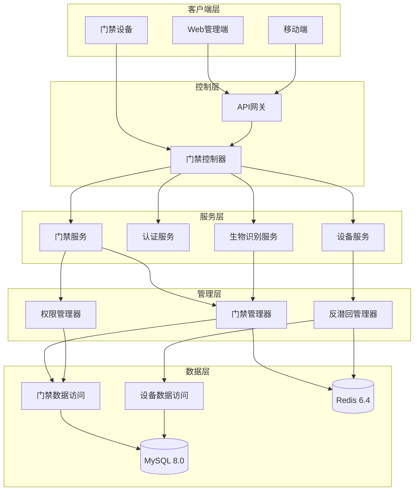
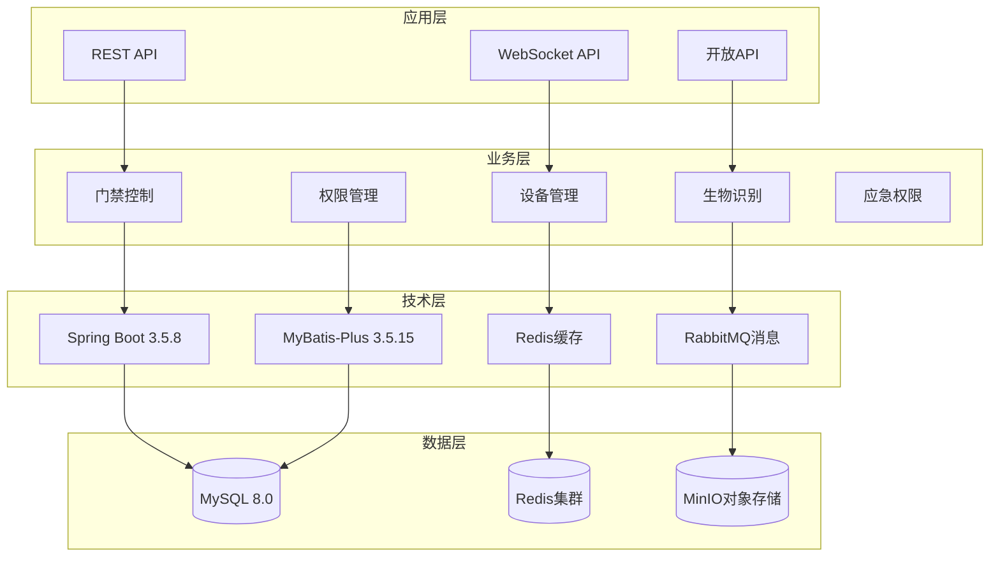
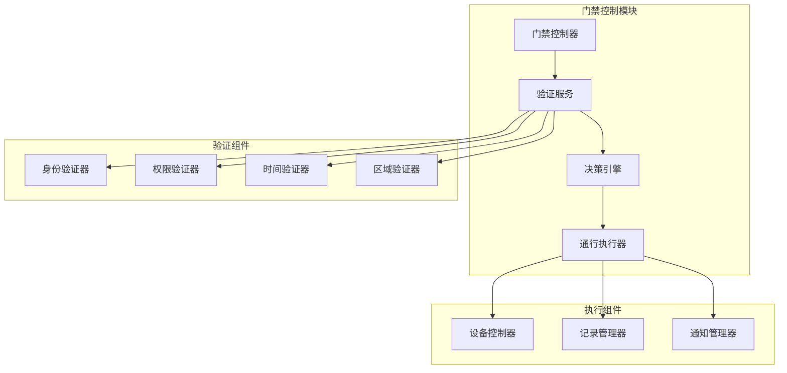
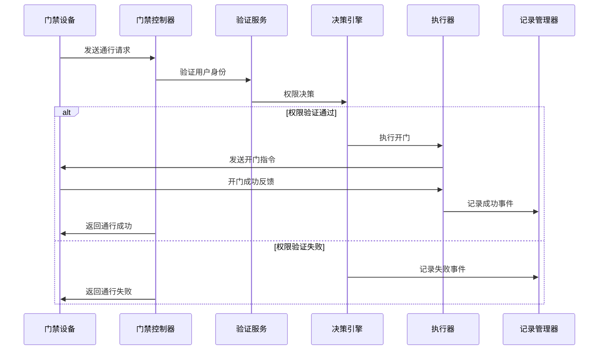
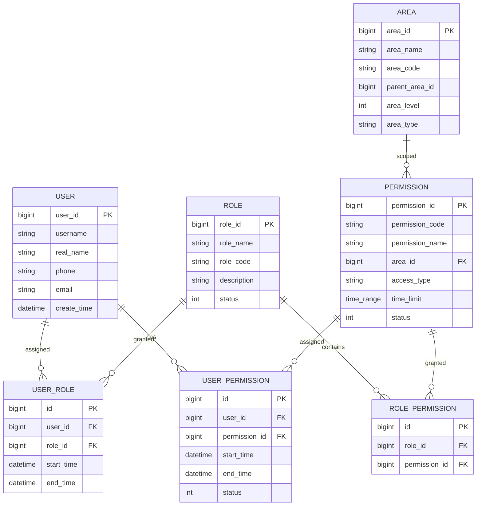
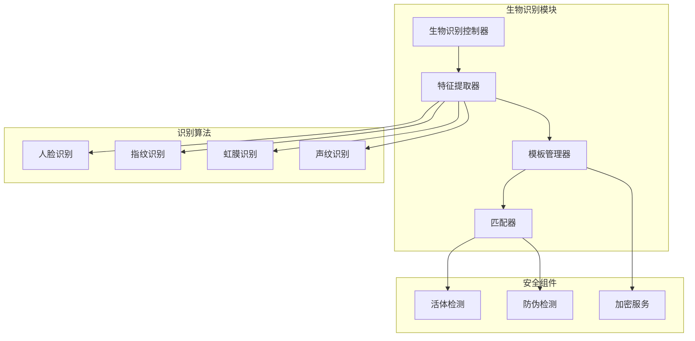
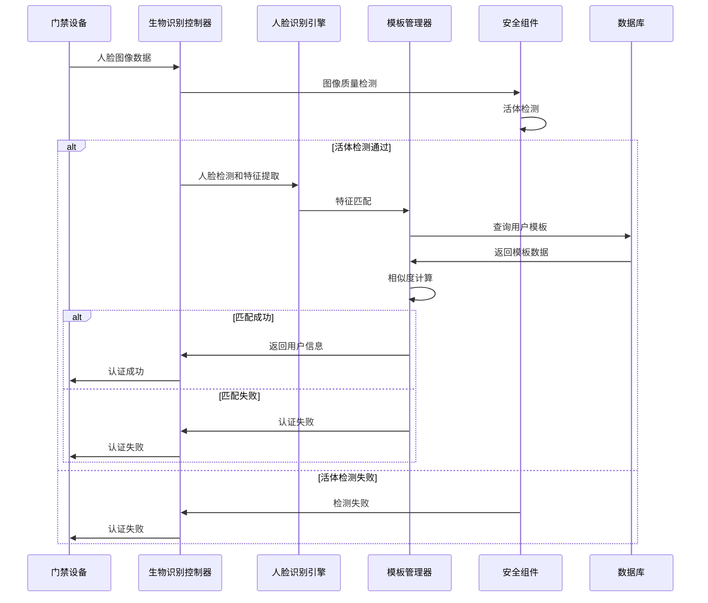
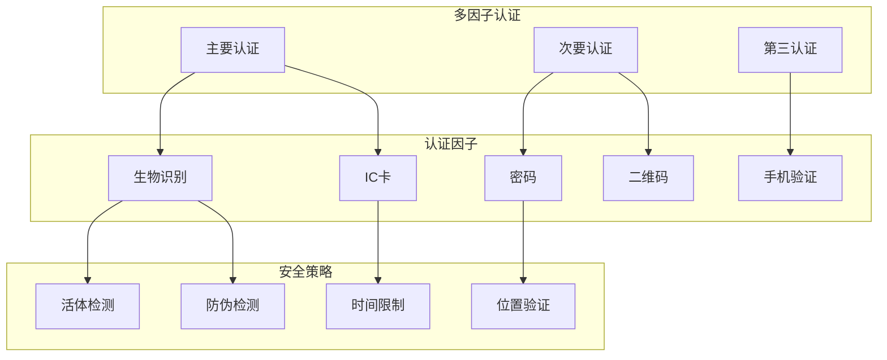
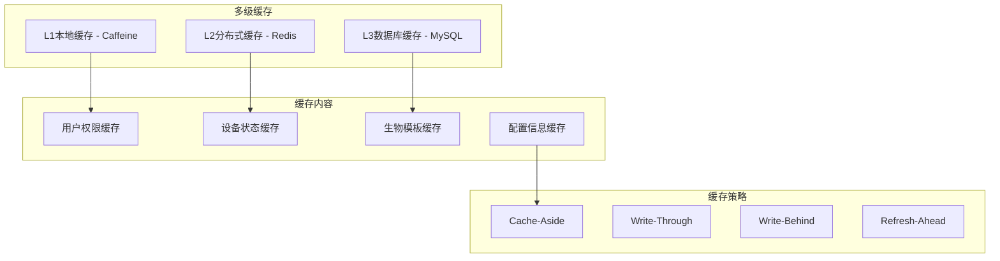

# 🚪 ioedream-access-service 门禁管理服务详细设计文档

> **📅 文档创建日期**: 2025-12-16
> **📋 文档版本**: v1.0.0
> **🎯 服务范围**: 门禁管理、通行控制、权限管理
> **✅ 文档状态**: 已完成
> **📦 服务端口**: 8090
> **🏗️ 技术栈**: Spring Boot 3.5.8 + MyBatis-Plus 3.5.15 + Redis 6.4.x

---

## 📋 服务概述

### 服务定位

ioedream-access-service 是 IOE-DREAM 智慧园区一卡通管理平台的核心门禁管理服务，负责：

- **门禁通行控制**: 实时验证和处理门禁通行请求
- **权限管理**: 用户门禁权限的申请、审批和管理
- **设备管理**: 门禁设备的连接、监控和配置
- **生物识别**: 人脸、指纹等生物特征验证
- **安全防护**: 反潜回、异常检测、应急权限
- **记录管理**: 门禁通行记录的存储和查询

### 核心价值

| 价值维度 | 具体实现 |
|---------|---------|
| **安全防护** | 多因子验证、反潜回、实时监控 |
| **便捷通行** | 无感识别、秒级通行、移动端开锁 |
| **权限精细** | 区域分级、时间控制、权限申请 |
| **数据智能** | 通行分析、异常预警、数据洞察 |

---

## 🏗️ 架构设计

### 系统架构图



### 技术架构



---

## 📊 数据库设计

### 核心表结构

#### 1. t_access_record (门禁记录表)

```sql
CREATE TABLE `t_access_record` (
    `record_id` BIGINT NOT NULL AUTO_INCREMENT COMMENT '记录ID（主键）',
    `user_id` BIGINT NOT NULL COMMENT '用户ID',
    `device_id` BIGINT NOT NULL COMMENT '设备ID',
    `area_id` BIGINT NOT NULL COMMENT '区域ID',
    `access_result` TINYINT NOT NULL DEFAULT 1 COMMENT '通行结果：1-成功 2-失败',
    `access_time` DATETIME NOT NULL COMMENT '通行时间',
    `access_type` VARCHAR(10) NOT NULL COMMENT '通行类型：IN-进入 OUT-离开',
    `verify_method` VARCHAR(20) NOT NULL COMMENT '验证方式：FACE-人脸 CARD-刷卡 FINGERPRINT-指纹 PASSWORD-密码 QR-CODE二维码',
    `photo_path` VARCHAR(500) DEFAULT NULL COMMENT '照片路径',
    `failure_reason` VARCHAR(200) DEFAULT NULL COMMENT '失败原因',
    `temperature` DECIMAL(4,1) DEFAULT NULL COMMENT '体温（摄氏度）',
    `mask_detected` TINYINT DEFAULT NULL COMMENT '口罩检测：0-未检测 1-未佩戴 2-已佩戴',
    `create_time` DATETIME NOT NULL DEFAULT CURRENT_TIMESTAMP COMMENT '创建时间',
    `update_time` DATETIME NOT NULL DEFAULT CURRENT_TIMESTAMP ON UPDATE CURRENT_TIMESTAMP COMMENT '更新时间',
    `create_user_id` BIGINT DEFAULT NULL COMMENT '创建人ID',
    `update_user_id` BIGINT DEFAULT NULL COMMENT '更新人ID',
    `deleted_flag` TINYINT NOT NULL DEFAULT 0 COMMENT '删除标记：0-未删除 1-已删除',
    PRIMARY KEY (`record_id`),
    KEY `idx_user_id` (`user_id`),
    KEY `idx_device_id` (`device_id`),
    KEY `idx_area_id` (`area_id`),
    KEY `idx_access_time` (`access_time`),
    KEY `idx_access_result` (`access_result`),
    KEY `idx_create_time` (`create_time`)
) ENGINE=InnoDB DEFAULT CHARSET=utf8mb4 COLLATE=utf8mb4_unicode_ci COMMENT='门禁记录表';
```

#### 2. access_permission_apply (门禁权限申请表)

```sql
CREATE TABLE `access_permission_apply` (
    `id` BIGINT NOT NULL COMMENT '权限申请ID（主键）',
    `apply_no` VARCHAR(32) NOT NULL COMMENT '申请编号（业务Key，唯一）',
    `applicant_id` BIGINT NOT NULL COMMENT '申请人ID',
    `applicant_name` VARCHAR(100) NOT NULL COMMENT '申请人姓名',
    `area_id` BIGINT NOT NULL COMMENT '区域ID',
    `area_name` VARCHAR(200) NOT NULL COMMENT '区域名称',
    `apply_type` VARCHAR(20) NOT NULL COMMENT '申请类型：NORMAL-普通权限 EMERGENCY-紧急权限 TEMPORARY-临时权限',
    `apply_reason` TEXT NOT NULL COMMENT '申请原因',
    `start_time` DATETIME NOT NULL COMMENT '申请开始时间',
    `end_time` DATETIME NOT NULL COMMENT '申请结束时间',
    `status` VARCHAR(20) NOT NULL DEFAULT 'PENDING' COMMENT '申请状态：PENDING-待审批 APPROVED-已通过 REJECTED-已驳回 CANCELLED-已取消',
    `approval_comment` TEXT DEFAULT NULL COMMENT '审批意见',
    `approval_time` DATETIME DEFAULT NULL COMMENT '审批时间',
    `workflow_instance_id` BIGINT DEFAULT NULL COMMENT '工作流实例ID',
    `remark` VARCHAR(500) DEFAULT NULL COMMENT '备注',
    `create_time` DATETIME NOT NULL DEFAULT CURRENT_TIMESTAMP COMMENT '创建时间',
    `update_time` DATETIME NOT NULL DEFAULT CURRENT_TIMESTAMP ON UPDATE CURRENT_TIMESTAMP COMMENT '更新时间',
    `create_user_id` BIGINT DEFAULT NULL COMMENT '创建人ID',
    `update_user_id` BIGINT DEFAULT NULL COMMENT '更新人ID',
    `deleted_flag` TINYINT NOT NULL DEFAULT 0 COMMENT '删除标记：0-未删除 1-已删除',
    PRIMARY KEY (`id`),
    UNIQUE KEY `uk_apply_no` (`apply_no`),
    KEY `idx_applicant_id` (`applicant_id`),
    KEY `idx_area_id` (`area_id`),
    KEY `idx_status` (`status`),
    KEY `idx_apply_type` (`apply_type`),
    KEY `idx_start_time` (`start_time`),
    KEY `idx_end_time` (`end_time`)
) ENGINE=InnoDB DEFAULT CHARSET=utf8mb4 COLLATE=utf8mb4_unicode_ci COMMENT='门禁权限申请表';
```

#### 3. t_biometric_auth_record (生物识别认证记录表)

```sql
CREATE TABLE `t_biometric_auth_record` (
    `record_id` BIGINT NOT NULL AUTO_INCREMENT COMMENT '记录ID（主键）',
    `user_id` BIGINT NOT NULL COMMENT '用户ID',
    `device_id` BIGINT NOT NULL COMMENT '设备ID',
    `biometric_type` VARCHAR(20) NOT NULL COMMENT '生物识别类型：FACE-人脸 FINGERPRINT-指纹 IRIS-虹膜 VOICE-声纹',
    `auth_result` TINYINT NOT NULL COMMENT '认证结果：1-成功 2-失败',
    `confidence_score` DECIMAL(5,2) DEFAULT NULL COMMENT '置信度分数（0.00-100.00）',
    `auth_time` DATETIME NOT NULL COMMENT '认证时间',
    `template_id` BIGINT DEFAULT NULL COMMENT '模板ID',
    `feature_data` LONGBLOB DEFAULT NULL COMMENT '特征数据（加密存储）',
    `failure_reason` VARCHAR(200) DEFAULT NULL COMMENT '失败原因',
    `liveness_result` TINYINT DEFAULT NULL COMMENT '活体检测结果：1-真人 2-攻击 3-不确定',
    `anti_spoofing_score` DECIMAL(5,2) DEFAULT NULL COMMENT '防伪分数',
    `create_time` DATETIME NOT NULL DEFAULT CURRENT_TIMESTAMP COMMENT '创建时间',
    `update_time` DATETIME NOT NULL DEFAULT CURRENT_TIMESTAMP ON UPDATE CURRENT_TIMESTAMP COMMENT '更新时间',
    PRIMARY KEY (`record_id`),
    KEY `idx_user_id` (`user_id`),
    KEY `idx_device_id` (`device_id`),
    KEY `idx_biometric_type` (`biometric_type`),
    KEY `idx_auth_time` (`auth_time`),
    KEY `idx_auth_result` (`auth_result`)
) ENGINE=InnoDB DEFAULT CHARSET=utf8mb4 COLLATE=utf8mb4_unicode_ci COMMENT='生物识别认证记录表';
```

#### 4. t_biometric_template (生物特征模板表)

```sql
CREATE TABLE `t_biometric_template` (
    `template_id` BIGINT NOT NULL AUTO_INCREMENT COMMENT '模板ID（主键）',
    `user_id` BIGINT NOT NULL COMMENT '用户ID',
    `biometric_type` VARCHAR(20) NOT NULL COMMENT '生物识别类型：FACE-人脸 FINGERPRINT-指纹 IRIS-虹膜',
    `template_data` LONGBLOB NOT NULL COMMENT '模板数据（加密存储）',
    `template_version` VARCHAR(20) NOT NULL COMMENT '模板版本',
    `quality_score` DECIMAL(5,2) DEFAULT NULL COMMENT '质量分数',
    `enroll_time` DATETIME NOT NULL COMMENT '注册时间',
    `expire_time` DATETIME DEFAULT NULL COMMENT '过期时间',
    `status` TINYINT NOT NULL DEFAULT 1 COMMENT '状态：1-启用 0-禁用',
    `device_id` BIGINT DEFAULT NULL COMMENT '注册设备ID',
    `create_time` DATETIME NOT NULL DEFAULT CURRENT_TIMESTAMP COMMENT '创建时间',
    `update_time` DATETIME NOT NULL DEFAULT CURRENT_TIMESTAMP ON UPDATE CURRENT_TIMESTAMP COMMENT '更新时间',
    PRIMARY KEY (`template_id`),
    UNIQUE KEY `uk_user_biometric` (`user_id`, `biometric_type`),
    KEY `idx_biometric_type` (`biometric_type`),
    KEY `idx_status` (`status`),
    KEY `idx_expire_time` (`expire_time`)
) ENGINE=InnoDB DEFAULT CHARSET=utf8mb4 COLLATE=utf8mb4_unicode_ci COMMENT='生物特征模板表';
```

### 数据库索引优化

#### 核心查询索引策略

```sql
-- 门禁记录查询优化
CREATE INDEX `idx_record_composite` ON `t_access_record`
(`user_id`, `access_time`, `access_result`, `device_id`);

-- 权限申请查询优化
CREATE INDEX `idx_apply_composite` ON `access_permission_apply`
(`applicant_id`, `status`, `apply_type`, `start_time`, `end_time`);

-- 生物识别查询优化
CREATE INDEX `idx_biometric_composite` ON `t_biometric_auth_record`
(`user_id`, `biometric_type`, `auth_time`, `auth_result`);

-- 设备状态监控优化
CREATE INDEX `idx_device_status_time` ON `t_device`
(`device_status`, `last_heartbeat_time`);
```

### 数据分区策略

```sql
-- 门禁记录按月分区
ALTER TABLE `t_access_record`
PARTITION BY RANGE (TO_DAYS(access_time)) (
    PARTITION p_202501 VALUES LESS THAN (TO_DAYS('2025-02-01')),
    PARTITION p_202502 VALUES LESS THAN (TO_DAYS('2025-03-01')),
    PARTITION p_202503 VALUES LESS THAN (TO_DAYS('2025-04-01')),
    -- ... 更多分区
    PARTITION p_max VALUES LESS THAN MAXVALUE
);

-- 生物识别记录按月分区
ALTER TABLE `t_biometric_auth_record`
PARTITION BY RANGE (TO_DAYS(auth_time)) (
    PARTITION p_202501 VALUES LESS THAN (TO_DAYS('2025-02-01')),
    PARTITION p_202502 VALUES LESS THAN (TO_DAYS('2025-03-01')),
    PARTITION p_202503 VALUES LESS THAN (TO_DAYS('2025-04-01')),
    -- ... 更多分区
    PARTITION p_max VALUES LESS THAN MAXVALUE
);
```

---

## 🔧 核心模块设计

### 1. 门禁控制模块 (AccessControl)

#### 1.1 模块架构



#### 1.2 核心接口设计

```java
/**
 * 门禁控制服务接口
 */
public interface AccessControlService {

    /**
     * 处理门禁通行请求
     * @param request 通行请求
     * @return 通行结果
     */
    AccessResponse processAccessRequest(AccessRequest request);

    /**
     * 验证用户通行权限
     * @param userId 用户ID
     * @param deviceId 设备ID
     * @param areaId 区域ID
     * @return 验证结果
     */
    ValidationResult validateAccessPermission(Long userId, Long deviceId, Long areaId);

    /**
     * 执行门禁开启操作
     * @param deviceId 设备ID
     * @param accessType 通行类型
     * @return 执行结果
     */
    ExecutionResult executeDoorOpen(Long deviceId, String accessType);

    /**
     * 记录门禁事件
     * @param event 门禁事件
     */
    void recordAccessEvent(AccessEvent event);
}
```

#### 1.3 业务流程



### 2. 权限管理模块 (PermissionManagement)

#### 2.1 权限模型设计



#### 2.2 权限验证算法

```java
/**
 * 权限验证服务
 */
@Service
public class PermissionValidationService {

    /**
     * 验证用户权限
     */
    public PermissionValidationResult validatePermission(
            Long userId,
            Long areaId,
            String accessType) {

        // 1. 获取用户基础权限
        List<UserPermission> userPermissions = getUserPermissions(userId);

        // 2. 获取角色权限
        List<RolePermission> rolePermissions = getRolePermissions(userId);

        // 3. 合并权限
        List<Permission> allPermissions = mergePermissions(userPermissions, rolePermissions);

        // 4. 权限过滤
        List<Permission> validPermissions = allPermissions.stream()
            .filter(p -> isValidPermission(p, areaId, accessType))
            .collect(Collectors.toList());

        // 5. 返回验证结果
        return buildValidationResult(validPermissions, areaId, accessType);
    }

    /**
     * 检查权限有效性
     */
    private boolean isValidPermission(Permission permission,
                                      Long areaId,
                                      String accessType) {
        return permission.getAreaId().equals(areaId)
            && permission.getAccessType().equals(accessType)
            && isWithinTimeRange(permission)
            && permission.getStatus() == PermissionStatus.ACTIVE;
    }
}
```

### 3. 生物识别模块 (BiometricAuthentication)

#### 3.1 生物识别架构



#### 3.2 人脸识别流程



### 4. 反潜回模块 (AntiPassback)

#### 4.1 反潜回策略

```java
/**
 * 反潜回管理器
 */
@Component
public class AntiPassbackManager {

    /**
     * 反潜回类型
     */
    public enum AntiPassbackType {
        HARD_ANTI_PASSBACK,    // 硬反潜回
        SOFT_ANTI_PASSBACK,    // 软反潜回
        AREA_ANTI_PASSBACK,    // 区域反潜回
        TIME_ANTI_PASSBACK     // 时间反潜回
    }

    /**
     * 检查反潜回
     */
    public AntiPassbackResult checkAntiPassback(
            Long userId,
            Long deviceId,
            String accessType) {

        // 1. 获取用户最后通行记录
        AccessRecord lastRecord = getLastAccessRecord(userId);

        if (lastRecord == null) {
            return AntiPassbackResult.success();
        }

        // 2. 检查硬反潜回
        if (checkHardAntiPassback(lastRecord, accessType)) {
            return AntiPassbackResult.violation("硬反潜回违规");
        }

        // 3. 检查软反潜回
        if (checkSoftAntiPassback(lastRecord, accessType)) {
            return AntiPassbackResult.warning("软反潜回提醒");
        }

        // 4. 检查区域反潜回
        if (checkAreaAntiPassback(userId, deviceId)) {
            return AntiPassbackResult.violation("区域反潜回违规");
        }

        // 5. 检查时间反潜回
        if (checkTimeAntiPassback(lastRecord)) {
            return AntiPassbackResult.violation("时间反潜回违规");
        }

        return AntiPassbackResult.success();
    }

    /**
     * 检查硬反潜回
     */
    private boolean checkHardAntiPassback(AccessRecord lastRecord, String currentType) {
        String lastType = lastRecord.getAccessType();

        // 如果上次是进入，当前不能是进入
        if ("IN".equals(lastType) && "IN".equals(currentType)) {
            return true;
        }

        // 如果上次是离开，当前不能是离开
        if ("OUT".equals(lastType) && "OUT".equals(currentType)) {
            return true;
        }

        return false;
    }
}
```

#### 4.2 反潜回配置

```java
/**
 * 反潜回配置实体
 */
@Data
@TableName("t_anti_passback_config")
public class AntiPassbackConfigEntity {

    @TableId(type = IdType.AUTO)
    private Long configId;

    private Long areaId;

    private Long deviceId;

    /**
     * 反潜回类型
     * HARD-硬反潜回
     * SOFT-软反潜回
     * AREA-区域反潜回
     * TIME-时间反潜回
     */
    private String antiPassbackType;

    /**
     * 是否启用
     */
    private Boolean enabled;

    /**
     * 时间阈值（秒）
     */
    private Integer timeThreshold;

    /**
     * 违规处理方式
     * BLOCK-阻止通行
     * WARN-警告提醒
     * LOG-仅记录日志
     */
    private String violationAction;
}
```

---

## 🌐 API接口设计

### RESTful API 规范

#### 1. 门禁通行接口

```yaml
# 门禁通行验证
POST /api/v1/access/verify
Content-Type: application/json

{
  "deviceId": 1001,
  "userId": 2001,
  "verifyMethod": "FACE",
  "accessType": "IN",
  "biometricData": "base64编码的生物特征数据",
  "timestamp": 1705123456789
}

# 响应示例
{
  "code": 200,
  "message": "success",
  "data": {
    "accessResult": "SUCCESS",
    "recordId": 3001,
    "userName": "张三",
    "areaName": "A栋1楼大厅",
    "accessTime": "2025-12-16 09:30:00",
    "doorOpenTime": 2.5,
    "confidenceScore": 98.5
  },
  "timestamp": 1705123456789
}
```

#### 2. 权限申请接口

```yaml
# 申请门禁权限
POST /api/v1/access/permission/apply
Content-Type: application/json

{
  "applicantId": 2001,
  "areaId": 1001,
  "applyType": "NORMAL",
  "applyReason": "日常办公通行需求",
  "startTime": "2025-12-16 09:00:00",
  "endTime": "2025-12-31 18:00:00"
}

# 响应示例
{
  "code": 200,
  "message": "申请提交成功",
  "data": {
    "applyNo": "AP2025121600001",
    "status": "PENDING",
    "workflowInstanceId": 5001
  }
}
```

#### 3. 设备管理接口

```yaml
# 查询设备状态
GET /api/v1/access/device/status?deviceIds=1001,1002,1003

# 响应示例
{
  "code": 200,
  "message": "success",
  "data": [
    {
      "deviceId": 1001,
      "deviceName": "A栋1楼门禁",
      "deviceStatus": "ONLINE",
      "lastHeartbeatTime": "2025-12-16 09:35:00",
      "batteryLevel": 95,
      "temperature": 25.5,
      "networkSignal": 4
    }
  ]
}
```

#### 4. 通行记录查询接口

```yaml
# 分页查询通行记录
GET /api/v1/access/record/query?pageNum=1&pageSize=20&userId=2001&startDate=2025-12-01&endDate=2025-12-31

# 响应示例
{
  "code": 200,
  "message": "success",
  "data": {
    "pageNum": 1,
    "pageSize": 20,
    "total": 156,
    "pages": 8,
    "list": [
      {
        "recordId": 3001,
        "userName": "张三",
        "deviceName": "A栋1楼门禁",
        "areaName": "A栋1楼大厅",
        "accessResult": "SUCCESS",
        "accessTime": "2025-12-16 09:30:00",
        "accessType": "IN",
        "verifyMethod": "FACE",
        "photoPath": "/access/photos/20251216/3001.jpg"
      }
    ]
  }
}
```

### WebSocket 实时接口

#### 设备心跳接口

```javascript
// WebSocket连接地址
ws://localhost:8090/ws/access/device/heartbeat

// 心跳消息格式
{
  "messageType": "HEARTBEAT",
  "deviceId": 1001,
  "timestamp": 1705123456789,
  "data": {
    "deviceStatus": "ONLINE",
    "batteryLevel": 95,
    "temperature": 25.5,
    "networkSignal": 4,
    "memoryUsage": 45.2,
    "cpuUsage": 12.8
  }
}
```

#### 实时通行事件推送

```javascript
// WebSocket连接地址
ws://localhost:8090/ws/access/events/subscribe

// 通行事件推送
{
  "messageType": "ACCESS_EVENT",
  "eventType": "ACCESS_SUCCESS",
  "timestamp": 1705123456789,
  "data": {
    "recordId": 3001,
    "userId": 2001,
    "userName": "张三",
    "deviceId": 1001,
    "deviceName": "A栋1楼门禁",
    "areaName": "A栋1楼大厅",
    "accessType": "IN",
    "verifyMethod": "FACE",
    "accessTime": "2025-12-16 09:30:00",
    "photoUrl": "/access/photos/20251216/3001.jpg"
  }
}
```

---

## 🔒 安全设计

### 1. 身份认证安全

#### 多因子认证流程



#### 生物识别安全

```java
/**
 * 生物识别安全服务
 */
@Service
public class BiometricSecurityService {

    /**
     * 生物识别安全验证
     */
    public SecurityValidationResult validateBiometricSecurity(
            BiometricData biometricData) {

        // 1. 图像质量检测
        ImageQualityResult qualityResult = checkImageQuality(biometricData.getImage());
        if (!qualityResult.isPass()) {
            return SecurityValidationResult.fail("图像质量不达标");
        }

        // 2. 活体检测
        LivenessResult livenessResult = performLivenessDetection(biometricData);
        if (livenessResult.isAttack()) {
            return SecurityValidationResult.fail("检测到攻击行为");
        }

        // 3. 防伪检测
        AntiSpoofingResult antiSpoofingResult = performAntiSpoofing(biometricData);
        if (antiSpoofingResult.isSpoof()) {
            return SecurityValidationResult.fail("检测到伪造行为");
        }

        // 4. 特征加密传输
        String encryptedFeatures = encryptFeatures(biometricData.getFeatures());

        return SecurityValidationResult.success(encryptedFeatures);
    }

    /**
     * 活体检测
     */
    private LivenessResult performLivenessDetection(BiometricData data) {
        // 多种活体检测算法
        boolean blink = detectBlink(data);
        boolean mouthMove = detectMouthMovement(data);
        boolean headPose = detectHeadPose(data);

        return LivenessResult.builder()
            .isLive(blink && mouthMove && headPose)
            .confidence(calculateLivenessConfidence(blink, mouthMove, headPose))
            .build();
    }
}
```

### 2. 数据传输安全

#### TLS 1.3 加密通信

```java
/**
 * 安全配置
 */
@Configuration
@EnableWebSecurity
public class SecurityConfiguration {

    @Bean
    public SecurityFilterChain securityFilterChain(HttpSecurity http) throws Exception {
        return http
            .csrf(csrf -> csrf.disable())
            .sessionManagement(session ->
                session.sessionCreationPolicy(SessionCreationPolicy.STATELESS))
            .authorizeHttpRequests(auth -> auth
                .requestMatchers("/api/v1/access/verify").permitAll()
                .requestMatchers("/ws/access/**").permitAll()
                .anyRequest().authenticated())
            .oauth2ResourceServer(oauth2 -> oauth2.jwt(jwt ->
                jwt.jwtDecoder(jwtDecoder())))
            .build();
    }

    @Bean
    public WebSocketConfigurer webSocketConfigurer() {
        return new WebSocketConfigurer() {
            @Override
            public void registerWebSocketHandlers(WebSocketHandlerRegistry registry) {
                registry.addHandler(new AccessWebSocketHandler(), "/ws/access/**")
                    .setAllowedOrigins("*")
                    .withSockJS();
            }
        };
    }
}
```

### 3. 数据存储安全

#### 敏感数据加密

```java
/**
 * 数据加密服务
 */
@Service
public class DataEncryptionService {

    @Value("${access.security.encryption.key}")
    private String encryptionKey;

    /**
     * 加密生物特征数据
     */
    public String encryptBiometricData(byte[] rawData) {
        try {
            // 使用AES-256-GCM加密
            Cipher cipher = Cipher.getInstance("AES/GCM/NoPadding");
            SecretKeySpec keySpec = new SecretKeySpec(encryptionKey.getBytes(), "AES");
            GCMParameterSpec gcmSpec = new GCMParameterSpec(128, generateIV());

            cipher.init(Cipher.ENCRYPT_MODE, keySpec, gcmSpec);
            byte[] encryptedData = cipher.doFinal(rawData);

            return Base64.getEncoder().encodeToString(encryptedData);
        } catch (Exception e) {
            throw new SecurityException("数据加密失败", e);
        }
    }

    /**
     * 解密生物特征数据
     */
    public byte[] decryptBiometricData(String encryptedData) {
        try {
            byte[] decodedData = Base64.getDecoder().decode(encryptedData);

            Cipher cipher = Cipher.getInstance("AES/GCM/NoPadding");
            SecretKeySpec keySpec = new SecretKeySpec(encryptionKey.getBytes(), "AES");
            GCMParameterSpec gcmSpec = new GCMParameterSpec(128, extractIV(decodedData));

            cipher.init(Cipher.DECRYPT_MODE, keySpec, gcmSpec);
            return cipher.doFinal(decodedData, 12, decodedData.length - 12);
        } catch (Exception e) {
            throw new SecurityException("数据解密失败", e);
        }
    }
}
```

---

## ⚡ 性能优化

### 1. 缓存策略

#### 多级缓存架构



#### 缓存配置实现

```java
/**
 * 缓存配置
 */
@Configuration
@EnableCaching
public class CacheConfiguration {

    @Bean
    @Primary
    public CacheManager cacheManager(RedisConnectionFactory connectionFactory) {
        // L1: Caffeine本地缓存
        CaffeineCacheManager localCacheManager = new CaffeineCacheManager();
        localCacheManager.setCaffeine(Caffeine.newBuilder()
            .maximumSize(10000)
            .expireAfterWrite(5, TimeUnit.MINUTES)
            .recordStats());

        // L2: Redis分布式缓存
        RedisCacheManager redisCacheManager = RedisCacheManager.builder(connectionFactory)
            .cacheDefaults(RedisCacheConfiguration.defaultCacheConfig()
                .entryTtl(Duration.ofMinutes(30))
                .serializeValuesWith(RedisSerializationContext.SerializationPair
                    .fromSerializer(new GenericJackson2JsonRedisSerializer())))
            .build();

        // 组合缓存管理器
        CompositeCacheManager compositeCacheManager = new CompositeCacheManager(
            localCacheManager, redisCacheManager);

        return compositeCacheManager;
    }

    @Bean
    public CacheKeyGenerator cacheKeyGenerator() {
        return (target, method, params) -> {
            StringBuilder sb = new StringBuilder();
            sb.append(target.getClass().getSimpleName()).append(".");
            sb.append(method.getName()).append(":");

            for (Object param : params) {
                if (param != null) {
                    sb.append(param.toString()).append(":");
                }
            }

            return sb.toString();
        };
    }
}
```

### 2. 数据库优化

#### 连接池优化配置

```yaml
spring:
  datasource:
    type: com.alibaba.druid.pool.DruidDataSource
    druid:
      # 基础连接池配置
      initial-size: 10
      min-idle: 10
      max-active: 50
      max-wait: 60000

      # 连接检测配置
      validation-query: SELECT 1
      test-while-idle: true
      test-on-borrow: false
      test-on-return: false

      # 连接泄漏检测
      remove-abandoned: true
      remove-abandoned-timeout: 300
      log-abandoned: true

      # 监控配置
      filters: stat,wall,log4j2
      web-stat-filter:
        enabled: true
        url-pattern: /*
      stat-view-servlet:
        enabled: true
        url-pattern: /druid/*
        reset-enable: false
```

#### SQL性能优化

```java
/**
 * 门禁记录批量操作优化
 */
@Service
public class AccessRecordBatchService {

    @Resource
    private AccessRecordDao accessRecordDao;

    /**
     * 批量插入门禁记录
     */
    @Transactional(rollbackFor = Exception.class)
    public void batchInsertAccessRecords(List<AccessRecordEntity> records) {
        if (records.isEmpty()) {
            return;
        }

        // 分批插入，每批1000条
        int batchSize = 1000;
        int totalSize = records.size();

        for (int i = 0; i < totalSize; i += batchSize) {
            int endIndex = Math.min(i + batchSize, totalSize);
            List<AccessRecordEntity> batchRecords = records.subList(i, endIndex);

            // 使用MyBatis-Plus批量插入
            accessRecordDao.insertBatch(batchRecords);
        }
    }

    /**
     * 高效分页查询
     */
    public PageResult<AccessRecordEntity> queryAccessRecordsOptimized(
            AccessRecordQueryForm queryForm) {

        // 1. 先查询ID范围
        Page<Long> idPage = accessRecordDao.selectRecordIdsPage(queryForm);

        if (idPage.getRecords().isEmpty()) {
            return PageResult.empty();
        }

        // 2. 根据ID范围查询完整记录
        List<AccessRecordEntity> records = accessRecordDao.selectBatchIds(
            idPage.getRecords());

        // 3. 构建分页结果
        return PageResult.<AccessRecordEntity>builder()
            .pageNum(queryForm.getPageNum())
            .pageSize(queryForm.getPageSize())
            .total(idPage.getTotal())
            .pages(idPage.getPages())
            .list(records)
            .build();
    }
}
```

### 3. 异步处理

#### 异步事件处理

```java
/**
 * 门禁事件异步处理器
 */
@Component
public class AccessEventAsyncProcessor {

    @Resource
    private TaskExecutor accessEventExecutor;

    @Resource
    private RabbitTemplate rabbitTemplate;

    /**
     * 异步处理门禁事件
     */
    @Async("accessEventExecutor")
    public void processAccessEventAsync(AccessEvent event) {
        try {
            // 1. 保存门禁记录
            saveAccessRecord(event);

            // 2. 发送实时通知
            sendRealTimeNotification(event);

            // 3. 更新用户状态
            updateUserAccessStatus(event);

            // 4. 触发数据分析
            triggerDataAnalysis(event);

        } catch (Exception e) {
            log.error("处理门禁事件失败", e);
            // 发送到死信队列
            sendToDeadLetterQueue(event, e);
        }
    }

    /**
     * 发送实时通知
     */
    private void sendRealTimeNotification(AccessEvent event) {
        rabbitTemplate.convertAndSend("access.event.exchange",
            "access.event.routing.key", event);
    }

    /**
     * 触发数据分析
     */
    private void triggerDataAnalysis(AccessEvent event) {
        rabbitTemplate.convertAndSend("access.analysis.exchange",
            "access.analysis.routing.key", event);
    }
}

/**
 * 线程池配置
 */
@Configuration
@EnableAsync
public class AsyncConfiguration {

    @Bean("accessEventExecutor")
    public TaskExecutor accessEventExecutor() {
        ThreadPoolTaskExecutor executor = new ThreadPoolTaskExecutor();
        executor.setCorePoolSize(10);
        executor.setMaxPoolSize(50);
        executor.setQueueCapacity(1000);
        executor.setThreadNamePrefix("access-event-");
        executor.setRejectedExecutionHandler(new ThreadPoolExecutor.CallerRunsPolicy());
        executor.initialize();
        return executor;
    }
}
```

---

## 📊 监控告警

### 1. 系统监控指标

#### 关键性能指标 (KPIs)

```java
/**
 * 门禁服务监控指标
 */
@Component
public class AccessServiceMetrics {

    private final MeterRegistry meterRegistry;
    private final Timer accessProcessTimer;
    private final Counter accessSuccessCounter;
    private final Counter accessFailureCounter;
    private final Gauge onlineDeviceGauge;

    public AccessServiceMetrics(MeterRegistry meterRegistry) {
        this.meterRegistry = meterRegistry;

        // 门禁处理耗时
        this.accessProcessTimer = Timer.builder("access.process.duration")
            .description("门禁处理耗时")
            .register(meterRegistry);

        // 门禁成功次数
        this.accessSuccessCounter = Counter.builder("access.success.count")
            .description("门禁成功次数")
            .register(meterRegistry);

        // 门禁失败次数
        this.accessFailureCounter = Counter.builder("access.failure.count")
            .description("门禁失败次数")
            .register(meterRegistry);

        // 在线设备数量
        this.onlineDeviceGauge = Gauge.builder("access.device.online.count")
            .description("在线设备数量")
            .register(meterRegistry, this, AccessServiceMetrics::getOnlineDeviceCount);
    }

    /**
     * 记录门禁处理耗时
     */
    public void recordAccessProcessTime(long duration) {
        accessProcessTimer.record(duration, TimeUnit.MILLISECONDS);
    }

    /**
     * 记录门禁成功
     */
    public void recordAccessSuccess() {
        accessSuccessCounter.increment();
    }

    /**
     * 记录门禁失败
     */
    public void recordAccessFailure(String reason) {
        accessFailureCounter.increment(Tags.of("reason", reason));
    }

    /**
     * 获取在线设备数量
     */
    private double getOnlineDeviceCount() {
        return deviceService.getOnlineDeviceCount();
    }
}
```

#### 健康检查

```java
/**
 * 门禁服务健康检查
 */
@Component
public class AccessServiceHealthIndicator implements HealthIndicator {

    @Resource
    private AccessDeviceService accessDeviceService;

    @Resource
    private RedisTemplate<String, Object> redisTemplate;

    @Override
    public Health health() {
        try {
            // 检查数据库连接
            checkDatabaseConnection();

            // 检查Redis连接
            checkRedisConnection();

            // 检查设备状态
            checkDeviceStatus();

            return Health.up()
                .withDetail("database", "UP")
                .withDetail("redis", "UP")
                .withDetail("devices", getDeviceHealth())
                .build();

        } catch (Exception e) {
            return Health.down()
                .withDetail("error", e.getMessage())
                .build();
        }
    }

    private void checkDatabaseConnection() {
        // 执行简单查询检查数据库连接
        accessDeviceService.count();
    }

    private void checkRedisConnection() {
        redisTemplate.opsForValue().set("health:check", "OK", Duration.ofSeconds(10));
    }

    private void checkDeviceStatus() {
        long onlineCount = accessDeviceService.getOnlineDeviceCount();
        if (onlineCount == 0) {
            throw new IllegalStateException("没有在线设备");
        }
    }
}
```

### 2. 告警规则

#### Prometheus 告警规则

```yaml
# prometheus.yml
groups:
  - name: access-service-alerts
    rules:
      # 门禁失败率告警
      - alert: AccessHighFailureRate
        expr: rate(access_failure_count[5m]) / rate(access_success_count[5m]) > 0.1
        for: 2m
        labels:
          severity: warning
        annotations:
          summary: "门禁失败率过高"
          description: "门禁失败率超过10%，当前值: {{ $value }}"

      # 门禁处理延迟告警
      - alert: AccessHighLatency
        expr: histogram_quantile(0.95, rate(access_process_duration_bucket[5m])) > 5000
        for: 1m
        labels:
          severity: critical
        annotations:
          summary: "门禁处理延迟过高"
          description: "95%门禁请求处理时间超过5秒，当前值: {{ $value }}ms"

      # 设备离线告警
      - alert: DeviceOffline
        expr: access_device_online_count < 10
        for: 1m
        labels:
          severity: critical
        annotations:
          summary: "门禁设备离线"
          description: "在线设备数量: {{ $value }}"

      # 内存使用率告警
      - alert: HighMemoryUsage
        expr: (jvm_memory_used_bytes / jvm_memory_max_bytes) > 0.8
        for: 5m
        labels:
          severity: warning
        annotations:
          summary: "内存使用率过高"
          description: "内存使用率: {{ $value }}%"
```

---

## 🚀 部署运维

### 1. Docker 容器化

#### Dockerfile

```dockerfile
FROM openjdk:17-jdk-slim

LABEL maintainer="IOE-DREAM Team"
LABEL version="1.0.0"
LABEL description="IOE-DREAM 门禁管理服务"

# 设置工作目录
WORKDIR /app

# 创建应用用户
RUN groupadd -r appuser && useradd -r -g appuser appuser

# 安装必要的工具
RUN apt-get update && apt-get install -y \
    curl \
    netcat \
    && rm -rf /var/lib/apt/lists/*

# 复制应用文件
COPY target/ioedream-access-service-*.jar app.jar
COPY docker/entrypoint.sh /entrypoint.sh

# 设置权限
RUN chown -R appuser:appuser /app
RUN chmod +x /entrypoint.sh

# 切换用户
USER appuser

# 健康检查
HEALTHCHECK --interval=30s --timeout=10s --start-period=60s --retries=3 \
    CMD curl -f http://localhost:8090/actuator/health || exit 1

# 暴露端口
EXPOSE 8090

# 启动应用
ENTRYPOINT ["/entrypoint.sh"]
CMD ["java", "-jar", "app.jar"]
```

#### 启动脚本

```bash
#!/bin/bash
# entrypoint.sh

set -e

# 等待依赖服务启动
wait_for_service() {
    local host=$1
    local port=$2
    local service=$3

    echo "等待 $service 服务启动..."
    while ! nc -z $host $port; do
        echo "$service 服务尚未就绪，等待1秒..."
        sleep 1
    done
    echo "$service 服务已就绪"
}

# 等待MySQL
wait_for_service ${DB_HOST:-mysql} ${DB_PORT:-3306} "MySQL"

# 等待Redis
wait_for_service ${REDIS_HOST:-redis} ${REDIS_PORT:-6379} "Redis"

# 设置JVM参数
JVM_OPTS="-Xms512m -Xmx2g"
JVM_OPTS="$JVM_OPTS -XX:+UseG1GC"
JVM_OPTS="$JVM_OPTS -XX:MaxGCPauseMillis=200"
JVM_OPTS="$JVM_OPTS -XX:+PrintGCDetails"
JVM_OPTS="$JVM_OPTS -XX:+PrintGCTimeStamps"
JVM_OPTS="$JVM_OPTS -XX:+HeapDumpOnOutOfMemoryError"
JVM_OPTS="$JVM_OPTS -XX:HeapDumpPath=/app/logs/"
JVM_OPTS="$JVM_OPTS -Dfile.encoding=UTF-8"
JVM_OPTS="$JVM_OPTS -Duser.timezone=Asia/Shanghai"

# 启动应用
exec java $JVM_OPTS -jar app.jar
```

#### Docker Compose

```yaml
# docker-compose.yml
version: '3.8'

services:
  ioedream-access-service:
    build:
      context: .
      dockerfile: Dockerfile
    container_name: ioedream-access-service
    ports:
      - "8090:8090"
    environment:
      - SPRING_PROFILES_ACTIVE=prod
      - DB_HOST=mysql
      - DB_PORT=3306
      - DB_NAME=ioedream_access
      - DB_USERNAME=root
      - DB_PASSWORD=${DB_PASSWORD}
      - REDIS_HOST=redis
      - REDIS_PORT=6379
      - REDIS_PASSWORD=${REDIS_PASSWORD}
      - NACOS_SERVER_ADDR=nacos:8848
    depends_on:
      - mysql
      - redis
      - nacos
    volumes:
      - ./logs:/app/logs
      - ./config:/app/config
    networks:
      - ioedream-network
    restart: unless-stopped
    healthcheck:
      test: ["CMD", "curl", "-f", "http://localhost:8090/actuator/health"]
      interval: 30s
      timeout: 10s
      retries: 3
      start_period: 60s

  mysql:
    image: mysql:8.0
    container_name: ioedream-mysql
    ports:
      - "3306:3306"
    environment:
      - MYSQL_ROOT_PASSWORD=${DB_PASSWORD}
      - MYSQL_DATABASE=ioedream_access
      - MYSQL_USER=ioedream
      - MYSQL_PASSWORD=${DB_PASSWORD}
    volumes:
      - mysql_data:/var/lib/mysql
      - ./sql:/docker-entrypoint-initdb.d
    networks:
      - ioedream-network
    restart: unless-stopped

  redis:
    image: redis:6.4-alpine
    container_name: ioedream-redis
    ports:
      - "6379:6379"
    command: redis-server --requirepass ${REDIS_PASSWORD}
    volumes:
      - redis_data:/data
    networks:
      - ioedream-network
    restart: unless-stopped

  nacos:
    image: nacos/nacos-server:v2.2.0
    container_name: ioedream-nacos
    ports:
      - "8848:8848"
    environment:
      - MODE=standalone
      - SPRING_DATASOURCE_PLATFORM=mysql
      - MYSQL_SERVICE_HOST=mysql
      - MYSQL_SERVICE_PORT=3306
      - MYSQL_SERVICE_DB_NAME=nacos
      - MYSQL_SERVICE_USER=root
      - MYSQL_SERVICE_PASSWORD=${DB_PASSWORD}
    depends_on:
      - mysql
    networks:
      - ioedream-network
    restart: unless-stopped

volumes:
  mysql_data:
  redis_data:

networks:
  ioedream-network:
    driver: bridge
```

### 2. Kubernetes 部署

#### Deployment 配置

```yaml
# k8s/deployment.yaml
apiVersion: apps/v1
kind: Deployment
metadata:
  name: ioedream-access-service
  namespace: ioedream
  labels:
    app: ioedream-access-service
    version: v1.0.0
spec:
  replicas: 3
  strategy:
    type: RollingUpdate
    rollingUpdate:
      maxSurge: 1
      maxUnavailable: 0
  selector:
    matchLabels:
      app: ioedream-access-service
  template:
    metadata:
      labels:
        app: ioedream-access-service
        version: v1.0.0
    spec:
      containers:
      - name: ioedream-access-service
        image: ioedream/access-service:1.0.0
        ports:
        - containerPort: 8090
          name: http
        env:
        - name: SPRING_PROFILES_ACTIVE
          value: "k8s"
        - name: DB_HOST
          valueFrom:
            secretKeyRef:
              name: ioedream-secrets
              key: db-host
        - name: DB_PASSWORD
          valueFrom:
            secretKeyRef:
              name: ioedream-secrets
              key: db-password
        - name: REDIS_HOST
          valueFrom:
            configMapKeyRef:
              name: ioedream-config
              key: redis-host
        - name: NACOS_SERVER_ADDR
          valueFrom:
            configMapKeyRef:
              name: ioedream-config
              key: nacos-server-addr
        resources:
          requests:
            memory: "512Mi"
            cpu: "250m"
          limits:
            memory: "2Gi"
            cpu: "1000m"
        livenessProbe:
          httpGet:
            path: /actuator/health
            port: 8090
          initialDelaySeconds: 60
          periodSeconds: 30
          timeoutSeconds: 10
          failureThreshold: 3
        readinessProbe:
          httpGet:
            path: /actuator/health/readiness
            port: 8090
          initialDelaySeconds: 30
          periodSeconds: 10
          timeoutSeconds: 5
          failureThreshold: 3
        volumeMounts:
        - name: config-volume
          mountPath: /app/config
        - name: logs-volume
          mountPath: /app/logs
      volumes:
      - name: config-volume
        configMap:
          name: ioedream-access-config
      - name: logs-volume
        emptyDir: {}
      imagePullSecrets:
      - name: ioedream-registry-secret
---
apiVersion: v1
kind: Service
metadata:
  name: ioedream-access-service
  namespace: ioedream
  labels:
    app: ioedream-access-service
spec:
  selector:
    app: ioedream-access-service
  ports:
  - name: http
    port: 8090
    targetPort: 8090
    protocol: TCP
  type: ClusterIP
---
apiVersion: autoscaling/v2
kind: HorizontalPodAutoscaler
metadata:
  name: ioedream-access-service-hpa
  namespace: ioedream
spec:
  scaleTargetRef:
    apiVersion: apps/v1
    kind: Deployment
    name: ioedream-access-service
  minReplicas: 2
  maxReplicas: 10
  metrics:
  - type: Resource
    resource:
      name: cpu
      target:
        type: Utilization
        averageUtilization: 70
  - type: Resource
    resource:
      name: memory
      target:
        type: Utilization
        averageUtilization: 80
```

---

## 📚 测试策略

### 1. 单元测试

#### 核心业务逻辑测试

```java
/**
 * 门禁控制服务测试
 */
@ExtendWith(MockitoExtension.class)
class AccessControlServiceTest {

    @Mock
    private PermissionValidationService permissionValidationService;

    @Mock
    private DeviceControlService deviceControlService;

    @Mock
    private AccessRecordService accessRecordService;

    @InjectMocks
    private AccessControlServiceImpl accessControlService;

    @Test
    @DisplayName("验证成功门禁通行")
    void testSuccessfulAccess() {
        // Given
        AccessRequest request = AccessRequest.builder()
            .userId(1001L)
            .deviceId(2001L)
            .areaId(3001L)
            .verifyMethod("FACE")
            .build();

        when(permissionValidationService.validatePermission(1001L, 2001L, 3001L))
            .thenReturn(ValidationResult.success());
        when(deviceControlService.openDoor(2001L))
            .thenReturn(ExecutionResult.success());

        // When
        AccessResponse response = accessControlService.processAccessRequest(request);

        // Then
        assertThat(response.getAccessResult()).isEqualTo("SUCCESS");
        assertThat(response.getUserName()).isNotNull();

        verify(permissionValidationService).validatePermission(1001L, 2001L, 3001L);
        verify(deviceControlService).openDoor(2001L);
        verify(accessRecordService).recordAccessEvent(any(AccessEvent.class));
    }

    @Test
    @DisplayName("验证权限拒绝的通行")
    void testAccessDenied() {
        // Given
        AccessRequest request = AccessRequest.builder()
            .userId(1001L)
            .deviceId(2001L)
            .areaId(3001L)
            .verifyMethod("FACE")
            .build();

        when(permissionValidationService.validatePermission(1001L, 2001L, 3001L))
            .thenReturn(ValidationResult.failure("无权限"));

        // When
        AccessResponse response = accessControlService.processAccessRequest(request);

        // Then
        assertThat(response.getAccessResult()).isEqualTo("DENIED");
        assertThat(response.getFailureReason()).isEqualTo("无权限");

        verify(permissionValidationService).validatePermission(1001L, 2001L, 3001L);
        verify(deviceControlService, never()).openDoor(any());
        verify(accessRecordService).recordAccessEvent(any(AccessEvent.class));
    }
}
```

### 2. 集成测试

#### API接口集成测试

```java
/**
 * 门禁API集成测试
 */
@SpringBootTest(webEnvironment = SpringBootTest.WebEnvironment.RANDOM_PORT)
@TestPropertySource(locations = "classpath:application-test.yml")
@Transactional
class AccessControllerIntegrationTest {

    @Autowired
    private TestRestTemplate restTemplate;

    @Autowired
    private AccessRecordDao accessRecordDao;

    @Test
    @DisplayName("门禁验证API测试")
    void testAccessVerificationAPI() {
        // Given
        AccessVerificationRequest request = AccessVerificationRequest.builder()
            .userId(1001L)
            .deviceId(2001L)
            .verifyMethod("FACE")
            .build();

        // When
        ResponseEntity<AccessVerificationResponse> response = restTemplate.postForEntity(
            "/api/v1/access/verify", request, AccessVerificationResponse.class);

        // Then
        assertThat(response.getStatusCode()).isEqualTo(HttpStatus.OK);
        assertThat(response.getBody().getCode()).isEqualTo(200);
        assertThat(response.getBody().getData().getAccessResult()).isNotNull();

        // 验证数据库记录
        List<AccessRecordEntity> records = accessRecordDao.selectList(null);
        assertThat(records).hasSize(1);
        assertThat(records.get(0).getUserId()).isEqualTo(1001L);
        assertThat(records.get(0).getDeviceId()).isEqualTo(2001L);
    }
}
```

### 3. 性能测试

#### JMeter 性能测试脚本

```xml
<!-- AccessPerformanceTest.jmx -->
<?xml version="1.0" encoding="UTF-8"?>
<jmeterTestPlan version="1.2" properties="5.0" jmeter="5.5">
  <hashTree>
    <TestPlan guiclass="TestPlanGui" testclass="TestPlan" testname="门禁服务性能测试">
      <elementProp name="TestPlan.arguments">
        <collectionProp name="Arguments.arguments">
          <elementProp name="HOST" elementType="Argument" testname="HOST">
            <stringProp name="Argument.value">localhost</stringProp>
          </elementProp>
          <elementProp name="PORT" elementType="Argument" testname="PORT">
            <stringProp name="Argument.value">8090</stringProp>
          </elementProp>
        </collectionProp>
      </elementProp>

      <ThreadGroup guiclass="ThreadGroupGui" testclass="ThreadGroup" testname="门禁验证并发测试">
        <stringProp name="ThreadGroup.num_threads">100</stringProp>
        <stringProp name="ThreadGroup.ramp_time">10</stringProp>
        <boolProp name="ThreadGroup.scheduler">false</boolProp>
        <stringProp name="ThreadGroup.duration">60</stringProp>
        <stringProp name="ThreadGroup.delay"></stringProp>

        <HTTPSamplerProxy guiclass="HttpTestSampleGui" testclass="HTTPSamplerProxy" testname="门禁验证请求">
          <elementProp name="HTTPsampler.Arguments" elementType="Arguments">
            <collectionProp name="Arguments.arguments">
              <elementProp name="" elementType="HTTPArgument">
                <boolProp name="HTTPArgument.always_encode">false</boolProp>
                <stringProp name="Argument.value">{}</stringProp>
                <stringProp name="Argument.metadata">=</stringProp>
              </elementProp>
            </collectionProp>
          </elementProp>
          <stringProp name="HTTPSampler.domain">${HOST}</stringProp>
          <stringProp name="HTTPSampler.port">${PORT}</stringProp>
          <stringProp name="HTTPSampler.path">/api/v1/access/verify</stringProp>
          <stringProp name="HTTPSampler.method">POST</stringProp>
          <boolProp name="HTTPSampler.follow_redirects">true</boolProp>
          <boolProp name="HTTPSampler.auto_redirects">false</boolProp>
          <boolProp name="HTTPSampler.use_keepalive">true</boolProp>
          <boolProp name="HTTPSampler.DO_MULTIPART_POST">false</boolProp>
          <stringProp name="HTTPSampler.embedded_url_re"></stringProp>
          <stringProp name="HTTPSampler.connect_timeout">60000</stringProp>
          <stringProp name="HTTPSampler.response_timeout">60000</stringProp>
        </HTTPSamplerProxy>

        <ResponseAssertion guiclass="AssertionGui" testclass="ResponseAssertion" testname="响应状态检查">
          <collectionProp name="Asserion.test_strings">
            <stringProp name="49586">200</stringProp>
          </collectionProp>
          <stringProp name="Assertion.custom_message"></stringProp>
          <boolProp name="Assertion.assume_success">false</boolProp>
          <intProp name="Assertion.test_type">1</intProp>
          <boolProp name="Assertion.assume_success_if_zero">false</boolProp>
        </ResponseAssertion>
      </ThreadGroup>

      <ResultCollector guiclass="ViewResultsFullVisualizer" testclass="ResultCollector" testname="察看结果树"/>
      <ResultCollector guiclass="SummaryReport" testclass="ResultCollector" testname="汇总报告"/>

    </hashTree>
  </hashTree>
</jmeterTestPlan>
```

---

## 📖 附录

### 1. 错误码定义

| 错误码 | 错误描述 | 解决方案 |
|-------|---------|---------|
| ACCESS_001 | 用户不存在 | 检查用户ID是否正确 |
| ACCESS_002 | 设备离线 | 检查设备网络连接 |
| ACCESS_003 | 权限不足 | 申请相应权限或联系管理员 |
| ACCESS_004 | 生物识别失败 | 重新进行生物识别或使用其他验证方式 |
| ACCESS_005 | 反潜回违规 | 等待合理时间间隔后再次尝试 |
| ACCESS_006 | 时间限制 | 检查权限时间范围 |
| ACCESS_007 | 区域限制 | 确认是否有该区域权限 |
| ACCESS_008 | 设备故障 | 联系运维人员处理设备 |
| ACCESS_009 | 系统繁忙 | 稍后重试或联系技术支持 |
| ACCESS_010 | 数据异常 | 检查数据完整性或重新同步 |

### 2. 配置参数说明

```yaml
# application.yml
access:
  # 门禁控制配置
  control:
    max-failures: 3                    # 最大失败次数
    lock-duration: 300                 # 锁定时长(秒)
    process-timeout: 5000              # 处理超时时间(毫秒)

  # 生物识别配置
  biometric:
    face:
      confidence-threshold: 0.85      # 人脸识别置信度阈值
      liveness-threshold: 0.80        # 活体检测阈值
      template-expire-days: 90        # 模板过期天数
    fingerprint:
      match-threshold: 0.90           # 指纹匹配阈值
      quality-threshold: 0.75          # 指纹质量阈值

  # 反潜回配置
  anti-passback:
    enabled: true                      # 是否启用反潜回
    type: HARD                        # 反潜回类型: HARD/SOFT
    time-threshold: 30                # 时间阈值(秒)

  # 缓存配置
  cache:
    user-permission-ttl: 300          # 用户权限缓存时间(秒)
    device-status-ttl: 60              # 设备状态缓存时间(秒)
    biometric-template-ttl: 1800       # 生物模板缓存时间(秒)

  # 安全配置
  security:
    encryption-key: ${ACCESS_ENCRYPTION_KEY}
    token-expire-minutes: 30
    max-attempts: 5
    lockout-minutes: 15
```

### 3. API限流配置

```java
/**
 * API限流配置
 */
@Configuration
public class RateLimitConfiguration {

    @Bean
    public FilterRegistrationBean<RateLimitFilter> rateLimitFilter() {
        FilterRegistrationBean<RateLimitFilter> registration = new FilterRegistrationBean<>();
        registration.setFilter(new RateLimitFilter());
        registration.addUrlPatterns("/api/v1/access/*");
        registration.setName("rateLimitFilter");
        registration.setOrder(1);
        return registration;
    }

    @Bean
    public RedisRateLimiter redisRateLimiter() {
        return RedisRateLimiter.create(
            RedisRateLimiter.ConfigBuilder
                .newBuilder()
                .limitForKey("access:verify")
                .rate(100, Duration.ofMinutes(1))    // 每分钟100次
                .rate(1000, Duration.ofHours(1))   // 每小时1000次
                .build()
        );
    }
}
```

---

**📞 技术支持**
**🏗️ 开发团队**: IOE-DREAM 门禁服务开发组
**✅ 文档状态**: 已完成，持续维护
**⏰ 最后更新**: 2025-12-16
**📧 联系邮箱**: access-service@ioe-dream.com