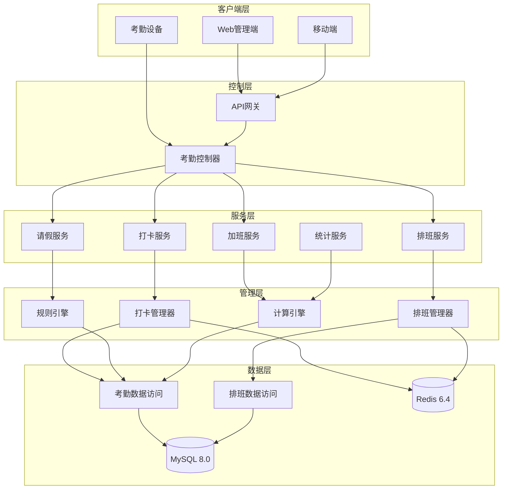
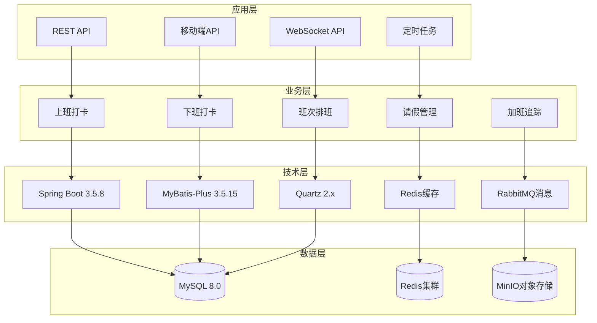
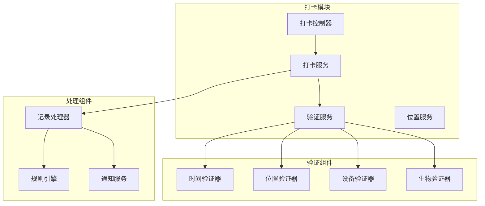
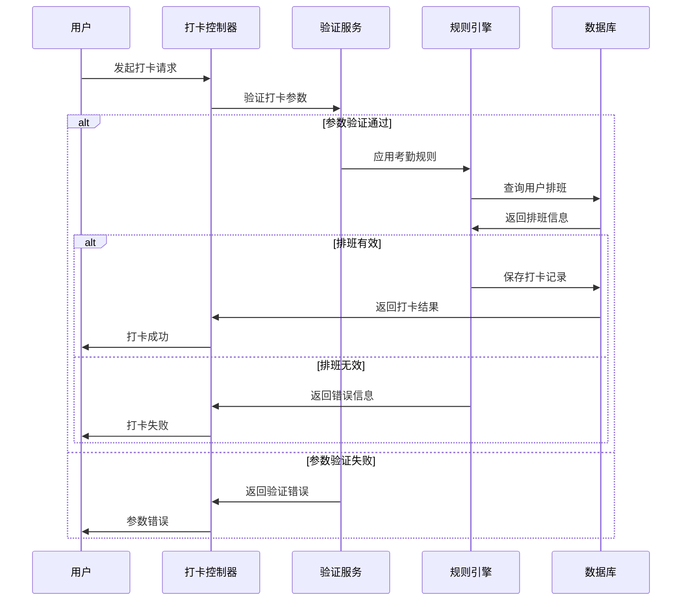
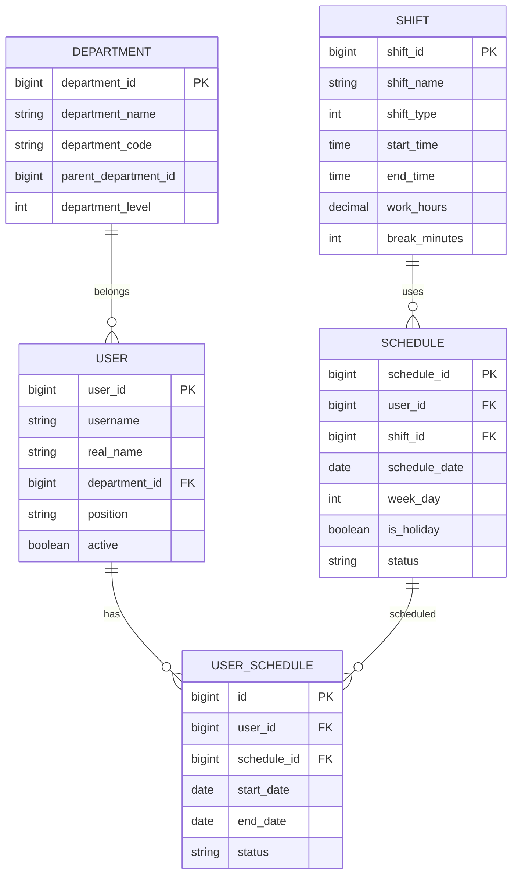
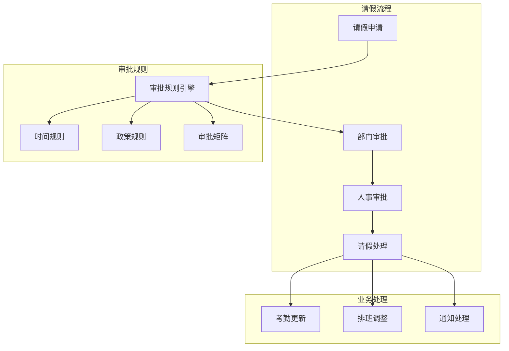

# ⏰ ioedream-attendance-service 考勤管理服务详细设计文档

> **📅 文档创建日期**: 2025-12-16
> **📋 文档版本**: v1.0.0
> **🎯 服务范围**: 考勤打卡、排班管理、统计分析
> **✅ 文档状态**: 已完成
> **📦 服务端口**: 8091
> **🏗️ 技术栈**: Spring Boot 3.5.8 + MyBatis-Plus 3.5.15 + Quartz 2.x

---

## 📋 服务概述

### 服务定位

ioedream-attendance-service 是 IOE-DREAM 智慧园区一卡通管理平台的核心考勤管理服务，负责：

- **考勤打卡**: 上班/下班打卡记录和验证
- **排班管理**: 班次配置、员工排班、日程管理
- **请假管理**: 请假申请、审批流程、假勤统计
- **加班管理**: 加班申请、审批、加班费计算
- **统计分析**: 考勤数据统计、报表生成、异常分析
- **考勤规则**: 迟到早退计算、缺勤统计、合规检查

### 核心价值

| 价值维度 | 具体实现 |
|---------|---------|
| **自动化管理** | 自动打卡记录、智能排班、自动统计 |
| **精确统计** | 实时考勤数据、准确工时计算、异常预警 |
| **流程优化** | 在线申请审批、移动端打卡、电子签名 |
| **数据分析** | 考勤趋势分析、效率评估、决策支持 |

---

## 🏗️ 架构设计

### 系统架构图



### 技术架构



---

## 📊 数据库设计

### 核心表结构

#### 1. t_attendance_record (考勤记录表)

```sql
CREATE TABLE `t_attendance_record` (
    `record_id` BIGINT NOT NULL AUTO_INCREMENT COMMENT '考勤记录ID（主键）',
    `user_id` BIGINT NOT NULL COMMENT '用户ID',
    `user_name` VARCHAR(100) NOT NULL COMMENT '用户姓名',
    `department_id` BIGINT NOT NULL COMMENT '部门ID',
    `department_name` VARCHAR(200) NOT NULL COMMENT '部门名称',
    `shift_id` BIGINT DEFAULT NULL COMMENT '班次ID',
    `shift_name` VARCHAR(100) DEFAULT NULL COMMENT '班次名称',
    `attendance_date` DATE NOT NULL COMMENT '考勤日期',
    `punch_time` DATETIME NOT NULL COMMENT '打卡时间',
    `attendance_status` VARCHAR(20) NOT NULL COMMENT '考勤状态：NORMAL-正常 LATE-迟到 EARLY-早退 ABSENT-缺勤 OVERTIME-加班',
    `attendance_type` VARCHAR(20) NOT NULL COMMENT '考勤类型：CHECK_IN-上班打卡 CHECK_OUT-下班打卡',
    `longitude` DECIMAL(10,6) DEFAULT NULL COMMENT '打卡位置（经度）',
    `latitude` DECIMAL(10,6) DEFAULT NULL COMMENT '打卡位置（纬度）',
    `punch_address` VARCHAR(500) DEFAULT NULL COMMENT '打卡地址',
    `device_id` BIGINT DEFAULT NULL COMMENT '打卡设备ID',
    `device_name` VARCHAR(200) DEFAULT NULL COMMENT '打卡设备名称',
    `work_hours` DECIMAL(4,2) DEFAULT NULL COMMENT '工作时长（小时）',
    `late_minutes` INT DEFAULT 0 COMMENT '迟到时长（分钟）',
    `early_leave_minutes` INT DEFAULT 0 COMMENT '早退时长（分钟）',
    `overtime_minutes` INT DEFAULT 0 COMMENT '加班时长（分钟）',
    `photo_url` VARCHAR(500) DEFAULT NULL COMMENT '打卡照片URL',
    `remark` VARCHAR(500) DEFAULT NULL COMMENT '备注',
    `create_time` DATETIME NOT NULL DEFAULT CURRENT_TIMESTAMP COMMENT '创建时间',
    `update_time` DATETIME NOT NULL DEFAULT CURRENT_TIMESTAMP ON UPDATE CURRENT_TIMESTAMP COMMENT '更新时间',
    `create_user_id` BIGINT DEFAULT NULL COMMENT '创建人ID',
    `update_user_id` BIGINT DEFAULT NULL COMMENT '更新人ID',
    `deleted_flag` TINYINT NOT NULL DEFAULT 0 COMMENT '删除标记：0-未删除 1-已删除',
    PRIMARY KEY (`record_id`),
    KEY `idx_user_id` (`user_id`),
    KEY `idx_department_id` (`department_id`),
    KEY `idx_shift_id` (`shift_id`),
    KEY `idx_attendance_date` (`attendance_date`),
    KEY `idx_punch_time` (`punch_time`),
    KEY `idx_attendance_status` (`attendance_status`),
    KEY `idx_attendance_type` (`attendance_type`),
    KEY `idx_user_date` (`user_id`, `attendance_date`)
) ENGINE=InnoDB DEFAULT CHARSET=utf8mb4 COLLATE=utf8mb4_unicode_ci COMMENT='考勤记录表';
```

#### 2. t_attendance_work_shift (班次配置表)

```sql
CREATE TABLE `t_attendance_work_shift` (
    `shift_id` BIGINT NOT NULL AUTO_INCREMENT COMMENT '班次ID（主键）',
    `shift_name` VARCHAR(100) NOT NULL COMMENT '班次名称',
    `shift_type` INT NOT NULL COMMENT '班次类型：1-白班 2-夜班 3-轮班 4-弹性班 5-兼职班 6-特殊班',
    `start_time` TIME NOT NULL COMMENT '开始时间',
    `end_time` TIME NOT NULL COMMENT '结束时间',
    `work_hours` DECIMAL(4,2) NOT NULL COMMENT '工作时长（小时）',
    `break_minutes` INT DEFAULT 60 COMMENT '休息时长（分钟）',
    `break_start_time` TIME DEFAULT NULL COMMENT '休息开始时间',
    `break_end_time` TIME DEFAULT NULL COMMENT '休息结束时间',
    `is_overnight` BOOLEAN DEFAULT FALSE COMMENT '是否跨天',
    `is_flexible` BOOLEAN DEFAULT FALSE COMMENT '是否弹性时间',
    `flexible_start_time` INT DEFAULT 0 COMMENT '弹性开始时间（分钟）',
    `flexible_end_time` INT DEFAULT 0 COMMENT '弹性结束时间（分钟）',
    `overtime_start_time` TIME DEFAULT NULL COMMENT '加班计算开始时间',
    `min_overtime_minutes` INT DEFAULT 30 COMMENT '最小加班时长（分钟）',
    `color_code` VARCHAR(20) DEFAULT NULL COMMENT '颜色标识',
    `sort_order` INT DEFAULT 0 COMMENT '排序号',
    `remarks` VARCHAR(500) DEFAULT NULL COMMENT '备注',
    `create_time` DATETIME NOT NULL DEFAULT CURRENT_TIMESTAMP COMMENT '创建时间',
    `update_time` DATETIME NOT NULL DEFAULT CURRENT_TIMESTAMP ON UPDATE CURRENT_TIMESTAMP COMMENT '更新时间',
    `create_user_id` BIGINT DEFAULT NULL COMMENT '创建人ID',
    `update_user_id` BIGINT DEFAULT NULL COMMENT '更新人ID',
    `deleted_flag` TINYINT NOT NULL DEFAULT 0 COMMENT '删除标记：0-未删除 1-已删除',
    PRIMARY KEY (`shift_id`),
    KEY `idx_shift_type` (`shift_type`),
    KEY `idx_sort_order` (`sort_order`)
) ENGINE=InnoDB DEFAULT CHARSET=utf8mb4 COLLATE=utf8mb4_unicode_ci COMMENT='班次配置表';
```

#### 3. t_attendance_leave (请假记录表)

```sql
CREATE TABLE `t_attendance_leave` (
    `leave_id` BIGINT NOT NULL AUTO_INCREMENT COMMENT '请假ID（主键）',
    `leave_no` VARCHAR(32) NOT NULL COMMENT '请假编号',
    `user_id` BIGINT NOT NULL COMMENT '用户ID',
    `user_name` VARCHAR(100) NOT NULL COMMENT '用户姓名',
    `department_id` BIGINT NOT NULL COMMENT '部门ID',
    `department_name` VARCHAR(200) NOT NULL COMMENT '部门名称',
    `leave_type` VARCHAR(20) NOT NULL COMMENT '请假类型：SICK-病假 PERSONAL-事年 MATERNITY-产婚 MARRIAGE-婚假 COMPASSIONATE-丧假 VACATION-年假',
    `start_date` DATE NOT NULL COMMENT '请假开始日期',
    `end_date` DATE NOT NULL COMMENT '请假结束日期',
    `start_time` TIME DEFAULT NULL COMMENT '请假开始时间',
    `end_time` TIME DEFAULT NULL COMMENT '请假结束时间',
    `total_days` DECIMAL(4,2) NOT NULL COMMENT '请假天数',
    `total_hours` DECIMAL(4,2) DEFAULT NULL COMMENT '请假小时数',
    `reason` TEXT NOT NULL COMMENT '请假原因',
    `attachment_url` VARCHAR(500) DEFAULT NULL COMMENT '附件URL',
    `status` VARCHAR(20) NOT NULL DEFAULT 'PENDING' COMMENT '状态：PENDING-待审批 APPROVED-已批准 REJECTED-已驳回 CANCELLED-已取消',
    `approver_id` BIGINT DEFAULT NULL COMMENT '审批人ID',
    `approver_name` VARCHAR(100) DEFAULT NULL COMMENT '审批人姓名',
    `approve_time` DATETIME DEFAULT NULL COMMENT '审批时间',
    `approve_comment` TEXT DEFAULT NULL COMMENT '审批意见',
    `reject_reason` VARCHAR(500) DEFAULT NULL COMMENT '驳回原因',
    `workflow_instance_id` BIGINT DEFAULT NULL COMMENT '工作流实例ID',
    `create_time` DATETIME NOT NULL DEFAULT CURRENT_TIMESTAMP COMMENT '创建时间',
    `update_time` DATETIME NOT NULL DEFAULT CURRENT_TIMESTAMP ON UPDATE CURRENT_TIMESTAMP COMMENT '更新时间',
    `create_user_id` BIGINT DEFAULT NULL COMMENT '创建人ID',
    `update_user_id` BIGINT DEFAULT NULL COMMENT '更新人ID',
    `deleted_flag` TINYINT NOT NULL DEFAULT 0 COMMENT '删除标记：0-未删除 1-已删除',
    PRIMARY KEY (`leave_id`),
    UNIQUE KEY `uk_leave_no` (`leave_no`),
    KEY `idx_user_id` (`user_id`),
    KEY `idx_department_id` (`department_id`),
    KEY `idx_leave_type` (`leave_type`),
    KEY `idx_start_date` (`start_date`),
    KEY `idx_end_date` (`end_date`),
    KEY `idx_status` (`status`),
    KEY `idx_user_date_range` (`user_id`, `start_date`, `end_date`)
) ENGINE=InnoDB DEFAULT CHARSET=utf8mb4 COLLATE=utf8mb4_unicode_ci COMMENT='请假记录表';
```

#### 4. t_attendance_overtime (加班记录表)

```sql
CREATE TABLE `t_attendance_overtime` (
    `overtime_id` BIGINT NOT NULL AUTO_INCREMENT COMMENT '加班ID（主键）',
    `overtime_no` VARCHAR(32) NOT NULL COMMENT '加班编号',
    `user_id` BIGINT NOT NULL COMMENT '用户ID',
    `user_name` VARCHAR(100) NOT NULL COMMENT '用户姓名',
    `department_id` BIGINT NOT NULL COMMENT '部门ID',
    `department_name` VARCHAR(200) NOT NULL COMMENT '部门名称',
    `overtime_date` DATE NOT NULL COMMENT '加班日期',
    `start_time` TIME NOT NULL COMMENT '加班开始时间',
    `end_time` TIME NOT NULL COMMENT '加班结束时间',
    `actual_hours` DECIMAL(4,2) NOT NULL COMMENT '实际加班时长（小时）',
    `planned_hours` DECIMAL(4,2) DEFAULT NULL COMMENT '计划加班时长（小时）',
    `overtime_type` VARCHAR(20) NOT NULL COMMENT '加班类型：WEEKDAY-工作日加班 WEEKEND-周末加班 HOLIDAY-法定节假日',
    `reason` TEXT NOT NULL COMMENT '加班原因',
    `status` VARCHAR(20) NOT NULL DEFAULT 'PENDING' COMMENT '状态：PENDING-待审批 APPROVED-已批准 REJECTED-已驳回 CANCELLED-已取消 COMPLETED-已完成',
    `approver_id` BIGINT DEFAULT NULL COMMENT '审批人ID',
    `approver_name` VARCHAR(100) DEFAULT NULL COMMENT '审批人姓名',
    `approve_time` DATETIME DEFAULT NULL COMMENT '审批时间',
    `approve_comment` TEXT DEFAULT NULL COMMENT '审批意见',
    `reject_reason` VARCHAR(500) DEFAULT NULL COMMENT '驳回原因',
    `workflow_instance_id` BIGINT DEFAULT NULL COMMENT '工作流实例ID',
    `is_paid` BOOLEAN DEFAULT TRUE COMMENT '是否带薪',
    `pay_rate` DECIMAL(4,2) DEFAULT 1.00 COMMENT '加班费率',
    `amount` DECIMAL(10,2) DEFAULT NULL COMMENT '加班费金额',
    `create_time` DATETIME NOT NULL DEFAULT CURRENT_TIMESTAMP COMMENT '创建时间',
    `update_time` DATETIME NOT NULL DEFAULT CURRENT_TIMESTAMP ON UPDATE CURRENT_TIMESTAMP COMMENT '更新时间',
    `create_user_id` BIGINT DEFAULT NULL COMMENT '创建人ID',
    `update_user_id` BIGINT DEFAULT NULL COMMENT '更新人ID',
    `deleted_flag` TINYINT NOT NULL DEFAULT 0 COMMENT '删除标记：0-未删除 1-已删除',
    PRIMARY KEY (`overtime_id`),
    UNIQUE KEY `uk_overtime_no` (`overtime_no`),
    KEY `idx_user_id` (`user_id`),
    KEY `idx_department_id` (`department_id`),
    KEY `idx_overtime_date` (`overtime_date`),
    KEY `idx_overtime_type` (`overtime_type`),
    KEY `idx_status` (`status`),
    KEY `idx_user_date` (`user_id`, `overtime_date`)
) ENGINE=InnoDB DEFAULT CHARSET=utf8mb4 COLLATE=utf8mb4_unicode_ci COMMENT='加班记录表';
```

#### 5. t_attendance_schedule (排班记录表)

```sql
CREATE TABLE `t_attendance_schedule` (
    `schedule_id` BIGINT NOT NULL AUTO_INCREMENT COMMENT '排班ID（主键）',
    `user_id` BIGINT NOT NULL COMMENT '用户ID',
    `user_name` VARCHAR(100) NOT NULL COMMENT '用户姓名',
    `department_id` BIGINT NOT NULL COMMENT '部门ID',
    `department_name` VARCHAR(200) NOT NULL COMMENT '部门名称',
    `shift_id` BIGINT NOT NULL COMMENT '班次ID',
    `shift_name` VARCHAR(100) NOT NULL COMMENT '班次名称',
    `schedule_date` DATE NOT NULL COMMENT '排班日期',
    `week_day` TINYINT NOT NULL COMMENT '星期几：1-周一 2-周二 3-周三 4-周四 5-周五 6-周六 7-周日',
    `is_holiday` BOOLEAN DEFAULT FALSE COMMENT '是否节假日',
    `is_temporary` BOOLEAN DEFAULT FALSE COMMENT '是否临时排班',
    `status` VARCHAR(20) NOT NULL DEFAULT 'ACTIVE' COMMENT '状态：ACTIVE-有效 INACTIVE-无效',
    `effective_time` DATETIME DEFAULT NULL COMMENT '生效时间',
    `expire_time` DATETIME DEFAULT NULL COMMENT '失效时间',
    `remark` VARCHAR(500) DEFAULT NULL COMMENT '备注',
    `create_time` DATETIME NOT NULL DEFAULT CURRENT_TIMESTAMP COMMENT '创建时间',
    `update_time` DATETIME NOT NULL DEFAULT CURRENT_TIMESTAMP ON UPDATE CURRENT_TIMESTAMP COMMENT '更新时间',
    `create_user_id` BIGINT DEFAULT NULL COMMENT '创建人ID',
    `update_user_id` BIGINT DEFAULT NULL COMMENT '更新人ID',
    `deleted_flag` TINYINT NOT NULL DEFAULT 0 COMMENT '删除标记：0-未删除 1-已删除',
    PRIMARY KEY (`schedule_id`),
    UNIQUE KEY `uk_user_date` (`user_id`, `schedule_date`),
    KEY `idx_shift_id` (`shift_id`),
    KEY `idx_schedule_date` (`schedule_date`),
    KEY `idx_week_day` (`week_day`),
    KEY `idx_status` (`status`),
    KEY `idx_user_date_range` (`user_id`, `schedule_date`)
) ENGINE=InnoDB DEFAULT CHARSET=utf8mb4 COLLATE=utf8mb4_unicode_ci COMMENT='排班记录表';
```

### 数据库索引优化

#### 核心查询索引策略

```sql
-- 考勤记录查询优化
CREATE INDEX `idx_record_composite` ON `t_attendance_record`
(`user_id`, `attendance_date`, `attendance_status`, `punch_time`);

-- 用户考勤统计优化
CREATE INDEX `idx_record_stats` ON `t_attendance_record`
(`user_id`, `attendance_date`, `attendance_type`, `department_id`);

-- 请假查询优化
CREATE INDEX `idx_leave_composite` ON `t_attendance_leave`
(`user_id`, `start_date`, `end_date`, `status`);

-- 加班查询优化
CREATE INDEX `idx_overtime_composite` ON `t_attendance_overtime`
(`user_id`, `overtime_date`, `overtime_type`, `status`);

-- 排班查询优化
CREATE INDEX `idx_schedule_composite` ON `t_attendance_schedule`
(`user_id`, `schedule_date`, `shift_id`, `status`);
```

### 数据分区策略

```sql
-- 考勤记录按月分区
ALTER TABLE `t_attendance_record`
PARTITION BY RANGE (TO_DAYS(attendance_date)) (
    PARTITION p_202501 VALUES LESS THAN (TO_DAYS('2025-02-01')),
    PARTITION p_202502 VALUES LESS THAN (TO_DAYS('2025-03-01')),
    PARTITION p_202503 VALUES LESS THAN (TO_DAYS('2025-04-01')),
    -- ... 更多分区
    PARTITION p_max VALUES LESS THAN MAXVALUE
);

-- 请假记录按月分区
ALTER TABLE `t_attendance_leave`
PARTITION BY RANGE (TO_DAYS(start_date)) (
    PARTITION p_202501 VALUES LESS THAN (TO_DAYS('2025-02-01')),
    PARTITION p_202502 VALUES LESS THAN (TO_DAYS('2025-03-01')),
    PARTITION p_202503 VALUES LESS THAN (TO_DAYS('2025-04-01')),
    -- ... 更多分区
    PARTITION p_max VALUES LESS THAN MAXVALUE
);
```

---

## 🔧 核心模块设计

### 1. 打卡模块 (ClockIn/Out)

#### 1.1 模块架构



#### 1.2 核心接口设计

```java
/**
 * 打卡服务接口
 */
public interface ClockService {

    /**
     * 上班打卡
     * @param request 打卡请求
     * @return 打卡结果
     */
    ClockResponse clockIn(ClockRequest request);

    /**
     * 下班打卡
     * @param request 打卡请求
     * @return 打卡结果
     */
    ClockResponse clockOut(ClockRequest request);

    /**
     * 获取今日打卡记录
     * @param userId 用户ID
     * @param date 考勤日期
     * @return 打卡记录
     */
    List<AttendanceRecordEntity> getTodayRecords(Long userId, LocalDate date);

    /**
     * 检查打卡状态
     * @param userId 用户ID
     * @param date 考勤日期
     * @return 打卡状态
     */
    ClockStatus getClockStatus(Long userId, LocalDate date);
}
```

#### 1.3 打卡业务流程



### 2. 排班模块 (Scheduling)

#### 2.1 排班模型设计



#### 2.2 排班算法实现

```java
/**
 * 排班服务实现
 */
@Service
public class ScheduleServiceImpl implements ScheduleService {

    @Resource
    private ScheduleDao scheduleDao;

    @Resource
    private WorkShiftDao workShiftDao;

    @Resource
    private HolidayDao holidayDao;

    /**
     * 自动排班
     */
    @Transactional(rollbackFor = Exception.class)
    public void autoSchedule(Long userId, LocalDate startDate, LocalDate endDate) {
        // 1. 获取用户班次偏好
        List<UserShiftPreference> preferences = getUserShiftPreferences(userId);

        // 2. 生成排班日期范围
        List<LocalDate> scheduleDates = generateScheduleDates(startDate, endDate);

        // 3. 检查节假日
        Set<LocalDate> holidays = getHolidays(scheduleDates);

        // 4. 为每个日期生成排班
        List<ScheduleRecordEntity> schedules = new ArrayList<>();
        for (LocalDate date : scheduleDates) {
            ScheduleRecordEntity schedule = generateSchedule(userId, date, preferences, holidays);
            schedules.add(schedule);
        }

        // 5. 保存排班记录
        scheduleDao.insertBatch(schedules);

        // 6. 发送排班通知
        sendScheduleNotification(userId, schedules);
    }

    /**
     * 生成单日排班
     */
    private ScheduleRecordEntity generateSchedule(Long userId, LocalDate date,
                                                   List<UserShiftPreference> preferences,
                                                   Set<LocalDate> holidays) {
        // 检查是否为节假日
        boolean isHoliday = holidays.contains(date);
        int weekDay = date.getDayOfWeek().getValue();

        // 根据规则选择班次
        WorkShiftEntity shift = selectShiftByRules(preferences, weekDay, isHoliday);

        return ScheduleRecordEntity.builder()
            .userId(userId)
            .shiftId(shift.getShiftId())
            .shiftName(shift.getShiftName())
            .scheduleDate(date)
            .weekDay(weekDay)
            .isHoliday(isHoliday)
            .isTemporary(false)
            .status("ACTIVE")
            .build();
    }
}
```

### 3. 请假模块 (LeaveManagement)

#### 3.1 请假流程设计



#### 3.2 请假接口实现

```java
/**
 * 请假服务接口
 */
public interface LeaveService {

    /**
     * 提交请假申请
     * @param request 请假请求
     * @return 申请结果
     */
    LeaveResponse submitLeaveApplication(LeaveRequest request);

    /**
     * 审批请假申请
     * @param leaveId 请假ID
     * @param decision 审批决定
     * @return 审批结果
     */
    LeaveResponse approveLeaveApplication(Long leaveId, ApprovalDecision decision);

    /**
     * 撤销请假申请
     * @param leaveId 请假ID
     * @param reason 撤销原因
     * @return 撤销结果
     */
    LeaveResponse cancelLeaveApplication(Long leaveId, String reason);

    /**
     * 查询请假记录
     * @param queryForm 查询表单
     * @return 请假记录
     */
    PageResult<LeaveRecordEntity> queryLeaveRecords(LeaveQueryForm queryForm);
}
```

### 4. 加班模块 (OvertimeManagement)

#### 4.1 加班计算规则

```java
/**
 * 加班计算服务
 */
@Service
public class OvertimeCalculationService {

    /**
     * 计算加班时长
     */
    public OvertimeCalculationResult calculateOvertime(
            OvertimeRecordEntity overtimeRecord) {

        LocalDate date = overtimeRecord.getOvertimeDate();
        LocalTime startTime = overtimeRecord.getStartTime();
        LocalTime endTime = overtimeRecord.getEndTime();

        // 1. 获取该日标准班次
        WorkShiftEntity standardShift = getStandardShift(date);

        // 2. 判断加班类型
        OvertimeType overtimeType = determineOvertimeType(date, startTime, endTime, standardShift);

        // 3. 计算加班时长
        Duration overtimeDuration = calculateOvertimeDuration(startTime, endTime, standardShift);

        // 4. 应用加班规则
        overtimeDuration = applyOvertimeRules(overtimeDuration, overtimeType);

        // 5. 计算加班费
        BigDecimal overtimeAmount = calculateOvertimeAmount(overtimeDuration, overtimeType);

        return OvertimeCalculationResult.builder()
            .overtimeType(overtimeType)
            .duration(overtimeDuration)
            .amount(overtimeAmount)
            .build();
    }

    /**
     * 应用加班规则
     */
    private Duration applyOvertimeRules(Duration duration, OvertimeType type) {
        // 最小加班单位：30分钟
        long minutes = duration.toMinutes();
        if (minutes < 30) {
            return Duration.ZERO;
        }

        // 向上取整到30分钟
        minutes = (minutes + 29) / 30 * 30;
        return Duration.ofMinutes(minutes);
    }
}
```

---

## 🌐 API接口设计

### RESTful API 规范

#### 1. 打卡接口

```yaml
# 上班打卡
POST /api/v1/attendance/clock/in
Content-Type: application/json

{
  "userId": 2001,
  "deviceId": 3001,
  "location": {
    "longitude": 116.397128,
    "latitude": 39.916527,
    "address": "北京市朝阳区建国路88号"
  },
  "photo": "base64编码的照片数据",
  "timestamp": 1705123456789
}

# 响应示例
{
  "code": 200,
  "message": "打卡成功",
  "data": {
    "recordId": 4001,
    "punchTime": "2025-12-16 09:00:00",
    "shiftName": "正常班",
    "workStartTime": "09:00:00",
    "status": "NORMAL",
    "lateMinutes": 0
  },
  "timestamp": 1705123456789
}
```

#### 2. 请假申请接口

```yaml
# 提交请假申请
POST /api/v1/attendance/leave/apply
Content-Type: application/json

{
  "leaveType": "PERSONAL",
  "startDate": "2025-12-20",
  "endDate": "2025-12-22",
  "startTime": "09:00",
  "endTime": "18:00",
  "reason": "家中有事需要请假",
  "attachmentUrl": "/files/leave/attachment.pdf"
}

# 响应示例
{
  "code": 200,
  "message": "申请提交成功",
  "data": {
    "leaveId": 5001,
    "leaveNo": "LV2025121600001",
    "status": "PENDING",
    "workflowInstanceId": 6001
  }
}
```

#### 3. 排班查询接口

```yaml
# 查询个人排班
GET /api/v1/attendance/schedule/personal?userId=2001&startDate=2025-12-01&endDate=2025-12-31

# 响应示例
{
  "code": 200,
  "message": "success",
  "data": {
    "schedules": [
      {
        "scheduleId": 3001,
        "userId": 2001,
        "userName": "张三",
        "shiftId": 1001,
        "shiftName": "正常班",
        "scheduleDate": "2025-12-16",
        "weekDay": 1,
        "isHoliday": false,
        "startTime": "09:00",
        "endTime": "18:00",
        "workHours": 8.0,
        "status": "ACTIVE"
      }
    ]
  }
}
```

#### 4. 考勤统计接口

```yaml
# 考勤统计查询
GET /api/v1/attendance/statistics/user?userId=2001&startDate=2025-12-01&endDate=2025-12-31

# 响应示例
{
  "code": 200,
  "message": "success",
  "data": {
    "userId": 2001,
    "userName": "张三",
    "statistics": {
      "totalDays": 22,
      "workDays": 20,
      "leaveDays": 2,
      "attendanceDays": 20,
      "lateCount": 1,
      "earlyLeaveCount": 0,
      "absentCount": 0,
      "normalCount": 19,
      "averageWorkHours": 8.5,
      "totalOvertimeHours": 12.5,
      "attendanceRate": 100.0
    }
  }
}
```

### WebSocket 实时接口

#### 打卡实时推送

```javascript
// WebSocket连接地址
ws://localhost:8091/ws/attendance/clock/events

// 打卡事件推送
{
  "messageType": "CLOCK_EVENT",
  "eventType": "CLOCK_IN",
  "timestamp": 1705123456789,
  "data": {
    "recordId": 4001,
    "userId": 2001,
    "userName": "张三",
    "departmentName": "技术部",
    "clockTime": "2025-12-16 09:00:00",
    "clockType": "CLOCK_IN",
    "location": {
      "address": "北京市朝阳区建国路88号",
      "longitude": 116.397128,
      "latitude": 39.916527
    },
    "photoUrl": "/attendance/photos/20251216/4001.jpg"
  }
}
```

---

## ⏰ 定时任务设计

### 1. 考勤统计任务

```java
/**
 * 考勤统计定时任务
 */
@Component
public class AttendanceStatisticsJob {

    @Resource
    private StatisticsService statisticsService;

    /**
     * 每日考勤统计
     */
    @Scheduled(cron = "0 0 1 * * ?")
    public void dailyStatistics() {
        LocalDate yesterday = LocalDate.now().minusDays(1);
        log.info("开始执行每日考勤统计任务，日期: {}", yesterday);

        try {
            statisticsService.generateDailyStatistics(yesterday);
            log.info("每日考勤统计任务执行完成");
        } catch (Exception e) {
            log.error("每日考勤统计任务执行失败", e);
        }
    }

    /**
     * 每月考勤统计
     */
    @Scheduled(cron = "0 30 1 1 * ?")
    public void monthlyStatistics() {
        LocalDate lastMonth = LocalDate.now().minusMonths(1).withDayOfMonth(1);
        log.info("开始执行每月考勤统计任务，月份: {}", lastMonth);

        try {
            statisticsService.generateMonthlyStatistics(lastMonth);
            log.info("每月考勤统计任务执行完成");
        } catch (Exception e) {
            log.error("每月考勤统计任务执行失败", e);
        }
    }
}
```

### 2. 数据清理任务

```java
/**
 * 数据清理定时任务
 */
@Component
public class DataCleanupJob {

    @Resource
    private AttendanceRecordDao attendanceRecordDao;

    /**
     * 清理过期数据
     */
    @Scheduled(cron = "0 0 2 * * ?")
    public void cleanupExpiredData() {
        // 保留2年数据
        LocalDate expireDate = LocalDate.now().minusYears(2);
        log.info("开始清理过期考勤数据，日期: {}", expireDate);

        try {
            int deletedCount = attendanceRecordDao.deleteByDateBefore(expireDate);
            log.info("清理过期考勤数据完成，删除记录数: {}", deletedCount);
        } catch (Exception e) {
            log.error("清理过期考勤数据失败", e);
        }
    }
}
```

### 3. 排班提醒任务

```java
/**
     * 排班提醒定时任务
     */
    @Scheduled(cron = "0 30 8 * * ?")
    public void scheduleReminder() {
        LocalDate tomorrow = LocalDate.now().plusDays(1);
        log.info("开始执行排班提醒任务，日期: {}", tomorrow);

        try {
            // 获取明天有排班的用户
            List<ScheduleRecordEntity> schedules = scheduleService
                .getSchedulesByDate(tomorrow);

            // 发送提醒通知
            for (ScheduleRecordEntity schedule : schedules) {
                UserEntity user = userService.getById(schedule.getUserId());
                if (user != null) {
                    sendScheduleReminder(user, schedule);
                }
            }

            log.info("排班提醒任务执行完成，提醒用户数: {}", schedules.size());
        } catch (Exception e) {
            log.error("排班提醒任务执行失败", e);
        }
    }
}
```

---

## 🔒 安全设计

### 1. 打卡安全验证

#### 位置验证

```java
/**
 * 位置验证服务
 */
@Service
public class LocationValidationService {

    @Resource
    private GeoLocationService geoLocationService;

    /**
     * 验证打卡位置
     */
    public LocationValidationResult validateClockLocation(
            Long userId,
            LocationData locationData) {

        // 1. 获取用户常用打卡地点
        List<UserLocation> userLocations = getUserLocations(userId);

        if (userLocations.isEmpty()) {
            return LocationValidationResult.warning("未设置常用打卡地点");
        }

        // 2. 计算与常用地点的距离
        for (UserLocation userLocation : userLocations) {
            double distance = calculateDistance(
                locationData.getLatitude(), locationData.getLongitude(),
                userLocation.getLatitude(), userLocation.getLongitude());

            // 3. 判断是否在允许范围内（默认500米）
            if (distance <= userLocation.getAllowedRadius()) {
                return LocationValidationResult.success();
            }
        }

        return LocationValidationResult.fail("不在允许的打卡范围内");
    }

    /**
     * 计算两点距离
     */
    private double calculateDistance(double lat1, double lon1, double lat2, double lon2) {
        double earthRadius = 6371000; // 地球半径（米）
        double dLat = Math.toRadians(lat2 - lat1);
        double dLon = Math.toRadians(lon2 - lon1);

        double a = Math.sin(dLat / 2) * Math.sin(dLat / 2)
                + Math.cos(Math.toRadians(lat1)) * Math.cos(Math.toRadians(lat2))
                * Math.sin(dLon / 2) * Math.sin(dLon / 2);

        double c = 2 * Math.atan2(Math.sqrt(a), Math.sqrt(1 - a));
        return earthRadius * c;
    }
}
```

#### 设备验证

```java
/**
 * 设备验证服务
 */
@Service
public class DeviceValidationService {

    @Resource
    private AccessDeviceService accessDeviceService;

    /**
     * 验证打卡设备
     */
    public DeviceValidationResult validateClockDevice(
            Long deviceId,
            String deviceFingerprint) {

        // 1. 检查设备是否存在
        AccessDeviceEntity device = accessDeviceService.getById(deviceId);
        if (device == null) {
            return DeviceValidationResult.fail("设备不存在");
        }

        // 2. 检查设备状态
        if (!"ONLINE".equals(device.getDeviceStatus())) {
            return DeviceValidationResult.fail("设备离线");
        }

        // 3. 验证设备指纹
        if (StringUtils.isNotBlank(deviceFingerprint)
                && !deviceFingerprint.equals(device.getFingerprint())) {
            return DeviceValidationResult.fail("设备指纹不匹配");
        }

        // 4. 检查设备权限
        if (!"ALLOWED".equals(device.getAccessPermission())) {
            return DeviceValidationResult.fail("设备无打卡权限");
        }

        return DeviceValidationResult.success();
    }
}
```

### 2. 数据安全

#### 敏感数据脱敏

```java
/**
 * 考勤数据脱敏服务
 */
@Service
public class AttendanceDataMaskingService {

    /**
     * 脱敏用户信息
     */
    public AttendanceRecordVO maskUserSensitiveData(AttendanceRecordEntity record) {
        AttendanceRecordVO vo = new AttendanceRecordVO();

        // 基本信息保持不变
        vo.setRecordId(record.getRecordId());
        vo.setAttendanceDate(record.getAttendanceDate());
        vo.setPunchTime(record.getPunchTime());
        vo.setAttendanceStatus(record.getAttendanceStatus());

        // 敏感信息脱敏
        vo.setUserName(maskName(record.getUserName()));
        vo.setDepartmentName(maskDepartment(record.getDepartmentName()));
        vo.setPunchAddress(maskAddress(record.getPunchAddress()));
        vo.setDeviceName(maskDeviceName(record.getDeviceName()));

        return vo;
    }

    /**
     * 姓名脱敏
     */
    private String maskName(String name) {
        if (StringUtils.isBlank(name) || name.length() <= 2) {
            return "*";
        }

        return name.charAt(0) + "*".repeat(name.length() - 2) + name.charAt(name.length() - 1);
    }

    /**
     * 地址脱敏
     */
    private String maskAddress(String address) {
        if (StringUtils.isBlank(address)) {
            return "";
        }

        // 保留前6个字符和后6个字符
        if (address.length() <= 12) {
            return "*".repeat(address.length());
        }

        return address.substring(0, 6) + "***" + address.substring(address.length() - 6);
    }
}
```

---

## ⚡ 性能优化

### 1. 批量操作优化

#### 批量打卡记录处理

```java
/**
 * 批量打卡处理服务
 */
@Service
public class BatchClockProcessor {

    @Resource
    private AttendanceRecordDao attendanceRecordDao;

    @Resource
    private TaskExecutor batchExecutor;

    /**
     * 批量处理打卡记录
     */
    @Async("batchExecutor")
    public CompletableFuture<BatchProcessResult> processBatchClockRecords(
            List<AttendanceRecordEntity> records) {

        return CompletableFuture.supplyAsync(() -> {
            try {
                // 分批处理，每批1000条
                int batchSize = 1000;
                int totalSize = records.size();
                int successCount = 0;
                int failCount = 0;

                for (int i = 0; i < totalSize; i += batchSize) {
                    int endIndex = Math.min(i + batchSize, totalSize);
                    List<AttendanceRecordEntity> batchRecords = records.subList(i, endIndex);

                    try {
                        // 使用MyBatis-Plus批量插入
                        attendanceRecordDao.insertBatch(batchRecords);
                        successCount += batchRecords.size();
                    } catch (Exception e) {
                        log.error("批量插入打卡记录失败", e);
                        failCount += batchRecords.size();
                    }
                }

                return BatchProcessResult.builder()
                    .totalCount(totalSize)
                    .successCount(successCount)
                    .failCount(failCount)
                    .build();

            } catch (Exception e) {
                log.error("批量处理打卡记录异常", e);
                throw new RuntimeException("批量处理失败", e);
            }
        }, batchExecutor);
    }
}
```

### 2. 缓存策略

#### 排班缓存设计

```java
/**
 * 排班缓存服务
 */
@Service
public class ScheduleCacheService {

    @Resource
    private RedisTemplate<String, Object> redisTemplate;

    @Resource
    private ScheduleDao scheduleDao;

    private static final String SCHEDULE_PREFIX = "attendance:schedule:";
    private static final Duration CACHE_TTL = Duration.ofHours(2);

    /**
     * 获取用户排班（带缓存）
     */
    public List<ScheduleRecordEntity> getUserScheduleWithCache(
            Long userId, LocalDate startDate, LocalDate endDate) {

        String cacheKey = buildScheduleCacheKey(userId, startDate, endDate);

        // 1. 尝试从缓存获取
        List<ScheduleRecordEntity> cachedSchedules = getCachedSchedules(cacheKey);
        if (cachedSchedules != null) {
            return cachedSchedules;
        }

        // 2. 缓存未命中，从数据库查询
        List<ScheduleRecordEntity> schedules = scheduleDao
            .selectByUserAndDateRange(userId, startDate, endDate);

        // 3. 存入缓存
        putCachedSchedules(cacheKey, schedules);

        return schedules;
    }

    /**
     * 构建缓存键
     */
    private String buildScheduleCacheKey(Long userId, LocalDate startDate, LocalDate endDate) {
        return String.format("%s%d:%s:%s", SCHEDULE_PREFIX, userId, startDate, endDate);
    }

    /**
     * 获取缓存的排班
     */
    @SuppressWarnings("unchecked")
    private List<ScheduleRecordEntity> getCachedSchedules(String cacheKey) {
        try {
            return (List<ScheduleRecordEntity>) redisTemplate.opsForValue()
                .get(cacheKey);
        } catch (Exception e) {
            log.warn("获取排班缓存异常: {}", e.getMessage());
            return null;
        }
    }

    /**
     * 存入排班缓存
     */
    private void putCachedSchedules(String cacheKey, List<ScheduleRecordEntity> schedules) {
        try {
            redisTemplate.opsForValue().set(cacheKey, schedules, CACHE_TTL);
        } catch (Exception e) {
            log.warn("存储排班缓存异常: {}", e.getMessage());
        }
    }
}
```

### 3. 数据库优化

#### 分页查询优化

```java
/**
 * 考勤记录查询优化
 */
@Service
public class AttendanceRecordQueryService {

    @Resource
    private AttendanceRecordDao attendanceRecordDao;

    /**
     * 高效分页查询
     */
    public PageResult<AttendanceRecordVO> queryAttendanceRecordsOptimized(
            AttendanceQueryForm queryForm) {

        // 1. 先查询ID范围
        Page<Long> idPage = attendanceRecordDao.selectRecordIdsPage(queryForm);

        if (idPage.getRecords().isEmpty()) {
            return PageResult.empty();
        }

        // 2. 根据ID范围查询完整记录
        List<AttendanceRecordEntity> records = attendanceRecordDao
            .selectBatchIds(idPage.getRecords());

        // 3. 转换为VO并脱敏
        List<AttendanceRecordVO> voList = records.stream()
            .map(this::convertToVO)
            .collect(Collectors.toList());

        // 4. 构建分页结果
        return PageResult.<AttendanceRecordVO>builder()
            .pageNum(queryForm.getPageNum())
            .pageSize(queryForm.getPageSize())
            .total(idPage.getTotal())
            .pages(idPage.getPages())
            .list(voList)
            .build();
    }

    /**
     * 转换为VO并脱敏
     */
    private AttendanceRecordVO convertToVO(AttendanceRecordEntity entity) {
        return AttendanceDataMaskingService.maskUserSensitiveData(entity);
    }
}
```

---

## 📊 监控告警

### 1. 系统监控指标

#### 考勤服务关键指标

```java
/**
 * 考勤服务监控指标
 */
@Component
public class AttendanceServiceMetrics {

    private final MeterRegistry meterRegistry;
    private final Timer clockInTimer;
    private final Timer clockOutTimer;
    private final Counter clockInCounter;
    private final Counter clockOutCounter;
    private final Counter lateCounter;
    private final Counter absentCounter;

    public AttendanceServiceMetrics(MeterRegistry meterRegistry) {
        this.meterRegistry = meterRegistry;

        // 打卡耗时统计
        this.clockInTimer = Timer.builder("attendance.clock.in.duration")
            .description("上班打卡耗时")
            .register(meterRegistry);

        this.clockOutTimer = Timer.builder("attendance.clock.out.duration")
            .description("下班打卡耗时")
            .register(meterRegistry);

        // 打卡次数统计
        this.clockInCounter = Counter.builder("attendance.clock.in.count")
            .description("上班打卡次数")
            .register(meterRegistry);

        this.clockOutCounter = Counter.builder("attendance.clock.out.count")
            .description("下班打卡次数")
            .register(meterRegistry);

        // 异常情况统计
        this.lateCounter = Counter.builder("attendance.late.count")
            .description("迟到次数")
            .register(meterRegistry);

        this.absentCounter = Counter.builder("attendance.absent.count")
            .description("缺勤次数")
            .register(meterRegistry);
    }

    /**
     * 记录上班打卡
     */
    public void recordClockIn(long duration) {
        clockInTimer.record(duration, TimeUnit.MILLISECONDS);
        clockInCounter.increment();
    }

    /**
     * 记录下班打卡
     */
    public void recordClockOut(long duration) {
        clockOutTimer.record(duration, TimeUnit.MILLISECONDS);
        clockOutCounter.increment();
    }

    /**
     * 记录迟到
     */
    public void recordLate() {
        lateCounter.increment();
    }

    /**
     * 记录缺勤
     */
    public void recordAbsent() {
        absentCounter.increment();
    }
}
```

### 2. 业务告警规则

#### Prometheus 告警配置

```yaml
# prometheus-rules.yml
groups:
  - name: attendance-service-alerts
    rules:
      # 迟到率告警
      - alert: AttendanceLowRate
        expr: (attendance_clock_in_count + attendance_clock_out_count) / 2 / 100 < 0.8
        for: 5m
        labels:
          severity: warning
        annotations:
          summary: "考勤率过低"
          description: "考勤率低于80%，当前值: {{ $value }}"

      # 迟到次数告警
      - alert: HighLateCount
        expr: rate(attendance_late_count[1h]) > 10
        for: 2m
        labels:
          severity: warning
        annotations:
          summary: "迟到人数过多"
          description: "过去1小时迟到人数: {{ $value }}"

      # 缺勤率告警
      - alert: HighAbsentRate
        expr: rate(attendance_absent_count[1h]) / 100 > 0.05
        for: 5m
        labels:
          severity: critical
        annotations:
          summary: "缺勤率过高"
          description: "缺勤率超过5%，当前值: {{ $value }}"

      # 打卡响应时间告警
      - alert: ClockHighLatency
        expr: histogram_quantile(0.95, rate(attendance_clock_in_duration_bucket[5m])) > 3000
        for: 1m
        labels:
          severity: warning
        annotations:
          summary: "打卡响应时间过长"
          description: "95%打卡请求处理时间超过3秒"
```

---

## 🚀 部署运维

### 1. Docker 容器化

#### Dockerfile

```dockerfile
FROM openjdk:17-jdk-slim

LABEL maintainer="IOE-DREAM Team"
LABEL version="1.0.0"
LABEL description="IOE-DREAM 考勤管理服务"

# 设置工作目录
WORKDIR /app

# 创建应用用户
RUN groupadd -r appuser && useradd -r -g appuser appuser

# 安装必要的工具
RUN apt-get update && apt-get install -y \
    curl \
    netcat \
    && rm -rf /var/lib/apt/lists/*

# 复制应用文件
COPY target/ioedream-attendance-service-*.jar app.jar
COPY docker/entrypoint.sh /entrypoint.sh

# 设置权限
RUN chown -R appuser:appuser /app
RUN chmod +x /entrypoint.sh

# 切换用户
USER appuser

# 健康检查
HEALTHCHECK --interval=30s --timeout=10s --start-period=60s --retries=3 \
    CMD curl -f http://localhost:8091/actuator/health || exit 1

# 暴露端口
EXPOSE 8091

# 启动应用
ENTRYPOINT ["/entrypoint.sh"]
CMD ["java", "-jar", "app.jar"]
```

### 2. Kubernetes 部署

#### Deployment 配置

```yaml
# k8s/deployment.yaml
apiVersion: apps/v1
kind: Deployment
metadata:
  name: ioedream-attendance-service
  namespace: ioedream
  labels:
    app: ioedream-attendance-service
    version: v1.0.0
spec:
  replicas: 3
  strategy:
    type: RollingUpdate
    rollingUpdate:
      maxSurge: 1
      maxUnavailable: 0
  selector:
    matchLabels:
      app: ioedream-attendance-service
  template:
    metadata:
      labels:
        app: ioedream-attendance-service
        version: v1.0.0
    spec:
      containers:
      - name: ioedream-attendance-service
        image: ioedream/attendance-service:1.0.0
        ports:
        - containerPort: 8091
          name: http
        env:
        - name: SPRING_PROFILES_ACTIVE
          value: "k8s"
        - name: DB_HOST
          valueFrom:
            secretKeyRef:
              name: ioedream-secrets
              key: db-host
        - name: DB_PASSWORD
          valueFrom:
            secretKeyRef:
              name: ioedream-secrets
              key: db-password
        - name: REDIS_HOST
          valueFrom:
            configMapKeyRef:
              name: ioedream-config
              key: redis-host
        - name: NACOS_SERVER_ADDR
          valueFrom:
            configMapKeyRef:
              name: ioedream-config
              key: nacos-server-addr
        resources:
          requests:
            memory: "512Mi"
            cpu: "250m"
          limits:
            memory: "2Gi"
            cpu: "1000m"
        livenessProbe:
          httpGet:
            path: /actuator/health
            port: 8091
          initialDelaySeconds: 60
          periodSeconds: 30
          timeoutSeconds: 10
          failureThreshold: 3
        readinessProbe:
          httpGet:
            path: /actuator/health/readiness
            port: 8091
          initialDelaySeconds: 30
          periodSeconds: 10
          timeoutSeconds: 5
          failureThreshold: 3
        volumeMounts:
        - name: config-volume
          mountPath: /app/config
        - name: logs-volume
          mountPath: /app/logs
      volumes:
      - name: config-volume
        configMap:
          name: ioedream-attendance-config
      - name: logs-volume
        emptyDir: {}
      imagePullSecrets:
      - name: ioedream-registry-secret
---
apiVersion: v1
kind: Service
metadata:
  name: ioedream-attendance-service
  namespace: ioedream
  labels:
    app: ioedream-attendance-service
spec:
  selector:
    app: ioedream-attendance-service
  ports:
  - name: http
    port: 8091
    targetPort: 8091
    protocol: TCP
  type: ClusterIP
```

---

## 📚 附录

### 1. 错误码定义

| 错误码 | 错误描述 | 解决方案 |
|-------|---------|---------|
| ATTENDANCE_001 | 用户不存在 | 检查用户ID是否正确 |
| ATTENDANCE_002 | 设备离线 | 检查设备网络连接 |
| ATTENDANCE_003 | 不在打卡时间 | 检查排班时间或联系管理员 |
| ATTENDANCE_004 | 位置超限 | 检查常用打卡地点设置 |
| ATTENDANCE_005 | 重复打卡 | 检查是否已打卡成功 |
| ATTENDANCE_006 | 请假冲突 | 检查请假申请状态 |
| ATTENDANCE_007 | 排班冲突 | 检查排班是否有冲突 |
| ATTENDANCE_008 | 加班计算错误 | 检查加班规则设置 |
| ATTENDANCE_009 | 系统繁忙 | 稍后重试或联系技术支持 |
| ATTENDANCE_010 | 数据异常 | 检查数据完整性或重新同步 |

### 2. 配置参数说明

```yaml
# application.yml
attendance:
  # 打卡配置
  clock:
    max-distance: 500               # 允许打卡距离（米）
    photo-required: false           # 是否需要拍照
    location-required: false      # 是否需要位置验证
    device-validation: true        # 是否进行设备验证

  # 考勤规则配置
  rules:
    late-threshold: 5               # 迟到阈值（分钟）
    early-threshold: 30             # 早退阈值（分钟）
    absent-threshold: 2             # 缺勤阈值（小时）
    overtime-minimum: 30           # 最小加班时长（分钟）

  # 统计配置
  statistics:
    auto-generate: true            # 自动生成统计
    generation-time: "01:00"       # 生成时间
    retention-days: 730            # 数据保留天数

  # 缓存配置
  cache:
    schedule-ttl: 7200            # 排班缓存时间（秒）
    user-location-ttl: 86400      # 用户位置缓存时间（秒）
    statistics-ttl: 3600           # 统计数据缓存时间（秒）

  # 通知配置
  notification:
    clock-reminder: true           # 打卡提醒
    schedule-reminder: true       # 排班提醒
    leave-reminder: true           # 请假提醒
    overtime-reminder: true        # 加班提醒
```

### 3. 数据库连接池优化

```yaml
spring:
  datasource:
    druid:
      # 基础连接池配置
      initial-size: 10
      min-idle: 10
      max-active: 50
      max-wait: 60000

      # 连接检测配置
      validation-query: SELECT 1
      test-while-idle: true
      test-on-borrow: false
      test-on-return: false

      # 性能监控配置
      filters: stat,wall,log4j2
      web-stat-filter:
        enabled: true
        url-pattern: /*
      stat-view-servlet:
        enabled: true
        url-pattern: /druid/*
        reset-enable: false
```

---

**📞 技术支持**
**🏗️ 开发团队**: IOE-DREAM 考勤服务开发组
**✅ 文档状态**: 已完成，持续维护
**⏰ 最后更新**: 2025-12-16
**📧 联系邮箱**: attendance-service@ioe-dream.com