# IOE-DREAM 智慧园区安防综合管理平台 - 视频监控服务详细设计文档

## 文档信息

| 项目 | 内容 |
|------|------|
| **项目名称** | IOE-DREAM 智慧园区安防综合管理平台 - 视频监控服务 |
| **文档版本** | v1.0.0 |
| **创建日期** | 2025-12-16 |
| **最后更新** | 2025-12-16 |
| **文档状态** | 最终版 |
| **适用范围** | 视频监控微服务设计、开发、测试、部署 |
| **维护团队** | IOE-DREAM架构团队、视频监控研发团队 |

---

## 1. 项目概述

### 1.1 项目背景

IOE-DREAM 智慧园区安防综合管理平台的视频监控服务是基于Spring Boot 3.5.8 + Spring Cloud 2025.0.0 + Spring Cloud Alibaba 2025.0.0.0构建的现代化视频监控管理平台，采用企业级微服务架构，支持海量视频设备接入、实时视频流处理、智能视频分析和多级存储管理。

### 1.2 业务价值

| 业务价值 | 具体体现 |
|---------|---------|
| **智能安防监控** | AI视频分析，自动识别异常行为和安全隐患 |
| **多设备统一管理** | 支持海康威视、大华、宇视等主流厂商设备 |
| **实时视频流处理** | 支持RTSP/WebRTC等多协议，低延迟视频传输 |
| **智能存储管理** | 多级存储策略，云边协同，智能存储优化 |
| **移动端支持** | 移动端实时预览、录像回放、PTZ控制 |
| **报警联动机制** | 视频分析与门禁、报警系统智能联动 |

### 1.3 服务架构定位

```
视频监控服务 (8092)
├── 设备管理子模块 - 视频设备统一接入和管理
├── 视频流处理子模块 - 实时视频流传输和处理
├── 录像管理子模块 - 视频录像存储和检索
├── 智能分析子模块 - AI视频分析和行为识别
├── 报警联动子模块 - 视频报警和系统联动
└── 移动端支持子模块 - 移动端视频监控功能
```

### 1.4 服务端口配置

| 服务模块 | 端口 | 协议 | 说明 |
|---------|------|------|------|
| **ioedream-video-service** | **8092** | HTTP/HTTPS | RESTful API服务端口 |
| WebSocket端口 | 8093 | WebSocket | 实时视频流推送 |
| 视频流服务 | 8554 | RTSP/RTMP | 视频流协议端口 |
| 服务注册发现 | 8848 | TCP | Nacos注册中心 |

---

## 2. 系统架构设计

### 2.1 微服务架构

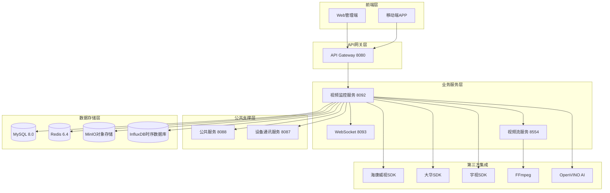

### 2.2 技术架构

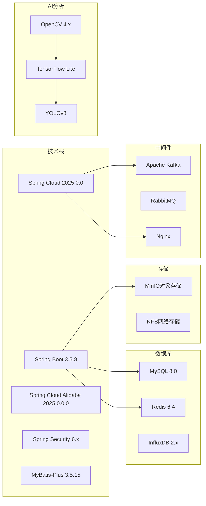

### 2.3 部署架构

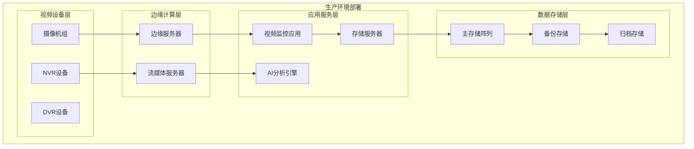

---

## 3. 核心业务模块设计

### 3.1 设备管理模块

#### 3.1.1 业务功能

**设备接入管理**
- 主流厂商设备接入：海康威视、大华、宇视、华为等
- 多协议支持：ONVIF、GB28181、PSIA等标准协议
- 设备自动发现和批量配置
- 设备状态监控和故障诊断

**设备配置管理**
- 视频参数配置：分辨率、码率、帧率、编码格式
- PTZ控制设置：预置点、巡航路径、自动跟踪
- 录像计划配置：定时录像、移动侦测录像、报警录像
- 网络参数配置：主码流、子码流、三码流设置

#### 3.1.2 数据库设计

**t_video_device - 视频设备表**
```sql
CREATE TABLE `t_video_device` (
  `device_id` BIGINT NOT NULL COMMENT '设备ID',
  `device_code` VARCHAR(64) NOT NULL COMMENT '设备编码',
  `device_name` VARCHAR(100) NOT NULL COMMENT '设备名称',
  `device_type` INT NOT NULL COMMENT '设备类型 1-网络摄像机 2-模拟摄像机 3-NVR 4-DVR 5-智能球机',
  `manufacturer` VARCHAR(50) COMMENT '设备厂商',
  `model` VARCHAR(100) COMMENT '设备型号',
  `ip_address` VARCHAR(45) COMMENT '设备IP地址',
  `port` INT DEFAULT 554 COMMENT '设备端口',
  `username` VARCHAR(100) COMMENT '设备用户名',
  `password` VARCHAR(500) COMMENT '设备密码(加密)',
  `rtsp_url` VARCHAR(500) COMMENT 'RTSP视频流地址',
  `onvif_url` VARCHAR(500) COMMENT 'ONVIF设备地址',
  `area_id` BIGINT COMMENT '所属区域ID',
  `location` VARCHAR(200) COMMENT '安装位置',
  `status` INT DEFAULT 1 COMMENT '设备状态 1-在线 2-离线 3-故障 4-停用',
  `ptz_support` BOOLEAN DEFAULT FALSE COMMENT '是否支持PTZ控制',
  `audio_support` BOOLEAN DEFAULT FALSE COMMENT '是否支持音频',
  `infrared_support` BOOLEAN DEFAULT FALSE COMMENT '是否支持红外',
  `main_stream` VARCHAR(500) COMMENT '主码流地址',
  `sub_stream` VARCHAR(500) COMMENT '子码流地址',
  `third_stream` VARCHAR(500) COMMENT '第三码流地址',
  `resolution_main` VARCHAR(20) DEFAULT '1920x1080' COMMENT '主码流分辨率',
  `resolution_sub` VARCHAR(20) DEFAULT '640x480' COMMENT '子码流分辨率',
  `fps_main` INT DEFAULT 25 COMMENT '主码流帧率',
  `fps_sub` INT DEFAULT 15 COMMENT '子码流帧率',
  `bitrate_main` INT DEFAULT 4096 COMMENT '主码流码率(kbps)',
  `bitrate_sub` INT DEFAULT 512 COMMENT '子码流码率(kbps)',
  `latitude` DECIMAL(10,8) COMMENT '纬度',
  `longitude` DECIMAL(11,8) COMMENT '经度',
  `install_date` DATE COMMENT '安装日期',
  `last_online_time` DATETIME COMMENT '最后在线时间',
  `extended_attributes` TEXT COMMENT '扩展属性(JSON格式)',
  `remark` VARCHAR(500) COMMENT '备注',
  `create_time` DATETIME NOT NULL DEFAULT CURRENT_TIMESTAMP COMMENT '创建时间',
  `update_time` DATETIME NOT NULL DEFAULT CURRENT_TIMESTAMP ON UPDATE CURRENT_TIMESTAMP COMMENT '更新时间',
  `create_user_id` BIGINT COMMENT '创建人ID',
  `update_user_id` BIGINT COMMENT '更新人ID',
  `deleted_flag` TINYINT DEFAULT 0 COMMENT '删除标记 0-未删除 1-已删除',
  `version` INT DEFAULT 0 COMMENT '乐观锁版本号',
  PRIMARY KEY (`device_id`),
  UNIQUE KEY `uk_device_code` (`device_code`),
  KEY `idx_device_type` (`device_type`),
  KEY `idx_area_id` (`area_id`),
  KEY `idx_status` (`status`),
  KEY `idx_ip_address` (`ip_address`)
) ENGINE=InnoDB DEFAULT CHARSET=utf8mb4 COLLATE=utf8mb4_unicode_ci COMMENT='视频设备信息表';
```

**t_video_device_channel - 设备通道表**
```sql
CREATE TABLE `t_video_device_channel` (
  `channel_id` BIGINT NOT NULL COMMENT '通道ID',
  `device_id` BIGINT NOT NULL COMMENT '设备ID',
  `channel_no` INT NOT NULL COMMENT '通道号',
  `channel_name` VARCHAR(100) NOT NULL COMMENT '通道名称',
  `channel_type` INT DEFAULT 1 COMMENT '通道类型 1-视频 2-音频 3-音视频',
  `stream_type` INT DEFAULT 1 COMMENT '流类型 1-主码流 2-子码流 3-第三码流',
  `rtsp_url` VARCHAR(500) COMMENT 'RTSP地址',
  `resolution` VARCHAR(20) DEFAULT '1920x1080' COMMENT '分辨率',
  `fps` INT DEFAULT 25 COMMENT '帧率',
  `bitrate` INT DEFAULT 4096 COMMENT '码率(kbps)',
  `encoding_format` VARCHAR(20) DEFAULT 'H264' COMMENT '编码格式 H264/H265',
  `status` INT DEFAULT 1 COMMENT '通道状态 1-启用 2-禁用',
  `is_recording` BOOLEAN DEFAULT FALSE COMMENT '是否在录像',
  `is_detection_enabled` BOOLEAN DEFAULT FALSE COMMENT '是否启用检测',
  `ptz_preset` INT DEFAULT 0 COMMENT 'PTZ预置点数量',
  `channel_index` INT DEFAULT 1 COMMENT '通道索引',
  `audio_enabled` BOOLEAN DEFAULT FALSE COMMENT '是否启用音频',
  `extended_attributes` TEXT COMMENT '扩展属性',
  `create_time` DATETIME NOT NULL DEFAULT CURRENT_TIMESTAMP COMMENT '创建时间',
  `update_time` DATETIME NOT NULL DEFAULT CURRENT_TIMESTAMP ON UPDATE CURRENT_TIMESTAMP COMMENT '更新时间',
  PRIMARY KEY (`channel_id`),
  UNIQUE KEY `uk_device_channel` (`device_id`, `channel_no`),
  KEY `idx_device_id` (`device_id`),
  KEY `idx_stream_type` (`stream_type`)
) ENGINE=InnoDB DEFAULT CHARSET=utf8mb4 COLLATE=utf8mb4_unicode_ci COMMENT='视频设备通道表';
```

#### 3.1.3 API设计

**设备管理接口**
```java
@RestController
@RequestMapping("/api/v1/video/device")
@Tag(name = "视频设备管理", description = "视频设备增删改查和配置管理")
public class VideoDeviceController {

    @Resource
    private VideoDeviceService videoDeviceService;

    /**
     * 分页查询设备列表
     */
    @GetMapping("/query")
    @Operation(summary = "分页查询设备列表", description = "支持按设备类型、状态、区域等条件筛选")
    public ResponseDTO<PageResult<VideoDeviceVO>> queryDevices(
            @RequestParam(defaultValue = "1") Integer pageNum,
            @RequestParam(defaultValue = "20") Integer pageSize,
            @RequestParam(required = false) String deviceName,
            @RequestParam(required = false) Integer deviceType,
            @RequestParam(required = false) Integer status,
            @RequestParam(required = false) Long areaId) {
        return videoDeviceService.queryDevices(pageNum, pageSize, deviceName, deviceType, status, areaId);
    }

    /**
     * 添加设备
     */
    @PostMapping("/add")
    @Operation(summary = "添加视频设备", description = "新增视频设备信息")
    public ResponseDTO<Long> addDevice(@Valid @RequestBody VideoDeviceAddForm form) {
        return videoDeviceService.addDevice(form);
    }

    /**
     * 更新设备信息
     */
    @PutMapping("/{deviceId}")
    @Operation(summary = "更新设备信息", description = "更新视频设备基本信息")
    public ResponseDTO<Void> updateDevice(
            @PathVariable Long deviceId,
            @Valid @RequestBody VideoDeviceUpdateForm form) {
        return videoDeviceService.updateDevice(deviceId, form);
    }

    /**
     * 删除设备
     */
    @DeleteMapping("/{deviceId}")
    @Operation(summary = "删除设备", description = "删除视频设备")
    public ResponseDTO<Void> deleteDevice(@PathVariable Long deviceId) {
        return videoDeviceService.deleteDevice(deviceId);
    }

    /**
     * 获取设备详情
     */
    @GetMapping("/{deviceId}")
    @Operation(summary = "获取设备详情", description = "获取设备详细信息")
    public ResponseDTO<VideoDeviceDetailVO> getDeviceDetail(@PathVariable Long deviceId) {
        return videoDeviceService.getDeviceDetail(deviceId);
    }

    /**
     * 测试设备连接
     */
    @PostMapping("/{deviceId}/test-connection")
    @Operation(summary = "测试设备连接", description = "测试设备网络连接和视频流")
    public ResponseDTO<DeviceConnectionTestVO> testConnection(@PathVariable Long deviceId) {
        return videoDeviceService.testConnection(deviceId);
    }

    /**
     * 获取设备通道列表
     */
    @GetMapping("/{deviceId}/channels")
    @Operation(summary = "获取设备通道列表", description = "获取设备所有通道信息")
    public ResponseDTO<List<VideoDeviceChannelVO>> getDeviceChannels(@PathVariable Long deviceId) {
        return videoDeviceService.getDeviceChannels(deviceId);
    }

    /**
     * 批量添加设备
     */
    @PostMapping("/batch-add")
    @Operation(summary = "批量添加设备", description = "批量导入设备信息")
    public ResponseDTO<BatchAddResultVO> batchAddDevices(@Valid @RequestBody List<VideoDeviceAddForm> devices) {
        return videoDeviceService.batchAddDevices(devices);
    }
}
```

### 3.2 视频流处理模块

#### 3.2.1 业务功能

**实时视频流传输**
- 多协议支持：RTSP、RTMP、HTTP-FLV、WebSocket-FLV、WebRTC
- 流媒体服务：Nginx-RTMP、SRS、Wowza等专业流媒体服务器集成
- 低延迟传输：WebRTC实现100ms以内超低延迟
- 自适应码率：根据网络状况动态调整码率和分辨率

**视频流转码和优化**
- 多码流转换：H.264/H.265编码格式转换
- 分辨率适配：4K/1080P/720P多分辨率支持
- 帧率优化：25fps/30fps/60fps自适应帧率
- 音视频同步：精准音视频时间戳同步

#### 3.2.2 API设计

**视频流接口**
```java
@RestController
@RequestMapping("/api/v1/video/stream")
@Tag(name = "视频流管理", description = "实时视频流获取和管理")
public class VideoStreamController {

    @Resource
    private VideoStreamService videoStreamService;

    /**
     * 获取实时视频流地址
     */
    @GetMapping("/live/{deviceId}/{channelNo}")
    @Operation(summary = "获取实时视频流", description = "获取设备实时视频流播放地址")
    public ResponseDTO<VideoStreamVO> getLiveStream(
            @PathVariable Long deviceId,
            @PathVariable Integer channelNo,
            @RequestParam(defaultValue = "main") String streamType,
            @RequestParam(defaultValue = "flv") String format) {
        return videoStreamService.getLiveStream(deviceId, channelNo, streamType, format);
    }

    /**
     * WebSocket实时视频流推送
     */
    @GetMapping("/ws/{deviceId}/{channelNo}")
    @Operation(summary = "WebSocket视频流", description = "通过WebSocket推送实时视频流")
    public String getWebSocketStream(
            @PathVariable Long deviceId,
            @PathVariable Integer channelNo) {
        return videoStreamService.getWebSocketStreamUrl(deviceId, channelNo);
    }

    /**
     * WebRTC视频流
     */
    @PostMapping("/webrtc/{deviceId}/{channelNo}")
    @Operation(summary = "WebRTC视频流", description = "获取WebRTC视频流配置")
    public ResponseDTO<WebRTCStreamVO> getWebRTCStream(
            @PathVariable Long deviceId,
            @PathVariable Integer channelNo) {
        return videoStreamService.getWebRTCStream(deviceId, channelNo);
    }

    /**
     * 视频流录制开始
     */
    @PostMapping("/record/start/{deviceId}/{channelNo}")
    @Operation(summary = "开始录制", description = "开始录制视频流")
    public ResponseDTO<String> startRecord(
            @PathVariable Long deviceId,
            @PathVariable Integer channelNo,
            @RequestBody VideoRecordConfigForm config) {
        return videoStreamService.startRecord(deviceId, channelNo, config);
    }

    /**
     * 停止录制
     */
    @PostMapping("/record/stop/{recordId}")
    @Operation(summary = "停止录制", description = "停止视频录制")
    public ResponseDTO<Void> stopRecord(@PathVariable String recordId) {
        return videoStreamService.stopRecord(recordId);
    }

    /**
     * 获取录制状态
     */
    @GetMapping("/record/status/{recordId}")
    @Operation(summary = "获取录制状态", description = "获取视频录制状态")
    public ResponseDTO<VideoRecordStatusVO> getRecordStatus(@PathVariable String recordId) {
        return videoStreamService.getRecordStatus(recordId);
    }
}
```

### 3.3 录像管理模块

#### 3.3.1 业务功能

**录像存储管理**
- 多级存储策略：热存储SSD、温存储HDD、冷存储磁带/云存储
- 智能存储优化：基于重要性和访问频率的智能存储分级
- 存储空间管理：存储空间监控、自动清理过期录像
- 备份和恢复：关键录像多重备份和快速恢复

**录像检索和回放**
- 多条件检索：时间范围、设备、事件类型等多维度检索
- 智能搜索：基于AI的智能视频内容搜索
- 多倍速回放：1x、2x、4x、8x、16x多倍速播放
- 精确定位：帧级精确定位和时间轴拖拽

#### 3.3.2 数据库设计

**t_video_record - 视频录像表**
```sql
CREATE TABLE `t_video_record` (
  `record_id` VARCHAR(64) NOT NULL COMMENT '录像ID',
  `device_id` BIGINT NOT NULL COMMENT '设备ID',
  `channel_no` INT NOT NULL COMMENT '通道号',
  `record_type` INT NOT NULL COMMENT '录像类型 1-定时录像 2-移动侦测 3-报警录像 4-手动录像',
  `start_time` DATETIME NOT NULL COMMENT '开始时间',
  `end_time` DATETIME NOT NULL COMMENT '结束时间',
  `duration` INT NOT NULL COMMENT '录像时长(秒)',
  `file_path` VARCHAR(500) NOT NULL COMMENT '录像文件路径',
  `file_size` BIGINT NOT NULL COMMENT '文件大小(字节)',
  `resolution` VARCHAR(20) COMMENT '分辨率',
  `fps` INT COMMENT '帧率',
  `bitrate` INT COMMENT '码率(kbps)',
  `encoding_format` VARCHAR(20) COMMENT '编码格式',
  `storage_type` INT DEFAULT 1 COMMENT '存储类型 1-热存储 2-温存储 3-冷存储',
  `file_format` VARCHAR(10) DEFAULT 'mp4' COMMENT '文件格式',
  `thumbnail_path` VARCHAR(500) COMMENT '缩略图路径',
  `download_count` INT DEFAULT 0 COMMENT '下载次数',
  `view_count` INT DEFAULT 0 COMMENT '查看次数',
  `is_backup` BOOLEAN DEFAULT FALSE COMMENT '是否已备份',
  `backup_path` VARCHAR(500) COMMENT '备份路径',
  `archive_date` DATETIME COMMENT '归档日期',
  `expire_date` DATETIME COMMENT '过期日期',
  `event_tags` VARCHAR(500) COMMENT '事件标签',
  `description` VARCHAR(1000) COMMENT '录像描述',
  `create_time` DATETIME NOT NULL DEFAULT CURRENT_TIMESTAMP COMMENT '创建时间',
  `update_time` DATETIME NOT NULL DEFAULT CURRENT_TIMESTAMP ON UPDATE CURRENT_TIMESTAMP COMMENT '更新时间',
  PRIMARY KEY (`record_id`),
  KEY `idx_device_channel` (`device_id`, `channel_no`),
  KEY `idx_start_time` (`start_time`),
  KEY `idx_end_time` (`end_time`),
  KEY `idx_record_type` (`record_type`),
  KEY `idx_storage_type` (`storage_type`),
  KEY `idx_expire_date` (`expire_date`)
) ENGINE=InnoDB DEFAULT CHARSET=utf8mb4 COLLATE=utf8mb4_unicode_ci COMMENT='视频录像表';
```

#### 3.3.3 API设计

**录像管理接口**
```java
@RestController
@RequestMapping("/api/v1/video/record")
@Tag(name = "录像管理", description = "视频录像的查询、下载、回放等管理")
public class VideoRecordController {

    @Resource
    private VideoRecordService videoRecordService;

    /**
     * 分页查询录像列表
     */
    @GetMapping("/query")
    @Operation(summary = "查询录像列表", description = "按条件分页查询录像记录")
    public ResponseDTO<PageResult<VideoRecordVO>> queryRecords(
            @RequestParam(defaultValue = "1") Integer pageNum,
            @RequestParam(defaultValue = "20") Integer pageSize,
            @RequestParam(required = false) Long deviceId,
            @RequestParam(required = false) Integer channelNo,
            @RequestParam(required = false) Integer recordType,
            @RequestParam(required = false) @DateTimeFormat(iso = DateTimeFormat.ISO.DATE) LocalDate startDate,
            @RequestParam(required = false) @DateTimeFormat(iso = DateTimeFormat.ISO.DATE) LocalDate endDate) {
        return videoRecordService.queryRecords(pageNum, pageSize, deviceId, channelNo, recordType, startDate, endDate);
    }

    /**
     * 获取录像详情
     */
    @GetMapping("/{recordId}")
    @Operation(summary = "获取录像详情", description = "获取录像详细信息")
    public ResponseDTO<VideoRecordDetailVO> getRecordDetail(@PathVariable String recordId) {
        return videoRecordService.getRecordDetail(recordId);
    }

    /**
     * 获取录像回放地址
     */
    @GetMapping("/{recordId}/play")
    @Operation(summary = "获取回放地址", description = "获取录像回放播放地址")
    public ResponseDTO<VideoPlayVO> getPlayUrl(@PathVariable String recordId) {
        return videoRecordService.getPlayUrl(recordId);
    }

    /**
     * 下载录像
     */
    @GetMapping("/{recordId}/download")
    @Operation(summary = "下载录像", description = "下载录像文件")
    public ResponseEntity<Resource> downloadRecord(
            @PathVariable String recordId,
            @RequestParam(required = false) String token) {
        return videoRecordService.downloadRecord(recordId, token);
    }

    /**
     * 删除录像
     */
    @DeleteMapping("/{recordId}")
    @Operation(summary = "删除录像", description = "删除录像文件")
    public ResponseDTO<Void> deleteRecord(@PathVariable String recordId) {
        return videoRecordService.deleteRecord(recordId);
    }

    /**
     * 批量删除录像
     */
    @DeleteMapping("/batch")
    @Operation(summary = "批量删除录像", description = "批量删除多个录像文件")
    public ResponseDTO<BatchDeleteResultVO> batchDeleteRecords(@RequestBody List<String> recordIds) {
        return videoRecordService.batchDeleteRecords(recordIds);
    }

    /**
     * 获取录像时间轴
     */
    @GetMapping("/timeline/{deviceId}/{channelNo}")
    @Operation(summary = "获取录像时间轴", description = "获取指定设备通道的录像时间轴")
    public ResponseDTO<List<VideoTimelineVO>> getTimeline(
            @PathVariable Long deviceId,
            @PathVariable Integer channelNo,
            @RequestParam @DateTimeFormat(iso = DateTimeFormat.ISO.DATE) LocalDate date) {
        return videoRecordService.getTimeline(deviceId, channelNo, date);
    }
}
```

### 3.4 智能分析模块

#### 3.4.1 业务功能

**AI视频分析**
- 人员行为分析：人脸识别、人员计数、行为轨迹分析
- 物体检测：车辆检测、物品识别、区域入侵检测
- 异常行为识别：打架斗殴、倒地检测、异常聚集
- 智能搜索：以图搜图、以特征搜视频

**智能报警管理**
- 实时报警：移动侦测、越界检测、区域入侵实时报警
- 报警联动：报警触发录像、触发门禁、触发声光报警
- 报警过滤：AI算法减少误报，提高报警准确性
- 报警统计：报警趋势分析、热点区域统计

#### 3.4.2 数据库设计

**t_video_analysis - 视频分析结果表**
```sql
CREATE TABLE `t_video_analysis` (
  `analysis_id` VARCHAR(64) NOT NULL COMMENT '分析ID',
  `device_id` BIGINT NOT NULL COMMENT '设备ID',
  `channel_no` INT NOT NULL COMMENT '通道号',
  `analysis_type` INT NOT NULL COMMENT '分析类型 1-人脸检测 2-人员计数 3-车辆检测 4-行为分析 5-区域入侵',
  `start_time` DATETIME NOT NULL COMMENT '分析开始时间',
  `end_time` DATETIME NOT NULL COMMENT '分析结束时间',
  `confidence` DECIMAL(5,4) COMMENT '置信度',
  `detection_count` INT DEFAULT 0 COMMENT '检测数量',
  `bbox_data` TEXT COMMENT '边界框数据(JSON格式)',
  `feature_data` TEXT COMMENT '特征数据(JSON格式)',
  `analysis_result` TEXT COMMENT '分析结果(JSON格式)',
  `image_path` VARCHAR(500) COMMENT '分析结果图片路径',
  `video_segment_path` VARCHAR(500) COMMENT '相关视频片段路径',
  `alert_level` INT DEFAULT 1 COMMENT '报警级别 1-一般 2-重要 3-紧急',
  `is_processed` BOOLEAN DEFAULT FALSE COMMENT '是否已处理',
  `process_user_id` BIGINT COMMENT '处理人ID',
  `process_time` DATETIME COMMENT '处理时间',
  `process_remark` VARCHAR(500) COMMENT '处理备注',
  `create_time` DATETIME NOT NULL DEFAULT CURRENT_TIMESTAMP COMMENT '创建时间',
  PRIMARY KEY (`analysis_id`),
  KEY `idx_device_channel` (`device_id`, `channel_no`),
  KEY `idx_analysis_type` (`analysis_type`),
  KEY `idx_start_time` (`start_time`),
  KEY `idx_alert_level` (`alert_level`),
  KEY `idx_is_processed` (`is_processed`)
) ENGINE=InnoDB DEFAULT CHARSET=utf8mb4 COLLATE=utf8mb4_unicode_ci COMMENT='视频分析结果表';
```

#### 3.4.3 API设计

**智能分析接口**
```java
@RestController
@RequestMapping("/api/v1/video/analysis")
@Tag(name = "视频智能分析", description = "AI视频分析和检测功能")
public class VideoAnalysisController {

    @Resource
    private VideoAnalysisService videoAnalysisService;

    /**
     * 手动触发视频分析
     */
    @PostMapping("/analyze")
    @Operation(summary = "触发视频分析", description = "对指定视频片段进行AI分析")
    public ResponseDTO<String> analyzeVideo(
            @RequestParam String recordId,
            @RequestParam Integer analysisType,
            @RequestBody VideoAnalysisConfigForm config) {
        return videoAnalysisService.analyzeVideo(recordId, analysisType, config);
    }

    /**
     * 获取分析结果
     */
    @GetMapping("/result/{analysisId}")
    @Operation(summary = "获取分析结果", description = "获取AI分析详细结果")
    public ResponseDTO<VideoAnalysisResultVO> getAnalysisResult(@PathVariable String analysisId) {
        return videoAnalysisService.getAnalysisResult(analysisId);
    }

    /**
     * 分页查询分析记录
     */
    @GetMapping("/query")
    @Operation(summary = "查询分析记录", description = "分页查询视频分析记录")
    public ResponseDTO<PageResult<VideoAnalysisVO>> queryAnalysisRecords(
            @RequestParam(defaultValue = "1") Integer pageNum,
            @RequestParam(defaultValue = "20") Integer pageSize,
            @RequestParam(required = false) Long deviceId,
            @RequestParam(required = false) Integer analysisType,
            @RequestParam(required = false) Integer alertLevel,
            @RequestParam(required = false) @DateTimeFormat(iso = DateTimeFormat.ISO.DATE) LocalDate startDate,
            @RequestParam(required = false) @DateTimeFormat(iso = DateTimeFormat.ISO.DATE) LocalDate endDate) {
        return videoAnalysisService.queryAnalysisRecords(pageNum, pageSize, deviceId, analysisType, alertLevel, startDate, endDate);
    }

    /**
     * 以图搜图
     */
    @PostMapping("/search-by-image")
    @Operation(summary = "以图搜图", description = "上传图片搜索相似人物")
    public ResponseDTO<List<ImageSearchResultVO>> searchByImage(
            @RequestParam("image") MultipartFile image,
            @RequestParam(required = false) Long deviceId,
            @RequestParam(defaultValue = "0.8") Double threshold) {
        return videoAnalysisService.searchByImage(image, deviceId, threshold);
    }

    /**
     * 获取人员轨迹
     */
    @GetMapping("/person-trajectory")
    @Operation(summary = "获取人员轨迹", description = "获取指定人员在园区内的活动轨迹")
    public ResponseDTO<List<PersonTrajectoryVO>> getPersonTrajectory(
            @RequestParam String personId,
            @RequestParam @DateTimeFormat(iso = DateTimeFormat.ISO.DATE) LocalDate date) {
        return videoAnalysisService.getPersonTrajectory(personId, date);
    }

    /**
     * 配置分析规则
     */
    @PostMapping("/config-rules/{deviceId}/{channelNo}")
    @Operation(summary = "配置分析规则", description = "为指定设备通道配置AI分析规则")
    public ResponseDTO<Void> configAnalysisRules(
            @PathVariable Long deviceId,
            @PathVariable Integer channelNo,
            @RequestBody List<AnalysisRuleForm> rules) {
        return videoAnalysisService.configAnalysisRules(deviceId, channelNo, rules);
    }
}
```

### 3.5 PTZ控制模块

#### 3.5.1 业务功能

**云台控制**
- 基础控制：上下、左右、放大、缩小、光圈、焦距控制
- 预置位管理：预置位设置、调用、删除
- 巡航路径：自动巡航、模式巡航、轨迹巡航
- 3D定位：鼠标点击画面直接定位控制

#### 3.5.2 API设计

**PTZ控制接口**
```java
@RestController
@RequestMapping("/api/v1/video/ptz")
@Tag(name = "PTZ云台控制", description = "视频设备PTZ控制功能")
public class PTZController {

    @Resource
    private PTZService ptzService;

    /**
     * PTZ方向控制
     */
    @PostMapping("/{deviceId}/{channelNo}/control")
    @Operation(summary = "PTZ方向控制", description = "控制云台上下左右移动和变焦")
    public ResponseDTO<Void> ptzControl(
            @PathVariable Long deviceId,
            @PathVariable Integer channelNo,
            @RequestBody PTZControlForm form) {
        return ptzService.ptzControl(deviceId, channelNo, form);
    }

    /**
     * 设置预置位
     */
    @PostMapping("/{deviceId}/{channelNo}/preset")
    @Operation(summary = "设置预置位", description = "设置云台预置位")
    public ResponseDTO<Integer> setPreset(
            @PathVariable Long deviceId,
            @PathVariable Integer channelNo,
            @RequestParam String presetName) {
        return ptzService.setPreset(deviceId, channelNo, presetName);
    }

    /**
     * 调用预置位
     */
    @PostMapping("/{deviceId}/{channelNo}/goto-preset")
    @Operation(summary = "调用预置位", description = "云台移动到指定预置位")
    public ResponseDTO<Void> gotoPreset(
            @PathVariable Long deviceId,
            @PathVariable Integer channelNo,
            @RequestParam Integer presetIndex) {
        return ptzService.gotoPreset(deviceId, channelNo, presetIndex);
    }

    /**
     * 删除预置位
     */
    @DeleteMapping("/{deviceId}/{channelNo}/preset/{presetIndex}")
    @Operation(summary = "删除预置位", description = "删除指定预置位")
    public ResponseDTO<Void> deletePreset(
            @PathVariable Long deviceId,
            @PathVariable Integer channelNo,
            @PathVariable Integer presetIndex) {
        return ptzService.deletePreset(deviceId, channelNo, presetIndex);
    }

    /**
     * 获取预置位列表
     */
    @GetMapping("/{deviceId}/{channelNo}/presets")
    @Operation(summary = "获取预置位列表", description = "获取设备所有预置位")
    public ResponseDTO<List<PTZPresetVO>> getPresets(
            @PathVariable Long deviceId,
            @PathVariable Integer channelNo) {
        return ptzService.getPresets(deviceId, channelNo);
    }
}
```

---

## 4. 数据库设计

### 4.1 数据库架构

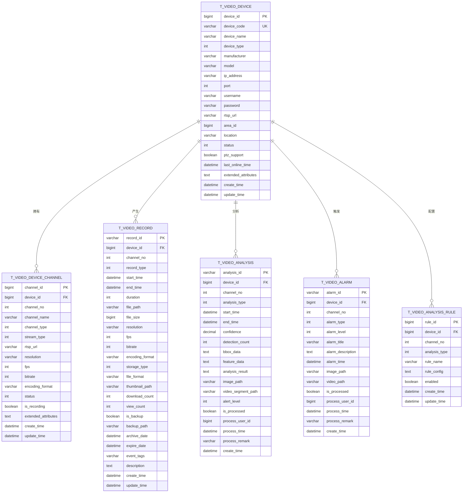

### 4.2 核心表结构

**设备报警表 (t_video_alarm)**
```sql
CREATE TABLE `t_video_alarm` (
  `alarm_id` VARCHAR(64) NOT NULL COMMENT '报警ID',
  `device_id` BIGINT NOT NULL COMMENT '设备ID',
  `channel_no` INT NOT NULL COMMENT '通道号',
  `alarm_type` INT NOT NULL COMMENT '报警类型 1-移动侦测 2-区域入侵 3-越界检测 4-物品丢失 5-异常行为',
  `alarm_level` INT NOT NULL COMMENT '报警级别 1-一般 2-重要 3-紧急',
  `alarm_title` VARCHAR(200) NOT NULL COMMENT '报警标题',
  `alarm_description` TEXT COMMENT '报警描述',
  `alarm_time` DATETIME NOT NULL COMMENT '报警时间',
  `image_path` VARCHAR(500) COMMENT '报警截图路径',
  `video_path` VARCHAR(500) COMMENT '相关视频片段路径',
  `confidence` DECIMAL(5,4) COMMENT '置信度',
  `bbox_data` TEXT COMMENT '检测框数据(JSON格式)',
  `is_processed` BOOLEAN DEFAULT FALSE COMMENT '是否已处理',
  `process_user_id` BIGINT COMMENT '处理人ID',
  `process_time` DATETIME COMMENT '处理时间',
  `process_remark` VARCHAR(500) COMMENT '处理备注',
  `notify_status` INT DEFAULT 0 COMMENT '通知状态 0-未通知 1-已通知',
  `extended_attributes` TEXT COMMENT '扩展属性',
  `create_time` DATETIME NOT NULL DEFAULT CURRENT_TIMESTAMP COMMENT '创建时间',
  PRIMARY KEY (`alarm_id`),
  KEY `idx_device_channel` (`device_id`, `channel_no`),
  KEY `idx_alarm_type` (`alarm_type`),
  KEY `idx_alarm_level` (`alarm_level`),
  KEY `idx_alarm_time` (`alarm_time`),
  KEY `idx_is_processed` (`is_processed`),
  KEY `idx_notify_status` (`notify_status`)
) ENGINE=InnoDB DEFAULT CHARSET=utf8mb4 COLLATE=utf8mb4_unicode_ci COMMENT='视频设备报警表';
```

**分析规则配置表 (t_video_analysis_rule)**
```sql
CREATE TABLE `t_video_analysis_rule` (
  `rule_id` BIGINT NOT NULL AUTO_INCREMENT COMMENT '规则ID',
  `device_id` BIGINT NOT NULL COMMENT '设备ID',
  `channel_no` INT NOT NULL COMMENT '通道号',
  `analysis_type` INT NOT NULL COMMENT '分析类型 1-人脸检测 2-人员计数 3-车辆检测 4-行为分析 5-区域入侵',
  `rule_name` VARCHAR(100) NOT NULL COMMENT '规则名称',
  `rule_config` TEXT NOT NULL COMMENT '规则配置(JSON格式)',
  `enabled` BOOLEAN DEFAULT TRUE COMMENT '是否启用',
  `priority` INT DEFAULT 1 COMMENT '优先级',
  `confidence_threshold` DECIMAL(5,4) DEFAULT 0.8000 COMMENT '置信度阈值',
  `detection_zones` TEXT COMMENT '检测区域(JSON格式)',
  `exclusion_zones` TEXT COMMENT '排除区域(JSON格式)',
  `schedule_config` TEXT COMMENT '时间计划配置(JSON格式)',
  `alert_config` TEXT COMMENT '报警配置(JSON格式)',
  `create_user_id` BIGINT COMMENT '创建人ID',
  `create_time` DATETIME NOT NULL DEFAULT CURRENT_TIMESTAMP COMMENT '创建时间',
  `update_user_id` BIGINT COMMENT '更新人ID',
  `update_time` DATETIME NOT NULL DEFAULT CURRENT_TIMESTAMP ON UPDATE CURRENT_TIMESTAMP COMMENT '更新时间',
  PRIMARY KEY (`rule_id`),
  UNIQUE KEY `uk_device_rule` (`device_id`, `channel_no`, `rule_name`),
  KEY `idx_device_channel` (`device_id`, `channel_no`),
  KEY `idx_analysis_type` (`analysis_type`),
  KEY `idx_enabled` (`enabled`)
) ENGINE=InnoDB DEFAULT CHARSET=utf8mb4 COLLATE=utf8mb4_unicode_ci COMMENT='视频分析规则配置表';
```

### 4.3 索引优化策略

**查询优化索引**
```sql
-- 设备查询优化
CREATE INDEX idx_device_composite ON t_video_device(device_type, status, area_id);
CREATE INDEX idx_device_location ON t_video_device(area_id, status);
CREATE INDEX idx_device_ip_port ON t_video_device(ip_address, port);

-- 录像查询优化
CREATE INDEX idx_record_device_time ON t_video_record(device_id, channel_no, start_time, end_time);
CREATE INDEX idx_record_time_type ON t_video_record(start_time, record_type, storage_type);
CREATE INDEX idx_record_expire ON t_video_record(expire_date, storage_type);

-- 分析结果查询优化
CREATE INDEX idx_analysis_device_time ON t_video_analysis(device_id, channel_no, start_time, end_time);
CREATE INDEX idx_analysis_type_level ON t_video_analysis(analysis_type, alert_level, is_processed);

-- 报警查询优化
CREATE INDEX idx_alarm_device_time ON t_video_alarm(device_id, channel_no, alarm_time);
CREATE INDEX idx_alarm_level_processed ON t_video_alarm(alarm_level, is_processed, alarm_time);
```

### 4.4 分库分表设计

**按时间分表策略**
```sql
-- 录像表按月分表
CREATE TABLE `t_video_record_202501` LIKE `t_video_record`;
CREATE TABLE `t_video_record_202502` LIKE `t_video_record`;
-- 继续按月分表...

-- 报警表按月分表
CREATE TABLE `t_video_alarm_202501` LIKE `t_video_alarm`;
CREATE TABLE `t_video_alarm_202502` LIKE `t_video_alarm`;
-- 继续按月分表...

-- 分析结果表按季度分表
CREATE TABLE `t_video_analysis_2025q1` LIKE `t_video_analysis`;
CREATE TABLE `t_video_analysis_2025q2` LIKE `t_video_analysis`;
-- 继续按季度分表...
```

---

## 5. 业务流程设计

### 5.1 设备接入流程

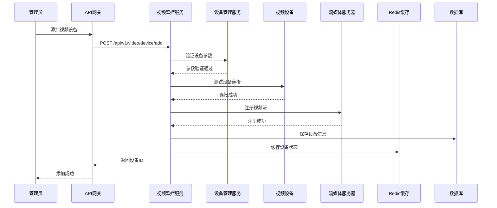

### 5.2 实时视频流播放流程

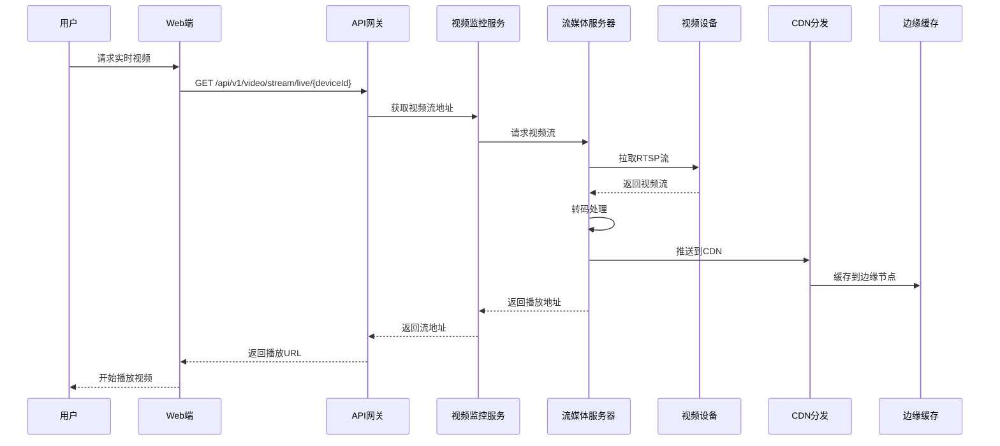

### 5.3 智能分析流程

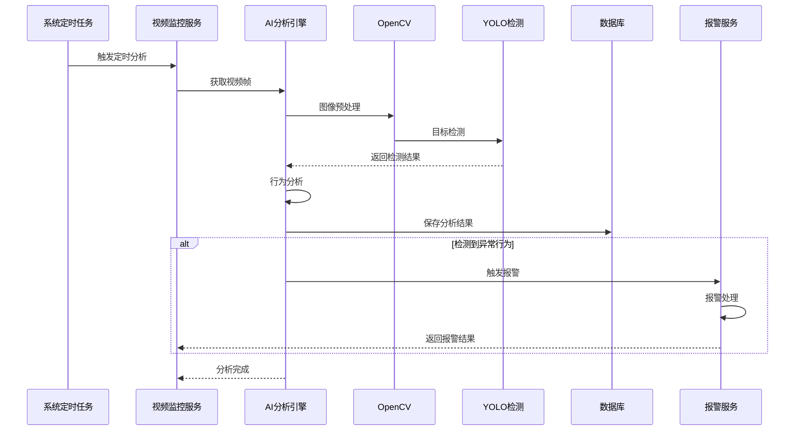

### 5.4 报警联动流程

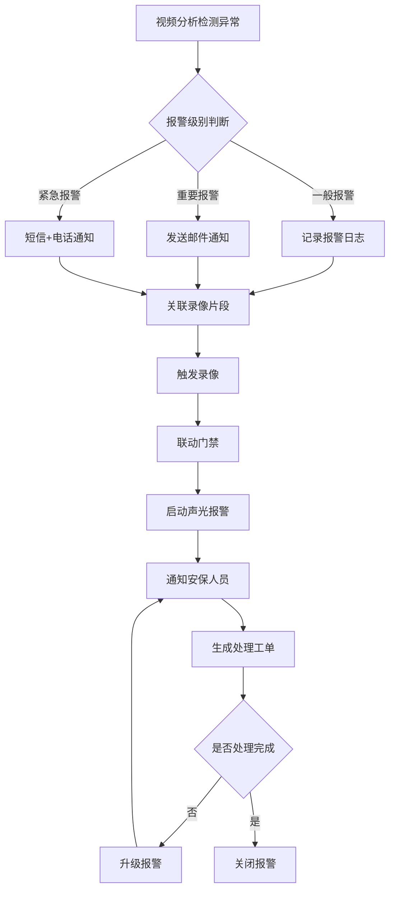

---

## 6. 用户故事和界面设计

### 6.1 用户故事

**用户故事1：设备管理员**
```
作为设备管理员，
我希望能够批量添加和管理视频设备，
以便快速部署园区视频监控系统。

验收标准：
- 支持Excel批量导入设备信息
- 自动发现网络中的视频设备
- 提供设备连接状态实时监控
- 支持设备配置模板批量应用
- 提供设备故障诊断和修复建议
```

**用户故事2：安保人员**
```
作为安保人员，
我希望能够实时查看园区所有摄像头的视频画面，
以便及时发现和处理安全隐患。

验收标准：
- 支持1/4/9/16画面实时预览
- 支持画面拖拽和轮播切换
- 提供PTZ云台控制功能
- 支持双击画面全屏显示
- 提供音频监听功能
```

**用户故事3：数据分析师**
```
作为数据分析师，
我希望能够通过AI分析视频内容，
以便获取园区人流统计和行为分析数据。

验收标准：
- 支持指定区域人员计数统计
- 提供人员热力图分析
- 支持异常行为自动检测
- 提供数据报表导出功能
- 支持历史数据趋势分析
```

### 6.2 界面设计

**主监控界面**
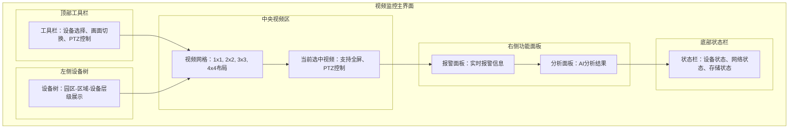

**录像回放界面**
```
┌─────────────────────────────────────────────────────────────┐
│ 录像回放界面                                                      │
├─────────────────────────────────────────────────────────────┤
│ 日期选择: [2025-12-16]  ▼  时间选择: [00:00] - [23:59]      │
│ 设备选择: [园区大门摄像头] ▼  通道: [主码流] ▼                │
├─────────────────────────────────────────────────────────────┤
│ ┌─────────────────┐ ┌─────────────────────────────────────┐ │
│ │ 时间轴组件       │ │ 视频播放区域                         │ │
│ │ [00:00]....[23:59] │ │                                    │ │
│ │ 录像片段标记:      │ │     [视频播放器]                    │ │
│ │ ■ 定时录像        │ │                                    │ │
│ │ ■ 报警录像        │ │     [播放控制条]                     │ │
│ │ ■ 移动侦测        │ │                                    │ │
│ └─────────────────┘ └─────────────────────────────────────┘ │
│ 播放控制: [◀◀] [▶] [■] [▶▶]  倍速: [1x] ▼  截图 [📷] 下载 [⬇] │
├─────────────────────────────────────────────────────────────┤
│ 智能搜索: [以图搜图] [人员搜索] [车辆搜索] [事件搜索]        │
└─────────────────────────────────────────────────────────────┘
```

### 6.3 移动端界面

**移动端监控页面**
```
┌─────────────────────────────────────────────┐
│ 智慧园区安防移动端                           │
├─────────────────────────────────────────────┤
│ 📹 实时监控  📽️ 录像回放  🚨 报警中心       │
├─────────────────────────────────────────────┤
│ ┌─────────────────┐ ┌─────────────────────┐ │
│ │ 园区大门         │ │ 办公楼大厅          │ │
│ │ [视频画面]      │ │ [视频画面]          │ │
│ │ 在线 🟢         │ │ 在线 🟢             │ │
│ │ PTZ 🎯          │ │ 录像 ⏺️             │ │
│ └─────────────────┘ └─────────────────────┘ │
│ ┌─────────────────┐ ┌─────────────────────┐ │
│ │ 停车场入口       │ │ 餐厅区域            │ │
│ │ [视频画面]      │ │ [视频画面]          │ │
│ │ 离线 🔴         │ │ 在线 🟢             │ │
│ │ 故障 ⚠️          │ │ 录像 ⏺️             │ │
│ └─────────────────┘ └─────────────────────┘ │
├─────────────────────────────────────────────┤
│ 🚨 实时报警: 3条未处理                       │
│ └─ 园区大门检测到异常行为 [13:45:32]         │
└─────────────────────────────────────────────┘
```

---

## 7. 跨模块业务流程

### 7.1 视频与门禁联动

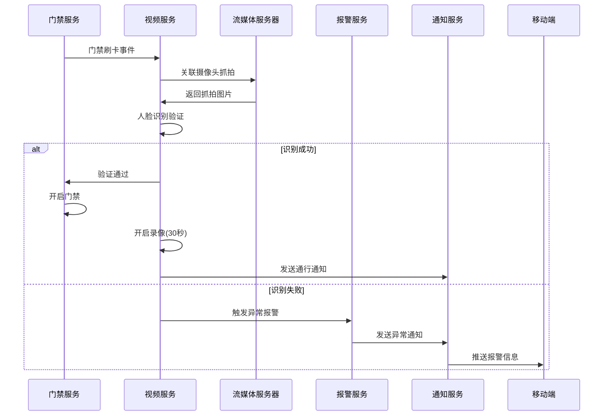

### 7.2 视频与访客管理联动

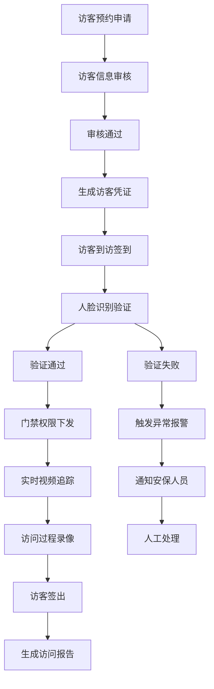

### 7.3 视频与考勤管理联动

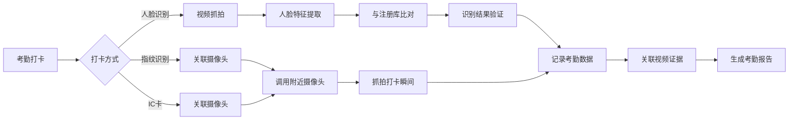

---

## 8. 性能优化设计

### 8.1 视频流传输优化

**多码流自适应策略**
```java
@Service
public class VideoStreamOptimizer {

    /**
     * 根据网络状况自适应调整码流
     */
    public StreamConfig optimizeStreamConfig(NetworkMetrics metrics, DeviceCapability capability) {
        StreamConfig config = new StreamConfig();

        // 基于网络带宽调整分辨率
        if (metrics.getBandwidth() > 10000) { // >10Mbps
            config.setResolution("1920x1080");
            config.setBitrate(4096);
            config.setFps(25);
        } else if (metrics.getBandwidth() > 5000) { // >5Mbps
            config.setResolution("1280x720");
            config.setBitrate(2048);
            config.setFps(25);
        } else if (metrics.getBandwidth() > 2000) { // >2Mbps
            config.setResolution("640x480");
            config.setBitrate(1024);
            config.setFps(15);
        } else { // <2Mbps
            config.setResolution("320x240");
            config.setBitrate(512);
            config.setFps(10);
        }

        // 基于延迟调整编码格式
        if (metrics.getLatency() > 2000) { // >2秒延迟
            config.setEncoding("H264"); // 低延迟H264
        } else {
            config.setEncoding("H265"); // 高效H265
        }

        return config;
    }

    /**
     * CDN边缘节点优化
     */
    public String selectOptimalCDNNode(ClientLocation location, List<CDNNode> nodes) {
        return nodes.stream()
                .min(Comparator.comparing(node ->
                    calculateDistance(location, node.getLocation())))
                .map(CDNNode::getUrl)
                .orElse(getDefaultCDNUrl());
    }
}
```

### 8.2 存储性能优化

**智能存储分层策略**
```java
@Component
public class StorageOptimizer {

    /**
     * 根据录像重要性分配存储层级
     */
    public StorageTier assignStorageTier(VideoRecord record) {
        // 报警录像 -> 热存储
        if (record.getRecordType() == RecordType.ALARM) {
            return StorageTier.HOT;
        }

        // 移动侦测录像 -> 温存储
        if (record.getRecordType() == RecordType.MOTION_DETECTION) {
            return StorageTier.WARM;
        }

        // 定时录像 -> 冷存储（30天后）
        if (record.getRecordType() == RecordType.SCHEDULED) {
            return isOlderThan30Days(record) ? StorageTier.COLD : StorageTier.WARM;
        }

        return StorageTier.WARM;
    }

    /**
     * 存储空间优化清理
     */
    @Scheduled(cron = "0 0 2 * * ?") // 每天凌晨2点执行
    public void optimizeStorageSpace() {
        // 清理过期录像
        cleanExpiredRecords();

        // 迁移低频录像到冷存储
        migrateToColdStorage();

        // 压缩存储空间
        compressStorage();
    }
}
```

### 8.3 AI分析性能优化

**GPU加速分析**
```java
@Service
public class AIAnalysisOptimizer {

    /**
     * GPU并行视频分析
     */
    public void parallelVideoAnalysis(List<VideoFrame> frames, AnalysisConfig config) {
        int gpuCount = getGPUCount();
        int batchSize = frames.size() / gpuCount;

        List<CompletableFuture<List<AnalysisResult>>> futures = IntStream.range(0, gpuCount)
                .mapToObj(gpuId -> {
                    int startIndex = gpuId * batchSize;
                    int endIndex = gpuId == gpuCount - 1 ? frames.size() : (gpuId + 1) * batchSize;
                    List<VideoFrame> batch = frames.subList(startIndex, endIndex);
                    return CompletableFuture.supplyAsync(() -> analyzeBatchOnGPU(batch, config, gpuId));
                })
                .collect(Collectors.toList());

        // 合并分析结果
        List<AnalysisResult> allResults = futures.stream()
                .map(CompletableFuture::join)
                .flatMap(List::stream)
                .collect(Collectors.toList());

        saveAnalysisResults(allResults);
    }

    /**
     * 模型热加载优化
     */
    @EventListener
    public void handleModelUpdate(ModelUpdateEvent event) {
        // 后台加载新模型，不影响当前分析
        CompletableFuture.runAsync(() -> {
            AIModel newModel = loadModel(event.getModelPath());
            validateModel(newModel);
            // 原子替换模型
            currentModel.compareAndSet(oldModel, newModel);
        });
    }
}
```

### 8.4 缓存优化策略

**多级缓存架构**
```java
@Service
public class VideoCacheManager {

    private final Cache<String, DeviceStatus> deviceStatusCache;
    private final Cache<String, StreamUrl> streamUrlCache;
    private final Cache<String, AnalysisResult> analysisCache;

    public VideoCacheManager() {
        // 设备状态缓存 - 5分钟过期
        this.deviceStatusCache = Caffeine.newBuilder()
                .maximumSize(10000)
                .expireAfterWrite(Duration.ofMinutes(5))
                .recordStats()
                .build();

        // 流地址缓存 - 1分钟过期
        this.streamUrlCache = Caffeine.newBuilder()
                .maximumSize(5000)
                .expireAfterWrite(Duration.ofMinutes(1))
                .recordStats()
                .build();

        // 分析结果缓存 - 30分钟过期
        this.analysisCache = Caffeine.newBuilder()
                .maximumSize(2000)
                .expireAfterWrite(Duration.ofMinutes(30))
                .recordStats()
                .build();
    }

    /**
     * 预热缓存
     */
    @PostConstruct
    public void warmupCache() {
        // 预加载热门设备状态
        loadPopularDevices();

        // 预加载常用流地址
        loadPopularStreams();

        // 预加载分析模型
        loadAnalysisModels();
    }
}
```

---

## 9. 安全设计

### 9.1 视频流安全

**传输加密**
```java
@Configuration
public class VideoSecurityConfig {

    /**
     * 视频流传输加密配置
     */
    @Bean
    public VideoStreamSecurity streamSecurity() {
        return VideoStreamSecurity.builder()
                .enableDTLS(true) // DTLS加密传输
                .enableSRTP(true) // SRTP音视频加密
                .certificatePath("/path/to/cert.pem")
                .privateKeyPath("/path/to/key.pem")
                .build();
    }

    /**
     * 访问权限控制
     */
    @Bean
    public VideoAccessControl accessControl() {
        return VideoAccessControl.builder()
                .enableRBAC(true) // 基于角色的访问控制
                .enableTimeRestriction(true) // 时间段访问控制
                .enableGeoRestriction(true) // 地理位置限制
                .maxConcurrentStreams(10) // 最大并发流数
                .build();
    }
}
```

### 9.2 数据隐私保护

**人脸数据脱敏**
```java
@Service
public class PrivacyProtectionService {

    /**
     * 人脸数据脱敏处理
     */
    public ImageData anonymizeFaceData(ImageData originalImage, List<FaceDetection> faces) {
        ImageData anonymized = originalImage.copy();

        for (FaceDetection face : faces) {
            // 模糊化处理人脸区域
            anonymized.blurRegion(face.getBoundingBox(), 15);

            // 或者用马赛克处理
            // anonymized.mosaicRegion(face.getBoundingBox(), 10);
        }

        return anonymized;
    }

    /**
     * 敏感信息加密存储
     */
    @EventListener
    public void handleVideoRecordEvent(VideoRecordEvent event) {
        VideoRecord record = event.getRecord();

        // 加密存储路径
        record.setFilePath(encryptPath(record.getFilePath()));

        // 加密设备标识
        record.setDeviceId(encryptDeviceId(record.getDeviceId()));

        // 保存加密后的记录
        videoRecordService.save(record);
    }
}
```

### 9.3 系统安全防护

**DDoS攻击防护**
```java
@Component
public class VideoSecurityFilter {

    /**
     * 流媒体访问限流
     */
    @Component
    public class StreamRateLimiter {
        private final Map<String, RateLimiter> deviceLimiters = new ConcurrentHashMap<>();

        public boolean tryAcquire(String deviceId, String clientIP) {
            String key = deviceId + ":" + clientIP;
            RateLimiter limiter = deviceLimiters.computeIfAbsent(key, k ->
                RateLimiter.create(10.0)); // 每秒最多10个请求
            return limiter.tryAcquire();
        }
    }

    /**
     * 异常访问检测
     */
    @Scheduled(fixedRate = 60000) // 每分钟检测一次
    public void detectAbnormalAccess() {
        Map<String, Long> accessCounts = getAccessCounts();

        accessCounts.entrySet().stream()
                .filter(entry -> entry.getValue() > 1000) // 超过1000次访问
                .forEach(entry -> {
                    log.warn("检测到异常访问: IP={}, 访问次数={}",
                            entry.getKey(), entry.getValue());
                    blockIP(entry.getKey(), Duration.ofMinutes(5));
                });
    }
}
```

---

## 10. 部署和运维

### 10.1 Docker容器化部署

**Dockerfile**
```dockerfile
FROM openjdk:17-jdk-slim

# 安装FFmpeg和其他依赖
RUN apt-get update && apt-get install -y \
    ffmpeg \
    libopencv-dev \
    python3-dev \
    && rm -rf /var/lib/apt/lists/*

# 创建应用目录
WORKDIR /app

# 复制应用文件
COPY target/ioedream-video-service-*.jar app.jar
COPY docker/start.sh start.sh

# 设置环境变量
ENV JAVA_OPTS="-Xms2g -Xmx4g -XX:+UseG1GC"
ENV SPRING_PROFILES_ACTIVE=prod

# 暴露端口
EXPOSE 8092 8093 8554

# 启动脚本
RUN chmod +x start.sh

# 健康检查
HEALTHCHECK --interval=30s --timeout=10s --start-period=60s --retries=3 \
  CMD curl -f http://localhost:8092/actuator/health || exit 1

CMD ["./start.sh"]
```

**docker-compose.yml**
```yaml
version: '3.8'

services:
  video-service:
    build: .
    ports:
      - "8092:8092"
      - "8093:8093"
      - "8554:8554"
    environment:
      - SPRING_PROFILES_ACTIVE=prod
      - NACOS_SERVER_ADDR=nacos:8848
      - MYSQL_HOST=mysql
      - REDIS_HOST=redis
      - MINIO_ENDPOINT=minio:9000
    depends_on:
      - mysql
      - redis
      - nacos
      - minio
    volumes:
      - ./video-storage:/app/storage
      - ./logs:/app/logs
    restart: unless-stopped

  stream-server:
    image: alibaba/srs:4
    ports:
      - "1935:1935"
      - "8080:8080"
      - "8443:8443"
    volumes:
      - ./srs.conf:/usr/local/srs/conf/srs.conf
      - ./stream-storage:/data/storage
    restart: unless-stopped

  ai-engine:
    image: python:3.9-slim
    ports:
      - "5000:5000"
    volumes:
      - ./ai-models:/app/models
      - ./video-storage:/app/videos
    command: python3 ai_analysis_server.py
    restart: unless-stopped
```

### 10.2 Kubernetes部署

**Deployment配置**
```yaml
apiVersion: apps/v1
kind: Deployment
metadata:
  name: ioedream-video-service
  namespace: ioe-dream
spec:
  replicas: 3
  selector:
    matchLabels:
      app: ioedream-video-service
  template:
    metadata:
      labels:
        app: ioedream-video-service
    spec:
      containers:
      - name: video-service
        image: ioe-dream/video-service:1.0.0
        ports:
        - containerPort: 8092
        - containerPort: 8093
        - containerPort: 8554
        env:
        - name: SPRING_PROFILES_ACTIVE
          value: "k8s"
        - name: NACOS_SERVER_ADDR
          value: "nacos-service:8848"
        resources:
          requests:
            memory: "2Gi"
            cpu: "1000m"
          limits:
            memory: "4Gi"
            cpu: "2000m"
        livenessProbe:
          httpGet:
            path: /actuator/health
            port: 8092
          initialDelaySeconds: 60
          periodSeconds: 30
        readinessProbe:
          httpGet:
            path: /actuator/health
            port: 8092
          initialDelaySeconds: 30
          periodSeconds: 10
        volumeMounts:
        - name: video-storage
          mountPath: /app/storage
        - name: logs
          mountPath: /app/logs
      volumes:
      - name: video-storage
        persistentVolumeClaim:
          claimName: video-storage-pvc
      - name: logs
        emptyDir: {}
```

### 10.3 监控和告警

**Prometheus监控配置**
```yaml
# prometheus.yml
global:
  scrape_interval: 15s

scrape_configs:
  - job_name: 'ioedream-video-service'
    static_configs:
      - targets: ['video-service:8092']
    metrics_path: '/actuator/prometheus'
    scrape_interval: 10s

  - job_name: 'stream-server'
    static_configs:
      - targets: ['stream-server:8080']
    metrics_path: '/api/v1/metrics'
    scrape_interval: 5s
```

**Grafana Dashboard关键指标**
```yaml
dashboard:
  title: "视频监控服务监控"
  panels:
  - title: "在线设备数"
    type: "stat"
    targets:
    - expr: "video_devices_online_total"

  - title: "视频流连接数"
    type: "graph"
    targets:
    - expr: "video_stream_connections_total"

  - title: "存储使用率"
    type: "gauge"
    targets:
    - expr: "video_storage_usage_percent"

  - title: "AI分析处理延迟"
    type: "graph"
    targets:
    - expr: "video_analysis_duration_seconds"
```

---

## 11. API接口文档

### 11.1 设备管理API

| 接口名称 | HTTP方法 | 路径 | 描述 | 认证 |
|---------|---------|------|------|------|
| **设备列表查询** | GET | `/api/v1/video/device/query` | 分页查询视频设备列表 | 需要 |
| **添加设备** | POST | `/api/v1/video/device/add` | 添加新的视频设备 | 需要 |
| **更新设备** | PUT | `/api/v1/video/device/{deviceId}` | 更新设备基本信息 | 需要 |
| **删除设备** | DELETE | `/api/v1/video/device/{deviceId}` | 删除视频设备 | 需要 |
| **设备详情** | GET | `/api/v1/video/device/{deviceId}` | 获取设备详细信息 | 需要 |
| **测试连接** | POST | `/api/v1/video/device/{deviceId}/test-connection` | 测试设备网络连接 | 需要 |
| **获取通道** | GET | `/api/v1/video/device/{deviceId}/channels` | 获取设备通道列表 | 需要 |
| **批量添加** | POST | `/api/v1/video/device/batch-add` | 批量导入设备信息 | 需要 |

### 11.2 视频流API

| 接口名称 | HTTP方法 | 路径 | 描述 | 认证 |
|---------|---------|------|------|------|
| **实时视频流** | GET | `/api/v1/video/stream/live/{deviceId}/{channelNo}` | 获取实时视频流地址 | 需要 |
| **WebSocket流** | GET | `/api/v1/video/stream/ws/{deviceId}/{channelNo}` | WebSocket视频流推送 | 需要 |
| **WebRTC流** | POST | `/api/v1/video/stream/webrtc/{deviceId}/{channelNo}` | 获取WebRTC视频流配置 | 需要 |
| **开始录制** | POST | `/api/v1/video/stream/record/start/{deviceId}/{channelNo}` | 开始录制视频流 | 需要 |
| **停止录制** | POST | `/api/v1/video/stream/record/stop/{recordId}` | 停止视频录制 | 需要 |
| **录制状态** | GET | `/api/v1/video/stream/record/status/{recordId}` | 获取录制状态 | 需要 |

### 11.3 录像管理API

| 接口名称 | HTTP方法 | 路径 | 描述 | 认证 |
|---------|---------|------|------|------|
| **录像列表** | GET | `/api/v1/video/record/query` | 分页查询录像记录 | 需要 |
| **录像详情** | GET | `/api/v1/video/record/{recordId}` | 获取录像详细信息 | 需要 |
| **录像回放** | GET | `/api/v1/video/record/{recordId}/play` | 获取录像回放地址 | 需要 |
| **下载录像** | GET | `/api/v1/video/record/{recordId}/download` | 下载录像文件 | 需要 |
| **删除录像** | DELETE | `/api/v1/video/record/{recordId}` | 删除录像文件 | 需要 |
| **批量删除** | DELETE | `/api/v1/video/record/batch` | 批量删除录像文件 | 需要 |
| **录像时间轴** | GET | `/api/v1/video/record/timeline/{deviceId}/{channelNo}` | 获取录像时间轴 | 需要 |

### 11.4 AI分析API

| 接口名称 | HTTP方法 | 路径 | 描述 | 认证 |
|---------|---------|------|------|------|
| **触发分析** | POST | `/api/v1/video/analysis/analyze` | 手动触发视频分析 | 需要 |
| **分析结果** | GET | `/api/v1/video/analysis/result/{analysisId}` | 获取AI分析结果 | 需要 |
| **分析记录** | GET | `/api/v1/video/analysis/query` | 查询分析记录列表 | 需要 |
| **以图搜图** | POST | `/api/v1/video/analysis/search-by-image` | 上传图片搜索相似人物 | 需要 |
| **人员轨迹** | GET | `/api/v1/video/analysis/person-trajectory` | 获取人员活动轨迹 | 需要 |
| **配置规则** | POST | `/api/v1/video/analysis/config-rules/{deviceId}/{channelNo}` | 配置AI分析规则 | 需要 |

### 11.5 PTZ控制API

| 接口名称 | HTTP方法 | 路径 | 描述 | 认证 |
|---------|---------|------|------|------|
| **PTZ控制** | POST | `/api/v1/video/ptz/{deviceId}/{channelNo}/control` | 控制云台移动和变焦 | 需要 |
| **设置预置位** | POST | `/api/v1/video/ptz/{deviceId}/{channelNo}/preset` | 设置云台预置位 | 需要 |
| **调用预置位** | POST | `/api/v1/video/ptz/{deviceId}/{channelNo}/goto-preset` | 云台移动到预置位 | 需要 |
| **删除预置位** | DELETE | `/api/v1/video/ptz/{deviceId}/{channelNo}/preset/{presetIndex}` | 删除指定预置位 | 需要 |
| **预置位列表** | GET | `/api/v1/video/ptz/{deviceId}/{channelNo}/presets` | 获取所有预置位 | 需要 |

---

## 12. 测试策略

### 12.1 单元测试

**设备管理服务测试**
```java
@ExtendWith(MockitoExtension.class)
class VideoDeviceServiceTest {

    @Mock
    private VideoDeviceDao videoDeviceDao;

    @Mock
    private VideoStreamService videoStreamService;

    @InjectMocks
    private VideoDeviceServiceImpl videoDeviceService;

    @Test
    @DisplayName("测试添加设备")
    void testAddDevice() {
        // Given
        VideoDeviceAddForm form = createDeviceForm();
        VideoDeviceEntity expectedDevice = createDeviceEntity();
        when(videoDeviceDao.insert(any())).thenReturn(1);
        when(videoStreamService.testConnection(any())).thenReturn(true);

        // When
        ResponseDTO<Long> result = videoDeviceService.addDevice(form);

        // Then
        assertThat(result.getCode()).isEqualTo(200);
        assertThat(result.getData()).isNotNull();
        verify(videoDeviceDao).insert(any());
    }

    @Test
    @DisplayName("测试设备连接检测")
    void testDeviceConnection() {
        // Given
        Long deviceId = 1L;
        VideoDeviceEntity device = createDeviceEntity();
        when(videoDeviceDao.selectById(deviceId)).thenReturn(device);
        when(videoStreamService.testConnection(device)).thenReturn(true);

        // When
        ResponseDTO<DeviceConnectionTestVO> result = videoDeviceService.testConnection(deviceId);

        // Then
        assertThat(result.getCode()).isEqualTo(200);
        assertThat(result.getData().isConnected()).isTrue();
    }
}
```

### 12.2 集成测试

**视频流处理集成测试**
```java
@SpringBootTest(webEnvironment = SpringBootTest.WebEnvironment.RANDOM_PORT)
@TestPropertySource(properties = {
    "spring.datasource.url=jdbc:h2:mem:testdb",
    "spring.redis.host=localhost",
    "spring.redis.port=6370"
})
class VideoStreamIntegrationTest {

    @Autowired
    private TestRestTemplate restTemplate;

    @Test
    @DisplayName("测试实时视频流获取")
    void testGetLiveStream() {
        // Given
        Long deviceId = 1L;
        Integer channelNo = 1;

        // When
        ResponseEntity<ResponseDTO> response = restTemplate.getForEntity(
            "/api/v1/video/stream/live/{deviceId}/{channelNo}",
            ResponseDTO.class,
            deviceId, channelNo);

        // Then
        assertThat(response.getStatusCode()).isEqualTo(HttpStatus.OK);
        assertThat(response.getBody().getCode()).isEqualTo(200);
    }
}
```

### 12.3 性能测试

**视频流并发性能测试**
```java
@SpringBootTest
class VideoStreamPerformanceTest {

    @Autowired
    private VideoStreamService videoStreamService;

    @Test
    @DisplayName("测试1000并发视频流连接")
    void testConcurrentStreamConnections() throws InterruptedException {
        int concurrency = 1000;
        CountDownLatch latch = new CountDownLatch(concurrency);
        AtomicInteger successCount = new AtomicInteger(0);
        AtomicInteger failureCount = new AtomicInteger(0);

        ExecutorService executor = Executors.newFixedThreadPool(concurrency);

        for (int i = 0; i < concurrency; i++) {
            final int deviceId = i % 100; // 100个设备
            executor.submit(() -> {
                try {
                    ResponseDTO<VideoStreamVO> result = videoStreamService.getLiveStream(
                        (long) deviceId, 1, "main", "flv");
                    if (result.getCode() == 200) {
                        successCount.incrementAndGet();
                    } else {
                        failureCount.incrementAndGet();
                    }
                } catch (Exception e) {
                    failureCount.incrementAndGet();
                } finally {
                    latch.countDown();
                }
            });
        }

        latch.await(30, TimeUnit.SECONDS);

        System.out.println("成功连接数: " + successCount.get());
        System.out.println("失败连接数: " + failureCount.get());

        assertThat(successCount.get()).isGreaterThan(concurrency * 0.95); // 95%成功率
    }
}
```

---

## 13. 运维监控

### 13.1 关键指标监控

**业务指标**
- 在线设备数量
- 视频流连接数
- 录像存储使用率
- AI分析处理延迟
- 报警处理时效

**技术指标**
- 服务响应时间
- CPU使用率
- 内存使用率
- 网络带宽使用
- 磁盘I/O性能

### 13.2 日志管理

**日志分级策略**
```xml
<!-- logback-spring.xml -->
<configuration>
    <!-- 业务日志 -->
    <logger name="net.lab1024.sa.video" level="INFO" additivity="false">
        <appender-ref ref="BUSINESS_FILE"/>
    </logger>

    <!-- 访问日志 -->
    <logger name="net.lab1024.sa.video.access" level="INFO" additivity="false">
        <appender-ref ref="ACCESS_FILE"/>
    </logger>

    <!-- 错误日志 -->
    <logger name="net.lab1024.sa.video.error" level="ERROR" additivity="false">
        <appender-ref ref="ERROR_FILE"/>
    </logger>

    <!-- 性能日志 -->
    <logger name="net.lab1024.sa.video.performance" level="INFO" additivity="false">
        <appender-ref ref="PERFORMANCE_FILE"/>
    </logger>
</configuration>
```

### 13.3 故障处理预案

**常见故障处理**
1. **设备离线**
   - 自动重连机制
   - 备用设备切换
   - 报警通知管理员

2. **视频流中断**
   - 自动切换备用流
   - 客户端重连机制
   - 缓存最近帧数据

3. **存储空间不足**
   - 自动清理过期录像
   - 压缩历史数据
   - 存储扩容告警

4. **AI分析服务异常**
   - 降级到基础检测
   - 服务重启机制
   - 人工介入处理

---

## 14. 附录

### 14.1 常见问题解答

**Q1: 如何处理网络不稳定导致的视频卡顿？**

A1: 采用多策略优化：
- 启用自适应码率，根据网络状况动态调整
- 使用CDN边缘节点，就近提供服务
- 实现客户端缓冲区机制
- 提供多码流切换功能

**Q2: 如何保证视频数据的安全性？**

A2: 多层安全防护：
- 传输过程使用DTLS/SRTP加密
- 存储数据采用AES-256加密
- 访问控制基于RBAC权限模型
- 关键数据脱敏处理

**Q3: 如何优化AI分析的实时性？**

A3: 性能优化策略：
- 使用GPU加速推理计算
- 采用模型量化减少计算量
- 实现帧采样策略，非全帧分析
- 分布式分析集群部署

### 14.2 技术选型说明

| 技术组件 | 选择理由 | 备选方案 |
|---------|---------|---------|
| **视频流媒体** | SRS开源、性能优异、文档完善 | Nginx-RTMP、Wowza |
| **AI分析引擎** | OpenCV开源、生态丰富 | TensorFlow、PyTorch |
| **对象存储** | MinIO轻量、兼容S3 API | FastDFS、Ceph |
| **时序数据库** | InfluxDB专为监控数据设计 | Prometheus、OpenTSDB |
| **缓存** | Redis高性能、数据结构丰富 | Memcached、Hazelcast |

### 14.3 版本历史

| 版本 | 发布日期 | 主要更新 | 负责人 |
|------|---------|---------|--------|
| v1.0.0 | 2025-12-16 | 初始版本发布，完整功能实现 | 架构团队 |
| v1.1.0 | 计划中 | WebRTC低延迟支持 | 视频团队 |
| v1.2.0 | 计划中 | AI分析能力增强 | AI团队 |
| v2.0.0 | 计划中 | 云边协同架构升级 | 架构团队 |

### 14.4 联系方式

- **技术支持邮箱**: video-support@ioe-dream.com
- **架构团队**: architecture@ioe-dream.com
- **运维团队**: ops@ioe-dream.com
- **项目主页**: https://github.com/ioe-dream/video-service

---

**📝 文档编写**: IOE-DREAM架构团队
**🔍 技术审核**: 视频监控技术专家组
**✅ 质量保证**: 项目质量管理委员会
**📅 最后更新**: 2025-12-16

**本文档为IOE-DREAM智慧园区安防综合管理平台视频监控服务的详细设计文档，涵盖从业务需求到技术实现的完整方案设计。**