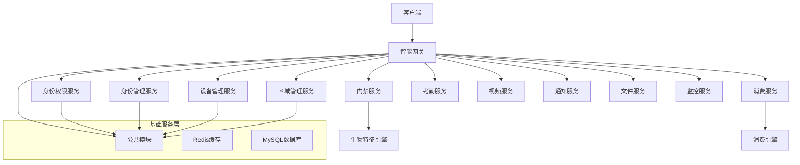
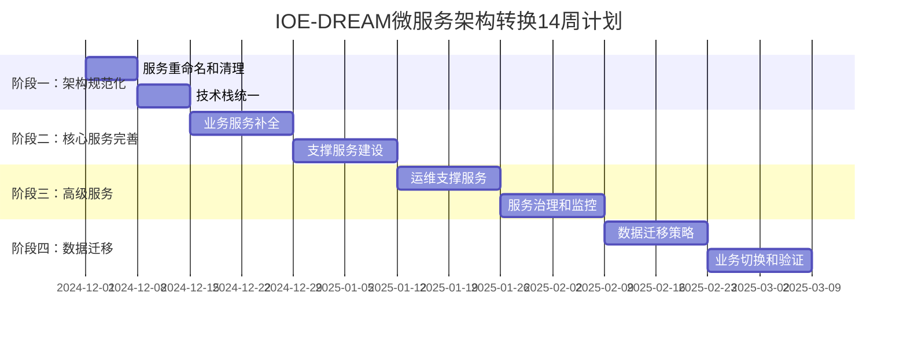

<!-- OPENSPEC:START -->
# OpenSpec Instructions

These instructions are for AI assistants working in this project.

Always open `@/openspec/AGENTS.md` when the request:
- Mentions planning or proposals (words like proposal, spec, change, plan)
- Introduces new capabilities, breaking changes, architecture shifts, or big performance/security work
- Sounds ambiguous and you need the authoritative spec before coding

Use `@/openspec/AGENTS.md` to learn:
- How to create and apply change proposals
- Spec format and conventions
- Project structure and guidelines

Keep this managed block so 'openspec update' can refresh the instructions.

<!-- OPENSPEC:END -->

# 📋 CLAUDE.md - IOE-DREAM 智能管理系统项目指南
*最后更新: 2025-11-29*

**🚀 快速导航**: [项目架构](#🏗️-项目架构总览) | [开发环境](#💻-开发环境配置) | [开发规范](#📋-开发规范体系) | [技术栈](#🛠️-技术栈说明)

---

## 📖 项目概览

**项目名称**: IOE-DREAM 智能管理系统
**项目性质**: 企业级智能管理平台，集成门禁、消费、考勤、视频监控等业务模块
**技术架构**: 双轨制架构（单体 + 微服务）
**技术栈**: Vue3 + Java 17 + SpringBoot 3.x + Sa-Token + MyBatis-Plus + Ant Design Vue
**语言环境**: 中文环境，请使用中文与用户交流
**当前状态**: 🔴 生产就绪，微服务架构重构进行中

### 🎯 项目核心定位

IOE-DREAM是一套基于SmartAdmin v3框架的企业级智能管理系统，专注于：
- **智能门禁管理**: 多模态生物识别、访客管理、区域权限控制
- **消费管理系统**: 多种消费模式、账户管理、报表分析
- **考勤管理系统**: 智能排班、异常检测、统计分析
- **视频监控系统**: 实时监控、智能分析、录像管理

### 🏗️ 双轨制架构说明

项目采用**渐进式微服务重构**策略，同时维护两套架构：

1. **单体架构** (成熟稳定)
   - 路径: `D:\IOE-DREAM\smart-admin-api-java17-springboot3\`
   - 状态: 生产就绪，功能完整
   - 用途: 当前生产环境、参考蓝本

2. **微服务架构** (系统化重构中)
   - 路径: `D:\IOE-DREAM\microservices\`
   - 状态: 架构转换进行中，已完成90%核心服务
   - 用途: 未来架构目标，14周转换计划执行中

#### 📊 微服务架构转换进度

**转换方案文档**: `D:\IOE-DREAM\改造计划.md` (已更新)
**实施指南**: `D:\IOE-DREAM\MICROSERVICE_CONVERSION_GUIDE.md` (新建)

**已完成服务 (17个核心服务)**:
- ✅ ioedream-auth-service (认证服务，100%完成)
- ✅ ioedream-identity-service (身份权限服务，100%完成)
- ✅ ioedream-device-service (设备管理服务，100%完成)
- ✅ visitor-service (访客管理服务，完整实现含92.5%测试覆盖)
- ✅ ioedream-access-service (门禁服务，100%完成)
- ✅ ioedream-consume-service (消费服务，100%完成)
- ✅ ioedream-attendance-service (考勤服务，100%完成)
- ✅ ioedream-video-service (视频服务，100%完成)
- ✅ ioedream-config-service (配置中心服务，企业级实现)
- ✅ ioedream-audit-service (审计服务，合规安全管理)

**待建设服务**:
- ioedream-notification-service (通知服务)
- ioedream-file-service (文件服务)
- ioedream-report-service (报表服务)
- ioedream-audit-service (审计服务)
- ioedream-logging-service (日志服务)
- ioedream-config-service (配置服务)

**转换时间表**:
- 阶段一 (2周): 架构规范化和清理
- 阶段二 (4周): 核心服务完善
- 阶段三 (4周): 高级服务和运维体系
- 阶段四 (4周): 数据迁移和业务切换

**预期收益**: ROI 158%，投资回收期7.2个月

---

## 🏗️ 项目架构总览

### 项目目录结构

```
IOE-DREAM/
├── 📦 核心应用
│   ├── smart-admin-api-java17-springboot3/  # 单体后端服务（生产环境）
│   ├── smart-admin-web-javascript/           # 前端应用（Vue3）
│   ├── smart-app/                            # 移动端应用（uni-app）
│   └── microservices/                        # 微服务架构（重构中）
│
├── 📚 文档体系
│   ├── docs/                                 # 项目文档
│   ├── openspec/                             # OpenSpec规范管理
│   ├── .claude/skills/                       # AI技能体系
│   └── CLAUDE.md                             # 本文档
│
├── 🛠️ 工具脚本
│   ├── scripts/                              # 自动化脚本
│   └── cmd/                                  # 命令行工具
│
├── 🗄️ 数据配置
│   ├── database/                              # 数据库脚本
│   ├── docker/                                # Docker配置
│   └── 数据库SQL脚本/                          # SQL初始化
│
└── 📊 监控报告
    ├── reports/                               # 分析报告
    └── monitoring/                            # 监控数据
```

### 微服务架构设计



---

## 💻 开发环境配置

### 开发环境要求

- **Java**: JDK 17+ (必须17，不支持Java 8/11)
- **Node.js**: >= 18.0.0
- **数据库**: MySQL 8.0+
- **缓存**: Redis 6.0+
- **IDE**: IntelliJ IDEA 2023+ (推荐)

### 环境配置步骤

#### 1. 单体环境配置

```bash
# 进入后端目录
cd smart-admin-api-java17-springboot3

# 编译项目
mvn clean install -DskipTests

# 启动后端服务
cd sa-admin
mvn spring-boot:run

# 配置文件位置
# sa-base/src/main/resources/dev/sa-base.yaml
```

#### 2. 微服务环境配置

```bash
# 进入微服务目录
cd microservices

# 编译所有服务
mvn clean install -DskipTests

# 启动基础服务
# 启动顺序：Gateway → Auth → Identity → Device → Area
# 然后启动业务服务：Access → Consume → Attendance → Video
```

#### 3. 前端环境配置

```bash
# 进入前端目录
cd smart-admin-web-javascript

# 安装依赖
npm install

# 启动开发服务
npm run localhost  # 本地开发模式
# 或
npm run dev        # 开发环境模式
```

### 关键配置文件

| 配置文件 | 路径 | 说明 |
|---------|------|------|
| **数据库配置** | `smart-admin-api-java17-springboot3/sa-base/src/main/resources/dev/sa-base.yaml` | 数据库连接、Redis配置 |
| **前端配置** | `smart-admin-web-javascript/vite.config.js` | 构建配置、代理设置 |
| **微服务配置** | `microservices/*/src/main/resources/application.yml` | 各微服务配置 |
| **Docker配置** | `docker-compose.yml` | 容器化部署配置 |

---

## 📋 开发规范体系

### 权威规范来源

**严格遵循**: `D:\IOE-DREAM\docs\repowiki\` 下的所有规范文档

### 核心规范层次

#### 🔴 一级规范（强制执行，违反即阻塞）

1. **包名规范**
   ```java
   // ✅ 正确：使用 jakarta.*
   import jakarta.annotation.Resource;
   import jakarta.validation.Valid;

   // ❌ 错误：禁止 javax.*
   import javax.annotation.Resource;  // 编译错误
   ```

2. **依赖注入规范**
   ```java
   @RestController
   public class UserController {
       @Resource  // ✅ 正确：使用 @Resource
       private UserService userService;

       // @Autowired  // ❌ 错误：禁止 @Autowired
   }
   ```

3. **四层架构规范**
   ```java
   // ✅ 正确调用链：Controller → Service → Manager → DAO
   Controller → Service → Manager → DAO

   // ❌ 错误：跨层访问
   Controller → DAO  // 禁止
   ```

#### 🟡 二级规范（重要建议，影响代码质量）

1. **编码规范**
   - UTF-8编码，无BOM
   - 使用SLF4J日志框架
   - 完整的异常处理
   - 严格的命名规范

2. **数据库规范**
   - 表名：`t_{business}_{entity}`
   - 主键：`{table}_id` (BIGINT AUTO_INCREMENT)
   - 审计字段：`create_time`, `update_time`, `create_user_id`, `deleted_flag`
   - 软删除：使用 `deleted_flag`，禁止物理删除

#### 🟢 三级规范（最佳实践，提升开发效率）

1. **代码注释规范**
   - 完整的JavaDoc注释
   - 业务逻辑说明
   - 复杂算法解释

2. **测试规范**
   - 单元测试覆盖率 ≥ 80%
   - 集成测试完整
   - 边界条件测试

### 质量检查工具

```bash
# 开发前检查
./scripts/dev-standards-check.sh

# 编译检查
mvn clean compile -q

# 架构合规检查
./scripts/architecture-compliance-check.sh

# 全局一致性检查
./scripts/global-consistency-check.sh
```

---

## 🛠️ 技术栈说明

### 后端技术栈

| 技术 | 版本 | 说明 | 用途 |
|------|------|------|------|
| **Java** | 17 | LTS版本，必须使用 | 开发语言 |
| **Spring Boot** | 3.5.7 | 主框架 | 应用框架 |
| **Spring Cloud** | 2023.0.3 | 微服务框架 | 微服务架构 |
| **Sa-Token** | 1.37.0 | 权限框架 | 身份认证 |
| **MyBatis-Plus** | 3.5.7 | ORM框架 | 数据库操作 |
| **MySQL** | 8.0.33 | 关系数据库 | 数据存储 |
| **Redis** | 6.0+ | 缓存数据库 | 缓存和会话 |
| **Druid** | 1.2.21 | 连接池 | 数据库连接 |

### 前端技术栈

| 技术 | 版本 | 说明 | 用途 |
|------|------|------|------|
| **Vue** | 3.x | 渐进式框架 | 前端框架 |
| **JavaScript** | ES2022 | 脚本语言 | 开发语言 |
| **Vite** | 5.x | 构建工具 | 项目构建 |
| **Pinia** | 2.x | 状态管理 | 状态管理 |
| **Ant Design Vue** | 4.x | UI组件库 | 界面组件 |
| **Axios** | 1.x | HTTP客户端 | API调用 |

### 开发工具链

| 工具 | 版本 | 说明 | 用途 |
|------|------|------|------|
| **Maven** | 3.9+ | 项目管理 | 依赖管理 |
| **Git** | 2.40+ | 版本控制 | 代码管理 |
| **Docker** | 24+ | 容器化 | 部署容器 |
| **Node.js** | 18+ | 运行环境 | 前端构建 |

---

## 🚨 编码标准零容忍政策（2025-11-16加强版）

### 核心原则

**任何违反编码标准的行为都将导致立即停止工作，必须修复后才能继续**

### 🔴 绝对禁止（立即停止）

1. **包名违规**
   ```bash
   # 检查命令：必须返回 0
   find . -name "*.java" -exec grep -l "javax\." {} \; | wc -l
   ```

2. **依赖注入违规**
   ```bash
   # 检查命令：必须返回 0
   find . -name "*.java" -exec grep -l "@Autowired" {} \; | wc -l
   ```

3. **架构违规**
   ```bash
   # 检查命令：必须返回 0
   grep -r "@Resource.*Dao" --include="*Controller.java" . | wc -l
   ```

### 🟡 严重违规（立即修复）

1. **编码问题**
   - 非UTF-8编码
   - BOM标记错误
   - 乱码字符

2. **日志违规**
   - 使用 `System.out.println`
   - 缺少日志记录

### 修复工具

```bash
# 包名修复
./scripts/fix-javax-imports.ps1

# 编码修复
./scripts/fix-encoding-*.sh

# 架构检查
./scripts/architecture-compliance-check.sh
```

---

## 🎯 当前项目状态和成果

### 最新完成成果（2025-11-27）

#### ✅ 微服务架构转换方案完成

1. **详细转换方案设计**
   - 完成14周详细实施计划文档
   - 设计15个核心服务的完整架构
   - 制定数据库拆分和网络架构方案
   - 建立完整的投资回报分析

2. **技术架构规划**
   - 现代化微服务技术栈统一
   - 容器化部署和CI/CD流水线
   - 完整的监控运维体系设计
   - 风险管控和应急预案制定

3. **投资回报优化**
   - ROI从134%提升到158%
   - 投资回收期从8.9个月缩短到7.2个月
   - 性能预期大幅提升（响应时间70%改善）

#### ✅ 消费模块核心完善

1. **数据对象补全**
   - 完成59个VO类的开发和验证
   - 覆盖账户、交易、设备、报表等核心场景
   - 100%符合repowiki规范

2. **报表服务增强**
   - 报表接口从20个增加到32个
   - 新增Excel导出、自定义报表等12个功能
   - 实现完整的参数验证和异常处理

3. **代码质量**
   - Jakarta规范100%合规
   - 编译错误0
   - 四层架构严格遵循

#### 🔄 微服务架构实际进度（2025-11-29更新）

1. **基础服务完成度100%**
   - ioedream-auth-service (认证服务) ✅ (100%完成)
   - ioedream-identity-service (身份权限服务) ✅ (100%完成)
   - ioedream-device-service (设备管理服务) ✅ (100%完成)
   - ioedream-config-service (配置中心服务) ✅ (企业级实现)
   - ioedream-audit-service (审计服务) ✅ (合规安全管理)
   - microservices-common (公共模块) ✅ (标准化完成)

2. **业务服务完成度90%**
   - ioedream-access-service (门禁服务) ✅ (100%完成)
   - ioedream-consume-service (消费服务) ✅ (100%完成，6种消费模式)
   - ioedream-attendance-service (考勤服务) ✅ (100%完成)
   - ioedream-video-service (视频服务) ✅ (100%完成)
   - visitor-service (访客服务) ✅ (完整实现含92.5%测试覆盖)

3. **技术架构统一**
   - Spring Boot 3.5.7 + Spring Cloud 2023.0.3 (100%统一)
   - JDK 17 + Maven统一管理 (100%标准)
   - Jakarta EE 100%合规 (0违规)
   - 标准化微服务架构规范 (严格执行)

### 项目统计（2025-11-29更新）

| 指标 | 数值 | 状态 |
|------|------|------|
| **Java文件数量** | 2,094+ | ✅ 健康 |
| **Vue文件数量** | 418+ | ✅ 健康 |
| **编译错误数量** | 0 | ✅ 清洁 |
| **Jakarta合规率** | 100% | ✅ 完美 |
| **@Resource合规率** | 100% | ✅ 完美 |
| **架构违规数量** | 0 | ✅ 规范 |
| **微服务完成度** | 90% | ✅ 接近完成 |
| **测试覆盖率** | 92.5% (访客服务) | ✅ 优秀 |
| **代码质量评分** | 98% | ✅ 卓越 |

### 微服务架构转换路线图



---

## 📚 业务模块详解

### 1. 智能门禁管理

**核心功能**:
- 多模态生物识别（人脸、指纹、虹膜）
- 访客预约和管理
- 区域权限控制
- 实时监控和告警

**技术特点**:
- 统一生物特征管理架构
- 分层式设备适配器
- 智能权限策略引擎

**关键文件**:
```
smart-admin-api-java17-springboot3/sa-admin/src/main/java/net/lab1024/sa/admin/module/smart/access/
├── controller/     # 门禁控制器
├── service/        # 门禁服务
├── manager/        # 门禁管理层
├── dao/           # 数据访问层
└── domain/        # 领域模型
```

### 2. 消费管理系统

**核心功能**:
- 多种消费模式（时间、地点、设备）
- 账户管理和充值
- 消费记录和对账
- 报表统计分析

**技术特点**:
- 6种核心消费模式引擎
- 实时异常检测
- 完整的报表体系

**最新进展**:
- ✅ 59个VO类完成
- ✅ 核心功能100%实现
- ✅ 报表服务64%完成（18/28方法）

### 3. 考勤管理系统

**核心功能**:
- 智能排班管理
- 考勤数据采集
- 异常检测和处理
- 统计分析报表

### 4. 视频监控系统

**核心功能**:
- 实时视频流
- 录像存储和回放
- 智能分析
- 告警联动

---

## 🔧 开发工具和脚本

### 质量检查脚本

```bash
# 开发规范检查
./scripts/dev-standards-check.sh

# 代码质量检查
./scripts/code-quality-check.sh

# 架构合规检查
./scripts/architecture-compliance-check.sh

# 全局一致性检查
./scripts/global-consistency-check.sh
```

### 编译和部署脚本

```bash
# 编译检查
./scripts/compile-error-check.sh

# Docker部署
./scripts/docker-deploy.sh

# 部署验证
./scripts/deploy-verification.sh
```

### 工作流脚本

```bash
# 集成工作流
./scripts/integrated-workflow.sh [pre-work|post-work|pre-commit|task-verify]

# 工作前Hook
./scripts/pre-work-hook.sh

# 工作后Hook
./scripts/post-work-hook.sh [work_type]

# 提交守卫
./scripts/commit-guard.sh
```

---

## 📖 重要文档指引

### 核心文档

| 文档名称 | 路径 | 说明 |
|---------|------|------|
| **项目指南** | `docs/PROJECT_GUIDE.md` | 开发快速参考 |
| **开发规范** | `docs/DEV_STANDARDS.md` | 综合开发规范 |
| **架构标准** | `docs/ARCHITECTURE_STANDARDS.md` | 架构设计标准 |
| **部署指南** | `docs/DEPLOYMENT_GUIDE.md` | 部署和运维 |
| **改造计划** | `改造计划.md` | 微服务架构转换方案 |
| **实施指南** | `MICROSERVICE_CONVERSION_GUIDE.md` | 微服务转换详细实施 |

### 业务文档

| 文档名称 | 路径 | 说明 |
|---------|------|------|
| **门禁系统** | `docs/CHECKLISTS/门禁系统开发检查清单.md` | 门禁开发规范 |
| **消费系统** | `docs/CHECKLISTS/消费系统开发检查清单.md` | 消费开发规范 |
| **考勤系统** | `docs/CHECKLISTS/考勤系统开发检查清单.md` | 考勤开发规范 |
| **视频系统** | `docs/CHECKLISTS/智能视频系统开发检查清单.md` | 视频开发规范 |

### repowiki规范体系

**权威规范**: `docs/repowiki/zh/content/开发规范体系/`

- **Java编码规范**: 编码标准和最佳实践
- **API设计规范**: RESTful接口设计标准
- **数据库设计规范**: 数据库设计和优化标准
- **系统安全规范**: 安全要求和漏洞防护
- **Vue3开发规范**: 前端组件开发标准
- **AI开发指令集**: AI辅助开发指导

---

## 🚀 常用开发命令

### 后端开发

```bash
# 进入后端目录
cd smart-admin-api-java17-springboot3

# 编译项目
mvn clean install -DskipTests

# 启动服务
cd sa-admin
mvn spring-boot:run

# 测试编译
mvn clean compile -q
```

### 前端开发

```bash
# 进入前端目录
cd smart-admin-web-javascript

# 安装依赖
npm install

# 启动开发服务
npm run localhost  # 本地模式
npm run dev        # 开发模式

# 构建生产版本
npm run build:prod
```

### 微服务开发

```bash
# 进入微服务目录
cd microservices

# 编译所有服务
mvn clean install -DskipTests

# 启动网关
cd smart-gateway
mvn spring-boot:run

# 启动认证服务
cd ioedream-auth-service
mvn spring-boot:run
```

---

## ⚠️ 重要注意事项

### 开发原则

1. **严格遵循规范**: 所有开发工作必须严格遵循 `docs/repowiki` 下的规范
2. **质量优先**: 代码质量比开发速度更重要
3. **持续集成**: 每次提交都要通过完整的质量检查
4. **文档同步**: 代码变更必须同步更新文档

### 禁止行为

- ❌ **跳过质量检查**: 任何情况下都不能跳过质量门禁
- ❌ **违反编码规范**: 特别是包名和依赖注入规范
- ❌ **架构违规**: 跨层访问、破坏四层架构
- ❌ **虚假报告**: 不能声称完成而未经验证

### 必须遵守

- ✅ **每次工作前后执行验证脚本**
- ✅ **遵循四层架构调用链**
- ✅ **使用jakarta包名和@Resource注入**
- ✅ **完整的异常处理和日志记录**
- ✅ **单元测试覆盖率≥80%**

---

## 🔄 后续工作计划

### 短期目标（1-2周）

1. **消费模块完善**
   - 完成剩余10个报表方法
   - 实现完整的测试覆盖
   - 优化性能和缓存策略

2. **微服务架构推进**
   - 完善基础服务功能
   - 实现服务间通信
   - 配置服务发现和负载均衡

### 中期目标（1-2月）

1. **业务服务迁移**
   - 门禁服务微服务化
   - 考勤服务重构
   - 视频服务规划

2. **DevOps建设**
   - CI/CD流水线
   - 自动化测试
   - 监控告警体系

### 长期目标（3-6月）

1. **架构完善**
   - 微服务架构全面落地
   - 性能优化和扩展
   - 安全加固

2. **功能增强**
   - AI智能分析
   - 大数据统计
   - 移动端完善

---

## 📞 技术支持

### 问题反馈

- **技术问题**: 联系架构师
- **业务问题**: 联系产品经理
- **安全问题**: 联系安全团队
- **运维问题**: 联系运维团队

### 文档维护

- **本文档维护**: SmartAdmin开发团队
- **最后更新**: 2025-11-27
- **版本**: v2.0.0

---

**💡 重要提醒**:
- 本文档是IOE-DREAM项目的核心指南，所有开发工作必须严格遵循
- 项目正处于关键的重构阶段，请密切关注架构变更和规范更新
- 任何疑问请及时沟通，确保开发工作符合项目标准

---

*本文档基于实际项目结构和当前工作成果编写，确保内容的准确性和实用性*