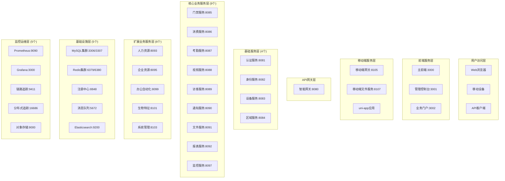

# IOE-DREAM 微服务完整部署指南

## 📋 概述

本指南提供IOE-DREAM微服务架构的完整部署方案，包含**29个服务**（19个后端微服务 + 3个前端微服务 + 3个移动端服务 + 4个基础设施服务）的详细部署流程和运维手册。

### 🎯 架构总览



## 🚀 快速部署

### 环境要求

#### 硬件要求
```
最小配置:
├── CPU: 16核心
├── 内存: 64GB
├── 磁盘: 1TB SSD
└── 网络: 10Gbps

推荐配置:
├── CPU: 32核心
├── 内存: 128GB
├── 磁盘: 2TB NVMe SSD
└── 网络: 25Gbps
```

#### 软件要求
```
必需软件:
├── Docker 20.10+
├── Docker Compose 1.29+
├── Git 2.30+
├── Java 17+ (用于本地开发)
├── Node.js 18+ (用于前端开发)
└── kubectl (用于Kubernetes部署)
```

### 一键部署命令

#### Linux/macOS
```bash
# 1. 克隆项目
git clone https://github.com/your-org/ioedream.git
cd ioedream/microservices/docker

# 2. 设置执行权限
chmod +x *.sh

# 3. 完整部署（所有服务）
./start-services.sh start complete

# 4. 验证部署
./health-check.sh
```

#### Windows
```batch
# 1. 克隆项目
git clone https://github.com/your-org/ioedream.git
cd ioedream\microservices\docker

# 2. 完整部署
start-services.bat start complete

# 3. 验证部署
health-check.bat
```

## 📋 分阶段部署方案

### 阶段1: 基础设施部署 (5-10分钟)
```bash
./start-services.sh start infra
```

**部署服务:**
- MySQL主从集群 (3306/3307)
- Redis集群 (6379/6380)
- Nacos注册中心 (8848)
- RabbitMQ消息队列 (5672)
- Elasticsearch搜索引擎 (9200)

### 阶段2: 基础服务部署 (5-8分钟)
```bash
./start-services.sh start basic
```

**部署服务:**
- 认证服务 (8081)
- 身份服务 (8082)
- 设备服务 (8083)
- 区域服务 (8084)

### 阶段3: 核心业务服务部署 (8-15分钟)
```bash
./start-services.sh start business
```

**部署服务:**
- 智能网关 (8080)
- 门禁服务 (8085)
- 消费服务 (8086)
- 考勤服务 (8087)
- 视频服务 (8088)
- 访客服务 (8089)
- 通知服务 (8090)
- 文件服务 (8091)
- 报表服务 (8092)

### 阶段4: 扩展业务服务部署 (10-20分钟)
```bash
./start-services.sh start extended
```

**部署服务:**
- 人力资源服务 (8093)
- 企业资源服务 (8095)
- 监控服务 (8097)
- 办公自动化服务 (8099)
- 生物特征服务 (8101)
- 系统管理服务 (8103)

### 阶段5: 前端微服务部署 (3-5分钟)
```bash
./start-services.sh start frontend
```

**部署服务:**
- 主前端应用 (3000)
- 管理控制台 (3001)
- 业务门户 (3002)

### 阶段6: 移动端架构部署 (3-5分钟)
```bash
./start-services.sh start mobile
```

**部署服务:**
- 移动端网关 (8105)
- 移动端文件服务 (8107)
- uni-app应用

### 阶段7: 监控运维部署 (5-8分钟)
```bash
./start-services.sh start monitoring
```

**部署服务:**
- Prometheus (9090)
- Grafana (3000)
- Zipkin (9411)
- Jaeger (16686)
- MinIO (9000)

## 🔧 服务配置详解

### 环境变量配置

#### 数据库配置
```bash
# MySQL主库
DB_HOST=mysql-master
DB_PORT=3306
DB_NAME=ioedream_prod
DB_USERNAME=app_user
DB_PASSWORD=secure_password

# MySQL从库
DB_SLAVE_HOST=mysql-slave
DB_SLAVE_PORT=3307
```

#### 缓存配置
```bash
# Redis配置
REDIS_HOST=redis-master
REDIS_PORT=6379
REDIS_PASSWORD=
REDIS_DATABASE=0

# Redis集群
REDIS_NODES=redis-master:6379,redis-slave:6380
REDIS_SENTINEL_NODES=sentinel1:26379,sentinel2:26379,sentinel3:26379
```

#### 服务注册配置
```bash
# Nacos配置
NACOS_SERVER_ADDR=nacos-cluster:8848
NACOS_NAMESPACE=prod
NACOS_GROUP=PROD_GROUP
NACOS_CLUSTER=PROD
```

### Docker Compose配置文件

#### 完整服务清单
```yaml
# infrastructure.yml - 基础设施
services:
  mysql-master, mysql-slave
  redis-master, redis-slave
  nacos, rabbitmq, elasticsearch

# basic-services.yml - 基础服务
services:
  ioedream-auth-service:8081
  ioedream-identity-service:8082
  ioedream-device-service:8083
  ioedream-area-service:8084

# business-services.yml - 核心业务
services:
  smart-gateway:8080
  ioedream-access-service:8085
  ioedream-consume-service:8086
  ioedream-attendance-service:8087
  ioedream-video-service:8088
  ioedream-visitor-service:8089
  ioedream-notification-service:8090
  ioedream-file-service:8091
  ioedream-report-service:8092

# extended-services.yml - 扩展业务
services:
  ioedream-hr-service:8093
  ioedream-erp-service:8095
  ioedream-monitor-service:8097
  ioedream-oa-service:8099
  ioedream-biometric-service:8101
  ioedream-system-service:8103
  ioedream-web-main:3000
  ioedream-admin-console:3001
  ioedream-business-portal:3002
  ioedream-mobile-gateway:8105

# frontend-services.yml - 前端微服务
services:
  ioedream-web-main:3000
  ioedream-admin-console:3001
  ioedream-business-portal:3002

# mobile-services.yml - 移动端架构
services:
  ioedream-mobile-gateway:8105
  ioedream-mobile-file-server:8107

# monitoring.yml - 监控运维
services:
  prometheus:9090
  grafana:3000
  zipkin:9411
  jaeger:16686
  minio:9000
```

## 📊 端口分配表

### 后端服务端口
| 服务名 | 端口 | 管理端口 | 功能描述 |
|--------|------|----------|----------|
| smart-gateway | 8080 | 8081 | API网关 |
| ioedream-auth-service | 8081 | 8082 | 认证服务 |
| ioedream-identity-service | 8082 | 8083 | 身份服务 |
| ioedream-device-service | 8083 | 8084 | 设备服务 |
| ioedream-area-service | 8084 | 8085 | 区域服务 |
| ioedream-access-service | 8085 | 8086 | 门禁服务 |
| ioedream-consume-service | 8086 | 8087 | 消费服务 |
| ioedream-attendance-service | 8087 | 8088 | 考勤服务 |
| ioedream-video-service | 8088 | 8089 | 视频服务 |
| ioedream-visitor-service | 8089 | 8090 | 访客服务 |
| ioedream-notification-service | 8090 | 8091 | 通知服务 |
| ioedream-file-service | 8091 | 8092 | 文件服务 |
| ioedream-report-service | 8092 | 8093 | 报表服务 |
| ioedream-hr-service | 8093 | 8094 | 人力资源 |
| ioedream-erp-service | 8095 | 8096 | 企业资源 |
| ioedream-monitor-service | 8097 | 8098 | 监控服务 |
| ioedream-oa-service | 8099 | 8100 | 办公自动化 |
| ioedream-biometric-service | 8101 | 8102 | 生物特征 |
| ioedream-system-service | 8103 | 8104 | 系统管理 |
| ioedream-mobile-gateway | 8105 | 8106 | 移动端网关 |

### 前端服务端口
| 服务名 | 端口 | 功能描述 |
|--------|------|----------|
| ioedream-web-main | 3000 | 主前端应用 |
| ioedream-admin-console | 3001 | 管理控制台 |
| ioedream-business-portal | 3002 | 业务门户 |

### 基础设施端口
| 服务名 | 端口 | 用户界面 | 功能描述 |
|--------|------|----------|----------|
| mysql-master | 3306 | - | MySQL主库 |
| mysql-slave | 3307 | - | MySQL从库 |
| redis-master | 6379 | - | Redis主库 |
| redis-slave | 6380 | - | Redis从库 |
| nacos | 8848 | 8848/nacos | 注册中心 |
| rabbitmq | 5672 | 15672 | 消息队列 |
| elasticsearch | 9200 | 9200/_plugin/head | 搜索引擎 |

### 监控运维端口
| 服务名 | 端口 | 功能描述 |
|--------|------|----------|
| prometheus | 9090 | 指标收集 |
| grafana | 3000 | 数据可视化 |
| zipkin | 9411 | 链路追踪 |
| jaeger | 16686 | 分布式追踪 |
| minio | 9000/9001 | 对象存储 |

## 🔍 健康检查和监控

### 自动化健康检查
```bash
# 完整健康检查
./health-check.sh

# 快速检查关键服务
./health-check.sh --quick

# 生成健康报告
./health-check.sh --report

# 检查指定服务
./health-check.sh --services nacos,gateway
```

### 服务状态检查脚本
```bash
#!/bin/bash
# 检查所有服务状态
check_all_services() {
    echo "🔍 检查所有微服务状态..."

    services=(
        "nacos:8848"
        "mysql-master:3306"
        "redis-master:6379"
        "smart-gateway:8080"
        "ioedream-auth-service:8081"
        "ioedream-identity-service:8082"
        # ... 添加所有其他服务
    )

    for service in "${services[@]}"; do
        name=$(echo $service | cut -d':' -f1)
        port=$(echo $service | cut -d':' -f2)

        if nc -z localhost $port 2>/dev/null; then
            echo "✅ $name ($port) - 运行正常"
        else
            echo "❌ $name ($port) - 不可访问"
        fi
    done
}
```

### Prometheus监控配置
```yaml
# prometheus.yml
global:
  scrape_interval: 15s
  evaluation_interval: 15s

scrape_configs:
  - job_name: 'ioedream-microservices'
    consul_sd_configs:
      - server: 'nacos:8848'
        services: []
    relabel_configs:
      - source_labels: [__meta_consul_service]
        target_label: service
```

## 🚨 故障排除

### 常见问题和解决方案

#### 1. 服务启动失败
```bash
# 检查容器状态
docker ps -a

# 查看服务日志
docker logs <container_name>

# 检查资源使用
docker stats

# 重新启动服务
docker-compose restart <service_name>
```

#### 2. 端口冲突
```bash
# 检查端口占用
netstat -tulpn | grep :8080
lsof -i :8080

# 修改端口配置
vim infrastructure.yml  # 修改服务端口
```

#### 3. 内存不足
```bash
# 查看系统资源
free -h
df -h

# 清理无用镜像
docker image prune -f
docker volume prune -f
```

#### 4. 网络连接问题
```bash
# 检查网络连通性
docker exec <container> ping <other_container>
docker network ls

# 重建网络
docker network down ioedream-network
docker network up ioedream-network
```

### 紧急故障恢复流程

#### 1. 完全重启
```bash
# 停止所有服务
./start-services.sh stop

# 等待10秒
sleep 10

# 重新启动所有服务
./start-services.sh start complete
```

#### 2. 数据库恢复
```bash
# 恢复MySQL数据
docker exec -i mysql-master mysql -u root -p < backup.sql

# 恢复Redis数据
docker cp redis_backup.rdb redis-master:/data/dump.rdb
docker restart redis-master
```

#### 3. 配置回滚
```bash
# 回滚到上一个版本
git checkout <previous_commit_tag>
./start-services.sh stop
./start-services.sh start complete
```

## 📈 性能优化建议

### JVM参数优化
```bash
# 设置JVM参数
JAVA_OPTS="-Xms2g -Xmx4g -XX:+UseG1GC -XX:MaxGCPauseMillis=200"
```

### 数据库优化
```sql
-- MySQL优化配置
SET GLOBAL innodb_buffer_pool_size = 2147483648;
SET GLOBAL innodb_log_file_size = 268435456;
SET GLOBAL innodb_flush_log_at_trx_commit = 2;
```

### Redis优化
```bash
# Redis配置优化
maxmemory 2gb
maxmemory-policy allkeys-lru
save 900 1
save 300 10
save 60 10000
```

## 🔒 安全配置

### 网络安全
```yaml
# Docker网络配置
networks:
  ioedream-network:
    driver: bridge
    ipam:
      config:
        - subnet: 172.20.0.0/16
          gateway: 172.20.0.1
```

### 访问控制
- **内部服务**: 仅限内部网络访问
- **外部服务**: 通过Nginx反向代理访问
- **管理界面**: 基础认证 + IP白名单

### 敏感信息管理
```bash
# 使用Docker secrets
echo "your_db_password" | docker secret create db_password -
echo "your_redis_password" | docker secret create redis_password -
```

## 📋 运维手册

### 日常运维检查清单
```bash
# 每日检查
[ ] 检查服务状态
[ ] 检查磁盘空间
[ ] 检查内存使用
[ ] 查看错误日志
[ ] 检查数据库性能

# 每周检查
[ ] 数据备份验证
[ ] 性能指标分析
[ ] 安全漏洞扫描
[ ] 日志归档清理
[ ] 配置备份更新
```

### 备份策略
```bash
# 每日备份脚本
#!/bin/bash
BACKUP_DIR="/backup/$(date +%Y%m%d)"
mkdir -p $BACKUP_DIR

# 备份MySQL
docker exec mysql-master mysqldump -u root -p --all-databases > $BACKUP_DIR/mysql_backup.sql

# 备份Redis
docker exec redis-master redis-cli BGSAVE
docker cp redis-master:/data/dump.rdb $BACKUP_DIR/redis_backup.rdb

# 备份配置文件
tar -czf $BACKUP_DIR/config.tar.gz ./config/
```

### 监控告警配置
```yaml
# Prometheus告警规则
groups:
- name: ioedream-alerts
  rules:
  - alert: ServiceDown
    expr: up == 0
    for: 1m
    labels:
      severity: critical
    annotations:
      summary: "服务 {{ $labels.job }} 已下线"
      description: "服务 {{ $labels.job }} 已下线超过1分钟"
```

## 📚 相关文档

- [微服务架构设计](./docs/microservice-architecture.md)
- [API文档](./docs/api-documentation.md)
- [数据库设计](./docs/database-design.md)
- [安全配置](./docs/security-configuration.md)
- [性能调优](./docs/performance-tuning.md)
- [故障排除](./docs/troubleshooting.md)

---

**文档版本**: v3.0.0
**更新时间**: 2025-11-27
**维护者**: IOE-DREAM DevOps团队

**快速联系**:
- 技术支持: devops@ioedream.com
- 运维支持: ops@ioedream.com
- 紧急热线: +86-xxx-xxxx-xxxx