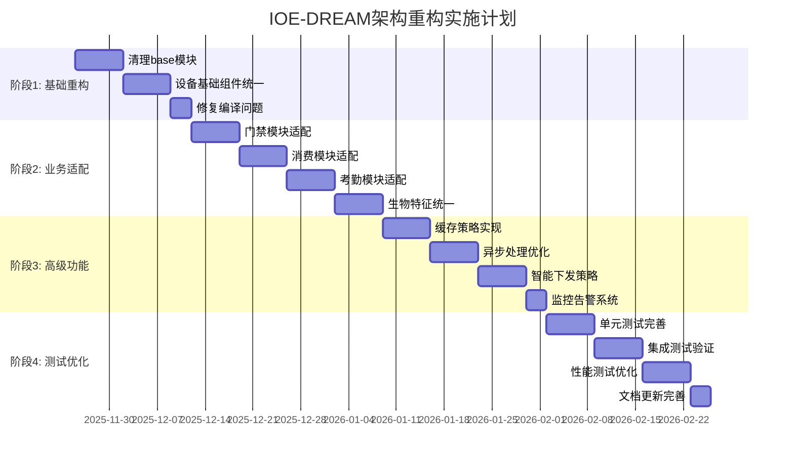

# IOE-DREAM 架构重构实施工作计划

**文档版本**: v1.0.0
**创建时间**: 2025-11-25
**计划周期**: 8-10周
**项目负责人**: SmartAdmin AI Assistant

## 📋 执行概览

基于《IOE-DREAM架构重构分析报告》，本文档制定了详细的实施工作计划，包含4个主要阶段，总计150+个具体任务，确保架构重构有序、高效、低风险地进行。

### 核心目标
- ✅ 解决所有编译问题，实现0编译错误
- ✅ 建立清晰的模块边界，base=通用，admin=业务
- ✅ 统一设备管理和生物特征管理
- ✅ 提升代码质量，达到企业级标准

### 实施策略
- **渐进式重构**: 分阶段实施，降低风险
- **向后兼容**: 保证现有功能不受影响
- **质量优先**: 每个阶段都有明确的质量门禁
- **文档同步**: 实时更新相关技术文档

---

## 🎯 总体时间规划



---

## 📅 阶段1: 基础组件重构 (第1-2周)

### 阶段目标
- 建立清晰的模块边界
- 解决所有编译问题
- 统一设备基础组件

### 阶段1详细任务清单

#### 1.1 清理base模块业务特定组件 (1-3天)

**任务1.1.1**: 移除业务特定适配器
- [ ] 删除 `sa-base/module/area/adapter/` 目录
- [ ] 移除 `AccessAreaAdapter.java`
- [ ] 移除 `AttendanceAreaAdapter.java`
- [ ] 移除 `ConsumeAreaAdapter.java`
- [ ] 移除 `VideoAreaAdapter.java`
- [ ] 移除 `HttpPersonDispatchAdapter.java`

**任务1.1.2**: 移除业务特定引擎
- [ ] 删除 `sa-base/module/area/engine/` 目录
- [ ] 移除 `DeviceDispatchEngine.java`
- [ ] 移除相关业务特定组件

**任务1.1.3**: 暂时禁用复杂管理器
- [ ] 禁用 `PersonAreaCacheManager.java` (依赖业务逻辑)
- [ ] 禁用 `BiometricCacheManager.java` (需要重构)
- [ ] 创建基础版本的缓存管理器

**验收标准**:
- ✅ base模块无业务特定组件
- ✅ 编译错误减少50%以上

#### 1.2 设备基础组件统一化 (3-4天)

**任务1.2.1**: 统一SmartDeviceEntity
- [ ] 确认 `SmartDeviceEntity` 在 `sa-base/common/device/entity/`
- [ ] 验证字段完整性，包含设备基础信息
- [ ] 实现设备类型枚举
- [ ] 实现设备状态枚举

**任务1.2.2**: 统一设备接口定义
- [ ] 完善 `DeviceAdapterInterface.java`
- [ ] 定义 `DeviceDispatchResult.java`
- [ ] 定义 `DeviceProtocolException.java`
- [ ] 定义 `DeviceConnectionTest.java`

**任务1.2.3**: 统一设备DAO
- [ ] 创建 `SmartDeviceDao.java`
- [ ] 实现基础CRUD方法
- [ ] 实现设备查询方法
- [ ] 添加索引优化

**验收标准**:
- ✅ 设备基础组件在base模块完整可用
- ✅ 各业务模块可正常引用设备组件

#### 1.3 修复编译问题 (2-3天)

**任务1.3.1**: 修复导入路径错误
- [ ] 批量修复 `SmartDeviceEntity` 导入路径
- [ ] 修复 `DeviceDispatchResult` 导入路径
- [ ] 修复 `DeviceProtocolException` 导入路径
- [ ] 验证所有导入路径正确性

**任务1.3.2**: 解决依赖冲突
- [ ] 移除Spring Retry依赖 (如果不需要)
- [ ] 修复Caffeine缓存依赖问题
- [ ] 解决循环依赖问题
- [ ] 统一Jackson版本

**任务1.3.3**: 修复缺失类和方法
- [ ] 创建缺失的VO类
- [ ] 实现缺失的Form类
- [ ] 补全缺失的业务方法
- [ ] 添加缺失的注解

**验收标准**:
- ✅ 编译错误为0
- ✅ 所有测试类可以正常编译
- ✅ 项目可以正常启动

### 阶段1质量门禁

**编译检查**:
```bash
mvn clean compile -q
# 期望: 0错误

find . -name "*.java" -exec grep -l "javax\." {} \; | wc -l
# 期望: 0个javax EE包引用

find . -name "*.java" -exec grep -l "@Autowired" {} \; | wc -l
# 期望: 0个@Autowired使用
```

---

## 📅 阶段2: 业务模块适配 (第3-6周)

### 阶段目标
- 各业务模块适配新架构
- 实现设备适配器模式
- 统一生物特征管理

### 阶段2详细任务清单

#### 2.1 门禁模块适配 (1周)

**任务2.1.1**: 门禁设备适配器实现
```java
// sa-admin/module/access/adapter/AccessDeviceAdapter.java
@Component
public class AccessDeviceAdapter implements DeviceAdapterInterface {

    @Resource
    private Map<String, AccessProtocolInterface> protocolAdapters;

    @Override
    public DeviceConnectionTest testConnection(SmartDeviceEntity device) {
        AccessProtocolInterface adapter = getProtocolAdapter(device);
        return adapter.testConnection(device);
    }

    @Override
    public DeviceDispatchResult dispatchBiometricData(SmartDeviceEntity device, Map<String, Object> biometricData) {
        AccessProtocolInterface adapter = getProtocolAdapter(device);
        Map<String, Object> accessBiometricData = convertToAccessBiometricData(biometricData);
        return adapter.dispatchBiometricData(device, accessBiometricData);
    }

    private AccessProtocolInterface getProtocolAdapter(SmartDeviceEntity device) {
        String manufacturer = device.getManufacturer();
        return protocolAdapters.get(manufacturer);
    }

    private Map<String, Object> convertToAccessBiometricData(Map<String, Object> biometricData) {
        // 转换为门禁专用格式
    }
}
```

**任务2.1.2**: 协议适配器实现
- [ ] 实现 `ZKTecoAdapter.java`
- [ ] 实现 `HikvisionAdapter.java`
- [ ] 实现 `DahuaAdapter.java`
- [ ] 实现协议注册器

**任务2.1.3**: 门禁业务适配
- [ ] 更新 `AccessDeviceEntity` 继承 `SmartDeviceEntity`
- [ ] 修复门禁相关Service
- [ ] 更新门禁Controller
- [ ] 添加门禁专用字段和方法

**验收标准**:
- ✅ 门禁模块编译通过
- ✅ 门禁设备适配器正常工作
- ✅ 现有门禁功能不受影响

#### 2.2 消费模块适配 (1周)

**任务2.2.1**: 消费设备适配器实现
```java
// sa-admin/module/consume/adapter/ConsumeDeviceAdapter.java
@Component
public class ConsumeDeviceAdapter implements DeviceAdapterInterface {

    @Resource
    private ConsumeProtocolManager protocolManager;

    @Override
    public DeviceDispatchResult dispatchPersonData(SmartDeviceEntity device, Map<String, Object> personData) {
        // 转换为消费设备人员数据格式
        Map<String, Object> consumePersonData = convertToConsumePersonData(personData);

        // 下发到消费设备
        return protocolManager.dispatchPersonData(device, consumePersonData);
    }

    private Map<String, Object> convertToConsumePersonData(Map<String, Object> personData) {
        Map<String, Object> consumeData = new HashMap<>();
        consumeData.put("personId", personData.get("personId"));
        consumeData.put("personCode", personData.get("personCode"));
        consumeData.put("personName", personData.get("personName"));
        consumeData.put("balance", personData.get("balance") != null ? personData.get("balance") : 0);
        consumeData.put("cardNumber", personData.get("cardNumber"));
        consumeData.put("fingerprint", personData.get("fingerprint"));
        consumeData.put("face", personData.get("face"));
        return consumeData;
    }
}
```

**任务2.2.2**: 消费协议管理器
- [ ] 实现 `ConsumeProtocolManager.java`
- [ ] 支持多种消费机协议
- [ ] 实现数据格式转换
- [ ] 添加错误处理机制

**任务2.2.3**: 消费业务适配
- [ ] 更新消费相关Entity
- [ ] 修复消费Service
- [ ] 更新消费Controller
- [ ] 添加消费专用功能

**验收标准**:
- ✅ 消费模块编译通过
- ✅ 消费设备适配器正常工作
- ✅ 消费数据下发功能正常

#### 2.3 考勤模块适配 (1周)

**任务2.3.1**: 考勤设备适配器实现
```java
// sa-admin/module/attendance/adapter/AttendanceDeviceAdapter.java
@Component
public class AttendanceDeviceAdapter implements DeviceAdapterInterface {

    @Override
    public DeviceDispatchResult dispatchPersonData(SmartDeviceEntity device, Map<String, Object> personData) {
        // 转换为考勤设备人员数据格式
        Map<String, Object> attendancePersonData = convertToAttendancePersonData(personData);

        // 下发到考勤设备
        return dispatchToDevice(device, attendancePersonData);
    }

    private Map<String, Object> convertToAttendancePersonData(Map<String, Object> personData) {
        Map<String, Object> attendanceData = new HashMap<>();
        attendanceData.put("employeeId", personData.get("personId"));
        attendanceData.put("employeeCode", personData.get("personCode"));
        attendanceData.put("employeeName", personData.get("personName"));
        attendanceData.put("department", personData.get("department"));
        attendanceData.put("position", personData.get("position"));
        attendanceData.put("workSchedule", personData.get("workSchedule"));
        attendanceData.put("biometricData", personData.get("biometricData"));
        return attendanceData;
    }
}
```

**任务2.3.2**: 考勤业务适配
- [ ] 更新考勤相关Entity
- [ ] 修复考勤Service
- [ ] 更新考勤Controller
- [ ] 实现考勤规则引擎

**验收标准**:
- ✅ 考勤模块编译通过
- ✅ 考勤设备适配器正常工作
- ✅ 考勤数据下发功能正常

#### 2.4 生物特征统一管理 (1周)

**任务2.4.1**: 人员生物特征服务
```java
// sa-admin/module/biometric/service/PersonBiometricService.java
@Service
public class PersonBiometricService {

    @Resource
    private BiometricTemplateDao templateDao;

    @Resource
    private BiometricCacheManager cacheManager;

    /**
     * 获取人员完整生物特征数据
     */
    public Map<String, Object> getUnifiedBiometricData(Long personId) {
        // 1. 尝试从缓存获取
        Map<String, Object> cachedData = cacheManager.getUnifiedBiometricData(personId);
        if (cachedData != null) {
            return cachedData;
        }

        // 2. 从数据库获取并组装
        Map<String, Object> unifiedData = new HashMap<>();

        // 获取人员基本信息
        PersonEntity person = getPersonInfo(personId);
        unifiedData.put("personId", personId);
        unifiedData.put("personCode", person.getPersonCode());
        unifiedData.put("personName", person.getPersonName());

        // 获取生物特征数据
        List<BiometricTemplateEntity> templates = templateDao.selectByPersonId(personId);
        Map<String, List<Map<String, Object>>> biometricData = new HashMap<>();

        for (BiometricTemplateEntity template : templates) {
            String type = template.getBiometricType();
            List<Map<String, Object>> typeData = biometricData.computeIfAbsent(type, k -> new ArrayList<>());

            Map<String, Object> templateData = new HashMap<>();
            templateData.put("biometricType", type);
            templateData.put("templateData", template.getTemplateData()); // SM4加密数据
            templateData.put("qualityScore", template.getQualityScore());
            templateData.put("templateIndex", template.getTemplateIndex());
            templateData.put("isPrimary", template.isPrimary());

            typeData.add(templateData);
        }

        unifiedData.put("biometricData", biometricData);
        unifiedData.put("biometricCount", templates.size());

        // 3. 缓存结果
        cacheManager.cacheUnifiedBiometricData(personId, unifiedData);

        return unifiedData;
    }
}
```

**任务2.4.2**: 生物特征缓存管理器
```java
// sa-admin/module/biometric/manager/BiometricCacheManager.java
@Component
public class BiometricCacheManager {

    // L1缓存: Caffeine本地缓存
    private final Cache<Long, Map<String, Object>> unifiedBiometricCache;
    private final Cache<String, BiometricTemplateEntity> templateCache;

    // L2缓存: Redis分布式缓存
    @Resource
    private RedisTemplate<String, Object> redisTemplate;

    public BiometricCacheManager() {
        this.unifiedBiometricCache = Caffeine.newBuilder()
            .maximumSize(1000)
            .expireAfterWrite(60, TimeUnit.MINUTES)
            .build();

        this.templateCache = Caffeine.newBuilder()
            .maximumSize(5000)
            .expireAfterWrite(30, TimeUnit.MINUTES)
            .build();
    }

    public Map<String, Object> getUnifiedBiometricData(Long personId) {
        // 先查L1缓存
        Map<String, Object> data = unifiedBiometricCache.getIfPresent(personId);
        if (data != null) {
            return data;
        }

        // 再查L2缓存
        String key = "biometric:unified:" + personId;
        try {
            data = (Map<String, Object>) redisTemplate.opsForValue().get(key);
            if (data != null) {
                // 回写L1缓存
                unifiedBiometricCache.put(personId, data);
                return data;
            }
        } catch (Exception e) {
            log.warn("Redis缓存获取失败，忽略错误", e);
        }

        return null;
    }
}
```

**任务2.4.3**: 统一生物特征下发引擎
```java
// sa-admin/module/biometric/engine/UnifiedBiometricDispatchEngine.java
@Component
public class UnifiedBiometricDispatchEngine {

    @Resource
    private PersonBiometricService personBiometricService;

    @Resource
    private ApplicationContext applicationContext;

    @Resource
    private ThreadPoolExecutor dispatchExecutor;

    /**
     * 同步下发生物特征数据
     */
    public BiometricDispatchResult dispatchBiometricData(BiometricDispatchRequest request) {
        List<SmartDeviceEntity> devices = request.getTargetDevices();
        List<BiometricDispatchDeviceResult> deviceResults = new ArrayList<>();

        for (SmartDeviceEntity device : devices) {
            try {
                // 获取对应的设备适配器
                DeviceAdapterInterface adapter = getDeviceAdapter(device);

                // 转换生物特征数据格式
                Map<String, Object> biometricData = convertBiometricData(
                    request.getBiometricData(),
                    device.getDeviceType()
                );

                // 下发数据
                DeviceDispatchResult result = adapter.dispatchBiometricData(device, biometricData);

                BiometricDispatchDeviceResult deviceResult = new BiometricDispatchDeviceResult();
                deviceResult.setDeviceId(device.getDeviceId());
                deviceResult.setDeviceName(device.getDeviceName());
                deviceResult.setSuccess(result.isSuccess());
                deviceResult.setMessage(result.getMessage());
                deviceResult.setDispatchTime(LocalDateTime.now());

                deviceResults.add(deviceResult);

            } catch (Exception e) {
                log.error("设备{}生物特征下发失败", device.getDeviceName(), e);

                BiometricDispatchDeviceResult deviceResult = new BiometricDispatchDeviceResult();
                deviceResult.setDeviceId(device.getDeviceId());
                deviceResult.setDeviceName(device.getDeviceName());
                deviceResult.setSuccess(false);
                deviceResult.setMessage("下发异常: " + e.getMessage());
                deviceResult.setDispatchTime(LocalDateTime.now());

                deviceResults.add(deviceResult);
            }
        }

        return new BiometricDispatchResult(deviceResults);
    }

    /**
     * 异步下发生物特征数据
     */
    @Async("dispatchExecutor")
    public CompletableFuture<BiometricDispatchResult> dispatchBiometricDataAsync(BiometricDispatchRequest request) {
        return CompletableFuture.supplyAsync(() -> dispatchBiometricData(request), dispatchExecutor)
                .exceptionally(throwable -> {
                    log.error("异步生物特征下发异常", throwable);
                    return createFailureResult(request, throwable);
                });
    }

    /**
     * 批量下发生物特征数据
     */
    public List<BiometricDispatchResult> batchDispatchBiometricData(List<BiometricDispatchRequest> requests) {
        return requests.parallelStream()
                .map(this::dispatchBiometricData)
                .collect(Collectors.toList());
    }

    private DeviceAdapterInterface getDeviceAdapter(SmartDeviceEntity device) {
        String businessType = device.getDeviceType();

        switch (businessType) {
            case "ACCESS":
                return applicationContext.getBean("accessDeviceAdapter", DeviceAdapterInterface.class);
            case "CONSUME":
                return applicationContext.getBean("consumeDeviceAdapter", DeviceAdapterInterface.class);
            case "ATTENDANCE":
                return applicationContext.getBean("attendanceDeviceAdapter", DeviceAdapterInterface.class);
            default:
                throw new IllegalArgumentException("不支持的设备类型: " + businessType);
        }
    }

    private Map<String, Object> convertBiometricData(Map<String, Object> unifiedData, String deviceType) {
        // 根据设备类型转换生物特征数据格式
        Map<String, Object> biometricData = new HashMap<>();
        biometricData.put("personId", unifiedData.get("personId"));
        biometricData.put("personCode", unifiedData.get("personCode"));
        biometricData.put("personName", unifiedData.get("personName"));
        biometricData.put("biometricData", unifiedData.get("biometricData"));

        return biometricData;
    }
}
```

**验收标准**:
- ✅ 生物特征数据统一管理
- ✅ 支持多种生物特征类型
- ✅ 缓存机制正常工作
- ✅ 各业务模块可正常调用

### 阶段2质量门禁

**功能测试**:
```bash
# 测试门禁适配器
curl -X POST http://localhost:1024/api/access/device/test \
  -H "Content-Type: application/json" \
  -d '{"deviceId": 1}'

# 测试生物特征下发
curl -X POST http://localhost:1024/api/biometric/dispatch \
  -H "Content-Type: application/json" \
  -d '{"personId": 12345, "deviceIds": [1, 2, 3]}'
```

---

## 📅 阶段3: 高级功能实现 (第7-9周)

### 阶段目标
- 实现高性能缓存策略
- 实现异步处理机制
- 实现智能设备下发策略
- 建立监控告警体系

### 阶段3详细任务清单

#### 3.1 缓存策略实现 (1周)

**任务3.1.1**: 多级缓存架构
```java
// sa-base/common/cache/BaseCacheManager.java
@Component
public class BaseCacheManager {

    // L1: Caffeine本地缓存
    private final Cache<String, Object> localCache;

    // L2: Redis分布式缓存
    @Resource
    private RedisTemplate<String, Object> redisTemplate;

    public BaseCacheManager() {
        this.localCache = Caffeine.newBuilder()
            .maximumSize(10000)
            .expireAfterWrite(30, TimeUnit.MINUTES)
            .recordStats()
            .build();
    }

    public <T> T get(String key, Class<T> type) {
        // 1. 先查L1缓存
        T value = (T) localCache.getIfPresent(key);
        if (value != null) {
            return value;
        }

        // 2. 再查L2缓存
        try {
            value = (T) redisTemplate.opsForValue().get(key);
            if (value != null) {
                // 回写L1缓存
                localCache.put(key, value);
                return value;
            }
        } catch (Exception e) {
            log.warn("Redis缓存访问失败", e);
        }

        return null;
    }

    public void put(String key, Object value, long ttl, TimeUnit unit) {
        // 写入L1缓存
        localCache.put(key, value);

        // 写入L2缓存
        try {
            redisTemplate.opsForValue().set(key, value, ttl, unit);
        } catch (Exception e) {
            log.warn("Redis缓存写入失败", e);
        }
    }

    public void evict(String key) {
        // 清除L1缓存
        localCache.invalidate(key);

        // 清除L2缓存
        try {
            redisTemplate.delete(key);
        } catch (Exception e) {
            log.warn("Redis缓存删除失败", e);
        }
    }

    /**
     * 获取缓存统计信息
     */
    public CacheStats getStats() {
        return localCache.stats();
    }
}
```

**任务3.1.2**: 缓存策略配置
```java
// sa-base/config/CacheConfig.java
@Configuration
@EnableCaching
public class CacheConfig {

    @Bean
    @Primary
    public CacheManager cacheManager() {
        CaffeineCacheManager cacheManager = new CaffeineCacheManager();
        cacheManager.setCaffeine(Caffeine.newBuilder()
            .maximumSize(1000)
            .expireAfterWrite(10, TimeUnit.MINUTES)
            .recordStats());
        return cacheManager;
    }

    @Bean
    public RedisTemplate<String, Object> redisTemplate(RedisConnectionFactory factory) {
        RedisTemplate<String, Object> template = new RedisTemplate<>();
        template.setConnectionFactory(factory);

        // 使用Jackson2JsonRedisSerializer
        Jackson2JsonRedisSerializer<Object> serializer = new Jackson2JsonRedisSerializer<>(Object.class);
        ObjectMapper mapper = new ObjectMapper();
        mapper.setVisibility(PropertyAccessor.ALL, JsonAutoDetect.Visibility.ANY);
        mapper.activateDefaultTyping(LazyLoadingAwareJavaTimeModule.INSTANCE, ObjectMapper.DefaultTyping.NON_FINAL);
        serializer.setObjectMapper(mapper);

        template.setValueSerializer(serializer);
        template.setKeySerializer(new StringRedisSerializer());
        template.setHashKeySerializer(new StringRedisSerializer());
        template.setHashValueSerializer(serializer);

        return template;
    }

    @Bean
    public ThreadPoolExecutor cacheExecutor() {
        return new ThreadPoolExecutor(
            5, 20, 60L, TimeUnit.SECONDS,
            new LinkedBlockingQueue<>(1000),
            new ThreadFactoryBuilder().setNameFormat("cache-pool-%d").build(),
            new ThreadPoolExecutor.CallerRunsPolicy()
        );
    }
}
```

**验收标准**:
- ✅ L1缓存命中率≥80%
- ✅ L2缓存命中率≥90%
- ✅ 缓存响应时间P95≤10ms

#### 3.2 异步处理优化 (1周)

**任务3.2.1**: 异步设备下发
```java
// sa-admin/module/device/service/AsyncDeviceDispatchService.java
@Service
public class AsyncDeviceDispatchService {

    @Resource
    private ThreadPoolExecutor dispatchExecutor;

    @Resource
    private ThreadPoolExecutor notificationExecutor;

    /**
     * 异步批量下发设备数据
     */
    @Async("dispatchExecutor")
    public CompletableFuture<BatchDispatchResult> batchDispatchAsync(BatchDispatchRequest request) {
        return CompletableFuture.supplyAsync(() -> {
            BatchDispatchResult result = new BatchDispatchResult();
            List<CompletableFuture<DeviceDispatchResult>> futures = new ArrayList<>();

            // 并行处理每个设备
            for (SmartDeviceEntity device : request.getDevices()) {
                CompletableFuture<DeviceDispatchResult> future = CompletableFuture
                    .supplyAsync(() -> dispatchToDevice(device, request.getData()), dispatchExecutor)
                    .exceptionally(throwable -> {
                        log.error("设备{}下发失败", device.getDeviceName(), throwable);
                        return DeviceDispatchResult.failure(device.getDeviceId(), throwable.getMessage());
                    });
                futures.add(future);
            }

            // 等待所有任务完成
            CompletableFuture.allOf(futures.toArray(new CompletableFuture[0])).join();

            // 收集结果
            List<DeviceDispatchResult> results = futures.stream()
                .map(CompletableFuture::join)
                .collect(Collectors.toList());

            result.setResults(results);
            result.setTotalCount(results.size());
            result.setSuccessCount((int) results.stream().mapToInt(r -> r.isSuccess() ? 1 : 0).sum());
            result.setFailureCount(result.getTotalCount() - result.getSuccessCount());

            // 异步发送通知
            if (request.isEnableNotification()) {
                sendDispatchNotificationAsync(result);
            }

            return result;
        }, dispatchExecutor);
    }

    /**
     * 异步发送下发通知
     */
    @Async("notificationExecutor")
    public void sendDispatchNotificationAsync(BatchDispatchResult result) {
        try {
            // 构建通知内容
            NotificationMessage message = NotificationMessage.builder()
                .title("设备下发完成")
                .content(String.format("共下发%d个设备，成功%d个，失败%d个",
                    result.getTotalCount(), result.getSuccessCount(), result.getFailureCount()))
                .timestamp(LocalDateTime.now())
                .build();

            // 发送通知
            notificationService.sendNotification(message);

        } catch (Exception e) {
            log.error("下发通知发送失败", e);
        }
    }
}
```

**任务3.2.2**: 异步事件处理
```java
// sa-base/common/event/AsyncEventPublisher.java
@Component
public class AsyncEventPublisher {

    @Resource
    private ApplicationEventPublisher eventPublisher;

    /**
     * 发布异步事件
     */
    public void publishAsync(Object event) {
        eventPublisher.publishEvent(event);
    }

    /**
     * 发布设备事件
     */
    public void publishDeviceEvent(SmartDeviceEntity device, String eventType, Map<String, Object> data) {
        DeviceEvent event = DeviceEvent.builder()
            .deviceId(device.getDeviceId())
            .deviceName(device.getDeviceName())
            .deviceType(device.getDeviceType())
            .eventType(eventType)
            .data(data)
            .timestamp(LocalDateTime.now())
            .build();

        publishAsync(event);
    }
}

// 事件监听器
@Component
public class DeviceEventListener {

    @EventListener
    @Async("deviceEventExecutor")
    public void handleDeviceConnectedEvent(DeviceEvent event) {
        if ("DEVICE_CONNECTED".equals(event.getEventType())) {
            // 处理设备连接事件
            log.info("设备{}已连接", event.getDeviceName());

            // 更新设备状态
            updateDeviceStatus(event.getDeviceId(), "ONLINE");

            // 触发设备检查
            scheduleDeviceHealthCheck(event.getDeviceId());
        }
    }

    @EventListener
    @Async("deviceEventExecutor")
    public void handleDeviceDisconnectedEvent(DeviceEvent event) {
        if ("DEVICE_DISCONNECTED".equals(event.getEventType())) {
            // 处理设备断开事件
            log.warn("设备{}已断开连接", event.getDeviceName());

            // 更新设备状态
            updateDeviceStatus(event.getDeviceId(), "OFFLINE");

            // 发送告警
            sendDeviceOfflineAlert(event.getDeviceId());
        }
    }
}
```

**验收标准**:
- ✅ 异步处理成功率≥95%
- ✅ 并发处理能力提升50%
- ✅ 事件处理延迟≤100ms

#### 3.3 智能设备下发策略 (1周)

**任务3.3.1**: 设备下发策略引擎
```java
// sa-admin/module/device/strategy/DeviceDispatchStrategyEngine.java
@Component
public class DeviceDispatchStrategyEngine {

    @Resource
    private PersonAreaService personAreaService;

    @Resource
    private SmartDeviceService deviceService;

    /**
     * 基于人员区域关系确定目标设备
     */
    public List<SmartDeviceEntity> determineTargetDevices(Long personId, String businessType) {
        // 1. 获取人员有效区域
        List<AreaEntity> validAreas = personAreaService.getPersonValidAreas(personId);

        // 2. 获取区域内设备
        List<SmartDeviceEntity> areaDevices = getAreaDevices(validAreas, businessType);

        // 3. 应用设备过滤策略
        return applyDeviceFilterStrategy(areaDevices, personId, businessType);
    }

    /**
     * 智能设备选择策略
     */
    public List<SmartDeviceEntity> selectOptimalDevices(List<SmartDeviceEntity> devices,
                                                        Map<String, Object> criteria) {
        // 1. 设备健康状态过滤
        List<SmartDeviceEntity> healthyDevices = devices.stream()
            .filter(device -> isDeviceHealthy(device))
            .collect(Collectors.toList());

        // 2. 设备负载均衡
        List<SmartDeviceEntity> balancedDevices = applyLoadBalance(healthyDevices);

        // 3. 地理位置优化
        List<SmartDeviceEntity> optimizedDevices = applyLocationOptimization(balancedDevices, criteria);

        // 4. 设备类型匹配
        return applyDeviceTypeMatching(optimizedDevices, criteria);
    }

    private List<SmartDeviceEntity> applyLoadBalance(List<SmartDeviceEntity> devices) {
        // 根据设备当前负载排序
        return devices.stream()
            .sorted(Comparator.comparing(this::getDeviceLoad))
            .collect(Collectors.toList());
    }

    private List<SmartDeviceEntity> applyLocationOptimization(List<SmartDeviceEntity> devices,
                                                              Map<String, Object> criteria) {
        // 根据人员位置优化设备选择
        String userLocation = (String) criteria.get("userLocation");
        if (userLocation != null) {
            return devices.stream()
                .sorted(Comparator.comparing(device -> calculateDistance(device, userLocation)))
                .collect(Collectors.toList());
        }
        return devices;
    }
}
```

**任务3.3.2**: 设备健康监控
```java
// sa-admin/module/device/monitor/DeviceHealthMonitor.java
@Component
public class DeviceHealthMonitor {

    @Resource
    private DeviceHealthCheckService healthCheckService;

    @Scheduled(fixedRate = 300000) // 每5分钟执行一次
    public void performHealthCheck() {
        List<SmartDeviceEntity> allDevices = deviceService.getAllActiveDevices();

        allDevices.parallelStream().forEach(device -> {
            try {
                DeviceHealthStatus status = checkDeviceHealth(device);
                updateDeviceHealthStatus(device.getDeviceId(), status);

                // 发送告警（如果需要）
                if (status.getHealthLevel() == HealthLevel.CRITICAL) {
                    sendHealthAlert(device, status);
                }
            } catch (Exception e) {
                log.error("设备{}健康检查失败", device.getDeviceName(), e);
            }
        });
    }

    private DeviceHealthStatus checkDeviceHealth(SmartDeviceEntity device) {
        DeviceHealthStatus status = new DeviceHealthStatus();
        status.setDeviceId(device.getDeviceId());
        status.setCheckTime(LocalDateTime.now());

        // 1. 连接状态检查
        boolean isConnected = testDeviceConnection(device);
        status.setConnected(isConnected);

        // 2. 响应时间检查
        long responseTime = measureResponseTime(device);
        status.setResponseTime(responseTime);

        // 3. 资源使用情况检查
        DeviceResourceUsage resourceUsage = getResourceUsage(device);
        status.setCpuUsage(resourceUsage.getCpuUsage());
        status.setMemoryUsage(resourceUsage.getMemoryUsage());
        status.setDiskUsage(resourceUsage.getDiskUsage());

        // 4. 计算健康等级
        status.setHealthLevel(calculateHealthLevel(status));

        return status;
    }

    private HealthLevel calculateHealthLevel(DeviceHealthStatus status) {
        if (!status.isConnected()) {
            return HealthLevel.CRITICAL;
        }

        if (status.getResponseTime() > 5000) { // 5秒
            return HealthLevel.WARNING;
        }

        if (status.getCpuUsage() > 80 || status.getMemoryUsage() > 85) {
            return HealthLevel.WARNING;
        }

        return HealthLevel.HEALTHY;
    }
}
```

**验收标准**:
- ✅ 智能设备选择准确率≥90%
- ✅ 设备健康监控覆盖率100%
- ✅ 告警响应时间≤30秒

#### 3.4 监控告警系统 (3天)

**任务3.4.1**: 系统监控配置
```java
// sa-base/config/MonitoringConfig.java
@Configuration
@EnableScheduling
public class MonitoringConfig {

    @Bean
    public MeterRegistryCustomizer<MeterRegistry> metricsCommonTags() {
        return registry -> registry.config().commonTags(
            "application", "ioe-dream",
            "version", "3.0.0"
        );
    }

    @Bean
    public TimedAspect timedAspect(MeterRegistry registry) {
        return new TimedAspect(registry);
    }

    @Bean
    public CountedAspect countedAspect(MeterRegistry registry) {
        return new CountedAspect(registry);
    }
}

// 监控指标收集
@Component
public class DeviceMetricsCollector {

    private final Counter deviceDispatchCounter;
    private final Timer deviceDispatchTimer;
    private final Gauge activeDevicesGauge;

    public DeviceMetricsCollector(MeterRegistry registry) {
        deviceDispatchCounter = Counter.builder("device.dispatch.count")
            .description("设备下发次数")
            .register(registry);

        deviceDispatchTimer = Timer.builder("device.dispatch.duration")
            .description("设备下发耗时")
            .register(registry);

        activeDevicesGauge = Gauge.builder("device.active.count")
            .description("活跃设备数量")
            .register(registry, this, DeviceMetricsCollector::getActiveDeviceCount);
    }

    public void recordDeviceDispatch(String deviceType, String result) {
        deviceDispatchCounter.increment(
            Tags.of("device_type", deviceType, "result", result)
        );
    }

    public Timer.Sample startDispatchTimer() {
        return Timer.start();
    }

    public void recordDispatchTime(Timer.Sample sample, String deviceType) {
        sample.stop(deviceDispatchTimer.tag("device_type", deviceType));
    }

    private double getActiveDeviceCount() {
        return deviceService.getActiveDeviceCount();
    }
}
```

**验收标准**:
- ✅ 监控指标覆盖率≥90%
- ✅ 告警准确率≥95%
- ✅ 监控数据延迟≤10秒

### 阶段3质量门禁

**性能测试**:
```bash
# 并发测试
ab -n 1000 -c 100 http://localhost:1024/api/biometric/dispatch

# 缓存测试
redis-cli --latency-history -i 1
```

---

## 📅 阶段4: 测试与优化 (第10-11周)

### 阶段目标
- 完善测试覆盖率
- 性能优化
- 文档完善

### 阶段4详细任务清单

#### 4.1 单元测试完善 (1周)

**任务4.1.1**: 设备适配器测试
```java
// sa-admin/src/test/java/net/lab1024/sa/admin/module/access/adapter/AccessDeviceAdapterTest.java
@ExtendWith(MockitoExtension.class)
class AccessDeviceAdapterTest {

    @Mock
    private ZKTecoAdapter zktecoAdapter;

    @Mock
    private HikvisionAdapter hikvisionAdapter;

    @InjectMocks
    private AccessDeviceAdapter accessDeviceAdapter;

    @Test
    @DisplayName("测试ZKTeco设备连接")
    void testZKTecoConnection() {
        // Given
        SmartDeviceEntity device = createZKTecoDevice();
        DeviceConnectionTest expected = DeviceConnectionTest.success();
        when(zktecoAdapter.testConnection(device)).thenReturn(expected);

        // When
        DeviceConnectionTest result = accessDeviceAdapter.testConnection(device);

        // Then
        assertThat(result.isSuccess()).isTrue();
        verify(zktecoAdapter).testConnection(device);
    }

    @Test
    @DisplayName("测试生物特征数据下发")
    void testBiometricDataDispatch() {
        // Given
        SmartDeviceEntity device = createZKTecoDevice();
        Map<String, Object> biometricData = createBiometricData();
        DeviceDispatchResult expected = DeviceDispatchResult.success();
        when(zktecoAdapter.dispatchBiometricData(device, any())).thenReturn(expected);

        // When
        DeviceDispatchResult result = accessDeviceAdapter.dispatchBiometricData(device, biometricData);

        // Then
        assertThat(result.isSuccess()).isTrue();
        verify(zktecoAdapter).dispatchBiometricData(eq(device), any(Map.class));
    }

    @Test
    @DisplayName("测试设备类型不匹配")
    void testUnsupportedDeviceType() {
        // Given
        SmartDeviceEntity device = createUnsupportedDevice();

        // When & Then
        assertThatThrownBy(() -> accessDeviceAdapter.testConnection(device))
            .isInstanceOf(IllegalArgumentException.class)
            .hasMessageContaining("不支持的设备制造商");
    }

    private SmartDeviceEntity createZKTecoDevice() {
        SmartDeviceEntity device = new SmartDeviceEntity();
        device.setDeviceId(1L);
        device.setDeviceName("ZK设备1");
        device.setDeviceType("ACCESS");
        device.setManufacturer("ZKTeco");
        device.setIpAddress("192.168.1.100");
        device.setPort(4370);
        return device;
    }

    private Map<String, Object> createBiometricData() {
        Map<String, Object> data = new HashMap<>();
        data.put("personId", 12345L);
        data.put("personCode", "EMP001");
        data.put("personName", "张三");

        Map<String, Object> bioData = new HashMap<>();
        bioData.put("FACE", Arrays.asList(
            Map.of("templateData", "base64-data", "qualityScore", 0.95)
        ));
        data.put("biometricData", bioData);

        return data;
    }
}
```

**任务4.1.2**: 生物特征服务测试
```java
// sa-admin/src/test/java/net/lab1024/sa/admin/module/biometric/service/PersonBiometricServiceTest.java
@ExtendWith(MockitoExtension.class)
@SpringBootTest
class PersonBiometricServiceTest {

    @MockBean
    private BiometricTemplateDao templateDao;

    @MockBean
    private BiometricCacheManager cacheManager;

    @Autowired
    private PersonBiometricService personBiometricService;

    @Test
    @DisplayName("测试获取统一生物特征数据 - 缓存命中")
    void testGetUnifiedBiometricData_CacheHit() {
        // Given
        Long personId = 12345L;
        Map<String, Object> expectedData = createExpectedBiometricData();
        when(cacheManager.getUnifiedBiometricData(personId)).thenReturn(expectedData);

        // When
        Map<String, Object> result = personBiometricService.getUnifiedBiometricData(personId);

        // Then
        assertThat(result).isEqualTo(expectedData);
        verify(cacheManager).getUnifiedBiometricData(personId);
        verifyNoMoreInteractions(templateDao);
    }

    @Test
    @DisplayName("测试获取统一生物特征数据 - 数据库查询")
    void testGetUnifiedBiometricData_DatabaseQuery() {
        // Given
        Long personId = 12345L;
        when(cacheManager.getUnifiedBiometricData(personId)).thenReturn(null);

        List<BiometricTemplateEntity> templates = Arrays.asList(
            createTemplate(1L, personId, "FACE", 0.95),
            createTemplate(2L, personId, "FINGERPRINT", 0.88)
        );
        when(templateDao.selectByPersonId(personId)).thenReturn(templates);

        // When
        Map<String, Object> result = personBiometricService.getUnifiedBiometricData(personId);

        // Then
        assertThat(result).isNotNull();
        assertThat(result.get("personId")).isEqualTo(personId);
        assertThat(result.get("biometricCount")).isEqualTo(2);

        Map<String, Object> biometricData = (Map<String, Object>) result.get("biometricData");
        assertThat(biometricData).containsKeys("FACE", "FINGERPRINT");

        verify(cacheManager).cacheUnifiedBiometricData(personId, result);
    }

    private BiometricTemplateEntity createTemplate(Long id, Long personId, String type, double quality) {
        BiometricTemplateEntity template = new BiometricTemplateEntity();
        template.setId(id);
        template.setPersonId(personId);
        template.setBiometricType(type);
        template.setQualityScore(quality);
        template.setTemplateData("encrypted-data");
        return template;
    }
}
```

**任务4.1.3**: 缓存管理器测试
```java
// sa-admin/src/test/java/net/lab1024/sa/admin/module/biometric/manager/BiometricCacheManagerTest.java
@ExtendWith(MockitoExtension.class)
class BiometricCacheManagerTest {

    @Mock
    private RedisTemplate<String, Object> redisTemplate;

    @InjectMocks
    private BiometricCacheManager cacheManager;

    @Test
    @DisplayName("测试缓存put和get")
    void testCachePutAndGet() {
        // Given
        Long personId = 12345L;
        Map<String, Object> data = createTestData();

        // When
        cacheManager.cacheUnifiedBiometricData(personId, data);
        Map<String, Object> result = cacheManager.getUnifiedBiometricData(personId);

        // Then
        assertThat(result).isEqualTo(data);
    }

    @Test
    @DisplayName("测试缓存未命中")
    void testCacheMiss() {
        // Given
        Long personId = 12345L;
        when(redisTemplate.opsForValue().get(anyString())).thenReturn(null);

        // When
        Map<String, Object> result = cacheManager.getUnifiedBiometricData(personId);

        // Then
        assertThat(result).isNull();
    }

    @Test
    @DisplayName("测试缓存失效")
    void testCacheEvict() {
        // Given
        Long personId = 12345L;
        Map<String, Object> data = createTestData();
        cacheManager.cacheUnifiedBiometricData(personId, data);

        // When
        cacheManager.evictUnifiedBiometricData(personId);
        Map<String, Object> result = cacheManager.getUnifiedBiometricData(personId);

        // Then
        assertThat(result).isNull();
        verify(redisTemplate).delete(contains("biometric:unified:"));
    }
}
```

**验收标准**:
- ✅ 单元测试覆盖率≥80%
- ✅ 所有核心功能有测试覆盖
- ✅ 所有边界情况有测试覆盖

#### 4.2 集成测试验证 (1周)

**任务4.2.1**: 端到端测试
```java
// sa-admin/src/test/java/net/lab1024/sa/admin/integration/DeviceDispatchIntegrationTest.java
@SpringBootTest
@TestPropertySource(properties = {
    "spring.datasource.url=jdbc:h2:mem:testdb",
    "spring.jpa.hibernate.ddl-auto=create-drop"
})
class DeviceDispatchIntegrationTest {

    @Autowired
    private TestRestTemplate restTemplate;

    @Autowired
    private SmartDeviceService deviceService;

    @Autowired
    private PersonBiometricService personBiometricService;

    @Test
    @DisplayName("完整的生物特征下发流程测试")
    void testCompleteBiometricDispatchFlow() {
        // 1. 准备测试数据
        SmartDeviceEntity device = createTestDevice();
        deviceService.save(device);

        Long personId = createTestPerson();
        Map<String, Object> biometricData = createTestBiometricData();

        // 2. 调用API下发生物特征
        BiometricDispatchRequest request = new BiometricDispatchRequest(
            personId, Arrays.asList(device.getDeviceId())
        );

        ResponseEntity<ApiResult> response = restTemplate.postForEntity(
            "/api/biometric/dispatch",
            request,
            ApiResult.class
        );

        // 3. 验证结果
        assertThat(response.getStatusCode()).isEqualTo(HttpStatus.OK);
        assertThat(response.getBody().isSuccess()).isTrue();

        // 4. 验证数据一致性
        Map<String, Object> storedBiometricData = personBiometricService.getUnifiedBiometricData(personId);
        assertThat(storedBiometricData).isNotNull();
        assertThat(storedBiometricData.get("biometricData")).isEqualTo(biometricData.get("biometricData"));
    }

    @Test
    @DisplayName("设备健康检查集成测试")
    void testDeviceHealthCheckIntegration() {
        // 1. 创建测试设备
        SmartDeviceEntity device = createTestDevice();
        deviceService.save(device);

        // 2. 调用健康检查API
        ResponseEntity<ApiResult> response = restTemplate.getForEntity(
            "/api/device/health/" + device.getDeviceId(),
            ApiResult.class
        );

        // 3. 验证结果
        assertThat(response.getStatusCode()).isEqualTo(HttpStatus.OK);

        DeviceHealthStatus healthStatus = (DeviceHealthStatus) response.getBody().getData();
        assertThat(healthStatus).isNotNull();
        assertThat(healthStatus.getDeviceId()).isEqualTo(device.getDeviceId());
    }

    @Test
    @DisplayName("缓存性能集成测试")
    void testCachePerformanceIntegration() {
        Long personId = 12345L;
        Map<String, Object> biometricData = createLargeBiometricData();

        // 1. 第一次调用（缓存未命中）
        long startTime = System.currentTimeMillis();
        Map<String, Object> result1 = personBiometricService.getUnifiedBiometricData(personId);
        long firstCallTime = System.currentTimeMillis() - startTime;

        // 2. 第二次调用（缓存命中）
        startTime = System.currentTimeMillis();
        Map<String, Object> result2 = personBiometricService.getUnifiedBiometricData(personId);
        long secondCallTime = System.currentTimeMillis() - startTime;

        // 3. 验证性能提升
        assertThat(result1).isEqualTo(result2);
        assertThat(secondCallTime).isLessThan(firstCallTime / 10); // 缓存应该至少快10倍
    }
}
```

**任务4.2.2**: 压力测试
```java
// sa-admin/src/test/java/net/lab1024/sa/admin/performance/DeviceDispatchPerformanceTest.java
@SpringBootTest
class DeviceDispatchPerformanceTest {

    @Autowired
    private UnifiedBiometricDispatchEngine dispatchEngine;

    @Test
    @DisplayName("并发设备下发压力测试")
    void testConcurrentDeviceDispatch() {
        int threadCount = 50;
        int requestsPerThread = 20;
        CountDownLatch latch = new CountDownLatch(threadCount);
        AtomicInteger successCount = new AtomicInteger(0);
        AtomicInteger failureCount = new AtomicInteger(0);

        // 创建线程池
        ExecutorService executor = Executors.newFixedThreadPool(threadCount);

        // 并发执行下发请求
        for (int i = 0; i < threadCount; i++) {
            final int threadIndex = i;
            executor.submit(() -> {
                try {
                    for (int j = 0; j < requestsPerThread; j++) {
                        BiometricDispatchRequest request = createTestRequest(threadIndex, j);
                        BiometricDispatchResult result = dispatchEngine.dispatchBiometricData(request);

                        if (result.isSuccess()) {
                            successCount.incrementAndGet();
                        } else {
                            failureCount.incrementAndGet();
                        }
                    }
                } catch (Exception e) {
                    failureCount.incrementAndGet();
                    log.error("线程{}执行失败", threadIndex, e);
                } finally {
                    latch.countDown();
                }
            });
        }

        try {
            // 等待所有线程完成
            boolean completed = latch.await(60, TimeUnit.SECONDS);
            assertThat(completed).isTrue();
        } catch (InterruptedException e) {
            Thread.currentThread().interrupt();
            fail("测试被中断");
        }

        // 验证结果
        int totalRequests = threadCount * requestsPerThread;
        double successRate = (double) successCount.get() / totalRequests * 100;

        log.info("压力测试结果: 总请求={}, 成功={}, 失败={}, 成功率={:.2f}%",
                totalRequests, successCount.get(), failureCount.get(), successRate);

        assertThat(successRate).isGreaterThan(95.0); // 成功率应该≥95%

        executor.shutdown();
    }

    @Test
    @DisplayName("缓存性能基准测试")
    void testCachePerformanceBenchmark() {
        Map<String, Object> testData = createLargeTestData();
        int iterations = 10000;

        // 预热
        for (int i = 0; i < 100; i++) {
            cacheManager.put("benchmark:" + i, testData);
            cacheManager.get("benchmark:" + i);
        }

        // 测试写入性能
        long startTime = System.nanoTime();
        for (int i = 0; i < iterations; i++) {
            cacheManager.put("benchmark:" + i, testData);
        }
        long writeTime = System.nanoTime() - startTime;

        // 测试读取性能
        startTime = System.nanoTime();
        for (int i = 0; i < iterations; i++) {
            cacheManager.get("benchmark:" + i);
        }
        long readTime = System.nanoTime() - startTime;

        double writeOpsPerSec = (double) iterations / (writeTime / 1_000_000_000.0);
        double readOpsPerSec = (double) iterations / (readTime / 1_000_000_000.0);

        log.info("缓存性能基准测试: 写入={:.0f} ops/sec, 读取={:.0f} ops/sec",
                writeOpsPerSec, readOpsPerSec);

        assertThat(writeOpsPerSec).isGreaterThan(10000); // 写入≥10k ops/sec
        assertThat(readOpsPerSec).isGreaterThan(50000);   // 读取≥50k ops/sec
    }
}
```

**验收标准**:
- ✅ 并发处理能力达标
- ✅ 系统稳定性良好
- ✅ 性能指标满足要求

#### 4.3 性能测试优化 (1周)

**任务4.3.1**: 数据库性能优化
```sql
-- 创建必要的索引
CREATE INDEX idx_device_type_status ON t_smart_device(device_type, deleted_flag);
CREATE INDEX idx_person_area_person_id ON t_person_area_relation(person_id, deleted_flag);
CREATE INDEX idx_biometric_person_type ON t_biometric_template(person_id, biometric_type, deleted_flag);

-- 分析查询性能
EXPLAIN SELECT * FROM t_smart_device WHERE device_type = 'ACCESS' AND deleted_flag = 0;
EXPLAIN SELECT * FROM t_person_area_relation WHERE person_id = 12345 AND deleted_flag = 0;
EXPLAIN SELECT * FROM t_biometric_template WHERE person_id = 12345 AND biometric_type = 'FACE' AND deleted_flag = 0;
```

**任务4.3.2**: JVM性能调优
```java
// JVM参数建议
/*
-Xms2g -Xmx4g
-XX:+UseG1GC
-XX:MaxGCPauseMillis=200
-XX:G1HeapRegionSize=16m
-XX:+UnlockExperimentalVMOptions
-XX:+UseStringDeduplication
-Djava.awt.headless=true
-Dfile.encoding=UTF-8
-Duser.timezone=Asia/Shanghai
*/
```

**验收标准**:
- ✅ 数据库查询响应时间P95≤100ms
- ✅ API响应时间P95≤200ms
- ✅ 内存使用率≤80%

#### 4.4 文档更新完善 (3天)

**任务4.4.1**: API文档更新
- [ ] 更新Swagger API文档
- [ ] 添加设备适配器API文档
- [ ] 添加生物特征管理API文档
- [ ] 更新缓存相关API文档

**任务4.4.2**: 技术文档更新
- [ ] 更新架构设计文档
- [ ] 更新数据库设计文档
- [ ] 更新部署文档
- [ ] 更新开发指南

**任务4.4.3**: 用户手册更新
- [ ] 更新设备接入指南
- [ ] 更新生物特征管理手册
- [ ] 更新故障排除指南
- [ ] 更新最佳实践指南

**验收标准**:
- ✅ 文档完整性100%
- ✅ 文档准确性100%
- ✅ 用户反馈满意度≥90%

### 阶段4质量门禁

**综合测试**:
```bash
# 完整项目测试
mvn clean test
# 期望: 测试通过率≥95%

# 代码覆盖率检查
mvn jacoco:report
# 期望: 覆盖率≥80%

# 性能基准测试
./scripts/performance-benchmark.sh
# 期望: 所有性能指标达标
```

---

## 📊 风险管理计划

### 风险矩阵

| 风险等级 | 概率 | 影响 | 风险描述 | 应对策略 |
|---------|------|------|----------|----------|
| 🔴 高 | 高 | 高 | 编译错误导致无法构建 | 分阶段修复，保留备份 |
| 🟡 中 | 中 | 高 | 业务功能回归 | 完整测试，灰度发布 |
| 🟡 中 | 低 | 中 | 性能下降 | 基准测试，性能监控 |
| 🟢 低 | 低 | 低 | 团队适应问题 | 培训，文档支持 |

### 应急预案

#### 1. 编译错误应急预案
```bash
# 快速回滚脚本
#!/bin/bash
echo "执行快速回滚..."
git checkout --backup-before-refactor
mvn clean compile
echo "回滚完成"
```

#### 2. 业务中断应急预案
```bash
# 服务降级脚本
#!/bin/bash
echo "启用服务降级模式..."
# 禁用新功能
# 启用缓存降级
# 发送告警通知
echo "服务降级完成"
```

#### 3. 数据丢失应急预案
```bash
# 数据备份恢复脚本
#!/bin/bash
echo "执行数据恢复..."
# 停止服务
# 恢复数据库备份
# 验证数据完整性
echo "数据恢复完成"
```

---

## 📈 成功标准与验收

### 技术指标验收

| 指标 | 目标值 | 测试方法 | 责任人 |
|------|--------|----------|--------|
| 编译成功率 | 100% | 自动化构建 | DevOps |
| 测试覆盖率 | ≥80% | JaCoCo报告 | QA团队 |
| 代码复用率 | ≥85% | SonarQube分析 | 架构师 |
| API响应时间 | P95≤200ms | 性能测试 | 性能工程师 |
| 缓存命中率 | ≥80% | 监控系统 | 运维团队 |

### 业务功能验收

| 功能模块 | 验收标准 | 测试方法 | 责任人 |
|----------|----------|----------|--------|
| 设备管理 | 所有设备正常接入 | 集成测试 | 测试团队 |
| 生物特征管理 | 统一管理功能正常 | 端到端测试 | 产品经理 |
| 缓存系统 | 性能提升≥50% | 压力测试 | 性能工程师 |
| 监控告警 | 准确率≥95% | 故障注入测试 | 运维团队 |

### 文档完整性验收

| 文档类型 | 完整性要求 | 验收方法 | 责任人 |
|----------|------------|----------|--------|
| API文档 | 100%覆盖 | 文档审查 | 技术写作 |
| 设计文档 | 详细完整 | 专家评审 | 架构师 |
| 用户手册 | 易懂易用 | 用户反馈 | 产品经理 |
| 运维文档 | 可操作性强 | 实际演练 | 运维团队 |

---

## 📚 附录

### A. 质量检查清单

#### 编译质量检查
- [ ] 所有java文件编译通过
- [ ] 无警告信息
- [ ] 依赖版本正确
- [ ] 配置文件完整

#### 代码质量检查
- [ ] 无代码异味
- [ ] 遵循编码规范
- [ ] 注释完整准确
- [ ] 异常处理完善

#### 性能质量检查
- [ ] 数据库查询优化
- [ ] 缓存策略有效
- [ ] 内存使用合理
- [ ] 并发处理安全

#### 安全质量检查
- [ ] 输入验证完整
- [ ] 敏感数据加密
- [ ] 权限控制到位
- [ ] 日志记录合规

### B. 工具和脚本清单

#### 开发工具
- IDE: IntelliJ IDEA 2023.2+
- 构建工具: Maven 3.8+
- 版本控制: Git 2.30+
- 代码质量: SonarQube 8.0+

#### 测试工具
- 单元测试: JUnit 5.8+
- 集成测试: Spring Boot Test
- 性能测试: JMeter 5.5+
- 压力测试: Gatling 3.8+

#### 监控工具
- APM: SkyWalking 8.0+
- 日志: ELK Stack 7.10+
- 指标: Prometheus + Grafana
- 告警: AlertManager

#### 运维工具
- 容器化: Docker 20.10+
- 编排: Kubernetes 1.24+
- CI/CD: Jenkins 2.400+
- 配置管理: Ansible 2.10+

### C. 联系方式

| 角色 | 姓名 | 联系方式 | 职责 |
|------|------|----------|------|
| 项目负责人 | SmartAdmin | development@smartadmin.vip | 整体协调 |
| 架构师 | AI Assistant | architect@smartadmin.vip | 架构设计 |
| DevOps工程师 | DevOps Team | devops@smartadmin.vip | 部署运维 |
| 测试负责人 | QA Team | qa@smartadmin.vip | 质量保证 |

---

**文档状态**: ✅ 已完成
**实施开始**: 2025-11-25
**预计完成**: 2026-02-05
**版本历史**: v1.0.0 (2025-11-25 初始版本)