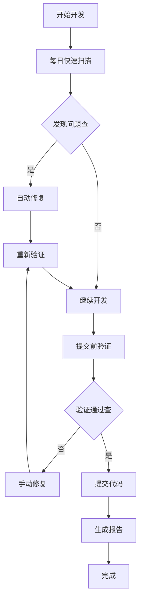
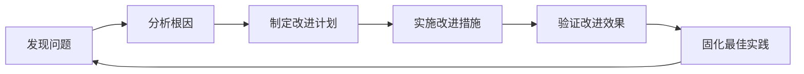

# IOE-DREAM 项目验证与质量保证指南

> **版本**: v1.0
> **更新时间**: 2025-11-17
> **适用范围**: IOE-DREAM所有开发阶段
> **维护团队**: SmartAdmin规范治理委员会

---

## 📋 指南概述

本文档为IOE-DREAM项目提供完整的验证与质量保证操作指南，确保项目始终符合repowiki核心规范和全局规范矩阵要求。

## 🎯 核心验证体系

IOE-DREAM已建立完整的、多层次的验证与质量保证体系：

### 五大核心规范
1. **架构设计规范** - 四层架构、依赖关系、微服务边界
2. **Java编码规范** - 代码风格、命名规范、包名管理
3. **API设计规范** - RESTful设计、权限控制、文档规范
4. **系统安全规范** - Sa-Token使用、敏感信息保护、安全审计
5. **缓存架构规范** - 统一缓存服务、TTL策略、模块治理

### 全局规范矩阵
- **文档**: `docs/GLOBAL_STANDARDS_MATRIX.md`
- **覆盖**: 代码、文档、技能、质量所有维度
- **特点**: 多维度、全覆盖、自动化

## 🛠️ 验证工具体系

### 核心验证脚本

| 脚本 | 功能 | 适用场景 | 使用频率 |
|------|------|----------|----------|
| **master-validation-controller.sh** | 总体验证控制器 | 统一管理所有验证 | 按需 |
| **comprehensive-validation.sh** | 综合规验证 | 全面检查所有规范 | 每日 |
| **multi-dimensional-compliance-check.sh** | 多维度检查 | 8个维度合规性评分 | 每周 |
| **cache-architecture-validation.sh** | 缓存专项验证 | 缓存架构规范检查 | 每次提交 |
| **documentation-sync-validator.sh** | 文档同步验证 | repowiki↔CLAUDE↔skills同步 | 每次更新 |
| **skills-docs-sync-engine.sh** | 技能文档同步 | 双向同步技能与规范 | 每次更新 |

### 监控与改进系统

| 系统 | 功能 | 输出 | 调度 |
|------|------|------|------|
| **continuous-improvement-monitor.sh** | 持续监控改进 | 日度/周度/月度报告 | 定时任务 |

## 🚀 快速开始

### 1. 日常开发验证

```bash
# 快速扫描关键问题（推荐每日执行）
./scripts/master-validation-controller.sh quick-scan

# 发现问题时自动修复
./scripts/master-validation-controller.sh quick-scan --fix
```

### 2. 提交前验证

```bash
# 执行完整验证（提交前必须）
./scripts/master-validation-controller.sh validate-all

# 验证失败时自动修复
./scripts/master-validation-controller.sh validate-all --fix

# 生成详细报告
./scripts/master-validation-controller.sh full-report --notify
```

### 3. 代码审查辅助

```bash
# 生成多维度评分报告
./scripts/multi-dimensional-compliance-check.sh --output=html

# 检查特定维度
./scripts/multi-dimensional-compliance-check.sh --dimension=coding
./scripts/multi-dimensional-compliance-check.sh --dimension=security
```

## 📊 验证工作流

### 开发阶段工作流



### 合规性评分标准

| 评分范围 | 合规状态 | 行动要求 |
|---------|----------|----------|
| **90-100** | ✅ 优秀 | 保持现状，持续优化 |
| **80-89** | ⚠️  良好 | 处理警告问题 |
| **70-79** | 🥉 一般 | 立即改进 |
| **0-69** | ❌ 不合格 | 紧急修复 |

## 🔧 具体操作指南

### 日常使用场景

#### 场景1: 新功能开发完成后
```bash
# 1. 快速扫描检查
./scripts/master-validation-controller.sh quick-scan

# 2. 如有问题，执行紧急修复
./scripts/master-validation-controller.sh emergency-fix

# 3. 执行完整验证
./scripts/master-validation-controller.sh validate-all

# 4. 生成质量报告
./scripts/master-validation-controller.sh full-report
```

#### 场景2: 代码审查前
```bash
# 生成多维度评分
./scripts/multi-dimensional-compliance-check.sh --output=markdown

# 重点检查特定维度
./scripts/multi-dimensional-compliance-check.sh --dimension=architecture
./scripts/multi-dimensional-compliance-check.sh --dimension=coding
```

#### 场景3: 发布前验证
```bash
# 执行全面验证
./scripts/master-validation-controller.sh validate-all --force

# 验证缓存架构
./scripts/cache-architecture-validation.sh

# 检查文档一致性
./scripts/documentation-sync-validator.sh
```

### 问题修复指南

#### 一级规范违规（必须立即修复）

1. **@Autowired使用**
```bash
# 自动修复
./scripts/master-validation-controller.sh emergency-fix

# 手动检查
grep -r "@Autowired" src/ --include="*.java"
```

2. **javax包使用**
```bash
# 自动修复常见包名
find src/ -name "*.java" -exec sed -i 's/import javax\./import jakarta\./g' {} +

# 手动检查剩余问题
grep -r "import javax\." src/ --include="*.java"
```

3. **跨层访问**
```bash
# 检查Controller直接访问DAO
grep -r "@Resource.*Dao\|@Autowired.*Dao" src/ --include="*Controller.java"
```

#### 二级规范警告（建议优化）

1. **缓存键命名**
```bash
# 检查缓存键格式
grep -r "set\(.*,".*:\).*:\).*" src/ --include="*.java"
```

2. **魔法数字**
```bash
# 检查魔法数字
grep -r "\b[0-9]{2,}\b" src/ --include="*.java" | grep -v "TODO\|FIXME"
```

## 📈 质量监控体系

### 自动化监控设置

```bash
# 设置定期监控任务
./scripts/continuous-improvement-monitor.sh setup

# 启用通知功能
./scripts/continuous-improvement-monitor.sh daily --notify
```

### 监控报告类型

#### 日度报告
- 合规性评分变化
- 新发现的问题统计
- 重点改进建议
- 历史趋势分析

#### 周度报告
- 质量趋势分析
- 问题分类统计
- 改进措施有效性
- 下周改进计划

#### 月度报告
- 长期质量趋势
- 技术债务分析
- 团队能力评估
- 季度改进规划

## 🔄 持续改进机制

### 质量改进循环



### 定期改进活动

#### 每日
- 快速扫描检查
- 严重违规处理
- 合规性评分监控

#### 每周
- 详细质量报告
- 问题趋势分析
- 团队改进讨论

#### 每月
- 全面质量评估
- 技术债务分析
- 最佳实践总结

## 📚 文档与学习资源

### 核心文档
- **全局规范矩阵**: `docs/GLOBAL_STANDARDS_MATRIX.md`
- **repowiki规范体系**: `docs/repowiki/zh/content/开发规范体系/`
- **开发指南**: `CLAUDE.md`

### 技能体系
- **缓存架构专家**: `.claude/skills/cache-architecture-specialist.md`
- **Java编码专家**: `.claude/skills/spring-boot-jakarta-guardian.md`
- **架构设计专家**: `.claude/skills/four-tier-architecture-guardian.md`
- **代码质量守护**: `.claude/skills/code-quality-protector.md`

### 验证工具文档
所有验证脚本都包含详细的帮助信息：

```bash
# 查看帮助
./scripts/comprehensive-validation.sh --help
./scripts/multi-dimensional-compliance-check.sh --help
./scripts/continuous-improvement-monitor.sh --help
```

## 🎯 最佳实践建议

### 开发流程集成

#### 1. IDE集成
- 安装代码格式化插件
- 配置实时规范检查
- 设置提交前钩子

#### 2. CI/CD集成
```yaml
# 示例：GitHub Actions
name: Standards Validation
on: [push, pull_request]
jobs:
  validate:
    runs-on: ubuntu-latest
    steps:
      - uses: actions/checkout@v2
      - name: Validate Standards
        run: ./scripts/master-validation-controller.sh validate-all
```

#### 3. 代码审查清单
- [ ] 运行快速扫描通过
- [ ] 多维度评分≥90
- [ ] 无一级规范违规
- [ ] 文档同步完成
- [ ] 单元测试覆盖率≥80%

### 团队培训建议

#### 新人培训
1. **Day 1**: repowiki规范体系学习
2. **Day 2**: 验证工具使用培训
3. **Day 3**: 实践练习
4. **Day 4**: 考核认证

#### 持续教育
1. **月度**: 规范更新培训
2. **季度**: 最佳实践分享
3. **年度**: 技能认证复审

## 🔧 故障排除

### 常见问题解决

#### 问题1: 脚本执行权限错误
```bash
chmod +x scripts/*.sh
```

#### 问题2: 依赖工具缺失
```bash
# Ubuntu/Debian
sudo apt-get install jq

# macOS
brew install jq

# Windows
# 下载jq二进制文件到系统PATH
```

#### 问题3: 验证失败但不确定原因
```bash
# 生成详细调试信息
./scripts/master-validation-controller.sh validate-all --report=debug
```

#### 问题4: 性能问题
```bash
# 使用并行检查提高性能
./scripts/multi-dimensional-compliance-check.sh --dimension=architecture &
./scripts/multi-dimensional-compliance-check.sh --dimension=coding &
wait
```

## 📞 支持与反馈

### 获取帮助
- **技术问题**: SmartAdmin规范治理委员会
- **工具问题**: 创建GitHub Issue
- **流程问题**: 项目技术负责人

### 反馈渠道
- **功能建议**: 提交Feature Request
- **Bug报告**: 提交Issue并附上详细日志
- **文档改进**: 提交PR更新文档

---

**指南版本**: v1.0
**最后更新**: 2025-11-17
**维护团队**: SmartAdmin规范治理委员会
**文档状态**: ✅ 生产就绪

**通过遵循本指南，IOE-DREAM项目将实现100%的规范遵循度和持续的质量改进！**