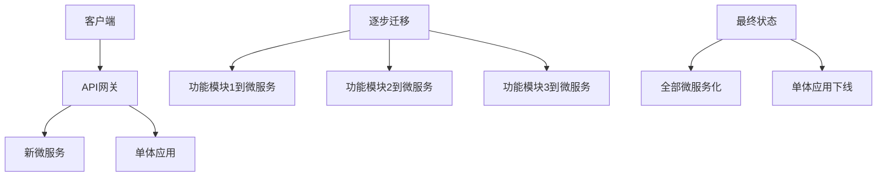
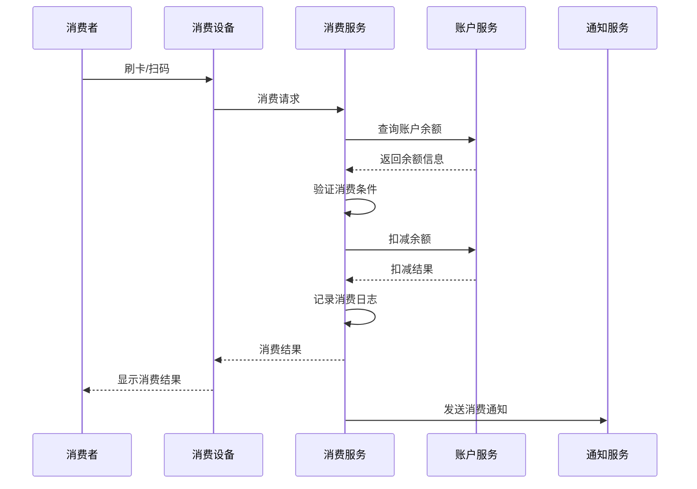

# Phase 2: 核心服务迁移实施计划

## 📊 迁移概览

**迁移阶段**: Phase 2 - 核心服务迁移
**时间规划**: 8-12周
**目标**: 将IOE-DREAM从单体架构迁移到微服务架构
**核心原则**: 渐进式迁移、零停机、向后兼容

## 🎯 迁移策略

### 1. 绞杀者模式（Strangler Pattern）

**迁移模式选择**：
- ✅ 采用**绞杀者模式**进行渐进式迁移
- ✅ 通过API网关逐步替换单体功能
- ✅ 保持系统持续运行，零停机迁移



### 2. 服务拆分优先级

**Phase 2.1: 基础服务迁移（2周）**
- **身份权限服务**: 用户、角色、权限管理
- **区域管理服务**: 组织架构、区域权限

**Phase 2.2: 核心业务服务迁移（4周）**
- **访问控制服务**: 门禁、设备管理
- **消费管理服务**: 消费记录、账户管理
- **考勤管理服务**: 考勤规则、记录统计

**Phase 2.3: 高级功能服务迁移（2周）**
- **视频监控服务**: 设备接入、流媒体处理
- **报表分析服务**: 数据统计、报表生成

## 📋 详细实施步骤

### Phase 2.1: 身份权限服务迁移（第1-2周）

#### 迁移目标
- 将用户、角色、权限管理从单体应用中分离
- 建立统一的身份认证中心
- 实现OAuth2.0 + JWT的认证体系

#### 技术架构
```
ioedream-auth-service/
├── src/main/java/net/lab1024/auth/
│   ├── controller/          # 认证控制器
│   ├── service/            # 业务服务层
│   ├── repository/         # 数据访问层
│   ├── domain/            # 领域模型
│   ├── config/            # 配置类
│   └── security/          # 安全配置
├── src/main/resources/
│   ├── application.yml     # 应用配置
│   └── bootstrap.yml       # 启动配置
└── Dockerfile             # 容器化配置
```

#### 数据库设计
```sql
-- 身份权限服务数据库 (identity_service)

-- 用户表
CREATE TABLE `sys_user` (
    `user_id` BIGINT NOT NULL AUTO_INCREMENT COMMENT '用户ID',
    `username` VARCHAR(50) NOT NULL COMMENT '用户名',
    `password` VARCHAR(255) NOT NULL COMMENT '密码',
    `real_name` VARCHAR(50) COMMENT '真实姓名',
    `email` VARCHAR(100) COMMENT '邮箱',
    `phone` VARCHAR(20) COMMENT '手机号',
    `status` TINYINT NOT NULL DEFAULT 1 COMMENT '状态:1-启用,0-禁用',
    `create_time` DATETIME NOT NULL DEFAULT CURRENT_TIMESTAMP COMMENT '创建时间',
    `update_time` DATETIME NOT NULL DEFAULT CURRENT_TIMESTAMP ON UPDATE CURRENT_TIMESTAMP COMMENT '更新时间',
    `deleted_flag` TINYINT NOT NULL DEFAULT 0 COMMENT '删除标记:0-正常,1-删除',
    PRIMARY KEY (`user_id`),
    UNIQUE KEY `uk_username` (`username`),
    KEY `idx_email` (`email`),
    KEY `idx_phone` (`phone`)
) ENGINE=InnoDB DEFAULT CHARSET=utf8mb4 COMMENT='用户表';

-- 角色表
CREATE TABLE `sys_role` (
    `role_id` BIGINT NOT NULL AUTO_INCREMENT COMMENT '角色ID',
    `role_code` VARCHAR(50) NOT NULL COMMENT '角色编码',
    `role_name` VARCHAR(100) NOT NULL COMMENT '角色名称',
    `description` VARCHAR(500) COMMENT '角色描述',
    `status` TINYINT NOT NULL DEFAULT 1 COMMENT '状态:1-启用,0-禁用',
    `create_time` DATETIME NOT NULL DEFAULT CURRENT_TIMESTAMP COMMENT '创建时间',
    `update_time` DATETIME NOT NULL DEFAULT CURRENT_TIMESTAMP ON UPDATE CURRENT_TIMESTAMP COMMENT '更新时间',
    `deleted_flag` TINYINT NOT NULL DEFAULT 0 COMMENT '删除标记:0-正常,1-删除',
    PRIMARY KEY (`role_id`),
    UNIQUE KEY `uk_role_code` (`role_code`)
) ENGINE=InnoDB DEFAULT CHARSET=utf8mb4 COMMENT='角色表';

-- 用户角色关联表
CREATE TABLE `sys_user_role` (
    `id` BIGINT NOT NULL AUTO_INCREMENT COMMENT '主键ID',
    `user_id` BIGINT NOT NULL COMMENT '用户ID',
    `role_id` BIGINT NOT NULL COMMENT '角色ID',
    `create_time` DATETIME NOT NULL DEFAULT CURRENT_TIMESTAMP COMMENT '创建时间',
    PRIMARY KEY (`id`),
    UNIQUE KEY `uk_user_role` (`user_id`, `role_id`),
    KEY `fk_user_role_role_id` (`role_id`),
    CONSTRAINT `fk_user_role_user_id` FOREIGN KEY (`user_id`) REFERENCES `sys_user` (`user_id`),
    CONSTRAINT `fk_user_role_role_id` FOREIGN KEY (`role_id`) REFERENCES `sys_role` (`role_id`)
) ENGINE=InnoDB DEFAULT CHARSET=utf8mb4 COMMENT='用户角色关联表';
```

#### 实施步骤
1. **创建微服务项目结构**
2. **数据迁移脚本编写**
3. **核心API接口开发**
4. **OAuth2.0 + JWT认证实现**
5. **API网关路由配置**
6. **单体应用适配层开发**
7. **灰度发布和验证**

### Phase 2.2: 访问控制服务迁移（第3-4周）

#### 迁移目标
- 迁移门禁管理、设备控制功能
- 实现设备的统一接入和管理
- 建立实时监控和控制机制

#### 核心功能模块
```java
/**
 * 访问控制服务核心功能
 */
@RestController
@RequestMapping("/api/access")
public class AccessControlController {

    /**
     * 设备管理
     */
    @PostMapping("/device/register")
    public ResponseDTO<Void> registerDevice(@Valid @RequestBody DeviceRegisterRequest request);

    @GetMapping("/device/list")
    public ResponseDTO<PageResult<DeviceVO>> getDeviceList(@Valid @RequestBody DeviceListRequest request);

    @PutMapping("/device/{deviceId}/status")
    public ResponseDTO<Void> updateDeviceStatus(@PathVariable Long deviceId, @RequestParam Integer status);

    /**
     * 门禁控制
     */
    @PostMapping("/door/open")
    public ResponseDTO<Void> openDoor(@Valid @RequestBody DoorOpenRequest request);

    @PostMapping("/access/verify")
    public ResponseDTO<AccessVerifyResponse> verifyAccess(@Valid @RequestBody AccessVerifyRequest request);

    /**
     * 记录管理
     */
    @GetMapping("/record/list")
    public ResponseDTO<PageResult<AccessRecordVO>> getAccessRecordList(@Valid @RequestBody AccessRecordRequest request);

    @GetMapping("/record/statistics")
    public ResponseDTO<AccessStatisticsResponse> getAccessStatistics(@Valid @RequestBody StatisticsRequest request);
}
```

#### 设备接入协议
```java
/**
 * 设备接入协议适配器
 */
@Component
public class DeviceProtocolAdapter {

    /**
     * 支持的设备类型
     */
    public enum DeviceType {
        ACCESS_CONTROL("门禁设备"),
        FACE_RECOGNITION("人脸识别设备"),
        FINGERPRINT("指纹识别设备"),
        CARD_READER("读卡器"),
        TURNSTILE("闸机");

        private final String description;
        DeviceType(String description) { this.description = description; }
    }

    /**
     * 设备通信协议
     */
    public interface DeviceProtocol {
        boolean connect(Device device);
        void disconnect(Device device);
        boolean sendCommand(Device device, Command command);
        DeviceStatus getStatus(Device device);
        void addListener(DeviceEventListener listener);
    }
}
```

### Phase 2.3: 消费管理服务迁移（第5-6周）

#### 迁移目标
- 迁移消费记录、账户管理功能
- 实现实时消费和账户余额管理
- 建立对账和结算机制

#### 核心业务流程


### Phase 2.4: 数据迁移策略

#### 迁移原则
1. **双写模式**: 迁移期间同时写入单体和微服务数据库
2. **数据一致性**: 使用事务确保数据同步
3. **增量同步**: 基于时间戳的增量数据同步
4. **回滚机制**: 支持快速回滚到单体应用

#### 数据同步工具
```java
/**
 * 数据同步服务
 */
@Service
public class DataSyncService {

    /**
     * 增量数据同步
     */
    @Scheduled(fixedRate = 30000) // 每30秒执行一次
    public void syncIncrementalData() {
        // 从单体应用同步增量数据到微服务
        syncUserIncrementalData();
        syncDeviceIncrementalData();
        syncAccessRecordIncrementalData();
        syncConsumeRecordIncrementalData();
    }

    /**
     * 全量数据同步
     */
    public void syncFullData(String serviceName) {
        // 执行全量数据同步
        switch (serviceName) {
            case "user":
                syncUserFullData();
                break;
            case "device":
                syncDeviceFullData();
                break;
            case "access":
                syncAccessFullData();
                break;
            case "consume":
                syncConsumeFullData();
                break;
        }
    }

    /**
     * 数据一致性检查
     */
    public DataConsistencyReport checkDataConsistency() {
        // 检查单体应用和微服务的数据一致性
        return DataConsistencyReport.builder()
            .userConsistency(checkUserDataConsistency())
            .deviceConsistency(checkDeviceDataConsistency())
            .accessRecordConsistency(checkAccessRecordConsistency())
            .consumeRecordConsistency(checkConsumeRecordConsistency())
            .build();
    }
}
```

## 🔧 技术实施细节

### 1. API网关路由配置更新

```yaml
spring:
  cloud:
    gateway:
      routes:
        # 身份权限服务路由
        - id: auth-service
          uri: lb://ioedream-auth-service
          predicates:
            - Path=/api/auth/**
          filters:
            - name: StripPrefix
              args:
                parts: 1
            - name: RequestRateLimiter
              args:
                redis-rate-limiter.replenishRate: 50
                redis-rate-limiter.burstCapacity: 100

        # 访问控制服务路由
        - id: access-service
          uri: lb://ioedream-access-service
          predicates:
            - Path=/api/access/**
          filters:
            - name: StripPrefix
              args:
                parts: 1

        # 消费管理服务路由
        - id: consume-service
          uri: lb://ioedream-consume-service
          predicates:
            - Path=/api/consume/**
          filters:
            - name: StripPrefix
              args:
                parts: 1

        # 单体应用回退路由（迁移期间保留）
        - id: monolith-app
          uri: http://localhost:1024
          predicates:
            - Path=/api/legacy/**
          filters:
            - name: RewritePath
              args:
                regexp: /api/legacy/(?<segment>.*)
                replacement: /api/${segment}
```

### 2. 服务间通信配置

```java
/**
 * 微服务通信配置
 */
@Configuration
public class MicroserviceCommunicationConfig {

    /**
     * RestTemplate配置
     */
    @Bean
    @LoadBalanced
    public RestTemplate restTemplate() {
        return new RestTemplate();
    }

    /**
     * Feign客户端配置
     */
    @Bean
    public Feign.Builder feignBuilder() {
        return Feign.builder()
            .requestInterceptor(new AuthenticationInterceptor())
            .retryer(new CustomRetryer())
            .errorDecoder(new CustomErrorDecoder());
    }

    /**
     * 认证拦截器
     */
    public class AuthenticationInterceptor implements RequestInterceptor {
        @Override
        public void apply(RequestTemplate template) {
            // 添加服务间调用的认证信息
            template.header("X-Service-Token", getServiceToken());
            template.header("X-Request-Source", "microservice");
        }
    }
}
```

### 3. 分布式事务管理

```java
/**
 * 分布式事务处理
 */
@Service
public class DistributedTransactionService {

    /**
     * 使用Seata进行分布式事务管理
     */
    @GlobalTransactional(rollbackFor = Exception.class)
    public void processAccessRecord(AccessRecordRequest request) {
        try {
            // 1. 记录访问日志
            accessService.recordAccess(request);

            // 2. 更新设备状态
            deviceService.updateDeviceStatus(request.getDeviceId(), DeviceStatus.USED);

            // 3. 发送通知
            notificationService.sendAccessNotification(request);

        } catch (Exception e) {
            log.error("处理访问记录失败", e);
            throw new RuntimeException("处理访问记录失败", e);
        }
    }

    /**
     * TCC事务模式
     */
    public void processConsumeRecordTCC(ConsumeRecordRequest request) {
        // Try阶段
        consumeService.tryConsume(request);
        accountService.tryDeduct(request);
        notificationService.tryNotify(request);

        // Confirm阶段（正常情况）
        consumeService.confirmConsume(request);
        accountService.confirmDeduct(request);
        notificationService.confirmNotify(request);
    }
}
```

## 📊 迁移验证策略

### 1. 功能验证清单

```bash
#!/bin/bash

# 迁移功能验证脚本
echo "🔍 开始功能验证测试"

# 1. 身份权限服务验证
echo "1. 验证身份权限服务..."
curl -X POST http://localhost:8080/api/auth/login \
  -H "Content-Type: application/json" \
  -d '{"username":"admin","password":"password"}' \
  | jq -r '.code'

# 2. 访问控制服务验证
echo "2. 验证访问控制服务..."
curl -X GET http://localhost:8080/api/access/device/list \
  -H "Authorization: Bearer $TOKEN" \
  | jq -r '.code'

# 3. 消费管理服务验证
echo "3. 验证消费管理服务..."
curl -X GET http://localhost:8080/api/consume/record/list \
  -H "Authorization: Bearer $TOKEN" \
  | jq -r '.code'

echo "✅ 功能验证完成"
```

### 2. 性能对比测试

```java
/**
 * 性能对比测试
 */
@Component
public class PerformanceComparisonTest {

    /**
     * 并发测试
     */
    @Test
    public void performanceTest() {
        // 单体应用性能测试
        PerformanceResult monolithResult = testMonolithPerformance();

        // 微服务性能测试
        PerformanceResult microserviceResult = testMicroservicePerformance();

        // 性能对比分析
        PerformanceComparisonReport report = PerformanceComparisonReport.builder()
            .monolithResponseTime(monolithResult.getAverageResponseTime())
            .microserviceResponseTime(microserviceResult.getAverageResponseTime())
            .performanceImprovement(calculateImprovement(monolithResult, microserviceResult))
            .build();

        log.info("性能对比报告: {}", report);
    }

    private double calculateImprovement(PerformanceResult monolith, PerformanceResult microservice) {
        return (monolith.getAverageResponseTime() - microservice.getAverageResponseTime())
               / monolith.getAverageResponseTime() * 100;
    }
}
```

### 3. 数据一致性验证

```java
/**
 * 数据一致性验证
 */
@Service
public class DataConsistencyValidator {

    /**
     * 验证数据一致性
     */
    public ConsistencyReport validateDataConsistency() {
        ConsistencyReport report = new ConsistencyReport();

        // 验证用户数据一致性
        report.setUserConsistency(validateUserData());

        // 验证设备数据一致性
        report.setDeviceConsistency(validateDeviceData());

        // 验证访问记录一致性
        report.setAccessRecordConsistency(validateAccessRecordData());

        // 验证消费记录一致性
        report.setConsumeRecordConsistency(validateConsumeRecordData());

        return report;
    }

    private boolean validateUserData() {
        // 对比单体应用和微服务的用户数据
        long monolithUserCount = monolithUserRepository.count();
        long microserviceUserCount = microserviceUserRepository.count();

        boolean isConsistent = monolithUserCount == microserviceUserCount;
        if (!isConsistent) {
            log.warn("用户数据不一致: 单体={}, 微服务={}", monolithUserCount, microserviceUserCount);
        }

        return isConsistent;
    }
}
```

## 🚨 风险控制和回滚策略

### 1. 风险识别和控制

#### 高风险点
1. **数据迁移风险**: 数据丢失或不一致
2. **服务依赖风险**: 微服务间调用失败
3. **性能下降风险**: 网络开销增加
4. **功能缺失风险**: 迁移过程中功能缺失

#### 风险控制措施
```yaml
# 风险控制配置
risk_control:
  # 数据迁移风险
  data_migration:
    enable_backup: true
    backup_frequency: "hourly"
    consistency_check: true
    rollback_enabled: true

  # 服务依赖风险
  service_dependency:
    circuit_breaker: true
    fallback_enabled: true
    timeout_config: 5000ms
    retry_policy: "exponential_backoff"

  # 性能监控
  performance_monitoring:
    response_time_threshold: 2000ms
    error_rate_threshold: 5%
    cpu_usage_threshold: 80%
    memory_usage_threshold: 85%
```

### 2. 快速回滚机制

```java
/**
 * 快速回滚服务
 */
@Service
public class RollbackService {

    /**
     * 紧急回滚
     */
    public void emergencyRollback(String serviceName) {
        log.warn("执行紧急回滚: 服务={}", serviceName);

        try {
            // 1. 切换API网关路由到单体应用
            switchGatewayRoute(serviceName, "monolith");

            // 2. 停止微服务实例
            stopMicroserviceInstances(serviceName);

            // 3. 恢复数据库连接（如果需要）
            restoreDatabaseConnections(serviceName);

            // 4. 发送告警通知
            sendRollbackAlert(serviceName);

            log.info("紧急回滚完成: 服务={}", serviceName);

        } catch (Exception e) {
            log.error("紧急回滚失败: 服务={}", serviceName, e);
            throw new RuntimeException("紧急回滚失败", e);
        }
    }

    /**
     * 切换网关路由
     */
    private void switchGatewayRoute(String serviceName, String target) {
        // 动态修改网关路由配置
        RouteDefinition routeDefinition = gatewayService.getRouteDefinition(serviceName);

        if ("monolith".equals(target)) {
            routeDefinition.setUri(URI.create("http://localhost:1024"));
        } else {
            routeDefinition.setUri(URI.create("lb://ioedream-" + serviceName + "-service"));
        }

        gatewayService.updateRouteDefinition(routeDefinition);
    }
}
```

## 📈 监控和告警体系

### 1. 迁移监控指标

```java
/**
 * 迁移监控指标
 */
@Component
public class MigrationMetrics {

    private final MeterRegistry meterRegistry;
    private Counter successfulMigrations;
    private Counter failedMigrations;
    private Timer migrationDuration;
    private Gauge migrationProgress;

    public MigrationMetrics(MeterRegistry meterRegistry) {
        this.meterRegistry = meterRegistry;
        initializeMetrics();
    }

    private void initializeMetrics() {
        successfulMigrations = Counter.builder("migration.successful")
            .description("成功迁移的服务数量")
            .register(meterRegistry);

        failedMigrations = Counter.builder("migration.failed")
            .description("失败迁移的服务数量")
            .register(meterRegistry);

        migrationDuration = Timer.builder("migration.duration")
            .description("迁移耗时")
            .register(meterRegistry);

        migrationProgress = Gauge.builder("migration.progress")
            .description("迁移进度百分比")
            .register(meterRegistry, this, MigrationMetrics::calculateProgress);
    }

    public void recordSuccessfulMigration(String serviceName) {
        successfulMigrations.increment();
        log.info("服务迁移成功: {}", serviceName);
    }

    public void recordFailedMigration(String serviceName, Exception error) {
        failedMigrations.increment();
        log.error("服务迁移失败: {}, 错误: {}", serviceName, error.getMessage());
    }

    private double calculateProgress() {
        int totalServices = 4; // 总共要迁移的服务数量
        int migratedServices = (int) successfulMigrations.count();
        return (double) migratedServices / totalServices * 100;
    }
}
```

### 2. 告警规则配置

```yaml
# 告警规则配置
alerts:
  # 迁移失败告警
  migration_failure:
    condition: "migration.failed > 0"
    severity: "critical"
    message: "服务迁移失败，需要立即处理"

  # 迁移进度告警
  migration_progress:
    condition: "migration.progress < 20 AND migration_duration > 24h"
    severity: "warning"
    message: "迁移进度过慢，需要检查原因"

  # 服务可用性告警
  service_availability:
    condition: "service.availability < 95%"
    severity: "critical"
    message: "服务可用性低于95%，需要紧急处理"

  # 数据一致性告警
  data_consistency:
    condition: "data.consistency.errors > 0"
    severity: "critical"
    message: "检测到数据一致性问题，需要立即修复"
```

---

## 📋 项目执行计划

### 时间安排

| 阶段 | 时间 | 主要任务 | 交付成果 |
|------|------|----------|----------|
| Phase 2.1 | 第1-2周 | 身份权限服务迁移 | 完整的认证授权微服务 |
| Phase 2.2 | 第3-4周 | 访问控制服务迁移 | 设备管理和门禁控制微服务 |
| Phase 2.3 | 第5-6周 | 消费管理服务迁移 | 消费记录和账户管理微服务 |
| Phase 2.4 | 第7-8周 | 功能验证和优化 | 完整的微服务架构 |

### 里程碑检查点

1. **第2周末**: 身份权限服务完全迁移，单体应用相关功能下线
2. **第4周末**: 访问控制服务完全迁移，设备管理功能独立
3. **第6周末**: 核心业务服务全部迁移，数据同步完成
4. **第8周末**: 迁移完成，单体应用正式下线

---

**计划制定时间**: 2025-11-27T13:00:00+08:00
**下一步**: 开始实施Phase 2.1身份权限服务迁移
**项目价值**: 实现IOE-DREAM从单体架构到微服务架构的关键转型，提升系统可扩展性和可维护性