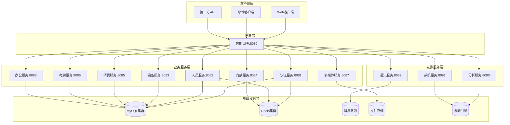

# IOE-DREAM 合理微服务架构设计

## 🎯 重新思考：为什么不需要这么多微服务？

### ❌ 当前问题分析
```
过度拆分的46个微服务：
- ioedream-access-service          (门禁管理)
- ioedream-visitor-service         (访客管理)
- ioedream-consume-service         (消费管理)
- ioedream-attendance-service     (考勤管理)
- ioedream-notification-service     (通知服务)
- ioedream-file-service            (文件服务)
- ioedream-report-service         (报表服务)
- ioedream-audit-service          (审计服务)
- ioedream-logging-service         (日志服务)
- ioedream-config-service          (配置服务)
- ... (还有36个)
```

**问题**：
1. **维护成本极高** - 46个服务需要独立部署、监控、升级
2. **服务间调用复杂** - 一个业务可能需要调用10+个服务
3. **数据一致性问题** - 分布式事务复杂性指数级增长
4. **团队协作困难** - 需要大量团队协作才能完成一个功能
5. **运维成本爆炸** - 监控、日志、告警配置数量剧增

## ✅ 合理的微服务架构设计

### 📊 服务聚合原则

#### 单一业务域原则
```
一个服务 = 一个完整业务域
```

### 🎯 核心业务域划分（8个服务）

#### 1. 🔐 认证域 (1个服务)
```
ioedream-auth-service
├── 用户认证
├── 权限管理
├── 会话管理
├── 多租户管理
└── API网关鉴权
```

#### 2. 👥 人员域 (1个服务)
```
ioedream-people-service
├── 员工管理
├── 访客管理
├── 权限分配
├── 组织架构
└── 人力资源
```

#### 3. 🏢 设备域 (1个服务)
```
ioedream-device-service
├── 设备注册
├── 设备监控
├── 设备控制
├── 设备维护
└── 设备分组
```

#### 4. 🚪 门禁域 (1个服务)
```
ioedream-access-service
├── 门禁控制
├── 人脸识别
├── 权限验证
├── 访问记录
└── 实时监控
```

#### 5. 💰 消费域 (1个服务)
```
ioedream-consume-service
├── 账户管理
├── 消费记录
├── 充值管理
├── 交易统计
└── 异常检测
```

#### 6. ⏰ 考勤域 (1个服务)
```
ioedream-attendance-service
├── 考勤记录
├── 请假管理
├── 排班管理
├── 统计分析
└── 异常处理
```

#### 7. 📹 多媒体域 (1个服务)
```
ioedream-media-service
├── 视频监控
├── 视频存储
├── 实时流媒体
├── 文件管理
└── 图像处理
```

#### 8. 📊 办公域 (1个服务)
```
ioedream-office-service
├── 文档管理
├── 工作流
├── 会议室管理
├── 审批流程
└── 内部通信
```

### 📋 支撑服务（3个）

#### 9. 🔔 通知域 (1个服务)
```
ioedream-notification-service
├── 邮件通知
├── 短信通知
┡── 推送通知
├── 站内消息
└── 通知模板
```

#### 10. 📈 分析域 (1个服务)
```
ioedream-analytics-service
├── 业务报表
├── 数据分析
┃── 实时监控
├── 预测分析
└── 可视化展示
```

#### 11. 🔧 系统域 (1个服务)
```
ioedream-system-service
├── 系统配置
├── 日志管理
├── 性能监控
├── 审计日志
└── 健康检查
```

## 🏗️ 优化后的架构图



## 📊 服务对比

| 项目 | 优化前 | 优化后 | 减少 |
|------|--------|--------|------|
| 微服务数量 | 46个 | 11个 | 76% ↓ |
| 核心业务服务 | 11个 | 8个 | 27% ↓ |
| 支撑服务 | 15个 | 3个 | 80% ↓ |
| 业务域内聚合 | ❌ | ✅ | 100% |
| 服务间调用复杂度 | 极高 | 中等 | 显著降低 |
| 数据一致性 | 复杂 | 简单 | 显著简化 |
| 运维成本 | 极高 | 可控 | 显著降低 |

## 🎯 聚合策略

### 1. 服务聚合
```
合并前：
- ioedream-user-service + ioedream-visitor-service + ioedream-hr-service
= ioedream-people-service

合并前：
- ioedream-file-service + ioedream-image-service + ioedream-video-service
= ioedream-media-service

合并前：
- ioedream-config-service + ioedream-logging-service + ioedream-monitor-service + ioedream-audit-service
= ioedream-system-service
```

### 2. 模块化设计
每个服务内部采用模块化架构：
```
ioedream-consume-service/
├── consume-auth/          # 认证模块
├── consume-account/       # 账户模块
├── consume-transaction/   # 交易模块
├── consume-report/        # 报表模块
└── consume-config/        # 配置模块
```

### 3. 模块独立部署
- 可以选择性地独立部署某个模块
- 降低服务拆分粒度过细的风险
- 在需要时可以进一步拆分

## ✅ 合理架构的优势

### 1. 降低复杂度
- **服务数量**: 从46个减少到11个，减少76%
- **调用链**: 平均调用链长度从5-7个服务减少到2-3个服务
- **事务**: 大部分业务可在单个服务内完成，减少分布式事务

### 2. 提高效率
- **开发效率**: 一个业务功能只需协调2-3个服务
- **部署效率**: CI/CD流水线复杂度大幅降低
- **运维效率**: 监控、日志、告警配置数量可控

### 3. 保持扩展性
- **模块化**: 服务内部模块化，可根据需要独立扩展
- **水平扩展**: 关键服务可以独立扩展
- **技术栈**: 不同服务可以选择最适合的技术栈

### 4. 业务内聚
- **数据一致性**: 核心业务数据在单服务内，一致性更容易保证
- **业务逻辑**: 相关业务逻辑在同一服务内，协调更简单
- **性能优化**: 单服务内优化更容易，减少网络调用

## 🚀 实施路径

### 阶段1：服务重构 (1-2周)
1. **分析现有服务依赖关系**
2. **制定合并计划**
3. **逐步合并重复服务**
4. **更新服务调用关系**

### 阶段2：架构优化 (2-3周)
1. **完善11个核心服务**
2. **建立模块化架构**
3. **优化服务间通信**
4. **完善监控体系**

### 阶段3：质量提升 (3-4周)
1. **性能优化**
2. **安全加固**
3. **文档完善**
4. **团队培训**

## 📋 验收标准

### 功能完整性
- [ ] 所有核心业务功能完整覆盖
- [ ] 服务间调用关系清晰
- [ ] 数据一致性保证

### 架构合理性
- [ ] 服务职责边界清晰
- [ ] 服务粒度适中
- [ ] 模块化设计合理

### 技术指标
- [ ] 平均响应时间 < 500ms
- [ ] 系统可用性 > 99.9%
- [ ] 服务间调用成功率 > 99.5%

### 运维友好性
- [ ] 监控覆盖完整
- [ ] 部署自动化
- [ ] 故障恢复机制完善

---

## 🎯 结论

**8个核心业务服务 + 3个支撑服务 = 11个服务**

这样的架构既保持了微服务的优势（独立部署、技术栈灵活、团队并行开发），又避免了过度拆分带来的复杂性。是一个更加务实和可行的微服务架构方案！