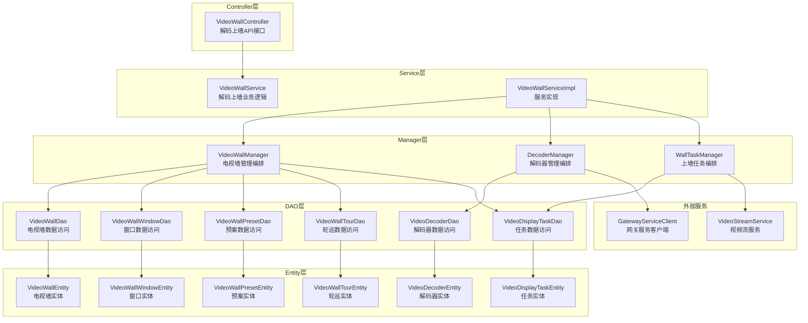
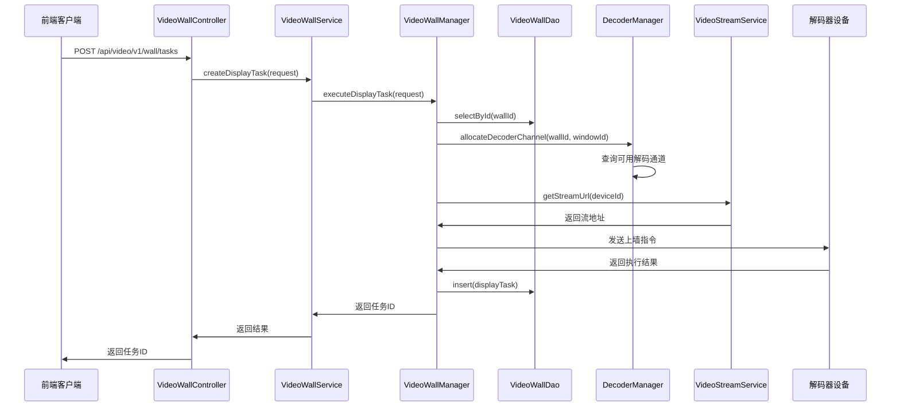

# 解码上墙模块架构设计文档

> **设计日期**: 2025-01-30
> **模块名称**: 解码上墙模块
> **服务名称**: ioedream-video-service
> **端口**: 8092

---

## 📐 整体架构图



---

## 🔧 核心组件设计

### 1. Controller层

**VideoWallController**
- 职责: 提供解码上墙REST API接口
- 路径: `/api/video/v1/wall`
- 主要接口:
  - `GET /decoders` - 查询解码器列表
  - `GET /decoders/{decoderId}` - 查询解码器详情
  - `POST /decoders` - 添加解码器
  - `PUT /decoders/{decoderId}` - 更新解码器
  - `DELETE /decoders/{decoderId}` - 删除解码器
  - `GET /walls` - 查询电视墙列表
  - `POST /walls` - 创建电视墙
  - `PUT /walls/{wallId}` - 更新电视墙
  - `DELETE /walls/{wallId}` - 删除电视墙
  - `POST /walls/{wallId}/windows` - 配置窗口布局
  - `POST /walls/{wallId}/tasks` - 创建上墙任务
  - `DELETE /walls/{wallId}/tasks/{taskId}` - 取消上墙任务
  - `GET /walls/{wallId}/presets` - 查询预案列表
  - `POST /walls/{wallId}/presets` - 创建预案
  - `POST /walls/{wallId}/presets/{presetId}/apply` - 调用预案
  - `GET /walls/{wallId}/tours` - 查询轮巡列表
  - `POST /walls/{wallId}/tours` - 创建轮巡
  - `POST /walls/{wallId}/tours/{tourId}/start` - 启动轮巡
  - `POST /walls/{wallId}/tours/{tourId}/stop` - 停止轮巡

### 2. Service层

**VideoWallService**
- 职责: 解码上墙业务逻辑
- 主要方法:
  - `getDecoderList()` - 查询解码器列表
  - `getDecoderById()` - 查询解码器详情
  - `addDecoder()` - 添加解码器
  - `updateDecoder()` - 更新解码器
  - `deleteDecoder()` - 删除解码器
  - `getWallList()` - 查询电视墙列表
  - `createWall()` - 创建电视墙
  - `updateWall()` - 更新电视墙
  - `deleteWall()` - 删除电视墙
  - `configureWindows()` - 配置窗口布局
  - `createDisplayTask()` - 创建上墙任务
  - `cancelDisplayTask()` - 取消上墙任务
  - `getPresetList()` - 查询预案列表
  - `createPreset()` - 创建预案
  - `applyPreset()` - 调用预案
  - `getTourList()` - 查询轮巡列表
  - `createTour()` - 创建轮巡
  - `startTour()` - 启动轮巡
  - `stopTour()` - 停止轮巡

### 3. Manager层

**VideoWallManager**
- 职责: 电视墙管理复杂流程编排
- 主要方法:
  - `createWallWithWindows()` - 创建电视墙并初始化窗口
  - `updateWallLayout()` - 更新电视墙布局
  - `configureWindowLayout()` - 配置窗口布局

**DecoderManager**
- 职责: 解码器管理复杂流程编排
- 主要方法:
  - `registerDecoder()` - 注册解码器
  - `monitorDecoderStatus()` - 监控解码器状态
  - `allocateDecoderChannel()` - 分配解码通道
  - `releaseDecoderChannel()` - 释放解码通道

**WallTaskManager**
- 职责: 上墙任务管理复杂流程编排
- 主要方法:
  - `executeDisplayTask()` - 执行上墙任务
  - `batchExecuteTasks()` - 批量执行上墙任务
  - `cancelDisplayTask()` - 取消上墙任务
  - `scheduleTour()` - 调度轮巡任务

### 4. DAO层

**VideoWallDao**
- 职责: 电视墙数据访问
- 主要方法:
  - `selectById()` - 根据ID查询
  - `selectList()` - 查询列表
  - `insert()` - 插入
  - `updateById()` - 更新
  - `deleteById()` - 删除

**VideoDecoderDao**
- 职责: 解码器数据访问
- 主要方法:
  - `selectById()` - 根据ID查询
  - `selectList()` - 查询列表
  - `selectByStatus()` - 根据状态查询
  - `insert()` - 插入
  - `updateById()` - 更新
  - `deleteById()` - 删除

**VideoWallWindowDao**
- 职责: 电视墙窗口数据访问
- 主要方法:
  - `selectByWallId()` - 根据电视墙ID查询
  - `selectById()` - 根据ID查询
  - `insert()` - 插入
  - `updateById()` - 更新
  - `deleteByWallId()` - 根据电视墙ID删除

**VideoWallPresetDao**
- 职责: 电视墙预案数据访问
- 主要方法:
  - `selectByWallId()` - 根据电视墙ID查询
  - `selectById()` - 根据ID查询
  - `insert()` - 插入
  - `updateById()` - 更新
  - `deleteById()` - 删除

**VideoWallTourDao**
- 职责: 电视墙轮巡数据访问
- 主要方法:
  - `selectByWallId()` - 根据电视墙ID查询
  - `selectById()` - 根据ID查询
  - `selectByStatus()` - 根据状态查询
  - `insert()` - 插入
  - `updateById()` - 更新
  - `deleteById()` - 删除

**VideoDisplayTaskDao**
- 职责: 上墙任务数据访问
- 主要方法:
  - `selectByWallId()` - 根据电视墙ID查询
  - `selectByWindowId()` - 根据窗口ID查询
  - `selectByStatus()` - 根据状态查询
  - `insert()` - 插入
  - `updateById()` - 更新
  - `deleteById()` - 删除

---

## 📊 数据流向图



---

## 🔄 异常处理策略

### 异常分类

1. **业务异常**:
   - `DecoderNotFoundException` - 解码器不存在
   - `DecoderOfflineException` - 解码器离线
   - `ChannelNotAvailableException` - 通道不可用
   - `WallNotFoundException` - 电视墙不存在
   - `WindowNotFoundException` - 窗口不存在
   - `PresetNotFoundException` - 预案不存在
   - `TourNotFoundException` - 轮巡不存在
   - `TaskExecutionException` - 任务执行失败

2. **系统异常**:
   - `DatabaseException` - 数据库异常
   - `NetworkException` - 网络异常
   - `DeviceCommunicationException` - 设备通信异常

### 异常处理

- 所有异常统一在Controller层捕获
- 使用GlobalExceptionHandler统一处理
- 返回统一的错误格式（ResponseDTO）

---

## 📋 接口契约定义

### 创建上墙任务

**请求**: `POST /api/video/v1/wall/tasks`
```json
{
  "wallId": 1,
  "windowId": 1,
  "deviceId": 1001,
  "streamType": "MAIN"
}
```

**响应**: `ResponseDTO<Long>`
```json
{
  "code": 200,
  "message": "上墙任务创建成功",
  "data": 12345,
  "timestamp": 1706611200000
}
```

### 调用预案

**请求**: `POST /api/video/v1/wall/presets/{presetId}/apply`
**响应**: `ResponseDTO<Void>`

### 启动轮巡

**请求**: `POST /api/video/v1/wall/tours/{tourId}/start`
**响应**: `ResponseDTO<Void>`

---

## 🎯 设计原则

1. **严格遵循四层架构**: Controller → Service → Manager → DAO
2. **统一依赖注入**: 使用@Resource，禁止@Autowired
3. **统一DAO命名**: 使用Dao后缀，@Mapper注解
4. **统一异常处理**: 使用GlobalExceptionHandler
5. **统一响应格式**: 使用ResponseDTO
6. **事务管理**: Service层使用@Transactional

---

## 📋 实现检查清单

- [ ] 所有实体类已创建
- [ ] 所有DAO接口已创建
- [ ] 所有Manager类已创建
- [ ] Service接口和实现已创建
- [ ] Controller已创建
- [ ] 所有方法都有完整的JavaDoc注释
- [ ] 所有异常都有处理
- [ ] 单元测试覆盖率 > 80%
- [ ] 编译通过，无语法错误
