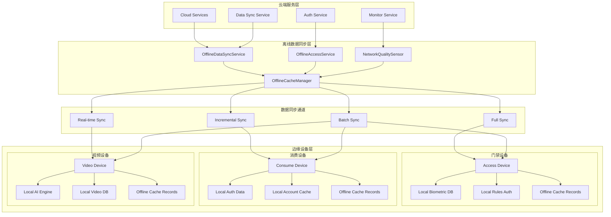
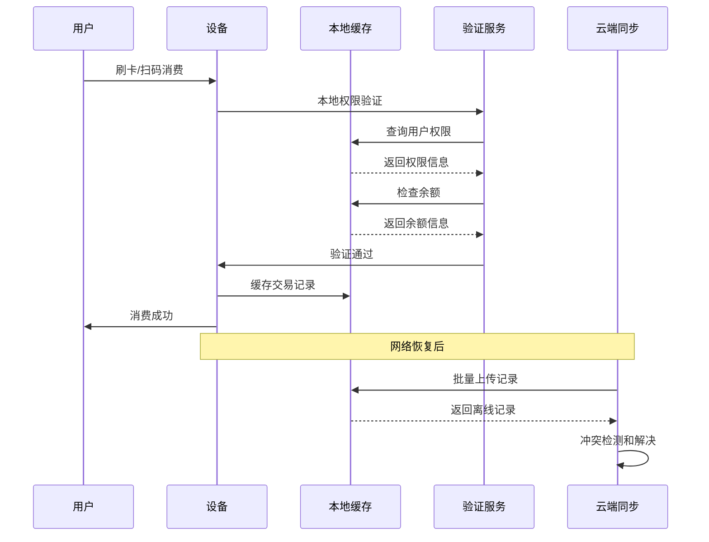
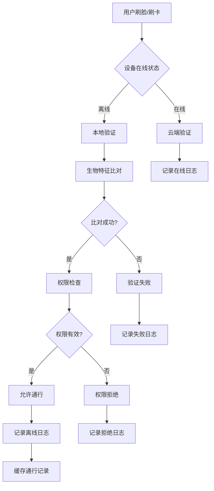
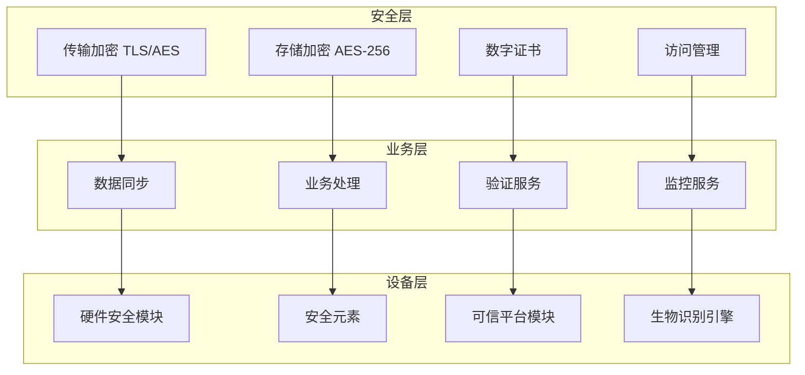
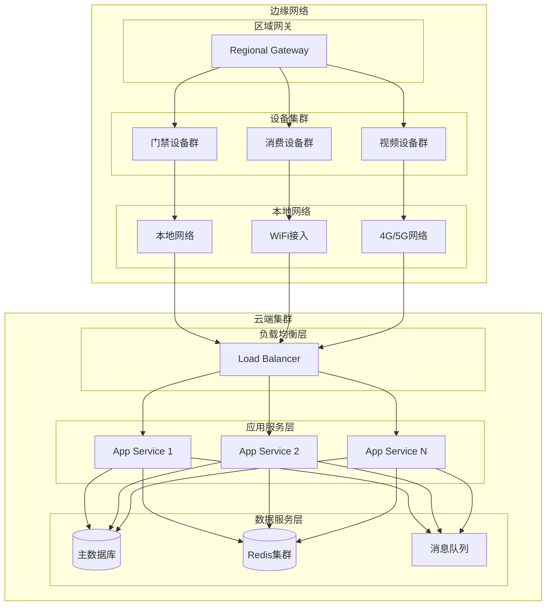
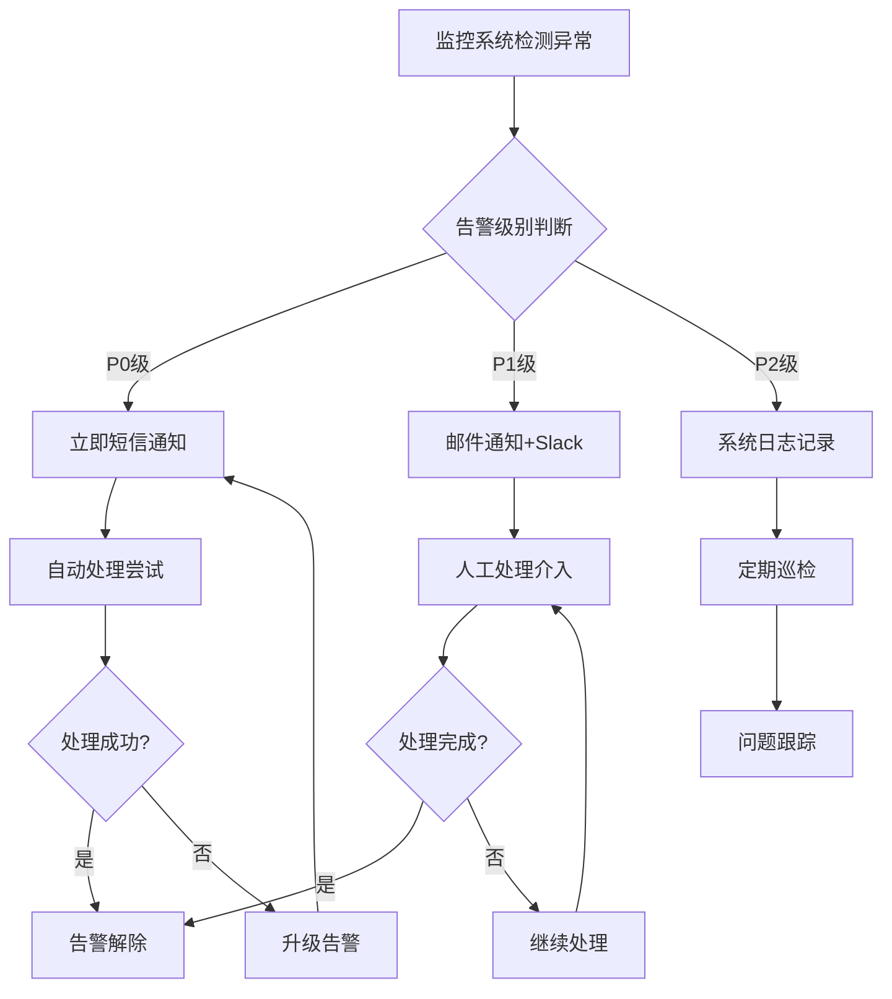

# IOE-DREAM 离线模式架构设计

> **文档版本**: v1.0.0
> **创建日期**: 2025-12-16
> **作者**: IOE-DREAM Team
> **模块**: P0级核心功能 - 离线模式

## 📋 功能概述

### 设计目标

离线模式是IOE-DREAM智慧园区一卡通管理平台的P0级核心功能，旨在解决网络中断或设备离线情况下的业务连续性问题，确保系统在各种网络环境下都能正常运行。

### 核心能力

1. **离线数据同步**: 完整的离线数据包准备、同步和验证机制
2. **本地业务处理**: 设备端独立的业务处理和验证能力
3. **数据一致性保障**: 离线与在线数据的一致性校验和冲突解决
4. **网络状态感知**: 智能的网络质量检测和自适应策略
5. **应急处理机制**: 特殊情况下的应急门禁和安全策略

## 🏗️ 系统架构

### 整体架构图



### 技术架构层次

#### 1. 云端服务层
- **数据同步服务**: 负责离线数据包的生成、版本管理和同步调度
- **认证授权服务**: 提供用户权限验证和生物特征模板管理
- **监控告警服务**: 监控设备离线状态和网络质量
- **业务逻辑服务**: 提供完整的业务规则处理能力

#### 2. 离线同步层
- **OfflineDataSyncService**: 消费模块离线数据同步服务
- **OfflineAccessService**: 门禁模块离线访问服务
- **OfflineCacheManager**: 统一的离线缓存管理器
- **NetworkQualitySensor**: 网络质量感知传感器

#### 3. 边缘设备层
- **本地数据库**: 存储离线业务数据和用户信息
- **本地验证引擎**: 独立的权限验证和生物识别能力
- **缓存管理**: 离线记录的临时存储和管理
- **网络适配器**: 智能的网络连接和切换机制

## 🚀 核心功能模块

### 1. 离线数据同步管理

#### 功能特性
- **数据包准备**: 智能化的离线数据包生成，包含用户信息、权限、配置等
- **增量同步**: 基于变更检测的高效增量数据同步
- **完整性校验**: 多层校验机制确保数据完整性和安全性
- **版本管理**: 完整的数据版本控制和回滚机制

#### 技术实现
```java
// 离线数据包准备示例
Map<String, Object> dataPackage = offlineDataSyncService.prepareOfflineDataPackage(deviceId, userId);
dataPackage.put("userInfo", getUserInfo(userId));
dataPackage.put("accountInfo", getAccountInfo(userId));
dataPackage.put("deviceAuth", getDeviceAuth(deviceId));
dataPackage.put("validationRules", getValidationRules(deviceId));
dataPackage.put("checksum", calculateChecksum(dataPackage));
```

#### 数据包结构
```json
{
  "deviceId": "POS001",
  "userId": 12345,
  "packageVersion": 1702684800000,
  "prepareTime": "2025-12-16T10:00:00",
  "expiryTime": "2025-12-23T10:00:00",
  "userInfo": {
    "userId": 12345,
    "username": "zhangsan",
    "realName": "张三",
    "status": 1
  },
  "accountInfo": {
    "accountId": 67890,
    "balance": 1250.50,
    "creditLimit": 5000.00,
    "status": 1
  },
  "deviceAuth": {
    "authToken": "TOKEN_POS001_1702684800000",
    "authExpiry": "2025-12-17T10:00:00",
    "permissions": ["CONSUME", "OFFLINE_PAYMENT"]
  },
  "validationRules": {
    "amountRange": {"min": 0.01, "max": 500.00},
    "timeRange": {"start": "06:00", "end": "22:00"},
    "frequencyLimit": {"maxPerHour": 10, "maxPerDay": 50}
  },
  "checksum": "SHA256:abc123...",
  "algorithm": "SHA-256"
}
```

### 2. 离线业务处理

#### 消费模块离线处理

**核心能力**:
- **本地支付验证**: 独立的消费权限和余额验证
- **离线交易记录**: 完整的交易记录缓存和管理
- **智能冲突解决**: 自动化的数据冲突检测和解决
- **数据一致性保障**: 多重校验确保数据准确性

**处理流程**:


**离线消费验证算法**:
```java
public boolean validateOfflineTransaction(Map<String, Object> transaction) {
    // 1. 交易签名验证
    String signature = calculateTransactionSignature(transaction);
    if (!signature.equals(transaction.get("signature"))) {
        return false;
    }

    // 2. 时间戳验证（防重放攻击）
    LocalDateTime transactionTime = LocalDateTime.parse(transaction.get("consumeTime"));
    if (transactionTime.isBefore(LocalDateTime.now().minusMinutes(5))) {
        return false;
    }

    // 3. 用户权限验证
    if (!validateUserPermission(transaction.get("userId"), transaction.get("deviceId"))) {
        return false;
    }

    // 4. 余额和限额验证
    return validateBalanceAndLimit(transaction);
}
```

#### 门禁模块离线处理

**核心能力**:
- **多模态生物识别**: 人脸、指纹、虹膜等多种生物识别方式
- **本地权限验证**: 独立的访问权限检查和验证
- **应急门禁策略**: 特殊情况下的应急访问控制
- **活体检测防伪**: 防止照片、视频等伪造攻击

**离线门禁验证流程**:


### 3. 网络状态感知

#### 网络质量检测算法

**检测指标**:
- **延迟 (Latency)**: 网络响应时间
- **丢包率 (Packet Loss)**: 数据包丢失比例
- **带宽 (Bandwidth)**: 可用网络带宽
- **稳定性 (Stability)**: 网络连接稳定性

**质量评分算法**:
```java
public double calculateNetworkQualityScore(double latency, double packetLoss, double bandwidth) {
    // 延迟评分 (0-100)
    double latencyScore = Math.max(0, 100 - latency);

    // 丢包率评分 (0-100)
    double packetLossScore = Math.max(0, 100 - packetLoss * 20);

    // 带宽评分 (0-100)
    double bandwidthScore = Math.min(100, bandwidth * 2);

    // 综合评分
    return (latencyScore * 0.4 + packetLossScore * 0.3 + bandwidthScore * 0.3);
}

public String getNetworkQualityLevel(double score) {
    if (score >= 90) return "EXCELLENT";
    if (score >= 75) return "GOOD";
    if (score >= 60) return "FAIR";
    return "POOR";
}
```

#### 自适应同步策略

**网络质量等级与策略对应**:
| 网络质量 | 同步频率 | 批量大小 | 压缩策略 | 重试次数 | 超时时间 |
|---------|---------|---------|---------|---------|---------|
| EXCELLENT | 实时 | 100条 | 关闭 | 1次 | 10秒 |
| GOOD | 每小时 | 50条 | 开启 | 3次 | 20秒 |
| FAIR | 每日 | 20条 | 开启 | 5次 | 30秒 |
| POOR | 手动 | 10条 | 开启 | 10次 | 60秒 |

### 4. 应急处理机制

#### 应急门禁策略

**应急类型**:
- **FIRE**: 火灾应急 - 所有人员紧急疏散
- **SECURITY**: 安全威胁 - 特定人员紧急撤离
- **MAINTENANCE**: 维修模式 - 限制访问但保留必要通道
- **MEDICAL**: 医疗应急 - 医护人员快速通行

**应急权限升级机制**:
```java
public Map<String, Object> enableEmergencyMode(String deviceId, String emergencyType) {
    EmergencyPolicy policy = getEmergencyPolicy(emergencyType);

    // 1. 权限升级
    upgradeAccessPermissions(deviceId, policy.getAuthorizedRoles());

    // 2. 验证规则调整
    adjustVerificationRules(deviceId, policy.getVerificationLevel());

    // 3. 安全监控加强
    enhanceSecurityMonitoring(deviceId, policy.getMonitoringLevel());

    // 4. 自动恢复配置
    configureAutoRecovery(deviceId, policy.getRecoveryConditions());

    return Map.of(
        "deviceId", deviceId,
        "emergencyType", emergencyType,
        "enabled", true,
        "policy", policy,
        "enableTime", LocalDateTime.now()
    );
}
```

## 📊 性能指标与优化

### 关键性能指标

#### 数据同步性能
- **同步成功率**: ≥ 99.5%
- **平均同步时间**: ≤ 5秒
- **数据完整性**: 100%
- **冲突解决率**: ≥ 95%

#### 设备离线性能
- **离线验证响应时间**: ≤ 500ms
- **本地查询响应时间**: ≤ 100ms
- **生物识别准确率**: ≥ 99.0%
- **活体检测准确率**: ≥ 98.5%

#### 网络适应性能
- **网络检测准确率**: ≥ 95%
- **自动切换成功率**: ≥ 99%
- **离线模式恢复时间**: ≤ 2秒
- **网络质量预测准确率**: ≥ 85%

### 优化策略

#### 1. 数据压缩优化
```java
public Map<String, Object> compressOfflineData(Map<String, Object> dataPackage) {
    // 1. 字典压缩
    Map<String, Object> compressed = dictionaryCompression(dataPackage);

    // 2. 数据去重
    compressed = dataDeduplication(compressed);

    // 3. 二进制编码
    byte[] binaryData = binaryEncoding(compressed);

    // 4. 加密压缩
    byte[] encrypted = encryptData(binaryData);

    return Map.of(
        "compressedData", Base64.getEncoder().encodeToString(encrypted),
        "originalSize", calculateDataSize(dataPackage),
        "compressedSize", encrypted.length,
        "compressionRatio", (double) encrypted.length / calculateDataSize(dataPackage)
    );
}
```

#### 2. 缓存策略优化
```java
public class OfflineCacheManager {
    // 多级缓存策略
    private final Cache<String, Object> l1Cache;  // 内存缓存
    private final RedisTemplate<String, Object> l2Cache;  // Redis缓存
    private final Map<String, Object> l3Cache = new ConcurrentHashMap<>();  // 本地文件缓存

    public <T> T getWithFallback(String key, Class<T> type, Supplier<T> loader) {
        // L1缓存查询
        T value = (T) l1Cache.getIfPresent(key);
        if (value != null) return value;

        // L2缓存查询
        value = (T) l2Cache.opsForValue().get(key);
        if (value != null) {
            l1Cache.put(key, value);
            return value;
        }

        // L3缓存查询（本地文件）
        value = (T) l3Cache.get(key);
        if (value != null) {
            l1Cache.put(key, value);
            l2Cache.opsForValue().set(key, value, Duration.ofHours(1));
            return value;
        }

        // 加载并缓存
        value = loader.get();
        if (value != null) {
            l1Cache.put(key, value);
            l2Cache.opsForValue().set(key, value, Duration.ofHours(1));
            l3Cache.put(key, value);
        }

        return value;
    }
}
```

#### 3. 并发处理优化
```java
@Service
public class OfflineProcessingService {
    private final ExecutorService offlineExecutor = Executors.newFixedThreadPool(
        Runtime.getRuntime().availableProcessors() * 2,
        new ThreadFactoryBuilder().setNameFormat("offline-processing-%d").build()
    );

    public CompletableFuture<List<OfflineSyncResultVO>> processBatchOfflineRecords(
            List<Map<String, Object>> records) {

        // 按设备分组并行处理
        Map<String, List<Map<String, Object>>> recordsByDevice = records.stream()
            .collect(Collectors.groupingBy(r -> (String) r.get("deviceId")));

        List<CompletableFuture<OfflineSyncResultVO>> futures = recordsByDevice.entrySet()
            .stream()
            .map(entry -> CompletableFuture.supplyAsync(() ->
                processDeviceOfflineRecords(entry.getKey(), entry.getValue()), offlineExecutor))
            .collect(Collectors.toList());

        return CompletableFuture.allOf(futures.toArray(new CompletableFuture[0]))
            .thenApply(v -> futures.stream()
                .map(CompletableFuture::join)
                .collect(Collectors.toList()));
    }
}
```

## 🔒 安全设计

### 数据安全

#### 1. 数据加密
- **传输加密**: 所有离线数据传输使用AES-256加密
- **存储加密**: 本地敏感数据使用硬件级加密存储
- **密钥管理**: 基于时间窗口的动态密钥轮换机制
- **签名验证**: 每个离线数据包都包含数字签名

#### 2. 访问控制
- **设备认证**: 强制性的设备证书认证
- **用户授权**: 基于角色的细粒度权限控制
- **操作审计**: 完整的离线操作日志记录
- **异常检测**: 智能的异常行为检测和告警

### 安全架构图



## 🚀 部署架构

### 部署拓扑图



### 容器化部署配置

#### Docker Compose配置
```yaml
version: '3.8'

services:
  offline-sync-service:
    image: ioedream/offline-sync-service:latest
    ports:
      - "8090:8090"
    environment:
      - SPRING_PROFILES_ACTIVE=production
      - REDIS_HOST=redis-cluster
      - DATABASE_URL=jdbc:mysql://mysql-master:3306/ioedream
    depends_on:
      - redis-cluster
      - mysql-master
    volumes:
      - ./logs:/app/logs
      - ./data:/app/data
    deploy:
      replicas: 3
      resources:
        limits:
          cpus: '2.0'
          memory: 4G
        reservations:
          cpus: '1.0'
          memory: 2G

  redis-cluster:
    image: redis:7.0-alpine
    ports:
      - "6379:6379"
    command: redis-server --appendonly yes --cluster-enabled yes
    volumes:
      - redis-data:/data

  mysql-master:
    image: mysql:8.0
    ports:
      - "3306:3306"
    environment:
      - MYSQL_ROOT_PASSWORD=ioedream123
      - MYSQL_DATABASE=ioedream
    volumes:
      - mysql-data:/var/lib/mysql

volumes:
  redis-data:
  mysql-data:
```

#### Kubernetes部署配置
```yaml
apiVersion: apps/v1
kind: Deployment
metadata:
  name: offline-sync-service
  labels:
    app: offline-sync-service
spec:
  replicas: 3
  selector:
    matchLabels:
      app: offline-sync-service
  template:
    metadata:
      labels:
        app: offline-sync-service
    spec:
      containers:
      - name: offline-sync-service
        image: ioedream/offline-sync-service:latest
        ports:
        - containerPort: 8090
        env:
        - name: SPRING_PROFILES_ACTIVE
          value: "production"
        - name: REDIS_HOST
          value: "redis-service"
        - name: DATABASE_URL
          value: "jdbc:mysql://mysql-service:3306/ioedream"
        resources:
          requests:
            memory: "2Gi"
            cpu: "1000m"
          limits:
            memory: "4Gi"
            cpu: "2000m"
        livenessProbe:
          httpGet:
            path: /actuator/health
            port: 8090
          initialDelaySeconds: 60
          periodSeconds: 30
        readinessProbe:
          httpGet:
            path: /actuator/health/readiness
            port: 8090
          initialDelaySeconds: 30
          periodSeconds: 10
---
apiVersion: v1
kind: Service
metadata:
  name: offline-sync-service
spec:
  selector:
    app: offline-sync-service
  ports:
  - protocol: TCP
    port: 8090
    targetPort: 8090
  type: LoadBalancer
```

## 📈 监控与运维

### 监控指标体系

#### 1. 业务监控指标
```yaml
# Prometheus监控配置
groups:
  - name: offline_sync_business
    rules:
      - alert: OfflineSyncSuccessRateLow
        expr: offline_sync_success_rate < 0.99
        for: 5m
        labels:
          severity: warning
        annotations:
          summary: "离线同步成功率过低"
          description: "离线同步成功率 {{ $value }} 低于99%"

      - alert: OfflineDataIntegrityError
        expr: offline_data_integrity_errors > 0
        for: 1m
        labels:
          severity: critical
        annotations:
          summary: "离线数据完整性错误"
          description: "检测到 {{ $value }} 个数据完整性错误"

      - alert: DeviceOfflineRateHigh
        expr: device_offline_rate > 0.1
        for: 10m
        labels:
          severity: warning
        annotations:
          summary: "设备离线率过高"
          description: "设备离线率 {{ $value }} 超过10%"
```

#### 2. 系统监控指标
- **CPU使用率**: 监控离线处理服务的CPU消耗
- **内存使用率**: 跟踪缓存和数据处理内存占用
- **磁盘I/O**: 监控本地数据读写的性能
- **网络流量**: 监控数据同步的网络带宽使用

#### 3. 性能监控指标
```java
@Component
public class OfflineMetricsCollector {
    private final MeterRegistry meterRegistry;

    // 同步成功率监控
    private final Counter syncSuccessCounter;
    private final Counter syncFailureCounter;

    // 响应时间监控
    private final Timer syncResponseTimer;
    private final Timer verificationResponseTimer;

    // 数据量监控
    private final Gauge cacheSizeGauge;
    private final Gauge pendingRecordsGauge;

    public OfflineMetricsCollector(MeterRegistry meterRegistry) {
        this.meterRegistry = meterRegistry;

        this.syncSuccessCounter = Counter.builder("offline_sync_success_total")
            .description("离线同步成功次数")
            .register(meterRegistry);

        this.syncFailureCounter = Counter.builder("offline_sync_failure_total")
            .description("离线同步失败次数")
            .register(meterRegistry);

        this.syncResponseTimer = Timer.builder("offline_sync_response_duration")
            .description("离线同步响应时间")
            .register(meterRegistry);

        this.verificationResponseTimer = Timer.builder("offline_verification_response_duration")
            .description("离线验证响应时间")
            .register(meterRegistry);
    }

    public void recordSyncSuccess() {
        syncSuccessCounter.increment();
    }

    public void recordSyncFailure() {
        syncFailureCounter.increment();
    }

    public void recordSyncDuration(Duration duration) {
        syncResponseTimer.record(duration);
    }
}
```

### 告警策略

#### 1. 关键告警规则
- **数据同步失败**: 连续5次同步失败触发告警
- **设备离线超时**: 设备离线时间超过24小时触发告警
- **缓存空间不足**: 本地缓存使用率超过90%触发告警
- **网络质量下降**: 网络质量评分低于60分触发告警

#### 2. 告警处理流程


## 📚 API接口文档

### 核心API接口

#### 1. 离线数据同步API

**准备离线数据包**
```http
POST /api/v1/consume/offline/sync/device/{deviceId}/prepare-package
Content-Type: application/json

{
  "userId": 12345,
  "syncType": "FULL",
  "dataTypes": ["USER_INFO", "ACCOUNT_INFO", "DEVICE_AUTH"]
}

Response:
{
  "code": 200,
  "message": "success",
  "data": {
    "deviceId": "POS001",
    "packageVersion": 1702684800000,
    "prepareTime": "2025-12-16T10:00:00",
    "expiryTime": "2025-12-23T10:00:00",
    "userInfo": {...},
    "accountInfo": {...},
    "deviceAuth": {...},
    "checksum": "SHA256:abc123..."
  }
}
```

**同步离线数据到设备**
```http
POST /api/v1/consume/offline/sync/device/{deviceId}/sync
Content-Type: application/json

{
  "syncType": "INCREMENTAL",
  "dataPackage": {
    "packageVersion": 1702684800000,
    "userData": {...},
    "accountData": {...},
    "deviceAuth": {...}
  },
  "compressionEnabled": true,
  "encryptionEnabled": true
}

Response:
{
  "code": 200,
  "message": "success",
  "data": {
    "deviceId": "POS001",
    "syncType": "INCREMENTAL",
    "success": true,
    "startTime": "2025-12-16T10:00:00",
    "endTime": "2025-12-16T10:00:02",
    "syncDuration": 2000000000,
    "dataSize": 2048576
  }
}
```

#### 2. 离线业务处理API

**离线消费验证**
```http
POST /api/v1/consume/offline/sync/validate-transaction
Content-Type: application/json

{
  "transactionId": "TXN202512160001",
  "userId": 12345,
  "deviceId": "POS001",
  "amount": 25.50,
  "consumeType": "MEAL",
  "consumeTime": "2025-12-16T10:00:00",
  "signature": "SIG_abc123..."
}

Response:
{
  "code": 200,
  "message": "success",
  "data": true
}
```

**批量上传离线记录**
```http
POST /api/v1/consume/offline/sync/device/{deviceId}/process-records
Content-Type: application/json

{
  "deviceId": "POS001",
  "offlineRecords": [
    {
      "transactionId": "TXN202512160001",
      "userId": 12345,
      "amount": 25.50,
      "consumeTime": "2025-12-16T10:00:00"
    },
    {
      "transactionId": "TXN202512160002",
      "userId": 12346,
      "amount": 15.00,
      "consumeTime": "2025-12-16T10:05:00"
    }
  ]
}

Response:
{
  "code": 200,
  "message": "success",
  "data": {
    "deviceId": "POS001",
    "success": true,
    "startTime": "2025-12-16T10:10:00",
    "endTime": "2025-12-16T10:10:03",
    "totalCount": 2,
    "successCount": 2,
    "failureCount": 0,
    "errorMessage": null
  }
}
```

#### 3. 网络状态感知API

**检测网络连接质量**
```http
GET /api/v1/consume/offline/sync/device/{deviceId}/network-quality

Response:
{
  "code": 200,
  "message": "success",
  "data": {
    "quality": "GOOD",
    "qualityScore": 85.5,
    "latency": "45.20ms",
    "packetLoss": "1.20%",
    "bandwidth": "25.50Mbps",
    "checkTime": "2025-12-16T10:00:00"
  }
}
```

**适应网络状况策略**
```http
POST /api/v1/consume/offline/sync/device/{deviceId}/adapt-network-strategy
Content-Type: application/json

{
  "networkStatus": {
    "quality": "GOOD",
    "qualityScore": 85.5,
    "latency": "45.20ms",
    "packetLoss": "1.20%",
    "bandwidth": "25.50Mbps"
  }
}

Response:
{
  "code": 200,
  "message": "success",
  "data": {
    "deviceId": "POS001",
    "networkQuality": "GOOD",
    "compressionEnabled": true,
    "batchSize": 50,
    "timeout": 20,
    "retryCount": 3,
    "syncFrequency": "HOURLY",
    "adaptTime": "2025-12-16T10:00:00"
  }
}
```

## 🧪 测试策略

### 测试用例设计

#### 1. 离线数据同步测试
```java
@SpringBootTest
@TestMethodOrder(OrderAnnotation.class)
public class OfflineDataSyncTest {

    @Test
    @Order(1)
    void testPrepareOfflineDataPackage() {
        // 测试数据包准备功能
        Map<String, Object> dataPackage = offlineDataSyncService.prepareOfflineDataPackage("POS001", 12345L);

        assertNotNull(dataPackage);
        assertEquals("POS001", dataPackage.get("deviceId"));
        assertEquals(12345L, dataPackage.get("userId"));
        assertTrue(dataPackage.containsKey("checksum"));
        assertTrue(dataPackage.containsKey("userInfo"));
        assertTrue(dataPackage.containsKey("accountInfo"));
    }

    @Test
    @Order(2)
    void testSyncOfflineDataToDevice() throws Exception {
        // 测试数据同步功能
        Map<String, Object> dataPackage = prepareTestDataPackage();

        Future<OfflineSyncResultVO> result = offlineDataSyncService.syncOfflineDataToDevice(
                "POS001", dataPackage, "FULL");

        OfflineSyncResultVO syncResult = result.get(30, TimeUnit.SECONDS);

        assertTrue(syncResult.isSuccess());
        assertEquals("POS001", syncResult.getDeviceId());
        assertEquals("FULL", syncResult.getSyncType());
        assertTrue(syncResult.getSyncDuration() > 0);
    }

    @Test
    @Order(3)
    void testValidateOfflineDataIntegrity() {
        // 测试数据完整性验证
        Map<String, Object> dataPackage = prepareTestDataPackage();

        Map<String, Object> validation = offlineDataSyncService.validateOfflineDataIntegrity("POS001");

        assertEquals("VALID", validation.get("integrity"));
        assertNotNull(validation.get("validateTime"));
    }
}
```

#### 2. 离线业务处理测试
```java
@SpringBootTest
public class OfflineBusinessTest {

    @Test
    void testOfflineTransactionValidation() {
        // 测试离线交易验证
        Map<String, Object> transaction = createTestTransaction();

        boolean isValid = offlineDataSyncService.validateOfflineTransactionLegality(transaction);

        assertTrue(isValid);
    }

    @Test
    void testOfflineTransactionTampering() {
        // 测试篡改检测
        Map<String, Object> transaction = createTestTransaction();
        transaction.put("amount", 999.99); // 篡改金额

        boolean isValid = offlineDataSyncService.validateOfflineTransactionLegality(transaction);

        assertFalse(isValid); // 签名验证失败
    }

    @Test
    void testOfflineBatchProcessing() throws Exception {
        // 测试批量离线记录处理
        List<Map<String, Object>> records = createTestOfflineRecords(100);

        Future<OfflineSyncResultVO> result = offlineDataSyncService.processOfflineConsumeRecords(
                "POS001", records);

        OfflineSyncResultVO processResult = result.get(60, TimeUnit.SECONDS);

        assertTrue(processResult.isSuccess());
        assertEquals(100, processResult.getTotalCount());
        assertEquals(100, processResult.getSuccessCount());
        assertEquals(0, processResult.getFailureCount());
    }
}
```

#### 3. 网络状态感知测试
```java
@SpringBootTest
public class NetworkAwareTest {

    @Test
    void testNetworkQualityDetection() {
        // 测试网络质量检测
        Map<String, Object> networkQuality = offlineDataSyncService.detectNetworkQuality("POS001");

        assertNotNull(networkQuality);
        assertTrue(networkQuality.containsKey("quality"));
        assertTrue(networkQuality.containsKey("qualityScore"));
        assertTrue(networkQuality.containsKey("latency"));
        assertTrue(networkQuality.containsKey("packetLoss"));
        assertTrue(networkQuality.containsKey("bandwidth"));
    }

    @Test
    void testNetworkAdaptiveStrategy() {
        // 测试网络自适应策略
        Map<String, Object> networkStatus = Map.of(
                "quality", "GOOD",
                "qualityScore", 85.5,
                "latency", 45.0,
                "packetLoss", 1.2
        );

        Map<String, Object> adaptiveStrategy = offlineDataSyncService.adaptNetworkConditionStrategy(
                "POS001", networkStatus);

        assertTrue(adaptiveStrategy.containsKey("compressionEnabled"));
        assertTrue(adaptiveStrategy.containsKey("batchSize"));
        assertTrue(adaptiveStrategy.containsKey("syncFrequency"));
    }
}
```

### 性能测试

#### 1. 同步性能测试
```java
@SpringBootTest
public class OfflineSyncPerformanceTest {

    @Test
    void testDataPackagePreparationPerformance() {
        // 数据包准备性能测试
        long startTime = System.currentTimeMillis();

        for (int i = 0; i < 1000; i++) {
            Map<String, Object> dataPackage = offlineDataSyncService.prepareOfflineDataPackage(
                    "POS" + i, (long) i);
            assertNotNull(dataPackage);
        }

        long duration = System.currentTimeMillis() - startTime;
        double avgTime = duration / 1000.0;

        log.info("数据包准备平均时间: {}ms", avgTime);
        assertTrue(avgTime < 50, "数据包准备时间应小于50ms");
    }

    @Test
    void testBatchSyncPerformance() throws Exception {
        // 批量同步性能测试
        List<CompletableFuture<OfflineSyncResultVO>> futures = new ArrayList<>();

        long startTime = System.currentTimeMillis();

        for (int i = 0; i < 100; i++) {
            Map<String, Object> dataPackage = prepareTestDataPackage();
            CompletableFuture<OfflineSyncResultVO> future = CompletableFuture.supplyAsync(() -> {
                try {
                    return offlineDataSyncService.syncOfflineDataToDevice(
                            "POS" + i, dataPackage, "INCREMENTAL").get();
                } catch (Exception e) {
                    throw new RuntimeException(e);
                }
            });
            futures.add(future);
        }

        // 等待所有同步完成
        CompletableFuture.allOf(futures.toArray(new CompletableFuture[0])).get();

        long duration = System.currentTimeMillis() - startTime;
        double avgTime = duration / 100.0;

        log.info("批量同步平均时间: {}ms", avgTime);
        assertTrue(avgTime < 3000, "批量同步时间应小于3秒");
    }
}
```

#### 2. 并发性能测试
```java
@SpringBootTest
public class OfflineConcurrentTest {

    @Test
    void testConcurrentDataSync() throws Exception {
        // 并发数据同步测试
        int threadCount = 50;
        int operationsPerThread = 20;
        CountDownLatch latch = new CountDownLatch(threadCount);
        AtomicInteger successCount = new AtomicInteger(0);
        AtomicInteger failureCount = new AtomicInteger(0);

        ExecutorService executor = Executors.newFixedThreadPool(threadCount);

        for (int i = 0; i < threadCount; i++) {
            final int threadId = i;
            executor.submit(() -> {
                try {
                    for (int j = 0; j < operationsPerThread; j++) {
                        Map<String, Object> dataPackage = prepareTestDataPackage();
                        OfflineSyncResultVO result = offlineDataSyncService.syncOfflineDataToDevice(
                                "POS" + threadId, dataPackage, "FULL").get();

                        if (result.isSuccess()) {
                            successCount.incrementAndGet();
                        } else {
                            failureCount.incrementAndGet();
                        }
                    }
                } catch (Exception e) {
                    failureCount.incrementAndGet();
                    log.error("并发同步异常", e);
                } finally {
                    latch.countDown();
                }
            });
        }

        latch.await(60, TimeUnit.SECONDS);

        int totalOperations = threadCount * operationsPerThread;
        double successRate = (double) successCount.get() / totalOperations;

        log.info("并发同步结果: 总操作={}, 成功={}, 失败={}, 成功率={}%",
                totalOperations, successCount.get(), failureCount.get(), successRate * 100);

        assertTrue(successRate > 0.95, "并发成功率应大于95%");
    }
}
```

## 🔮 未来发展规划

### 技术演进路线

#### Phase 1: 基础功能完善 (已完成)
- ✅ 离线数据同步机制
- ✅ 本地业务处理能力
- ✅ 网络状态感知
- ✅ 应急处理机制

#### Phase 2: 智能化增强 (进行中)
- 🔄 AI驱动的同步策略优化
- 🔄 预测性网络质量分析
- 🔄 智能冲突解决算法
- 🔄 自适应缓存管理

#### Phase 3: 边缘计算深度集成 (规划中)
- 📋 边缘AI推理模型本地部署
- 📋 联邦学习数据保护机制
- 📋 分布式离线数据共识
- 📋 边缘设备协同处理

#### Phase 4: 生态扩展 (远期规划)
- 📋 跨平台离线模式支持
- 📋 第三方设备离线兼容
- 📋 开放API生态系统
- 📋 标准化离线协议

### 技术创新方向

#### 1. 智能预测同步
```java
// 基于机器学习的网络预测
public class NetworkPredictor {
    private final MLModel networkModel;

    public NetworkQualityPrediction predictNetworkQuality(String deviceId, int hoursAhead) {
        // 收集历史网络数据
        List<NetworkData> historicalData = collectNetworkHistory(deviceId, 7 * 24); // 7天数据

        // 特征工程
        double[] features = extractFeatures(historicalData);

        // 预测未来网络质量
        double[] predictions = networkModel.predict(features);

        return NetworkQualityPrediction.builder()
                .deviceId(deviceId)
                .predictionTime(LocalDateTime.now().plusHours(hoursAhead))
                .expectedQualityScore(predictions[0])
                .expectedLatency(predictions[1])
                .expectedPacketLoss(predictions[2])
                .confidence(predictions[3])
                .build();
    }
}
```

#### 2. 联邦学习数据保护
```java
// 联邦学习保护用户隐私
public class FederatedLearningSync {
    public void federatedSyncLearning(List<String> deviceIds) {
        for (String deviceId : deviceIds) {
            // 本地模型训练
            ModelUpdate localUpdate = trainLocalModel(deviceId);

            // 差分隐私保护
            ModelUpdate protectedUpdate = applyDifferentialPrivacy(localUpdate);

            // 安全聚合
            aggregateModelUpdates(protectedUpdate);
        }
    }

    private ModelUpdate applyDifferentialPrivacy(ModelUpdate update) {
        // 添加噪声保护
        double noiseScale = calculateNoiseScale(update.getSensitivity());
        GaussianNoise noise = new GaussianNoise(0, noiseScale);

        return update.addNoise(noise);
    }
}
```

#### 3. 边缘智能推理
```java
// 边缘设备本地AI推理
public class EdgeAIProcessor {
    private final ONNXTModel localModel;

    public InferenceResult performLocalInference(InferenceRequest request) {
        // 本地特征提取
        Tensor features = extractFeatures(request.getData());

        // 本地模型推理
        Tensor output = localModel.forward(features);

        // 结果后处理
        return postProcessOutput(output);
    }

    public void updateLocalModel(ModelUpdate update) {
        // 安全的本地模型更新
        if (validateUpdateSignature(update)) {
            localModel.updateParameters(update.getWeights());
        }
    }
}
```

## 📖 总结

IOE-DREAM离线模式架构设计为智慧园区一卡通管理平台提供了完整的离线业务处理能力，确保系统在各种网络环境下都能稳定运行。通过智能的数据同步机制、本地业务处理能力和网络状态感知功能，实现了真正意义上的"永不掉线"业务连续性保障。

### 核心价值
1. **业务连续性**: 网络中断不影响核心业务功能
2. **数据一致性**: 完善的数据同步和冲突解决机制
3. **智能自适应**: 基于网络状态的智能策略调整
4. **安全可靠**: 多层次的安全保护和数据加密
5. **高性能**: 优化的缓存和并发处理机制

### 技术优势
1. **架构先进**: 基于现代微服务和边缘计算架构
2. **扩展性强**: 支持大规模设备部署和业务扩展
3. **运维友好**: 完善的监控告警和自动化运维
4. **标准兼容**: 遵循行业标准和最佳实践
5. **持续演进**: 支持技术升级和功能迭代

通过本离线模式架构的实施，IOE-DREAM平台能够在各种复杂网络环境下提供稳定可靠的智慧园区服务，为用户带来真正的"随时随地、永不间断"的使用体验。