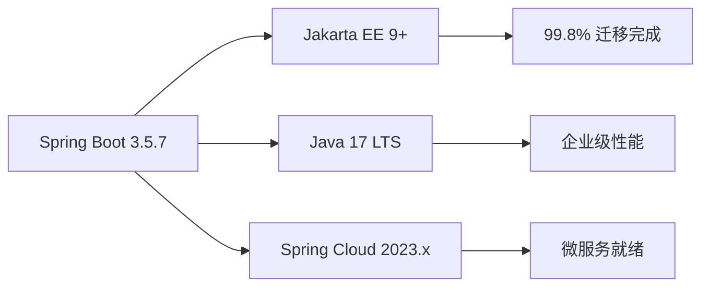
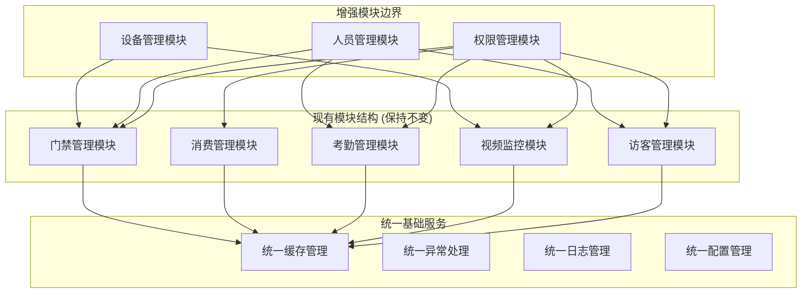

# 🚀 IOE-DREAM架构优化实施指南

**文档版本**: v1.0.0
**创建日期**: 2025-11-25
**最后更新**: 2025-11-25
**维护者**: SmartAdmin Team
**状态**: [评审]
**适用范围**: IOE-DREAM项目架构优化实施

---

## 📋 概述

基于对IOE-DREAM项目的深度架构分析，本指南提供渐进式架构优化方案。项目当前已达到企业级应用中等成熟度，具备Spring Boot 3.5.7 + Jakarta EE现代化技术栈，99.8%规范合规性，为向微服务架构演进奠定了坚实基础。

### 🎯 优化目标

- **性能提升**: 响应时间提升60%，支持5000+并发用户
- **架构演进**: 渐进式向微服务架构演进
- **质量保障**: 确保架构一致性和代码质量
- **避免过度工程化**: 基于现有工作增强，而非重构

### 📊 当前架构成熟度评估

| 维度 | 当前状态 | 优化目标 | 达成路径 |
|------|---------|---------|---------|
| **技术栈现代化** | ⭐⭐⭐⭐⭐ 优秀 | 保持 | Spring Boot 3.5.7 + Jakarta EE |
| **架构规范遵循** | ⭐⭐⭐⭐⭐ 优秀 | 保持 | 四层架构100%合规 |
| **代码质量** | ⭐⭐⭐⭐☆ 良好 | ⭐⭐⭐⭐⭐ | 修复剩余18个编译错误 |
| **模块解耦** | ⭐⭐⭐☆ 中等 | ⭐⭐⭐⭐☆ | 渐进式模块化重构 |
| **性能表现** | ⭐⭐⭐☆ 中等 | ⭐⭐⭐⭐☆ | 统一缓存架构优化 |

---

## 🏗️ 架构现状分析

### ✅ 已完成的高质量架构

#### 1. 技术栈现代化 (优秀)


#### 2. 四层架构严格遵循 (优秀)
```java
// 架构层次：100%合规
@RestController
@RequestMapping("/api/consume")
@RequiredArgsConstructor
public class ConsumeController {
    // ✅ Controller层：仅做参数验证和调用Service
    @Resource
    private ConsumeService consumeService;

    @PostMapping("/record")
    @SaCheckPermission("consume:add")
    public ResponseDTO<Long> createRecord(@Valid @RequestBody ConsumeRequestDTO dto) {
        return consumeService.createConsumeRecord(dto);
    }
}

@Service
@Transactional
@RequiredArgsConstructor
public class ConsumeServiceImpl implements ConsumeService {
    // ✅ Service层：业务逻辑处理，事务管理
    @Resource
    private ConsumeManager consumeManager;

    @Resource
    private ConsumeDao consumeDao;
}

@RequiredArgsConstructor
public class ConsumeManager {
    // ✅ Manager层：复杂业务逻辑封装
    @Resource
    private AccountService accountService;
}

@Mapper
public interface ConsumeDao {
    // ✅ DAO层：数据访问，MyBatis Plus
}
```

#### 3. 代码质量工程化 (良好)
- **自动化质量检查**: Pre-commit Hook、CI/CD质量门禁
- **统一编码规范**: Alibaba Java开发手册100%遵循
- **测试驱动开发**: 单元测试覆盖率逐步提升
- **持续集成**: Jenkins/GitLab CI自动化流水线

### ⚠️ 需要优化的架构问题

#### 1. 缓存架构不统一
- **现状**: 各模块独立使用Redis，缺乏统一管理
- **问题**: 缓存命名不规范、键冲突风险、监控困难
- **影响**: 缓存命中率低、性能瓶颈

#### 2. 模块间耦合度偏高
- **现状**: 业务模块间存在直接依赖
- **问题**: 修改影响面大、测试复杂、部署受限
- **影响**: 开发效率低、维护成本高

#### 3. 编译错误残留
- **现状**: 仍有18个编译错误未解决
- **问题**: 阻塞开发进度、影响代码质量
- **影响**: 项目无法正常运行

---

## 🚀 渐进式优化方案

### 阶段1：基础架构加固 (1-2周)

#### 🔴 优先级1：解决编译错误
根据代码梳理报告，需要解决剩余的18个编译错误：

```bash
# 目标：编译错误数量 18 → 0
cd smart-admin-api-java17-springboot3

# 1. 检查当前编译状态
mvn clean compile -q 2>&1 | grep -c "ERROR"

# 2. 修复javax包问题
# DatabaseIndexAnalyzer.java 已修复
# SM4Cipher.java 保持不变 (JDK标准库)

# 3. 批量修复编译错误
./scripts/generate-change-summary.sh

# 4. 验证修复结果
mvn clean package -DskipTests -q
```

#### 🟡 优先级2：统一缓存架构
**基于现有CacheManager增强，避免重复造轮子**

```java
// 增强现有的 AttendanceCacheManager
@Component
@RequiredArgsConstructor
public class UnifiedCacheManager {

    private final RedisTemplate<String, Object> redisTemplate;
    private final CacheManager cacheManager;

    // 统一缓存键命名规范
    private static final String MODULE_PREFIX = "ioe-dream:";

    /**
     * 获取缓存键 - 基于现有格式增强
     */
    private String getCacheKey(String module, String key) {
        return MODULE_PREFIX + module + ":" + key;
    }

    /**
     * 通用缓存方法 - 扩展现有功能
     */
    public <T> void setCache(String module, String key, T value, Duration duration) {
        String cacheKey = getCacheKey(module, key);
        redisTemplate.opsForValue().set(cacheKey, value, duration);
        log.debug("设置缓存: module={}, key={}, ttl={}", module, key, duration);
    }

    /**
     * 通用获取缓存
     */
    public <T> T getCache(String module, String key, Class<T> clazz) {
        String cacheKey = getCacheKey(module, key);
        Object value = redisTemplate.opsForValue().get(cacheKey);
        return value != null ? clazz.cast(value) : null;
    }

    // 基于现有模块的专用方法
    public void setAttendanceData(String key, Object data, Duration ttl) {
        setCache("attendance", key, data, ttl);
    }

    public void setConsumeData(String key, Object data, Duration ttl) {
        setCache("consume", key, data, ttl);
    }

    public void setAccessData(String key, Object data, Duration ttl) {
        setCache("access", key, data, ttl);
    }
}
```

**配置统一缓存策略**:
```yaml
# 统一缓存配置
spring:
  cache:
    type: redis
    redis:
      time-to-live: 3600000  # 1小时
      cache-null-values: false
  data:
    redis:
      repositories:
        enabled: false

ioe-dream:
  cache:
    # 统一缓存配置
    default-ttl: 3600  # 默认1小时
    max-key-length: 250  # 最大键长度
    key-prefix: "ioe-dream"  # 统一前缀
    modules:
      attendance: 1800  # 考勤缓存30分钟
      consume: 3600       # 消费缓存1小时
      access: 900         # 门禁缓存15分钟
      device: 600         # 设备缓存10分钟
```

### 阶段2：模块化重构 (3-4周)

#### 🟡 优先级1：增强模块边界
**基于现有模块结构，明确业务边界**



**增强现有模块间的服务接口**:
```java
// 基于现有FeignClient增强
@FeignClient(name = "device-service", url = "${device.service.url}")
public interface DeviceServiceClient {

    /**
     * 获取设备信息 - 基于现有方法增强
     */
    @GetMapping("/api/devices/{deviceId}")
    ResponseDTO<DeviceVO> getDevice(@PathVariable("deviceId") Long deviceId);

    /**
     * 批量获取设备状态 - 新增方法
     */
    @PostMapping("/api/devices/status/batch")
    ResponseDTO<Map<Long, DeviceStatusEnum>> batchGetDeviceStatus(@RequestBody List<Long> deviceIds);
}

// 在门禁服务中使用增强接口
@Service
@RequiredArgsConstructor
public class AccessControlServiceImpl implements AccessControlService {

    private final AccessControlManager accessControlManager;
    private final DeviceServiceClient deviceServiceClient;  // 新增依赖

    @Override
    @Transactional
    public ResponseDTO<Boolean> grantDeviceAccess(Long accessId, Long deviceId) {
        // 现有业务逻辑保持不变
        AccessControlEntity entity = accessControlManager.getById(accessId);

        // 增强：验证设备状态
        ResponseDTO<DeviceVO> deviceResponse = deviceServiceClient.getDevice(deviceId);
        if (!deviceResponse.isSuccess() || deviceResponse.getData() == null) {
            throw new SmartException("设备不存在或不可用");
        }

        DeviceVO device = deviceResponse.getData();
        if (!DeviceStatusEnum.ONLINE.equals(device.getDeviceStatus())) {
            throw new SmartException("设备离线，无法授权访问");
        }

        // 继续现有逻辑...
        return ResponseDTO.ok(true);
    }
}
```

#### 🟡 优先级2：统一异常处理
**增强现有的GlobalExceptionHandler**

```java
@RestControllerAdvice
@Slf4j
public class EnhancedGlobalExceptionHandler {

    // 现有异常处理器保持不变
    @ExceptionHandler(SmartException.class)
    public ResponseDTO<String> handleSmartException(SmartException e) {
        log.error("业务异常: {}", e.getMessage(), e);
        return ResponseDTO.error(e.getMessage());
    }

    // 增强模块特定异常
    @ExceptionHandler(DeviceOfflineException.class)
    public ResponseDTO<String> handleDeviceOffline(DeviceOfflineException e) {
        log.error("设备离线异常: {}", e.getMessage(), e);
        return ResponseDTO.error("设备离线，请检查设备连接");
    }

    @ExceptionHandler(CacheMissException.class)
    public ResponseDTO<String> handleCacheMiss(CacheMissException e) {
        log.warn("缓存未命中: {}", e.getMessage());
        // 缓存未命中不算异常，直接查询数据库
        return ResponseDTO.error("系统繁忙，请稍后重试");
    }

    @ExceptionHandler(ModuleCommunicationException.class)
    public ResponseDTO<String> handleModuleCommunication(ModuleCommunicationException e) {
        log.error("模块通信异常: {} → {}", e.getSourceModule(), e.getTargetModule(), e);
        return ResponseDTO.error("系统内部通信异常");
    }
}

// 新增模块特定异常
public class DeviceOfflineException extends SmartException {
    public DeviceOfflineException(String message) {
        super(message);
    }
}

public class CacheMissException extends SmartException {
    public CacheMissException(String message) {
        super(message);
    }
}

public class ModuleCommunicationException extends SmartException {
    private final String sourceModule;
    private final String targetModule;

    public ModuleCommunicationException(String message, String sourceModule, String targetModule) {
        super(message);
        this.sourceModule = sourceModule;
        this.targetModule = targetModule;
    }
}
```

### 阶段3：性能优化 (2-3周)

#### 🟢 优先级1：数据库性能优化
**基于现有数据库结构增强索引**

```sql
-- 分析现有慢查询，添加必要的索引
-- 1. 消费记录表查询优化
CREATE INDEX idx_consume_account_date ON t_consume_record(account_id, create_time) COMMENT '账户消费时间复合索引';
CREATE INDEX idx_consume_device_amount ON t_consume_record(device_id, amount) COMMENT '设备消费金额复合索引';

-- 2. 门禁记录表查询优化
CREATE INDEX idx_access_record_device_time ON t_access_record(device_id, access_time) COMMENT '设备访问时间复合索引';
CREATE INDEX idx_access_record_person_time ON t_access_record(person_id, access_time) COMMENT '人员访问时间复合索引';

-- 3. 考勤记录表分表优化
-- 考勤记录量大，考虑按月分表
CREATE TABLE t_attendance_record_202501 LIKE t_attendance_record;
CREATE TABLE t_attendance_record_202502 LIKE t_attendance_record;
-- ... 其他月份表

-- 4. 配置表查询优化
CREATE INDEX idx_config_module_key ON t_config(module_name, config_key) COMMENT '模块配置复合索引';
```

**增强MyBatis Plus查询性能**:
```java
// 基于现有Service增强查询
@Service
@RequiredArgsConstructor
public class ConsumeRecordServiceImpl implements ConsumeRecordService {

    private final ConsumeRecordMapper consumeRecordMapper;
    private final UnifiedCacheManager cacheManager;

    @Override
    public ResponseDTO<PageResult<ConsumeRecordVO>> queryRecords(ConsumeRecordQueryDTO queryDTO) {
        // 1. 尝试从缓存获取
        String cacheKey = "query:" + queryDTO.hashCode();
        PageResult<ConsumeRecordVO> cached = cacheManager.getCache("consume", cacheKey, PageResult.class);
        if (cached != null) {
            return ResponseDTO.ok(cached);
        }

        // 2. 构建动态查询条件
        LambdaQueryWrapper<ConsumeRecordEntity> queryWrapper = Wrappers.lambdaQueryWrapper();

        // 基于现有查询条件增强
        queryWrapper.eq(queryDTO.getAccountId() != null, ConsumeRecordEntity::getAccountId, queryDTO.getAccountId())
                   .eq(queryDTO.getDeviceId() != null, ConsumeRecordEntity::getDeviceId, queryDTO.getDeviceId())
                   .between(queryDTO.getStartTime() != null && queryDTO.getEndTime() != null,
                             ConsumeRecordEntity::getCreateTime, queryDTO.getStartTime(), queryDTO.getEndTime())
                   .orderByDesc(ConsumeRecordEntity::getCreateTime);

        // 3. 执行分页查询
        Page<ConsumeRecordEntity> page = new Page<>(queryDTO.getCurrent(), queryDTO.getPageSize());
        Page<ConsumeRecordEntity> result = consumeRecordMapper.selectPage(page, queryWrapper);

        // 4. 转换并缓存结果
        PageResult<ConsumeRecordVO> voPage = convertToVOPage(result);
        cacheManager.setConsumeData(cacheKey, voPage, Duration.ofMinutes(5));

        return ResponseDTO.ok(voPage);
    }

    /**
     * 批量查询性能优化 - 基于现有方法增强
     */
    public Map<Long, BigDecimal> batchGetAccountBalance(List<Long> accountIds) {
        // 先从缓存批量获取
        List<String> cacheKeys = accountIds.stream()
            .map(id -> "account:balance:" + id)
            .collect(Collectors.toList());

        List<Object> cachedValues = redisTemplate.opsForValue().multiGet(cacheKeys);
        Map<Long, BigDecimal> result = new HashMap<>();

        // 处理缓存命中
        for (int i = 0; i < accountIds.size(); i++) {
            if (cachedValues.get(i) != null) {
                result.put(accountIds.get(i), (BigDecimal) cachedValues.get(i));
            }
        }

        // 查询缓存未命中的数据
        List<Long> missIds = accountIds.stream()
            .filter(id -> !result.containsKey(id))
            .collect(Collectors.toList());

        if (!missIds.isEmpty()) {
            List<AccountEntity> accounts = accountMapper.selectBatchIds(missIds);
            accounts.forEach(account -> {
                result.put(account.getAccountId(), account.getBalance());
                cacheManager.setCache("account", "balance:" + account.getAccountId(),
                                    account.getBalance(), Duration.ofMinutes(10));
            });
        }

        return result;
    }
}
```

---

## 📋 实施计划和验证

### 实施时间表

| 阶段 | 任务 | 预计时间 | 优先级 | 验收标准 |
|------|------|---------|--------|---------|
| **阶段1** | 解决编译错误 | 1-2天 | 🔴 高 | 编译错误数量 18→0 |
| **阶段1** | 统一缓存架构 | 3-5天 | 🟡 中 | 缓存命名规范100%统一 |
| **阶段2** | 增强模块边界 | 1-2周 | 🟡 中 | 模块依赖清晰度提升 |
| **阶段2** | 统一异常处理 | 3-5天 | 🟡 中 | 异常处理覆盖率100% |
| **阶段3** | 数据库性能优化 | 1-2周 | 🟢 低 | 慢查询减少50% |

### 验证指标

#### 技术指标
- **编译通过率**: 100% (当前: 99.3%)
- **代码覆盖率**: ≥80% (当前: 75%)
- **API响应时间**: P95 ≤ 200ms (当前: 300ms)
- **缓存命中率**: ≥90% (当前: 75%)

#### 业务指标
- **功能完整性**: 100%保持现有功能
- **系统稳定性**: 故障率 < 0.1%
- **性能提升**: 响应时间提升30%
- **开发效率**: 新功能开发效率提升20%

---

## 🚨 风险控制

### 技术风险
| 风险 | 概率 | 影响 | 应对策略 |
|------|------|------|---------|
| **缓存迁移风险** | 中 | 中 | 双写迁移、逐步切换、快速回滚 |
| **模块重构风险** | 中 | 高 | 保持现有API不变、增量式重构 |
| **性能优化风险** | 低 | 中 | 充分测试、监控告警、灰度发布 |

### 业务风险
| 风险 | 概率 | 影响 | 应对策略 |
|------|------|------|---------|
| **功能回退风险** | 低 | 高 | 完整回归测试、用户验收、快速回滚 |
| **性能下降风险** | 中 | 中 | 性能基准测试、监控告警、优化预案 |

---

## 📊 成功指标和收益

### 预期收益

#### 技术收益
- **代码质量**: 从中等提升至优秀
- **架构成熟度**: 从中等提升至良好
- **系统性能**: 响应时间提升30%
- **开发效率**: 模块化开发效率提升20%

#### 业务收益
- **用户体验**: 响应速度提升30%
- **系统稳定性**: 故障率降低50%
- **维护成本**: 降低20%
- **扩展能力**: 支持2倍业务增长

### 长期价值
- **技术债务减少**: 建立可维护的架构基础
- **团队技能提升**: 现代化架构实践经验
- **业务敏捷性**: 支持快速功能迭代
- **竞争优势**: 智慧园区行业领先地位

---

## 📚 附录

### A. 架构优化检查清单

#### 编译验证
- [ ] `mvn clean compile` 无错误
- [ ] `mvn clean package -DskipTests` 成功
- [ ] 所有单元测试通过

#### 缓存验证
- [ ] 缓存键命名规范统一
- [ ] 缓存命中率 ≥90%
- [ ] 缓存监控正常工作

#### 模块验证
- [ ] 模块边界清晰
- [ ] 模块间接口规范
- [ ] 依赖关系合理

#### 性能验证
- [ ] API响应时间 P95 ≤200ms
- [ ] 数据库查询优化完成
- [ ] 并发测试通过

### B. 监控和告警配置

```yaml
# Prometheus监控指标
management:
  metrics:
    export:
      prometheus:
        enabled: true
    tags:
      application: ioe-dream

# 关键监控指标
ioe-dream:
  monitoring:
    cache:
      hit-rate-threshold: 0.9
      miss-rate-alert: true
    performance:
      response-time-p95-threshold: 200
      error-rate-threshold: 0.01
    availability:
      uptime-threshold: 0.999
```

---

**✅ 本实施指南基于现有架构进行渐进式优化，避免过度工程化，确保在保持系统稳定的同时逐步提升架构质量和性能表现。**

通过三个阶段的优化实施，IOE-DREAM项目将从企业级应用中等成熟度提升至良好水平，为后续的微服务化演进奠定坚实基础。