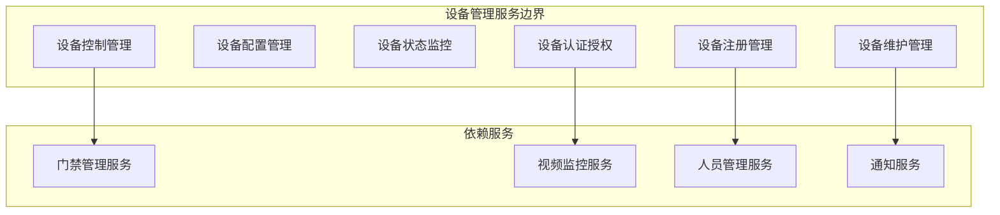
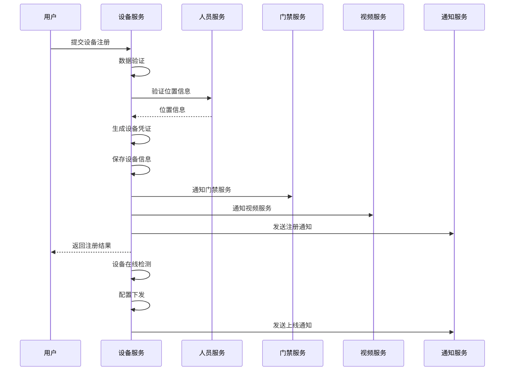
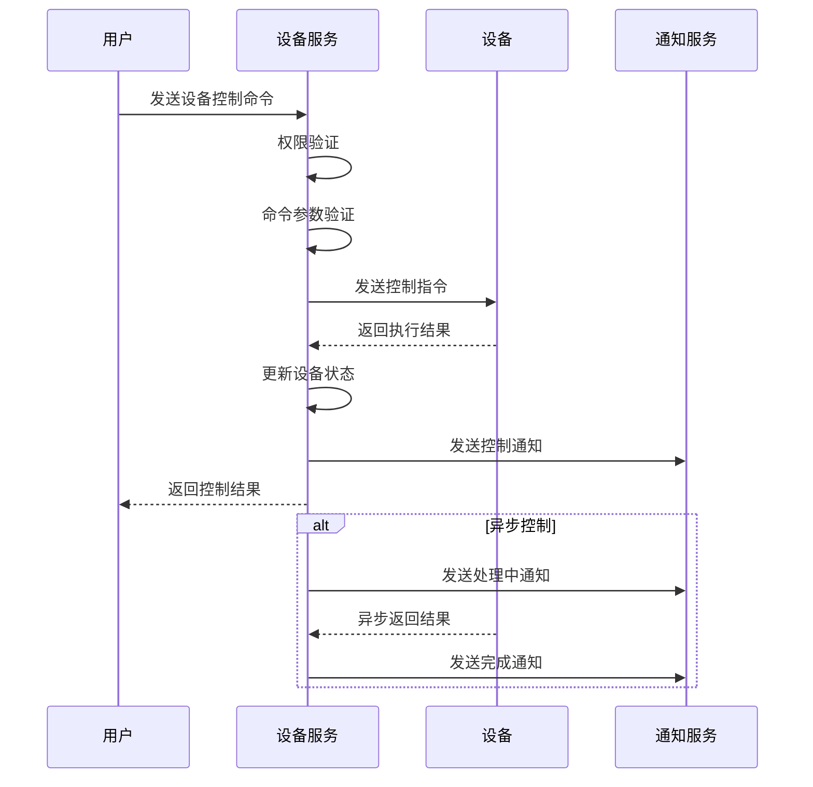

# 🔧 设备管理服务微服务设计

**文档版本**: v1.0.0
**创建日期**: 2025-11-25
**最后更新**: 2025-11-25
**维护者**: SmartAdmin Team
**状态**: [评审]
**适用范围**: IOE-DREAM设备管理服务

---

## 📋 服务概述

### 🎯 服务职责

设备管理服务是IOE-DREAM微服务架构中的核心基础服务，负责处理所有智能设备的全生命周期管理，包括设备注册、配置、监控、控制和维护。

### 🏗️ 服务边界



---

## 🏛️ 领域模型设计

### 核心聚合

#### 设备聚合 (Device Aggregate)

```java
// 设备聚合根
@Entity
@Table(name = "device")
@Data
@Builder
@NoArgsConstructor
@AllArgsConstructor
public class DeviceEntity extends BaseEntity {

    @Column(name = "device_code", unique = true, nullable = false)
    private String deviceCode;

    @Column(name = "device_name", nullable = false)
    private String deviceName;

    @Enumerated(EnumType.STRING)
    @Column(name = "device_type", nullable = false)
    private DeviceTypeEnum deviceType;

    @Enumerated(EnumType.STRING)
    @Column(name = "device_status", nullable = false)
    private DeviceStatusEnum deviceStatus;

    @Enumerated(EnumType.STRING)
    @Column(name = "device_protocol", nullable = false)
    private ProtocolEnum deviceProtocol;

    @Column(name = "device_ip")
    private String deviceIp;

    @Column(name = "device_port")
    private Integer devicePort;

    @Column(name = "mac_address")
    private String macAddress;

    @Column(name = "location_id")
    private Long locationId;

    @Column(name = "location_name")
    private String locationName;

    @Column(name = "config_json", columnDefinition = "JSON")
    private String configJson;

    @Column(name = "last_heartbeat_time")
    private LocalDateTime lastHeartbeatTime;

    @Column(name = "last_online_time")
    private LocalDateTime lastOnlineTime;

    @Column(name = "manufacturer")
    private String manufacturer;

    @Column(name = "model_number")
    private String modelNumber;

    @Column(name = "firmware_version")
    private String firmwareVersion;

    @Column(name = "remark")
    private String remark;
}

// 设备类型枚举
public enum DeviceTypeEnum {
    ACCESS_CONTROL("门禁设备"),
    VIDEO_CAMERA("视频摄像头"),
    ATTENDANCE_MACHINE("考勤机"),
    CONSUME_TERMINAL("消费终端"),
    INTERCOM("对讲机"),
    ALARM("报警设备"),
    SENSOR("传感器");
}

// 设备状态枚举
public enum DeviceStatusEnum {
    OFFLINE("离线"),
    ONLINE("在线"),
    FAULT("故障"),
    MAINTENANCE("维护中"),
    DISABLED("已禁用");
}

// 协议类型枚举
public enum ProtocolEnum {
    TCP("TCP"),
    UDP("UDP"),
    HTTP("HTTP"),
    HTTPS("HTTPS"),
    WEBSOCKET("WebSocket"),
    MQTT("MQTT");
}
```

### 值对象

#### 设备配置信息
```java
@Data
@Builder
public class DeviceConfigVO {
    private String deviceCode;
    private String deviceName;
    private DeviceTypeEnum deviceType;
    private ProtocolEnum protocol;
    private String ipAddress;
    private Integer port;
    private Map<String, Object> configParams;
    private DeviceStatusEnum status;
    private String locationName;
}
```

#### 设备监控信息
```java
@Data
@Builder
public class DeviceMonitorVO {
    private String deviceCode;
    private String deviceName;
    private DeviceStatusEnum currentStatus;
    private LocalDateTime lastHeartbeat;
    private LocalDateTime lastOnline;
    private Double cpuUsage;
    private Double memoryUsage;
    private Double diskUsage;
    private Integer onlineCount;
    private Integer offlineCount;
}
```

---

## 🔧 服务接口设计

### RESTful API设计

#### 设备基础管理
```java
@RestController
@RequestMapping("/api/devices")
@RequiredArgsConstructor
@Slf4j
public class DeviceController {

    private final DeviceService deviceService;

    /**
     * 设备注册
     */
    @PostMapping("/register")
    @SaCheckPermission("device:register")
    public ResponseDTO<Long> registerDevice(@Valid @RequestBody DeviceRegisterDTO dto) {
        log.info("注册设备: {}", dto);
        return deviceService.registerDevice(dto);
    }

    /**
     * 设备配置更新
     */
    @PutMapping("/{deviceId}/config")
    @SaCheckPermission("device:config")
    public ResponseDTO<Void> updateDeviceConfig(@PathVariable Long deviceId,
                                               @Valid @RequestBody DeviceConfigDTO dto) {
        log.info("更新设备配置: deviceId={}, config={}", deviceId, dto);
        return deviceService.updateDeviceConfig(deviceId, dto);
    }

    /**
     * 设备状态查询
     */
    @GetMapping("/{deviceId}/status")
    @SaCheckPermission("device:query")
    public ResponseDTO<DeviceStatusVO> getDeviceStatus(@PathVariable Long deviceId) {
        log.info("查询设备状态: deviceId={}", deviceId);
        return deviceService.getDeviceStatus(deviceId);
    }

    /**
     * 设备列表查询
     */
    @GetMapping
    @SaCheckPermission("device:query")
    public ResponseDTO<PageResult<DeviceListVO>> queryDevices(DeviceQueryDTO dto) {
        log.info("查询设备列表: {}", dto);
        return deviceService.queryDevices(dto);
    }

    /**
     * 设备控制
     */
    @PostMapping("/{deviceId}/control")
    @SaCheckPermission("device:control")
    public ResponseDTO<DeviceControlResultVO> controlDevice(@PathVariable Long deviceId,
                                                            @Valid @RequestBody DeviceControlDTO dto) {
        log.info("控制设备: deviceId={}, command={}", deviceId, dto.getCommand());
        return deviceService.controlDevice(deviceId, dto);
    }

    /**
     * 设备心跳上报
     */
    @PostMapping("/{deviceId}/heartbeat")
    public ResponseDTO<Void> deviceHeartbeat(@PathVariable Long deviceId,
                                            @RequestBody DeviceHeartbeatDTO dto) {
        log.debug("设备心跳: deviceId={}", deviceId);
        return deviceService.deviceHeartbeat(deviceId, dto);
    }

    /**
     * 设备批量导入
     */
    @PostMapping("/batch-import")
    @SaCheckPermission("device:import")
    public ResponseDTO<DeviceBatchImportResultVO> batchImportDevices(
            @Valid @RequestBody DeviceBatchImportDTO dto) {
        log.info("批量导入设备: count={}", dto.getDevices().size());
        return deviceService.batchImportDevices(dto);
    }

    /**
     * 设备统计分析
     */
    @GetMapping("/statistics")
    @SaCheckPermission("device:statistics")
    public ResponseDTO<DeviceStatisticsVO> getStatistics(DeviceStatisticsDTO dto) {
        log.info("设备统计分析: {}", dto);
        return deviceService.getStatistics(dto);
    }
}
```

#### 数据传输对象
```java
// 设备注册DTO
@Data
@Builder
@NoArgsConstructor
@AllArgsConstructor
public class DeviceRegisterDTO {

    @NotBlank(message = "设备编号不能为空")
    private String deviceCode;

    @NotBlank(message = "设备名称不能为空")
    private String deviceName;

    @NotNull(message = "设备类型不能为空")
    private DeviceTypeEnum deviceType;

    @NotNull(message = "协议类型不能为空")
    private ProtocolEnum protocol;

    private String deviceIp;

    private Integer devicePort;

    private String macAddress;

    private Long locationId;

    private String locationName;

    private Map<String, Object> configParams;

    private String manufacturer;

    private String modelNumber;

    private String firmwareVersion;
}

// 设备控制DTO
@Data
@Builder
@NoArgsConstructor
@AllArgsConstructor
public class DeviceControlDTO {

    @NotBlank(message = "控制命令不能为空")
    private String command;

    private Map<String, Object> parameters;

    private Integer timeout;

    private Boolean async;
}

// 设备心跳DTO
@Data
@Builder
@NoArgsConstructor
@AllArgsConstructor
public class DeviceHeartbeatDTO {

    @NotNull(message = "心跳时间不能为空")
    @JsonFormat(pattern = "yyyy-MM-dd HH:mm:ss")
    private LocalDateTime heartbeatTime;

    private DeviceStatusEnum deviceStatus;

    private Map<String, Object> statusData;

    private Double cpuUsage;

    private Double memoryUsage;

    private Double diskUsage;

    private Long onlineDuration;
}
```

---

## 🔄 业务流程设计

### 设备注册流程



### 设备控制流程



---

## 🗄️ 数据库设计

### 设备信息表 (t_device)

```sql
CREATE TABLE t_device (
    device_id BIGINT AUTO_INCREMENT PRIMARY KEY COMMENT '设备ID',
    device_code VARCHAR(64) UNIQUE NOT NULL COMMENT '设备编号',
    device_name VARCHAR(200) NOT NULL COMMENT '设备名称',
    device_type VARCHAR(50) NOT NULL COMMENT '设备类型',
    device_status VARCHAR(20) NOT NULL COMMENT '设备状态',
    device_protocol VARCHAR(20) NOT NULL COMMENT '通信协议',
    device_ip VARCHAR(45) COMMENT '设备IP地址',
    device_port INT COMMENT '设备端口',
    mac_address VARCHAR(17) COMMENT 'MAC地址',
    location_id BIGINT COMMENT '位置ID',
    location_name VARCHAR(200) COMMENT '位置名称',
    config_json TEXT COMMENT '设备配置(JSON格式)',
    last_heartbeat_time DATETIME COMMENT '最后心跳时间',
    last_online_time DATETIME COMMENT '最后在线时间',
    manufacturer VARCHAR(100) COMMENT '制造商',
    model_number VARCHAR(100) COMMENT '型号',
    firmware_version VARCHAR(50) COMMENT '固件版本',
    remark TEXT COMMENT '备注',
    create_time DATETIME DEFAULT CURRENT_TIMESTAMP COMMENT '创建时间',
    update_time DATETIME DEFAULT CURRENT_TIMESTAMP ON UPDATE CURRENT_TIMESTAMP COMMENT '更新时间',
    create_user_id BIGINT COMMENT '创建人ID',
    update_user_id BIGINT COMMENT '更新人ID',
    deleted_flag TINYINT DEFAULT 0 COMMENT '删除标识',
    version INT DEFAULT 1 COMMENT '版本号',

    INDEX idx_device_code (device_code),
    INDEX idx_device_type (device_type),
    INDEX idx_device_status (device_status),
    INDEX idx_location_id (location_id),
    INDEX idx_last_heartbeat (last_heartbeat_time),
    INDEX idx_create_time (create_time)
) ENGINE=InnoDB DEFAULT CHARSET=utf8mb4 COLLATE=utf8mb4_unicode_ci COMMENT='设备信息表';
```

### 设备心跳记录表 (t_device_heartbeat)

```sql
CREATE TABLE t_device_heartbeat (
    heartbeat_id BIGINT AUTO_INCREMENT PRIMARY KEY COMMENT '心跳ID',
    device_id BIGINT NOT NULL COMMENT '设备ID',
    heartbeat_time DATETIME NOT NULL COMMENT '心跳时间',
    device_status VARCHAR(20) NOT NULL COMMENT '设备状态',
    status_data TEXT COMMENT '状态数据(JSON格式)',
    cpu_usage DECIMAL(5,2) COMMENT 'CPU使用率',
    memory_usage DECIMAL(5,2) COMMENT '内存使用率',
    disk_usage DECIMAL(5,2) COMMENT '磁盘使用率',
    online_duration BIGINT COMMENT '在线时长(秒)',
    create_time DATETIME DEFAULT CURRENT_TIMESTAMP COMMENT '创建时间',

    INDEX idx_device_id (device_id),
    INDEX idx_heartbeat_time (heartbeat_time),
    INDEX idx_device_status (device_status),

    FOREIGN KEY (device_id) REFERENCES t_device(device_id)
) ENGINE=InnoDB DEFAULT CHARSET=utf8mb4 COLLATE=utf8mb4_unicode_ci COMMENT='设备心跳记录表';
```

### 设备控制记录表 (t_device_control_log)

```sql
CREATE TABLE t_device_control_log (
    control_id BIGINT AUTO_INCREMENT PRIMARY KEY COMMENT '控制ID',
    device_id BIGINT NOT NULL COMMENT '设备ID',
    control_command VARCHAR(100) NOT NULL COMMENT '控制命令',
    control_params TEXT COMMENT '控制参数(JSON格式)',
    control_result VARCHAR(500) COMMENT '控制结果',
    execute_status VARCHAR(20) NOT NULL COMMENT '执行状态',
    execute_time DATETIME COMMENT '执行时间',
    timeout_ms INT COMMENT '超时时间(毫秒)',
    user_id BIGINT COMMENT '操作用户ID',
    user_name VARCHAR(100) COMMENT '操作用户名',
    create_time DATETIME DEFAULT CURRENT_TIMESTAMP COMMENT '创建时间',

    INDEX idx_device_id (device_id),
    INDEX idx_control_command (control_command),
    INDEX idx_execute_status (execute_status),
    INDEX idx_create_time (create_time),

    FOREIGN KEY (device_id) REFERENCES t_device(device_id)
) ENGINE=InnoDB DEFAULT CHARSET=utf8mb4 COLLATE=utf8mb4_unicode_ci COMMENT='设备控制记录表';
```

---

## 🔐 安全设计

### 设备认证安全
- **设备证书**: 基于X.509证书的设备身份认证
- **密钥管理**: 设备密钥的安全分发和轮换
- **通信加密**: 设备与服务端通信加密
- **访问控制**: 基于设备的细粒度权限控制

### 数据安全
- **敏感数据加密**: 设备配置和状态数据加密存储
- **访问日志**: 完整的设备访问和控制日志
- **数据脱敏**: 日志中敏感信息自动脱敏
- **审计追踪**: 设备操作的全链路审计

### 接口安全
- **身份认证**: Sa-Token统一身份认证
- **权限验证**: 基于注解的权限验证
- **接口限流**: 基于设备类型的访问限流
- **参数验证**: 完整的参数校验和数据验证

---

## 📊 性能优化

### 设备连接管理
- **连接池**: 设备连接池优化
- **心跳优化**: 心跳频率自适应调整
- **批量处理**: 批量设备状态更新
- **异步处理**: 设备控制异步执行

### 数据处理优化
- **分区分表**: 按设备类型分表存储
- **索引优化**: 关键字段建立复合索引
- **缓存策略**: 热点设备信息Redis缓存
- **读写分离**: 查询操作使用只读库

### 监控指标
- **设备在线率**: 设备在线状态监控
- **响应时间**: 设备控制响应时间监控
- **并发连接数**: 同时连接设备数监控
- **错误率**: 设备通信错误率监控

---

## 🚀 部署配置

### 应用配置

```yaml
# 设备服务配置
spring:
  application:
    name: device-service

  datasource:
    driver-class-name: com.mysql.cj.jdbc.Driver
    url: jdbc:mysql://${DB_HOST:localhost}:${DB_PORT:3306}/${DB_NAME:ioe_dream_device}?useUnicode=true&characterEncoding=utf8mb4&useSSL=false&serverTimezone=Asia/Shanghai
    username: ${DB_USERNAME:root}
    password: ${DB_PASSWORD:password}
    hikari:
      minimum-idle: 10
      maximum-pool-size: 50
      idle-timeout: 300000
      max-lifetime: 1200000

  redis:
    host: ${REDIS_HOST:localhost}
    port: ${REDIS_PORT:6379}
    password: ${REDIS_PASSWORD:}
    database: 3
    timeout: 2000ms
    lettuce:
      pool:
        max-active: 50
        max-idle: 20
        min-idle: 10

# 设备服务配置
ioe-dream:
  device:
    # 设备连接配置
    connection:
      max-devices: 50000      # 最大设备连接数
      heartbeat-interval: 30  # 心跳间隔(秒)
      heartbeat-timeout: 120  # 心跳超时(秒)
      reconnect-attempts: 3   # 重连次数

    # 设备认证配置
    auth:
      certificate-expire-days: 365  # 证书有效期
      key-rotation-days: 90         # 密钥轮换周期
      max-failed-attempts: 5        # 最大失败次数

    # 设备控制配置
    control:
      default-timeout: 30      # 默认超时时间(秒)
      max-concurrent-controls: 100  # 最大并发控制数
      async-enabled: true       # 启用异步控制

# 监控配置
management:
  endpoints:
    web:
      exposure:
        include: health,info,metrics,prometheus
  endpoint:
    health:
      show-details: always
  metrics:
    export:
      prometheus:
        enabled: true
```

---

## 📋 测试策略

### 单元测试
- **Service层测试**: 设备业务逻辑测试
- **Controller层测试**: API接口测试
- **Repository层测试**: 数据访问测试
- **设备通信测试**: 设备协议通信测试

### 集成测试
- **设备注册测试**: 设备注册流程测试
- **设备控制测试**: 设备控制功能测试
- **心跳处理测试**: 设备心跳处理测试
- **并发连接测试**: 大量设备连接测试

### 性能测试
- **连接数测试**: 最大设备连接数测试
- **响应时间测试**: 设备控制响应时间测试
- **吞吐量测试**: 设备数据处理吞吐量测试
- **稳定性测试**: 长时间运行稳定性测试

### 测试覆盖率目标
- **代码覆盖率**: ≥80%
- **分支覆盖率**: ≥70%
- **接口覆盖率**: 100%
- **业务场景覆盖率**: 100%

---

**✅ 本设计文档为设备管理服务的开发实施提供了完整的技术指导，确保服务质量和架构标准。**