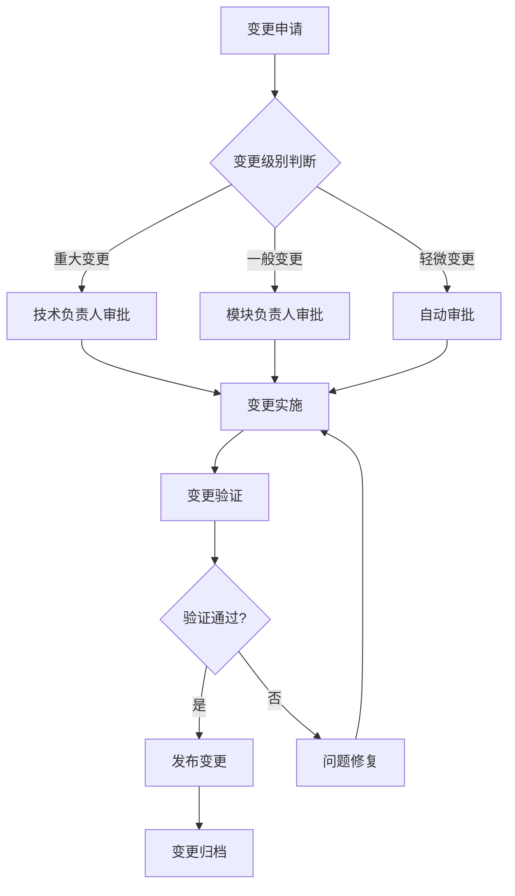
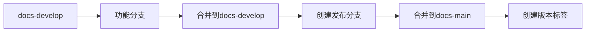

# IOE-DREAM项目文档版本控制规范

## 文档信息
- **文档版本**: v1.0.0
- **创建时间**: 2025-01-13
- **最后更新**: 2025-01-13
- **维护团队**: IOE-DREAM技术团队
- **审批状态**: 已批准

---

## 📋 版本控制概述

### 目标
建立严格的文档版本控制规范，确保文档版本与代码版本始终保持一致，支持可追溯的变更管理。

### 适用范围
本规范适用于IOE-DREAM项目的所有技术文档的版本控制管理。

---

## 🏷️ 版本号规范

### 1. 语义化版本控制 (SemVer)

#### 版本号格式
```
MAJOR.MINOR.PATCH[-PRERELEASE][+BUILD]

示例:
v1.0.0        - 正式版本
v1.1.0-alpha  - Alpha版本
v1.1.0-beta   - Beta版本
v1.1.0-rc     - Release Candidate版本
v1.1.0+build.123 - 构建版本
```

#### 版本号含义
- **MAJOR**: 主版本号 - 不兼容的API修改
- **MINOR**: 次版本号 - 向后兼容的功能性新增
- **PATCH**: 修订版本号 - 向后兼容的问题修正

#### 版本规则
```yaml
主版本变更 (MAJOR increment):
  - 架构重大调整
  - API接口不兼容修改
  - 核心功能删除或重构
  - 技术栈重大变更

次版本变更 (MINOR increment):
  - 新增功能模块
  - 新增API接口
  - 功能增强
  - 配置项新增

修订版本变更 (PATCH increment):
  - Bug修复
  - 文档错误修正
  - 性能优化
  - 安全漏洞修复
```

### 2. 文档状态标识

#### 状态分类
```markdown
[草稿] Draft - 正在编写阶段，内容可能变更
[评审] Review - 完成初稿，进入评审阶段
[稳定] Stable - 内容稳定，可正常使用
[废弃] Deprecated - 已被新版本替代，不建议使用
[归档] Archived - 历史文档，仅作参考
```

#### 版本显示格式
```markdown
完整格式: [状态] v1.0.0
示例:
[稳定] v1.0.0
[评审] v1.1.0-beta
[草稿] v2.0.0-alpha
```

### 3. 文档分类版本策略

#### 核心文档
```yaml
架构文档: 使用项目主版本号
- 项目版本 v1.0.0 → 架构文档 v1.0.0
- 项目版本 v1.1.0 → 架构文档 v1.0.0 (除非架构变更)
- 项目版本 v2.0.0 → 架构文档 v2.0.0

API文档: 每个API模块独立版本
- API文档 v1.0.0 → 对应API模块v1.0.0
- 新增API → MINOR版本递增
- API修改 → PATCH版本递增
- API删除 → MAJOR版本递增
```

#### 支撑文档
```yaml
部署文档: 每个部署环境独立版本
- 开发环境部署: v1.0.0-dev
- 测试环境部署: v1.0.0-test
- 生产环境部署: v1.0.0-prod

用户手册: 基于功能特性版本
- 基础功能手册: v1.0.0
- 高级功能手册: v1.1.0
- 扩展功能手册: v2.0.0
```

---

## 🔄 变更管理流程

### 1. 文档变更触发条件

#### 代码变更触发
```yaml
代码变更类型 → 文档变更要求:
- 新增API接口 → 必须更新API文档
- 修改API接口 → 必须更新API文档
- 删除API接口 → 必须更新API文档
- 新增数据表 → 必须更新数据库文档
- 修改数据结构 → 必须更新数据库文档
- 架构调整 → 必须更新架构文档
- 配置变更 → 必须更新配置文档
- 部署变更 → 必须更新部署文档
- 安全变更 → 必须更新安全文档
```

#### 文档变更触发
```yaml
文档变更类型 → 同步要求:
- 内容修正 → 必须验证代码实现一致性
- 格式调整 → 保持版本号不变
- 结构重组 → MINOR版本递增
- 重大改写 → MAJOR版本递增
```

### 2. 变更审批流程

#### 变更申请
```markdown
变更申请内容:
- 变更类型: [新增/修改/删除/重构]
- 变更范围: [文档/章节/段落]
- 变更原因: [业务需求/技术优化/错误修复]
- 影响分析: [影响范围/风险评估]
- 变更计划: [实施步骤/时间计划]
- 测试验证: [验证方法/验收标准]
```

#### 审批层级


#### 审批权限矩阵
```yaml
变更级别 → 审批人 → 最终审批:
重大变更 → 技术负责人 → 项目负责人
一般变更 → 模块负责人 → 技术负责人
轻微变更 → 自动审批 → 无需人工审批
紧急变更 → 项目负责人 → 技术负责人+项目负责人
```

### 3. 变更实施流程

#### 实施步骤
```bash
# 步骤1: 创建变更分支
git checkout -b doc/change-feature-name develop

# 步骤2: 进行文档修改
# 编辑文档文件...

# 步骤3: 更新文档版本信息
# 更新头部版本号和变更历史

# 步骤4: 本地验证
python3 scripts/check-doc-format.py
python3 scripts/check-doc-code-consistency.py

# 步骤5: 提交变更
git add .
git commit -m "docs: 更新API文档v1.1.0 - 新增用户管理接口"

# 步骤6: 创建合并请求
git push origin doc/change-feature-name
# 在GitHub/GitLab创建Pull Request/Merge Request

# 步骤7: 代码审查和自动化检查
# 自动触发CI/CD检查流程

# 步骤8: 合并到开发分支
git checkout develop
git merge doc/change-feature-name

# 步骤9: 创建发布标签
git tag -a doc-v1.1.0 -m "文档版本v1.1.0发布"
git push origin doc-v1.1.0

# 步骤10: 发布文档
# 自动化部署到文档服务器
```

---

## 📝 文档版本标签规范

### 1. Git标签命名规范

#### 标签格式
```bash
# 文档版本标签
doc-v{MAJOR}.{MINOR}.{PATCH}

# 示例:
doc-v1.0.0
doc-v1.1.0
doc-v1.1.1
doc-v2.0.0
```

#### 标签说明
```markdown
标签信息:
- 标签名称: doc-v1.0.0
- 标签说明: 对应的版本发布说明
- 关联提交: 对应的代码提交ID
- 创建时间: 标签创建时间
- 创建人: 标签创建者
```

### 2. 分支管理规范

#### 文档分支结构
```yaml
主要分支:
docs-main           # 文档稳定版本分支
docs-develop        # 文档开发版本分支
docs-release/{ver}  # 文档发布分支

功能分支:
docs/api-update-{feature}  # API文档更新分支
docs/arch-{feature}       # 架构文档更新分支
docs/{module}-update      # 模块文档更新分支
```

#### 分支生命周期


### 3. 发布流程

#### 发布检查清单
```markdown
发布前检查:
- [ ] 文档内容完整性检查
- [ ] 文档格式规范检查
- [ ] 版本号一致性检查
- [ ] 链接有效性检查
- [ ] 代码一致性检查
- [ ] 变更历史更新检查
- [ ] 审批流程完成检查
- [ ] 自动化测试通过检查

发布后验证:
- [ ] 文档服务器部署成功
- [ ] 文档可访问性验证
- [ ] 文档搜索功能验证
- [ ] 版本回滚机制验证
```

#### 发布命令
```bash
# 自动化发布脚本
#!/bin/bash
# scripts/release-doc.sh

VERSION=$1
ENVIRONMENT=$2

echo "发布文档版本: $VERSION 到环境: $ENVIRONMENT"

# 1. 检查版本格式
if ! [[ $VERSION =~ ^v[0-9]+\.[0-9]+\.[0-9]+$ ]]; then
    echo "错误: 版本号格式不正确"
    exit 1
fi

# 2. 检查文档质量
python3 scripts/check-doc-quality.py

# 3. 生成文档包
python3 scripts/generate-doc-package.py $VERSION

# 4. 部署到指定环境
if [ "$ENVIRONMENT" = "prod" ]; then
    # 部署到生产环境
    scp docs-package-$VERSION.tar.gz prod-server:/var/www/docs/
    ssh prod-server "cd /var/www/docs && tar -xzf docs-package-$VERSION.tar.gz"
    ssh prod-server "./update-docs.sh $VERSION"
fi

# 5. 创建发布记录
echo "$VERSION,$ENVIRONMENT,$(date)" >> /var/log/doc-releases.log

echo "文档发布完成: $VERSION"
```

---

## 📊 版本管理和追踪

### 1. 版本信息记录

#### 版本记录格式
```json
{
  "version": "v1.0.0",
  "status": "stable",
  "release_date": "2025-01-13T12:00:00Z",
  "changes": [
    {
      "type": "feature",
      "module": "API文档",
      "description": "新增用户管理API接口文档",
      "author": "开发者A",
      "files": [
        "docs/API_UserManagement.md",
        "docs/api/user-management.json"
      ]
    }
  ],
  "dependencies": {
    "project_version": "v1.0.0",
    "code_commit": "abc123456789"
  },
  "approval": {
    "reviewer": "技术负责人",
    "approve_date": "2025-01-13T10:00:00Z",
    "approve_comment": "文档内容准确，批准发布"
  }
}
```

#### 变更历史格式
```markdown
## 变更历史

| 版本 | 日期 | 变更内容 | 变更人 | 审批人 | 审批状态 |
|------|------|----------|--------|--------|----------|
| v1.0.0 | 2025-01-13 | 初始版本发布 | 开发者A | 技术负责人 | 已批准 |
| v1.0.1 | 2025-01-14 | 修复API文档错误 | 开发者B | 模块负责人 | 已批准 |
| v1.1.0 | 2025-01-15 | 新增高级功能文档 | 开发者C | 技术负责人 | 审核中 |
```

### 2. 版本追踪系统

#### 版本查询命令
```bash
# 查看所有文档版本
git tag -l "doc-*"

# 查看特定版本信息
git show doc-v1.0.0

# 查看版本差异
git diff doc-v1.0.0 doc-v1.1.0

# 检出特定版本文档
git checkout doc-v1.0.0 -- docs/API_UserManagement.md
```

#### 版本比较工具
```python
# scripts/version-diff.py

import subprocess
import json
from pathlib import Path

class VersionDiff:
    def __init__(self, project_root):
        self.project_root = Path(project_root)

    def compare_versions(self, v1, v2):
        """比较两个版本之间的差异"""
        result = {
            "version_from": v1,
            "version_to": v2,
            "added_files": [],
            "modified_files": [],
            "deleted_files": [],
            "changes": []
        }

        # 获取版本差异
        diff_output = subprocess.run([
            "git", "diff", f"doc-{v1}", f"doc-{v2}", "--name-only"
        ], capture_output=True, text=True).stdout

        # 解析差异
        for line in diff_output.strip().split('\n'):
            if line.startswith('A/'):
                result["added_files"].append(line[2:])
            elif line.startswith('M/'):
                result["modified_files"].append(line[2:])
            elif line.startswith('D/'):
                result["deleted_files"].append(line[2:])

        return result

    def generate_diff_report(self, v1, v2):
        """生成版本差异报告"""
        diff = self.compare_versions(v1, v2)

        report = f"""# 文档版本差异报告

## 版本信息
- 比较版本: {v1} → {v2}
- 生成时间: {datetime.now().strftime('%Y-%m-%d %H:%M:%S')}

## 文件变更统计
- 新增文件: {len(diff['added_files'])}
- 修改文件: {len(diff['modified_files'])}
- 删除文件: {len(diff['deleted_files'])}

## 详细变更列表

### 新增文件
"""

        for file in diff['added_files']:
            report += f"- {file}\n"

        report += "\n### 修改文件\n"
        for file in diff['modified_files']:
            report += f"- {file}\n"

        report += "\n### 删除文件\n"
        for file in diff['deleted_files']:
            report += f"- {file}\n"

        return report
```

### 3. 版本回滚机制

#### 回滚策略
```yaml
回滚触发条件:
- 重大错误发现
- 用户反馈严重问题
- 性能问题确认
- 安全漏洞确认

回滚流程:
1. 评估回滚影响
2. 选择回滚目标版本
3. 执行回滚操作
4. 验证回滚结果
5. 通知相关人员
```

#### 回滚命令
```bash
# 回滚到指定版本
#!/bin/bash
# scripts/rollback-doc.sh

TARGET_VERSION=$1
REASON=$2

echo "回滚文档到版本: $TARGET_VERSION"
echo "回滚原因: $REASON"

# 1. 验证目标版本存在
if ! git tag -l "doc-*" | grep -q "doc-$TARGET_VERSION"; then
    echo "错误: 目标版本 $TARGET_VERSION 不存在"
    exit 1
fi

# 2. 备份当前版本
BACKUP_DIR="backup/$(date +%Y%m%d_%H%M%S)"
mkdir -p "$BACKUP_DIR"
cp -r docs/ "$BACKUP_DIR/docs"
echo "当前版本已备份到: $BACKUP_DIR"

# 3. 执行回滚
git checkout "doc-$TARGET_VERSION" -- docs/

# 4. 验证回滚结果
if [ -f "docs/API_Overview.md" ]; then
    echo "✅ 文档回滚成功到版本: $TARGET_VERSION"

    # 记录回滚操作
    echo "$(date),$TARGET_VERSION,$REASON" >> /var/log/doc-rollbacks.log
else
    echo "❌ 文档回滚失败，正在恢复原版本..."
    git checkout HEAD -- docs/
    exit 1
fi
```

---

## 🔧 自动化工具

### 1. 版本管理工具

#### Python版本管理库
```python
# tools/doc_version_manager.py

import re
import json
from datetime import datetime
from pathlib import Path

class DocumentVersionManager:
    def __init__(self, docs_dir: str):
        self.docs_dir = Path(docs_dir)
        self.version_info_file = self.docs_dir / ".version-info.json"

    def extract_version_from_file(self, file_path: Path) -> str:
        """从文件中提取版本号"""
        try:
            content = file_path.read_text(encoding='utf-8')

            # 查找版本号格式
            version_patterns = [
                r'文档版本:\s*v?(\d+\.\d+\.\d+)',
                r'version[:\s]*["\']v?(\d+\.\d+\.\d+)["\']',
                r'@version\s+(\d+\.\d+\.\d+)'
            ]

            for pattern in version_patterns:
                match = re.search(pattern, content, re.IGNORECASE)
                if match:
                    return match.group(1)

        except Exception as e:
            print(f"读取文件失败: {file_path} - {str(e)}")

        return None

    def update_version_in_file(self, file_path: Path, new_version: str) -> bool:
        """更新文件中的版本号"""
        try:
            content = file_path.read_text(encoding='utf-8')

            # 更新版本号
            updated_content = re.sub(
                r'(文档版本:\s*v?)(\d+\.\d+\.\d+)',
                f'\\1{new_version}',
                content,
                flags=re.IGNORECASE
            )

            updated_content = re.sub(
                r'(version[:\s]*["\']v?)(\d+\.\d+\.\d+)(["\'])',
                f'\\1{new_version}\\3',
                updated_content
            )

            file_path.write_text(updated_content, encoding='utf-8')
            return True

        except Exception as e:
            print(f"更新文件失败: {file_path} - {str(e)}")
            return False

    def get_next_version(self, current_version: str, increment_type: str = 'patch') -> str:
        """获取下一个版本号"""
        parts = list(map(int, current_version.split('.')))

        if increment_type == 'major':
            parts[0] += 1
            parts[1] = 0
            parts[2] = 0
        elif increment_type == 'minor':
            parts[1] += 1
            parts[2] = 0
        elif increment_type == 'patch':
            parts[2] += 1

        return f"{parts[0]}.{parts[1]}.{parts[2]}"

    def increment_version(self, file_path: Path, increment_type: str = 'patch') -> str:
        """递增文件版本号"""
        current_version = self.extract_version_from_file(file_path)
        if not current_version:
            return None

        new_version = self.get_next_version(current_version, increment_type)

        if self.update_version_in_file(file_path, new_version):
            return new_version

        return None
```

### 2. 批量版本更新工具

#### 批量版本更新脚本
```bash
#!/bin/bash
# scripts/batch-update-version.sh

OLD_VERSION=$1
NEW_VERSION=$2
REASON=$3

if [ -z "$OLD_VERSION" ] || [ -z "$NEW_VERSION" ]; then
    echo "用法: $0 <旧版本> <新版本> <变更原因>"
    exit 1
fi

echo "批量更新文档版本: $OLD_VERSION → $NEW_VERSION"
echo "变更原因: $REASON"

# 查找所有包含版本信息的文档文件
find docs/ -name "*.md" -exec grep -l "文档版本\|version" {} \; | while read file; do
    echo "处理文件: $file"

    # 检查是否包含旧版本
    if grep -q "$OLD_VERSION" "$file"; then
        # 备份原文件
        cp "$file" "$file.backup"

        # 更新版本号
        sed -i "s/$OLD_VERSION/$NEW_VERSION/g" "$file"

        # 更新变更历史
        if ! grep -q "## 变更历史" "$file"; then
            # 如果没有变更历史部分，添加一个
            cat >> "$file" << 'EOF'

## 变更历史

| 版本 | 日期 | 变更内容 | 变更人 | 审批人 |
|------|------|----------|--------|--------|
EOF
        fi

        # 添加新的变更记录
        CURRENT_DATE=$(date '+%Y-%m-%d')
        CURRENT_USER=$(git config user.name)

        # 在变更历史表格前插入新记录
        sed -i "/## 变更历史/a\\| $NEW_VERSION | $CURRENT_DATE | $REASON | $CURRENT_USER |  |" "$file"

        echo "  ✓ 已更新: $file"
    else
        echo "  - 跳过: $file (不包含旧版本)"
    fi
done

echo "批量版本更新完成！"
```

### 3. 版本一致性检查工具

#### 一致性检查脚本
```python
# scripts/version-consistency-check.py

import subprocess
import re
from pathlib import Path

class VersionConsistencyChecker:
    def __init__(self, project_root: str):
        self.project_root = Path(project_root)

    def check_pom_version(self):
        """检查项目POM版本"""
        pom_path = self.project_root / "pom.xml"
        if not pom_path.exists():
            return None

        try:
            content = pom_path.read_text(encoding='utf-8')
            version_match = re.search(r'<version>([^<]+)</version>', content)
            if version_match:
                return version_match.group(1)
        except Exception:
            pass

        return None

    def check_document_versions(self):
        """检查所有文档版本"""
        versions = {}

        # 检查markdown文档
        for doc_file in self.project_root.rglob("*.md"):
            version = self.extract_version_from_file(doc_file)
            if version:
                versions[str(doc_file.relative_to(self.project_root))] = version

        return versions

    def extract_version_from_file(self, file_path: Path) -> str:
        """从文件中提取版本号"""
        try:
            content = file_path.read_text(encoding='utf-8')

            # 多种版本号格式
            version_patterns = [
                r'文档版本:\s*v?(\d+\.\d+\.\d+)',
                r'version[:\s]*["\']v?(\d+\.\d+\.\d+)["\']',
                r'@version\s+(\d+\.\d+\.\d+)',
                r'version["\']: ["\']v?(\d+\.\d+\.\d+)["\']'
            ]

            for pattern in version_patterns:
                match = re.search(pattern, content, re.IGNORECASE)
                if match:
                    return match.group(1)

        except Exception:
            pass

        return None

    def run_consistency_check(self):
        """运行一致性检查"""
        print("🔍 开始版本一致性检查...")

        # 获取项目版本
        project_version = self.check_pom_version()

        # 获取文档版本
        doc_versions = self.check_document_versions()

        if not doc_versions:
            print("  ⚠️  未找到包含版本信息的文档")
            return True

        issues = []

        for doc_file, doc_version in doc_versions.items():
            # 检查版本格式
            if not re.match(r'^\d+\.\d+\.\d+$', doc_version):
                issues.append(f"版本格式错误: {doc_file} - {doc_version}")
                continue

            # 检查与项目版本的一致性
            if project_version:
                # 核心文档应该与项目版本保持一致
                if any(keyword in doc_file.lower() for keyword in ['architecture', 'project', 'system']):
                    if doc_version != project_version:
                        issues.append(f"版本不一致: {doc_file} (文档:{doc_version} vs 项目:{project_version})")

        # 输出结果
        if issues:
            print(f"  ❌ 发现 {len(issues)} 个版本一致性问题:")
            for i, issue in enumerate(issues, 1):
                print(f"    {i}. {issue}")
            return False
        else:
            print(f"  ✅ 检查了 {len(doc_versions)} 个文档，版本一致性正常")

            if project_version:
                print(f"  项目版本: {project_version}")
                print(f"  文档版本数: {len(doc_versions)}")

            return True

def main():
    import sys

    if len(sys.argv) > 1:
        project_root = sys.argv[1]
    else:
        project_root = "."

    checker = VersionConsistencyChecker(project_root)
    success = checker.run_consistency_check()

    sys.exit(0 if success else 1)

if __name__ == "__main__":
    main()
```

---

## 📋 使用指南

### 1. 日常使用

#### 创建新文档
```bash
# 创建文档分支
git checkout -b docs/new-feature develop

# 创建新文档文件
touch docs/NewFeature.md

# 添加文档头部信息
# 必须包含版本信息、创建时间、作者等信息
```

#### 更新文档
```bash
# 更新文档内容
# 修改文档文件...

# 更新版本号（自动）
python3 scripts/increment-doc-version.py docs/API_UserManagement.md minor

# 更新变更历史
# 在变更历史表格中添加新记录
```

#### 发布文档
```bash
# 提交变更
git add .
git commit -m "docs: 更新用户管理API文档v1.1.0"

# 创建版本标签
git tag -a doc-v1.1.0 -m "用户管理API文档v1.1.0发布"

# 推送标签
git push origin doc-v1.1.0

# 触发自动发布
# GitHub Actions会自动处理文档发布
```

### 2. 批量操作

#### 批量版本更新
```bash
# 更新所有文档版本
./scripts/batch-update-version.sh v1.0.0 v1.1.0 "新增功能模块文档"

# 检查版本一致性
python3 scripts/version-consistency-check.py

# 批量生成变更摘要
./scripts/generate-change-summary.sh
```

### 3. 故障处理

#### 版本回滚
```bash
# 回滚到指定版本
./scripts/rollback-doc.sh v1.0.0 "发现严重错误需要回滚"

# 恢复备份版本
cp backup/20250113_143000/docs/* docs/

# 验证恢复结果
python3 scripts/version-consistency-check.py
```

---

## 📊 成功标准

### 质量指标
- [ ] 版本号格式正确率 = 100%
- [ ] 文档与代码版本一致性 ≥ 95%
- [ ] 变更历史记录完整性 = 100%
- [ ] 版本控制流程遵循率 = 100%

### 效率指标
- [ ] 文档版本更新自动化率 ≥ 90%
- [ ] 版本一致性检查覆盖率 = 100%
- [ ] 变更处理时间 ≤ 24小时
- [ ] 版本回滚成功率 = 100%

### 可用性指标
- [ ] 版本查询成功率 = 100%
- [ ] 版本比较功能可用性 = 100%
- [ ] 批量操作成功率 ≥ 95%
- [ ] 故障恢复时间 ≤ 1小时

---

## 📞 支持与维护

### 工具支持
- **版本管理工具**: 提供Python版本管理库
- **自动化脚本**: 提供批量更新和检查脚本
- **CI/CD集成**: 与GitHub Actions深度集成
- **监控告警**: 版本不一致自动告警

### 流程支持
- **变更审批**: 提供完整的审批流程
- **质量检查**: 自动化文档质量检查
- **版本验证**: 自动化版本一致性验证
- **发布管理**: 自动化文档发布流程

### 持续改进
- **定期评估**: 每月评估版本管理效果
- **工具升级**: 根据需求升级版本管理工具
- **流程优化**: 基于实践优化版本控制流程
- **培训支持**: 提供版本管理培训和文档

---

**💡 核心理念**: 版本控制是文档管理的核心，需要建立严格的流程和自动化工具支持。通过完整的版本控制规范，确保文档的准确性、可追溯性和可维护性，为项目的长期发展提供有力支撑。