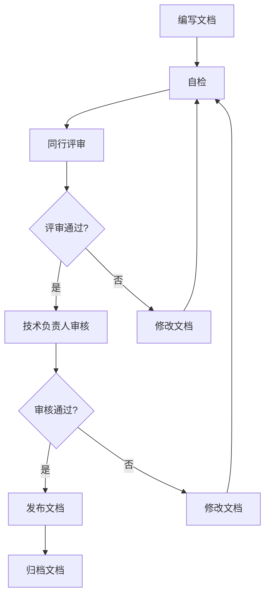

# IOE-DREAM项目文档版本化管理规范

## 文档信息
- **文档版本**: v1.0.0
- **创建时间**: 2025-01-13
- **最后更新**: 2025-01-13
- **维护团队**: IOE-DREAM技术团队
- **审批状态**: 已批准

---

## 📋 文档版本化管理概述

### 目标
建立完整的文档版本化管理体系，确保文档与代码始终保持一致，支持项目的可持续发展。

### 范围
本规范适用于IOE-DREAM项目的所有技术文档：
- 技能文档 (.claude/skills/)
- 项目架构文档 (docs/architecture/)
- 开发规范文档 (docs/repowiki/)
- 业务流程文档 (docs/business/)
- 部署运维文档 (docs/deployment/)
- 用户使用文档 (docs/user/)

---

## 🏗️ 文档版本控制规范

### 1. 版本号策略

#### 语义化版本号 (SemVer)
```
格式: MAJOR.MINOR.PATCH

MAJOR: 重大变更 - 不兼容的API修改
MINOR: 功能变更 - 向后兼容的功能新增
PATCH: 错误修复 - 向后兼容的错误修正

示例:
v1.0.0 - 初始版本
v1.1.0 - 新增功能
v1.1.1 - 错误修复
v2.0.0 - 重大架构变更
```

#### 文档状态标识
```
状态标识:
[草稿] - Draft: 正在编写中的文档
[评审] - Review: 待评审的文档
[稳定] - Stable: 稳定可用的文档
[废弃] - Deprecated: 已废弃的文档
[归档] - Archived: 归档的历史文档

显示格式: [状态] v1.0.0
示例: [稳定] v1.0.0
```

### 2. 版本控制命令

#### Git标签规范
```bash
# 创建文档版本标签
git tag -a doc-v1.0.0 -m "文档版本v1.0.0发布"

# 推送标签到远程仓库
git push origin doc-v1.0.0

# 查看所有文档标签
git tag -l "doc-*"

# 检出特定文档版本
git checkout doc-v1.0.0
```

#### 分支管理策略
```bash
# 文档主分支
docs-main          # 文档稳定版本

# 文档开发分支
docs-develop       # 文档开发版本

# 功能分支
docs/microservice-architecture-v1  # 微服务架构文档开发
docs/api-gateway-v1               # API网关文档开发
docs/security-v1                   # 安全文档开发
```

---

## 📝 文档编写规范

### 1. 文档头部模板

```markdown
# 文档标题

## 文档信息
- **文档版本**: v1.0.0
- **创建时间**: 2025-01-13
- **最后更新**: 2025-01-13
- **作者**: SmartAdmin Team
- **审批状态**: [草稿|评审|稳定|废弃]
- **关联代码版本**: v1.0.0
- **相关链接**: [相关文档链接]

## 变更历史

| 版本 | 日期 | 变更内容 | 变更人 | 审批人 |
|------|------|----------|--------|--------|
| v1.0.0 | 2025-01-13 | 初始版本 | 开发者 | 审批者 |
| v1.0.1 | 2025-01-14 | 修复错误A | 开发者 | 审批者 |

---

# 文档正文开始...
```

### 2. 文档结构标准

```markdown
# 文档标题

## 1. 概述
- 文档目的
- 适用范围
- 读者对象

## 2. 背景说明
- 业务背景
- 技术背景
- 现状分析

## 3. 详细内容
- 核心内容章节
- 具体实现细节
- 示例和图表

## 4. 实施指导
- 实施步骤
- 注意事项
- 风险控制

## 5. 参考资料
- 相关链接
- 技术文档
- 外部资源

## 6. 附录
- 术语表
- 代码示例
- 常见问题
```

---

## 🔗 文档与代码同步机制

### 1. 同步触发条件

#### 代码变更触发
```bash
# 以下情况需要更新文档：
- 新增API接口 → 更新API文档
- 修改数据结构 → 更新数据库文档
- 架构重大变更 → 更新架构文档
- 业务逻辑变更 → 更新业务文档
- 部署流程变更 → 更新部署文档
- 安全配置变更 → 更新安全文档
```

#### 文档变更触发
```bash
# 文档变更后需要验证：
- 代码实现是否与文档一致
- API接口是否按文档实现
- 配置是否按文档设置
- 部署流程是否按文档执行
```

### 2. 自动化同步工具

#### 文档-代码一致性检查脚本
```bash
#!/bin/bash
# docs/code-doc-consistency-check.sh

echo "🔍 开始文档与代码一致性检查..."

# 1. 检查API文档与Controller一致性
echo "步骤1: 检查API文档一致性"
python3 scripts/check-api-consistency.py

# 2. 检查数据库文档与Entity一致性
echo "步骤2: 检查数据库文档一致性"
python3 scripts/check-db-consistency.py

# 3. 检查配置文档与配置文件一致性
echo "步骤3: 检查配置文档一致性"
python3 scripts/check-config-consistency.py

# 4. 检查架构文档与代码结构一致性
echo "步骤4: 检查架构文档一致性"
python3 scripts/check-architecture-consistency.py

echo "✅ 文档与代码一致性检查完成"
```

#### 自动化文档生成工具
```python
# scripts/auto-doc-generator.py

import os
import re
from pathlib import Path

class DocumentGenerator:
    def __init__(self, project_root):
        self.project_root = Path(project_root)
        self.docs_dir = self.project_root / "docs"

    def generate_api_docs(self):
        """自动生成API文档"""
        controllers = self.find_controllers()
        api_docs = self.extract_api_info(controllers)
        self.save_api_docs(api_docs)

    def find_controllers(self):
        """查找所有Controller文件"""
        return list(self.project_root.rglob("*Controller.java"))

    def extract_api_info(self, controllers):
        """从Controller中提取API信息"""
        api_info = {}
        for controller in controllers:
            # 解析Controller文件
            info = self.parse_controller_file(controller)
            api_info[controller.stem] = info
        return api_info

    def parse_controller_file(self, file_path):
        """解析单个Controller文件"""
        # 实现文件解析逻辑
        pass

    def save_api_docs(self, api_docs):
        """保存API文档"""
        # 生成markdown文档
        pass
```

### 3. 版本同步策略

#### 版本匹配规则
```
文档版本与代码版本对应关系:
- 代码版本 v1.0.0 → 文档版本 v1.0.0
- 代码版本 v1.0.1 → 文档版本 v1.0.1 (如果是文档相关修复)
- 代码版本 v1.1.0 → 文档版本 v1.1.0 (如果是功能新增)
- 代码版本 v2.0.0 → 文档版本 v2.0.0 (如果是重大变更)
```

#### 版本不兼容处理
```bash
# 当文档版本与代码版本不兼容时：
1. 创建新的文档分支
2. 更新文档内容
3. 进行文档评审
4. 发布新版本文档
5. 归档旧版本文档
```

---

## 🛠️ 文档质量管理

### 1. 质量检查清单

#### 内容质量检查
```markdown
- [ ] 文档标题准确反映内容
- [ ] 目录结构清晰合理
- [ ] 内容逻辑连贯完整
- [ ] 示例代码可运行验证
- [ ] 图表清晰准确
- [ ] 链接有效可访问
- [ ] 术语使用一致
- [ ] 错别字和语法正确
```

#### 技术准确性检查
```markdown
- [ ] 代码示例与实际代码一致
- [ ] 配置示例与实际配置一致
- [ ] API描述与实际接口一致
- [ ] 数据结构描述与实际一致
- [ ] 部署步骤与实际流程一致
- [ ] 技术术语使用正确
- [ ] 版本信息准确无误
```

#### 格式规范检查
```markdown
- [ ] 遵循Markdown格式规范
- [ ] 代码块语法高亮正确
- [ ] 表格格式正确
- [ ] 图片尺寸合适
- [ ] 文档结构层次清晰
- [ ] 标题层级合理
- [ ] 列表格式正确
```

### 2. 评审流程

#### 文档评审步骤


#### 评审检查点
```markdown
#### 编写者自检清单
- 内容完整性和准确性
- 格式规范性和一致性
- 技术正确性和可操作性

#### 同行评审清单
- 技术方案的合理性
- 实现细节的准确性
- 用户体验的友好性

#### 技术负责人审核清单
- 架构设计的合理性
- 技术选型的适当性
- 影响范围评估的准确性
```

### 3. 持续改进机制

#### 文档质量指标
```yaml
质量指标:
  文档准确率: ≥95%
  代码覆盖率: 100%
  用户满意度: ≥90%
  更新及时性: ≤7天

监控指标:
  文档访问量
  文档反馈数量
  文档错误报告数
  文档更新频率
```

#### 改进流程
```markdown
1. 收集用户反馈
2. 分析文档问题
3. 制定改进计划
4. 实施改进措施
5. 验证改进效果
6. 更新质量标准
```

---

## 📚 文档维护指南

### 1. 日常维护职责

#### 文档负责人职责
```markdown
技术文档负责人:
- 制定文档标准和规范
- 组织文档评审和审核
- 监控文档质量指标
- 协调文档与代码同步

各模块文档负责人:
- 维护模块相关文档
- 确保文档与代码一致
- 处理模块文档反馈
- 参与文档评审活动
```

#### 维护任务清单
```markdown
每周任务:
- 检查文档与代码一致性
- 处理用户文档反馈
- 更新文档变更历史
- 统计文档使用情况

每月任务:
- 评估文档质量指标
- 分析文档使用趋势
- 识别文档改进机会
- 制定文档优化计划

每季度任务:
- 全面检查文档质量
- 更新文档标准和规范
- 培训团队文档技能
- 评估文档工具效果
```

### 2. 文档归档策略

#### 归档标准
```markdown
归档条件:
- 文档版本超过3个版本以上
- 功能已废弃或替换
- 技术栈已升级不再使用
- 业务已停止运营

归档流程:
1. 添加归档标记
2. 移动到归档目录
3. 更新文档索引
4. 通知相关人员
```

#### 归档目录结构
```
docs/archive/
├── v1.0/                    # 版本1.0归档
│   ├── architecture/        # 架构文档
│   ├── api/                # API文档
│   └── deployment/         # 部署文档
├── v2.0/                    # 版本2.0归档
└── legacy/                  # 历史文档
```

---

## 🔧 工具和自动化

### 1. 文档管理工具

#### Markdown编辑器推荐
```yaml
VS Code扩展:
  - Markdown All in One: 全功能Markdown编辑
  - Mermaid Markdown Syntax Highlighting: 流程图支持
  - Prettier: 代码格式化
  - GitLens: Git版本控制
  - Docsify: 文档生成

Typora:
  所见即所得Markdown编辑器
  实时预览
  图片拖拽上传
  自动保存
```

#### 文档生成工具
```yaml
自动化工具:
  - JSDoc: JavaScript API文档生成
  - Swagger: API文档生成
  - Javadoc: Java代码文档生成
  - Doxygen: 多语言代码文档生成
  - Sphinx: Python文档生成
```

### 2. 集成工具

#### Git Hooks配置
```bash
#!/bin/sh
# .git/hooks/pre-commit

echo "🔍 执行提交前文档检查..."

# 检查文档格式
python3 scripts/check-doc-format.py

# 检查文档与代码一致性
python3 scripts/check-code-doc-consistency.py

# 检查文档链接
python3 scripts/check-doc-links.py

echo "✅ 文档检查通过"
```

#### CI/CD集成
```yaml
# .github/workflows/doc-quality-check.yml
name: 文档质量检查

on:
  push:
    branches: [ main, develop ]
    paths: [ '**/*.md', 'docs/**' ]

jobs:
  doc-quality:
    runs-on: ubuntu-latest
    steps:
      - uses: actions/checkout@v2
      - name: 检查文档格式
        run: |
          pip install markdownlint-cli
          markdownlint '**/*.md'

      - name: 检查文档链接
        run: |
          npm install -g markdown-link-check
          markdown-link-check docs/

      - name: 检查文档与代码一致性
        run: |
          python3 scripts/check-code-doc-consistency.py
```

---

## 📊 成功标准

### 质量指标
- [ ] 文档准确率 ≥ 95%
- [ ] 代码覆盖率 = 100%
- [ ] 用户满意度 ≥ 90%
- [ ] 更新及时性 ≤ 7天

### 效率指标
- [ ] 文档编写效率提升 50%
- [ ] 查找效率提升 80%
- [ ] 维护成本降低 60%
- [ ] 错误率降低 90%

### 可用性指标
- [ ] 文档访问成功率 = 100%
- [ ] 文档搜索准确率 ≥ 95%
- [ ] 文档阅读体验 ≥ 4.5/5.0
- [ ] 文档反馈响应时间 ≤ 24小时

---

## 📞 支持与反馈

### 技术支持
- **文档问题**: 提交到项目Issue
- **工具问题**: 联系DevOps团队
- **流程问题**: 联系技术负责人
- **培训需求**: 联系培训团队

### 反馈渠道
- **Issue反馈**: GitHub项目Issues
- **邮件反馈**: docs@ioe-dream.com
- **群聊反馈**: 内部技术交流群
- **会议反馈: 定期文档评审会议

### 持续改进
- **定期评估**: 每月进行文档质量评估
- **用户调研**: 每季度进行用户满意度调研
- **工具升级**: 持续优化文档管理工具
- **标准更新**: 根据实践更新文档标准

---

**💡 核心理念**: 文档是项目成功的重要组成部分，需要与代码同等的重视和维护。通过建立完整的版本化管理体系，确保文档始终保持高质量、高准确性，为项目的持续发展提供有力支撑。