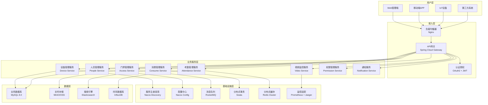
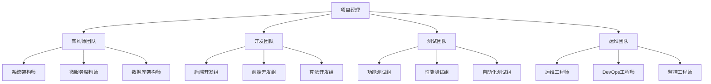
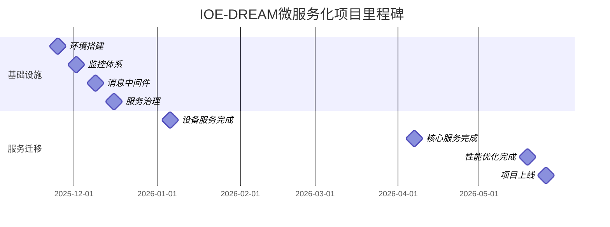

# 🚀 IOE-DREAM微服务架构实施计划

**文档版本**: v1.0.0
**创建日期**: 2025-11-25
**最后更新**: 2025-11-25
**维护者**: SmartAdmin Team
**状态**: [评审]
**适用范围**: IOE-DREAM微服务化项目实施

---

## 📋 项目概述

### 🎯 项目目标

基于IOE-DREAM项目现状，实施渐进式微服务化改造，建立企业级微服务架构，提升系统的可扩展性、可维护性和团队开发效率。

### 📊 项目范围

#### 包括范围
- ✅ 后端服务微服务化改造
- ✅ API网关和服务治理
- ✅ 配置中心和服务发现
- ✅ 分布式事务处理
- ✅ 监控告警体系
- ✅ 自动化部署流水线

#### 不包括范围
- ❌ 前端架构重构（保持现有Vue3架构）
- ❌ 数据库集群搭建（基础设施层面）
- ❌ 网络安全架构改造
- ❌ 硬件设备更新

---

## 🏗️ 技术架构设计

### 整体架构图



### 技术栈选型

| 技术领域 | 选型方案 | 版本 | 选型理由 |
|---------|---------|------|---------|
| **服务框架** | Spring Boot | 3.2.x | 现有技术栈延续，生态成熟 |
| **微服务框架** | Spring Cloud | 2023.x | 与Spring Boot完美集成 |
| **服务注册** | Nacos Discovery | 2.3.x | 功能丰富，运维简单 |
| **配置中心** | Nacos Config | 2.3.x | 动态配置，版本管理 |
| **API网关** | Spring Cloud Gateway | 4.1.x | 响应式编程，性能优秀 |
| **负载均衡** | Spring Cloud LoadBalancer | 4.1.x | 替代Ribbon，轻量级 |
| **熔断降级** | Sentinel | 1.8.x | 阿里开源，功能强大 |
| **分布式事务** | Seata | 1.7.x | AT模式，易用性好 |
| **消息队列** | RocketMQ | 5.1.x | 高可靠，低延迟 |
| **链路追踪** | Micrometer Tracing | 1.2.x | Spring Boot 3原生支持 |
| **监控指标** | Prometheus + Grafana | 最新版 | 云原生标准 |

---

## 📅 实施计划

### 阶段1：基础设施搭建 (4周)

#### 目标
搭建微服务运行所需的基础设施环境。

#### 详细任务

**Week 1: 环境准备**
- [ ] **开发环境搭建**
  - Docker环境配置
  - Kubernetes集群搭建(单节点)
  - 基础工具安装(kubectl, helm)

- [ ] **Nacos集群部署**
  - 3节点Nacos集群搭建
  - 数据库初始化
  - 高可用配置验证

**Week 2: 监控体系**
- [ ] **Prometheus部署**
  - Prometheus Server配置
  - Grafana Dashboard配置
  - 告警规则设置

- [ ] **日志系统搭建**
  - Elasticsearch部署
  - Logstash配置
  - Kibana可视化

**Week 3: 消息中间件**
- [ ] **RocketMQ集群部署**
  - NameServer集群
  - Broker集群配置
  - 消费者组测试

- [ ] **Redis集群搭建**
  - Redis Cluster配置
  - 高可用测试
  - 性能基准测试

**Week 4: 服务治理**
- [ ] **Seata分布式事务**
  - TC Server集群部署
  - 数据库配置
  - 事务测试验证

#### 交付物
- 微服务基础环境部署文档
- 监控告警配置手册
- 运维操作手册

#### 验收标准
- [ ] 所有基础设施组件正常运行
- [ ] 高可用性验证通过
- [ ] 监控告警正常工作
- [ ] 运维文档完整准确

### 阶段2：服务拆分试点 (6周)

#### 目标
以设备管理服务为试点，验证微服务拆分方案。

#### 详细任务

**Week 5-6: 设备管理服务设计**
- [ ] **领域模型设计**
  - 设备聚合根设计
  - 值对象定义
  - 领域服务设计

- [ ] **数据库设计**
  - 设备服务独立数据库
  - 表结构设计
  - 索引优化

**Week 7-8: 服务开发**
- [ ] **设备服务核心功能**
  - 设备注册管理
  - 设备状态监控
  - 设备配置管理
  - 设备认证授权

```java
// 设备服务核心代码示例
@SpringBootApplication
@EnableDiscoveryClient
@EnableFeignClients
public class DeviceServiceApplication {
    public static void main(String[] args) {
        SpringApplication.run(DeviceServiceApplication.class, args);
    }
}

// 设备聚合根
@Entity
@Table(name = "device")
@Data
@Builder
@NoArgsConstructor
@AllArgsConstructor
public class DeviceEntity extends BaseEntity {

    @Column(name = "device_code", unique = true, nullable = false)
    private String deviceCode;

    @Column(name = "device_name", nullable = false)
    private String deviceName;

    @Enumerated(EnumType.STRING)
    @Column(name = "device_type", nullable = false)
    private DeviceTypeEnum deviceType;

    @Enumerated(EnumType.STRING)
    @Column(name = "device_status", nullable = false)
    private DeviceStatusEnum deviceStatus;

    @Column(name = "location_id")
    private Long locationId;

    @Column(name = "config_json", columnDefinition = "JSON")
    private String configJson;

    @Column(name = "last_heartbeat_time")
    private LocalDateTime lastHeartbeatTime;
}

// 设备服务接口
@Service
@Transactional
@RequiredArgsConstructor
public class DeviceService {

    private final DeviceRepository deviceRepository;
    private final DeviceFeignClient deviceFeignClient;
    private final NotificationService notificationService;

    @GlobalTransactional
    public ResponseDTO<Long> registerDevice(DeviceRegisterDTO dto) {
        // 1. 校验设备信息
        validateDeviceInfo(dto);

        // 2. 创建设备记录
        DeviceEntity device = DeviceEntity.builder()
            .deviceCode(dto.getDeviceCode())
            .deviceName(dto.getDeviceName())
            .deviceType(dto.getDeviceType())
            .deviceStatus(DeviceStatusEnum.ONLINE)
            .locationId(dto.getLocationId())
            .build();

        deviceRepository.save(device);

        // 3. 调用门禁服务进行权限配置
        try {
            deviceFeignClient.configureDeviceAccess(device.getDeviceId());
        } catch (Exception e) {
            log.error("配置设备门禁权限失败", e);
            // 补偿事务
            TransactionAspectSupport.currentTransactionStatus().setRollbackOnly();
            throw new SmartException("设备注册失败: 门禁权限配置异常");
        }

        // 4. 发送通知
        notificationService.sendDeviceRegisterNotification(device);

        return ResponseDTO.ok(device.getDeviceId());
    }
}
```

**Week 9-10: 数据迁移和测试**
- [ ] **数据迁移方案**
  - 历史数据迁移脚本
  - 数据一致性校验
  - 迁移监控告警

- [ ] **集成测试**
  - 单元测试编写
  - 集成测试用例
  - 性能压力测试

#### 交付物
- 设备管理服务完整代码
- 数据库设计文档
- API接口文档
- 测试报告

#### 验收标准
- [ ] 设备管理功能完整迁移
- [ ] API接口性能达标
- [ ] 数据迁移准确无误
- [ ] 测试覆盖率≥80%

### 阶段3：核心服务迁移 (12周)

#### 目标
迁移核心业务服务，完成主要业务功能的微服务化。

#### 详细任务

**Week 11-13: 人员和权限服务**
- [ ] **人员管理服务**
  - 员工信息管理
  - 组织架构管理
  - 人员权限分配

- [ ] **权限管理服务**
  - 用户认证中心
  - 权限管理
  - 角色管理

**Week 14-16: 门禁和消费服务**
- [ ] **门禁管理服务**
  - 门禁控制逻辑
  - 设备权限管理
  - 出入记录管理

- [ ] **消费管理服务**
  - 账户余额管理
  - 消费记录管理
  - 退款处理

**Week 15-17: 访客管理服务**
- [ ] **访客管理服务**
  - 访客预约管理
  - 访客信息登记
  - 出入授权管理
  - 访客记录查询

**Week 18-20: 考勤和视频服务**
- [ ] **考勤管理服务**
  - 考勤记录处理
  - 统计分析功能
  - 报表生成

- [ ] **视频监控服务**
  - 视频流管理
  - 录像存储
  - 实时监控

**Week 21-23: 通知服务和集成测试**
- [ ] **通知服务**
  - 消息推送
  - 邮件短信
  - 通知模板

- [ ] **系统集成测试**
  - 服务间调用测试
  - 分布式事务测试
  - 故障恢复测试

#### 交付物
- 8个核心微服务代码
- 服务间调用文档
- 分布式事务方案
- 集成测试报告

#### 验收标准
- [ ] 所有核心功能正常
- [ ] 服务间调用正常
- [ ] 分布式事务正确
- [ ] 系统性能达标

### 阶段4：优化和治理 (6周)

#### 目标
完善微服务治理能力，优化系统性能。

#### 详细任务

**Week 23-25: 性能优化**
- [ ] **数据库优化**
  - 读写分离
  - 分库分表
  - 索引优化

- [ ] **缓存优化**
  - 多级缓存策略
  - 缓存一致性
  - 缓存穿透防护

**Week 26-28: 服务治理**
- [ ] **熔断降级**
  - 熔断策略配置
  - 降级方案设计
  - 限流策略实施

- [ ] **监控优化**
  - 业务指标监控
  - 告警规则优化
  - 运维自动化

#### 交付物
- 性能优化报告
- 监控告警配置
- 运维手册
- 故障处理预案

#### 验收标准
- [ ] 系统性能提升30%以上
- [ ] 监控覆盖率100%
- [ ] 故障恢复时间<5分钟
- [ ] 运维自动化程度>80%

---

## 👥 团队组织和职责

### 项目团队结构



### 角色职责

#### 项目经理 (1人)
- **职责**: 项目整体规划、进度管理、风险控制
- **关键技能**: 项目管理、沟通协调、风险管理
- **参与阶段**: 全程

#### 架构师团队 (3人)

**系统架构师 (1人)**
- **职责**: 整体架构设计、技术选型、架构评审
- **关键技能**: 系统架构、分布式系统、性能优化
- **参与阶段**: 阶段1-2重点参与，阶段3-4支持

**微服务架构师 (1人)**
- **职责**: 微服务设计、服务拆分、治理策略
- **关键技能**: 微服务架构、Spring Cloud、服务治理
- **参与阶段**: 阶段2-3重点参与

**数据库架构师 (1人)**
- **职责**: 数据库设计、数据迁移、性能调优
- **关键技能**: 数据库设计、分库分表、性能优化
- **参与阶段**: 阶段2-4全程参与

#### 开发团队 (8人)

**后端开发组 (5人)**
- **职责**: 微服务开发、API设计、单元测试
- **关键技能**: Spring Boot、Spring Cloud、数据库开发
- **参与阶段**: 阶段2-4全程参与

**前端开发组 (2人)**
- **职责**: 前端适配、API对接、用户体验优化
- **关键技能**: Vue3、TypeScript、API集成
- **参与阶段**: 阶段2-4支持

**算法开发组 (1人)**
- **职责**: 视频处理算法、数据分析算法
- **关键技能**: 视频处理、机器学习、数据分析
- **参与阶段**: 阶段3重点参与

#### 测试团队 (3人)

**功能测试组 (1人)**
- **职责**: 功能测试、集成测试、用户验收测试
- **关键技能**: 测试用例设计、Bug管理、用户场景
- **参与阶段**: 阶段2-4全程参与

**性能测试组 (1人)**
- **职责**: 性能测试、压力测试、性能调优
- **关键技能**: 性能测试工具、性能分析、调优
- **参与阶段**: 阶段3-4重点参与

**自动化测试组 (1人)**
- **职责**: 自动化测试、CI/CD、测试环境管理
- **关键技能**: 自动化测试、DevOps、容器化
- **参与阶段**: 阶段1-4全程参与

#### 运维团队 (3人)

**运维工程师 (1人)**
- **职责**: 环境搭建、部署运维、故障处理
- **关键技能**: Linux运维、Docker、K8s
- **参与阶段**: 阶段1重点参与，阶段2-4支持

**DevOps工程师 (1人)**
- **职责**: CI/CD流水线、自动化部署、监控告警
- **关键技能**: Jenkins、GitLab CI、监控工具
- **参与阶段**: 阶段1-4全程参与

**监控工程师 (1人)**
- **职责**: 监控体系建设、告警配置、性能分析
- **关键技能**: Prometheus、Grafana、ELK
- **参与阶段**: 阶段1-4全程参与

---

## 🚨 风险管理

### 风险识别和应对

| 风险类别 | 风险描述 | 发生概率 | 影响程度 | 应对策略 |
|---------|---------|---------|---------|---------|
| **技术风险** | 微服务技术栈学习成本高 | 中 | 中 | 技术培训、专家指导 |
| **架构风险** | 服务拆分不合理导致耦合 | 中 | 高 | 架构评审、渐进式拆分 |
| **数据风险** | 分布式环境数据不一致 | 中 | 高 | 分布式事务、数据校验 |
| **性能风险** | 服务调用延迟增加 | 高 | 中 | 性能优化、缓存策略 |
| **运维风险** | 服务数量增加运维复杂度 | 高 | 中 | 自动化运维、监控告警 |
| **进度风险** | 迁移工作量超出预期 | 中 | 高 | 分阶段实施、风险缓冲 |
| **人员风险** | 关键人员离职影响项目 | 低 | 高 | 知识沉淀、文档完善 |
| **业务风险** | 迁移过程影响业务连续性 | 低 | 高 | 灰度发布、快速回滚 |

### 风险监控机制

#### 每日风险检查
- [ ] 服务健康状态检查
- [ ] 系统性能指标监控
- [ ] 错误日志分析
- [ ] 团队进度跟踪

#### 每周风险评估
- [ ] 风险状态更新
- [ ] 新风险识别
- [ ] 应对策略调整
- [ ] 风险报告生成

#### 每月风险回顾
- [ ] 风险趋势分析
- [ ] 应对效果评估
- [ ] 风险管理改进
- [ ] 经验教训总结

---

## 📊 质量保障

### 代码质量标准

#### 编码规范
- 代码风格统一(使用阿里巴巴Java开发手册)
- 代码注释完整(JavaDoc覆盖率≥90%)
- 单元测试覆盖率≥80%
- 代码复杂度控制(圈复杂度≤10)

#### 代码审查
- 所有代码必须经过Code Review
- 使用SonarQube进行代码质量检查
- 关键模块需要架构师Review
- 安全相关代码需要安全专家Review

### 测试策略

#### 测试金字塔
```
    /\
   /  \
  /E2E \     ← 端到端测试 (10%)
 /______\
/        \
/Integration\ ← 集成测试 (20%)
/__________\
/          \
/   Unit    \  ← 单元测试 (70%)
/____________\
```

#### 测试环境
- **开发环境**: 开发者本地测试
- **测试环境**: 功能测试、集成测试
- **预发环境**: 性能测试、用户验收测试
- **生产环境**: 监控测试、灰度测试

### 性能指标

#### 响应时间要求
| 接口类型 | 响应时间要求 | 监控方式 |
|---------|-------------|---------|
| **查询接口** | P95 < 200ms | Prometheus监控 |
| **写入接口** | P95 < 500ms | Prometheus监控 |
| **批量接口** | P95 < 2000ms | Prometheus监控 |
| **文件上传** | < 10s | 业务日志监控 |

#### 并发能力要求
| 服务名称 | 并发用户数 | TPS要求 | 测试方式 |
|---------|-----------|---------|---------|
| **设备管理服务** | 1000 | 500 | JMeter压测 |
| **人员管理服务** | 500 | 200 | JMeter压测 |
| **门禁管理服务** | 2000 | 1000 | JMeter压测 |
| **消费管理服务** | 1500 | 800 | JMeter压测 |

---

## 📈 项目监控和报告

### 项目进度监控

#### 里程碑管理


#### 进度报告模板

**周进度报告**
- 本周完成工作
- 下周工作计划
- 风险和问题
- 需要协调资源

**月进度报告**
- 月度目标达成情况
- 关键里程碑状态
- 质量指标分析
- 下月工作重点

### 质量指标监控

#### 代码质量指标
- 代码覆盖率
- 代码复杂度
- Bug密度
- 技术债务

#### 性能指标
- API响应时间
- 系统吞吐量
- 错误率
- 资源使用率

#### 业务指标
- 功能完整性
- 用户满意度
- 系统可用性
- 运维效率

---

## 📚 附录

### A. 技术选型对比分析

#### API网关选型对比
| 网关方案 | 优势 | 劣势 | 选型结论 |
|---------|------|------|---------|
| Spring Cloud Gateway | Spring生态集成好、响应式 | 学习成本高、生态相对年轻 | ✅ 推荐 |
| Zuul 1 | 成熟稳定、Netflix生态 | 阻塞IO、性能一般 | ❌ 不推荐 |
| Kong | 性能优秀、插件丰富 | 运维复杂、学习成本高 | ❌ 不推荐 |

#### 服务注册中心对比
| 注册中心 | 优势 | 劣势 | 选型结论 |
|---------|------|------|---------|
| Nacos | 功能丰富、配置集成、AP/CP切换 | 相对年轻、社区规模 | ✅ 推荐 |
| Eureka | 简单易用、Spring Cloud集成 | 功能有限、维护模式 | ❌ 不推荐 |
| Consul | 功能强大、多数据中心 | 复杂度高、资源占用 | ❌ 备选 |

### B. 开发工具和环境

#### 开发环境要求
- **JDK**: OpenJDK 17+
- **IDE**: IntelliJ IDEA 2023+
- **构建工具**: Maven 3.8+
- **容器**: Docker 20.10+
- **编排**: Kubernetes 1.25+

#### 测试工具
- **单元测试**: JUnit 5 + Mockito
- **集成测试**: TestContainers
- **接口测试**: Postman + Newman
- **性能测试**: JMeter + Gatling

#### 监控工具
- **应用监控**: Micrometer + Prometheus
- **链路追踪**: Jaeger + Zipkin
- **日志分析**: ELK Stack
- **告警通知**: AlertManager + 钉钉/企微

### C. 关键配置示例

#### Docker Compose配置
```yaml
version: '3.8'
services:
  nacos1:
    image: nacos/nacos-server:v2.3.0
    environment:
      MODE: cluster
      NACOS_SERVERS: nacos1:8848 nacos2:8848 nacos3:8848
    ports:
      - "8848:8848"
      - "9848:9848"

  mysql:
    image: mysql:8.0
    environment:
      MYSQL_ROOT_PASSWORD: root
      MYSQL_DATABASE: ioe_dream
    ports:
      - "3306:3306"
    volumes:
      - mysql_data:/var/lib/mysql

  redis:
    image: redis:7-alpine
    ports:
      - "6379:6379"
    volumes:
      - redis_data:/data

volumes:
  mysql_data:
  redis_data:
```

#### Kubernetes部署配置
```yaml
apiVersion: apps/v1
kind: Deployment
metadata:
  name: device-service
spec:
  replicas: 3
  selector:
    matchLabels:
      app: device-service
  template:
    metadata:
      labels:
        app: device-service
    spec:
      containers:
      - name: device-service
        image: ioe-dream/device-service:1.0.0
        ports:
        - containerPort: 8080
        env:
        - name: NACOS_SERVER_ADDR
          value: "nacos:8848"
        - name: MYSQL_HOST
          value: "mysql"
        resources:
          limits:
            memory: "1Gi"
            cpu: "500m"
          requests:
            memory: "512Mi"
            cpu: "250m"
---
apiVersion: v1
kind: Service
metadata:
  name: device-service
spec:
  selector:
    app: device-service
  ports:
  - protocol: TCP
    port: 80
    targetPort: 8080
  type: ClusterIP
```

---

**✅ 本实施计划将指导IOE-DREAM项目微服务化改造的全过程，确保项目按时、按质、按预算完成。**