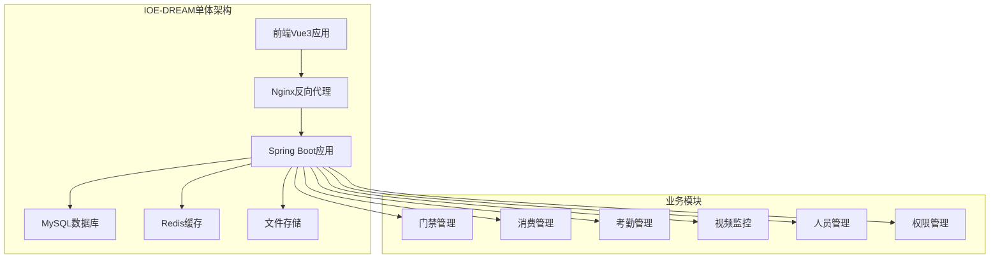
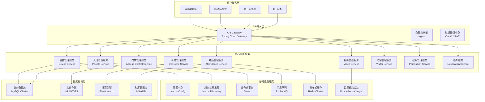
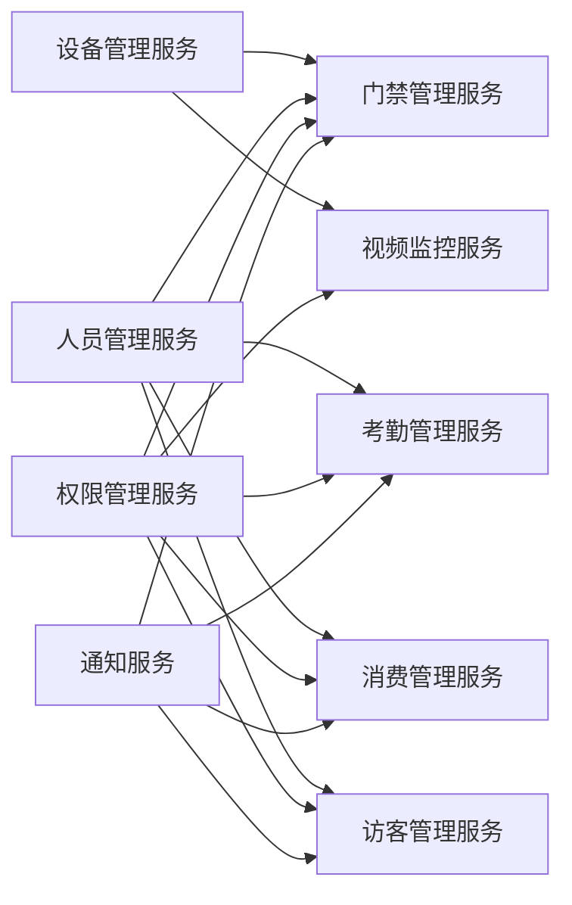

# 🚀 IOE-DREAM项目微服务化迁移指南

**文档版本**: v1.0.0
**创建日期**: 2025-11-25
**最后更新**: 2025-11-25
**维护者**: SmartAdmin Team
**状态**: [评审]
**适用范围**: IOE-DREAM智能管理系统微服务化改造

---

## 📋 概述

本文档基于IOE-DREAM项目的现有单体架构，提供完整的微服务化迁移指南。迁移遵循渐进式重构原则，确保业务连续性和系统稳定性，同时建立企业级微服务架构标准。

### 🎯 迁移目标

- **业务目标**: 提升系统可扩展性、可维护性和团队开发效率
- **技术目标**: 建立云原生微服务架构，支持容器化部署和DevOps
- **质量目标**: 确保迁移过程零业务中断，99.9%系统可用性

---

## 🏗️ 现状分析

### 当前架构特点



#### 现有技术栈
- **前端**: Vue3 + TypeScript + Ant Design Vue
- **后端**: Java 17 + Spring Boot 3.x + Sa-Token + MyBatis-Plus
- **数据库**: MySQL 8.0 + Redis
- **部署**: 单机部署 + Docker容器

#### 架构优势
- ✅ 开发效率高，部署简单
- ✅ 技术栈统一，维护成本低
- ✅ 事务管理简单，数据一致性强

#### 架构挑战
- ❌ 模块耦合度高，独立部署困难
- ❌ 技术栈固化，创新受限
- ❌ 扩展性受限，性能瓶颈明显
- ❌ 团队协作效率低，发布风险大

---

## 🎯 微服务架构设计

### 目标架构概览



### 服务拆分策略

#### 1. 按业务能力拆分

| 服务名称 | 职责边界 | 数据独立性 | 技术栈 |
|---------|---------|-----------|--------|
| **设备管理服务** | 设备注册、配置、状态管理 | 独立设备数据库 | Spring Boot + Netty |
| **人员管理服务** | 员工信息、组织架构 | 独立人员数据库 | Spring Boot + MyBatis |
| **门禁管理服务** | 门禁控制、权限验证 | 独立门禁数据库 | Spring Boot + Redis |
| **消费管理服务** | 消费记录、账户管理 | 独立消费数据库 | Spring Boot + Seata |
| **考勤管理服务** | 考勤记录、统计分析 | 独立考勤数据库 | Spring Boot + InfluxDB |
| **视频监控服务** | 视频流、录像管理 | 文件存储+元数据 | Spring Boot + FFmpeg |
| **访客管理服务** | 访客预约、出入管理、访客记录 | 独立访客数据库 | Spring Boot + Redis |
| **权限管理服务** | 用户认证、权限控制 | 独立权限数据库 | Spring Boot + Sa-Token |
| **通知服务** | 消息推送、邮件短信 | 轻量级数据库 | Spring Boot + RocketMQ |

#### 2. 服务依赖关系



---

## 📅 迁移路线图

### 阶段1：基础设施准备 (4-6周)

#### 目标
建立微服务基础设施，包括服务注册发现、配置中心、API网关等。

#### 关键任务
- [ ] **服务注册中心搭建** (Nacos集群)
- [ ] **配置中心部署** (Nacos Config)
- [ ] **API网关实施** (Spring Cloud Gateway)
- [ ] **监控体系建立** (Prometheus + Grafana)
- [ ] **日志系统搭建** (ELK Stack)
- [ ] **CI/CD流水线** (Jenkins/GitLab CI)

#### 交付物
- 微服务基础设施环境
- 监控告警系统
- 自动化部署流水线
- 基础运维手册

### 阶段2：服务拆分试点 (6-8周)

#### 目标
选择边界清晰、耦合度低的模块作为试点，验证微服务拆分方案。

#### 试点服务：设备管理服务

##### 拆分范围
- 设备基础信息管理
- 设备状态监控
- 设备配置管理
- 设备认证授权

##### 技术实现
```java
// 设备管理服务架构
@SpringBootApplication
@EnableDiscoveryClient
@EnableConfigurationProperties
public class DeviceServiceApplication {
    public static void main(String[] args) {
        SpringApplication.run(DeviceServiceApplication.class, args);
    }
}

// 设备管理控制器
@RestController
@RequestMapping("/api/devices")
@RequiredArgsConstructor
public class DeviceController {

    private final DeviceService deviceService;

    @GetMapping("/{deviceId}")
    @SaCheckPermission("device:query")
    public ResponseDTO<DeviceVO> getDevice(@PathVariable Long deviceId) {
        return deviceService.getDevice(deviceId);
    }

    @PostMapping
    @SaCheckPermission("device:add")
    public ResponseDTO<Long> createDevice(@Valid @RequestBody DeviceCreateDTO dto) {
        return deviceService.createDevice(dto);
    }
}
```

#### 数据迁移策略
- **双写模式**: 新服务写新库，同步写旧库
- **数据同步**: 基于Canal的实时数据同步
- **逐步切换**: 流量逐步切换到新服务
- **回滚方案**: 支持快速回滚到单体架构

### 阶段3：核心服务迁移 (12-16周)

#### 目标
迁移核心业务服务，包括人员管理、门禁管理、消费管理等。

#### 迁移顺序
1. **人员管理服务** - 基础数据服务，依赖少
2. **权限管理服务** - 被依赖的服务，优先迁移
3. **通知服务** - 独立性强，风险低
4. **门禁管理服务** - 核心业务，依赖人员权限
5. **消费管理服务** - 事务复杂，需要分布式事务
6. **考勤管理服务** - 数据量大，需要性能优化
7. **视频监控服务** - 资源密集，最后迁移

#### 分布式事务处理
```java
// 基于Seata的分布式事务
@Service
@Transactional
@RequiredArgsConstructor
public class ConsumeService {

    private final AccountService accountService;
    private final ConsumeRecordService consumeRecordService;

    @GlobalTransactional
    public ResponseDTO<String> processConsume(ConsumeRequestDTO dto) {
        try {
            // 1. 扣减账户余额
            accountService.deductBalance(dto.getAccountId(), dto.getAmount());

            // 2. 创建消费记录
            consumeRecordService.createRecord(dto);

            // 3. 发送通知
            notificationService.sendConsumeNotification(dto);

            return ResponseDTO.ok("消费成功");
        } catch (Exception e) {
            TransactionAspectSupport.currentTransactionStatus().setRollbackOnly();
            throw new SmartException("消费失败: " + e.getMessage());
        }
    }
}
```

### 阶段4：优化和治理 (4-6周)

#### 目标
完善微服务治理能力，优化系统性能和稳定性。

#### 关键任务
- [ ] **服务网格实施** (Istio)
- [ ] **熔断降级优化** (Hystrix/Sentinel)
- [ ] **限流策略** (Guava RateLimiter)
- [ ] **缓存优化** (Redis多级缓存)
- [ ] **数据库优化** (读写分离、分库分表)
- [ ] **安全加固** (服务间mTLS)

---

## 🔧 技术实施指南

### API网关配置

```yaml
# Spring Cloud Gateway配置
spring:
  cloud:
    gateway:
      routes:
        # 设备管理服务路由
        - id: device-service
          uri: lb://device-service
          predicates:
            - Path=/api/devices/**
          filters:
            - StripPrefix=2
            - name: RequestRateLimiter
              args:
                redis-rate-limiter.replenishRate: 10
                redis-rate-limiter.burstCapacity: 20

        # 人员管理服务路由
        - id: people-service
          uri: lb://people-service
          predicates:
            - Path=/api/people/**
          filters:
            - StripPrefix=2

      globalcors:
        corsConfigurations:
          '[/**]':
            allowedOriginPatterns: "*"
            allowedMethods:
              - GET
              - POST
              - PUT
              - DELETE
            allowedHeaders: "*"
            allowCredentials: true
```

### 服务注册发现

```yaml
# Nacos服务注册配置
spring:
  cloud:
    nacos:
      discovery:
        server-addr: ${NACOS_SERVER_ADDR:nacos1:8848,nacos2:8848,nacos3:8848}
        namespace: ${NACOS_NAMESPACE:dev}
        group: ${NACOS_GROUP:IOE-DREAM}
        cluster-name: ${CLUSTER_NAME:default}
        metadata:
          version: ${SERVICE_VERSION:1.0.0}
          zone: ${ZONE:default}
      config:
        server-addr: ${NACOS_SERVER_ADDR:nacos1:8848,nacos2:8848,nacos3:8848}
        namespace: ${NACOS_NAMESPACE:dev}
        group: ${NACOS_GROUP:IOE-DREAM}
        file-extension: yaml
        refresh-enabled: true
```

### 分布式配置管理

```yaml
# 配置中心配置示例
ioe-dream:
  device:
    service:
      # 设备连接配置
      connection:
        max-connections: 10000
        timeout: 30000
        retry-attempts: 3
      # 设备认证配置
      auth:
        token-expire: 3600
        refresh-threshold: 300
  notification:
    service:
      # 通知渠道配置
      channels:
        email:
          enabled: true
          batch-size: 100
        sms:
          enabled: true
          rate-limit: 10/minute
        push:
          enabled: true
          ttl: 86400
```

### 监控和链路追踪

```yaml
# Prometheus监控配置
management:
  endpoints:
    web:
      exposure:
        include: health,info,metrics,prometheus
  endpoint:
    health:
      show-details: always
  metrics:
    export:
      prometheus:
        enabled: true
        step: 30s

# 链路追踪配置
spring:
  sleuth:
    sampler:
      probability: 1.0
    zipkin:
      base-url: ${ZIPKIN_BASE_URL:http://zipkin:9411}
      sender:
        type: rabbit
```

---

## 🚨 风险控制和回滚策略

### 迁移风险识别

| 风险类型 | 风险描述 | 影响等级 | 应对策略 |
|---------|---------|---------|---------|
| **数据一致性** | 分布式环境下数据不一致 | 高 | 分布式事务+补偿机制 |
| **性能下降** | 服务调用增加延迟 | 中 | 服务优化+缓存策略 |
| **服务故障** | 单个服务影响整体 | 高 | 熔断降级+监控告警 |
| **运维复杂度** | 服务数量增加运维成本 | 中 | 自动化运维+监控工具 |
| **团队技能** | 微服务技术栈学习成本 | 中 | 培训+文档+最佳实践 |

### 回滚策略

#### 数据库回滚
```sql
-- 1. 停止新服务写入
-- 2. 数据同步校验
SELECT COUNT(*) FROM old_db.device t1
WHERE NOT EXISTS (SELECT 1 FROM new_db.device t2 WHERE t2.id = t1.id);

-- 3. 切换流量到旧服务
-- 4. 数据完整性检查
-- 5. 启动完整业务功能
```

#### 服务回滚
```bash
#!/bin/bash
# 快速回滚脚本
echo "开始执行微服务回滚..."

# 1. 切换API网关路由
kubectl patch virtualservice device-service --type merge -p '{
  "spec": {
    "http": [
      {
        "match": [{"uri": {"prefix": "/api/devices"}}],
        "route": [{"destination": {"host": "monolith-service", "port": {"number": 8080}}}]
      }
    ]
  }
}'

# 2. 停止新服务
kubectl scale deployment device-service --replicas=0

# 3. 验证旧服务功能
curl -X GET "http://api.ioe-dream.com/api/devices/health"

echo "回滚完成！"
```

---

## 📊 成功指标和验收标准

### 技术指标

| 指标名称 | 目标值 | 测量方法 | 验收标准 |
|---------|--------|---------|---------|
| **系统可用性** | ≥99.9% | Prometheus监控 | 月度 downtime < 43.2分钟 |
| **API响应时间** | P95 < 200ms | APM工具 | 95%请求响应时间达标 |
| **服务启动时间** | < 30秒 | 日志分析 | 所有服务启动时间达标 |
| **故障恢复时间** | < 5分钟 | 监控告警 | 故障自动恢复时间达标 |
| **数据一致性** | 100% | 数据校验 | 关键数据一致性100% |

### 业务指标

| 指标名称 | 基准值 | 目标值 | 改善幅度 |
|---------|--------|--------|---------|
| **开发效率** | 1.0 | 1.5 | 提升50% |
| **部署频率** | 1次/周 | 1次/天 | 提升7倍 |
| **变更失败率** | 15% | <5% | 降低67% |
| **故障恢复时间** | 30分钟 | 5分钟 | 降低83% |
| **资源利用率** | 40% | 70% | 提升75% |

### 验收检查清单

#### 功能验收
- [ ] 所有原有功能正常运行
- [ ] 新增微服务管理功能
- [ ] 监控告警系统正常运行
- [ ] 日志收集分析正常

#### 性能验收
- [ ] 系统响应时间达标
- [ ] 并发处理能力达标
- [ ] 资源使用率合理
- [ ] 数据库性能正常

#### 运维验收
- [ ] 自动化部署流水线正常
- [ ] 监控告警覆盖完整
- [ ] 故障自愈能力验证
- [ ] 备份恢复机制验证

#### 安全验收
- [ ] 服务间认证加密
- [ ] API访问权限控制
- [ ] 敏感数据保护
- [ ] 安全漏洞扫描通过

---

## 📚 附录

### A. 微服务技术栈对照表

| 技术领域 | 单体架构 | 微服务架构 | 迁移方案 |
|---------|---------|-----------|---------|
| **服务框架** | Spring Boot | Spring Cloud | 逐步迁移 |
| **配置管理** | 本地配置文件 | Nacos Config | 配置中心化 |
| **服务发现** | 无 | Nacos Discovery | 服务注册 |
| **API网关** | Nginx | Spring Cloud Gateway | 流量路由 |
| **负载均衡** | Nginx | Ribbon/LoadBalancer | 服务负载均衡 |
| **熔断降级** | 无 | Hystrix/Sentinel | 服务保护 |
| **分布式事务** | 本地事务 | Seata | 事务重构 |
| **消息队列** | 无 | RocketMQ | 异步解耦 |
| **链路追踪** | 日志 | Jaeger/Zipkin | 分布式追踪 |

### B. 迁移时间估算

| 阶段 | 工作量(人天) | 关键路径 | 风险等级 |
|-----|------------|---------|---------|
| **基础设施准备** | 20 | 4周 | 中 |
| **设备服务迁移** | 30 | 6周 | 高 |
| **人员权限迁移** | 25 | 5周 | 中 |
| **门禁消费迁移** | 40 | 8周 | 高 |
| **考勤视频迁移** | 35 | 7周 | 中 |
| **性能优化调优** | 20 | 4周 | 中 |
| **测试验收** | 15 | 3周 | 低 |
| **总计** | **185** | **37周** | - |

### C. 团队技能提升计划

#### 开发团队
- **微服务架构设计培训** (2周)
- **Spring Cloud实践培训** (1周)
- **Docker容器化培训** (1周)
- **K8s编排培训** (1周)

#### 运维团队
- **微服务监控培训** (1周)
- **服务网格培训** (1周)
- **故障排查培训** (1周)
- **自动化运维培训** (1周)

---

**✅ 本文档将随着微服务化进程持续更新，确保技术方案与实施实践保持同步。**