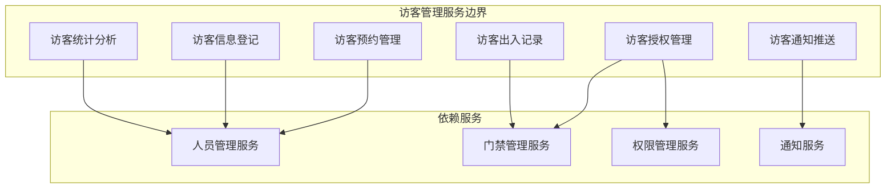
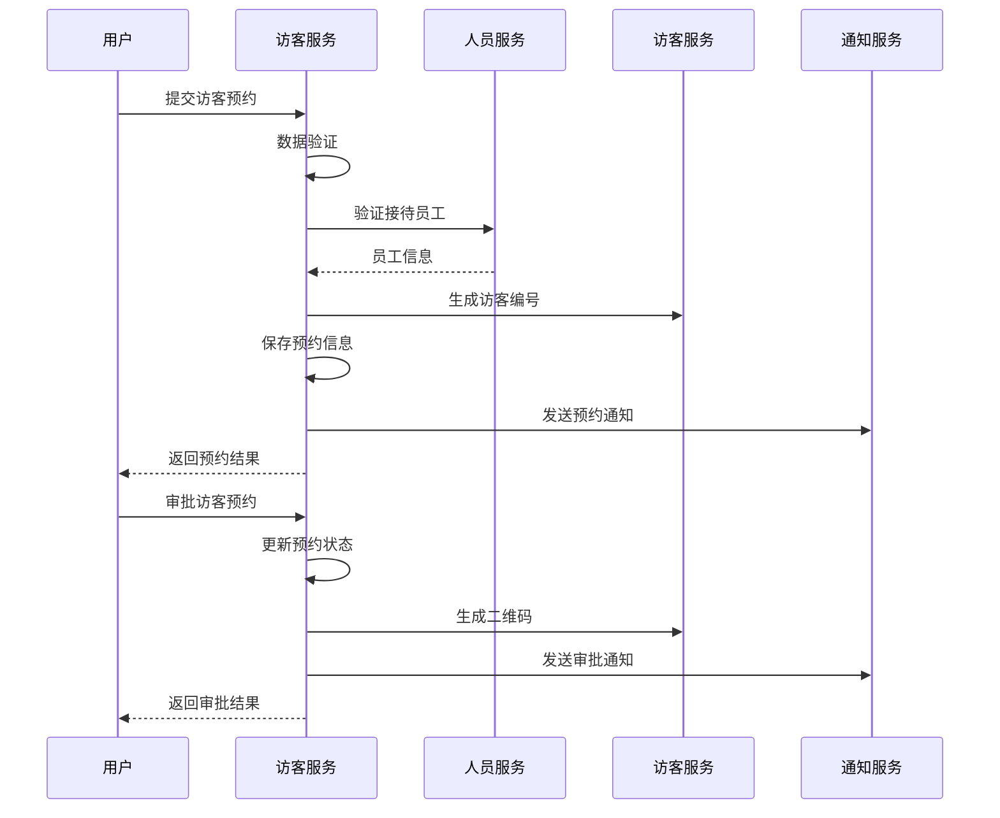
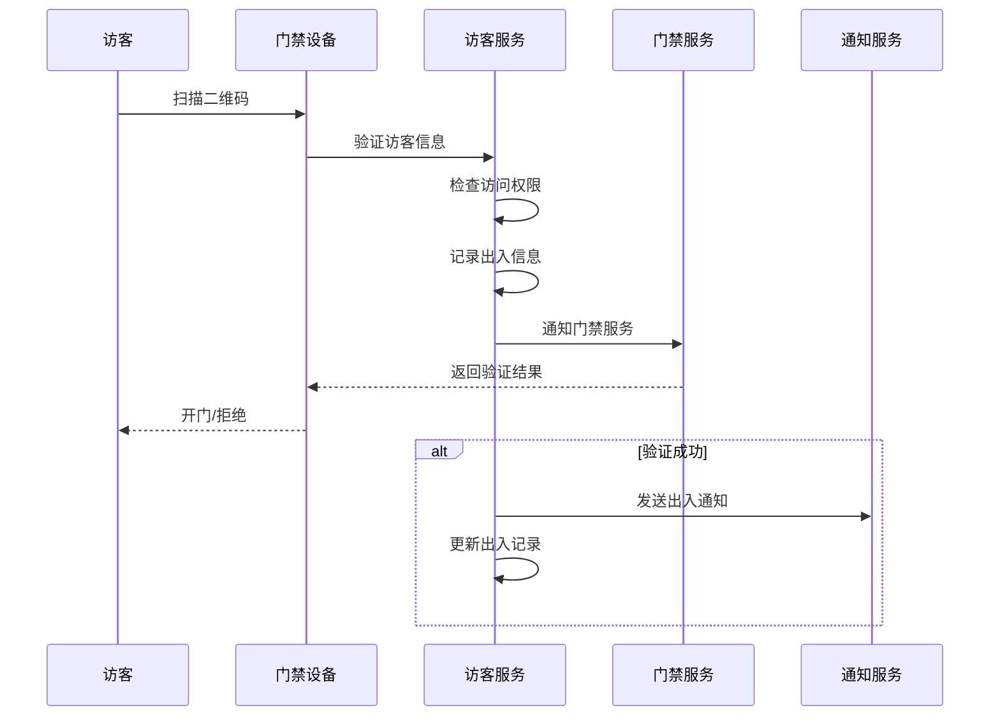

# 🏢 访客管理服务微服务设计

**文档版本**: v1.0.0
**创建日期**: 2025-11-25
**最后更新**: 2025-11-25
**维护者**: SmartAdmin Team
**状态**: [评审]
**适用范围**: IOE-DREAM访客管理服务

---

## 📋 服务概述

### 🎯 服务职责

访客管理服务是IOE-DREAM微服务架构中的核心业务服务之一，负责处理访客预约、登记、授权、出入记录等全生命周期管理。

### 🏗️ 服务边界



---

## 🏛️ 领域模型设计

### 核心聚合

#### 访客聚合 (Visitor Aggregate)

```java
// 访客聚合根
@Entity
@Table(name = "visitor")
@Data
@Builder
@NoArgsConstructor
@AllArgsConstructor
public class VisitorEntity extends BaseEntity {

    @Column(name = "visitor_code", unique = true, nullable = false)
    private String visitorCode;

    @Column(name = "visitor_name", nullable = false)
    private String visitorName;

    @Column(name = "phone_number", nullable = false)
    private String phoneNumber;

    @Column(name = "email")
    private String email;

    @Column(name = "id_card_number")
    private String idCardNumber;

    @Column(name = "company_name")
    private String companyName;

    @Column(name = "visit_purpose", nullable = false)
    private String visitPurpose;

    @Enumerated(EnumType.STRING)
    @Column(name = "visitor_status", nullable = false)
    private VisitorStatusEnum visitorStatus;

    @Column(name = "visit_date_start", nullable = false)
    private LocalDateTime visitDateStart;

    @Column(name = "visit_date_end", nullable = false)
    private LocalDateTime visitDateEnd;

    @Column(name = "host_employee_id", nullable = false)
    private Long hostEmployeeId;

    @Column(name = "host_employee_name")
    private String hostEmployeeName;

    @Column(name = "access_areas")
    private String accessAreas;

    @Column(name = "photo_url")
    private String photoUrl;

    @Column(name = "qr_code_url")
    private String qrCodeUrl;

    @Column(name = "remark")
    private String remark;
}

// 访客状态枚举
public enum VisitorStatusEnum {
    REGISTERED("已登记"),
    APPROVED("已批准"),
    REJECTED("已拒绝"),
    ACTIVE("有效"),
    EXPIRED("已过期"),
    CANCELLED("已取消");
}

// 访客出入记录
@Entity
@Table(name = "visitor_access_record")
@Data
@Builder
@NoArgsConstructor
@AllArgsConstructor
public class VisitorAccessRecordEntity extends BaseEntity {

    @Column(name = "visitor_id", nullable = false)
    private Long visitorId;

    @Column(name = "access_time", nullable = false)
    private LocalDateTime accessTime;

    @Enumerated(EnumType.STRING)
    @Column(name = "access_type", nullable = false)
    private AccessTypeEnum accessType;

    @Column(name = "device_id")
    private Long deviceId;

    @Column(name = "device_name")
    private String deviceName;

    @Column(name = "location_name")
    private String locationName;

    @Column(name = "access_photo_url")
    private String accessPhotoUrl;

    @Column(name = "access_result")
    private String accessResult;
}

// 出入类型枚举
public enum AccessTypeEnum {
    ENTER("进入"),
    EXIT("离开"),
    PASS("经过");
}
```

### 值对象

#### 访客预约信息
```java
@Data
@Builder
public class VisitorAppointmentVO {
    private Long visitorId;
    private String visitorCode;
    private String visitorName;
    private String phoneNumber;
    private String companyName;
    private String visitPurpose;
    private LocalDateTime visitDateStart;
    private LocalDateTime visitDateEnd;
    private String hostEmployeeName;
    private List<String> accessAreas;
    private VisitorStatusEnum status;
}
```

#### 访客出入记录
```java
@Data
@Builder
public class VisitorAccessRecordVO {
    private Long recordId;
    private Long visitorId;
    private String visitorName;
    private LocalDateTime accessTime;
    private AccessTypeEnum accessType;
    private String deviceName;
    private String locationName;
    private String accessPhotoUrl;
}
```

---

## 🔧 服务接口设计

### RESTful API设计

#### 访客预约管理
```java
@RestController
@RequestMapping("/api/visitors")
@RequiredArgsConstructor
@Slf4j
public class VisitorController {

    private final VisitorService visitorService;

    /**
     * 访客预约
     */
    @PostMapping("/appointment")
    @SaCheckPermission("visitor:appointment")
    public ResponseDTO<Long> createAppointment(@Valid @RequestBody VisitorAppointmentDTO dto) {
        log.info("创建访客预约: {}", dto);
        return visitorService.createAppointment(dto);
    }

    /**
     * 访客预约审批
     */
    @PostMapping("/{visitorId}/approve")
    @SaCheckPermission("visitor:approve")
    public ResponseDTO<Void> approveVisitor(@PathVariable Long visitorId,
                                           @RequestBody VisitorApprovalDTO dto) {
        log.info("审批访客预约: visitorId={}, approve={}", visitorId, dto.getApproved());
        return visitorService.approveVisitor(visitorId, dto);
    }

    /**
     * 查询访客预约列表
     */
    @GetMapping("/appointment")
    @SaCheckPermission("visitor:query")
    public ResponseDTO<PageResult<VisitorAppointmentVO>> queryAppointments(VisitorQueryDTO dto) {
        log.info("查询访客预约列表: {}", dto);
        return visitorService.queryAppointments(dto);
    }

    /**
     * 获取访客详情
     */
    @GetMapping("/{visitorId}")
    @SaCheckPermission("visitor:detail")
    public ResponseDTO<VisitorDetailVO> getVisitorDetail(@PathVariable Long visitorId) {
        log.info("获取访客详情: visitorId={}", visitorId);
        return visitorService.getVisitorDetail(visitorId);
    }

    /**
     * 生成访客二维码
     */
    @PostMapping("/{visitorId}/qrcode")
    @SaCheckPermission("visitor:qrcode")
    public ResponseDTO<String> generateQRCode(@PathVariable Long visitorId) {
        log.info("生成访客二维码: visitorId={}", visitorId);
        return visitorService.generateQRCode(visitorId);
    }

    /**
     * 访客签到/签退
     */
    @PostMapping("/{visitorId}/check-in")
    @SaCheckPermission("visitor:checkin")
    public ResponseDTO<Void> checkIn(@PathVariable Long visitorId,
                                     @RequestBody VisitorCheckInDTO dto) {
        log.info("访客签到/签退: visitorId={}, type={}", visitorId, dto.getAccessType());
        return visitorService.checkIn(visitorId, dto);
    }

    /**
     * 查询访客出入记录
     */
    @GetMapping("/{visitorId}/access-records")
    @SaCheckPermission("visitor:access-record")
    public ResponseDTO<List<VisitorAccessRecordVO>> getAccessRecords(@PathVariable Long visitorId) {
        log.info("查询访客出入记录: visitorId={}", visitorId);
        return visitorService.getAccessRecords(visitorId);
    }

    /**
     * 访客统计分析
     */
    @GetMapping("/statistics")
    @SaCheckPermission("visitor:statistics")
    public ResponseDTO<VisitorStatisticsVO> getStatistics(VisitorStatisticsDTO dto) {
        log.info("访客统计分析: {}", dto);
        return visitorService.getStatistics(dto);
    }
}
```

#### 数据传输对象
```java
// 访客预约DTO
@Data
@Builder
@NoArgsConstructor
@AllArgsConstructor
public class VisitorAppointmentDTO {

    @NotBlank(message = "访客姓名不能为空")
    private String visitorName;

    @NotBlank(message = "手机号码不能为空")
    @Pattern(regexp = "^1[3-9]\\d{9}$", message = "手机号码格式不正确")
    private String phoneNumber;

    @Email(message = "邮箱格式不正确")
    private String email;

    private String idCardNumber;

    private String companyName;

    @NotBlank(message = "来访事由不能为空")
    private String visitPurpose;

    @NotNull(message = "访问开始时间不能为空")
    @JsonFormat(pattern = "yyyy-MM-dd HH:mm:ss")
    private LocalDateTime visitDateStart;

    @NotNull(message = "访问结束时间不能为空")
    @JsonFormat(pattern = "yyyy-MM-dd HH:mm:ss")
    private LocalDateTime visitDateEnd;

    @NotNull(message = "接待员工ID不能为空")
    private Long hostEmployeeId;

    @NotEmpty(message = "访问区域不能为空")
    private List<String> accessAreas;

    private String remark;
}

// 访客审批DTO
@Data
@Builder
@NoArgsConstructor
@AllArgsConstructor
public class VisitorApprovalDTO {

    @NotNull(message = "审批结果不能为空")
    private Boolean approved;

    private String approvalReason;

    private LocalDateTime validUntil;
}

// 访客签到DTO
@Data
@Builder
@NoArgsConstructor
@AllArgsConstructor
public class VisitorCheckInDTO {

    @NotNull(message = "出入类型不能为空")
    private AccessTypeEnum accessType;

    private Long deviceId;

    private String locationName;

    private String accessPhotoUrl;
}
```

---

## 🔄 业务流程设计

### 访客预约流程



### 访客出入流程



---

## 🗄️ 数据库设计

### 访客信息表 (t_visitor)

```sql
CREATE TABLE t_visitor (
    visitor_id BIGINT AUTO_INCREMENT PRIMARY KEY COMMENT '访客ID',
    visitor_code VARCHAR(32) UNIQUE NOT NULL COMMENT '访客编号',
    visitor_name VARCHAR(100) NOT NULL COMMENT '访客姓名',
    phone_number VARCHAR(20) NOT NULL COMMENT '手机号码',
    email VARCHAR(100) COMMENT '邮箱地址',
    id_card_number VARCHAR(18) COMMENT '身份证号码',
    company_name VARCHAR(200) COMMENT '公司名称',
    visit_purpose VARCHAR(500) NOT NULL COMMENT '来访事由',
    visitor_status VARCHAR(20) NOT NULL COMMENT '访客状态',
    visit_date_start DATETIME NOT NULL COMMENT '访问开始时间',
    visit_date_end DATETIME NOT NULL COMMENT '访问结束时间',
    host_employee_id BIGINT NOT NULL COMMENT '接待员工ID',
    host_employee_name VARCHAR(100) COMMENT '接待员工姓名',
    access_areas TEXT COMMENT '访问区域(JSON格式)',
    photo_url VARCHAR(500) COMMENT '照片URL',
    qr_code_url VARCHAR(500) COMMENT '二维码URL',
    remark TEXT COMMENT '备注',
    create_time DATETIME DEFAULT CURRENT_TIMESTAMP COMMENT '创建时间',
    update_time DATETIME DEFAULT CURRENT_TIMESTAMP ON UPDATE CURRENT_TIMESTAMP COMMENT '更新时间',
    create_user_id BIGINT COMMENT '创建人ID',
    update_user_id BIGINT COMMENT '更新人ID',
    deleted_flag TINYINT DEFAULT 0 COMMENT '删除标识',
    version INT DEFAULT 1 COMMENT '版本号',

    INDEX idx_visitor_code (visitor_code),
    INDEX idx_phone_number (phone_number),
    INDEX idx_host_employee_id (host_employee_id),
    INDEX idx_visit_date (visit_date_start, visit_date_end),
    INDEX idx_visitor_status (visitor_status),
    INDEX idx_create_time (create_time)
) ENGINE=InnoDB DEFAULT CHARSET=utf8mb4 COLLATE=utf8mb4_unicode_ci COMMENT='访客信息表';
```

### 访客出入记录表 (t_visitor_access_record)

```sql
CREATE TABLE t_visitor_access_record (
    record_id BIGINT AUTO_INCREMENT PRIMARY KEY COMMENT '记录ID',
    visitor_id BIGINT NOT NULL COMMENT '访客ID',
    access_time DATETIME NOT NULL COMMENT '出入时间',
    access_type VARCHAR(20) NOT NULL COMMENT '出入类型',
    device_id BIGINT COMMENT '设备ID',
    device_name VARCHAR(100) COMMENT '设备名称',
    location_name VARCHAR(200) COMMENT '位置名称',
    access_photo_url VARCHAR(500) COMMENT '出入照片URL',
    access_result VARCHAR(500) COMMENT '出入结果',
    create_time DATETIME DEFAULT CURRENT_TIMESTAMP COMMENT '创建时间',
    update_time DATETIME DEFAULT CURRENT_TIMESTAMP ON UPDATE CURRENT_TIMESTAMP COMMENT '更新时间',

    INDEX idx_visitor_id (visitor_id),
    INDEX idx_access_time (access_time),
    INDEX idx_device_id (device_id),
    INDEX idx_access_type (access_type),

    FOREIGN KEY (visitor_id) REFERENCES t_visitor(visitor_id)
) ENGINE=InnoDB DEFAULT CHARSET=utf8mb4 COLLATE=utf8mb4_unicode_ci COMMENT='访客出入记录表';
```

---

## 🔐 安全设计

### 数据安全
- **敏感信息加密**: 身份证号等敏感信息使用AES加密存储
- **访问权限控制**: 基于RBAC的细粒度权限控制
- **数据脱敏**: 日志中敏感信息自动脱敏
- **数据备份**: 定期备份访客数据

### 接口安全
- **身份认证**: Sa-Token统一身份认证
- **权限验证**: 基于注解的权限验证
- **接口限流**: 基于用户和IP的访问限流
- **参数验证**: 完整的参数校验和数据验证

### 二维码安全
- **一次性验证**: 二维码有效期限制
- **防篡改**: 二维码包含数字签名
- **防重放**: 记录二维码使用状态
- **加密传输**: 二维码数据加密传输

---

## 📊 性能优化

### 数据库优化
- **索引策略**: 关键字段建立复合索引
- **分页查询**: 大数据量分页处理
- **读写分离**: 查询操作使用只读库
- **缓存策略**: 热点数据Redis缓存

### 应用优化
- **连接池**: 数据库连接池优化
- **异步处理**: 通知等异步操作
- **批量操作**: 批量数据处理优化
- **内存管理**: 合理的内存使用策略

### 监控指标
- **响应时间**: API响应时间监控
- **并发量**: 系统并发处理能力
- **错误率**: 系统错误率监控
- **资源使用**: CPU、内存、数据库连接监控

---

## 🚀 部署配置

### 应用配置

```yaml
# 访客服务配置
spring:
  application:
    name: visitor-service

  datasource:
    driver-class-name: com.mysql.cj.jdbc.Driver
    url: jdbc:mysql://${DB_HOST:localhost}:${DB_PORT:3306}/${DB_NAME:ioe_dream_visitor}?useUnicode=true&characterEncoding=utf8mb4&useSSL=false&serverTimezone=Asia/Shanghai
    username: ${DB_USERNAME:root}
    password: ${DB_PASSWORD:password}
    hikari:
      minimum-idle: 5
      maximum-pool-size: 20
      idle-timeout: 300000
      max-lifetime: 1200000

  redis:
    host: ${REDIS_HOST:localhost}
    port: ${REDIS_PORT:6379}
    password: ${REDIS_PASSWORD:}
    database: 2
    timeout: 2000ms
    lettuce:
      pool:
        max-active: 20
        max-idle: 10
        min-idle: 5

# 访客服务配置
ioe-dream:
  visitor:
    # 二维码配置
    qrcode:
      expire-minutes: 1440  # 24小时过期
      width: 200
      height: 200

    # 预约配置
    appointment:
      max-advance-days: 30    # 最多提前30天预约
      max-visit-hours: 8      # 最长访问8小时
      auto-cleanup-days: 7     # 过期记录自动清理7天

    # 通知配置
    notification:
      enable-sms: true
      enable-email: true
      enable-push: true

    # 安全配置
    security:
      max-attempts: 5         # 最大尝试次数
      lock-minutes: 30        # 锁定时间
      photo-max-size: 5242880 # 照片最大5MB

# 监控配置
management:
  endpoints:
    web:
      exposure:
        include: health,info,metrics,prometheus
  endpoint:
    health:
      show-details: always
  metrics:
    export:
      prometheus:
        enabled: true
```

### Docker部署

```dockerfile
FROM openjdk:17-jre-slim

LABEL maintainer="IOE-DREAM Team"
LABEL version="1.0.0"

# 创建应用目录
WORKDIR /app

# 复制jar包
COPY visitor-service-1.0.0.jar app.jar

# 创建非root用户
RUN groupadd -r appuser && useradd -r -g appuser appuser
RUN chown -R appuser:appuser /app

# 切换用户
USER appuser

# 暴露端口
EXPOSE 8080

# 健康检查
HEALTHCHECK --interval=30s --timeout=10s --start-period=60s --retries=3 \
  CMD curl -f http://localhost:8080/actuator/health || exit 1

# 启动应用
ENTRYPOINT ["java", "-jar", "-Dspring.profiles.active=prod", "app.jar"]
```

---

## 📋 测试策略

### 单元测试
- **Service层测试**: 业务逻辑测试
- **Controller层测试**: API接口测试
- **Repository层测试**: 数据访问测试
- **工具类测试**: 通用工具测试

### 集成测试
- **服务间调用测试**: Feign客户端测试
- **数据库集成测试**: 数据持久化测试
- **缓存集成测试**: Redis缓存测试
- **消息队列测试**: 异步消息测试

### 性能测试
- **接口性能测试**: API响应时间测试
- **并发测试**: 高并发场景测试
- **压力测试**: 系统极限测试
- **稳定性测试**: 长时间运行测试

### 测试覆盖率目标
- **代码覆盖率**: ≥80%
- **分支覆盖率**: ≥70%
- **接口覆盖率**: 100%
- **业务场景覆盖率**: 100%

---

**✅ 本设计文档为访客管理服务的开发实施提供了完整的技术指导，确保服务质量和架构标准。**