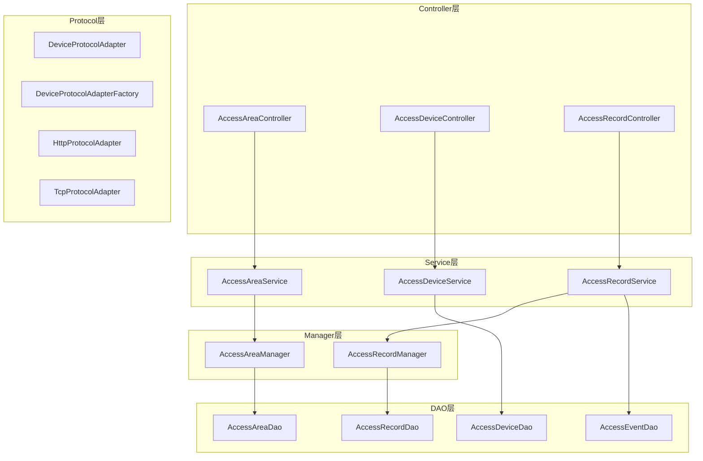
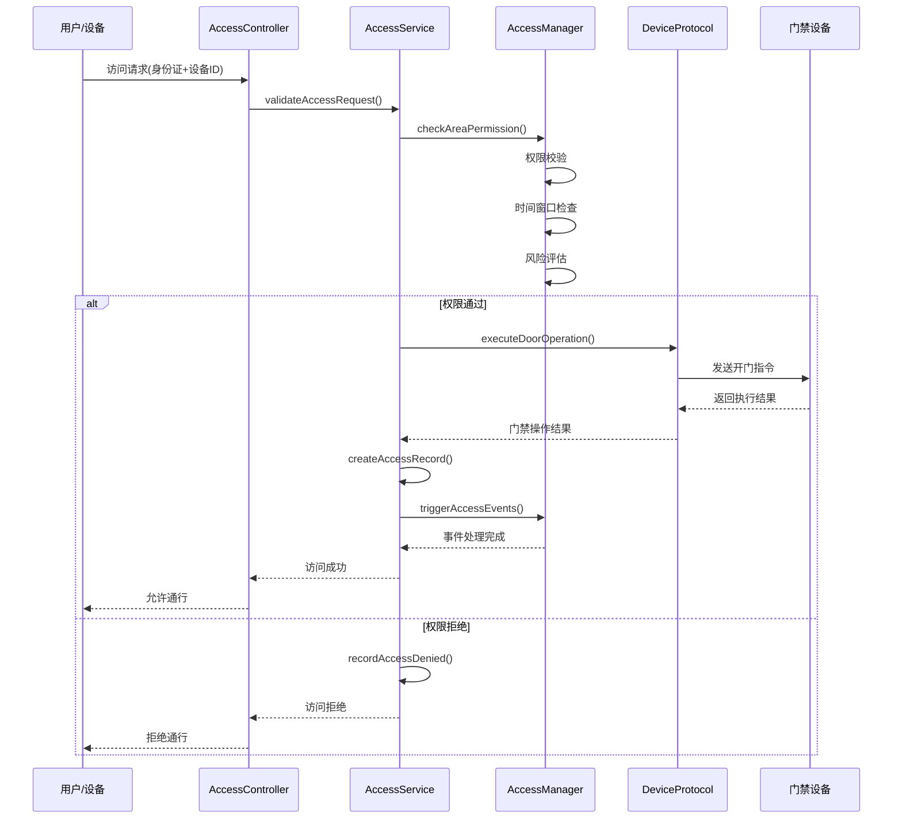
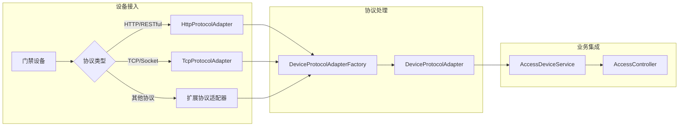
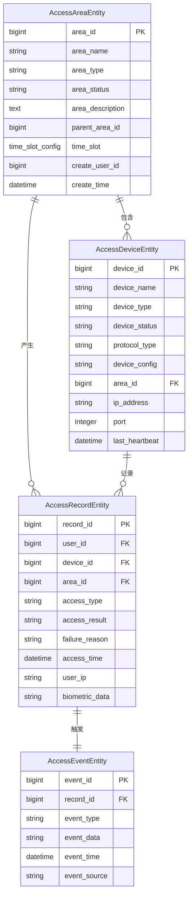
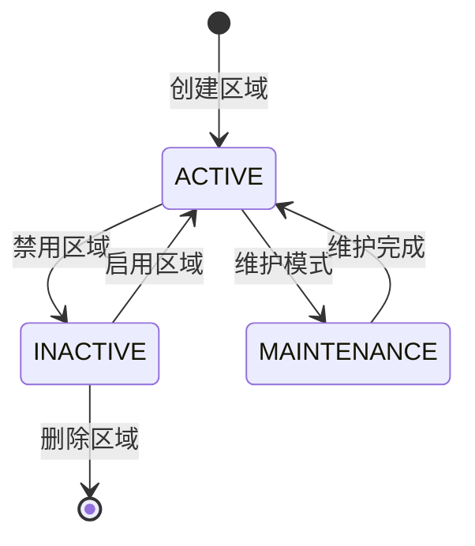
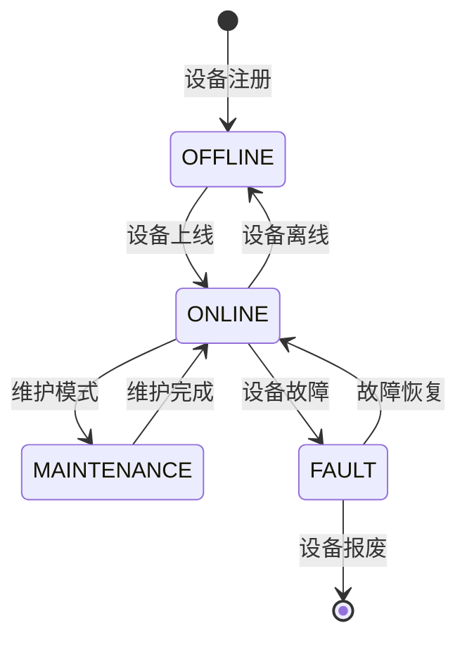
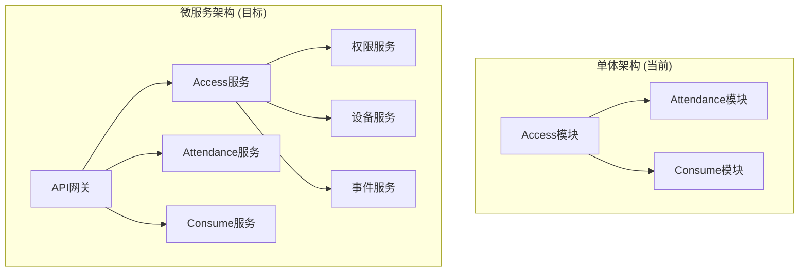

# Access 门禁管理模块业务文档

> **模块版本**: v2.0.0
> **更新日期**: 2025-11-24
> **文件数量**: 75个Java文件（原34个 + 新增biometric 40个 + 新增cache 1个）
> **架构状态**: ✅ 已完成Smart模块整合重构，支持生物识别和缓存优化

---

## 📋 模块概述

### 业务定位
Access模块是IOE-DREAM智慧园区一卡通管理平台的核心门禁控制模块，负责统一管理园区内的物理访问控制，包括区域权限管理、设备接入控制、访问记录追踪等核心功能。

### 核心价值
- **安全访问控制**: 提供多层次、多维度的门禁权限管理
- **设备统一接入**: 支持多种门禁设备协议的统一管理
- **实时监控预警**: 提供门禁事件的实时监控和安全预警
- **数据完整记录**: 完整记录所有访问事件，支持审计追溯

---

## 🏗️ 模块架构设计

### 四层架构结构

```
Access模块 (34个Java文件)
├── Controller层 (3个)        # 接口控制层
├── Service层 (3个)          # 业务逻辑层
├── Manager层 (2个)          # 业务管理层
├── DAO层 (4个)              # 数据访问层
├── Protocol层 (4个)         # 设备协议层
└── Domain层 (18个)          # 领域模型层
```

### 核心组件架构



---

## 📁 详细文件结构

### Controller层 (3个文件)
**职责**: 接收HTTP请求，参数验证，调用Service层

| 文件名 | 功能描述 | 核心API |
|--------|----------|---------|
| `AccessAreaController.java` | 门禁区域管理接口 | 区域CRUD、权限配置 |
| `AccessDeviceController.java` | 门禁设备管理接口 | 设备管理、状态监控 |
| `AccessRecordController.java` | 访问记录查询接口 | 记录查询、统计分析 |

### Service层 (3个文件)
**职责**: 业务逻辑处理，事务管理

| 文件名 | 功能描述 | 核心业务 |
|--------|----------|-----------|
| `AccessAreaService.java` | 区域权限业务逻辑 | 权限分配、时间配置 |
| `AccessDeviceService.java` | 设备管理业务逻辑 | 设备注册、协议对接 |
| `AccessRecordService.java` | 访问记录业务逻辑 | 记录处理、事件触发 |

### Manager层 (2个文件)
**职责**: 复杂业务逻辑封装，跨模块调用

| 文件名 | 功能描述 | 核心管理 |
|--------|----------|----------|
| `AccessAreaManager.java` | 区域综合管理 | 权限校验、区域联动 |
| `AccessRecordManager.java` | 记录综合管理 | 数据分析、异常检测 |

### DAO层 (4个文件)
**职责**: 数据访问，使用MyBatis Plus

| 文件名 | 功能描述 | 主要操作 |
|--------|----------|-----------|
| `AccessAreaDao.java` | 区域数据访问 | 区域CRUD、树形查询 |
| `AccessDeviceDao.java` | 设备数据访问 | 设备CRUD、状态更新 |
| `AccessEventDao.java` | 事件数据访问 | 事件记录、批量处理 |
| `AccessRecordDao.java` | 记录数据访问 | 记录查询、统计分析 |

### Protocol层 (4个文件)
**职责**: 多协议设备接入适配

| 文件名 | 功能描述 | 支持协议 |
|--------|----------|-----------|
| `DeviceProtocolAdapter.java` | 协议适配器接口 | 统一协议标准 |
| `DeviceProtocolAdapterFactory.java` | 协议适配器工厂 | 动态协议选择 |
| `HttpProtocolAdapter.java` | HTTP协议适配器 | RESTful设备 |
| `TcpProtocolAdapter.java` | TCP协议适配器 | 传统门禁设备 |

### Domain层 (18个文件)
**职责**: 领域模型定义

#### Entity实体类 (4个)
- `AccessAreaEntity.java` - 门禁区域实体
- `AccessDeviceEntity.java` - 门禁设备实体
- `AccessEventEntity.java` - 门禁事件实体
- `AccessRecordEntity.java` - 门禁记录实体

#### DTO数据传输对象 (2个)
- `AccessEventStatisticsDTO.java` - 事件统计DTO
- `TimeSlotConfig.java` - 时间段配置DTO

#### VO视图对象 (3个)
- `AccessAreaTreeVO.java` - 区域树形视图
- `AccessDeviceDetailVO.java` - 设备详情视图
- `AccessEventQueryVO.java` - 事件查询视图

#### Form表单对象 (2个)
- `AccessAreaForm.java` - 区域配置表单
- `AccessDeviceForm.java` - 设备配置表单

#### Enum枚举类 (2个)
- `AccessAreaStatusEnum.java` - 区域状态枚举
- `AccessAreaTypeEnum.java` - 区域类型枚举

#### Utility工具类 (5个)
- `TimeSlotValidator.java` - 时间段验证器
- 其他协议工具类和验证器

---

## 🔧 核心业务流程

### 门禁访问控制流程



### 设备协议适配流程



---

## 🔒 安全机制设计

### 权限校验机制

#### 1. 多层次权限模型
```java
// 权限校验四要素
public class AccessPermission {
    private Long userId;          // 用户ID
    private Long areaId;          // 区域ID
    private Long deviceId;        // 设备ID
    private TimeSlot timeSlot;    // 时间窗口
}
```

#### 2. 时间窗口控制
- **工作日时间**: 08:00-18:00
- **周末时间**: 09:00-17:00
- **特殊时间**: 节假日、加班时段
- **临时权限**: 访客、临时工权限

#### 3. 风险评估机制
- **访问频率检测**: 防止暴力破解
- **异常行为识别**: 多次失败尝试
- **地理位置验证**: 防止异地访问
- **设备指纹识别**: 防止设备冒用

### 数据安全保护

#### 1. 敏感数据加密
```java
@Entity
public class AccessRecordEntity extends BaseEntity {
    @Encrypted  // 加密存储
    private String userIdentification;

    @Encrypted  // 加密存储
    private String biometricData;
}
```

#### 2. 审计日志完整记录
- **访问日志**: 所有访问请求记录
- **操作日志**: 权限变更操作记录
- **异常日志**: 安全事件异常记录
- **系统日志**: 系统运行状态记录

---

## 📊 业务数据模型

### 核心实体关系图



### 业务状态流转

#### 区域状态流转


#### 设备状态流转


---

## 🚀 核心功能特性

### 1. 区域权限管理

#### 功能特性
- **树形区域结构**: 支持多级区域嵌套
- **灵活权限配置**: 支持用户、角色、部门权限
- **时间窗口控制**: 支持精确到分钟的时间配置
- **权限继承机制**: 子区域自动继承父区域权限

#### 核心接口
```java
@RestController
@RequestMapping("/api/access/area")
public class AccessAreaController {

    @PostMapping("/create")
    @SaCheckPermission("access:area:create")
    public ResponseDTO<Long> createArea(@Valid @RequestBody AccessAreaForm form);

    @GetMapping("/tree")
    @SaCheckPermission("access:area:query")
    public ResponseDTO<List<AccessAreaTreeVO>> getAreaTree();

    @PostMapping("/{areaId}/permission")
    @SaCheckPermission("access:area:permission")
    public ResponseDTO<Boolean> grantAreaPermission(
        @PathVariable Long areaId,
        @RequestBody PermissionGrantRequest request);
}
```

### 2. 设备统一管理

#### 功能特性
- **多协议支持**: HTTP、TCP、RS485等协议
- **设备自动发现**: 网络扫描和设备注册
- **状态实时监控**: 心跳检测和状态更新
- **远程配置管理**: 设备参数远程配置

#### 核心接口
```java
@RestController
@RequestMapping("/api/access/device")
public class AccessDeviceController {

    @PostMapping("/register")
    @SaCheckPermission("access:device:create")
    public ResponseDTO<Long> registerDevice(@Valid @RequestBody AccessDeviceForm form);

    @GetMapping("/{deviceId}/status")
    @SaCheckPermission("access:device:query")
    public ResponseDTO<DeviceStatusVO> getDeviceStatus(@PathVariable Long deviceId);

    @PostMapping("/{deviceId}/control")
    @SaCheckPermission("access:device:control")
    public ResponseDTO<Boolean> controlDevice(
        @PathVariable Long deviceId,
        @RequestBody DeviceControlRequest request);
}
```

### 3. 访问记录管理

#### 功能特性
- **实时记录**: 所有访问事件实时记录
- **多维度查询**: 按时间、用户、设备、区域查询
- **统计分析**: 访问频次、时间段分析
- **异常检测**: 自动识别异常访问模式

#### 核心接口
```java
@RestController
@RequestMapping("/api/access/record")
public class AccessRecordController {

    @GetMapping("/query")
    @SaCheckPermission("access:record:query")
    public ResponseDTO<PageResult<AccessRecordVO>> queryRecords(
        @Valid @RequestBody AccessRecordQueryForm form);

    @GetMapping("/statistics")
    @SaCheckPermission("access:record:statistics")
    public ResponseDTO<AccessEventStatisticsDTO> getStatistics(
        @RequestParam String startDate,
        @RequestParam String endDate);

    @PostMapping("/export")
    @SaCheckPermission("access:record:export")
    public void exportRecords(@Valid @RequestBody AccessRecordExportForm form,
                              HttpServletResponse response);
}
```

---

## 📈 性能优化设计

### 1. 数据库优化

#### 索引设计
```sql
-- 访问记录表索引
CREATE INDEX idx_record_user_time ON t_access_record(user_id, access_time);
CREATE INDEX idx_record_device_time ON t_access_record(device_id, access_time);
CREATE INDEX idx_record_area_time ON t_access_record(area_id, access_time);

-- 设备状态表索引
CREATE INDEX idx_device_status ON t_access_device(device_status, last_heartbeat);
```

#### 分区策略
```sql
-- 访问记录表按月分区
ALTER TABLE t_access_record
PARTITION BY RANGE (YEAR(access_time) * 100 + MONTH(access_time)) (
    PARTITION p202511 VALUES LESS THAN (202512),
    PARTITION p202512 VALUES LESS THAN (202601),
    -- 自动创建后续分区
);
```

### 2. 缓存策略

#### Redis缓存设计
```java
@Service
public class AccessCacheService {

    // 用户权限缓存 (5分钟)
    @Cacheable(value = "user:permissions", key = "#userId")
    public List<UserPermission> getUserPermissions(Long userId) {
        return accessPermissionDao.selectByUserId(userId);
    }

    // 设备状态缓存 (1分钟)
    @Cacheable(value = "device:status", key = "#deviceId")
    public DeviceStatus getDeviceStatus(Long deviceId) {
        return deviceService.getDeviceStatus(deviceId);
    }

    // 区域配置缓存 (30分钟)
    @Cacheable(value = "area:config", key = "#areaId")
    public AreaConfig getAreaConfig(Long areaId) {
        return areaConfigDao.selectByAreaId(areaId);
    }
}
```

### 3. 异步处理

#### 访问事件异步处理
```java
@Service
public class AsyncAccessEventHandler {

    @Async("accessEventExecutor")
    public void processAccessEvent(AccessEvent event) {
        // 异步处理访问事件
        // 1. 更新统计数据
        // 2. 触发安全预警
        // 3. 发送通知消息
        // 4. 更新用户画像
    }

    @Async
    @EventListener
    public void handleAccessGranted(AccessGrantedEvent event) {
        // 访问成功事件处理
        statisticsService.updateAccessStatistics(event);
        notificationService.sendAccessNotification(event);
    }
}
```

---

## 🔄 集成接口设计

### 1. 与考勤模块集成

```java
@Component
public class AccessAttendanceIntegration {

    @EventListener
    public void handleAccessEvent(AccessEvent event) {
        // 门禁转考勤事件
        if (isAttendanceAccessPoint(event.getDeviceId())) {
            AttendanceEvent attendanceEvent = AttendanceEvent.builder()
                .userId(event.getUserId())
                .accessPointId(event.getDeviceId())
                .timestamp(event.getTimestamp())
                .location(event.getAreaName())
                .build();

            eventPublisher.publishEvent(attendanceEvent);
        }
    }
}
```

### 2. 与视频监控模块集成

```java
@Component
public class AccessVideoIntegration {

    @EventListener
    public void handleAccessDenied(AccessDeniedEvent event) {
        // 访问拒绝触发视频抓拍
        VideoCaptureRequest request = VideoCaptureRequest.builder()
            .deviceId(event.getDeviceId())
            .cameraId(getRelatedCamera(event.getDeviceId()))
            .duration(30) // 抓拍30秒
            .triggerReason("ACCESS_DENIED")
            .build();

        videoService.captureVideo(request);
    }
}
```

### 3. 与消费模块集成

```java
@Component
public class AccessConsumeIntegration {

    @EventListener
    public void handleSpecialAreaAccess(AccessEvent event) {
        // 特殊区域访问触发消费权限
        if (isConsumptionArea(event.getAreaId())) {
            ConsumptionPermissionUpdateEvent permissionEvent =
                ConsumptionPermissionUpdateEvent.builder()
                .userId(event.getUserId())
                .areaId(event.getAreaId())
                .permissionType("TEMPORARY_ACCESS")
                .validUntil(LocalDateTime.now().plusHours(2))
                .build();

            eventPublisher.publishEvent(permissionEvent);
        }
    }
}
```

---

## 🛠️ 部署运维指南

### 1. 环境要求

#### 硬件要求
- **CPU**: 4核心以上，推荐8核心
- **内存**: 8GB以上，推荐16GB
- **存储**: SSD 100GB以上，推荐500GB
- **网络**: 千兆网络，支持多设备并发

#### 软件要求
- **操作系统**: Linux CentOS 7+ / Ubuntu 18.04+
- **Java**: OpenJDK 17+
- **数据库**: MySQL 8.0+ / MariaDB 10.5+
- **缓存**: Redis 6.0+
- **消息队列**: RabbitMQ 3.8+ / Apache Kafka

### 2. 配置管理

#### application.yml配置示例
```yaml
# Access模块配置
access:
  # 权限校验配置
  permission:
    cache:
      ttl: 300  # 权限缓存5分钟
      max-size: 10000
    risk:
      max-fail-attempts: 5
      lock-duration: 1800  # 30分钟

  # 设备管理配置
  device:
    heartbeat:
      interval: 30  # 心跳间隔30秒
      timeout: 90    # 心跳超时90秒
    protocol:
      http:
        timeout: 5000
        retry-times: 3
      tcp:
        timeout: 3000
        pool-size: 50

  # 记录管理配置
  record:
    batch:
      size: 1000        # 批量处理1000条
      interval: 60      # 每60秒处理一次
    retention:
      days: 365         # 保留365天
      archive: true     # 启用归档
```

### 3. 监控告警

#### 关键指标监控
```yaml
# Prometheus监控指标
access:
  metrics:
    # 访问请求指标
    access_requests_total:
      description: "总访问请求数"
      labels: ["device_id", "area_id", "result"]

    # 权限校验耗时
    permission_check_duration:
      description: "权限校验耗时"
      quantiles: [0.5, 0.95, 0.99]

    # 设备状态
    device_status:
      description: "设备状态"
      labels: ["device_id", "status"]

  alerts:
    # 设备离线告警
    device_offline:
      condition: "device_status == 'OFFLINE'"
      duration: "5m"

    # 访问拒绝率过高告警
    high_denial_rate:
      condition: "denial_rate > 0.1"
      duration: "10m"
```

---

## 🐛 故障排查指南

### 1. 常见问题及解决方案

#### 访问权限校验失败
**现象**: 用户无法正常通过门禁
**排查步骤**:
1. 检查用户权限配置是否正确
2. 检查区域时间窗口配置
3. 检查设备状态和通信连接
4. 检查权限缓存是否过期
5. 查看访问日志中的具体错误信息

**解决方案**:
```bash
# 1. 清除用户权限缓存
redis-cli DEL "user:permissions:{userId}"

# 2. 重新加载权限配置
curl -X POST "http://localhost:1024/api/access/permission/reload"

# 3. 检查设备连接状态
curl -X GET "http://localhost:1024/api/access/device/{deviceId}/status"
```

#### 设备离线无法连接
**现象**: 门禁设备显示离线状态
**排查步骤**:
1. 检查设备网络连接
2. 检查设备IP地址和端口配置
3. 检查防火墙和网络策略
4. 检查协议适配器配置
5. 查看设备心跳日志

**解决方案**:
```bash
# 1. 测试设备网络连通性
telnet {device_ip} {device_port}

# 2. 重启设备协议适配器
curl -X POST "http://localhost:1024/api/access/protocol/restart"

# 3. 重新注册设备
curl -X POST "http://localhost:1024/api/access/device/{deviceId}/reregister"
```

### 2. 性能问题排查

#### 访问响应时间过长
**排查步骤**:
1. 检查数据库索引是否生效
2. 检查缓存命中率
3. 检查网络延迟
4. 检查并发处理能力
5. 分析JVM内存和GC情况

**优化建议**:
```sql
-- 分析慢查询
SELECT * FROM mysql.slow_log
WHERE start_time > DATE_SUB(NOW(), INTERVAL 1 HOUR)
AND sql_text LIKE '%t_access_record%';

-- 检查索引使用情况
EXPLAIN SELECT * FROM t_access_record
WHERE user_id = ? AND access_time BETWEEN ? AND ?;
```

---

## 📚 API文档

### 1. 区域管理API

#### 创建区域
```http
POST /api/access/area/create
Content-Type: application/json
Authorization: Bearer {token}

{
  "areaName": "办公区A",
  "areaType": "OFFICE",
  "parentId": 1,
  "description": "办公区域A",
  "timeSlotConfig": {
    "workdays": {
      "startTime": "08:00",
      "endTime": "18:00"
    },
    "weekends": {
      "startTime": "09:00",
      "endTime": "17:00"
    }
  }
}
```

#### 获取区域树
```http
GET /api/access/area/tree
Authorization: Bearer {token}

Response:
{
  "code": 1,
  "data": [
    {
      "areaId": 1,
      "areaName": "总部大楼",
      "areaType": "BUILDING",
      "children": [
        {
          "areaId": 2,
          "areaName": "办公区A",
          "areaType": "OFFICE",
          "children": []
        }
      ]
    }
  ]
}
```

### 2. 设备管理API

#### 注册设备
```http
POST /api/access/device/register
Content-Type: application/json
Authorization: Bearer {token}

{
  "deviceName": "大门门禁机",
  "deviceType": "FACE_RECOGNITION",
  "protocolType": "HTTP",
  "areaId": 2,
  "ipAddress": "192.168.1.100",
  "port": 8080,
  "deviceConfig": {
    "recognitionThreshold": 0.85,
    "captureTimeout": 3000
  }
}
```

#### 控制设备
```http
POST /api/access/device/{deviceId}/control
Content-Type: application/json
Authorization: Bearer {token}

{
  "operation": "OPEN_DOOR",
  "duration": 5,
  "reason": "管理员远程开门"
}
```

### 3. 记录查询API

#### 查询访问记录
```http
POST /api/access/record/query
Content-Type: application/json
Authorization: Bearer {token}

{
  "userId": 12345,
  "deviceId": 1001,
  "areaId": 2,
  "accessResult": "SUCCESS",
  "startTime": "2025-11-01 00:00:00",
  "endTime": "2025-11-24 23:59:59",
  "pageNum": 1,
  "pageSize": 20
}
```

#### 获取统计数据
```http
GET /api/access/record/statistics?startDate=2025-11-01&endDate=2025-11-24
Authorization: Bearer {token}

Response:
{
  "code": 1,
  "data": {
    "totalAccessCount": 15420,
    "successCount": 15280,
    "deniedCount": 140,
    "peakHours": ["08:00-09:00", "18:00-19:00"],
    "topUsers": [
      {"userId": 12345, "userName": "张三", "accessCount": 45},
      {"userId": 12346, "userName": "李四", "accessCount": 42}
    ]
  }
}
```

---

## 🔮 未来发展规划

### 1. 功能扩展计划

#### 短期目标 (3个月)
- **移动端支持**: 开发移动端门禁控制APP
- **人脸识别升级**: 升级到3D人脸识别技术
- **智能分析**: 增加访问行为智能分析
- **多租户支持**: 支持多园区独立管理

#### 中期目标 (6-12个月)
- **AI预测**: 基于机器学习的访问模式预测
- **无感通行**: 实现完全无感的通行体验
- **物联网集成**: 扩展更多IoT设备接入
- **区块链存证**: 关键访问记录区块链存证

#### 长期目标 (1-2年)
- **元宇宙门禁**: AR/VR虚拟门禁体验
- **量子加密**: 量子加密技术保护
- **边缘计算**: 边缘节点分布式处理
- **全息识别**: 3D全息身份识别

### 2. 技术架构升级

#### 微服务化改造


#### 云原生部署
- **容器化**: Docker容器化部署
- **编排**: Kubernetes集群编排
- **服务网格**: Istio服务治理
- **监控**: Prometheus + Grafana监控

---

## 📞 技术支持

### 开发团队联系方式
- **模块负责人**: Access开发团队
- **技术支持**: access-support@ioedream.com
- **问题反馈**: 通过GitLab Issue提交

### 文档维护
- **文档版本**: v1.0.0
- **最后更新**: 2025-11-24
- **下次更新**: 根据功能迭代定期更新

---

**📋 本文档将随着Access门禁模块的功能迭代持续更新，确保与代码实现保持同步。**