# 多模态认证模块依赖关系分析报告

> **分析日期**: 2025-01-30
> **模块名称**: 多模态认证管理模块
> **服务名称**: ioedream-access-service
> **分析范围**: 9种认证策略 + Manager + Service + Controller

---

## 📊 依赖关系图

```mermaid
graph TB
    subgraph "Controller层"
        MultiModalAuthenticationController
    end

    subgraph "Service层"
        MultiModalAuthenticationService
        MultiModalAuthenticationServiceImpl
    end

    subgraph "Manager层"
        MultiModalAuthenticationManager
    end

    subgraph "Strategy层（9种认证策略）"
        AbstractAuthenticationStrategy
        FaceAuthenticationStrategy
        FingerprintAuthenticationStrategy
        PalmAuthenticationStrategy
        IrisAuthenticationStrategy
        VoiceAuthenticationStrategy
        CardAuthenticationStrategy
        QrCodeAuthenticationStrategy
        PasswordAuthenticationStrategy
        NfcAuthenticationStrategy
    end

    subgraph "Enum层"
        VerifyTypeEnum
    end

    subgraph "Config层"
        AccessManagerConfiguration
    end

    MultiModalAuthenticationController --> MultiModalAuthenticationService
    MultiModalAuthenticationServiceImpl --> MultiModalAuthenticationManager
    MultiModalAuthenticationManager --> MultiModalAuthenticationStrategy
    MultiModalAuthenticationManager --> VerifyTypeEnum
    
    FaceAuthenticationStrategy --> AbstractAuthenticationStrategy
    FingerprintAuthenticationStrategy --> AbstractAuthenticationStrategy
    PalmAuthenticationStrategy --> AbstractAuthenticationStrategy
    IrisAuthenticationStrategy --> AbstractAuthenticationStrategy
    VoiceAuthenticationStrategy --> AbstractAuthenticationStrategy
    CardAuthenticationStrategy --> AbstractAuthenticationStrategy
    QrCodeAuthenticationStrategy --> AbstractAuthenticationStrategy
    PasswordAuthenticationStrategy --> AbstractAuthenticationStrategy
    NfcAuthenticationStrategy --> AbstractAuthenticationStrategy
    
    AbstractAuthenticationStrategy --> MultiModalAuthenticationStrategy
    AbstractAuthenticationStrategy --> VerifyTypeEnum
    
    AccessManagerConfiguration --> MultiModalAuthenticationManager
    AccessManagerConfiguration --> MultiModalAuthenticationStrategy
```



---

## 🔍 详细依赖分析

### 1. Controller层依赖

**文件**: `MultiModalAuthenticationController.java`

**依赖关系**:
```
MultiModalAuthenticationController
    ↓ @Resource
MultiModalAuthenticationService (接口)
```

**依赖方向**: ✅ 正确（Controller → Service）
**循环依赖**: ✅ 无

---

### 2. Service层依赖

**文件**: `MultiModalAuthenticationServiceImpl.java`

**依赖关系**:
```
MultiModalAuthenticationServiceImpl
    ↓ @Resource
MultiModalAuthenticationManager
```

**依赖方向**: ✅ 正确（Service → Manager）
**循环依赖**: ✅ 无

---

### 3. Manager层依赖

**文件**: `MultiModalAuthenticationManager.java`

**依赖关系**:
```
MultiModalAuthenticationManager
    ↓ 构造函数注入
List<MultiModalAuthenticationStrategy> (策略列表)
    ↓
VerifyTypeEnum (枚举)
```

**依赖方向**: ✅ 正确（Manager → Strategy → Enum）
**循环依赖**: ✅ 无

**关键代码**:
```java
public MultiModalAuthenticationManager(List<MultiModalAuthenticationStrategy> strategyList) {
    this.strategyMap = strategyList.stream()
            .collect(Collectors.toMap(
                    strategy -> strategy.getVerifyType().getCode(),
                    strategy -> strategy,
                    (existing, replacement) -> existing
            ));
}
```

---

### 4. Strategy层依赖

**抽象基类**: `AbstractAuthenticationStrategy.java`

**依赖关系**:
```
AbstractAuthenticationStrategy
    ↓ implements
MultiModalAuthenticationStrategy (接口)
    ↓ uses
VerifyTypeEnum (枚举)
```

**依赖方向**: ✅ 正确（AbstractStrategy → Interface → Enum）
**循环依赖**: ✅ 无

**9种策略实现类**:
1. `FaceAuthenticationStrategy` → `AbstractAuthenticationStrategy`
2. `FingerprintAuthenticationStrategy` → `AbstractAuthenticationStrategy`
3. `PalmAuthenticationStrategy` → `AbstractAuthenticationStrategy`
4. `IrisAuthenticationStrategy` → `AbstractAuthenticationStrategy`
5. `VoiceAuthenticationStrategy` → `AbstractAuthenticationStrategy`
6. `CardAuthenticationStrategy` → `AbstractAuthenticationStrategy`
7. `QrCodeAuthenticationStrategy` → `AbstractAuthenticationStrategy`
8. `PasswordAuthenticationStrategy` → `AbstractAuthenticationStrategy`
9. `NfcAuthenticationStrategy` → `AbstractAuthenticationStrategy`

**依赖方向**: ✅ 正确（所有策略 → AbstractStrategy）
**循环依赖**: ✅ 无

---

### 5. Config层依赖

**文件**: `AccessManagerConfiguration.java`

**依赖关系**:
```
AccessManagerConfiguration
    ↓ @Resource
List<MultiModalAuthenticationStrategy> (策略列表，Spring自动注入)
    ↓ @Bean
MultiModalAuthenticationManager (注册为Bean)
```

**Bean注册顺序**:
1. ✅ 策略类自动注册（通过@Component）
2. ✅ MultiModalAuthenticationManager注册（依赖策略列表）

**依赖方向**: ✅ 正确（Config → Manager → Strategy）
**循环依赖**: ✅ 无

---

## ✅ 依赖关系验证

### 1. 依赖方向检查

| 层级 | 依赖方向 | 状态 |
|------|---------|------|
| Controller → Service | ✅ 正确 | 通过 |
| Service → Manager | ✅ 正确 | 通过 |
| Manager → Strategy | ✅ 正确 | 通过 |
| Strategy → Enum | ✅ 正确 | 通过 |
| Config → Manager | ✅ 正确 | 通过 |

### 2. 循环依赖检查

**检查结果**: ✅ **无循环依赖**

**依赖链分析**:
```
Controller → Service → Manager → Strategy → Enum
Config → Manager → Strategy
```

所有依赖都是单向的，没有形成循环。

### 3. Bean注册顺序检查

**注册顺序**:
1. ✅ 策略类（9个）通过@Component自动注册
2. ✅ MultiModalAuthenticationManager通过@Bean注册（依赖策略列表）

**验证**: ✅ 策略类先注册，Manager后注册，顺序正确

### 4. 策略注册完整性检查

**应注册的策略数量**: 9种

**已注册的策略**:
- ✅ FaceAuthenticationStrategy (人脸)
- ✅ FingerprintAuthenticationStrategy (指纹)
- ✅ PalmAuthenticationStrategy (掌纹)
- ✅ IrisAuthenticationStrategy (虹膜)
- ✅ VoiceAuthenticationStrategy (声纹)
- ✅ CardAuthenticationStrategy (IC卡)
- ✅ QrCodeAuthenticationStrategy (二维码)
- ✅ PasswordAuthenticationStrategy (密码)
- ✅ NfcAuthenticationStrategy (NFC)

**验证**: ✅ 所有9种策略都已正确注册

---

## 🔗 与现有系统的集成点

### 1. 与AccessVerificationManager的集成

**当前状态**: ⚠️ **未集成**

**集成建议**:
- `AccessVerificationManager` 可以调用 `MultiModalAuthenticationManager.authenticate()` 进行多模态认证
- 在 `BackendVerificationStrategy` 中，可以根据 `request.getVerifyType()` 调用对应的认证策略

**集成代码示例**:
```java
// 在AccessVerificationManager中
@Resource
private MultiModalAuthenticationManager multiModalAuthenticationManager;

public VerificationResult verifyWithMultiModal(AccessVerificationRequest request) {
    // 1. 多模态认证
    VerificationResult authResult = multiModalAuthenticationManager.authenticate(request);
    if (!authResult.isSuccess()) {
        return authResult;
    }
    
    // 2. 其他验证（反潜回、互锁等）
    // ...
}
```

### 2. 与EdgeVerificationStrategy的集成

**当前状态**: ⚠️ **未集成**

**集成建议**:
- `EdgeVerificationStrategy` 在接收记录时，可以根据 `request.getVerifyType()` 记录认证方式
- 可以使用 `VerifyTypeEnum.getByCode()` 获取认证方式描述

**集成代码示例**:
```java
// 在EdgeVerificationStrategy中
VerifyTypeEnum verifyTypeEnum = VerifyTypeEnum.getByCode(request.getVerifyType());
if (verifyTypeEnum != null) {
    log.info("[设备端验证] 认证方式: {}", verifyTypeEnum.getDescription());
}
```

### 3. 与AccessRecordBatchService的集成

**当前状态**: ⚠️ **未集成**

**集成建议**:
- `AccessRecordBatchService` 在批量上传时，可以使用 `VerifyTypeEnum` 进行认证方式转换
- 当前代码中的 `convertVerifyMethodToType()` 方法可以优化为使用 `VerifyTypeEnum`

---

## 🚨 发现的问题与修复

### 问题1: 现有代码未使用VerifyTypeEnum（已修复）

**位置**: 
- `EdgeVerificationStrategy.convertToEntity()` 
- `AccessRecordBatchServiceImpl.convertVerifyMethodToType()`
- `AntiPassbackServiceImpl.convertToVO()`

**问题**: 使用硬编码的switch-case，不支持新增的认证方式

**修复状态**: ✅ **已修复**

**修复内容**:
- `EdgeVerificationStrategy`: 使用 `VerifyTypeEnum.getByCode()` 统一管理
- `AccessRecordBatchServiceImpl`: 使用 `VerifyTypeEnum.getByName()` 统一转换
- `AntiPassbackServiceImpl`: 使用 `VerifyTypeEnum.getByCode()` 获取描述

---

### 问题2: 与现有系统未集成

**问题**: 多模态认证模块已创建，但未与 `AccessVerificationManager`、`BackendVerificationStrategy` 等现有模块集成

**影响**: 多模态认证功能无法在验证流程中使用

**修复建议**: 在验证流程中集成多模态认证（待完成）

**集成点**:
- `AccessVerificationManager` - 在验证流程中调用多模态认证
- `BackendVerificationStrategy` - 后台验证时使用多模态认证策略
- `EdgeVerificationStrategy` - 已集成VerifyTypeEnum（✅ 已完成）

---

### 问题3: VerifyTypeEnum代码映射验证

**验证结果**: ✅ **代码映射正确，无冲突**

**现有代码映射**:
- 0 = PASSWORD ✅
- 1 = FINGERPRINT ✅
- 2 = CARD ✅
- 11 = FACE ✅

**新增枚举代码**:
- 12 = PALM ✅
- 13 = IRIS ✅
- 14 = VOICE ✅
- 20 = QR_CODE ✅
- 21 = NFC ✅

**验证**: ✅ 代码不冲突，新增代码合理，支持向后兼容

---

## 📋 依赖关系检查清单

### 架构合规性检查

- [x] 四层架构符合（Controller → Service → Manager → Strategy）
- [x] 依赖注入使用@Resource（Controller、Service层）
- [x] Manager层使用构造函数注入（符合规范）
- [x] 策略类使用@Component注册（符合规范）
- [x] 无循环依赖
- [x] 依赖方向正确

### Bean注册检查

- [x] 所有策略类都使用@Component注册
- [x] MultiModalAuthenticationManager在Config类中注册
- [x] Bean注册顺序正确（策略先注册，Manager后注册）
- [x] 使用@ConditionalOnMissingBean避免重复注册

### 功能完整性检查

- [x] 9种认证策略都已实现
- [x] 策略映射正确（按verifyType代码索引）
- [x] 策略选择逻辑正确
- [x] 枚举类定义完整

### 集成检查

- [ ] 与AccessVerificationManager集成（待完成）
- [x] 与EdgeVerificationStrategy集成（✅ 已完成 - 使用VerifyTypeEnum）
- [x] 与AccessRecordBatchService集成（✅ 已完成 - 使用VerifyTypeEnum）
- [x] 与AntiPassbackService集成（✅ 已完成 - 使用VerifyTypeEnum）

---

## 🔧 修复建议

### 1. 修复MultiModalAuthenticationManager语法错误

**优先级**: 🔴 P0

**修复代码**:
```java
public VerificationResult authenticate(AccessVerificationRequest request) {
    if (request == null || request.getVerifyType() == null) {  // 添加大括号
        log.warn("[多模态认证] 认证请求或认证方式为空");
        return VerificationResult.failed("INVALID_REQUEST", "认证请求或认证方式为空");
    }
    // ...
}
```

### 2. 集成到验证流程

**优先级**: 🔴 P0

**集成点**:
- `AccessVerificationManager` - 在验证流程中调用多模态认证
- `EdgeVerificationStrategy` - 记录认证方式时使用VerifyTypeEnum
- `AccessRecordBatchService` - 批量上传时使用VerifyTypeEnum转换

### 3. 更新现有代码使用VerifyTypeEnum

**优先级**: 🟡 P2

**更新点**:
- `EdgeVerificationStrategy.convertToEntity()` - 使用VerifyTypeEnum转换
- `AccessRecordBatchServiceImpl.convertVerifyMethodToType()` - 使用VerifyTypeEnum转换
- `AntiPassbackServiceImpl` - 使用VerifyTypeEnum获取描述

---

## 📊 依赖关系总结

### ✅ 正确的依赖关系

1. **Controller → Service → Manager → Strategy → Enum**
   - 依赖方向清晰，无循环
   - 符合四层架构规范

2. **Config → Manager → Strategy**
   - Bean注册顺序正确
   - 策略自动注入，Manager手动注册

3. **Strategy继承关系**
   - 所有策略继承AbstractAuthenticationStrategy
   - 抽象基类实现通用逻辑

### ⚠️ 需要修复的问题

1. ✅ **代码统一**: 已统一使用VerifyTypeEnum替换硬编码转换逻辑
2. ⚠️ **未集成**: 多模态认证模块未与AccessVerificationManager集成（待完成）
3. ✅ **代码优化**: 已优化EdgeVerificationStrategy、AccessRecordBatchService、AntiPassbackService使用VerifyTypeEnum

---

## 🎯 下一步行动

1. ✅ **代码统一**: 已统一使用VerifyTypeEnum替换硬编码转换逻辑
2. ⚠️ **集成验证流程**: 在AccessVerificationManager中集成多模态认证（待完成）
3. ✅ **编译验证**: 编译通过，无语法错误
4. ⚠️ **测试验证**: 需要验证所有9种认证策略正常工作（待完成）

---

## 📊 依赖关系总结（最终版）

### ✅ 已完成的优化

1. **统一使用VerifyTypeEnum**
   - ✅ EdgeVerificationStrategy: 使用枚举统一管理认证方式
   - ✅ AccessRecordBatchService: 使用枚举统一转换认证方式
   - ✅ AntiPassbackService: 使用枚举统一获取认证方式描述

2. **依赖关系清晰**
   - ✅ Controller → Service → Manager → Strategy → Enum
   - ✅ 无循环依赖
   - ✅ Bean注册顺序正确

3. **策略注册完整**
   - ✅ 9种认证策略全部注册
   - ✅ 策略映射正确（按verifyType代码索引）

### ⚠️ 待完成的工作

1. **集成AccessVerificationManager**
   - 在验证流程中调用MultiModalAuthenticationManager.authenticate()
   - 支持后台验证模式下的多模态认证

2. **测试验证**
   - 单元测试：验证所有9种认证策略
   - 集成测试：验证与现有验证流程的集成
   - 性能测试：验证策略选择的性能
