# API集成与数据交互

<cite>
**本文档引用文件**  
- [axios.js](file://smart-admin-web-javascript\src\lib\axios.js)
- [smart-request.js](file://smart-app\src\lib\smart-request.js)
- [login-api.js](file://smart-admin-web-javascript\src\api\system\login-api.js)
- [file-api.js](file://smart-admin-web-javascript\src\api\support\file-api.js)
- [consumption-api.js](file://smart-admin-web-javascript\src\api\business\consumption\consumption-api.js)
- [common-const.js](file://smart-admin-web-javascript\src\constants\common-const.js)
- [local-storage-key-const.js](file://smart-admin-web-javascript\src\constants\local-storage-key-const.js)
- [index.js](file://smart-admin-web-javascript\src\constants\index.js)
- [SystemErrorCode.java](file://smart-admin-api-java17-springboot3\sa-base\src\main\java\net\lab1024\sa\base\common\code\SystemErrorCode.java)
- [UserErrorCode.java](file://smart-admin-api-java17-springboot3\sa-base\src\main\java\net\lab1024\sa\base\common\code\UserErrorCode.java)
- [ErrorCode.java](file://smart-admin-api-java17-springboot3\sa-base\src\main\java\net\lab1024\sa\base\common\code\ErrorCode.java)
- [ErrorCodeRegister.java](file://smart-admin-api-java17-springboot3\sa-base\src\main\java\net\lab1024\sa\base\common\code\ErrorCodeRegister.java)
- [EncryptResponseAdvice.java](file://smart-admin-api-java17-springboot3\sa-base\src\main\java\net\lab1024\sa\base\module\support\apiencrypt\advice\EncryptResponseAdvice.java)
- [AdminHelpDocController.java](file://smart-admin-api-java17-springboot3\sa-admin\src\main\java\net\lab1024\sa\admin\module\system\support\AdminHelpDocController.java)
- [SupportBaseController.java](file://smart-admin-api-java17-springboot3\sa-base\src\main\java\net\lab1024\sa\base\common\controller\SupportBaseController.java)
- [UrlConfig.java](file://smart-admin-api-java17-springboot3\sa-base\src\main\java\net\lab1024\sa\base\config\UrlConfig.java)
</cite>

## 目录

1. [项目结构](#项目结构)
2. [API模块组织结构](#api模块组织结构)
3. [请求参数封装与响应处理](#请求参数封装与响应处理)
4. [错误码统一处理策略](#错误码统一处理策略)
5. [常量管理机制](#常量管理机制)
6. [API调用最佳实践](#api调用最佳实践)
7. [接口调试技巧与常见问题解决方案](#接口调试技巧与常见问题解决方案)

## 项目结构

本项目包含多个子系统，主要分为后端API服务和前端Web应用：

- **smart-admin-api-java17-springboot3**: 后端Java API服务，基于Spring Boot 3和Java 17构建
- **smart-admin-web-javascript**: 前端Web应用，使用Vue3框架开发
- **smart-app**: 移动端应用，基于UniApp框架开发

前端应用的API相关代码主要位于`smart-admin-web-javascript/src/api`目录下，按照系统、业务、支持三个领域进行分类组织。

**本节来源**
- [project_structure](file://)

## API模块组织结构

### API分类体系

API模块按照功能领域分为三大类：系统、业务和支持。这种分类方式有助于开发者快速定位相关接口。

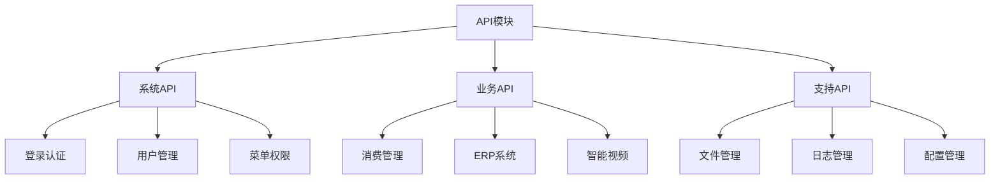

**图示来源**
- [src/api](file://smart-admin-web-javascript\src\api)

### 后端API控制器结构

后端API控制器遵循统一的基类继承模式，确保API路径和行为的一致性。

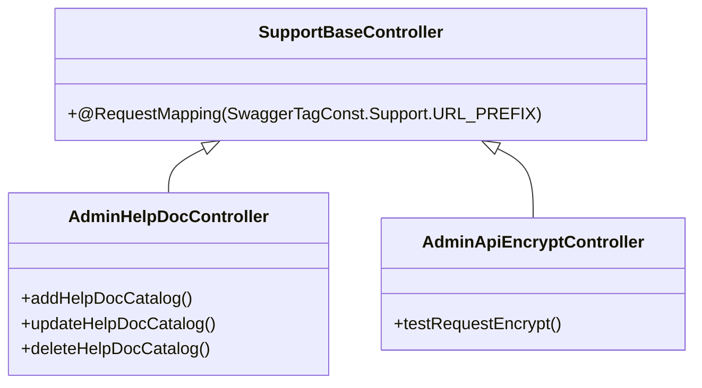

**图示来源**
- [SupportBaseController.java](file://smart-admin-api-java17-springboot3\sa-base\src\main\java\net\lab1024\sa\base\common\controller\SupportBaseController.java)
- [AdminHelpDocController.java](file://smart-admin-api-java17-springboot3\sa-admin\src\main\java\net\lab1024\sa\admin\module\system\support\AdminHelpDocController.java)

### API路径配置

系统通过`UrlConfig`类自动扫描所有API路径，并生成访问列表。无需登录的API通过`@NoNeedLogin`注解标识。

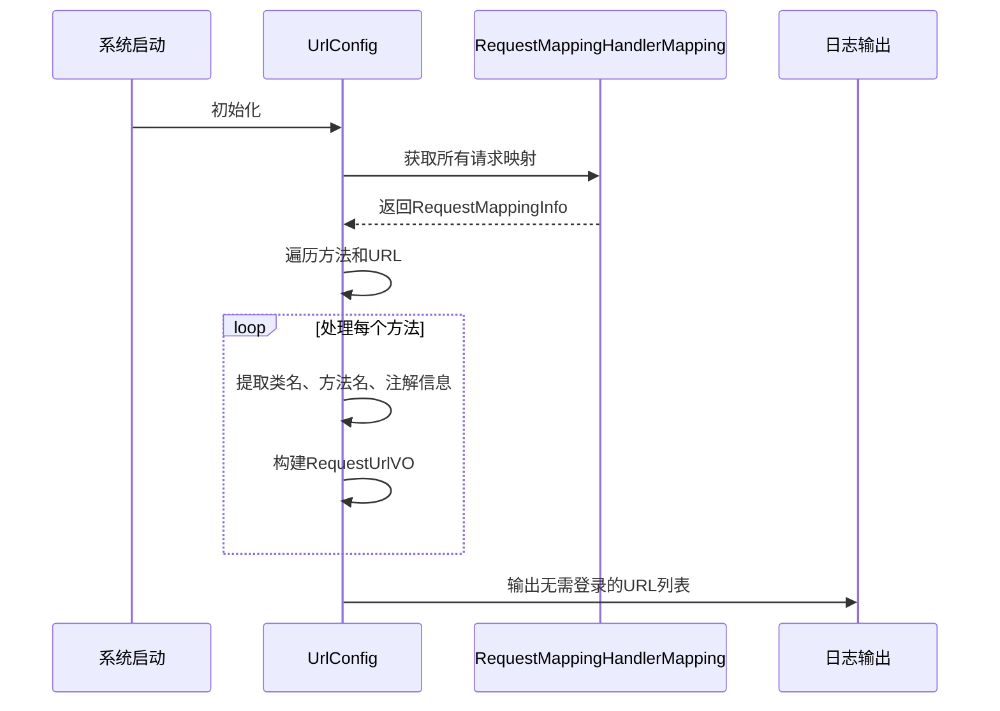

**图示来源**
- [UrlConfig.java](file://smart-admin-api-java17-springboot3\sa-base\src\main\java\net\lab1024\sa\base\config\UrlConfig.java)

## 请求参数封装与响应处理

### 前端请求封装

前端通过axios库封装HTTP请求，提供统一的get、post等方法，并集成认证信息自动注入。

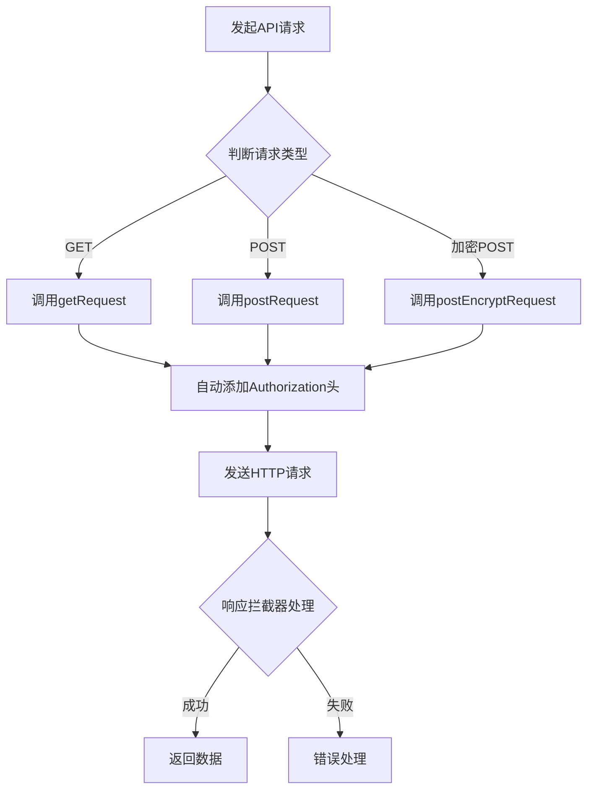

**图示来源**
- [axios.js](file://smart-admin-web-javascript\src\lib\axios.js)

### 移动端请求封装

移动端应用使用uni.request进行网络请求，封装方式与Web端类似但适配小程序环境。

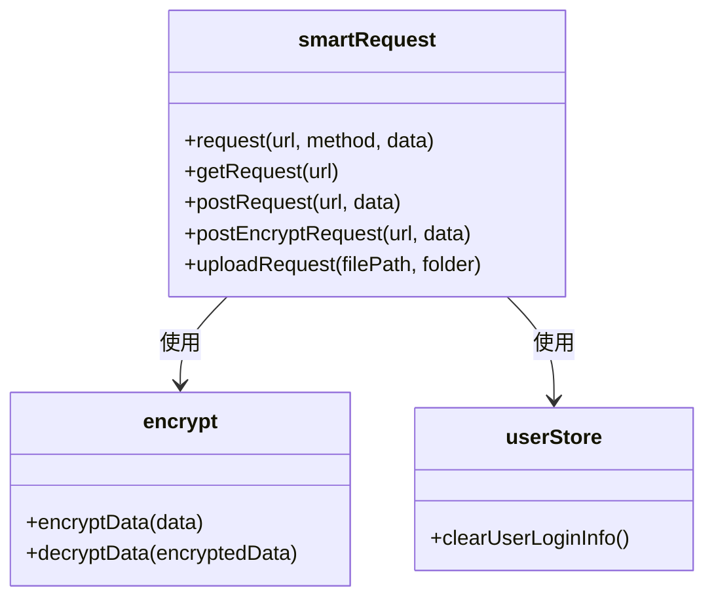

**图示来源**
- [smart-request.js](file://smart-app\src\lib\smart-request.js)

### 响应数据处理

系统支持普通响应和加密响应两种模式，通过dataType字段区分。

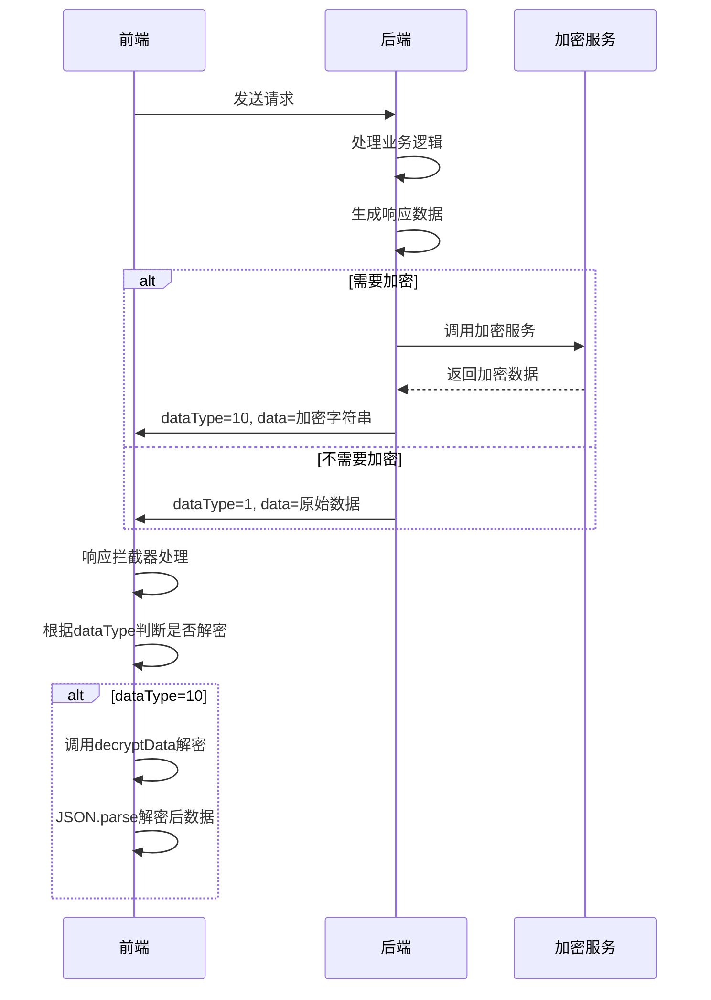

**图示来源**
- [EncryptResponseAdvice.java](file://smart-admin-api-java17-springboot3\sa-base\src\main\java\net\lab1024\sa\base\module\support\apiencrypt\advice\EncryptResponseAdvice.java)
- [axios.js](file://smart-admin-web-javascript\src\lib\axios.js)

## 错误码统一处理策略

### 错误码分类体系

系统采用三级错误码分类体系，便于错误定位和处理。

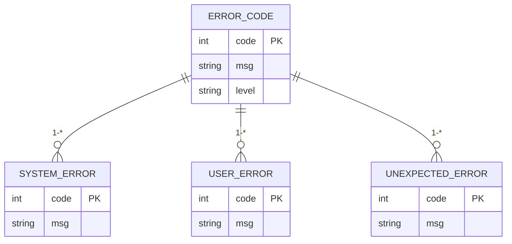

**图示来源**
- [ErrorCode.java](file://smart-admin-api-java17-springboot3\sa-base\src\main\java\net\lab1024\sa\base\common\code\ErrorCode.java)

### 错误码注册机制

错误码通过静态注册方式管理，确保范围不重叠且易于维护。

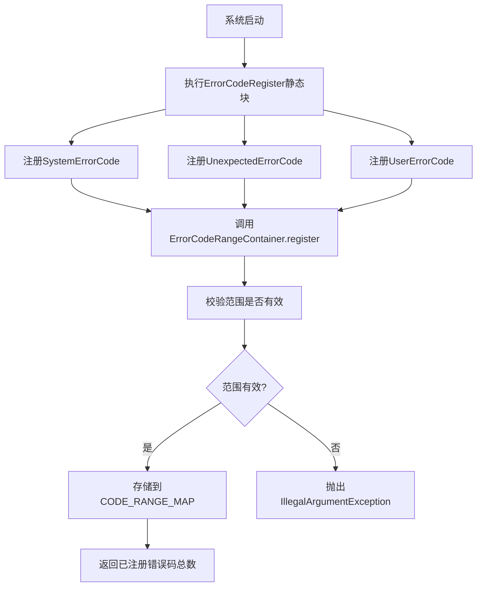

**图示来源**
- [ErrorCodeRegister.java](file://smart-admin-api-java17-springboot3\sa-base\src\main\java\net\lab1024\sa\base\common\code\ErrorCodeRegister.java)
- [ErrorCodeRangeContainer.java](file://smart-admin-api-java17-springboot3\sa-base\src\main\java\net\lab1024\sa\base\common\code\ErrorCodeRangeContainer.java)

### 常见错误码说明

系统定义了多种常见错误码，涵盖认证、权限、业务等多个方面。

| 错误码 | 错误消息 | 错误等级 | 说明 |
|--------|---------|---------|------|
| 10001 | 系统似乎出现了点小问题 | system | 系统级错误 |
| 30001 | 参数错误 | user | 请求参数验证失败 |
| 30007 | 您还未登录或登录失效，请重新登录！ | user | 认证状态无效 |
| 30008 | 用户状态异常 | user | 用户账户状态异常 |
| 30012 | 长时间未操作系统，需要重新登录 | user | 会话超时 |

**表来源**
- [SystemErrorCode.java](file://smart-admin-api-java17-springboot3\sa-base\src\main\java\net\lab1024\sa\base\common\code\SystemErrorCode.java)
- [UserErrorCode.java](file://smart-admin-api-java17-springboot3\sa-base\src\main\java\net\lab1024\sa\base\common\code\UserErrorCode.java)

### 前端错误处理

前端通过响应拦截器统一处理各类错误，提供友好的用户提示。

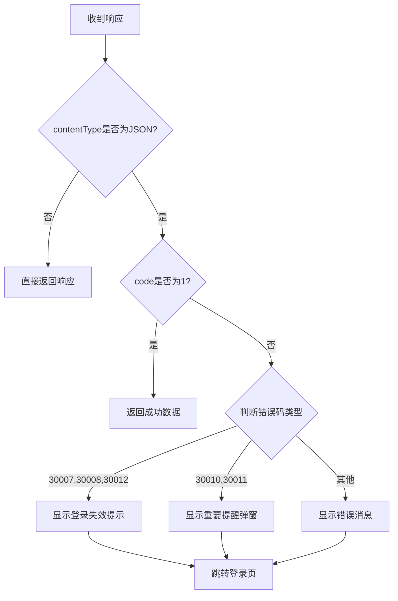

**图示来源**
- [axios.js](file://smart-admin-web-javascript\src\lib\axios.js)

## 常量管理机制

### 常量目录结构

常量按照功能领域组织在`constants`目录下，便于维护和引用。

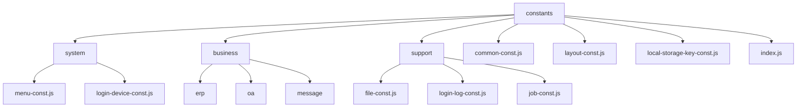

**图示来源**
- [project_structure](file://)

### 常量组织方式

常量采用模块化组织方式，通过index.js统一导出，方便全局引用。

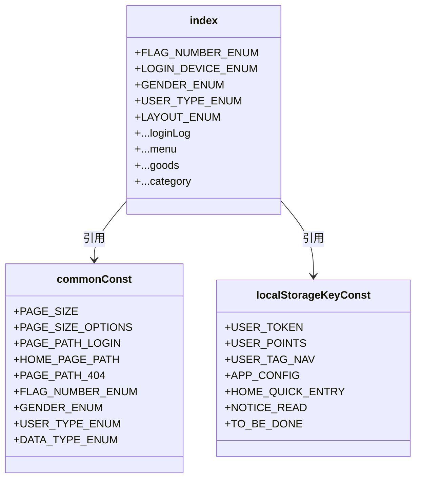

**图示来源**
- [index.js](file://smart-admin-web-javascript\src\constants\index.js)
- [common-const.js](file://smart-admin-web-javascript\src\constants\common-const.js)
- [local-storage-key-const.js](file://smart-admin-web-javascript\src\constants\local-storage-key-const.js)

### 常量使用示例

```javascript
// 引用全局常量
import CONST from '/@/constants';

// 使用分页大小
const pageSize = CONST.PAGE_SIZE;

// 使用用户类型枚举
if (user.type === CONST.USER_TYPE_ENUM.ADMIN_EMPLOYEE.value) {
    // 处理员工用户
}

// 使用本地存储key
const token = localStorage.getItem(CONST.USER_TOKEN);
```

**本节来源**
- [index.js](file://smart-admin-web-javascript\src\constants\index.js)

## API调用最佳实践

### 认证信息传递

系统采用Bearer Token方式进行认证，前端自动在请求头中添加认证信息。

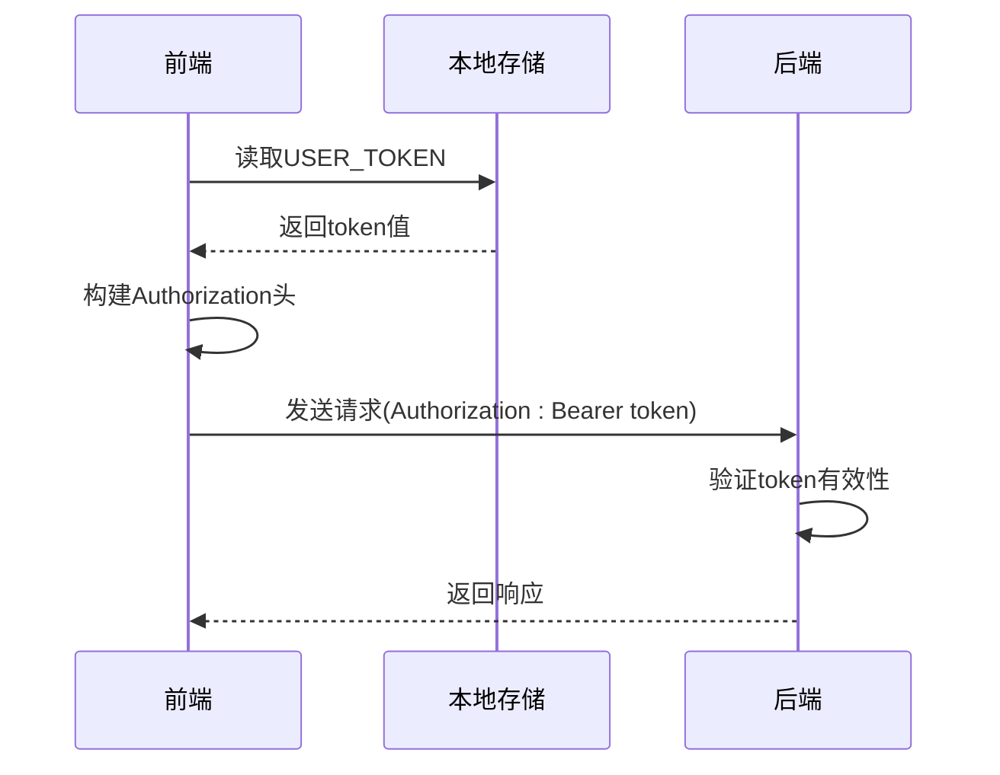

**图示来源**
- [axios.js](file://smart-admin-web-javascript\src\lib\axios.js)

### 请求重试机制

虽然当前代码未直接实现重试机制，但可通过封装实现智能重试策略。

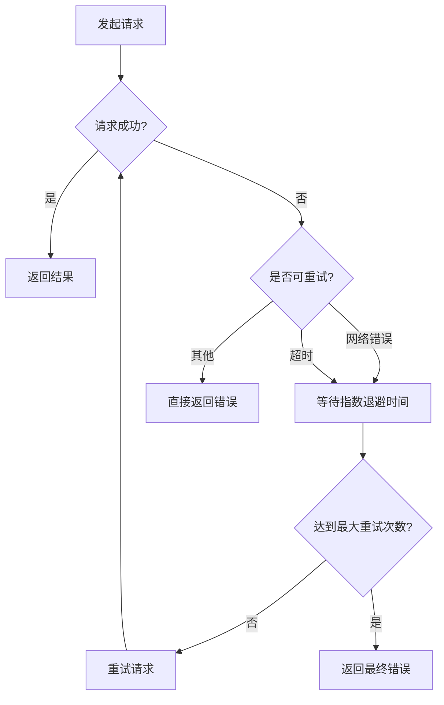

**本节来源**
- [axios.js](file://smart-admin-web-javascript\src\lib\axios.js)

### 数据缓存策略

系统通过本地存储实现数据缓存，减少重复请求。

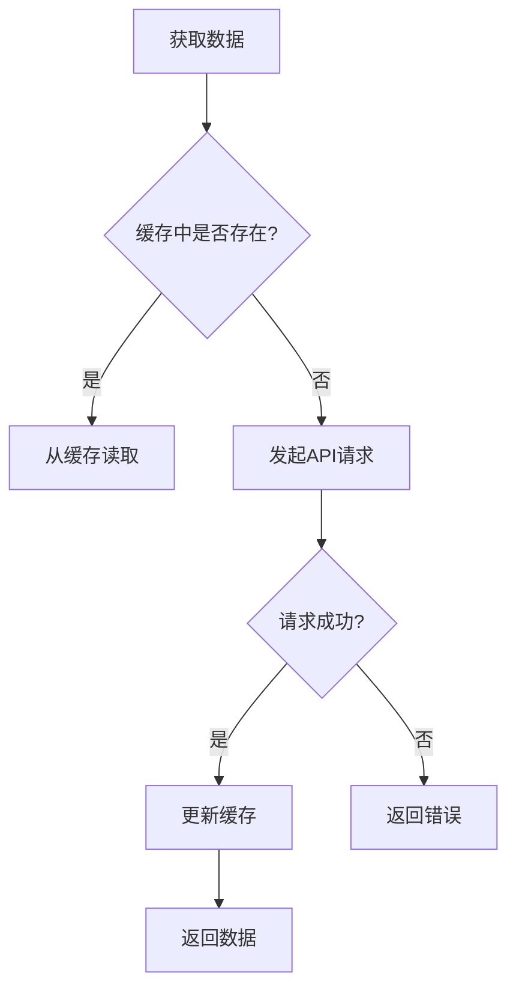

**本节来源**
- [local-storage-key-const.js](file://smart-admin-web-javascript\src\constants\local-storage-key-const.js)

## 接口调试技巧与常见问题解决方案

### 接口调试技巧

1. **使用浏览器开发者工具**：监控Network面板中的请求和响应
2. **查看请求头信息**：确认Authorization头是否正确添加
3. **检查响应格式**：注意dataType字段判断是否需要解密
4. **利用Swagger文档**：参考后端提供的API文档进行调试

### 常见问题及解决方案

| 问题现象 | 可能原因 | 解决方案 |
|---------|---------|---------|
| 请求返回401 | 认证信息缺失或过期 | 检查本地存储中的token，重新登录 |
| 数据显示加密字符串 | 未正确处理加密响应 | 确保响应拦截器正确解密数据 |
| 文件下载失败 | responseType设置错误 | 使用getDownload或postDownload方法 |
| 跨域问题 | 请求头不匹配 | 确认Content-Type等请求头设置正确 |

**本节来源**
- [axios.js](file://smart-admin-web-javascript\src\lib\axios.js)
- [smart-request.js](file://smart-app\src\lib\smart-request.js)