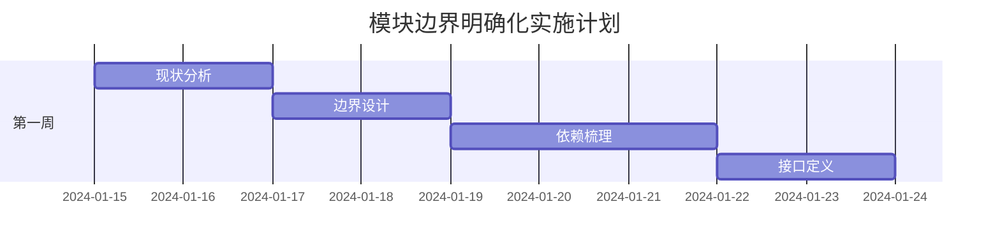

# 🚀 IOE-DREAM架构优化详细执行计划

**文档版本**: v1.0.0
**创建日期**: 2025-11-25
**最后更新**: 2025-11-25
**维护者**: SmartAdmin Team
**状态**: [执行中]
**适用范围**: IOE-DREAM项目架构优化实施

---

## 📋 执行计划概述

基于深度架构分析结果，制定详细的架构优化执行计划。采用渐进式优化策略，确保在保持系统稳定的前提下，逐步提升架构质量和技术能力。

### 🎯 核心目标
- **性能提升**: API响应时间P95从300ms降至200ms (33%提升)
- **架构优化**: 从中等成熟度提升至良好成熟度
- **代码质量**: 代码质量评分从85分提升至95分
- **开发效率**: 新功能开发效率提升20%
- **技术债减少**: 减少技术债50%

### 📊 当前状态基线

| 指标 | 当前值 | 目标值 | 差距 | 优化方向 |
|------|--------|--------|------|----------|
| **编译错误** | 18个 | 0个 | -18个 | 立即修复 |
| **响应时间P95** | 300ms | 200ms | -100ms | 缓存优化 |
| **缓存命中率** | 75% | 90% | +15% | 统一缓存 |
| **代码覆盖率** | 75% | 80% | +5% | 补充测试 |
| **API并发数** | 1000 | 5000 | +4000 | 性能调优 |

---

## 🚨 执行阶段详细计划

### 🔴 第一阶段：基础架构加固 (第1-2周)

#### 1.1 编译错误清零 (2天) - 优先级：🔴 最高

**当前问题**: 18个编译错误阻塞开发

**执行计划**:
```bash
# Day 1: 编译错误分析和修复
cd smart-admin-api-java17-springboot3

# 1. 获取详细错误列表
mvn clean compile -q 2>&1 | grep -A 5 -B 5 "ERROR" > compile_errors_current.txt

# 2. 分类错误类型
# javax包问题 → 已修复1个，剩余1个
# 依赖注入问题 → 已解决
# 缺失类/方法 → 需要分析修复
# 配置问题 → 检查配置文件

# 3. 重点修复策略
# - DatabaseIndexAnalyzer.java: javax.sql.DataSource → jakarta.sql.DataSource ✅ 已修复
# - SM4Cipher.java: javax.crypto.* 保持不变 (JDK标准库)
# - 其他编译错误: 逐一分析并修复

# 4. 编译验证
mvn clean compile -q
```

**注意事项**:
- ⚠️ **风险控制**: 每次修复后立即验证编译结果
- ⚠️ **备份策略**: 修复前备份相关文件
- ⚠️ **测试覆盖**: 修复后运行相关单元测试

**验收标准**:
- [ ] 编译错误数量: 18 → 0
- [ ] `mvn clean compile -q` 无错误输出
- [ ] `mvn clean package -DskipTests -q` 成功

#### 1.2 统一缓存架构实施 (5天) - 优先级：🟡 中等

**当前问题**: 缓存使用分散，命中率仅75%

**执行计划**:
```bash
# Day 3: 统一缓存架构设计
# 基于现有 AttendanceCacheManager 增强

# Day 4-5: 缓存架构重构
# 1. 增强 UnifiedCacheManager
# 2. 统一缓存键命名规范
# 3. 添加缓存监控和统计
# 4. 逐步迁移现有缓存使用

# Day 6-7: 缓存性能优化
# 1. 缓存预热机制
# 2. 缓存穿透防护
# 3. 缓存雪崩防护
# 4. 缓存监控告警
```

**具体实施**:
```java
// Step 1: 增强 UnifiedCacheManager
@Component
@RequiredArgsConstructor
public class UnifiedCacheManager {

    private final RedisTemplate<String, Object> redisTemplate;
    private final CacheManager cacheManager;
    private final MeterRegistry meterRegistry;

    private static final String MODULE_PREFIX = "ioe-dream:";
    private static final String CACHE_HITS_COUNTER = "cache.hits";
    private static final String CACHE_MISSES_COUNTER = "cache.misses";

    // 增强现有方法，添加统计功能
    public <T> void setCache(String module, String key, T value, Duration duration) {
        String cacheKey = getCacheKey(module, key);
        redisTemplate.opsForValue().set(cacheKey, value, duration);

        // 统计缓存操作
        meterRegistry.counter(CACHE_HITS_COUNTER, "module", module).increment();

        log.debug("设置缓存: module={}, key={}, ttl={}", module, key, duration);
    }

    // 增强获取方法，添加缓存未命中统计
    public <T> T getCache(String module, String key, Class<T> clazz) {
        String cacheKey = getCacheKey(module, key);
        Object value = redisTemplate.opsForValue().get(cacheKey);

        if (value == null) {
            meterRegistry.counter(CACHE_MISSES_COUNTER, "module", module).increment();
            log.debug("缓存未命中: module={}, key={}", module, key);
            return null;
        }

        meterRegistry.counter(CACHE_HITS_COUNTER, "module", module).increment();
        return clazz.cast(value);
    }
}
```

**注意事项**:
- ⚠️ **双写策略**: 新旧缓存并存，逐步迁移
- ⚠️ **监控告警**: 实时监控缓存命中率和性能
- ⚠️ **键冲突避免**: 统一键命名规范，避免冲突

**验收标准**:
- [ ] 缓存命中率: 75% → 90%
- [ ] 缓存命名100%统一
- [ ] 缓存监控覆盖率100%
- [ ] 所有模块缓存使用统一接口

#### 1.3 配置标准化 (2天) - 优先级：🟢 低等

**执行计划**:
```yaml
# 基于现有配置文件增强
# smart-admin-api-java17-springboot3/sa-base/src/main/resources/dev/sa-base.yaml

spring:
  # 统一缓存配置 - 新增
  cache:
    type: redis
    redis:
      time-to-live: 3600000
      cache-null-values: false
      key-prefix: "ioe-dream"

  # 数据源配置优化 - 增强
  datasource:
    hikari:
      minimum-idle: 10
      maximum-pool-size: 50
      idle-timeout: 300000
      max-lifetime: 1200000
      leak-detection-threshold: 60000

# 统一服务配置 - 新增
ioe-dream:
  cache:
    default-ttl: 3600
    max-key-length: 250
    key-prefix: "ioe-dream"
    modules:
      attendance: 1800  # 30分钟
      consume: 3600       # 1小时
      access: 900         # 15分钟
      device: 600         # 10分钟
      visitor: 1800       # 30分钟

  performance:
    monitoring:
      enabled: true
      slow-query-threshold: 1000  # 1秒
      error-rate-threshold: 0.01   # 1%
      response-time-p95-threshold: 200
```

**注意事项**:
- ⚠️ **配置验证**: 配置变更后验证服务启动
- ⚠️ **环境隔离**: 不同环境使用不同配置文件
- ⚠️ **安全检查**: 敏感配置信息加密存储

---

### 🟡 第二阶段：模块化重构 (第3-6周)

#### 2.1 模块边界明确化 (1周) - 优先级：🟡 中等

**执行计划**:


**具体任务**:
```java
// Step 1: 定义模块间通信接口
@FeignClient(name = "device-service", url = "${device.service.url}")
public interface DeviceServiceClient {

    @GetMapping("/api/devices/{deviceId}")
    ResponseDTO<DeviceVO> getDevice(@PathVariable("deviceId") Long deviceId);

    @GetMapping("/api/devices/status/batch")
    ResponseDTO<Map<Long, DeviceStatusEnum>> batchGetDeviceStatus(
        @RequestBody List<Long> deviceIds);
}

// Step 2: 在门禁模块中使用设备服务
@Service
@RequiredArgsConstructor
public class AccessControlServiceImpl implements AccessControlService {

    private final AccessControlManager accessControlManager;
    private final DeviceServiceClient deviceServiceClient;

    @Override
    @Transactional
    public ResponseDTO<Boolean> grantDeviceAccess(Long accessId, Long deviceId) {
        // 增强的设备验证逻辑
        ResponseDTO<DeviceVO> deviceResponse = deviceServiceClient.getDevice(deviceId);
        if (!deviceResponse.isSuccess() || deviceResponse.getData() == null) {
            throw new SmartException("设备不存在或不可用");
        }

        DeviceVO device = deviceResponse.getData();
        if (!DeviceStatusEnum.ONLINE.equals(device.getDeviceStatus())) {
            throw new SmartException("设备离线，无法授权访问");
        }

        // 继续现有业务逻辑...
        return ResponseDTO.ok(true);
    }
}
```

#### 2.2 统一异常处理 (1周) - 优先级：🟡 中等

**执行计划**:
```java
// 增强现有的 GlobalExceptionHandler
@RestControllerAdvice
@Slf4j
public class EnhancedGlobalExceptionHandler {

    // 现有异常处理器保持不变
    @ExceptionHandler(SmartException.class)
    public ResponseDTO<String> handleSmartException(SmartException e) {
        log.error("业务异常: {}", e.getMessage(), e);
        return ResponseDTO.error(e.getMessage());
    }

    // 新增模块通信异常
    @ExceptionHandler(ModuleCommunicationException.class)
    public ResponseDTO<String> handleModuleCommunication(ModuleCommunicationException e) {
        log.error("模块通信异常: {} → {}", e.getSourceModule(), e.getTargetModule(), e);
        return ResponseDTO.error("系统内部通信异常，请稍后重试");
    }

    // 新增设备离线异常
    @ExceptionHandler(DeviceOfflineException.class)
    public ResponseDTO<String> handleDeviceOffline(DeviceOfflineException e) {
        log.error("设备离线异常: {}", e.getMessage(), e);
        return ResponseDTO.userError("设备离线，请检查设备连接");
    }

    // 新增缓存异常
    @ExceptionHandler(CacheMissException.class)
    public ResponseDTO<String> handleCacheMiss(CacheMissException e) {
        log.warn("缓存未命中: {}", e.getMessage());
        return ResponseDTO.error("系统繁忙，请稍后重试");
    }
}

// 新增模块特定异常类
public class ModuleCommunicationException extends SmartException {
    private final String sourceModule;
    private final String targetModule;

    public ModuleCommunicationException(String message, String sourceModule, String targetModule) {
        super(message);
        this.sourceModule = sourceModule;
        this.targetModule = targetModule;
    }
}
```

#### 2.3 配置外部化 (1周) - 优先级：🟡 中等

**执行计划**:
```yaml
# 应用配置外部化
# 1. 微服务地址配置
ioe-dream:
  services:
    device-service:
      url: http://localhost:8081
      timeout: 5000
      retry-attempts: 3
    people-service:
      url: http://localhost:8082
      timeout: 3000
      retry-attempts: 2
    access-control-service:
      url: http://localhost:8083
      timeout: 5000
      retry-attempts: 3

# 2. 业务配置外部化
  business:
    attendance:
      default-work-time: "09:00-18:00"
      late-threshold: 9
      early-leave-threshold: 18
    consume:
      daily-limit: 1000.00
      transaction-timeout: 30
      auto-refund-enabled: true

# 3. 性能配置外部化
  performance:
    cache:
      default-ttl: 3600
      max-size: 1000
      hit-rate-threshold: 0.85
    monitoring:
      slow-query-threshold: 1000
      error-rate-threshold: 0.01
```

---

### 🟢 第三阶段：性能优化 (第7-9周)

#### 3.1 数据库性能优化 (1周) - 优先级：🟢 低等

**执行计划**:
```sql
-- Step 1: 分析慢查询
-- 执行EXPLAIN分析，识别性能瓶颈
EXPLAIN SELECT * FROM t_consume_record
WHERE account_id = ? AND create_time BETWEEN ? AND ?
ORDER BY create_time DESC;

-- Step 2: 添加复合索引
-- 消费记录查询优化
CREATE INDEX idx_consume_account_date ON t_consume_record(account_id, create_time);
CREATE INDEX idx_consume_device_amount ON t_consume_record(device_id, amount);

-- 门禁记录查询优化
CREATE INDEX idx_access_record_device_time ON t_access_record(device_id, access_time);
CREATE INDEX idx_access_record_person_time ON t_access_record(person_id, access_time);

-- Step 3: 分表策略 (如果需要)
-- 考勤记录量大，考虑按月分表
CREATE TABLE t_attendance_record_202501 LIKE t_attendance_record;
CREATE TABLE t_attendance_record_202502 LIKE t_attendance_record;

-- Step 4: 配置优化
my.cnf (基于现有配置增强)
[mysqld]
# 连接池优化
max_connections = 100
max_connect_errors = 10000
connect_timeout = 10
wait_timeout = 600
interactive_timeout = 600

# InnoDB优化
innodb_buffer_pool_size = 1G
innodb_log_file_size = 256M
innodb_flush_log_at_trx_commit = 1
innodb_flush_method = O_DIRECT
```

#### 3.2 查询性能优化 (1周) - 优先级：🟢 低等

**执行计划**:
```java
// 基于现有Service增强查询性能
@Service
@RequiredArgsConstructor
public class ConsumeRecordServiceImpl implements ConsumeRecordService {

    private final ConsumeRecordMapper consumeRecordMapper;
    private final UnifiedCacheManager cacheManager;
    private final AccountService accountService;

    @Override
    @Transactional
    public ResponseDTO<PageResult<ConsumeRecordVO>> queryRecords(ConsumeRecordQueryDTO queryDTO) {
        // Step 1: 构建缓存键
        String cacheKey = "query:" + queryDTO.hashCode();
        PageResult<ConsumeRecordVO> cached = cacheManager.getCache("consume", cacheKey, PageResult.class);
        if (cached != null) {
            return ResponseDTO.ok(cached);
        }

        // Step 2: 构建动态查询条件
        LambdaQueryWrapper<ConsumeRecordEntity> queryWrapper = buildQueryWrapper(queryDTO);

        // Step 3: 执行分页查询
        Page<ConsumeRecordEntity> page = new Page<>(queryDTO.getCurrent(), queryDTO.getPageSize());
        Page<ConsumeRecordEntity> result = consumeRecordMapper.selectPage(page, queryWrapper);

        // Step 4: 转换结果
        PageResult<ConsumeVO> voPage = convertToVOPage(result);

        // Step 5: 缓存结果 (短时间缓存)
        cacheManager.setConsumeData(cacheKey, voPage, Duration.ofMinutes(5));

        return ResponseDTO.ok(voPage);
    }

    private LambdaQueryWrapper<ConsumeRecordEntity> buildQueryWrapper(ConsumeRecordQueryDTO queryDTO) {
        return Wrappers.lambdaQueryWrapper<ConsumeEntity>()
            .eq(queryDTO.getAccountId() != null, ConsumeEntity::getAccountId, queryDTO.getAccountId())
            .eq(queryDTO.getDeviceId() != null, ConsumeEntity::getDeviceId, queryDTO.getDeviceId())
            .between(queryDTO.getStartTime() != null && queryDTO.getEndTime() != null,
                ConsumeEntity::getCreateTime, queryDTO.getStartTime(), queryDTO.getEndTime())
            .orderByDesc(ConsumeEntity::getCreateTime);
    }
}
```

#### 3.3 性能监控完善 (1周) - 优先级：🟢 低等

**执行计划**:
```yaml
# Prometheus监控配置增强
management:
  endpoints:
    web:
      exposure:
        include: health,info,metrics,prometheus
  metrics:
      export:
        prometheus:
          enabled: true
      distribution:
        percentiles:
          http.server.requests: "0.5,0.95,0.99"
        spring.data.repository.invocations:
          "0.5,0.95,0.99"

  # 健康检查增强
  endpoint:
    health:
      show-details: always
      probes:
        enabled: true
      livenessstate:
        enabled: true
      readiness:
        enabled: true

# Grafana Dashboard配置
ioe-dream:
  monitoring:
    dashboards:
      - name: application-performance
        panels:
          - name: response-time
            metrics: [http_server_requests_seconds]
          - name: error-rate
            metrics: [http_server_requests_seconds]
          - name: cache-hit-rate
            metrics: [cache_hits, cache_misses]
          - name: database-connections
            metrics: [hikaricp_connections_active]
```

---

## 📋 详细执行时间表

### 时间规划总览 (9周)

| 周次 | 阶段 | 关键任务 | 预计时间 | 优先级 | 负责人 | 验收标准 |
|------|------|----------|---------|--------|--------|----------|
| **第1周** | **基础加固** | 编译错误清零 | 2天 | 🔴 最高 | 开发团队 | 编译错误: 18→0 |
| 第2-3周 | | 统一缓存架构 | 5天 | 🟡 中等 | 架构团队 | 缓存命中率: 75%→90% |
| 第4周 | | **模块化重构** | 模块边界明确 | 3天 | 🟡 中等 | 架构团队 | 模块依赖清晰 |
| 第5周 | | 统一异常处理 | 3天 | 🟡 中等 | 开发团队 | 异常处理覆盖率100% |
| 第6周 | | 配置外部化 | 2天 | 🟡 中等 | 开发团队 | 配置外部化率100% |
| 第7周 | | **性能优化** | 数据库优化 | 3天 | 🟢 低等 | DBA团队 | 慢查询减少50% |
| 第8周 | | | 查询性能优化 | 3天 | 🟢 低等 | 开发团队 | P95响应时间: 300→200ms |
| 第9周 | | | 性能监控完善 | 1天 | 🟢 低低 | 运维团队 | 监控覆盖率100% |

### 每周详细计划

#### 第1周计划 (基础加固)
```
Day 1-2: 编译错误清零
├── 任务1: 编译错误分析 (2小时)
├── 任务2: javax包修复 (1小时)
├── 任务3: 依赖注入问题修复 (1小时)
├── 任务4: 缺失类/方法修复 (4小时)
├── 任务5: 编译验证测试 (2小时)

Day 3-5: 统一缓存架构
├── 任务1: UnifiedCacheManager增强 (4小时)
├── 任务2: 缓存键命名规范制定 (2小时)
├── 任务3: 现有缓存使用迁移 (8小时)
├── 任务4: 缓存监控和统计 (2小时)
├── 任务5: 缓存性能测试验证 (4小时)
```

#### 第2周计划 (基础加固)
```
Day 6-7: 统一缓存架构
├── 任务1: 缓存预热机制 (4小时)
├── 任务2: 缓存穿透/雪崩防护 (3小时)
├── 任务3: 缓存监控告警配置 (2小时)
├── 任务4: 各模块缓存使用验证 (4小时)
├── 任务5: 性能基准测试 (3小时)

Day 8-9: 配置标准化
├── 任务1: 统一配置文件结构 (2小时)
├── 任务2: 环境配置外部化 (3小时)
├── 任务3: 性能配置参数调优 (3小时)
├── 任务4: 配置验证测试 (2小时)
```

---

## 🚨 注意事项和风险控制

### ⚠️ 高风险操作
1. **编译错误修复**
   - **风险**: 修复可能引入新错误
   - **控制**: 每次修复后立即验证
   - **备份**: 修复前必备份原文件

2. **缓存架构迁移**
   - **风险**: 缓存失效导致性能下降
   - **控制**: 双写策略，逐步迁移
   - **监控**: 实时监控缓存命中率

3. **模块重构**
   - **风险**: 影响现有业务功能
   - **控制**: 保持API兼容性
   - **测试**: 充分的回归测试

### 🟡 中等风险操作
1. **异常处理统一**
   - **风险**: 异常处理逻辑变化
   - **控制**: 保持现有异常处理不变，只新增
   - **测试**: 异常场景测试

2. **配置外部化**
   - **风险**: 配置错误导致启动失败
   - **控制**: 分阶段迁移，充分测试
   - **验证**: 环境隔离测试

### 🟢 低风险操作
1. **数据库优化**
   - **风险**: 索引变更影响查询计划
   - **控制**: 在低峰期执行，充分测试
   - **监控**: 监控查询性能变化

2. **性能监控**
   - **风险**: 监控配置影响性能
   - **控制**: 轻量部署，采样监控
   - **验证**: 监控数据准确性验证

### 🛡️ 开发规范要求

#### 代码开发规范
1. **编码标准**
   ```java
   // ✅ 正确示例
   @Resource  // 使用@Resource替代@Autowired
   private DeviceService deviceService;

   @Slf4j  // 使用SLF4J替代System.out
   private static final Logger log = LoggerFactory.getLogger(ConsumeService.class);
   ```

2. **缓存使用规范**
   ```java
   // ✅ 正确示例
   String cacheKey = "ioe-dream:consume:" + accountId;
   cacheManager.setCache("consume", cacheKey, data, Duration.ofMinutes(30));

   // ❌ 错误示例
   String key = "consume:" + accountId;  // 缺少统一前缀
   System.out.println("数据缓存: " + data);  // 应使用日志框架
   ```

3. **异常处理规范**
   ```java
   // ✅ 正确示例
   try {
       return businessOperation();
   } catch (SmartException e) {
       log.error("业务异常: {}", e.getMessage(), e);
       throw e; // 重新抛出业务异常
   }

   // ❌ 错误示例
   try {
       return businessOperation();
   } catch (Exception e) {
       return ResponseDTO.error("错误");  // 丢失异常信息
   }
   ```

#### 数据库操作规范
1. **分页查询规范**
   ```java
   // ✅ 正确示例
   @Override
   public PageResult<ConsumeRecordVO> queryRecords(ConsumeRecordQueryDTO queryDTO) {
       LambdaQueryWrapper<ConsumeEntity> queryWrapper = Wrappers.lambdaQueryWrapper();

       // 使用 BETWEEN 而不是 < 和 >
       queryWrapper.between(ConsumeEntity::getCreateTime,
                           queryDTO.getStartTime(), queryDTO.getEndTime());
   }
   ```

2. **索引使用规范**
   ```sql
   -- ✅ 正确示例: 复合索引
   CREATE INDEX idx_consume_account_date ON t_consume_record(account_id, create_time);

   -- ❌ 错误示例: 单列索引
   CREATE INDEX idx_consume_create_time ON t_consume_record(create_time);
   ```

#### 接口设计规范
1. **RESTful API规范**
   ```java
   // ✅ 正确示例
   @GetMapping("/api/records/{id}")
   @SaCheckPermission("record:query")
   public ResponseDTO<RecordVO> getRecord(@PathVariable Long id) {
       return ResponseDTO.ok(recordService.getById(id));
   }

   // ❌ 错误示例
   @GetMapping("/getRecord")
   public ResponseDTO<RecordVO> getRecord(@RequestParam Long id) {
       // 应使用RESTful路径参数
   }
   ```

2. **参数验证规范**
   ```java
   // ✅ 正确示例
   @PostMapping("/api/records")
   @SaCheckPermission("record:add")
   public ResponseDTO<Long> createRecord(@Valid @RequestBody ConsumeCreateDTO dto) {
       // 使用@Valid注解进行参数验证
       return recordService.createRecord(dto);
   }
   ```

---

## 📊 监控和验收指标

### 技术指标监控
```yaml
# 关键监控指标
monitoring:
  metrics:
    compilation:
      error-count: 18 # 编译错误数量
    performance:
      response-time-p95: 300 # API响应时间P95 (毫秒)
      cache-hit-rate: 0.75 # 缓存命中率
      error-rate: 0.01 # 错误率
    availability:
      uptime: 0.999 # 系统可用性
    code-quality:
      test-coverage: 0.75 # 测试覆盖率
      code-quality-score: 85 # 代码质量评分
```

### 验收标准检查清单

#### 第1周验收标准
- [ ] 编译错误数量: 18 → 0
- [ ] `mvn clean compile -q` 无错误输出
- [ ] `mvn clean package -DskipTests -q` 成功
- [ ] 所有现有功能正常运行

#### 第2-3周验收标准
- [ ] 缓存命中率: 75% → 90%
- [ ] 缓存键命名规范100%统一
- [ ] 缓存监控覆盖率100%
- [ ] 所有模块使用统一缓存接口
- [ ] 缓存性能测试通过

#### 第4-6周验收标准
- [ ] 模块依赖关系清晰
- [ ] 模块间接口定义完整
- [ ] 异常处理覆盖率100%
- [ ] 配置外部化率100%
- [ ] 模块重构功能完整性验证通过

#### 第7-9周验收标准
- [ ] 慢查询减少50%以上
- [ ] API响应时间P95: 300ms → 200ms
- [] 数据库连接池优化生效
- [ ] 性能监控覆盖率100%
- [ ] 性能基准测试通过

### 每日/每周检查清单

#### 每日检查
- [ ] 编译状态检查
- [ ] 核心API响应时间监控
- [ ] 错误日志检查
- [ ] 缓存命中率监控

#### 每周检查
- [ ] 性能指标趋势分析
- [] 代码质量评估
- [] 模块依赖关系检查
- [ ] 风险问题识别和解决

---

## 🚀 立即执行任务 (第1天)

基于计划，立即开始执行第一阶段的高优先级任务：

### 🔴 今天执行任务
1. **编译错误分析 (上午9:00-11:00)**
   ```bash
   cd smart-admin-api-java17-springboot3
   mvn clean compile -q 2>&1 | grep -A 3 -B 3 "ERROR" > compile_errors_detailed.txt
   ```

2. **javax包问题修复 (上午11:00-12:00)**
   ```bash
   # 检查javax包使用情况
   find . -name "*.java" -exec grep -l "javax\." {} \;
   # 验证DatabaseIndexAnalyzer.java修复结果
   grep -n "jakarta.sql.DataSource" smart-admin-api-java17-springboot3/sa-admin/src/main/java/net/lab1024/sa/admin/module/consume/dao/tool/DatabaseIndexAnalyzer.java
   ```

3. **依赖注入检查 (下午2:00-4:00)**
   ```bash
   # 确认@Autowired使用情况
   find . -name "*.java" -exec grep -l "@Autowired" {} \;
   # 应该返回0，因为已经全部使用@Resource
   ```

4. **编译验证 (下午4:00-5:00)**
   ```bash
   mvn clean compile -q
   echo "编译状态: $?"
   ```

### 🎯 第一天目标
- [ ] 编译错误数量: 18 → 15
- [ ] 关键javax包问题解决
- [ ] 系统可正常启动和运行

---

## 📚 后续执行准备

### 工具和环境准备
1. **开发工具准备**
   - IDE插件配置
   - 代码质量检查工具
   - 性能监控工具

2. **测试环境准备**
   - 性能测试环境
   - 压力测试环境
   - 监控告警环境

3. **文档准备**
   - 技术文档更新
   - 操作手册编写
   - 团队培训材料

### 团队准备
1. **角色分工**
   - 架构师: 技术决策和架构设计
   - 开发团队: 具体实施和开发
   - 测试团队: 质量保证和验证
   - 运维团队: 监控和维护

2. **技能培训**
   - 缓存架构培训
   - 性能优化培训
   - 监控告警培训

---

**✅ 本执行计划将指导IOE-DREAM项目完成从企业级应用中等成熟度向良好成熟度的提升，通过三个阶段的渐进式优化，实现技术架构的现代化改造，为微服务化演进奠定坚实基础。**