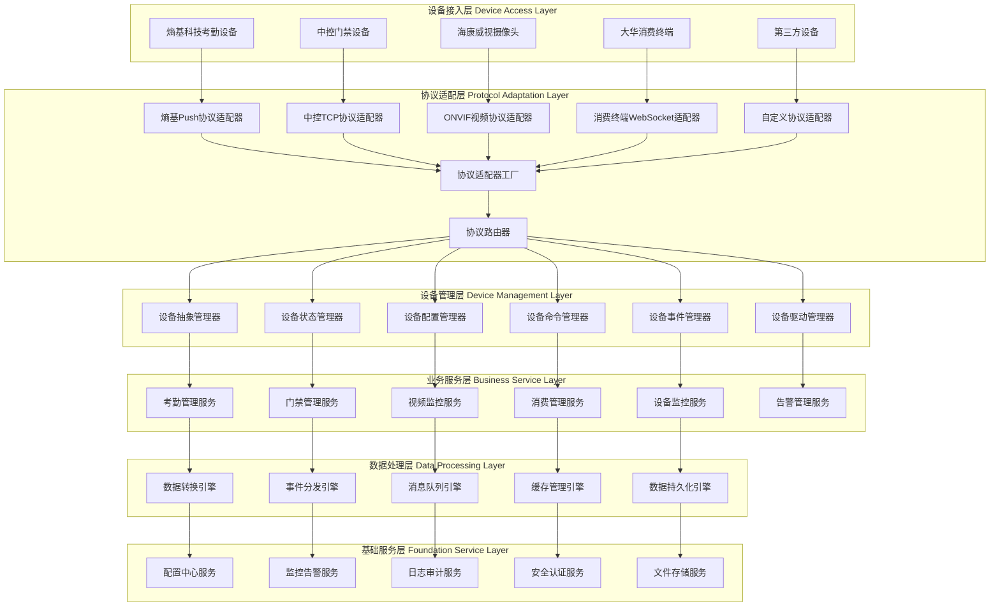

# 🏗️ 多协议组件化设备接入架构设计

**文档版本**: v1.0.0
**创建日期**: 2025-11-16
**最后更新**: 2025-11-16
**维护者**: SmartAdmin Team

---

## 📋 概述

本文档基于IOE-DREAM项目现有架构和熵基科技等厂商协议分析，设计了一套完整的多协议组件化设备接入架构。该架构遵循repowiki规范体系，采用四层架构设计，支持多种协议设备的统一接入和管理。

---

## 🎯 核心设计原则

### 📐 架构设计原则

1. **单一职责原则**: 每个组件只负责特定的功能
2. **开放封闭原则**: 对扩展开放，对修改封闭
3. **依赖倒置原则**: 依赖抽象而非具体实现
4. **接口隔离原则**: 使用专门的接口
5. **组件化设计**: 协议适配器作为独立组件

### 🔧 技术选型标准

- **核心框架**: Spring Boot 3.x + Jakarta EE
- **网络通信**: Netty (高性能异步网络框架)
- **协议解析**: 自定义协议解析引擎
- **数据存储**: MySQL + Redis + MongoDB
- **消息队列**: RabbitMQ (异步处理)
- **配置管理**: Nacos (动态配置)

---

## 🏗️ 整体架构设计

### 📊 系统架构总览



---

## 🔌 协议适配器层设计

### 📋 协议适配器抽象

```java
/**
 * 协议适配器接口 - 遵循repowiki规范
 */
public interface DeviceProtocolAdapter {

    /**
     * 获取协议类型
     */
    ProtocolType getProtocolType();

    /**
     * 获取支持的厂商
     */
    List<String> getSupportedManufacturers();

    /**
     * 解析设备连接请求
     */
    CompletableFuture<ConnectionResult> parseConnectionRequest(ChannelHandlerContext ctx, FullHttpRequest request);

    /**
     * 处理设备数据上传
     */
    CompletableFuture<ProcessResult> processDataUpload(Device device, DeviceData data);

    /**
     * 构建设备命令
     */
    CompletableFuture<DeviceCommand> buildCommand(Device device, CommandRequest request);

    /**
     * 心跳检测
     */
    CompletableFuture<Boolean> heartbeat(Device device);

    /**
     * 断开连接处理
     */
    void onDisconnected(Device device);
}
```

### 🔧 熵基科技协议适配器实现

```java
/**
 * 熵基科技Push协议适配器
 * 基于熵基科技考勤PUSH通讯协议V4.6实现
 */
@Component
@Slf4j
public class ZktecoPushProtocolAdapter implements DeviceProtocolAdapter {

    @Resource
    private ZktecoMessageParser messageParser;

    @Resource
    private ZktecoCommandBuilder commandBuilder;

    @Override
    public ProtocolType getProtocolType() {
        return ProtocolType.ZKTECO_PUSH;
    }

    @Override
    public List<String> getSupportedManufacturers() {
        return Arrays.asList("ZKTeco", "熵基科技");
    }

    @Override
    public CompletableFuture<ConnectionResult> parseConnectionRequest(ChannelHandlerContext ctx, FullHttpRequest request) {
        return CompletableFuture.supplyAsync(() -> {
            try {
                // 解析初始化信息交互请求
                String uri = request.uri();
                if (uri.contains("/iclock/cdata") && uri.contains("options=all")) {

                    // 提取设备序列号
                    String serialNumber = extractSerialNumber(uri);

                    // 解析请求参数
                    Map<String, String> params = parseRequestParams(uri);

                    // 验证设备
                    Device device = validateDevice(serialNumber, params);

                    // 构建配置响应
                    String configResponse = buildConfigResponse(device);

                    return ConnectionResult.builder()
                            .success(true)
                            .deviceId(serialNumber)
                            .device(device)
                            .configResponse(configResponse)
                            .build();
                }

                return ConnectionResult.builder()
                        .success(false)
                        .errorMessage("Invalid connection request")
                        .build();

            } catch (Exception e) {
                log.error("解析熵基科技连接请求失败", e);
                return ConnectionResult.builder()
                        .success(false)
                        .errorMessage(e.getMessage())
                        .build();
            }
        });
    }

    @Override
    public CompletableFuture<ProcessResult> processDataUpload(Device device, DeviceData data) {
        return CompletableFuture.supplyAsync(() -> {
            try {
                // 根据数据类型处理
                String tableName = data.getTableName();

                switch (tableName) {
                    case "ATTLOG":
                        return processAttendanceLog(device, data);
                    case "OPERLOG":
                        return processOperationLog(device, data);
                    case "USERINFO":
                        return processUserInfo(device, data);
                    case "FINGERTMP":
                        return processFingerprintTemplate(device, data);
                    case "FACE":
                        return processFaceTemplate(device, data);
                    case "ATTPHOTO":
                        return processAttendancePhoto(device, data);
                    default:
                        return ProcessResult.builder()
                                .success(false)
                                .errorMessage("Unsupported data type: " + tableName)
                                .build();
                }
            } catch (Exception e) {
                log.error("处理熵基科技数据上传失败", e);
                return ProcessResult.builder()
                        .success(false)
                        .errorMessage(e.getMessage())
                        .build();
            }
        });
    }

    private ProcessResult processAttendanceLog(Device device, DeviceData data) {
        List<AttendanceRecord> records = messageParser.parseAttendanceLog(data.getContent());

        // 数据验证和转换
        List<AttendanceRecordEntity> entities = records.stream()
                .map(record -> convertToEntity(device, record))
                .collect(Collectors.toList());

        // 批量保存
        attendanceRecordService.batchSave(entities);

        return ProcessResult.builder()
                .success(true)
                .processedCount(records.size())
                .message("处理考勤记录成功")
                .build();
    }
}
```

### 🏭 协议适配器工厂

```java
/**
 * 协议适配器工厂
 */
@Component
@Slf4j
public class ProtocolAdapterFactory {

    private final Map<ProtocolType, DeviceProtocolAdapter> adapterRegistry = new ConcurrentHashMap<>();

    private final Map<String, DeviceProtocolAdapter> manufacturerAdapterMap = new ConcurrentHashMap<>();

    @Resource
    private ApplicationContext applicationContext;

    @PostConstruct
    public void initializeAdapters() {
        // 自动扫描并注册所有协议适配器
        Map<String, DeviceProtocolAdapter> adapters = applicationContext.getBeansOfType(DeviceProtocolAdapter.class);

        for (DeviceProtocolAdapter adapter : adapters.values()) {
            registerAdapter(adapter);
        }

        log.info("协议适配器工厂初始化完成，共注册 {} 个适配器", adapterRegistry.size());
    }

    /**
     * 注册协议适配器
     */
    public void registerAdapter(DeviceProtocolAdapter adapter) {
        ProtocolType protocolType = adapter.getProtocolType();
        adapterRegistry.put(protocolType, adapter);

        // 按厂商映射
        for (String manufacturer : adapter.getSupportedManufacturers()) {
            manufacturerAdapterMap.put(manufacturer.toLowerCase(), adapter);
        }

        log.info("注册协议适配器: {} -> {}", protocolType, adapter.getClass().getSimpleName());
    }

    /**
     * 根据协议类型获取适配器
     */
    public DeviceProtocolAdapter getAdapter(ProtocolType protocolType) {
        return adapterRegistry.get(protocolType);
    }

    /**
     * 根据厂商获取适配器
     */
    public DeviceProtocolAdapter getAdapterByManufacturer(String manufacturer) {
        return manufacturerAdapterMap.get(manufacturer.toLowerCase());
    }

    /**
     * 自动检测协议类型
     */
    public DeviceProtocolAdapter detectAdapter(ChannelHandlerContext ctx, FullHttpRequest request) {
        // 1. 先根据厂商检测
        String userAgent = request.headers().get("User-Agent");
        if (userAgent != null) {
            for (Map.Entry<String, DeviceProtocolAdapter> entry : manufacturerAdapterMap.entrySet()) {
                if (userAgent.toLowerCase().contains(entry.getKey())) {
                    return entry.getValue();
                }
            }
        }

        // 2. 根据URL模式检测
        String uri = request.uri();
        if (uri.contains("/iclock/")) {
            return getAdapter(ProtocolType.ZKTECO_PUSH);
        } else if (uri.contains("/onvif/")) {
            return getAdapter(ProtocolType.ONVIF);
        } else if (uri.contains("/ws/")) {
            return getAdapter(ProtocolType.WEBSOCKET);
        }

        // 3. 默认使用HTTP协议适配器
        return getAdapter(ProtocolType.HTTP);
    }
}
```

---

## 🔧 设备管理层设计

### 📱 设备抽象接口

```java
/**
 * 设备抽象接口
 */
public interface Device {

    /**
     * 获取设备ID
     */
    String getDeviceId();

    /**
     * 获取设备类型
     */
    DeviceType getDeviceType();

    /**
     * 获取设备状态
     */
    DeviceStatus getStatus();

    /**
     * 获取设备信息
     */
    DeviceInfo getDeviceInfo();

    /**
     * 执行命令
     */
    CompletableFuture<CommandResult> executeCommand(Command command);

    /**
     * 注册事件监听器
     */
    void registerEventListener(DeviceEventListener listener);

    /**
     * 获取协议适配器
     */
    DeviceProtocolAdapter getProtocolAdapter();

    /**
     * 更新设备状态
     */
    void updateStatus(DeviceStatus status);

    /**
     * 断开连接
     */
    void disconnect();
}
```

### 🎛️ 设备管理器实现

```java
/**
 * 设备管理器 - 遵循repowiki四层架构
 */
@Component
@Slf4j
public class DeviceManager {

    @Resource
    private DeviceDriverManager driverManager;

    @Resource
    private DeviceStateManager stateManager;

    @Resource
    private DeviceConfigManager configManager;

    @Resource
    private ProtocolAdapterFactory adapterFactory;

    private final Map<String, Device> deviceRegistry = new ConcurrentHashMap<>();

    /**
     * 注册设备
     */
    public Device registerDevice(DeviceRegistrationRequest request) {
        log.info("注册设备: {}", request.getDeviceId());

        try {
            // 1. 创建设备实例
            Device device = createDevice(request);

            // 2. 初始化设备配置
            DeviceConfig config = configManager.getDefaultConfig(request.getDeviceType());
            device.setConfig(config);

            // 3. 初始化协议适配器
            DeviceProtocolAdapter adapter = adapterFactory.getAdapter(request.getProtocolType());
            device.setProtocolAdapter(adapter);

            // 4. 注册设备到管理器
            deviceRegistry.put(device.getDeviceId(), device);

            // 5. 初始化状态
            stateManager.initializeDeviceState(device);

            // 6. 注册事件监听器
            device.registerEventListener(new DefaultDeviceEventListener());

            log.info("设备注册成功: {}", device.getDeviceId());
            return device;

        } catch (Exception e) {
            log.error("设备注册失败: {}", request.getDeviceId(), e);
            throw new DeviceRegistrationException("设备注册失败", e);
        }
    }

    /**
     * 获取设备
     */
    public Device getDevice(String deviceId) {
        return deviceRegistry.get(deviceId);
    }

    /**
     * 获取所有在线设备
     */
    public List<Device> getOnlineDevices() {
        return deviceRegistry.values().stream()
                .filter(device -> device.getStatus() == DeviceStatus.ONLINE)
                .collect(Collectors.toList());
    }

    /**
     * 批量执行命令
     */
    public CompletableFuture<BatchCommandResult> executeBatchCommand(List<String> deviceIds, Command command) {
        List<CompletableFuture<CommandResult>> futures = deviceIds.stream()
                .map(deviceId -> {
                    Device device = getDevice(deviceId);
                    if (device != null) {
                        return device.executeCommand(command);
                    } else {
                        return CompletableFuture.completedFuture(
                                CommandResult.builder()
                                        .success(false)
                                        .deviceId(deviceId)
                                        .errorMessage("设备不存在")
                                        .build()
                        );
                    }
                })
                .collect(Collectors.toList());

        return CompletableFuture.allOf(futures.toArray(new CompletableFuture[0]))
                .thenApply(results -> {
                    List<CommandResult> commandResults = Arrays.stream(results)
                            .map(result -> (CommandResult) result)
                            .collect(Collectors.toList());

                    return BatchCommandResult.builder()
                            .results(commandResults)
                            .successCount((int) commandResults.stream().filter(CommandResult::isSuccess).count())
                            .failureCount((int) commandResults.stream().filter(r -> !r.isSuccess()).count())
                            .build();
                });
    }
}
```

---

## 🔄 设备驱动管理框架

### 📋 设备驱动接口

```java
/**
 * 设备驱动接口
 */
public interface DeviceDriver {

    /**
     * 获取支持的设备类型
     */
    DeviceType getSupportedDeviceType();

    /**
     * 获取支持的厂商
     */
    List<String> getSupportedManufacturers();

    /**
     * 初始化驱动
     */
    void initialize(DriverConfig config);

    /**
     * 发现设备
     */
    CompletableFuture<List<DiscoveredDevice>> discoverDevices(DiscoveryRequest request);

    /**
     * 连接设备
     */
    CompletableFuture<ConnectionResult> connectDevice(DiscoveredDevice device);

    /**
     * 断开设备连接
     */
    CompletableFuture<Void> disconnectDevice(String deviceId);

    /**
     * 获取设备状态
     */
    CompletableFuture<DeviceStatus> getDeviceStatus(String deviceId);

    /**
     * 执行设备命令
     */
    CompletableFuture<CommandResult> executeCommand(String deviceId, Command command);

    /**
     * 销毁驱动
     */
    void destroy();
}
```

### 🏭 设备驱动管理器

```java
/**
 * 设备驱动管理器
 */
@Component
@Slf4j
public class DeviceDriverManager {

    private final Map<DeviceType, List<DeviceDriver>> driverRegistry = new ConcurrentHashMap<>();
    private final Map<String, DeviceDriver> activeDrivers = new ConcurrentHashMap<>();

    @Resource
    private ApplicationContext applicationContext;

    @PostConstruct
    public void initializeDrivers() {
        // 自动扫描并注册所有设备驱动
        Map<String, DeviceDriver> drivers = applicationContext.getBeansOfType(DeviceDriver.class);

        for (DeviceDriver driver : drivers.values()) {
            registerDriver(driver);
        }

        log.info("设备驱动管理器初始化完成，共注册 {} 个驱动", driverRegistry.size());
    }

    /**
     * 注册设备驱动
     */
    public void registerDriver(DeviceDriver driver) {
        DeviceType deviceType = driver.getSupportedDeviceType();

        driverRegistry.computeIfAbsent(deviceType, k -> new ArrayList<>()).add(driver);

        log.info("注册设备驱动: {} -> {}", deviceType, driver.getClass().getSimpleName());
    }

    /**
     * 获取设备驱动
     */
    public DeviceDriver getDriver(String deviceId, String manufacturer) {
        // 先检查是否已有活跃的驱动
        DeviceDriver activeDriver = activeDrivers.get(deviceId);
        if (activeDriver != null) {
            return activeDriver;
        }

        // 根据设备类型和厂商选择合适的驱动
        DeviceEntity deviceEntity = deviceService.getById(deviceId);
        if (deviceEntity != null) {
            DeviceType deviceType = DeviceType.fromCode(deviceEntity.getDeviceType());
            List<DeviceDriver> drivers = driverRegistry.get(deviceType);

            if (drivers != null) {
                for (DeviceDriver driver : drivers) {
                    if (driver.getSupportedManufacturers().contains(manufacturer)) {
                        activeDrivers.put(deviceId, driver);
                        return driver;
                    }
                }

                // 如果没有找到匹配的厂商驱动，返回第一个可用的驱动
                if (!drivers.isEmpty()) {
                    DeviceDriver defaultDriver = drivers.get(0);
                    activeDrivers.put(deviceId, defaultDriver);
                    return defaultDriver;
                }
            }
        }

        throw new UnsupportedDeviceException("不支持的设备类型或厂商: " + deviceId + ", " + manufacturer);
    }

    /**
     * 自动发现设备
     */
    public CompletableFuture<List<DiscoveredDevice>> autoDiscoverDevices() {
        List<CompletableFuture<List<DiscoveredDevice>>> futures = new ArrayList<>();

        for (List<DeviceDriver> drivers : driverRegistry.values()) {
            for (DeviceDriver driver : drivers) {
                DiscoveryRequest request = DiscoveryRequest.builder()
                        .timeout(Duration.ofSeconds(30))
                        .build();

                futures.add(driver.discoverDevices(request));
            }
        }

        return CompletableFuture.allOf(futures.toArray(new CompletableFuture[0]))
                .thenApply(results -> {
                    List<DiscoveredDevice> allDevices = new ArrayList<>();
                    for (CompletableFuture<List<DiscoveredDevice>> future : results) {
                        try {
                            allDevices.addAll(future.get());
                        } catch (Exception e) {
                            log.warn("设备发现过程中出现异常", e);
                        }
                    }
                    return allDevices;
                });
    }
}
```

---

## 📊 数据处理引擎设计

### 🔄 数据转换引擎

```java
/**
 * 数据转换引擎
 */
@Component
@Slf4j
public class DataTransformationEngine {

    @Resource
    private List<DataTransformer> transformers;

    @Resource
    private DataValidationEngine validationEngine;

    /**
     * 转换设备数据
     */
    public CompletableFuture<TransformResult> transformData(Device device, DeviceData rawData) {
        return CompletableFuture.supplyAsync(() -> {
            try {
                // 1. 数据验证
                ValidationResult validationResult = validationEngine.validate(rawData);
                if (!validationResult.isValid()) {
                    return TransformResult.builder()
                            .success(false)
                            .errorMessage("数据验证失败: " + validationResult.getErrorMessage())
                            .build();
                }

                // 2. 数据转换
                Object transformedData = rawData;
                for (DataTransformer transformer : transformers) {
                    if (transformer.supports(device.getDeviceType(), rawData.getDataType())) {
                        transformedData = transformer.transform(transformedData);
                    }
                }

                // 3. 转换后验证
                if (transformedData != null) {
                    ValidationResult postValidationResult = validationEngine.validate(transformedData);
                    if (!postValidationResult.isValid()) {
                        return TransformResult.builder()
                                .success(false)
                                .errorMessage("转换后数据验证失败: " + postValidationResult.getErrorMessage())
                                .build();
                    }
                }

                return TransformResult.builder()
                        .success(true)
                        .transformedData(transformedData)
                        .build();

            } catch (Exception e) {
                log.error("数据转换失败", e);
                return TransformResult.builder()
                        .success(false)
                        .errorMessage(e.getMessage())
                        .build();
            }
        });
    }
}

/**
 * 数据转换器接口
 */
public interface DataTransformer {

    /**
     * 是否支持特定的设备和数据类型
     */
    boolean supports(DeviceType deviceType, DataType dataType);

    /**
     * 转换数据
     */
    Object transform(Object data);
}
```

### 🎯 熵基科技数据转换器

```java
/**
 * 熵基科技数据转换器
 */
@Component
@Slf4j
public class ZktecoDataTransformer implements DataTransformer {

    @Resource
    private ZktecoDataParser dataParser;

    @Override
    public boolean supports(DeviceType deviceType, DataType dataType) {
        return deviceType == DeviceType.ATTENDANCE_MACHINE &&
               (dataType == DataType.ATTENDANCE_RECORD ||
                dataType == DataType.USER_INFO ||
                dataType == DataType.FINGERPRINT_TEMPLATE ||
                dataType == DataType.FACE_TEMPLATE);
    }

    @Override
    public Object transform(Object data) {
        if (data instanceof String) {
            String content = (String) data;

            // 根据数据格式进行转换
            if (content.startsWith("USER")) {
                return transformUserInfo(content);
            } else if (content.startsWith("FP")) {
                return transformFingerprintTemplate(content);
            } else if (content.startsWith("FACE")) {
                return transformFaceTemplate(content);
            } else if (content.contains("\t")) {
                return transformAttendanceRecord(content);
            }
        }

        return data;
    }

    private List<AttendanceRecord> transformAttendanceRecord(String content) {
        return dataParser.parseAttendanceRecords(content);
    }

    private List<UserInfo> transformUserInfo(String content) {
        return dataParser.parseUserInfo(content);
    }

    private List<FingerprintTemplate> transformFingerprintTemplate(String content) {
        return dataParser.parseFingerprintTemplates(content);
    }

    private List<FaceTemplate> transformFaceTemplate(String content) {
        return dataParser.parseFaceTemplates(content);
    }
}
```

---

## 🚀 实施方案

### 📋 实施阶段

#### 第一阶段：基础架构搭建（2周）
- [ ] 搭建协议适配器框架
- [ ] 实现设备抽象接口
- [ ] 开发协议适配器工厂
- [ ] 创建设备驱动管理器

#### 第二阶段：协议适配器开发（4周）
- [ ] 熵基科技Push协议适配器
- [ ] 中控TCP协议适配器
- [ ] ONVIF视频协议适配器
- [ ] WebSocket通用适配器

#### 第三阶段：数据处理引擎（2周）
- [ ] 数据转换引擎
- [ ] 事件分发引擎
- [ ] 数据验证引擎

#### 第四阶段：集成测试（1周）
- [ ] 多协议设备接入测试
- [ ] 数据一致性验证
- [ ] 性能压力测试

#### 第五阶段：上线部署（1周）
- [ ] 生产环境部署
- [ ] 监控告警配置
- [ ] 文档培训交付

---

## 📈 性能优化策略

### ⚡ 高性能优化

1. **异步处理**: 所有I/O操作使用CompletableFuture异步处理
2. **连接池**: 使用Netty连接池管理网络连接
3. **数据缓存**: Redis缓存热点数据
4. **批量处理**: 批量处理数据上传和命令下发
5. **负载均衡**: 支持多实例部署和负载均衡

### 📊 监控指标

| 指标类别 | 指标名称 | 目标值 | 告警阈值 |
|----------|----------|--------|----------|
| 设备连接 | 在线设备数 | 实时 | <95% |
| 数据处理 | 数据处理延迟 | ≤100ms | >500ms |
| 命令执行 | 命令成功率 | ≥99.9% | <99% |
| 系统性能 | CPU使用率 | ≤70% | >85% |
| 网络流量 | 网络带宽 | ≤1Gbps | >800Mbps |

---

## 🔒 安全设计

### 🛡️ 安全机制

1. **设备认证**: 双向证书认证
2. **数据加密**: TLS 1.3传输加密
3. **访问控制**: 基于RBAC的权限控制
4. **审计日志**: 完整的操作审计
5. **防重放攻击**: 时间戳和随机数验证

---

**⚠️ 重要提醒**: 本架构设计严格遵循repowiki规范体系，所有实施工作必须按照文档中的技术标准和架构设计执行，确保系统的稳定性、安全性和可扩展性。