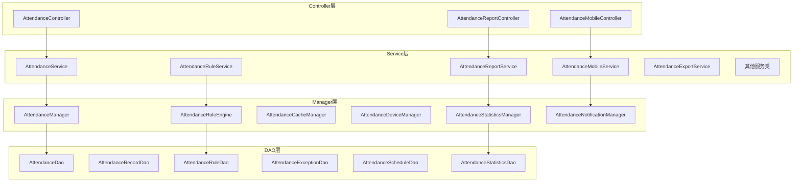
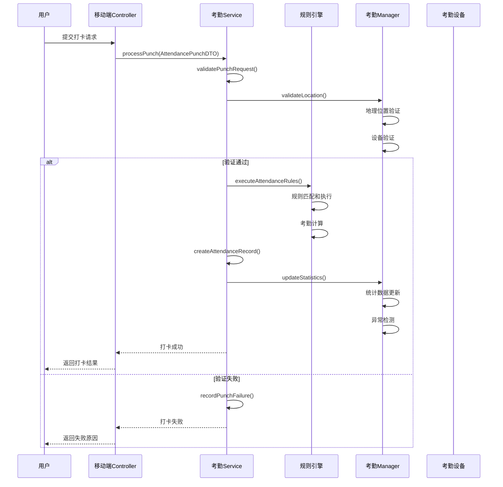
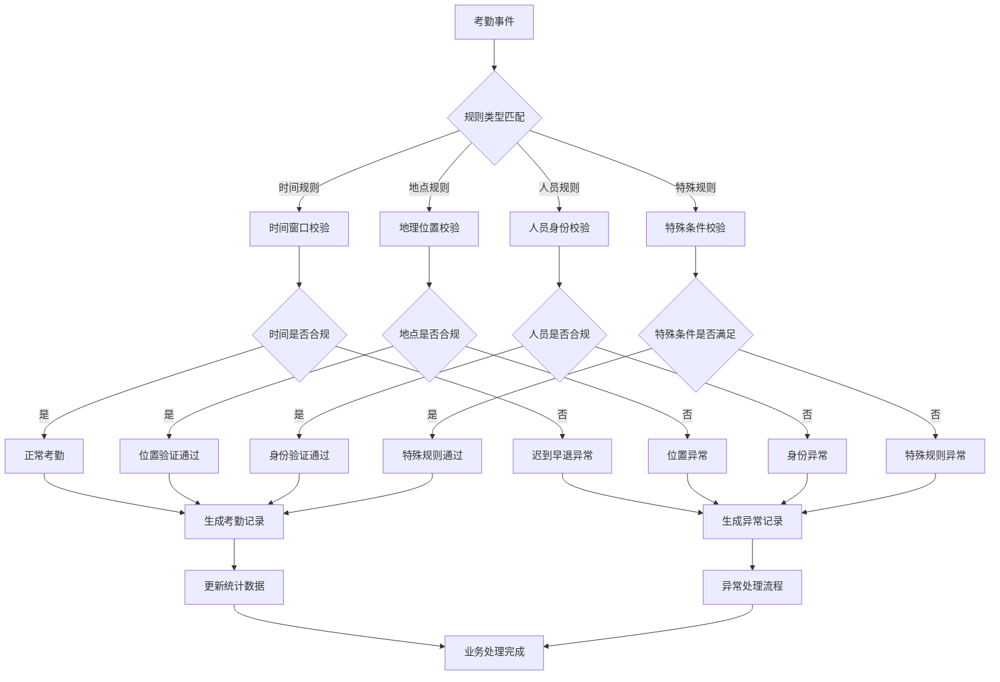
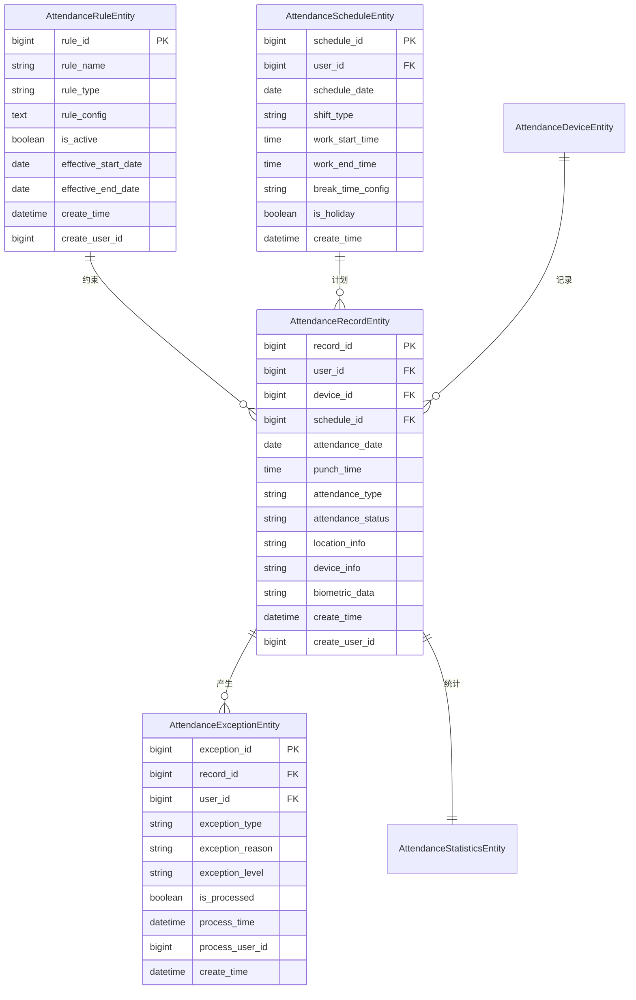
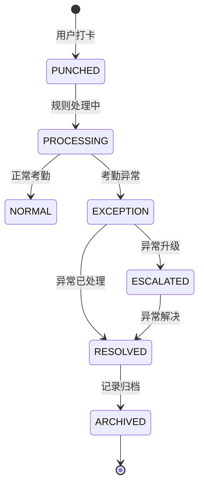
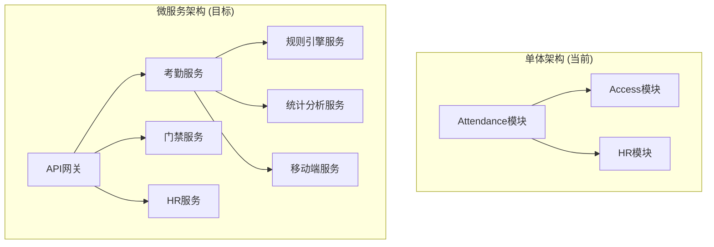

# Attendance 考勤管理模块业务文档

> **模块版本**: v1.0.0
> **创建日期**: 2025-11-24
> **文件数量**: 50个Java文件
> **架构状态**: ✅ 已完成去"smart"化重构

---

## 📋 模块概述

### 业务定位
Attendance模块是IOE-DREAM智慧园区一卡通管理平台的核心考勤管理模块，负责企业员工的考勤数据采集、规则处理、统计分析等全生命周期管理。模块支持多种打卡方式、灵活的考勤规则配置、智能化的异常处理和全面的报表分析功能。

### 核心价值
- **多样化打卡**: 支持人脸、指纹、刷卡、手机APP等多种打卡方式
- **智能规则引擎**: 基于规则引擎的灵活考勤规则配置和执行
- **异常自动处理**: 智能识别考勤异常并自动处理或提醒
- **全面数据分析**: 提供多维度的考勤数据分析和可视化报表
- **移动端支持**: 提供移动端考勤打卡和异常申请功能

---

## 🏗️ 模块架构设计

### 四层架构结构

```
Attendance模块 (50个Java文件)
├── Controller层 (3个)          # 接口控制层
├── Service层 (12个)           # 业务逻辑层
├── Manager层 (6个)            # 业务管理层
├── DAO层 (6个)               # 数据访问层
└── Domain层 (23个)           # 领域模型层
```

### 核心组件架构



---

## 📁 详细文件结构

### Controller层 (3个文件)
**职责**: 接收HTTP请求，参数验证，调用Service层

| 文件名 | 功能描述 | 核心API |
|--------|----------|---------|
| `AttendanceController.java` | 考勤管理主接口 | 考勤记录查询、统计、管理 |
| `AttendanceMobileController.java` | 移动端考勤接口 | 移动打卡、异常申请 |
| `AttendanceReportController.java` | 考勤报表接口 | 报表生成、数据导出 |

### Service层 (12个文件)
**职责**: 业务逻辑处理，事务管理

| 文件名 | 功能描述 | 核心业务 |
|--------|----------|-----------|
| `AttendanceService.java` | 考勤核心业务逻辑 | 打卡处理、记录管理 |
| `AttendanceRuleService.java` | 考勤规则业务逻辑 | 规则配置、规则执行 |
| `AttendanceReportService.java` | 报表业务逻辑 | 报表生成、数据分析 |
| `AttendanceMobileService.java` | 移动端业务逻辑 | 移动打卡、位置验证 |
| `AttendanceExportService.java` | 数据导出业务逻辑 | Excel导出、PDF生成 |
| `AttendanceExceptionService.java` | 异常处理业务逻辑 | 异常识别、异常处理 |
| `AttendanceIntegrationService.java` | 集成业务逻辑 | 系统集成、数据同步 |
| `AttendanceLocationService.java` | 位置服务业务逻辑 | 位置验证、地理围栏 |
| `AttendanceScheduleService.java` | 排班业务逻辑 | 排班管理、班次配置 |
| `AttendanceCustomReportService.java` | 自定义报表业务逻辑 | 报表设计、动态生成 |
| `AttendanceDataSyncService.java` | 数据同步业务逻辑 | 数据同步、一致性保证 |
| `AttendanceSyncService.java` | 同步服务业务逻辑 | 设备同步、数据同步 |

### Manager层 (6个文件)
**职责**: 复杂业务逻辑封装，跨模块调用

| 文件名 | 功能描述 | 核心管理 |
|--------|----------|----------|
| `AttendanceManager.java` | 考勤综合管理 | 考勤流程管理、状态控制 |
| `AttendanceRuleEngine.java` | 考勤规则引擎 | 规则解析、规则执行 |
| `AttendanceCacheManager.java` | 考勤缓存管理 | 缓存策略、数据缓存 |
| `AttendanceDeviceManager.java` | 设备管理 | 设备状态、设备控制 |
| `AttendanceStatisticsManager.java` | 统计管理 | 数据统计、分析计算 |
| `AttendanceNotificationManager.java` | 通知管理 | 消息推送、提醒通知 |

### DAO层 (6个文件)
**职责**: 数据访问，使用MyBatis Plus

| 文件名 | 功能描述 | 主要操作 |
|--------|----------|-----------|
| `AttendanceDao.java` | 考勤主数据访问 | 考勤数据CRUD、统计查询 |
| `AttendanceRecordDao.java` | 考勤记录数据访问 | 记录查询、批量处理 |
| `AttendanceRuleDao.java` | 考勤规则数据访问 | 规则CRUD、规则查询 |
| `AttendanceExceptionDao.java` | 考勤异常数据访问 | 异常记录、异常统计 |
| `AttendanceScheduleDao.java` | 排班数据访问 | 排班查询、排班统计 |
| `AttendanceStatisticsDao.java` | 统计数据访问 | 统计数据、报表数据 |

### Domain层 (23个文件)
**职责**: 领域模型定义

#### Entity实体类 (6个)
- `AttendanceRecordEntity.java` - 考勤记录实体
- `AttendanceRuleEntity.java` - 考勤规则实体
- `AttendanceExceptionEntity.java` - 考勤异常实体
- `AttendanceScheduleEntity.java` - 排班实体
- `AttendanceStatisticsEntity.java` - 考勤统计实体
- `AttendanceDeviceEntity.java` - 考勤设备实体

#### DTO数据传输对象 (4个)
- `AttendancePunchDTO.java` - 打卡请求DTO
- `AttendanceRecordCreateDTO.java` - 记录创建DTO
- `AttendanceRecordUpdateDTO.java` - 记录更新DTO
- `MakeupPunchRequest.java` - 补卡申请DTO

#### VO视图对象 (5个)
- `AttendanceRecordVO.java` - 考勤记录视图
- `AttendanceRecordQueryVO.java` - 考勤查询视图
- `CustomReportResult.java` - 自定义报表结果视图
- `ExportResult.java` - 导出结果视图
- `PivotTableResult.java` - 透视表结果视图

#### Form表单对象 (2个)
- `MakeupPunchRequest.java` - 补卡申请表单
- 其他考勤配置表单

#### 其他领域对象 (6个)
- `IAttendanceService.java` - 考勤服务接口
- `ReportConfigValidationResult.java` - 报表配置验证结果
- 其他规则、配置类

---

## 🔧 核心业务流程

### 考勤打卡处理流程



### 考勤规则引擎执行流程



---

## 🔒 核心业务规则

### 1. 考勤时间规则

#### 工作时间配置
```java
@Entity
public class AttendanceRuleEntity extends BaseEntity {
    /**
     * 工作时间配置
     */
    @TableField("work_time_config")
    private WorkTimeConfig workTimeConfig;

    /**
     * 弹性时间配置
     */
    @TableField("flexible_time_config")
    private FlexibleTimeConfig flexibleTimeConfig;
}

public class WorkTimeConfig {
    private LocalTime morningStartTime;    // 上午上班时间 08:30
    private LocalTime morningEndTime;      // 上午下班时间 12:00
    private LocalTime afternoonStartTime;  // 下午上班时间 13:30
    private LocalTime afternoonEndTime;    // 下午下班时间 18:00

    private Integer lateToleranceMinutes;  // 迟到容差(分钟)
    private Integer leaveEarlyToleranceMinutes; // 早退容差(分钟)
}
```

#### 考勤状态判断逻辑
```java
public enum AttendanceStatus {
    NORMAL,          // 正常
    LATE,           // 迟到
    EARLY_LEAVE,    // 早退
    ABSENCE,        // 缺勤
    LEAVE,          // 请假
    BUSINESS_TRIP,  // 出差
    OVERTIME,       // 加班
    HOLIDAY         // 节假日
}

public AttendanceStatus calculateAttendanceStatus(AttendanceRecord record,
                                                AttendanceRule rule) {
    LocalTime actualTime = record.getPunchTime().toLocalTime();
    WorkTimeConfig timeConfig = rule.getWorkTimeConfig();

    // 判断是否迟到
    if (actualTime.isAfter(timeConfig.getMorningStartTime().plusMinutes(timeConfig.getLateToleranceMinutes()))) {
        return AttendanceStatus.LATE;
    }

    // 判断是否早退
    if (actualTime.isBefore(timeConfig.getAfternoonEndTime().minusMinutes(timeConfig.getLeaveEarlyToleranceMinutes()))) {
        return AttendanceStatus.EARLY_LEAVE;
    }

    return AttendanceStatus.NORMAL;
}
```

### 2. 地理位置规则

#### 地理围栏验证
```java
@Service
public class AttendanceLocationService {

    /**
     * 验证打卡位置是否在允许范围内
     */
    public boolean validatePunchLocation(Long userId, Location punchLocation) {
        // 1. 获取用户允许的打卡位置
        List<AllowedLocation> allowedLocations = getAllowedLocations(userId);

        // 2. 计算当前位置与允许位置的距离
        for (AllowedLocation allowedLocation : allowedLocations) {
            double distance = calculateDistance(punchLocation, allowedLocation.getLocation());

            // 3. 判断是否在允许范围内(默认100米)
            if (distance <= allowedLocation.getRadius()) {
                return true;
            }
        }

        return false;
    }

    /**
     * 计算两点间距离(米)
     */
    private double calculateDistance(Location loc1, Location loc2) {
        // 使用Haversine公式计算地球表面两点间距离
        double lat1 = Math.toRadians(loc1.getLatitude());
        double lon1 = Math.toRadians(loc1.getLongitude());
        double lat2 = Math.toRadians(loc2.getLatitude());
        double lon2 = Math.toRadians(loc2.getLongitude());

        double dLat = lat2 - lat1;
        double dLon = lon2 - lon1;

        double a = Math.sin(dLat/2) * Math.sin(dLat/2) +
                   Math.cos(lat1) * Math.cos(lat2) *
                   Math.sin(dLon/2) * Math.sin(dLon/2);

        double c = 2 * Math.atan2(Math.sqrt(a), Math.sqrt(1-a));
        return 6371000 * c; // 地球半径6371km，转换为米
    }
}
```

### 3. 异常处理规则

#### 异常自动识别
```java
@Component
public class AttendanceExceptionDetector {

    /**
     * 检测考勤异常
     */
    public List<AttendanceException> detectExceptions(AttendanceRecord record) {
        List<AttendanceException> exceptions = new ArrayList<>();

        // 1. 缺勤检测
        if (isAbsence(record)) {
            exceptions.add(createAbsenceException(record));
        }

        // 2. 连续迟到检测
        if (isConsecutiveLate(record)) {
            exceptions.add(createConsecutiveLateException(record));
        }

        // 3. 异常时间打卡检测
        if (isAbnormalTime(record)) {
            exceptions.add(createAbnormalTimeException(record));
        }

        // 4. 异常地点打卡检测
        if (isAbnormalLocation(record)) {
            exceptions.add(createAbnormalLocationException(record));
        }

        return exceptions;
    }

    /**
     * 判断是否缺勤
     */
    private boolean isAbsence(AttendanceRecord record) {
        // 检查当天是否有任何打卡记录
        LocalDate punchDate = record.getPunchTime().toLocalDate();
        List<AttendanceRecord> dayRecords = getDayRecords(record.getUserId(), punchDate);

        return dayRecords.isEmpty() && !isLeaveOrBusinessTrip(record.getUserId(), punchDate);
    }

    /**
     * 判断是否连续迟到
     */
    private boolean isConsecutiveLate(AttendanceRecord record) {
        // 检查最近5个工作日迟到情况
        List<LocalDate> recentWorkdays = getRecentWorkdays(5);
        int lateCount = 0;

        for (LocalDate workday : recentWorkdays) {
            List<AttendanceRecord> dayRecords = getDayRecords(record.getUserId(), workday);
            if (hasLateRecord(dayRecords)) {
                lateCount++;
            }
        }

        return lateCount >= 3; // 连续3天迟到
    }
}
```

---

## 📊 数据模型设计

### 核心实体关系图



### 业务状态流转

#### 考勤记录状态流转


---

## 🚀 核心功能特性

### 1. 多种打卡方式

#### 生物识别打卡
```java
@Service
public class BiometricPunchService {

    /**
     * 人脸识别打卡
     */
    public AttendanceResult faceRecognitionPunch(FacePunchRequest request) {
        // 1. 人脸特征提取
        FaceFeatures features = faceRecognitionService.extractFeatures(request.getFaceImage());

        // 2. 用户身份验证
        UserIdentity userId = faceRecognitionService.identifyUser(features);
        if (userId == null) {
            return AttendanceResult.failed("人脸识别失败，无法识别用户身份");
        }

        // 3. 活体检测
        if (!faceRecognitionService.livenessCheck(request.getFaceImage())) {
            return AttendanceResult.failed("活体检测失败，请重试");
        }

        // 4. 创建考勤记录
        AttendanceRecord record = createAttendanceRecord(userId, request);

        return AttendanceResult.success(record);
    }

    /**
     * 指纹识别打卡
     */
    public AttendanceResult fingerprintPunch(FingerprintPunchRequest request) {
        // 1. 指纹特征提取
        FingerprintFeatures features = fingerprintService.extractFeatures(request.getFingerprintImage());

        // 2. 指纹匹配验证
        UserIdentity userId = fingerprintService.matchFingerprint(features);
        if (userId == null) {
            return AttendanceResult.failed("指纹匹配失败");
        }

        // 3. 创建考勤记录
        AttendanceRecord record = createAttendanceRecord(userId, request);

        return AttendanceResult.success(record);
    }
}
```

### 2. 移动端打卡

#### 移动端打卡流程
```java
@RestController
@RequestMapping("/api/attendance/mobile")
public class AttendanceMobileController {

    @PostMapping("/punch")
    @SaCheckPermission("attendance:mobile:punch")
    public ResponseDTO<AttendanceResult> mobilePunch(
            @Valid @RequestBody AttendancePunchDTO punchDTO) {

        // 1. 移动端特殊验证
        MobileValidationResult validation = mobileService.validateMobilePunch(punchDTO);
        if (!validation.isValid()) {
            return ResponseDTO.error(validation.getErrorMessage());
        }

        // 2. 执行打卡
        AttendanceResult result = attendanceService.processPunch(punchDTO);

        // 3. 返回结果
        return ResponseDTO.ok(result);
    }

    @PostMapping("/makeup-request")
    @SaCheckPermission("attendance:mobile:makeup")
    public ResponseDTO<Boolean> submitMakeupPunchRequest(
            @Valid @RequestBody MakeupPunchRequest request) {

        // 1. 验证补卡申请
        if (!makeupService.validateMakeupRequest(request)) {
            return ResponseDTO.error("补卡申请验证失败");
        }

        // 2. 提交补卡申请
        boolean result = makeupService.submitMakeupRequest(request);

        return ResponseDTO.ok(result);
    }
}
```

### 3. 智能报表分析

#### 多维度统计分析
```java
@Service
public class AttendanceReportService {

    /**
     * 生成月度考勤报表
     */
    public MonthlyAttendanceReport generateMonthlyReport(Long userId, YearMonth month) {
        // 1. 获取月度考勤记录
        List<AttendanceRecord> records = attendanceService.getMonthlyRecords(userId, month);

        // 2. 计算基础统计数据
        AttendanceStatistics statistics = calculateStatistics(records);

        // 3. 分析考勤趋势
        AttendanceTrend trend = analyzeTrend(records);

        // 4. 生成异常报告
        ExceptionReport exceptionReport = generateExceptionReport(records);

        return MonthlyAttendanceReport.builder()
                .userId(userId)
                .month(month)
                .statistics(statistics)
                .trend(trend)
                .exceptionReport(exceptionReport)
                .build();
    }

    /**
     * 部门考勤统计
     */
    public DepartmentAttendanceReport generateDepartmentReport(Long departmentId,
                                                               LocalDate startDate,
                                                               LocalDate endDate) {
        // 1. 获取部门所有员工
        List<Employee> employees = employeeService.getEmployeesByDepartment(departmentId);

        // 2. 统计每个员工的考勤数据
        List<EmployeeAttendanceData> employeeData = new ArrayList<>();
        for (Employee employee : employees) {
            List<AttendanceRecord> records = attendanceService.getRecordsByDateRange(
                    employee.getId(), startDate, endDate);

            EmployeeAttendanceData data = calculateEmployeeData(employee, records);
            employeeData.add(data);
        }

        // 3. 计算部门总体统计
        DepartmentStatistics deptStatistics = calculateDepartmentStatistics(employeeData);

        return DepartmentAttendanceReport.builder()
                .departmentId(departmentId)
                .departmentName(departmentService.getDepartmentName(departmentId))
                .startDate(startDate)
                .endDate(endDate)
                .employeeData(employeeData)
                .departmentStatistics(deptStatistics)
                .build();
    }
}
```

### 4. 规则引擎

#### 动态规则配置
```java
@Component
public class AttendanceRuleEngine {

    /**
     * 执行考勤规则
     */
    public RuleExecutionResult executeRules(AttendanceRecord record, List<AttendanceRule> rules) {
        RuleExecutionContext context = RuleExecutionContext.builder()
                .record(record)
                .rules(rules)
                .executionTime(LocalDateTime.now())
                .build();

        List<RuleResult> results = new ArrayList<>();
        boolean hasException = false;

        for (AttendanceRule rule : rules) {
            try {
                RuleResult result = executeRule(rule, context);
                results.add(result);

                if (!result.isSuccess()) {
                    hasException = true;

                    // 处理规则执行异常
                    handleRuleException(rule, result, context);
                }
            } catch (Exception e) {
                log.error("执行考勤规则失败: ruleId={}, recordId={}", rule.getRuleId(), record.getRecordId(), e);

                RuleResult errorResult = RuleResult.builder()
                        .ruleId(rule.getRuleId())
                        .success(false)
                        .errorMessage("规则执行异常: " + e.getMessage())
                        .build();
                results.add(errorResult);
                hasException = true;
            }
        }

        return RuleExecutionResult.builder()
                .success(!hasException)
                .context(context)
                .results(results)
                .build();
    }

    /**
     * 执行单个规则
     */
    private RuleResult executeRule(AttendanceRule rule, RuleExecutionContext context) {
        // 根据规则类型执行不同的规则逻辑
        switch (rule.getRuleType()) {
            case TIME_RULE:
                return executeTimeRule(rule, context);
            case LOCATION_RULE:
                return executeLocationRule(rule, context);
            case PERSONNEL_RULE:
                return executePersonnelRule(rule, context);
            case SPECIAL_RULE:
                return executeSpecialRule(rule, context);
            default:
                return RuleResult.builder()
                        .ruleId(rule.getRuleId())
                        .success(false)
                        .errorMessage("不支持的规则类型: " + rule.getRuleType())
                        .build();
        }
    }
}
```

---

## 📈 性能优化设计

### 1. 数据库优化

#### 分区表设计
```sql
-- 考勤记录表按月分区
ALTER TABLE t_attendance_record
PARTITION BY RANGE (YEAR(attendance_date) * 100 + MONTH(attendance_date)) (
    PARTITION p202511 VALUES LESS THAN (202512),
    PARTITION p202512 VALUES LESS THAN (202601),
    PARTITION p202601 VALUES LESS THAN (202602),
    -- 按月自动创建分区
);

-- 创建索引
CREATE INDEX idx_record_user_date ON t_attendance_record(user_id, attendance_date);
CREATE INDEX idx_record_date_status ON t_attendance_record(attendance_date, attendance_status);
CREATE INDEX idx_record_device_time ON t_attendance_record(device_id, punch_time);
CREATE INDEX idx_exception_user_processed ON t_attendance_exception(user_id, is_processed);
```

#### 查询优化
```java
@Repository
public class AttendanceRecordDaoImpl extends BaseDao<AttendanceRecordEntity> {

    /**
     * 高效查询月度考勤记录
     */
    @Select("<script>" +
            "SELECT * FROM t_attendance_record " +
            "WHERE user_id = #{userId} " +
            "AND attendance_date BETWEEN #{startDate} AND #{endDate} " +
            "ORDER BY attendance_date, punch_time" +
            "</script>")
    List<AttendanceRecordEntity> selectMonthlyRecords(
            @Param("userId") Long userId,
            @Param("startDate") LocalDate startDate,
            @Param("endDate") LocalDate endDate);

    /**
     * 批量插入考勤记录
     */
    @Insert("<script>" +
            "INSERT INTO t_attendance_record " +
            "(user_id, device_id, attendance_date, punch_time, attendance_type, " +
            "attendance_status, location_info, device_info, create_time, create_user_id) " +
            "VALUES " +
            "<foreach collection='records' item='record' separator=','>" +
            "(#{record.userId}, #{record.deviceId}, #{record.attendanceDate}, " +
            "#{record.punchTime}, #{record.attendanceType}, #{record.attendanceStatus}, " +
            "#{record.locationInfo}, #{record.deviceInfo}, #{record.createTime}, #{record.createUserId})" +
            "</foreach>" +
            "</script>")
    int batchInsert(@Param("records") List<AttendanceRecordEntity> records);
}
```

### 2. 缓存策略

#### 多级缓存设计
```java
@Service
public class AttendanceCacheManager {

    // L1缓存: 本地Caffeine缓存
    private final Cache<String, Object> localCache;

    // L2缓存: Redis分布式缓存
    @Resource
    private RedisTemplate<String, Object> redisTemplate;

    /**
     * 获取用户考勤规则(带多级缓存)
     */
    public List<AttendanceRule> getUserAttendanceRules(Long userId) {
        String cacheKey = "attendance:rules:user:" + userId;

        // 1. 尝试从L1缓存获取
        List<AttendanceRule> rules = (List<AttendanceRule>) localCache.getIfPresent(cacheKey);
        if (rules != null) {
            return rules;
        }

        // 2. 尝试从L2缓存获取
        rules = (List<AttendanceRule>) redisTemplate.opsForValue().get(cacheKey);
        if (rules != null) {
            localCache.put(cacheKey, rules);
            return rules;
        }

        // 3. 从数据库查询
        rules = attendanceRuleDao.selectByUserId(userId);
        if (rules != null && !rules.isEmpty()) {
            // 4. 写入缓存
            redisTemplate.opsForValue().set(cacheKey, rules, Duration.ofMinutes(30));
            localCache.put(cacheKey, rules);
        }

        return rules;
    }

    /**
     * 清除用户相关缓存
     */
    public void evictUserCache(Long userId) {
        String pattern = "attendance:*:user:" + userId + "*";

        // 清除Redis缓存
        Set<String> keys = redisTemplate.keys(pattern);
        if (!keys.isEmpty()) {
            redisTemplate.delete(keys);
        }

        // 清除本地缓存
        localCache.invalidateAll();
    }
}
```

### 3. 异步处理

#### 考勤事件异步处理
```java
@Service
public class AsyncAttendanceProcessor {

    @Async("attendanceExecutor")
    public void processAttendanceEventAsync(AttendanceEvent event) {
        try {
            // 1. 异步执行考勤规则
            List<AttendanceRule> rules = ruleService.getApplicableRules(event.getUserId(), event.getAttendanceDate());
            RuleExecutionResult ruleResult = ruleEngine.executeRules(event.getRecord(), rules);

            // 2. 异步更新统计数据
            statisticsService.updateDailyStatistics(event.getUserId(), event.getAttendanceDate());

            // 3. 异步检测和处理异常
            if (ruleResult.hasExceptions()) {
                exceptionService.processAttendanceExceptions(ruleResult.getExceptions());
            }

            // 4. 异步发送通知
            notificationService.sendAttendanceNotifications(event, ruleResult);

        } catch (Exception e) {
            log.error("异步处理考勤事件失败: {}", e.getMessage(), e);

            // 记录处理失败，加入重试队列
            retryService.addToRetryQueue(event);
        }
    }

    /**
     * 批量处理考勤记录
     */
    @Async
    @Scheduled(fixedDelay = 60000) // 每分钟执行一次
    public void batchProcessAttendanceRecords() {
        // 获取待处理的考勤记录
        List<AttendanceRecord> pendingRecords = getPendingRecords(1000);

        if (!pendingRecords.isEmpty()) {
            // 批量处理
            List<AttendanceResult> results = pendingRecords.stream()
                    .map(this::processRecord)
                    .collect(Collectors.toList());

            // 批量保存结果
            batchSaveResults(results);

            log.info("批量处理考勤记录完成: {} 条", pendingRecords.size());
        }
    }
}
```

---

## 🔄 集成接口设计

### 1. 与门禁模块集成

```java
@Component
public class AttendanceAccessIntegration {

    @EventListener
    public void handleAccessEvent(AccessEvent event) {
        // 门禁事件转考勤事件
        if (shouldConvertToAttendance(event)) {
            AttendanceEvent attendanceEvent = convertAccessToAttendance(event);

            // 发布考勤事件
            eventPublisher.publishEvent(attendanceEvent);
        }
    }

    /**
     * 判断是否需要转换为考勤记录
     */
    private boolean shouldConvertToAttendance(AccessEvent event) {
        // 1. 检查是否是考勤相关的门禁点
        if (!isAttendanceAccessPoint(event.getAccessPointId())) {
            return false;
        }

        // 2. 检查时间是否在考勤时间范围内
        LocalTime eventTime = event.getTimestamp().toLocalTime();
        if (!isInAttendanceTimeRange(eventTime)) {
            return false;
        }

        // 3. 检查用户是否需要考勤
        return attendanceService.isUserRequiredToAttend(event.getUserId());
    }

    /**
     * 门禁事件转换为考勤事件
     */
    private AttendanceEvent convertAccessToAttendance(AccessEvent accessEvent) {
        return AttendanceEvent.builder()
                .userId(accessEvent.getUserId())
                .deviceId(accessEvent.getDeviceId())
                .accessPointId(accessEvent.getAccessPointId())
                .timestamp(accessEvent.getTimestamp())
                .location(accessEvent.getLocationInfo())
                .biometricData(accessEvent.getBiometricData())
                .eventType("ACCESS_PUNCH")
                .build();
    }
}
```

### 2. 与HR模块集成

```java
@Component
public class AttendanceHRIntegration {

    /**
     * 同步HR员工信息到考勤模块
     */
    @Scheduled(cron = "0 0 2 * * ?") // 每天凌晨2点执行
    public void syncEmployeeFromHR() {
        // 1. 获取HR模块中的员工信息
        List<Employee> hrEmployees = hrService.getAllActiveEmployees();

        // 2. 同步到考勤模块
        for (Employee employee : hrEmployees) {
            if (!attendanceService.isEmployeeExists(employee.getId())) {
                // 创建考勤用户
                attendanceService.createAttendanceUser(employee);

                // 应用默认考勤规则
                attendanceService.applyDefaultRules(employee.getId());
            }
        }

        log.info("同步HR员工信息完成: {} 个员工", hrEmployees.size());
    }

    /**
     * 考勤数据同步到HR模块
     */
    @Scheduled(cron = "0 30 23 * * ?") // 每天晚上23:30执行
    public void syncAttendanceDataToHR() {
        LocalDate today = LocalDate.now();

        // 1. 获取当天的考勤统计数据
        List<DailyAttendanceStatistics> statistics =
                statisticsService.getDailyStatistics(today);

        // 2. 发送到HR模块
        for (DailyAttendanceStatistics stat : statistics) {
            hrService.updateAttendanceData(stat);
        }

        log.info("同步考勤数据到HR模块完成: {} 条记录", statistics.size());
    }
}
```

### 3. 与消费模块集成

```java
@Component
public class AttendanceConsumeIntegration {

    /**
     * 考勤异常扣款处理
     */
    @EventListener
    public void handleAttendanceException(AttendanceExceptionEvent event) {
        AttendanceException exception = event.getException();

        // 1. 检查是否需要扣款
        if (shouldDeductForException(exception)) {
            DeductionRequest deductionRequest = buildDeductionRequest(exception);

            // 2. 发送扣款请求到消费模块
            consumeService.processDeduction(deductionRequest);

            // 3. 记录扣款关联
            recordDeductionRelation(exception.getExceptionId(), deductionRequest.getDeductionId());
        }
    }

    /**
     * 全勤奖励处理
     */
    @Scheduled(cron = "0 0 1 1 * ?") // 每月1号凌晨执行
    public void processMonthlyPerfectAttendance() {
        YearMonth lastMonth = YearMonth.now().minusMonths(1);

        // 1. 获取上月全勤员工
        List<Long> perfectAttendanceUsers =
                statisticsService.getPerfectAttendanceUsers(lastMonth);

        // 2. 发放全勤奖励
        for (Long userId : perfectAttendanceUsers) {
            RewardRequest rewardRequest = RewardRequest.builder()
                    .userId(userId)
                    .rewardType("PERFECT_ATTENDANCE")
                    .amount(new BigDecimal("100.00")) // 100元全勤奖
                    .description(lastMonth + "全勤奖励")
                    .build();

            consumeService.processReward(rewardRequest);
        }

        log.info("发放全勤奖励完成: {} 个员工", perfectAttendanceUsers.size());
    }
}
```

---

## 🛠️ 部署运维指南

### 1. 环境要求

#### 硬件要求
- **CPU**: 8核心以上，推荐16核心(大量规则计算)
- **内存**: 16GB以上，推荐32GB(缓存和数据量大)
- **存储**: SSD 200GB以上，推荐1TB(考勤数据量大)
- **网络**: 千兆网络，支持多设备并发打卡

#### 软件要求
- **操作系统**: Linux CentOS 7+ / Ubuntu 18.04+
- **Java**: OpenJDK 17+
- **数据库**: MySQL 8.0+ (分区表支持)
- **缓存**: Redis 6.0+ (集群模式)
- **消息队列**: RabbitMQ 3.8+ / Apache Kafka (事件处理)

### 2. 配置管理

#### application.yml配置示例
```yaml
# 考勤模块配置
attendance:
  # 打卡配置
  punch:
    # 地理围栏配置
    geofence:
      default-radius: 100  # 默认围栏半径100米
      tolerance: 10         # 位置容差10米

    # 生物识别配置
    biometric:
      face-recognition:
        confidence-threshold: 0.85  # 人脸识别置信度阈值
        liveness-check: true         # 启用活体检测
      fingerprint:
        match-threshold: 0.9        # 指纹匹配阈值

  # 规则引擎配置
  rule-engine:
    cache:
      rules-ttl: 1800  # 规则缓存30分钟
      max-size: 10000  # 最大缓存条数
    execution:
      timeout: 5000    # 规则执行超时5秒
      retry-times: 3   # 失败重试次数

  # 统计配置
  statistics:
    batch:
      size: 5000        # 批量处理5000条
      interval: 300     # 每5分钟处理一次
    archive:
      retention-months: 36  # 保留36个月
      compress: true        # 启用压缩

  # 移动端配置
  mobile:
    location:
      update-interval: 30  # 位置更新间隔30秒
      accuracy-threshold: 50  # 位置精度阈值50米
    notification:
      punch-reminder: true  # 启用打卡提醒
      exception-alert: true  # 启用异常告警
```

### 3. 数据库初始化

#### 核心表结构
```sql
-- 考勤记录表
CREATE TABLE t_attendance_record (
    record_id BIGINT PRIMARY KEY AUTO_INCREMENT,
    user_id BIGINT NOT NULL COMMENT '用户ID',
    device_id BIGINT NOT NULL COMMENT '设备ID',
    attendance_date DATE NOT NULL COMMENT '考勤日期',
    punch_time TIME NOT NULL COMMENT '打卡时间',
    attendance_type VARCHAR(20) NOT NULL COMMENT '打卡类型: CLOCK_IN/CLOCK_OUT',
    attendance_status VARCHAR(20) NOT NULL COMMENT '考勤状态',
    location_info JSON COMMENT '位置信息',
    device_info JSON COMMENT '设备信息',
    biometric_data JSON COMMENT '生物识别数据',
    create_time DATETIME DEFAULT CURRENT_TIMESTAMP,
    create_user_id BIGINT,
    update_time DATETIME DEFAULT CURRENT_TIMESTAMP ON UPDATE CURRENT_TIMESTAMP,
    update_user_id BIGINT,
    deleted_flag TINYINT DEFAULT 0,
    INDEX idx_user_date (user_id, attendance_date),
    INDEX idx_date_status (attendance_date, attendance_status),
    INDEX idx_device_time (device_id, punch_time)
) ENGINE=InnoDB DEFAULT CHARSET=utf8mb4 COMMENT='考勤记录表';

-- 考勤规则表
CREATE TABLE t_attendance_rule (
    rule_id BIGINT PRIMARY KEY AUTO_INCREMENT,
    rule_name VARCHAR(100) NOT NULL COMMENT '规则名称',
    rule_type VARCHAR(50) NOT NULL COMMENT '规则类型',
    rule_config JSON NOT NULL COMMENT '规则配置',
    is_active TINYINT DEFAULT 1 COMMENT '是否启用',
    effective_start_date DATE NOT NULL COMMENT '生效开始日期',
    effective_end_date DATE COMMENT '生效结束日期',
    priority INT DEFAULT 0 COMMENT '优先级',
    create_time DATETIME DEFAULT CURRENT_TIMESTAMP,
    create_user_id BIGINT,
    update_time DATETIME DEFAULT CURRENT_TIMESTAMP ON UPDATE CURRENT_TIMESTAMP,
    update_user_id BIGINT,
    deleted_flag TINYINT DEFAULT 0,
    INDEX idx_type_active (rule_type, is_active),
    INDEX idx_effective_date (effective_start_date, effective_end_date)
) ENGINE=InnoDB DEFAULT CHARSET=utf8mb4 COMMENT='考勤规则表';
```

---

## 🐛 故障排查指南

### 1. 常见问题及解决方案

#### 打卡失败问题
**现象**: 用户打卡时返回失败
**排查步骤**:
1. 检查用户权限和状态
2. 检查设备连接状态
3. 检查地理位置是否在允许范围内
4. 检查考勤规则配置
5. 查看错误日志和异常信息

**解决方案**:
```bash
# 1. 检查用户状态
curl -X GET "http://localhost:1024/api/attendance/user/{userId}/status"

# 2. 检查设备状态
curl -X GET "http://localhost:1024/api/attendance/device/{deviceId}/status"

# 3. 清除用户规则缓存
redis-cli DEL "attendance:rules:user:{userId}"

# 4. 重新加载考勤规则
curl -X POST "http://localhost:1024/api/attendance/rules/reload"
```

#### 规则引擎执行异常
**现象**: 考勤规则执行失败或结果不正确
**排查步骤**:
1. 检查规则配置是否正确
2. 检查规则执行日志
3. 检查规则引擎缓存状态
4. 验证输入数据格式
5. 测试规则逻辑单独执行

**解决方案**:
```bash
# 1. 检查规则配置
curl -X GET "http://localhost:1024/api/attendance/rules/{ruleId}/config"

# 2. 测试规则执行
curl -X POST "http://localhost:1024/api/attendance/rules/test" \
  -H "Content-Type: application/json" \
  -d '{"ruleId": 123, "testData": {...}}'

# 3. 清除规则引擎缓存
redis-cli DEL "attendance:rules:*"

# 4. 查看规则执行日志
tail -f logs/attendance.log | grep "rule-engine"
```

#### 统计数据不准确
**现象**: 考勤统计数据与实际记录不符
**排查步骤**:
1. 检查数据同步状态
2. 验证统计计算逻辑
3. 检查数据完整性
4. 重新计算统计数据
5. 验证缓存数据一致性

**解决方案**:
```bash
# 1. 检查数据同步状态
curl -X GET "http://localhost:1024/api/attendance/sync/status"

# 2. 重新计算统计数据
curl -X POST "http://localhost:1024/api/attendance/statistics/recalculate" \
  -d '{"userId": 123, "startDate": "2025-11-01", "endDate": "2025-11-24"}'

# 3. 清除统计缓存
redis-cli DEL "attendance:statistics:*"

# 4. 数据完整性检查
curl -X POST "http://localhost:1024/api/attendance/data/integrity-check"
```

### 2. 性能问题排查

#### 打卡响应时间过长
**排查步骤**:
1. 检查数据库连接池状态
2. 检查缓存命中率
3. 检查规则引擎执行时间
4. 分析慢查询日志
5. 检查网络延迟

**优化建议**:
```sql
-- 分析考勤记录查询性能
EXPLAIN SELECT * FROM t_attendance_record
WHERE user_id = ? AND attendance_date = ?
ORDER BY punch_time;

-- 检查索引使用情况
SHOW INDEX FROM t_attendance_record;

-- 分析慢查询
SELECT * FROM mysql.slow_log
WHERE sql_text LIKE '%t_attendance_record%'
AND start_time > DATE_SUB(NOW(), INTERVAL 1 HOUR);
```

---

## 📚 API文档

### 1. 考勤打卡API

#### 移动端打卡
```http
POST /api/attendance/mobile/punch
Content-Type: application/json
Authorization: Bearer {token}

{
  "userId": 12345,
  "deviceId": 1001,
  "punchType": "CLOCK_IN",
  "location": {
    "latitude": 39.9042,
    "longitude": 116.4074,
    "address": "北京市朝阳区xxx大厦"
  },
  "biometricData": {
    "type": "FACE",
    "features": "...",
    "image": "base64_image_data"
  },
  "deviceInfo": {
    "deviceModel": "iPhone 14",
    "osVersion": "iOS 16.0",
    "appVersion": "2.1.0"
  }
}
```

#### 补卡申请
```http
POST /api/attendance/mobile/makeup-request
Content-Type: application/json
Authorization: Bearer {token}

{
  "userId": 12345,
  "attendanceDate": "2025-11-24",
  "punchType": "CLOCK_IN",
  "originalTime": "2025-11-24 08:45:00",
  "reason": "忘记打卡",
  "evidence": [
    {
      "type": "IMAGE",
      "url": "http://example.com/evidence1.jpg"
    }
  ]
}
```

### 2. 考勤管理API

#### 查询考勤记录
```http
POST /api/attendance/record/query
Content-Type: application/json
Authorization: Bearer {token}

{
  "userId": 12345,
  "startDate": "2025-11-01",
  "endDate": "2025-11-24",
  "attendanceStatus": ["NORMAL", "LATE", "EARLY_LEAVE"],
  "pageNum": 1,
  "pageSize": 20
}
```

#### 生成月度报表
```http
GET /api/attendance/report/monthly?userId=12345&year=2025&month=11
Authorization: Bearer {token}

Response:
{
  "code": 1,
  "data": {
    "userId": 12345,
    "userName": "张三",
    "year": 2025,
    "month": 11,
    "statistics": {
      "totalDays": 22,
      "actualDays": 21,
      "attendanceRate": 95.45,
      "lateCount": 2,
      "earlyLeaveCount": 1,
      "absenceCount": 0,
      "leaveCount": 1,
      "overtimeHours": 8.5
    },
    "dailyRecords": [
      {
        "date": "2025-11-01",
        "clockInTime": "08:45:00",
        "clockOutTime": "18:15:00",
        "status": "LATE",
        "workHours": 8.5
      }
    ]
  }
}
```

### 3. 规则管理API

#### 创建考勤规则
```http
POST /api/attendance/rules/create
Content-Type: application/json
Authorization: Bearer {token}

{
  "ruleName": "标准工作时间规则",
  "ruleType": "TIME_RULE",
  "ruleConfig": {
    "workTimeConfig": {
      "morningStartTime": "08:30",
      "morningEndTime": "12:00",
      "afternoonStartTime": "13:30",
      "afternoonEndTime": "18:00",
      "lateToleranceMinutes": 10,
      "leaveEarlyToleranceMinutes": 10
    },
    "breakTimeConfig": {
      "enabled": true,
      "duration": 90,
      "flexible": false
    }
  },
  "effectiveStartDate": "2025-11-01",
  "effectiveEndDate": "2025-12-31",
  "priority": 1
}
```

---

## 🔮 未来发展规划

### 1. 功能扩展计划

#### 短期目标 (3个月)
- **AI智能识别**: 基于深度学习的更精准生物识别
- **异常预测**: 基于历史数据的异常行为预测
- **智能排班**: AI驱动的智能排班优化
- **实时监控**: 大屏实时考勤监控

#### 中期目标 (6-12个月)
- **多场景支持**: 支持远程办公、外勤等场景
- **健康监测**: 结合可穿戴设备的健康状态监测
- **智能分析**: 基于机器学习的考勤模式分析
- **移动办公**: 完善的移动端考勤管理

#### 长期目标 (1-2年)
- **无感考勤**: 基于环境感知的无感考勤
- **区块链存证**: 考勤数据区块链存证
- **预测性分析**: 基于大数据的预测性考勤分析
- **全息监控**: 3D全息考勤监控

### 2. 技术架构升级

#### 微服务化改造


#### 云原生部署
- **容器化**: Docker容器化部署
- **编排**: Kubernetes集群编排
- **服务网格**: Istio服务治理
- **监控**: Prometheus + Grafana + ELK

---

## 📞 技术支持

### 开发团队联系方式
- **模块负责人**: Attendance开发团队
- **技术支持**: attendance-support@ioedream.com
- **问题反馈**: 通过GitLab Issue提交

### 文档维护
- **文档版本**: v1.0.0
- **最后更新**: 2025-11-24
- **下次更新**: 根据功能迭代定期更新

---

**📋 本文档将随着Attendance考勤模块的功能迭代持续更新，确保与代码实现保持同步。**