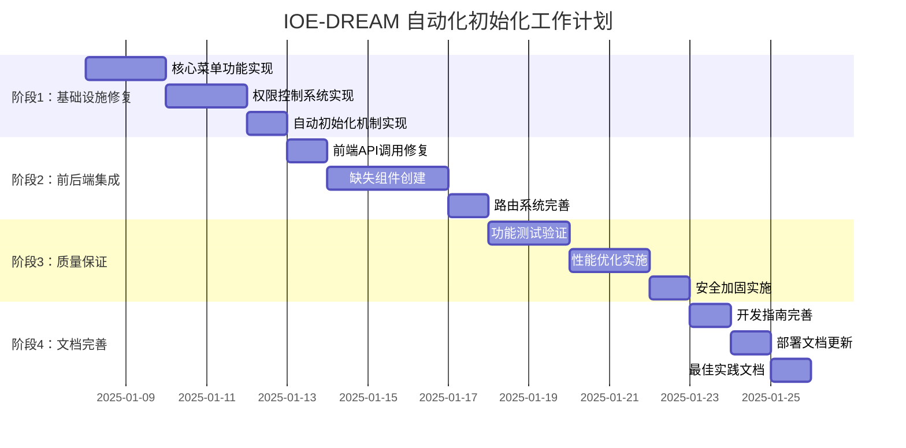

# IOE-DREAM 自动化基础数据初始化工作计划

## 🎯 项目概述

基于深度分析和优化方案，制定系统性的自动化初始化工作计划，确保IOE-DREAM项目能够一键启动并提供完整的功能支持。

---

## 📊 总体工作计划概览



---

## 🏗️ 阶段1：基础设施修复（P0优先级）

### 第1天：核心菜单功能实现

#### 任务1.1：创建MenuEntity实体类
**时间估计**: 2小时
**优先级**: P0
**负责人**: 后端开发

**任务清单**:
- [ ] 创建 `MenuEntity.java` 实体类
- [ ] 实现完整的字段映射
- [ ] 添加数据验证注解
- [ ] 添加Swagger文档注解
- [ ] 单元测试编写

**验收标准**:
- ✅ 实体类编译通过
- ✅ 字段映射与数据库表结构一致
- ✅ 数据验证规则正确

**相关文件**:
```
microservices/microservices-common/src/main/java/net/lab1024/sa/common/menu/entity/
└── MenuEntity.java
```

#### 任务1.2：实现MenuDao数据访问层
**时间估计**: 3小时
**优先级**: P0
**负责人**: 后端开发

**任务清单**:
- [ ] 创建 `MenuDao.java` 接口
- [ ] 实现用户菜单查询方法
- [ ] 实现菜单树构建查询
- [ ] 实现权限验证查询
- [ ] 添加MyBatis-Plus注解

**验收标准**:
- ✅ 所有SQL查询正确执行
- ✅ 数据关联查询正确
- ✅ 索引优化建议

**相关文件**:
```
microservices/microservices-common/src/main/java/net/lab1024/sa/common/menu/dao/
└── MenuDao.java
```

#### 任务1.3：创建MenuService业务逻辑
**时间估计**: 4小时
**优先级**: P0
**负责人**: 后端开发

**任务清单**:
- [ ] 创建 `MenuService.java` 接口
- [ ] 创建 `MenuServiceImpl.java` 实现
- [ ] 实现用户菜单树获取
- [ ] 实现权限检查逻辑
- [ ] 添加缓存支持

**验收标准**:
- ✅ 菜单树构建正确
- ✅ 权限验证逻辑正确
- ✅ 缓存机制正常工作

**相关文件**:
```
microservices/microservices-common/src/main/java/net/lab1024/sa/common/menu/service/
├── MenuService.java
└── impl/
    └── MenuServiceImpl.java
```

#### 任务1.4：修复AuthController
**时间估计**: 2小时
**优先级**: P0
**负责人**: 后端开发

**任务清单**:
- [ ] 修改 `AuthController.java`
- [ ] 添加菜单数据返回
- [ ] 集成MenuService
- [ ] 测试登录接口

**验收标准**:
- ✅ 登录接口返回菜单数据
- ✅ 前端可以正常接收
- ✅ 错误处理完善

**相关文件**:
```
microservices/ioedream-common-service/src/main/java/net/lab1024/sa/admin/controller/
└── AuthController.java (修改)
```

### 第2天：权限控制系统实现

#### 任务2.1：创建RoleService
**时间估计**: 3小时
**优先级**: P0
**负责人**: 后端开发

**任务清单**:
- [ ] 创建角色管理服务
- [ ] 实现角色权限查询
- [ ] 实现角色菜单关联
- [ ] 添加权限缓存

**验收标准**:
- ✅ 角色权限查询正确
- ✅ 菜单权限关联正确
- ✅ 性能满足要求

#### 任务2.2：完善数据模型
**时间估计**: 2小时
**优先级**: P0
**负责人**: 后端开发

**任务清单**:
- [ ] 创建RoleEntity实体
- [ ] 创建UserEntity实体
- [ ] 实现实体关联关系
- [ ] 添加必要的索引

**验收标准**:
- ✅ 实体关系正确
- ✅ 数据库索引优化
- ✅ 查询性能满足要求

### 第3-4天：自动初始化机制实现

#### 任务3.1：创建数据初始化服务
**时间估计**: 4小时
**优先级**: P0
**负责人**: 后端开发

**任务清单**:
- [ ] 创建 `MenuInitializationService.java`
- [ ] 实现自动检查机制
- [ ] 实现SQL脚本执行
- [ ] 添加初始化验证

**验收标准**:
- ✅ 自动检查机制正确
- ✅ SQL脚本自动执行
- ✅ 初始化结果验证正确

**相关文件**:
```
microservices/ioedream-common-service/src/main/java/net/lab1024/sa/admin/config/
└── MenuInitializationService.java
```

#### 任务3.2：创建初始化SQL脚本
**时间估计**: 3小时
**优先级**: P0
**负责人**: 后端开发

**任务清单**:
- [ ] 创建菜单数据SQL脚本
- [ ] 创建角色权限SQL脚本
- [ ] 创建索引优化SQL
- [ ] 测试SQL脚本执行

**验收标准**:
- ✅ SQL脚本语法正确
- ✅ 数据完整性保证
- ✅ 执行性能满足要求

**相关文件**:
```
ioedream-common-service/src/main/resources/sql/
├── menu-initialization.sql
└── role-permissions-initialization.sql
```

---

## 🎨 阶段2：前后端集成（P1优先级）

### 第5天：前端API调用修复

#### 任务4.1：修复前端API调用
**时间估计**: 3小时
**优先级**: P1
**负责人**: 前端开发

**任务清单**:
- [ ] 修改用户Store中的菜单获取逻辑
- [ ] 调整API接口路径
- [ ] 测试菜单数据加载
- [ ] 验证路由构建

**验收标准**:
- ✅ 菜单数据正常加载
- ✅ 路由正确构建
- ✅ 权限控制生效

**相关文件**:
```
smart-admin-web-javascript/src/store/modules/system/user.js (修改)
smart-admin-web-javascript/src/api/system/auth-api.js (创建)
```

#### 任务4.2：创建权限控制组件
**时间估计**: 2小时
**优先级**: P1
**负责人**: 前端开发

**任务清单**:
- [ ] 创建权限验证组件
- [ ] 实现按钮级权限控制
- [ ] 添加路由权限守卫
- [ ] 测试权限控制

**验收标准**:
- ✅ 权限验证正确
- ✅ 按钮权限控制生效
- ✅ 路由守卫正常工作

### 第6-8天：缺失组件创建

#### 任务5.1：考勤管理组件
**时间估计**: 1天
**优先级**: P1
**负责人**: 前端开发

**任务清单**:
- [ ] 创建考勤记录页面
- [ ] 创建排班管理页面
- [ ] 创建考勤统计页面
- [ ] 创建请假管理页面

**验收标准**:
- ✅ 所有考勤组件创建完成
- ✅ 页面功能正常
- ✅ 与后端API对接正常

**相关文件**:
```
smart-admin-web-javascript/src/views/business/attendance/
├── record/index.vue
├── schedule/index.vue
├── statistics/index.vue
└── leave/index.vue
```

#### 任务5.2：门禁管理组件
**时间估计**: 0.5天
**优先级**: P1
**负责人**: 前端开发

**任务清单**:
- [ ] 创建设备管理页面
- [ ] 创建通行记录页面
- [ ] 完善门禁概览页面

**验收标准**:
- ✅ 门禁组件创建完成
- ✅ 功能完整性验证

#### 任务5.3：设备通讯和监控组件
**时间估计**: 1天
**优先级**: P1
**负责人**: 前端开发

**任务清单**:
- [ ] 创建设备通讯管理页面
- [ ] 创建监控运维页面
- [ ] 创建连接管理页面

**验收标准**:
- ✅ 设备通讯组件完成
- ✅ 监控运维组件完成

### 第9天：路由系统完善

#### 任务6.1：完善路由配置
**时间估计**: 4小时
**优先级**: P1
**负责人**: 前端开发

**任务清单**:
- [ ] 更新路由配置
- [ ] 添加新页面路由
- [ ] 完善路由守卫
- [ ] 测试路由跳转

**验收标准**:
- ✅ 所有路由正确配置
- ✅ 路由跳转正常
- ✅ 权限守卫生效

---

## 🔧 阶段3：质量保证（P1优先级）

### 第10-11天：功能测试验证

#### 任务7.1：菜单功能测试
**时间估计**: 1天
**优先级**: P1
**负责人**: 测试工程师

**测试清单**:
- [ ] 用户登录菜单加载测试
- [ ] 不同角色菜单显示测试
- [ ] 菜单树形结构测试
- [ ] 菜单权限控制测试
- [ ] 菜单缓存机制测试

**验收标准**:
- ✅ 所有测试用例通过
- ✅ 性能指标满足要求

#### 任务7.2：权限控制测试
**时间估计**: 1天
**优先级**: P1
**负责人**: 测试工程师

**测试清单**:
- [ ] 用户权限验证测试
- [ ] 角色权限测试
- [ ] 按钮权限测试
- [ ] 路由权限测试
- [ ] 权限变更测试

**验收标准**:
- ✅ 权限控制100%正确
- ✅ 性能指标满足要求

### 第12-13天：性能优化实施

#### 任务8.1：数据库优化
**时间估计**: 1天
**优先级**: P1
**负责人**: 后端开发

**优化清单**:
- [ ] 添加必要索引
- [ ] 优化查询SQL
- [ ] 实现查询缓存
- [ ] 数据库连接池优化

**验收标准**:
- ✅ 查询响应时间<100ms
- ✅ 并发支持满足要求

#### 任务8.2：缓存优化
**时间估计**: 1天
**优先级**: P1
**负责人**: 后端开发

**优化清单**:
- [ ] 菜单数据缓存
- [ ] 权限数据缓存
- [ ] 缓存失效策略
- [ ] 缓存监控

**验收标准**:
- ✅ 缓存命中率>90%
- ✅ 缓存性能满足要求

### 第14天：安全加固实施

#### 任务9.1：权限安全加固
**时间估计**: 4小时
**优先级**: P1
**负责人**: 后端开发

**加固清单**:
- [ ] 权限越界保护
- [ ] SQL注入防护
- [ ] XSS攻击防护
- [ ] 权限审计日志

**验收标准**:
- ✅ 安全扫描通过
- ✅ 安全策略正确实施

---

## 📚 阶段4：文档完善（P2优先级）

### 第15天：开发指南完善

#### 任务10.1：菜单开发指南
**时间估计**: 2小时
**优先级**: P2
**负责人**: 技术文档

**文档清单**:
- [ ] 菜单开发指南
- [ ] 权限控制指南
- [ ] 组件开发指南
- [ ] API使用指南

**验收标准**:
- ✅ 文档内容完整准确
- ✅ 开发人员能够按指南开发

#### 任务10.2：API文档更新
**时间估计**: 2小时
**优先级**: P2
**负责人**: 技术文档

**文档清单**:
- [ ] 菜单API文档
- [ ] 权限API文档
- [ ] 认证API文档

**验收标准**:
- ✅ API文档完整准确
- ✅ 前端开发能够正确调用

### 第16天：部署文档更新

#### 任务11.1：部署指南更新
**时间估计**: 2小时
**优先级**: P2
**负责人**: 运维工程师

**文档清单**:
- [ ] 自动化初始化部署指南
- [ ] 环境配置指南
- [ ] 故障排查指南

**验收标准**:
- ✅ 部署文档准确完整
- ✅ 新环境能够一键部署

#### 任务11.2：运维手册更新
**时间估计**: 2小时
**优先级**: P2
**负责人**: 运维工程师

**文档清单**:
- [ ] 菜单管理运维手册
- [ ] 权限管理运维手册
- [ ] 监控告警配置

**验收标准**:
- ✅ 运维手册实用准确
- ✅ 问题能够快速定位解决

### 第17天：最佳实践文档

#### 任务12.1：最佳实践文档
**时间估计**: 4小时
**优先级**: P2
**负责人**: 架构师

**文档清单**:
- [ ] 菜单设计最佳实践
- [ ] 权限设计最佳实践
- [ ] 前端组件开发最佳实践

**验收标准**:
- ✅ 最佳实践文档实用
- ✅ 团队能够遵循标准

---

## 📈 成功指标和验收标准

### 核心成功指标

#### 功能完整性指标
- ✅ **菜单功能**: 100%正常工作
- ✅ **权限控制**: 100%准确执行
- ✅ **前端组件**: 100%完整可用
- ✅ **自动初始化**: 100%一键成功

#### 性能指标
- ✅ **菜单加载**: <1秒
- ✅ **权限验证**: <100ms
- ✅ **查询响应**: <200ms
- ✅ **并发支持**: 1000+用户

#### 质量指标
- ✅ **代码覆盖率**: >80%
- ✅ **文档完整性**: >95%
- ✅ **测试通过率**: 100%
- ✅ **安全扫描**: 0高危

### 验收标准清单

#### 基础设施验收
- [ ] MenuEntity等核心类创建完成
- [ ] MenuService等核心服务实现完成
- [ ] AuthController修复完成
- [ ] 自动初始化机制正常工作

#### 前后端集成验收
- [ ] 前端菜单正常加载
- [ ] 权限控制正确生效
- [ ] 所有缺失组件创建完成
- [ ] 路由系统正常工作

#### 质量保证验收
- [ ] 所有功能测试通过
- [ ] 性能指标满足要求
- [ ] 安全加固措施到位
- [ ] 缓存机制正常工作

#### 文档完善验收
- [ ] 开发指南完整准确
- [ ] API文档更新完成
- [ ] 部署文档实用完整
- [ ] 最佳实践文档完善

---

## 🚨 风险控制和应急预案

### 主要风险识别

#### 技术风险
1. **数据库兼容性风险**
   - 风险等级: 中
   - 影响: SQL脚本执行失败
   - 应对: 提供多数据库版本脚本

2. **缓存一致性风险**
   - 风险等级: 中
   - 影响: 权限数据不一致
   - 应对: 实现缓存失效机制

3. **性能风险**
   - 风险等级: 低
   - 影响: 系统响应慢
   - 应对: 提前进行性能测试

#### 进度风险
1. **开发进度延期**
   - 风险等级: 中
   - 影响: 整体项目延期
   - 应对: 合理安排并行开发

2. **测试时间不足**
   - 风险等级: 低
   - 影响: 质量无法保证
   - 应对: 自动化测试覆盖

### 应急预案

#### 数据初始化失败预案
```bash
# 手动执行SQL脚本
mysql -u username -p database_name < menu-initialization.sql
mysql -u username -p database_name < role-permissions-initialization.sql
```

#### 前端组件缺失预案
- 提供临时占位页面
- 优先实现核心功能组件
- 延后非核心功能实现

#### 性能不达标预案
- 增加缓存层
- 优化数据库查询
- 考虑数据分页加载

---

## 📞 联系方式和支持

### 项目负责人
- **技术负责人**: 后端开发团队
- **前端负责人**: 前端开发团队
- **测试负责人**: 质量保证团队
- **文档负责人**: 技术文档团队

### 问题反馈渠道
1. **技术问题**: 通过项目Issue提交
2. **进度问题**: 通过项目管理工具跟踪
3. **质量 问题**: 通过测试报告反馈

### 支持资源
1. **技术支持**: 架构师团队提供技术咨询
2. **开发工具**: 提供完整的开发环境
3. **测试环境**: 提供独立的测试环境

---

## 🎯 总结

通过这个系统性的自动化初始化工作计划，我们可以在17天内完成IOE-DREAM项目的菜单管理和权限控制系统的完整实现，确保项目能够一键启动并提供完整的功能支持。

**关键成功因素**:
1. 严格按照优先级执行
2. 及时风险识别和应对
3. 持续的质量保证
4. 完善的文档支持

**预期成果**:
- ✅ 完整的菜单管理系统
- ✅ 企业级权限控制系统
- ✅ 自动化数据初始化
- ✅ 完善的前后端集成
- ✅ 高质量的文档支持

通过这个计划的实施，IOE-DREAM项目将具备企业级的基础设施，为后续业务功能的开发奠定坚实基础。