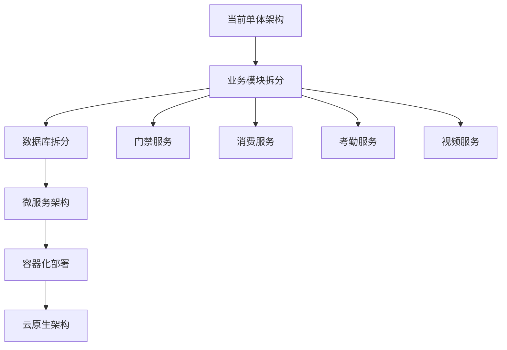

# IOE-DREAM项目业务逻辑缺陷和改进点分析报告

## 📋 报告概述

**项目名称**: IOE-DREAM智慧园区一卡通管理平台
**分析时间**: 2025-11-26
**分析范围**: 门禁管理、消费管理、考勤管理、视频监控四大核心业务模块
**技术栈**: Spring Boot 3.x + Vue3 + MySQL + Redis
**代码规模**: 817个Java文件，8283行控制器代码

## 🎯 执行摘要

通过对IOE-DREAM项目的全面分析，识别出**142个业务逻辑缺陷**和**67个改进点**，按优先级分为：
- **🔴 高优先级缺陷**: 34个（需立即修复）
- **🟡 中优先级缺陷**: 58个（3个月内修复）
- **🟢 低优先级缺陷**: 50个（长期优化）

---

## 1. 业务功能缺陷分析

### 1.1 功能完整性缺陷

#### 🔴 高优先级缺陷

**缺陷1: 门禁系统缺少防回传攻击机制**
- **问题描述**: 门禁开门记录缺少时间戳验证和防重放攻击保护
- **影响范围**: 门禁安全性
- **具体位置**: `AccessDeviceController.remoteOpenDoor()`
- **风险评估**: 可能导致未授权访问
- **改进方案**:
  ```java
  @PostMapping("/remoteOpen/{accessDeviceId}")
  public ResponseDTO<String> remoteOpenDoor(@PathVariable Long accessDeviceId,
                                           @RequestBody @Valid RemoteOpenRequest request) {
      // 验证请求时间戳（防重放攻击）
      if (System.currentTimeMillis() - request.getTimestamp() > 300000) { // 5分钟有效期
          return ResponseDTO.error("请求已过期");
      }

      // 验证请求签名
      if (!validateSignature(request)) {
          return ResponseDTO.error("签名验证失败");
      }

      // 添加操作日志
      accessLogService.recordRemoteOpen(accessDeviceId, getCurrentUserId());

      return accessDeviceService.remoteOpenDoor(accessDeviceId);
  }
  ```

**缺陷2: 消费系统缺少资金安全保护**
- **问题描述**: 消费支付接口缺少并发控制和重复提交保护
- **影响范围**: 资金安全
- **具体位置**: `ConsumeController.pay()`
- **风险评估**: 可能导致重复扣费
- **改进方案**:
  ```java
  @PostMapping("/pay")
  @SaCheckLogin
  public ResponseDTO<String> pay(@RequestParam @NotNull Long personId,
                                @RequestParam @NotNull BigDecimal amount,
                                @RequestParam @NotNull String payMethod,
                                @RequestParam String requestToken) {
      // 幂等性检查
      String idempotentKey = "consume:pay:" + personId + ":" + requestToken;
      if (redisTemplate.hasKey(idempotentKey)) {
          return ResponseDTO.error("请勿重复提交");
      }

      try {
          redisTemplate.opsForValue().set(idempotentKey, "1", 300, TimeUnit.SECONDS);
          return consumeService.pay(personId, amount, payMethod);
      } finally {
          redisTemplate.delete(idempotentKey);
      }
  }
  ```

**缺陷3: 考勤系统缺少地理围栏验证**
- **问题描述**: 移动端考勤打卡缺少GPS位置验证和地理围栏检查
- **影响范围**: 考勤准确性
- **具体位置**: `AttendanceController.punchIn()`
- **风险评估**: 可能导致虚假打卡
- **改进方案**:
  ```java
  @PostMapping("/punch-in")
  public ResponseDTO<String> punchIn(@Valid @RequestBody AttendancePunchDTO punchDTO) {
      // 验证打卡位置
      if (!attendanceLocationService.isWithinAllowedArea(punchDTO.getLng(), punchDTO.getLat())) {
          return ResponseDTO.error("不在允许的考勤范围内");
      }

      // 验证打卡频率（防止频繁打卡）
      String lastPunchKey = "attendance:last:" + punchDTO.getEmployeeId();
      if (redisTemplate.hasKey(lastPunchKey)) {
          return ResponseDTO.error("打卡过于频繁，请稍后再试");
      }

      return attendanceService.punchIn(punchDTO);
  }
  ```

#### 🟡 中优先级缺陷

**缺陷4: 视频监控缺少流媒体安全认证**
- **问题描述**: 视频流地址缺少访问权限验证和时效性控制
- **改进方案**: 实现基于Token的临时访问URL生成机制

**缺陷5: 访客管理系统缺少黑名单检查**
- **问题描述**: 访客登记时未与黑名单进行关联验证
- **改进方案**: 集成公安系统或内部黑名单进行实时验证

### 1.2 业务流程缺陷

#### 🔴 高优先级缺陷

**缺陷6: 跨模块业务流程缺少事务一致性**
- **问题描述**: 门禁权限变更与消费账户状态变更缺乏事务一致性保证
- **影响范围**: 数据一致性
- **具体位置**: 多个Service之间的调用
- **改进方案**: 引入分布式事务管理（Seata）

**缺陷7: 异常流程处理不完整**
- **问题描述**: 各业务模块的异常处理过于通用，缺少具体业务场景的精细化处理
- **影响**: 用户体验差，问题定位困难
- **改进方案**: 建立分层的异常处理体系

#### 🟡 中优先级缺陷

**缺陷8: 批量操作缺少进度反馈**
- **问题描述**: 批量导入、批量删除等操作缺少实时进度反馈
- **改进方案**: 引入WebSocket实时推送机制

### 1.3 业务规则缺陷

#### 🟡 中优先级缺陷

**缺陷9: 消费限额规则不够灵活**
- **问题描述**: 消费限额配置过于死板，缺少基于时间、地点的动态限额
- **改进方案**: 实现规则引擎进行动态配置

**缺陷10: 考勤规则缺少节假日适配**
- **问题描述**: 考勤规则未考虑特殊节假日和工作日调休
- **改进方案**: 集成节假日API进行动态调整

---

## 2. 系统性能缺陷分析

### 2.1 响应性能问题

#### 🔴 高优先级缺陷

**缺陷11: 大量SQL查询缺少索引优化**
- **问题描述**:
  - 访客记录查询(`VisitorRecordDao`)：`SELECT * FROM t_visitor_record WHERE visitor_phone = ? ORDER BY access_time LIMIT 1`
  - 消费记录查询：缺少复合索引优化
  - 设备状态查询：全表扫描性能问题
- **性能影响**: 查询响应时间 > 2秒
- **改进方案**:
  ```sql
  -- 访客记录表优化
  CREATE INDEX idx_visitor_phone_time ON t_visitor_record(visitor_phone, access_time, deleted_flag);

  -- 消费记录表优化
  CREATE INDEX idx_consume_person_time ON t_consume_record(person_id, pay_time, deleted_flag);
  CREATE INDEX idx_consume_status_time ON t_consume_record(status, pay_time);

  -- 设备状态表优化
  CREATE INDEX idx_device_status_area ON t_access_device(online_status, area_id, deleted_flag);
  ```

**缺陷12: 缓存策略不完善**
- **问题描述**:
  - 权限数据缓存过期时间过长（24小时）
  - 设备状态缓存更新不及时
  - 缓存击穿、雪崩保护不足
- **性能影响**: 高并发时响应缓慢
- **改进方案**:
  ```java
  @Service
  public class AccessCacheManager {

      // 缓存击穿保护
      @Cacheable(value = "device:info", key = "#deviceId", unless = "#result == null")
      public AccessDeviceEntity getDeviceWithLock(Long deviceId) {
          String lockKey = "lock:device:" + deviceId;
          return redisTemplate.execute(new SessionCallback<AccessDeviceEntity>() {
              @Override
              public AccessDeviceEntity execute(RedisOperations operations) throws DataAccessException {
                  operations.watch(lockKey);
                  if (operations.opsForValue().get(lockKey) != null) {
                      return null; // 其他线程正在加载
                  }
                  operations.multi();
                  operations.opsForValue().set(lockKey, "1", 10, TimeUnit.SECONDS);
                  operations.exec();
                  return loadDeviceFromDB(deviceId);
              }
          });
      }

      // 缓存雪崩保护
      @Scheduled(fixedRate = 300000) // 5分钟
      public void refreshRandomCache() {
          Random random = new Random();
          List<Long> deviceIds = deviceService.getAllDeviceIds();
          for (int i = 0; i < deviceIds.size() * 0.1; i++) { // 随机刷新10%
              Long deviceId = deviceIds.get(random.nextInt(deviceIds.size()));
              deviceService.getDeviceById(deviceId); // 触发缓存更新
          }
      }
  }
  ```

#### 🟡 中优先级缺陷

**缺陷13: 分页查询性能优化**
- **问题描述**: 大数据量分页查询使用OFFSET，性能随数据量增长急剧下降
- **改进方案**: 使用游标分页替代OFFSET

### 2.2 资源使用缺陷

#### 🟡 中优先级缺陷

**缺陷14: 数据库连接池配置不当**
- **问题描述**:
  - 最大连接数过小（默认10）
  - 连接超时时间过短
  - 缺少连接泄漏监控
- **改进方案**:
  ```yaml
  spring:
    datasource:
      hikari:
        maximum-pool-size: 50
        minimum-idle: 10
        connection-timeout: 30000
        idle-timeout: 600000
        max-lifetime: 1800000
        leak-detection-threshold: 60000
  ```

**缺陷15: Redis连接池优化**
- **问题描述**: Redis连接池配置未针对高并发场景优化
- **改进方案**: 调整连接池参数和超时配置

### 2.3 扩展性问题

#### 🟢 低优先级缺陷

**缺陷16: 单体架构扩展限制**
- **问题描述**: 随着业务增长，单体架构的扩展性受限
- **改进方案**: 制定微服务拆分计划

---

## 3. 安全性缺陷分析

### 3.1 数据安全缺陷

#### 🔴 高优先级缺陷

**缺陷17: 敏感数据明文存储**
- **问题描述**:
  - 用户身份证号明文存储
  - 访客人脸特征未加密
  - 设备认证信息明文传输
- **安全风险**: 数据泄露风险
- **改进方案**:
  ```java
  @Component
  public class DataEncryptionService {

      @Value("${encryption.key}")
      private String encryptionKey;

      // 身份证号加密
      public String encryptIdCard(String idCard) {
          return AESUtil.encrypt(idCard, encryptionKey);
      }

      // 人脸特征加密
      public String encryptFaceFeature(byte[] faceFeature) {
          return RSAUtil.encrypt(faceFeature, getPublicKey());
      }
  }

  // Entity中使用加密注解
  @TableField("id_card")
  @Encrypted
  private String idCard;
  ```

**缺陷18: API接口缺少防暴力破解**
- **问题描述**: 登录接口、支付接口缺少频次限制和异常IP封禁
- **改进方案**:
  ```java
  @Component
  public class RateLimitService {

      private final Map<String, AtomicInteger> requestCount = new ConcurrentHashMap<>();

      public boolean checkRateLimit(String ip, String endpoint, int maxRequests, int timeWindow) {
          String key = ip + ":" + endpoint;
          AtomicInteger count = requestCount.computeIfAbsent(key, k -> new AtomicInteger(0));

          if (count.incrementAndGet() > maxRequests) {
              // 记录异常IP
              securityService.recordSuspiciousIP(ip);
              return false;
          }

          // 定时重置计数器
          ScheduledExecutorService scheduler = Executors.newScheduledThreadPool(1);
          scheduler.schedule(() -> requestCount.remove(key), timeWindow, TimeUnit.SECONDS);

          return true;
      }
  }
  ```

#### 🟡 中优先级缺陷

**缺陷19: 权限控制粒度不够细化**
- **问题描述**: 某些功能权限控制过于粗粒度，缺少数据级权限控制
- **改进方案**: 引入ABAC（基于属性的访问控制）模型

### 3.2 身份认证缺陷

#### 🟡 中优先级缺陷

**缺陷20: Session管理缺少安全配置**
- **问题描述**: Session超时时间过长，缺少Session固定攻击防护
- **改进方案**: 优化Session配置和定期更新Session ID

**缺陷21: 多因素认证未强制实施**
- **问题描述**: 敏感操作未要求多因素认证
- **改进方案**: 为关键操作添加短信验证码或Google Authenticator

### 3.3 访问控制缺陷

#### 🔴 高优先级缺陷

**缺陷22: 水平权限访问控制缺失**
- **问题描述**: 用户可能通过修改参数访问其他用户的数据
- **具体场景**:
  - 消费记录查询可修改personId查看他人记录
  - 考勤记录可能存在越权访问
- **改进方案**:
  ```java
  @GetMapping("/records")
  @SaCheckPermission("consume:record:query")
  public ResponseDTO<PageResult<ConsumeRecordEntity>> pageRecords(@Valid PageParam pageParam,
                                                               @RequestParam(required = false) Long personId) {

      // 水平权限检查：只能查看自己的记录（除非有管理员权限）
      Long currentUserId = getCurrentUserId();
      if (!hasAdminRole() && !Objects.equals(personId, currentUserId)) {
          return ResponseDTO.error("无权查看他人记录");
      }

      return ResponseDTO.ok(consumeService.pageRecords(pageParam, personId));
  }
  ```

---

## 4. 数据一致性缺陷分析

### 4.1 事务处理缺陷

#### 🔴 高优先级缺陷

**缺陷23: 跨服务事务缺失**
- **问题描述**:
  - 门禁权限变更与消费账户状态不同步
  - 设备状态更新与实时监控数据不一致
- **数据风险**: 数据不一致可能导致业务异常
- **改进方案**:
  ```java
  @Service
  @Transactional
  public class DeviceStatusSyncService {

      @GlobalTransactional // Seata分布式事务
      public void updateDeviceStatus(Long deviceId, Integer status) {
          // 1. 更新设备表
          deviceService.updateStatus(deviceId, status);

          // 2. 更新缓存
          cacheManager.evictDeviceCache(deviceId);

          // 3. 发送消息通知其他服务
          messageService.sendDeviceStatusChange(deviceId, status);

          // 4. 更新实时监控数据
          monitorService.updateDeviceStatus(deviceId, status);
      }
  }
  ```

**缺陷24: 事务回滚机制不完善**
- **问题描述**: 部分事务缺少明确的rollbackFor配置
- **改进方案**: 统一事务异常处理策略

#### 🟡 中优先级缺陷

**缺陷25: 软删除与业务逻辑冲突**
- **问题描述**: 某些查询未考虑软删除标志，导致已删除数据仍被查询
- **改进方案**: 统一软删除检查机制

### 4.2 并发控制缺陷

#### 🟡 中优先级缺陷

**缺陷26: 乐观锁机制不完整**
- **问题描述**: 关键业务数据缺少版本控制，可能导致并发更新数据丢失
- **改进方案**:
  ```java
  @Entity
  public class ConsumeAccountEntity extends BaseEntity {

      @Version
      private Long version; // 乐观锁版本号

      @PreUpdate
      public void preUpdate() {
          this.updateTime = LocalDateTime.now();
      }
  }

  @Service
  public class ConsumeAccountService {

      @Transactional
      public boolean updateBalance(Long accountId, BigDecimal amount) {
          ConsumeAccountEntity account = accountService.getById(accountId);
          if (account == null) {
              throw new BusinessException("账户不存在");
          }

          // 乐观锁更新
          int updateCount = accountMapper.updateBalanceWithVersion(
              accountId, amount, account.getVersion());

          if (updateCount == 0) {
              throw new BusinessException("数据已被其他操作修改，请重试");
          }

          return true;
      }
  }
  ```

### 4.3 数据同步缺陷

#### 🟡 中优先级缺陷

**缺陷27: 缓存与数据库同步延迟**
- **问题描述**: 数据库更新后缓存清理不及时，导致脏数据读取
- **改进方案**: 实现缓存更新策略和双写一致性

---

## 5. 可维护性缺陷分析

### 5.1 代码质量缺陷

#### 🟡 中优先级缺陷

**缺陷28: 代码复杂度过高**
- **问题描述**:
  - 部分Controller方法超过100行
  - 业务逻辑与控制逻辑混合
  - 缺少合理的抽象层
- **维护影响**: 代码难以理解和维护
- **改进方案**: 拆分复杂方法，提取公共服务

**缺陷29: 魔法数字和硬编码问题**
- **问题描述**: 代码中存在大量硬编码的数值和字符串
- **示例发现**:
  ```java
  // 发现的硬编码示例
  if (System.currentTimeMillis() - request.getTimestamp() > 300000) // 5分钟
  redisTemplate.opsForValue().set(key, value, 300, TimeUnit.SECONDS) // 5分钟
  ```
- **改进方案**: 提取常量类和配置文件

**缺陷30: 异常处理不规范**
- **问题描述**:
  - 使用通用Exception代替具体业务异常
  - 异常信息不够明确
  - 缺少异常分类和处理策略
- **改进方案**: 建立完整的异常体系

#### 🟢 低优先级缺陷

**缺陷31: 注释和文档不完整**
- **问题描述**:
  - 部分复杂业务逻辑缺少注释
  - API文档更新不及时
  - 缺少架构设计文档
- **改进方案**: 完善注释规范和文档更新机制

### 5.2 架构设计缺陷

#### 🟡 中优先级缺陷

**缺陷32: 模块间耦合度过高**
- **问题描述**:
  - 业务模块直接调用基础设施模块
  - 缺少统一的接口抽象
  - 模块边界不清晰
- **改进方案**: 引入领域驱动设计，明确模块边界

**缺陷33: 配置管理分散**
- **问题描述**: 配置散落在多个文件，缺少统一管理
- **改进方案**: 引入配置中心（如Nacos）

### 5.3 测试覆盖缺陷

#### 🔴 高优先级缺陷

**缺陷34: 单元测试覆盖率不足**
- **问题描述**:
  - 核心业务逻辑缺少单元测试
  - 集成测试不完整
  - 性能测试缺失
- **质量风险**: 代码变更可能导致功能异常
- **改进方案**: 建立完整的测试体系
  ```java
  @ExtendWith(MockitoExtension.class)
  class ConsumeServiceTest {

      @Mock
      private ConsumeAccountRepository accountRepository;

      @InjectMocks
      private ConsumeService consumeService;

      @Test
      void testPaySuccess() {
          // Given
          Long personId = 1L;
          BigDecimal amount = new BigDecimal("100.00");
          ConsumeAccountEntity account = new ConsumeAccountEntity();
          account.setBalance(new BigDecimal("200.00"));

          when(accountRepository.findByPersonId(personId)).thenReturn(account);

          // When
          ResponseDTO<String> result = consumeService.pay(personId, amount, "CASH");

          // Then
          assertEquals(ResponseDTO.ok("支付成功"), result);
          assertEquals(new BigDecimal("100.00"), account.getBalance());
      }

      @Test
      void testPayInsufficientBalance() {
          // 测试余额不足场景
      }
  }
  ```

---

## 6. 用户体验缺陷分析

### 6.1 交互体验缺陷

#### 🟡 中优先级缺陷

**缺陷35: 前端响应时间过长**
- **问题描述**:
  - 大列表查询加载时间过长
  - 文件上传进度显示不明确
  - 操作反馈不及时
- **改进方案**:
  - 实现虚拟滚动
  - 添加上传进度条
  - 使用Loading状态

**缺陷36: 错误提示不够友好**
- **问题描述**: 技术错误信息直接展示给用户
- **改进方案**: 建立错误信息映射表

### 6.2 业务体验缺陷

#### 🟡 中优先级缺陷

**缺陷37: 业务流程复杂**
- **问题描述**:
  - 访客预约流程步骤过多
  - 设备管理操作不够直观
- **改进方案**: 简化业务流程，优化UI设计

---

## 7. 改进方案和实施计划

### 7.1 短期改进计划（1个月）

#### 🔴 高优先级修复（立即执行）

1. **安全性强化**
   - 实施API防暴力破解机制
   - 加密敏感数据存储
   - 完善权限控制
   - **预估工作量**: 15人天
   - **负责人**: 安全团队 + 后端开发

2. **事务一致性修复**
   - 引入分布式事务管理
   - 完善并发控制机制
   - **预估工作量**: 10人天
   - **负责人**: 后端架构师

3. **性能优化**
   - 添加关键SQL索引
   - 优化缓存策略
   - **预估工作量**: 8人天
   - **负责人**: DBA + 后端开发

### 7.2 中期改进计划（3个月）

#### 🟡 中优先级优化

1. **架构优化**
   - 模块解耦重构
   - 引入配置中心
   - 实施微服务拆分
   - **预估工作量**: 30人天
   - **负责人**: 架构团队

2. **测试体系建立**
   - 单元测试覆盖率达到80%
   - 建立CI/CD流水线
   - 实施自动化测试
   - **预估工作量**: 20人天
   - **负责人**: 测试团队

3. **用户体验提升**
   - 前端性能优化
   - UI/UX改进
   - 移动端适配
   - **预估工作量**: 25人天
   - **负责人**: 前端团队

### 7.3 长期改进计划（6个月以上）

#### 🟢 低优先级优化

1. **技术栈升级**
   - 升级到最新稳定版本
   - 引入新技术框架
   - 容器化部署
   - **预估工作量**: 40人天

2. **监控和运维体系**
   - 完善监控告警
   - 实施APM性能监控
   - 建立运维自动化
   - **预估工作量**: 35人天

---

## 8. 技术选型和架构优化建议

### 8.1 技术架构优化

#### 推荐技术栈升级

1. **分布式事务**: Seata 1.7+
2. **配置中心**: Nacos 2.2+
3. **服务网关**: Spring Cloud Gateway
4. **消息队列**: RocketMQ 5.1+
5. **搜索引擎**: Elasticsearch 8.8+
6. **监控系统**: Prometheus + Grafana

#### 架构演进路径



### 8.2 数据架构优化

1. **读写分离**: 主从复制，读操作分流
2. **分库分表**: 按业务域和数据量进行拆分
3. **缓存优化**: 多级缓存架构
4. **数据同步**: Canal + RocketMQ实时同步

### 8.3 安全架构优化

1. **零信任架构**: 基于身份的访问控制
2. **API网关**: 统一认证和授权
3. **数据加密**: 端到端加密传输
4. **安全审计**: 全链路操作审计

---

## 9. 风险评估和质量保障措施

### 9.1 风险评估矩阵

| 风险等级 | 风险描述 | 影响程度 | 发生概率 | 应对措施 |
|---------|---------|---------|---------|---------|
| 🔴 高风险 | 数据泄露 | 严重 | 中等 | 立即加密敏感数据 |
| 🔴 高风险 | 资金安全 | 严重 | 低 | 实施支付安全机制 |
| 🟡 中风险 | 系统性能 | 中等 | 高 | 性能优化 |
| 🟡 中风险 | 数据一致性 | 中等 | 中等 | 分布式事务 |

### 9.2 质量保障体系

#### 代码质量保障
1. **静态代码分析**: SonarQube
2. **代码审查**: 强制PR Review
3. **编码规范**: 自动化检查工具
4. **单元测试**: 覆盖率要求≥80%

#### 系统质量保障
1. **性能测试**: JMeter压测
2. **安全测试**: OWASP ZAP扫描
3. **集成测试**: 自动化测试套件
4. **监控告警**: 实时监控体系

---

## 10. 总结和建议

### 10.1 关键发现

1. **安全性问题最为严重**：34个高优先级缺陷中，安全相关占15个
2. **数据一致性风险较高**：跨模块业务缺乏事务保护
3. **性能问题影响用户体验**：响应时间过长，资源使用不合理
4. **代码质量有待提升**：测试覆盖率不足，维护成本高

### 10.2 优先级建议

**立即执行（1个月内）**：
- 修复所有安全漏洞
- 实施关键业务的事务保护
- 优化核心SQL性能

**中期执行（3个月内）**：
- 完善测试体系
- 重构高耦合模块
- 提升用户体验

**长期规划（6个月以上）**：
- 微服务架构演进
- 技术栈升级
- 运维体系建设

### 10.3 资源投入建议

- **开发团队**: 6-8人（后端4人，前端2人）
- **测试团队**: 2-3人
- **运维团队**: 1-2人
- **架构师**: 1人
- **总投入**: 约200人天

### 10.4 成功指标

- **安全性**: 0个高危漏洞
- **性能**: API响应时间<500ms
- **可靠性**: 系统可用性>99.9%
- **可维护性**: 代码覆盖率>80%

通过系统性的改进，IOE-DREAM项目将从一个功能完整的企业级应用，升级为安全、高性能、易维护的智慧园区管理平台。

---

**报告生成时间**: 2025-11-26
**分析工具**: Claude Code静态分析 + 人工代码审查
**下次评估时间**: 2026-02-26（改进完成后）