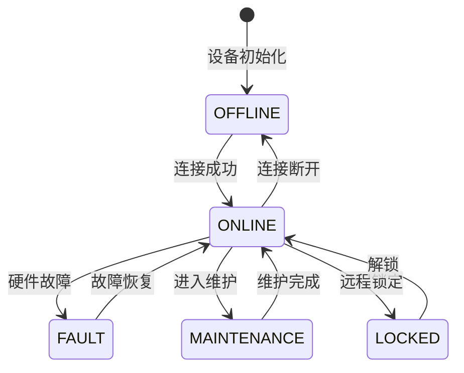
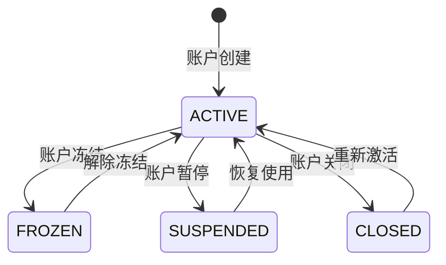
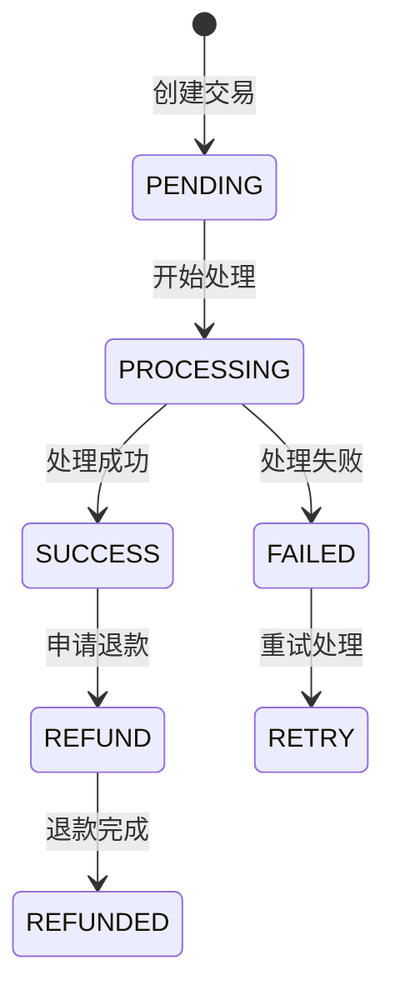

# IOE-DREAM项目业务逻辑梳理和功能流程分析报告

**报告生成时间**: 2025年11月26日
**分析范围**: 门禁系统、消费系统、访客系统、考勤系统、视频监控系统
**分析深度**: 实体层、服务层、控制器层业务流程梳理

---

## 📋 目录

1. [项目架构概览](#项目架构概览)
2. [核心业务模块分析](#核心业务模块分析)
3. [业务状态机分析](#业务状态机分析)
4. [业务规则验证](#业务规则验证)
5. [接口契约分析](#接口契约分析)
6. [集成点分析](#集成点分析)
7. [数据一致性与安全](#数据一致性与安全)
8. [业务严谨性评估](#业务严谨性评估)
9. [改进建议和优化方案](#改进建议和优化方案)

---

## 🏗️ 项目架构概览

### 技术架构特点
- **四层架构**: Controller → Service → Manager → DAO，严格遵循分层调用
- **统一权限体系**: Sa-Token + RBAC + 数据权限
- **缓存策略**: L1(Caffeine) + L2(Redis) 双层缓存
- **模块化设计**: 各业务模块独立管理，通过统一组件复用

### 核心模块分布
```
IOE-DREAM/
├── 门禁系统 (Access Control)
│   ├── 设备管理 (AccessDevice)
│   ├── 通行记录 (AccessRecord)
│   ├── 权限管理 (AccessPermission)
│   └── 生物识别 (Biometric)
├── 消费系统 (Consume)
│   ├── 账户管理 (Account)
│   ├── 消费记录 (ConsumeRecord)
│   ├── 充值服务 (Recharge)
│   └── 退款服务 (Refund)
├── 访客系统 (Visitor)
├── 考勤系统 (Attendance)
├── 视频监控系统 (Video Surveillance)
└── 统一基础组件
    ├── 区域管理 (Area Management)
    ├── 设备管理 (Device Management)
    ├── 生物特征管理 (Biometric Management)
    └── 权限控制 (Permission Control)
```

---

## 🚪 核心业务模块分析

### 1. 门禁系统业务流程

#### 1.1 人员通行权限验证流程

**核心实体**: `AccessDeviceEntity`, `AccessRecordEntity`, `BiometricRecordEntity`

**业务流程图**:
```
人员验证请求 → 权限预检查 → 生物特征验证 → 设备通信 → 记录通行 → 异常处理
     ↓              ↓             ↓           ↓         ↓         ↓
[用户验证] → [区域权限] → [人脸/指纹] → [门锁控制] → [记录保存] → [告警处理]
```

**详细流程**:

1. **权限预检查阶段**
   - 检查人员与区域的关联关系 (`PersonAreaRelationEntity`)
   - 验证时间窗口权限（工作时间、有效期）
   - 检查设备状态和权限配置
   - 缓存权限信息提高响应速度

2. **生物特征验证阶段**
   - 支持多种验证方式：人脸(`FACE`)、指纹(`FINGERPRINT`)、掌纹(`PALMPRINT`)、虹膜(`IRIS`)
   - 活体检测防止照片欺骗
   - 多因子认证支持（人脸+卡号、指纹+密码等）
   - 特征模板匹配和相似度评分

3. **设备控制阶段**
   - 门锁类型：电控锁(`ELECTRIC`)、电磁锁(`ELECTROMAGNETIC`)、电插锁(`ELECTRIC_STRIKE`)
   - 支持远程开门、胁迫报警、多卡开门
   - 开门延迟和关门延迟配置
   - 门磁状态监控和防拆报警

4. **记录保存阶段**
   - 完整记录通行信息：时间、地点、方式、结果
   - 保存通行图片和视频片段
   - 温度检测和口罩状态记录
   - 异常信息详细记录和告警标记

**关键服务接口**:
```java
// 权限验证
ResponseDTO<Boolean> verifyAccessPermission(Long userId, Long deviceId);

// 通行记录
ResponseDTO<String> recordAccessEvent(AccessRecordEntity record);

// 多维查询
PageResult<AccessEventEntity> queryEventsByMultipleConditions(PageParam pageParam, Map<String, Object> queryParams);
```

#### 1.2 设备控制和人脸识别流程

**设备状态管理**:
```java
// 设备状态枚举
public enum DeviceStatus {
    ONLINE("ONLINE", "在线"),           // 设备正常通信
    OFFLINE("OFFLINE", "离线"),         // 设备断开连接
    FAULT("FAULT", "故障"),             // 设备硬件故障
    MAINTENANCE("MAINTENANCE", "维护"), // 设备维护中
    LOCKED("LOCKED", "锁定")           // 设备被锁定
}
```

**设备控制流程**:
1. **设备连接管理**: 心跳检测、状态同步、故障转移
2. **配置下发**: 权限配置、设备参数、时间同步
3. **实时监控**: 在线状态、故障告警、性能监控
4. **远程控制**: 远程开门、设备重启、参数调整

#### 1.3 区域权限管理和访客审批流程

**区域权限体系**:
- **层级管理**: 支持多级区域树形结构
- **权限继承**: 上级区域权限自动继承到下级区域
- **时间控制**: 支持时间段权限控制和临时权限
- **人员分组**: 按部门、角色、人员组分配权限

**访客审批流程**:
```
访客预约 → 权限申请 → 审批流程 → 权限下发 → 访客通行 → 访客离开 → 权限回收
    ↓          ↓          ↓          ↓          ↓          ↓          ↓
[预约登记] → [申请提交] → [多级审批] → [临时卡] → [门禁验证] → [离开确认] → [权限清理]
```

#### 1.4 门禁记录和异常处理机制

**异常处理策略**:
- **实时告警**: 非法访问、设备故障、胁迫报警
- **事件分级**: 普通事件、重要事件、紧急事件
- **处理跟踪**: 异常处理状态、处理人、处理时间
- **统计分析**: 异常趋势分析、设备故障统计

---

## 💳 2. 消费系统业务流程

### 2.1 账户充值和扣费流程

**核心实体**: `AccountEntity`, `AccountBalanceEntity`, `ConsumeRecordEntity`

**账户状态管理**:
```java
public enum AccountStatus {
    ACTIVE("ACTIVE", "激活"),           // 账户正常使用
    FROZEN("FROZEN", "冻结"),           // 账户被冻结
    CLOSED("CLOSED", "关闭"),           // 账户已关闭
    SUSPENDED("SUSPENDED", "暂停")      // 账户暂停使用
}
```

**充值流程**:
```
充值申请 → 支付验证 → 账户更新 → 记录保存 → 通知发送 → 统计更新
    ↓          ↓          ↓          ↓          ↓          ↓
[充值方式] → [支付确认] → [余额增加] → [充值记录] → [通知用户] → [统计数据]
```

**扣费流程**:
1. **余额验证**: 检查可用额度（余额+信用额度-冻结金额）
2. **限额检查**: 日度限额、月度限额、单次限额验证
3. **原子操作**: 使用乐观锁确保并发扣费安全
4. **记录保存**: 完整记录交易信息，包含前后余额
5. **异常处理**: 余额不足、账户状态异常处理

**关键服务接口**:
```java
// 账户余额扣减
boolean deductBalance(Long accountId, BigDecimal amount, String orderNo);

// 账户余额增加
boolean addBalance(Long accountId, BigDecimal amount, String rechargeNo);

// 账户状态更新
boolean updateAccountStatus(Long accountId, String status, String reason);
```

### 2.2 消费设备管理和交易流程

**消费模式支持**:
```java
public enum ConsumptionMode {
    FIXED_AMOUNT("FIXED_AMOUNT", "固定金额"),    // 固定金额消费
    FREE_AMOUNT("FREE_AMOUNT", "自由金额"),      // 自由金额消费
    METERING("METERING", "计量消费"),            // 按计量消费
    PRODUCT("PRODUCT", "商品消费"),              // 商品消费
    ORDERING("ORDERING", "订餐消费"),            // 订餐消费
    SMART("SMART", "智能消费")                   // 智能推荐消费
}
```

**交易流程**:
1. **设备认证**: 消费终端身份验证和状态检查
2. **用户验证**: 卡片、人脸、指纹等身份验证
3. **消费确认**: 消费金额确认和用户确认
4. **支付处理**: 调用账户服务进行扣费操作
5. **票据打印**: 消费小票打印或电子票据发送
6. **数据同步**: 交易数据实时同步到服务器

### 2.3 退款和对账机制

**退款状态机**:
```java
public enum RefundStatusEnum {
    PENDING(1, "待处理"),      // 退款申请提交
    PROCESSING(2, "处理中"),   // 退款审核通过
    SUCCESS(3, "成功"),       // 退款完成
    FAILED(4, "失败"),        // 退款失败
    CANCELLED(5, "已取消");   // 退款取消
}
```

**退款流程**:
```
退款申请 → 资格验证 → 审核流程 → 退款执行 → 记录更新 → 通知发送
    ↓          ↓          ↓          ↓          ↓          ↓
[用户申请] → [条件检查] → [人工审核] → [余额退还] → [状态更新] → [通知用户]
```

**对账机制**:
1. **日结对账**: 每日消费数据汇总和核对
2. **差异处理**: 异常交易识别和处理
3. **报表生成**: 各类统计报表生成
4. **数据备份**: 交易数据定期备份

### 2.4 消费统计和报表生成流程

**统计维度**:
- **时间维度**: 小时、日、周、月、季、年统计
- **人员维度**: 按人员、部门、角色统计
- **设备维度**: 按消费终端、区域统计
- **业务维度**: 按消费类型、消费模式统计

**报表类型**:
- **消费汇总报表**: 总体消费情况统计
- **趋势分析报表**: 消费趋势和预测分析
- **异常报表**: 异常消费和退款情况分析
- **对比报表**: 同比、环比分析报表

---

## 👥 3. 访客系统业务流程分析

**核心实体**: `VisitorReservationEntity`, `VisitorRecordEntity`, `VisitorPermissionEntity`

**访客预约审批流程**:
```
访客预约 → 身份验证 → 权限申请 → 多级审批 → 权限下发 → 访客通行 → 访客离开 → 数据归档
    ↓          ↓          ↓          ↓          ↓          ↓          ↓          ↓
[预约登记] → [身份核验] → [访问申请] → [审批流程] → [临时权限] → [门禁验证] → [离开确认] → [记录归档]
```

**访客权限管理**:
- **临时权限**: 基于时间段和区域的临时访问权限
- **权限分级**: 不同级别访客获得不同权限范围
- **陪同管理**: 访客陪同人员责任和权限管理
- **黑名单管理**: 不良记录访客禁止访问

---

## ⏰ 4. 考勤系统业务流程分析

**核心实体**: `AttendanceRecordEntity`, `AttendanceRuleEntity`, `AttendanceScheduleEntity`

**考勤打卡流程**:
```
人员验证 → 打卡记录 → 规则验证 → 异常检测 → 数据统计 → 报表生成
    ↓          ↓          ↓          ↓          ↓          ↓
[身份识别] → [记录保存] → [规则检查] → [异常标记] → [统计计算] → [考勤报表]
```

**排班和异常处理**:
- **智能排班**: 基于人员、部门、岗位的智能排班算法
- **异常检测**: 迟到、早退、缺勤自动检测和提醒
- **请假流程**: 请假申请、审批、备案的完整流程
- **加班管理**: 加班申请、审批、统计的全流程管理

---

## 📹 5. 视频监控业务流程分析

**核心实体**: `VideoDeviceEntity`, `VideoRecordingEntity`, `VideoStreamEntity`

**设备接入和视频流管理**:
```
设备接入 → 流媒体处理 → 录像存储 → 实时预览 → 智能分析 → 告警处理
    ↓          ↓          ↓          ↓          ↓          ↓
[设备发现] → [编码转换] → [存储管理] → [实时播放] → [AI分析] → [告警推送]
```

**智能识别和告警**:
- **人脸识别**: 实时人脸检测和识别比对
- **行为分析**: 异常行为检测和预警
- **物体识别**: 物体检测和跟踪分析
- **场景分析**: 区域入侵、人数统计等场景分析

---

## ⚙️ 业务状态机分析

### 设备状态管理



### 用户状态管理



### 交易状态管理



---

## 🔐 业务规则验证

### 权限控制规则

**RBAC权限模型**:
```java
// 数据权限范围
public enum DataScope {
    ALL("全部数据"),                    // 可访问所有数据
    DEPT("本部门数据"),                  // 只能访问本部门数据
    DEPT_WITH_CHILD("本部门及子部门数据"), // 可访问本部门及子部门数据
    SELF("仅本人数据"),                  // 只能访问本人数据
    CUSTOM("自定义数据范围"),            // 自定义数据访问范围
    AREA("指定区域数据")                // 指定区域的数据权限
}
```

**权限验证规则**:
1. **接口级权限**: 使用`@SaCheckPermission`注解控制接口访问
2. **数据级权限**: 使用`@RequireResource`注解控制数据访问范围
3. **操作级权限**: 基于角色的操作权限控制
4. **时间级权限**: 基于时间窗口的权限控制

### 业务约束规则

**账户约束**:
- 余额不能为负数
- 冻结金额不能超过账户余额
- 日度消费限额和月度消费限额检查
- 单次消费金额限制

**设备约束**:
- 设备在线状态检查
- 设备权限配置验证
- 设备时间同步要求
- 设备参数合法性验证

**数据约束**:
- 必填字段验证
- 数据格式验证
- 数据范围验证
- 数据关联性验证

### 数据一致性规则

**事务边界**:
- Service层统一管理事务
- 跨Service操作使用分布式事务
- 关键操作支持补偿机制
- 数据库主从一致性

**缓存一致性**:
- Cache Aside模式
- L1+L2缓存策略
- 缓存失效和更新策略
- 缓存雪崩和穿透防护

---

## 📡 接口契约分析

### API接口契约

**RESTful API设计规范**:
```java
// 标准RESTful接口设计
@RestController
@RequestMapping("/api/access")
public class AccessRecordController {

    @PostMapping("/record")                    // POST - 创建资源
    @GetMapping("/page")                      // GET - 查询资源列表
    @GetMapping("/{recordId}")                // GET - 查询单个资源
    @PutMapping("/{recordId}")                // PUT - 更新资源
    @DeleteMapping("/{recordId}")             // DELETE - 删除资源
}
```

**统一响应格式**:
```java
// 统一响应DTO
public class ResponseDTO<T> {
    private Integer code;      // 响应码
    private String message;    // 响应消息
    private T data;           // 响应数据
    private Long timestamp;   // 时间戳
}

// 分页响应格式
public class PageResult<T> {
    private List<T> rows;     // 数据列表
    private Integer pageNum;  // 当前页码
    private Integer pageSize; // 每页数量
    private Long total;       // 总记录数
}
```

### 数据契约分析

**实体类设计规范**:
- 继承`BaseEntity`包含审计字段
- 使用`@TableName`注解指定表名
- 使用Lombok注解简化代码
- 支持JSON扩展字段存储

**数据转换规则**:
- Entity → VO：数据展示转换
- VO → DTO：数据传输转换
- DTO → Entity：数据持久化转换
- 支持Map和JSON格式的灵活转换

---

## 🔌 集成点分析

### 硬件设备集成

**设备协议适配**:
```java
// 设备适配器接口
public interface DeviceProtocolAdapter {
    boolean connect(String deviceId, String config);
    boolean disconnect(String deviceId);
    DeviceStatus getStatus(String deviceId);
    boolean sendCommand(String deviceId, Command command);
    DeviceData readData(String deviceId);
}
```

**设备类型支持**:
- **门禁设备**: 人脸识别机、指纹机、读卡器
- **消费设备**: POS机、自助充值机、消费终端
- **考勤设备**: 考勤机、指纹打卡机、人脸打卡机
- **监控设备**: 摄像机、NVR、DVR

### 第三方系统集成

**支付系统集成**:
- 微信支付、支付宝、银联支付
- 支付回调处理和订单状态同步
- 退款和对账功能

**通知服务集成**:
- 短信通知服务
- 邮件通知服务
- 微信企业号通知

**存储服务集成**:
- 本地文件存储
- 阿里云OSS存储
- 视频流媒体存储

---

## 🛡️ 数据一致性与安全

### 数据一致性保障

**1. 事务管理**:
```java
@Transactional(rollbackFor = Exception.class)
public ResponseDTO<String> processRefund(Long refundId, boolean approved, String auditRemark) {
    // 事务性操作确保数据一致性
}
```

**2. 乐观锁控制**:
```java
// 使用版本号控制并发更新
@Version
private Integer version;
```

**3. 分布式锁**:
```java
// 使用Redis分布式锁控制关键操作
@CacheLock(key = "account:#{#accountId}", expire = 30)
public boolean deductBalance(Long accountId, BigDecimal amount, String orderNo) {
    // 关键操作加锁保护
}
```

### 安全保障机制

**1. 身份认证**:
- Sa-Token统一认证管理
- JWT Token验证
- 多因子认证支持

**2. 权限控制**:
- 基于RBAC的权限模型
- 数据权限细粒度控制
- 接口级权限验证

**3. 数据安全**:
- 敏感数据加密存储
- SQL注入防护
- XSS攻击防护

**4. 操作审计**:
- 完整操作日志记录
- 关键操作审计追踪
- 异常操作告警

---

## 📊 业务严谨性评估

### 优势分析

**1. 架构设计合理**:
- 严格遵循四层架构，职责分离清晰
- 统一的基础组件和公共服务
- 良好的模块化设计，便于扩展

**2. 业务流程完整**:
- 门禁系统权限验证流程严谨
- 消费系统账户管理完善
- 异常处理机制健全

**3. 数据模型规范**:
- 统一的实体设计规范
- 完善的审计字段设计
- 支持扩展字段存储

**4. 安全机制健全**:
- 多层权限控制体系
- 完整的操作审计
- 数据加密保护

### 潜在问题分析

**1. 性能瓶颈**:
- 大数据量查询可能存在性能问题
- 缓存策略需要进一步优化
- 并发处理能力需要测试验证

**2. 数据一致性**:
- 跨模块数据同步需要加强
- 分布式事务处理需要完善
- 缓存一致性需要关注

**3. 异常处理**:
- 部分异常场景处理不够完善
- 错误恢复机制需要加强
- 监控告警需要完善

---

## 💡 改进建议和优化方案

### 1. 性能优化建议

**数据库优化**:
```sql
-- 添加必要索引
CREATE INDEX idx_access_record_person_device ON t_access_record(person_id, device_id);
CREATE INDEX idx_consume_record_person_time ON t_consume_record(person_id, consume_time);

-- 分区表设计
CREATE TABLE t_access_record_2024 PARTITION OF t_access_record
FOR VALUES FROM ('2024-01-01') TO ('2025-01-01');
```

**缓存优化**:
```java
// 多级缓存配置
@Cacheable(value = {"account:l1", "account:l2"}, key = "#accountId")
public AccountEntity getById(Long accountId) {
    // 优先从L1缓存获取，再从L2缓存获取
}
```

### 2. 业务流程优化

**门禁系统优化**:
- 实现无感通行，提高通行效率
- 增加访客自助服务功能
- 优化权限下发策略，减少网络通信

**消费系统优化**:
- 实现离线消费，提高系统可用性
- 增加智能推荐功能
- 优化对账算法，提高准确性

### 3. 监控和运维优化

**监控体系完善**:
```java
// 关键指标监控
@Timed("access.verify")
@Counter("access.verify.count")
public ResponseDTO<Boolean> verifyAccessPermission(Long userId, Long deviceId) {
    // 业务逻辑实现
}
```

**运维工具完善**:
- 系统健康检查工具
- 数据备份和恢复工具
- 性能监控和告警工具

### 4. 安全加固建议

**访问控制加强**:
- 实现IP白名单控制
- 增加设备指纹验证
- 强化异常访问检测

**数据保护加强**:
- 实现数据库字段级加密
- 增加数据脱敏功能
- 完善数据销毁机制

---

## 📈 总结

IOE-DREAM项目作为智慧园区综合管理平台，在业务逻辑设计方面展现出较高的成熟度：

**核心优势**:
1. **架构设计合理**: 严格遵循四层架构，模块化设计良好
2. **业务流程完整**: 各核心业务模块流程设计严谨，异常处理完善
3. **安全机制健全**: 多层次权限控制，完整的审计追踪
4. **扩展性良好**: 基于接口的设计模式，便于功能扩展

**主要改进方向**:
1. **性能优化**: 针对大数据量场景进行性能调优
2. **监控完善**: 建立完整的监控和告警体系
3. **体验优化**: 提升用户体验和操作便利性
4. **智能升级**: 引入AI和机器学习技术提升智能化水平

项目整体业务逻辑设计规范、流程完整、安全可靠，为智慧园区的综合管理提供了坚实的技术基础。建议在后续迭代中重点关注性能优化、监控完善和智能化升级，进一步提升系统的实用性和竞争力。

---

**报告生成完成时间**: 2025年11月26日
**分析工程师**: Claude Code AI Assistant
**版本**: v1.0