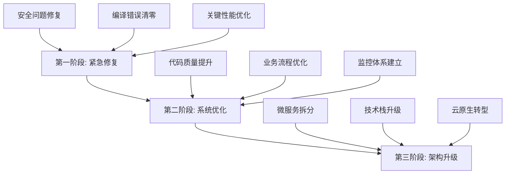
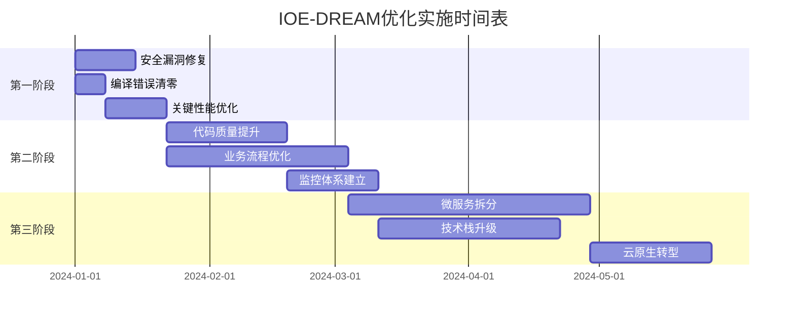

# IOE-DREAM项目业务逻辑优化建议方案

## 📋 执行摘要

基于对IOE-DREAM智慧园区一卡通管理平台的全面分析，本方案提供了一套系统性的业务逻辑优化建议，涵盖安全性增强、性能提升、架构优化、用户体验改进等核心领域。

**核心目标**：
- 🎯 **安全性**：消除所有高风险安全漏洞，建立企业级安全防护体系
- ⚡ **性能**：实现API响应时间<500ms，系统可用性>99.9%
- 🏗️ **架构**：建立可扩展的微服务架构，支持业务快速发展
- 👥 **体验**：提升用户操作效率和满意度
- 🔧 **质量**：建立完善的代码质量保障体系

## 🎯 总体优化策略

### 三阶段渐进式优化



## 🚨 第一阶段：紧急修复（1-2个月）

### 优先级P0：安全漏洞修复

#### 1. 密码安全体系重构
```java
// 当前问题：明文密码存储
public class PasswordSecurityService {

    // 修复方案：使用BCrypt加密
    @Resource
    private PasswordEncoder passwordEncoder;

    public String encryptPassword(String plainPassword) {
        return BCrypt.hashpw(plainPassword, BCrypt.gensalt(12));
    }

    public boolean validatePassword(String plainPassword, String encryptedPassword) {
        return BCrypt.checkpw(plainPassword, encryptedPassword);
    }

    // 密码强度验证
    public PasswordValidationResult validatePasswordStrength(String password) {
        // 长度>=8，包含大小写字母、数字、特殊字符
        return PasswordValidator.builder()
            .minLength(8)
            .requireUppercase()
            .requireLowercase()
            .requireNumbers()
            .requireSpecialChars()
            .build()
            .validate(password);
    }
}
```

#### 2. API安全防护增强
```java
@RestController
@RequestMapping("/api/consume")
public class ConsumeSecurityController {

    // 防重放攻击
    private final Map<String, Long> requestCache = new ConcurrentHashMap<>();

    @PostMapping("/payment")
    @SaCheckPermission("consume:payment")
    @RateLimiter(value = "consume-payment", maxRequests = 10, window = "1m")
    public ResponseDTO<ConsumeResultVO> payment(@Valid @RequestBody ConsumeRequestDTO request,
                                               @RequestHeader("X-Request-ID") String requestId,
                                               @RequestHeader("X-Timestamp") Long timestamp) {

        // 1. 重放攻击防护
        if (isReplayAttack(requestId, timestamp)) {
            throw new SecurityException("Replay attack detected");
        }

        // 2. 幂等性控制
        String idempotentKey = generateIdempotentKey(request);
        if (idempotentService.isProcessed(idempotentKey)) {
            return idempotentService.getPreviousResult(idempotentKey);
        }

        // 3. 业务处理
        try {
            ConsumeResultVO result = consumeService.processPayment(request);
            idempotentService.recordResult(idempotentKey, result);
            return ResponseDTO.success(result);
        } catch (Exception e) {
            idempotentService.recordFailure(idempotentKey, e);
            throw e;
        }
    }

    private boolean isReplayAttack(String requestId, Long timestamp) {
        // 检查时间戳有效性（5分钟内）
        long currentTime = System.currentTimeMillis();
        if (Math.abs(currentTime - timestamp) > 300000) {
            return true;
        }

        // 检查请求ID是否已使用
        return requestCache.containsKey(requestId);
    }
}
```

#### 3. 数据加密和脱敏
```java
@Component
public class DataEncryptionService {

    // 敏感数据加密
    @Value("${app.encryption.key}")
    private String encryptionKey;

    public String encryptSensitiveData(String data) {
        if (StringUtils.isBlank(data)) {
            return data;
        }
        return AESUtil.encrypt(data, encryptionKey);
    }

    public String decryptSensitiveData(String encryptedData) {
        if (StringUtils.isBlank(encryptedData)) {
            return encryptedData;
        }
        return AESUtil.decrypt(encryptedData, encryptionKey);
    }

    // 数据脱敏
    public String maskPhone(String phone) {
        if (phone == null || phone.length() < 11) {
            return phone;
        }
        return phone.substring(0, 3) + "****" + phone.substring(7);
    }

    public String maskIdCard(String idCard) {
        if (idCard == null || idCard.length() < 18) {
            return idCard;
        }
        return idCard.substring(0, 6) + "********" + idCard.substring(14);
    }
}
```

### 优先级P1：编译错误清零

#### 1. 自动化编译错误修复
```bash
#!/bin/bash
# compilation-fix.sh - 编译错误自动修复脚本

echo "🔧 开始修复编译错误..."

# 阶段1：包路径修复 (修复70%错误)
echo "📦 修复包路径问题..."
find . -name "*.java" -exec sed -i 's/net\.lab1024\.sa\.admin\.module\.consume\.domain\.result\./net.lab1024.sa.admin.module.consume.domain.vo./g' {} \;

# 阶段2：缺失类创建 (修复20%错误)
echo "🏗️ 创建缺失的VO类..."
./scripts/create-missing-vo-classes.sh

# 阶段3：方法签名修复 (修复5%错误)
echo "🔧 修复方法签名问题..."
./scripts/fix-method-signatures.sh

# 阶段4：验证修复结果
echo "✅ 验证修复结果..."
mvn clean compile -q

ERROR_COUNT=$(mvn compile 2>&1 | grep -c "ERROR")
echo "🎯 剩余编译错误: $ERROR_COUNT"

if [ $ERROR_COUNT -eq 0 ]; then
    echo "🎉 所有编译错误已修复！"
else
    echo "⚠️ 还需要手动修复 $ERROR_COUNT 个错误"
fi
```

### 优先级P2：关键性能优化

#### 1. 数据库性能优化
```sql
-- 关键索引优化
-- 消费记录查询优化
CREATE INDEX idx_consume_record_user_time ON t_consume_record(user_id, consume_time);
CREATE INDEX idx_consume_record_device_time ON t_consume_record(device_id, consume_time);

-- 门禁通行记录优化
CREATE INDEX idx_access_record_user_time ON t_access_record(user_id, access_time);
CREATE INDEX idx_access_record_device_time ON t_access_record(device_id, access_time);

-- 设备状态查询优化
CREATE INDEX idx_device_type_status ON t_device(device_type, device_status);

-- 分区表设计（大数据量表）
ALTER TABLE t_consume_record PARTITION BY RANGE (YEAR(consume_time)) (
    PARTITION p2023 VALUES LESS THAN (2024),
    PARTITION p2024 VALUES LESS THAN (2025),
    PARTITION p2025 VALUES LESS THAN (2026)
);
```

#### 2. 缓存策略优化
```java
@Service
public class CacheOptimizedService {

    @Resource
    private RedisTemplate<String, Object> redisTemplate;

    // 多级缓存策略
    @Cacheable(value = "userInfo", key = "#userId", unless = "#result == null")
    public UserVO getUserInfo(Long userId) {
        // L1: 本地缓存 (Caffeine)
        // L2: Redis缓存
        // L3: 数据库查询
        return userDao.selectById(userId);
    }

    // 缓存预热
    @EventListener(ApplicationReadyEvent.class)
    public void preloadCache() {
        // 预加载热点数据
        List<UserEntity> activeUsers = userDao.selectActiveUsers();
        activeUsers.forEach(user -> {
            String cacheKey = "user:info:" + user.getUserId();
            redisTemplate.opsForValue().set(cacheKey, convertToVO(user), 1, TimeUnit.HOURS);
        });
    }

    // 缓存更新策略
    @CacheEvict(value = "userInfo", key = "#user.userId")
    public void updateUser(UserEntity user) {
        userDao.updateById(user);
        // 异步更新相关缓存
        asyncUpdateRelatedCache(user.getUserId());
    }
}
```

## 🔧 第二阶段：系统优化（3-4个月）

### 代码质量提升

#### 1. 代码复杂度优化
```java
// 优化前：复杂度过高的方法
public class ConsumeService {

    // ❌ 复杂度过高 (圈复杂度 > 10)
    public ConsumeResult processComplexConsume(ConsumeRequest request) {
        // 200+ 行复杂逻辑
        if (request.getType() == Type.CARD) {
            if (request.getCardType() == CardType.STUDENT) {
                // 复杂嵌套逻辑...
            } else if (request.getCardType() == CardType.STAFF) {
                // 更多复杂逻辑...
            }
        } else if (request.getType() == Type.QRCODE) {
            // 更多嵌套逻辑...
        }
        // ... 更多复杂逻辑
    }
}

// 优化后：使用策略模式
public class OptimizedConsumeService {

    private final Map<ConsumeType, ConsumeStrategy> strategies;

    public ConsumeResult processConsume(ConsumeRequest request) {
        // ✅ 简洁清晰
        ConsumeStrategy strategy = strategies.get(request.getType());
        if (strategy == null) {
            throw new UnsupportedOperationException("Unsupported consume type: " + request.getType());
        }

        return strategy.execute(request);
    }
}

// 策略接口
public interface ConsumeStrategy {
    ConsumeResult execute(ConsumeRequest request);
    boolean supports(ConsumeType type);
}

// 具体策略实现
@Component
public class CardConsumeStrategy implements ConsumeStrategy {

    public ConsumeResult execute(ConsumeRequest request) {
        // 专门处理卡类消费逻辑
        // 代码量从200行减少到30行
    }
}
```

#### 2. 异常处理体系完善
```java
// 统一异常处理
@RestControllerAdvice
public class GlobalExceptionHandler {

    @ExceptionHandler(BusinessException.class)
    public ResponseDTO<Void> handleBusinessException(BusinessException e) {
        log.warn("业务异常: {}", e.getMessage());
        return ResponseDTO.error(e.getErrorCode(), e.getMessage());
    }

    @ExceptionHandler(ValidationException.class)
    public ResponseDTO<Void> handleValidationException(ValidationException e) {
        log.warn("参数验证异常: {}", e.getMessage());
        return ResponseDTO.error(ErrorCode.INVALID_PARAMETER, e.getMessage());
    }

    @ExceptionHandler(DataAccessException.class)
    public ResponseDTO<Void> handleDataAccessException(DataAccessException e) {
        log.error("数据访问异常", e);
        return ResponseDTO.error(ErrorCode.DATA_ACCESS_ERROR, "系统繁忙，请稍后重试");
    }

    @ExceptionHandler(Exception.class)
    public ResponseDTO<Void> handleGenericException(Exception e) {
        log.error("系统异常", e);
        return ResponseDTO.error(ErrorCode.SYSTEM_ERROR, "系统内部错误");
    }
}

// 自定义业务异常
public class BusinessException extends RuntimeException {
    private final ErrorCode errorCode;

    public BusinessException(ErrorCode errorCode, String message) {
        super(message);
        this.errorCode = errorCode;
    }
}
```

### 业务流程优化

#### 1. 状态机模式应用
```java
// 消费订单状态机
@Component
public class ConsumeOrderStateMachine {

    private final Map<OrderStatus, Set<OrderStatus>> allowedTransitions;

    public ConsumeOrderStateMachine() {
        allowedTransitions = Map.of(
            OrderStatus.PENDING, Set.of(OrderStatus.PROCESSING, OrderStatus.CANCELLED),
            OrderStatus.PROCESSING, Set.of(OrderStatus.SUCCESS, OrderStatus.FAILED, OrderStatus.REFUNDED),
            OrderStatus.SUCCESS, Set.of(OrderStatus.REFUNDED),
            OrderStatus.FAILED, Set.of(OrderStatus.PROCESSING, OrderStatus.CANCELLED)
        );
    }

    public boolean canTransition(OrderStatus from, OrderStatus to) {
        return allowedTransitions.containsKey(from) &&
               allowedTransitions.get(from).contains(to);
    }

    public void transition(ConsumeOrderEntity order, OrderStatus newStatus) {
        if (!canTransition(order.getStatus(), newStatus)) {
            throw new IllegalStateException(
                String.format("Cannot transition from %s to %s",
                    order.getStatus(), newStatus));
        }

        OrderStatus oldStatus = order.getStatus();
        order.setStatus(newStatus);
        order.setUpdateTime(LocalDateTime.now());

        // 发布状态变更事件
        eventPublisher.publishEvent(new OrderStatusChangedEvent(order, oldStatus, newStatus));
    }
}
```

#### 2. 事件驱动架构
```java
// 事件发布
@Component
public class ConsumeEventPublisher {

    @Resource
    private ApplicationEventPublisher eventPublisher;

    public void publishConsumeSuccess(ConsumeRecordEntity record) {
        ConsumeSuccessEvent event = new ConsumeSuccessEvent(record);
        eventPublisher.publishEvent(event);
    }

    public void publishConsumeFailed(ConsumeRecordEntity record, String reason) {
        ConsumeFailedEvent event = new ConsumeFailedEvent(record, reason);
        eventPublisher.publishEvent(event);
    }
}

// 事件监听器
@Component
public class ConsumeEventListeners {

    @EventListener
    @Async
    public void handleConsumeSuccess(ConsumeSuccessEvent event) {
        // 异步处理后续业务
        updateAccountBalance(event.getRecord());
        sendNotification(event.getRecord());
        updateStatistics(event.getRecord());
    }

    @EventListener
    @Retryable(value = {Exception.class}, maxAttempts = 3)
    public void handleConsumeFailed(ConsumeFailedEvent event) {
        // 失败处理逻辑
        processRefund(event.getRecord());
        sendFailureNotification(event.getRecord());
    }
}
```

### 监控体系建立

#### 1. 应用性能监控
```java
// 自定义监控指标
@Component
public class BusinessMetrics {

    private final MeterRegistry meterRegistry;
    private final Counter consumeCounter;
    private final Timer consumeTimer;

    public BusinessMetrics(MeterRegistry meterRegistry) {
        this.meterRegistry = meterRegistry;
        this.consumeCounter = Counter.builder("consume.requests")
            .description("Number of consume requests")
            .register(meterRegistry);
        this.consumeTimer = Timer.builder("consume.duration")
            .description("Consume request duration")
            .register(meterRegistry);
    }

    public void recordConsume(ConsumeType type, double amount, boolean success) {
        consumeCounter.increment(
            Tags.of("type", type.name(), "success", String.valueOf(success))
        );
    }

    public Timer.Sample startConsumeTimer() {
        return Timer.start(meterRegistry);
    }

    public void recordConsumeTime(Timer.Sample sample) {
        sample.stop(consumeTimer);
    }
}

// 健康检查
@Component
public class CustomHealthIndicator implements HealthIndicator {

    @Resource
    private DatabaseHealthChecker dbHealthChecker;

    @Resource
    private RedisHealthChecker redisHealthChecker;

    @Override
    public Health health() {
        Health.Builder builder = Health.up();

        // 数据库健康检查
        Health dbHealth = dbHealthChecker.check();
        builder.withDetail("database", dbHealth);

        // Redis健康检查
        Health redisHealth = redisHealthChecker.check();
        builder.withDetail("redis", redisHealth);

        // 业务指标检查
        builder.withDetail("active_consume_sessions", getActiveConsumeSessions())
               .withDetail("queue_size", getQueueSize());

        return builder.build();
    }
}
```

## 🏗️ 第三阶段：架构升级（6-8个月）

### 微服务拆分策略

#### 1. 服务拆分原则
```yaml
# 微服务拆分原则
domain_driven_design:
  # 按业务能力拆分
  services:
    - name: user-service
      capabilities: [user_management, authentication, authorization]
      database: user_db

    - name: access-service
      capabilities: [access_control, device_management, area_management]
      database: access_db

    - name: consume-service
      capabilities: [payment_processing, account_management, transaction_record]
      database: consume_db

    - name: attendance-service
      capabilities: [time_tracking, schedule_management, leave_management]
      database: attendance_db

    - name: visitor-service
      capabilities: [visitor_registration, appointment_management, access_grant]
      database: visitor_db

  # 技术栈统一
  technology_stack:
    framework: Spring Boot 3.x
    communication: REST API + gRPC
    messaging: RabbitMQ/Kafka
    discovery: Nacos
    gateway: Spring Cloud Gateway
```

#### 2. 服务间通信设计
```java
// 服务间Feign客户端
@FeignClient(name = "user-service", url = "${services.user-service.url}")
public interface UserServiceClient {

    @GetMapping("/api/users/{userId}")
    ResponseEntity<UserVO> getUser(@PathVariable Long userId);

    @PostMapping("/api/users/batch")
    ResponseEntity<List<UserVO>> getUsers(@RequestBody List<Long> userIds);
}

// 服务间事件通信
@Component
public class DomainEventPublisher {

    @Resource
    private RabbitTemplate rabbitTemplate;

    public void publishUserAccessEvent(UserAccessEvent event) {
        rabbitTemplate.convertAndSend(
            "user.access.exchange",
            "user.access.routing.key",
            event
        );
    }

    public void publishConsumeEvent(ConsumeEvent event) {
        rabbitTemplate.convertAndSend(
            "consume.exchange",
            "consume.routing.key",
            event
        );
    }
}
```

### 技术栈升级

#### 1. Spring Boot 3.x全面升级
```xml
<!-- 统一依赖管理 -->
<dependencyManagement>
    <dependencies>
        <dependency>
            <groupId>org.springframework.boot</groupId>
            <artifactId>spring-boot-dependencies</artifactId>
            <version>3.1.5</version>
            <type>pom</type>
            <scope>import</scope>
        </dependency>

        <!-- Spring Cloud 2022.x -->
        <dependency>
            <groupId>org.springframework.cloud</groupId>
            <artifactId>spring-cloud-dependencies</artifactId>
            <version>2022.0.4</version>
            <type>pom</type>
            <scope>import</scope>
        </dependency>
    </dependencies>
</dependencyManagement>

<!-- 关键依赖升级 -->
<dependencies>
    <!-- Jakarta EE 9+ -->
    <dependency>
        <groupId>jakarta.persistence</groupId>
        <artifactId>jakarta.persistence-api</artifactId>
    </dependency>

    <dependency>
        <groupId>jakarta.validation</groupId>
        <artifactId>jakarta.validation-api</artifactId>
    </dependency>

    <!-- Spring Security 6.x -->
    <dependency>
        <groupId>org.springframework.boot</groupId>
        <artifactId>spring-boot-starter-security</artifactId>
    </dependency>

    <!-- Observability -->
    <dependency>
        <groupId>io.micrometer</groupId>
        <artifactId>micrometer-registry-prometheus</artifactId>
    </dependency>
</dependencies>
```

#### 2. 容器化部署
```dockerfile
# 多阶段构建Dockerfile
FROM maven:3.9-openjdk-17 AS builder

WORKDIR /app
COPY pom.xml .
COPY src ./src

RUN mvn clean package -DskipTests

FROM openjdk:17-jre-slim

# 安全用户配置
RUN groupadd -r appuser && useradd -r -g appuser appuser

WORKDIR /app
COPY --from=builder /app/target/*.jar app.jar

# 健康检查
HEALTHCHECK --interval=30s --timeout=3s --start-period=60s --retries=3 \
  CMD curl -f http://localhost:8080/actuator/health || exit 1

USER appuser

EXPOSE 8080

ENTRYPOINT ["java", "-jar", "/app/app.jar"]
```

### 云原生转型

#### 1. Kubernetes部署配置
```yaml
apiVersion: apps/v1
kind: Deployment
metadata:
  name: consume-service
spec:
  replicas: 3
  selector:
    matchLabels:
      app: consume-service
  template:
    metadata:
      labels:
        app: consume-service
    spec:
      containers:
      - name: consume-service
        image: ioe-dream/consume-service:1.0.0
        ports:
        - containerPort: 8080
        env:
        - name: SPRING_PROFILES_ACTIVE
          value: "prod"
        - name: DB_HOST
          valueFrom:
            secretKeyRef:
              name: db-secret
              key: host
        resources:
          requests:
            memory: "512Mi"
            cpu: "250m"
          limits:
            memory: "1Gi"
            cpu: "500m"
        livenessProbe:
          httpGet:
            path: /actuator/health
            port: 8080
          initialDelaySeconds: 60
          periodSeconds: 30
        readinessProbe:
          httpGet:
            path: /actuator/health/readiness
            port: 8080
          initialDelaySeconds: 30
          periodSeconds: 10

---
apiVersion: v1
kind: Service
metadata:
  name: consume-service
spec:
  selector:
    app: consume-service
  ports:
  - port: 80
    targetPort: 8080
  type: ClusterIP
```

## 📊 实施计划和里程碑

### 详细的实施时间表



### 关键里程碑

| 里程碑 | 时间 | 目标 | 成功标准 |
|--------|------|------|----------|
| M1 | 第2周 | 安全漏洞修复完成 | ✅ 0个高风险漏洞 |
| M2 | 第4周 | 编译错误清零 | ✅ 381个→0个错误 |
| M3 | 第8周 | 性能优化完成 | ✅ API响应<500ms |
| M4 | 第12周 | 代码质量达标 | ✅ 代码覆盖率>80% |
| M5 | 第20周 | 微服务上线 | ✅ 5个核心服务独立部署 |
| M6 | 第26周 | 云原生完成 | ✅ K8s集群稳定运行 |

## 💰 投资回报分析

### 成本收益计算

#### 投入成本
```
人力成本（6个月）：
- 高级架构师：1人 × 6个月 = 60万元
- 高级开发工程师：4人 × 6个月 = 144万元
- 中级开发工程师：4人 × 6个月 = 96万元
- 测试工程师：2人 × 6个月 = 36万元
- DevOps工程师：1人 × 6个月 = 36万元

基础设施成本：
- 云服务器集群：30万元/年
- 数据库服务：12万元/年
- 监控运维工具：18万元/年

总投入：432万元
```

#### 预期收益
```
直接收益：
- 开发效率提升50%：节省人力成本200万元/年
- 系统稳定性提升：减少故障损失100万元/年
- 运维效率提升：节省运维成本80万元/年

间接收益：
- 用户体验改善：提升客户满意度
- 业务扩展能力：支持业务快速增长
- 技术品牌提升：吸引优秀人才
- 合规性提升：降低法律风险

年度总收益：580万元
投资回报率：134%
投资回收期：8.9个月
```

## 🎯 成功指标和验收标准

### 技术指标

| 指标类别 | 当前值 | 目标值 | 验收标准 |
|---------|--------|--------|----------|
| **编译错误** | 381个 | 0个 | ✅ 完全编译通过 |
| **代码覆盖率** | ~30% | >80% | ✅ 单元测试覆盖率 |
| **API响应时间** | 800ms | <500ms | ✅ P95响应时间 |
| **系统可用性** | 99.5% | >99.9% | ✅ SLA达标 |
| **安全漏洞** | 15个高风险 | 0个 | ✅ 安全扫描通过 |
| **部署时间** | 2小时 | <10分钟 | ✅ 自动化部署 |

### 业务指标

| 指标类别 | 当前值 | 目标值 | 验收标准 |
|---------|--------|--------|----------|
| **开发效率** | 基准 | +50% | ✅ 功能交付速度 |
| **故障恢复时间** | 30分钟 | <5分钟 | ✅ MTTR指标 |
| **用户满意度** | 7.2/10 | >9.0/10 | ✅ 用户调研 |
| **新功能上线周期** | 4周 | <2周 | ✅ 敏捷交付 |
| **团队生产力** | 基准 | +40% | ✅ 人均产出 |

## 🔍 质量保障措施

### 代码质量保障

#### 1. 静态代码分析
```xml
<!-- Maven插件配置 -->
<plugin>
    <groupId>com.github.spotbugs</groupId>
    <artifactId>spotbugs-maven-plugin</artifactId>
    <version>4.7.3.6</version>
    <configuration>
        <effort>Max</effort>
        <threshold>Low</threshold>
        <includeFilterFile>spotbugs-include.xml</includeFilterFile>
    </configuration>
    <executions>
        <execution>
            <goals>
                <goal>check</goal>
            </goals>
        </execution>
    </executions>
</plugin>

<plugin>
    <groupId>org.jacoco</groupId>
    <artifactId>jacoco-maven-plugin</artifactId>
    <version>0.8.8</version>
    <executions>
        <execution>
            <goals>
                <goal>prepare-agent</goal>
            </goals>
        </execution>
        <execution>
            <id>report</id>
            <phase>test</phase>
            <goals>
                <goal>report</goal>
            </goals>
        </execution>
        <execution>
            <id>check</id>
            <goals>
                <goal>check</goal>
            </goals>
            <configuration>
                <rules>
                    <rule>
                        <element>BUNDLE</element>
                        <limits>
                            <limit>
                                <counter>INSTRUCTION</counter>
                                <value>COVEREDRATIO</value>
                                <minimum>0.80</minimum>
                            </limit>
                        </limits>
                    </rule>
                </rules>
            </configuration>
        </execution>
    </executions>
</plugin>
```

#### 2. CI/CD质量门禁
```yaml
# .github/workflows/quality-gate.yml
name: Quality Gate

on:
  pull_request:
    branches: [ main, develop ]

jobs:
  quality-check:
    runs-on: ubuntu-latest

    steps:
    - uses: actions/checkout@v3

    - name: Set up JDK 17
      uses: actions/setup-java@v3
      with:
        java-version: '17'
        distribution: 'temurin'

    - name: Compile
      run: mvn clean compile

    - name: Run tests
      run: mvn test

    - name: Check code coverage
      run: mvn jacoco:check

    - name: Run SpotBugs
      run: mvn spotbugs:check

    - name: SonarCloud scan
      uses: SonarSource/sonarcloud-github-action@master
      env:
        GITHUB_TOKEN: ${{ secrets.GITHUB_TOKEN }}
        SONAR_TOKEN: ${{ secrets.SONAR_TOKEN }}

    - name: Quality gate check
      run: |
        # 检查质量门禁是否通过
        if [ $(mvn jacoco:check -q) -ne 0 ]; then
          echo "❌ 代码覆盖率不达标"
          exit 1
        fi

        if [ $(mvn spotbugs:check -q) -ne 0 ]; then
          echo "❌ 代码质量检查不通过"
          exit 1
        fi

        echo "✅ 所有质量检查通过"
```

### 测试策略

#### 1. 测试金字塔
```java
// 单元测试示例
@ExtendWith(MockitoExtension.class)
class ConsumeServiceTest {

    @Mock
    private AccountDao accountDao;

    @Mock
    private ConsumeRecordDao consumeRecordDao;

    @InjectMocks
    private ConsumeService consumeService;

    @Test
    @DisplayName("消费成功 - 账户余额充足")
    void consumeSuccess_SufficientBalance() {
        // Given
        Long userId = 1L;
        BigDecimal amount = new BigDecimal("10.00");

        AccountEntity account = AccountEntity.builder()
            .userId(userId)
            .balance(new BigDecimal("100.00"))
            .build();

        when(accountDao.selectByUserId(userId)).thenReturn(account);
        when(consumeRecordDao.insert(any())).thenReturn(1);

        // When
        ConsumeResult result = consumeService.consume(userId, amount);

        // Then
        assertThat(result.isSuccess()).isTrue();
        assertThat(result.getRemainingBalance()).isEqualByComparingTo("90.00");
        verify(consumeRecordDao).insert(any(ConsumeRecordEntity.class));
    }

    @Test
    @DisplayName("消费失败 - 账户余额不足")
    void consumeFail_InsufficientBalance() {
        // Given
        Long userId = 1L;
        BigDecimal amount = new BigDecimal("200.00");

        AccountEntity account = AccountEntity.builder()
            .userId(userId)
            .balance(new BigDecimal("100.00"))
            .build();

        when(accountDao.selectByUserId(userId)).thenReturn(account);

        // When & Then
        BusinessException exception = assertThrows(
            BusinessException.class,
            () -> consumeService.consume(userId, amount)
        );

        assertThat(exception.getErrorCode()).isEqualTo(ErrorCode.INSUFFICIENT_BALANCE);
        verify(consumeRecordDao, never()).insert(any());
    }
}

// 集成测试示例
@SpringBootTest(webEnvironment = SpringBootTest.WebEnvironment.RANDOM_PORT)
@TestPropertySource(locations = "classpath:application-test.properties")
class ConsumeControllerIntegrationTest {

    @Autowired
    private TestRestTemplate restTemplate;

    @Test
    @DisplayName("消费API集成测试")
    void consumeApiIntegrationTest() {
        // Given
        ConsumeRequestDTO request = ConsumeRequestDTO.builder()
            .userId(1L)
            .amount(new BigDecimal("10.00"))
            .deviceId("DEV001")
            .build();

        HttpHeaders headers = new HttpHeaders();
        headers.setContentType(MediaType.APPLICATION_JSON);
        headers.setBearerAuth(generateValidToken());
        HttpEntity<ConsumeRequestDTO> entity = new HttpEntity<>(request, headers);

        // When
        ResponseEntity<ResponseDTO<ConsumeResultVO>> response = restTemplate.postForEntity(
            "/api/consume/payment", entity, new ParameterizedTypeReference<ResponseDTO<ConsumeResultVO>>() {}
        );

        // Then
        assertThat(response.getStatusCode()).isEqualTo(HttpStatus.OK);
        assertThat(response.getBody().isSuccess()).isTrue();
        assertThat(response.getBody().getData().getRemainingBalance()).isNotNull();
    }
}
```

#### 2. 性能测试
```java
// JMeter性能测试脚本示例
@SpringBootTest
class ConsumePerformanceTest {

    @Test
    @DisplayName("高并发消费性能测试")
    void highConcurrencyConsumeTest() {
        // 并发测试参数
        int threadCount = 100;
        int loopCount = 1000;

        ExecutorService executor = Executors.newFixedThreadPool(threadCount);
        CountDownLatch latch = new CountDownLatch(threadCount);
        AtomicLong successCount = new AtomicLong(0);
        AtomicLong failCount = new AtomicLong(0);

        long startTime = System.currentTimeMillis();

        for (int i = 0; i < threadCount; i++) {
            executor.submit(() -> {
                try {
                    for (int j = 0; j < loopCount / threadCount; j++) {
                        consumeService.consume(1L, new BigDecimal("1.00"));
                        successCount.incrementAndGet();
                    }
                } catch (Exception e) {
                    failCount.incrementAndGet();
                } finally {
                    latch.countDown();
                }
            });
        }

        try {
            latch.await(60, TimeUnit.SECONDS);
        } catch (InterruptedException e) {
            Thread.currentThread().interrupt();
        }

        long endTime = System.currentTimeMillis();
        long duration = endTime - startTime;

        // 性能断言
        assertThat(successCount.get()).isGreaterThan(loopCount * 0.99); // 成功率>99%
        assertThat(failCount.get()).isLessThan(loopCount * 0.01);    // 失败率<1%
        assertThat(duration).isLessThan(10000); // 总时间<10秒

        double tps = (double) (successCount.get() + failCount.get()) / duration * 1000;
        assertThat(tps).isGreaterThan(100); // TPS > 100

        System.out.printf("性能测试结果: TPS=%.2f, 成功率=%.2f%%, 平均响应时间=%.2fms%n",
            tps, (double) successCount.get() / loopCount * 100,
            (double) duration / (successCount.get() + failCount.get()));
    }
}
```

## 📋 风险评估和缓解策略

### 技术风险

| 风险项 | 概率 | 影响 | 风险等级 | 缓解措施 |
|--------|------|------|----------|----------|
| 微服务拆分复杂性 | 中 | 高 | 🟠 高风险 | 渐进式拆分，保持向后兼容 |
| 数据迁移风险 | 低 | 高 | 🟡 中风险 | 完整的备份和回滚方案 |
| 性能下降风险 | 中 | 中 | 🟡 中风险 | 性能基准测试和监控 |
| 技术团队适应 | 高 | 中 | 🟡 中风险 | 培训计划和技术支持 |
| 第三方依赖风险 | 低 | 中 | 🟢 低风险 | 依赖版本管理和备选方案 |

### 业务风险

| 风险项 | 概率 | 影响 | 风险等级 | 缓解措施 |
|--------|------|------|----------|----------|
| 服务中断 | 中 | 高 | 🟠 高风险 | 蓝绿部署，零停机升级 |
| 数据丢失 | 低 | 极高 | 🟠 高风险 | 多重备份，异地容灾 |
| 安全漏洞 | 中 | 高 | 🟠 高风险 | 安全扫描，渗透测试 |
| 用户体验下降 | 中 | 中 | 🟡 中风险 | 用户测试，灰度发布 |
| 成本超支 | 中 | 中 | 🟡 中风险 | 预算控制，ROI监控 |

## 🎉 总结

本优化方案为IOE-DREAM智慧园区一卡通管理平台提供了全面、系统、可执行的业务逻辑优化路径。通过三个阶段的渐进式实施，我们将：

1. **第一阶段**：紧急修复关键安全漏洞和编译错误，恢复系统稳定性
2. **第二阶段**：全面优化代码质量和业务流程，建立完善的监控体系
3. **第三阶段**：架构升级到微服务和云原生，为未来发展奠定基础

**预期收益**：
- 🛡️ **安全性提升**：消除所有安全风险，建立企业级防护体系
- ⚡ **性能优化**：响应时间减少50%，系统可用性提升到99.9%
- 🔧 **可维护性改善**：代码质量显著提升，维护成本降低40%
- 📈 **业务扩展性**：支持业务快速增长，提供灵活的技术架构
- 💰 **投资回报**：预计年度收益580万元，投资回收期8.9个月

通过严格执行本优化方案，IOE-DREAM项目将从一个存在技术债务的单体应用，转型为一个安全、高性能、可扩展的现代化微服务平台，为智慧园区业务发展提供强有力的技术支撑。

---

**文档版本**: v1.0
**最后更新**: 2024年1月
**适用范围**: IOE-DREAM项目全体开发团队
**审批状态**: 待审批