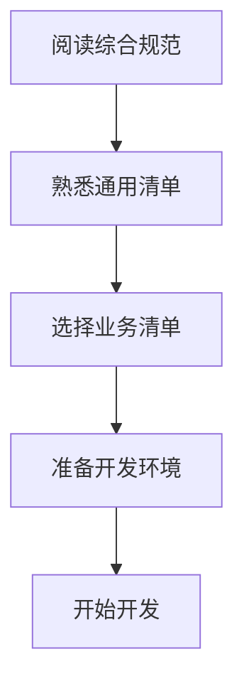
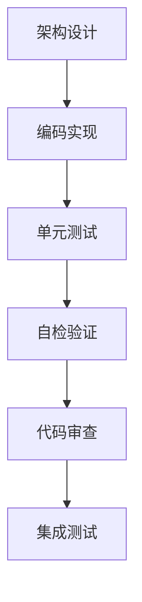

# 开发检查清单目录

> **📋 版本**: v1.0.0
> **📋 创建时间**: 2025-01-10
> **📋 说明**: 本目录包含SmartAdmin项目各模块的详细开发检查清单

---

## 📋 检查清单概览

### 通用标准
- **[通用开发检查清单](./通用开发检查清单.md)** - 适用于所有模块的通用开发标准和要求

### 业务模块专用清单
- **[门禁系统开发检查清单](./门禁系统开发检查清单.md)** - 门禁系统模块专用检查清单
- **[消费系统开发检查清单](./消费系统开发检查清单.md)** - 消费系统模块专用检查清单
- **[考勤系统开发检查清单](./考勤系统开发检查清单.md)** - 考勤系统模块专用检查清单
- **[智能视频系统开发检查清单](./智能视频系统开发检查清单.md)** - 智能视频系统模块专用检查清单

---

## 🎯 使用指南

### 1. 开发前准备
```markdown
✅ 阅读《综合开发规范文档》（../DEV_STANDARDS.md）
✅ 熟悉通用开发检查清单
✅ 根据业务模块选择对应的专用清单
✅ 确保开发环境配置正确
✅ 了解项目架构和技术栈要求
```

### 2. 开发过程中
```markdown
✅ 严格按照检查清单逐项检查
✅ 每完成一个模块进行自检
✅ 遇到问题及时记录和解决
✅ 定期回顾检查完成情况
✅ 保持与清单同步更新
```

### 3. 代码审查阶段
```markdown
✅ 使用检查清单作为审查标准
✅ 确保所有关键项检查通过
✅ 记录审查中发现的问题
✅ 跟踪问题修复进度
✅ 验证修复效果
```

### 4. 测试阶段
```markdown
✅ 根据检查清单制定测试计划
✅ 验证清单完成情况
✅ 补充清单中未覆盖的测试项
✅ 确保测试覆盖率达到要求
✅ 测试结果与清单要求对比
```

### 5. 部署前验证
```markdown
✅ 最终检查清单完成情况
✅ 确保所有关键项通过
✅ 验证部署环境配置
✅ 确认监控系统就位
✅ 准备回滚方案
```

---

## 📋 清单使用流程

### 阶段1：开发前准备（1-2天）


### 阶段2：开发实施（按项目周期）


### 阶段3：测试验证（1-2周）
```markdown
🔴 单元测试：使用单元测试清单
🟡 集成测试：使用集成测试清单
🟢 系统测试：使用系统测试清单
🟢 安全测试：使用安全测试清单
🟢 性能测试：使用性能测试清单
```

### 阶段4：部署交付（3-5天）
```markdown
🔴 环境检查：使用部署检查清单
🟡 配置验证：验证配置正确性
🟡 健康检查：确保服务正常
🟢 监控配置：验证监控系统
🟢 文档整理：完善交付文档
```

---

## 🎯 检查重点

### 高优先级项目（必须100%通过）
```markdown
🔴 架构规范符合性
🔴 安全规范执行情况
🔴 数据库设计规范性
🔴 API接口设计标准
🔴 权限控制机制
🔴 异常处理完整性
🔴 日志记录规范性
🔴 测试覆盖率要求
```

### 中优先级项目（建议达到）
```markdown
🟡 代码质量标准
🟡 性能优化措施
🟡 文档完整性
🟡 用户体验优化
🟡 错误处理机制
🟡 缓存策略优化
🟡 并发处理能力
```

### 低优先级项目（持续改进）
```markdown
🟢 代码风格统一
🟢 注释规范完善
🟢 工具使用效率
🟢 开发流程优化
🟢 自动化程度提升
```

---

## 📊 检查结果统计

### 统计维度
```markdown
✅ 完成度：已检查项 / 总检查项 × 100%
🟡 通过率：通过项 / 检查项 × 100%
🔴 阻断项：必须修复的问题数量
🟡 警告项：建议改进的问题数量
🟢 优化项：可以优化的项目数量
```

### 质量等级
```markdown
🟢 优秀：90-100分，可以交付
🟡 良好：80-89分，修复后交付
🟠 合格：70-79分，改进后交付
🔴 不合格：<70分，重新开发
```

---

## 🔧 工具和资源

### 检查工具
```markdown
✅ 代码审查工具：SonarQube
✅ 测试覆盖率工具：JaCoCo
✅ 性能监控工具：Prometheus + Grafana
✅ 安全扫描工具：OWASP ZAP
✅ 文档生成工具：Swagger/OpenAPI
```

### 参考资源
```markdown
📚 《综合开发规范文档》
📚 《SmartAdmin规范体系》
📚 《业务模块设计文档》
📚 《API接口文档》
📚 《数据库设计文档》
```

### 支持渠道
```markdown
💬 技术负责人：架构和规范问题
💬 项目经理：进度和质量问题
💬 测试负责人：测试相关问题
💬 运维负责人：部署和监控问题
```

---

## 📈 持续改进

### 检查清单优化
```markdown
✅ 定期回顾检查清单有效性
✅ 根据项目实践更新检查项
✅ 收集团队反馈改进清单
✅ 跟踪新技术和最佳实践
✅ 保持检查清单的时效性
```

### 质量提升
```markdown
✅ 分析检查结果，识别常见问题
✅ 制定针对性改进措施
✅ 开展专项培训提升技能
✅ 建立质量度量体系
✅ 营造质量文化氛围
```

### 知识分享
```markdown
✅ 总结最佳实践案例
✅ 分享问题解决方案
✅ 建立知识库和FAQ
✅ 组织技术分享会
✅ 制作培训材料
```

---

**📋 使用声明**：

1. 本检查清单是SmartAdmin项目质量控制的权威标准
2. 所有开发人员必须严格遵守
3. 检查清单会根据项目发展持续更新
4. 如有问题或建议，请及时反馈给技术负责人
5. 让我们一起确保项目的高质量交付！

**📞 联系方式**：

- 技术负责人：[联系方式]
- 项目经理：[联系方式]
- 质量保证：[联系方式]

---

*最后更新：2025-01-10*
*维护者：SmartAdmin开发团队*