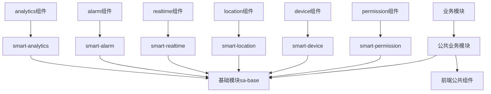

# SmartAdmin 公共模块分析报告

> **📋 版本**: v1.0.0
> **📋 创建时间**: 2025-01-10
> **📋 说明**: 本报告分析SmartAdmin项目中各业务模块的公共需求，设计统一的公共模块体系

---

## 🔍 分析概述

通过对门禁系统、消费系统、考勤系统、智能视频系统四个业务模块的深度分析，发现存在大量共同的功能需求和技术模式。本报告将系统性地梳理这些公共需求，设计可复用的公共模块体系，确保代码一致性和开发效率。

---

## 📊 业务模块共同需求分析

### 1. 核心功能共性

#### 🔐 权限管理需求
```markdown
所有业务模块都需要：
□ 5级安全级别权限控制（绝密级、机密级、秘密级、内部级、公开级）
□ 数据权限隔离（区域权限、设备权限、数据权限）
□ 临时权限管理（短期访问权限）
□ 权限审计日志（权限变更记录、访问记录）
□ 细粒度权限控制（CRUD操作级权限）

实现模式：
- 使用Sa-Token权限框架
- 基于角色的权限控制(RBAC)
- 数据权限过滤器
- 权限缓存策略
```

#### 🏢 设备管理需求
```markdown
所有业务模块都需要：
□ 设备注册和配置管理
□ 设备状态实时监控
□ 设备分组和分类管理
□ 设备故障检测和恢复
□ 设备认证和安全通信
□ 设备配置同步机制

实现模式：
- 统一的设备管理接口
- 设备状态缓存策略
- 心跳检测机制
- 设备配置版本管理
```

#### 📍 地理位置需求
```markdown
门禁、考勤系统需要：
□ GPS定位精度管理
□ 地理围栏配置
□ 位置验证算法
□ 区域权限控制
□ 移动端定位优化

实现模式：
- GPS定位服务封装
- 地理围栏计算引擎
- 位置数据缓存策略
- 精度控制算法
```

#### ⏰ 实时数据处理需求
```markdown
所有业务模块都需要：
□ 实时数据推送（WebSocket）
□ 数据缓存策略（多级缓存）
□ 数据同步机制
□ 实时状态更新
□ 性能优化策略

实现模式：
- WebSocket服务端推送
- Redis实时数据缓存
- Caffeine本地缓存
- 数据变更通知机制
```

#### 🚨 告警管理需求
```markdown
所有业务模块都需要：
□ 实时告警检测
□ 告警规则配置
□ 告警级别分类
□ 告警通知渠道
□ 告警处理工作流
□ 告警统计分析

实现模式：
- 告警规则引擎
- 多渠道通知服务
- 告警状态机
- 告警数据压缩存储
```

#### 📈 数据分析需求
```markdown
所有业务模块都需要：
□ 统计报表生成
□ 数据可视化
□ 趋势分析
□ 异常检测
□ 数据导出功能

实现模式：
- 统一的数据分析引擎
- 图表组件库
- 报表模板系统
- 异常检测算法
```

### 2. 技术架构共性

#### 🗄️ 数据库设计模式
```markdown
所有业务模块都遵循：
□ 统一的表命名规范：t_{business}_{entity}
□ 标准审计字段：create_time, update_time, create_user_id, deleted_flag
□ 软删除模式：deleted_flag字段
□ 乐观锁机制：version字段
□ JSON配置字段：灵活配置存储
□ 索引优化策略：单表不超过8个索引

公共数据表：
- t_sys_user: 用户表
- t_sys_dept: 部门表
- t_sys_role: 角色表
- t_sys_menu: 菜单表
- t_sys_config: 系统配置表
- t_sys_dict: 数据字典表
```

#### 🏗️ 代码架构模式
```markdown
所有业务模块都遵循：
□ 四层架构：Controller → Service → Manager → DAO
□ 统一响应格式：ResponseDTO
□ 统一异常处理：SmartException
□ 统一参数验证：@Valid
□ 统一权限控制：@SaCheckPermission
□ 统一缓存策略：@Cacheable
□ 统一日志记录：@OperationLog
```

#### 🎨 前端架构模式
```markdown
所有业务模块都遵循：
□ Vue 3 Composition API
□ TypeScript严格模式
□ Pinia状态管理
□ Ant Design Vue组件库
□ 统一API封装
□ 统一错误处理
□ 统一权限指令：v-permission
```

---

## 🏗️ 现有公共模块梳理

### 1. 后端公共模块 (sa-base)

#### 📁 基础模块结构
```
sa-base/src/main/java/net/lab1024/sa/
├── common/                 # 公共模块
│   ├── annotation/         # 注解定义
│   │   ├── OperationLog.java    # 操作日志注解
│   │   ├── SmartLog.java        # 日志注解
│   │   └── SmartResponse.java   # 响应注解
│   ├── domain/            # 实体类
│   │   ├── BaseEntity.java      # 基础实体类
│   │   ├── SmartUserEntity.java # 用户实体
│   │   └── ResponseDTO.java     # 响应对象
│   ├── mapper/            # MyBatis Plus Mapper
│   │   ├── BaseMapper.java      # 基础Mapper
│   │   └── SmartUserMapper.java # 用户Mapper
│   └── service/           # 基础Service接口
│       ├── BaseService.java     # 基础Service
│       └── SmartUserService.java # 用户Service
├── config/                 # 配置类
│   ├── WebConfig.java           # Web配置
│   ├── MybatisConfig.java       # MyBatis配置
│   ├── RedisConfig.java         # Redis配置
│   └── SaTokenConfig.java       # Sa-Token配置
├── util/                   # 工具类
│   ├── SmartUtil.java          # 通用工具类
│   ├── SmartRedisUtil.java     # Redis工具类
│   ├── SmartFileUtil.java      # 文件工具类
│   └── SmartDateUtil.java      # 日期工具类
└── constant/               # 常量定义
    ├── SmartConstant.java      # 通用常量
    ├── ResponseCode.java       # 响应码常量
    └── RedisKeyConstant.java   # Redis Key常量
```

#### 🎯 已有核心功能
- ✅ **用户认证**: Sa-Token登录认证
- ✅ **权限控制**: @SaCheckPermission权限验证
- ✅ **统一响应**: ResponseDTO响应格式
- ✅ **异常处理**: SmartException异常体系
- ✅ **日志记录**: @OperationLog操作日志
- ✅ **文件上传**: 本地/OSS文件管理
- ✅ **数据缓存**: Redis+Caffeine多级缓存
- ✅ **参数验证**: @Valid参数校验
- ✅ **数据脱敏**: 敏感信息自动脱敏

### 2. 前端公共模块

#### 📁 基础模块结构
```
smart-admin-web-javascript/src/
├── components/             # 公共组件
│   ├── table/             # 表格组件
│   ├── form/              # 表单组件
│   ├── upload/            # 上传组件
│   └── permission/        # 权限组件
├── utils/                 # 工具函数
│   ├── request.js         # 请求封装
│   ├── auth.js            # 权限工具
│   ├── storage.js         # 存储工具
│   └── format.js          # 格式化工具
├── store/                 # 状态管理
│   ├── app.js             # 应用状态
│   ├── user.js            # 用户状态
│   └── permission.js      # 权限状态
├── lib/                   # 第三方库
│   ├── ant-design-vue/    # Ant Design Vue
│   ├── axios/             # HTTP请求库
│   └── dayjs/             # 日期处理库
└── plugins/               # 插件配置
    ├── axios.js           # Axios配置
    ├── antd.js            # Ant Design配置
    └── permission.js      # 权限插件
```

---

## 🚀 需要新增/完善的公共模块

### 1. 后端公共业务模块

#### 🔐 权限管理公共模块 (smart-permission)

```markdown
模块名称: smart-permission
功能描述: 提供统一的5级安全级别权限管理功能

主要功能:
□ 5级安全级别权限控制
□ 数据权限隔离
□ 临时权限管理
□ 权限审计日志
□ 权限缓存策略

核心类设计:
- SecurityLevelService: 安全级别服务
- DataPermissionService: 数据权限服务
- TemporaryPermissionService: 临时权限服务
- PermissionAuditService: 权限审计服务
```

#### 🏢 设备管理公共模块 (smart-device)

```markdown
模块名称: smart-device
功能描述: 提供统一的设备管理功能

主要功能:
□ 设备注册和配置
□ 设备状态监控
□ 设备分组管理
□ 设备故障检测
□ 设备认证通信

核心类设计:
- DeviceService: 设备管理服务
- DeviceMonitorService: 设备监控服务
- DeviceGroupService: 设备分组服务
- DeviceAuthService: 设备认证服务
```

#### 📍 地理位置公共模块 (smart-location)

```markdown
模块名称: smart-location
功能描述: 提供统一的地理位置服务

主要功能:
□ GPS定位服务
□ 地理围栏管理
□ 位置验证算法
□ 区域权限控制
□ 移动端定位优化

核心类设计:
- LocationService: 位置服务
- GeofenceService: 地理围栏服务
- LocationValidationService: 位置验证服务
- MobileLocationService: 移动端位置服务
```

#### ⏰ 实时数据公共模块 (smart-realtime)

```markdown
模块名称: smart-realtime
功能描述: 提供统一的实时数据处理功能

主要功能:
□ WebSocket服务
□ 实时数据推送
□ 数据缓存策略
□ 数据同步机制
□ 性能优化

核心类设计:
- RealtimeService: 实时数据服务
- WebSocketService: WebSocket服务
- RealtimeCacheService: 实时缓存服务
- DataSyncService: 数据同步服务
```

#### 🚨 告警管理公共模块 (smart-alarm)

```markdown
模块名称: smart-alarm
功能描述: 提供统一的告警管理功能

主要功能:
□ 告警规则引擎
□ 告警检测算法
□ 告警通知服务
□ 告警处理工作流
□ 告警统计分析

核心类设计:
- AlarmRuleService: 告警规则服务
- AlarmDetectionService: 告警检测服务
- AlarmNotificationService: 告警通知服务
- AlarmAnalysisService: 告警分析服务
```

#### 📈 数据分析公共模块 (smart-analytics)

```markdown
模块名称: smart-analytics
功能描述: 提供统一的数据分析功能

主要功能:
□ 统计报表生成
□ 数据可视化
□ 趋势分析算法
□ 异常检测算法
□ 数据导出服务

核心类设计:
- StatisticsService: 统计服务
- VisualizationService: 可视化服务
- TrendAnalysisService: 趋势分析服务
- AnomalyDetectionService: 异常检测服务
- DataExportService: 数据导出服务
```

### 2. 前端公共业务模块

#### 🔐 权限管理公共组件 (smart-permission)

```markdown
组件路径: /components/permission/
主要组件:
□ SecurityLevelSelector: 5级安全级别选择器
□ DataPermissionFilter: 数据权限过滤器
□ TemporaryPermissionForm: 临时权限表单
□ PermissionAuditLog: 权限审计日志组件
□ PermissionTree: 权限树组件
```

#### 🏢 设备管理公共组件 (smart-device)

```markdown
组件路径: /components/device/
主要组件:
□ DeviceStatusCard: 设备状态卡片
□ DeviceGroupTree: 设备分组树
□ DeviceConfigForm: 设备配置表单
□ DeviceMonitorChart: 设备监控图表
□ DeviceList: 设备列表组件
```

#### 📍 地理位置公共组件 (smart-location)

```markdown
组件路径: /components/location/
主要组件:
□ LocationPicker: 位置选择器
□ GeofenceMap: 地理围栏地图
□ LocationValidation: 位置验证组件
□ AreaSelector: 区域选择器
□ GPSMonitor: GPS监控组件
```

#### ⏰ 实时数据公共组件 (smart-realtime)

```markdown
组件路径: /components/realtime/
主要组件:
□ RealtimeChart: 实时图表
□ WebSocketClient: WebSocket客户端
□ DataStatus: 数据状态组件
□ RealtimeNotification: 实时通知组件
□ DataSync: 数据同步组件
```

#### 🚨 告警管理公共组件 (smart-alarm)

```markdown
组件路径: /components/alarm/
主要组件:
□ AlarmList: 告警列表
□ AlarmRuleForm: 告警规则表单
□ AlarmChart: 告警统计图表
□ AlarmNotification: 告警通知组件
□ AlarmProcessFlow: 告警处理流程
```

#### 📈 数据分析公共组件 (smart-analytics)

```markdown
组件路径: /components/analytics/
主要组件:
□ StatisticsCard: 统计卡片
□ TrendChart: 趋势图表
□ DataExport: 数据导出组件
□ AnomalyChart: 异常检测图表
□ ReportTemplate: 报表模板组件
```

---

## 🔗 模块依赖关系设计

### 1. 依赖层次结构



### 2. 模块间依赖关系

```markdown
# 后端模块依赖
smart-device → smart-permission (设备权限控制)
smart-location → smart-device (位置设备关联)
smart-realtime → smart-device (设备实时数据)
smart-alarm → smart-realtime (实时告警检测)
smart-analytics → smart-alarm (告警数据分析)

# 前端模块依赖
permission组件 → 基础权限组件
device组件 → permission组件 (设备权限)
location组件 → device组件 (位置设备)
realtime组件 → device组件 (设备实时数据)
alarm组件 → realtime组件 (实时告警)
analytics组件 → alarm组件 (告警分析)
```

---

## 📋 实施计划

### 第一阶段：基础公共模块完善

```markdown
优先级: 高
时间周期: 2-3周

任务清单:
□ 完善smart-permission权限管理模块
□ 完善smart-device设备管理模块
□ 创建公共基础组件库
□ 统一数据库设计规范
□ 建立公共模块文档体系
```

### 第二阶段：业务功能模块开发

```markdown
优先级: 中
时间周期: 3-4周

任务清单:
□ 开发smart-location地理位置模块
□ 开发smart-realtime实时数据模块
□ 开发smart-alarm告警管理模块
□ 创建对应的前端公共组件
□ 编写模块使用文档
```

### 第三阶段：数据分析模块完善

```markdown
优先级: 中
时间周期: 2-3周

任务清单:
□ 开发smart-analytics数据分析模块
□ 创建数据可视化组件库
□ 建立报表模板系统
□ 优化性能和缓存策略
□ 完善监控和日志系统
```

### 第四阶段：集成测试和优化

```markdown
优先级: 高
时间周期: 1-2周

任务清单:
□ 模块集成测试
□ 性能压力测试
□ 安全性测试
□ 用户体验优化
□ 文档完善和培训
```

---

## 🎯 质量保证

### 1. 代码质量标准

```markdown
□ 代码覆盖率 ≥ 80%
□ 圈复杂度 ≤ 10
□ 代码重复率 ≤ 3%
□ 静态代码分析通过
□ 代码审查100%覆盖
□ 单元测试、集成测试、系统测试完整
```

### 2. 文档质量标准

```markdown
□ API文档完整准确
□ 使用文档清晰易懂
□ 架构图和流程图完整
□ 示例代码可运行
□ 版本管理规范
□ 变更记录详细
```

### 3. 性能标准

```markdown
□ 接口响应时间 ≤ 200ms
□ 数据库查询优化
□ 缓存命中率 ≥ 90%
□ 内存使用合理
□ 并发处理能力满足需求
□ 系统稳定性 ≥ 99.9%
```

---

## 📚 相关文档

- [综合开发规范文档](./DEV_STANDARDS.md)
- [项目开发指南](./PROJECT_GUIDE.md)
- [通用开发检查清单](./CHECKLISTS/通用开发检查清单.md)
- [各业务模块专用清单](./CHECKLISTS/)

---

**📞 技术支持**：

- **架构设计**: 架构师团队
- **模块开发**: 开发团队
- **质量保证**: 测试团队
- **文档维护**: 技术写作团队

---

*最后更新：2025-01-10*
*维护者：SmartAdmin开发团队*