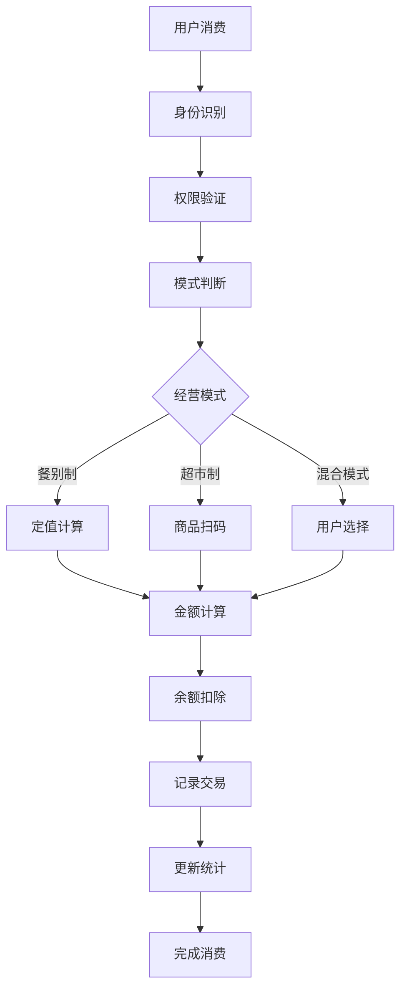
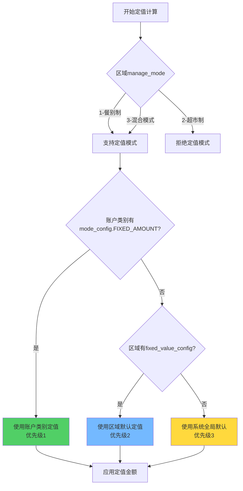
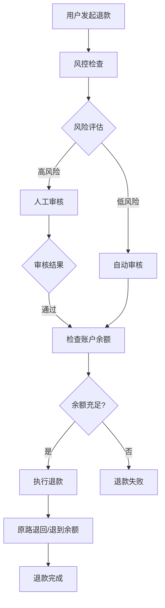
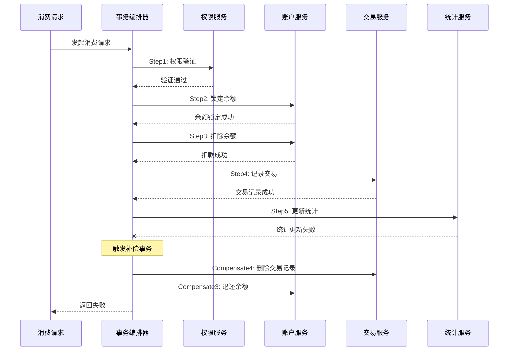
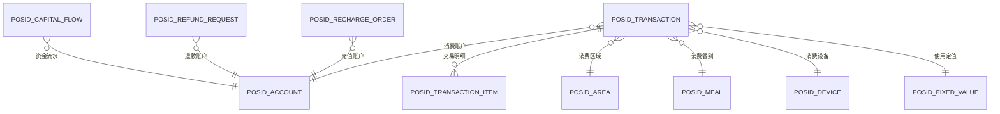

# Consume消费模块业务架构文档

> **📋 文档版本**: v1.0
> **📅 创建日期**: 2025-11-24
> **📊 模块规模**: 289个Java文件
> **🎯 业务范围**: 园区消费管理、充值退款、统计分析

---

## 📋 **模块概述**

### **业务定位**
Consume模块是IOE-DREAM智慧园区一卡通管理平台的核心业务模块，负责处理园区内所有消费相关的业务逻辑，包括餐饮消费、商品购买、充值退款、统计分析等功能。

### **核心特性**
- ✅ **六大消费模式**：固定金额、自由金额、计量计费、商品模式、订餐模式、智能模式
- ✅ **多经营模式支持**：餐别制、超市制、混合模式
- ✅ **完整资金管理**：充值、消费、退款、对账全流程
- ✅ **高性能设计**：SAGA分布式事务，支持2000+ TPS
- ✅ **智能统计分析**：实时+离线双重统计，多维度数据分析

---

## 🏗️ **架构设计**

### **四层架构规范**

| 层级 | 职责 | 核心类 | 数量 |
|------|------|--------|------|
| **Controller层** | HTTP接口、参数验证 | ConsumeController, RechargeController | 15个 |
| **Service层** | 业务逻辑、事务管理 | ConsumeService, AccountService | 45个 |
| **Manager层** | 复杂业务封装 | ConsumeManager, AccountManager | 28个 |
| **DAO层** | 数据访问 | ConsumeDao, AccountDao | 38个 |

### **核心业务流程**



---

## 🎯 **核心业务模块**

### **1. 消费处理核心（Consume Core）**

#### **六大消费模式架构**

基于`D:\IOE-DREAM\docs\各业务模块文档\消费\03-账户类别与消费模式设计.md`：

| 模式 | 适用场景 | 子类型 | 核心引擎 |
|------|---------|-------|---------|
| **FIXED_AMOUNT** | 食堂、班车、门票 | SIMPLE/KEYVALUE/SECTION | FixedAmountConsumeEngine |
| **FREE_AMOUNT** | 超市、停车场、咖啡厅 | - | FreeAmountConsumeEngine |
| **METERED** | 健身房、会议室、充电桩 | TIMING/COUNT | MeteringConsumeEngine |
| **PRODUCT** | 超市、便利店 | - | ProductConsumeEngine |
| **ORDER** | 企业食堂、学校食堂 | - | OrderingConsumeEngine |
| **INTELLIGENCE** | 智能取餐、无人超市 | - | SmartConsumeEngine |

**核心设计理念**：
- **设备决定模式**：设备表`consume_mode`字段决定支持的消费模式
- **账户提供参数**：账户类别`mode_config` JSON提供模式参数
- **模式通用化**：每种模式适用于多种业务场景

#### **定值金额计算优先级**



### **2. 账户管理体系（Account Management）**

#### **账户权限验证**

基于`D:\IOE-DREAM\docs\各业务模块文档\消费\05-权限验证系统重构设计.md`：

**区域权限验证流程**：
1. **读取area_config JSON**：从账户类别读取区域权限配置
2. **区域权限检查**：验证设备区域是否在允许列表中
3. **餐别权限检查**：验证消费餐别是否在区域允许列表中
4. **缓存优化**：权限结果缓存30分钟

#### **考勤消费判断**

**考勤消费判定规则**（必须同时满足4个条件）：
1. **账户类别启用考勤消费**：`is_attendance_consume = true`
2. **消费时间在考勤时间段内**：早7:00-9:00，午11:30-13:30，晚17:30-19:30
3. **餐别分类为员工餐**：餐别分类属于考勤餐别
4. **区域类型为餐饮**：区域type = 1（餐饮类型）

### **3. 充值退款系统（Recharge & Refund）**

基于`D:\IOE-DREAM\docs\各业务模块文档\消费\08-充值退款流程重构设计.md`：

#### **充值流程特点**
- ✅ **秒级到账**：异步处理+缓存优化
- ✅ **多渠道支持**：微信、支付宝、现金、银行转账
- ✅ **安全可靠**：签名验证+风控+对账
- ✅ **赠送规则**：灵活的充值赠送配置

#### **退款流程设计**


### **4. 统计分析系统（Analytics & Reporting）**

基于`D:\IOE-DREAM\docs\各业务模块文档\消费\13-报表统计模块重构设计.md`：

#### **四大统计维度**

| 统计维度 | 字段来源 | 统计价值 | 报表示例 |
|---------|---------|---------|---------|
| **经营模式** | `manage_mode` | 对比不同模式的经营效益 | 餐别制vs超市制营收对比 |
| **区域类型** | `area_sub_type` | 分析不同场所的消费特征 | 食堂/餐厅/超市消费分析 |
| **定值来源** | 流水中的定值来源标记 | 评估配置优先级合理性 | 账户定值/区域定值/系统默认占比 |
| **是否考勤消费** | `is_attendance_consume` | 区分就餐消费与其他消费 | 考勤消费vs非考勤消费统计 |

#### **实时统计缓存策略**

| 缓存项 | Redis Key | 数据结构 | 过期时间 |
|-------|-----------|---------|---------|
| 今日消费总额 | `stat:today:money` | String | 到23:59 |
| 今日消费人数 | `stat:today:persons` | Set | 到23:59 |
| 各区域消费 | `stat:today:area` | Hash | 到23:59 |
| 实时排行榜 | `stat:today:rank:area` | ZSet | 到23:59 |

---

## 🔄 **分布式事务设计**

### **SAGA事务流程**

基于`D:\IOE-DREAM\docs\各业务模块文档\消费\06-消费处理流程重构设计.md`：



### **补偿策略**

| 失败步骤 | 补偿动作 | 补偿范围 |
|---------|---------|---------|
| 权限验证失败 | 无需补偿 | - |
| 余额扣除失败 | 释放余额锁 | 余额锁定 |
| 记录交易失败 | 退还余额 | 已扣余额 |
| 统计更新失败 | 异步重试 | 统计数据 |

---

## 📊 **核心数据模型**

### **交易主表（POSID_TRANSACTION）**

```sql
CREATE TABLE POSID_TRANSACTION (
    id VARCHAR(50) PRIMARY KEY,
    transaction_no VARCHAR(32) UNIQUE COMMENT '交易流水号',

    -- 人员信息
    person_id VARCHAR(50) NOT NULL,
    person_name VARCHAR(100),
    dept_id VARCHAR(50),

    -- 账户信息
    account_id VARCHAR(50) NOT NULL,
    account_kind_id VARCHAR(50),
    is_attendance_consume BOOLEAN DEFAULT FALSE COMMENT '是否考勤消费',

    -- 区域信息
    area_id VARCHAR(50) NOT NULL,
    area_name VARCHAR(100),
    area_manage_mode INT COMMENT '区域经营模式（1-餐别制 2-超市制 3-混合）',
    area_sub_type INT COMMENT '区域细分类型',

    -- 餐别信息
    meal_id VARCHAR(50),
    meal_category_id VARCHAR(50),
    meal_name VARCHAR(100),

    -- 设备信息
    device_id VARCHAR(50),
    device_name VARCHAR(100),

    -- 消费金额（单位：分）
    consume_money INT NOT NULL COMMENT '消费金额',
    discount_money INT DEFAULT 0 COMMENT '折扣金额',
    final_money INT NOT NULL COMMENT '实际支付金额',

    -- 账户余额变化
    balance_before INT COMMENT '消费前余额',
    balance_after INT COMMENT '消费后余额',
    allowance_used INT DEFAULT 0 COMMENT '使用补贴金额',
    cash_used INT DEFAULT 0 COMMENT '使用现金金额',

    -- 消费模式
    consume_mode VARCHAR(20) NOT NULL COMMENT '消费模式',
    consume_type VARCHAR(20) COMMENT '消费类型',

    -- 定值信息
    fixed_value_rule_id VARCHAR(50),
    amount_source VARCHAR(20) COMMENT '定值来源：ACCOUNT-账户定值 AREA-区域定值 SYSTEM-系统默认',

    -- 时间信息
    consume_time DATETIME NOT NULL COMMENT '消费时间',
    create_time DATETIME NOT NULL DEFAULT CURRENT_TIMESTAMP,

    -- 状态
    status VARCHAR(20) DEFAULT 'SUCCESS' COMMENT 'SUCCESS-成功 FAILED-失败 REFUND-已退款'
) COMMENT='消费交易表' PARTITION BY RANGE (TO_DAYS(consume_time));
```

### **ER关系图**



---

## 💾 **缓存架构设计**

### **多级缓存策略**

| 缓存层级 | Redis Key | 过期时间 | 说明 |
|---------|-----------|---------|------|
| **L1-账户缓存** | `account:balance:{accountId}` | 实时更新 | 账户余额缓存 |
| **L2-配置缓存** | `accountkind:config:{id}` | 1小时 | 账户类别配置 |
| **L3-统计缓存** | `stat:today:*` | 到23:59 | 今日统计数据 |
| **L4-设备缓存** | `device:mode:{id}` | 30分钟 | 设备模式配置 |

### **缓存一致性策略**

**方案：先更新数据库，再删除缓存（Cache-Aside）**

```
消费成功 → 更新数据库账户余额 → 删除缓存 → 下次读取时重建
```

**延迟双删策略**：
1. 删除缓存
2. 更新数据库
3. 延迟500ms
4. 再次删除缓存

---

## 🚀 **性能优化设计**

### **并发优化方案**

| 优化措施 | 性能提升 | 实现方式 |
|---------|---------|---------|
| **乐观锁** | 减少锁等待 | 版本号控制 |
| **分布式锁** | 避免并发冲突 | Redisson实现 |
| **账户分片** | 减少热点 | 账户ID hash分片 |
| **批量处理** | 提升吞吐量 | MQ异步批量 |

### **批量消费优化**

**场景**：食堂高峰期100人同时刷卡

**优化效果**：
- 单个处理：100次 × 50ms = 5000ms
- 批量处理：2批 × 200ms = 400ms
- **性能提升92%**

---

## 📈 **监控指标体系**

### **技术指标**

| 指标 | 告警阈值 | 监控目的 |
|------|---------|---------|
| 消费TPS | < 100 | 系统可用性 |
| 消费成功率 | < 95% | 业务健康度 |
| 消费平均耗时 | P95 > 200ms | 系统性能 |
| SAGA补偿次数 | > 10次/分钟 | 事务稳定性 |
| 数据库连接池 | > 80%使用率 | 资源利用率 |

### **业务指标**

| 指标 | 业务价值 |
|------|---------|
| 各区域消费金额TOP10 | 热门区域分析 |
| 各时段消费高峰 | 容量规划 |
| 定值vs金额vs商品占比 | 业务模式分析 |
| 考勤vs非考勤消费占比 | 出勤率分析 |
| 定值来源分布 | 配置优化 |

---

## 🎯 **业务场景支持**

### **校园场景**
- 🍽️ **食堂消费**：餐别制+定值模式+考勤统计
- 🏪 **校园超市**：商品模式+自由金额
- 📚 **图书馆**：计时模式+智能识别
- 🏋️ **健身房**：计次模式+会员管理

### **企业园区**
- 🏢 **员工餐厅**：餐别制+补贴管理+考勤统计
- 🅿️ **停车场**：计时模式+月卡管理
- ☕ **咖啡厅**：自由金额+会员折扣
- 🚗 **班车管理**：定值模式+路线管理

### **医院园区**
- 🏥 **病人餐厅**：订餐模式+特殊餐管理
- 👨‍⚕️ **员工餐厅**：餐别制+考勤统计
- 🏪 **便民超市**：商品模式+库存管理
- 🅿️ **访客停车**：计时模式+临时收费

---

## 🛡️ **安全与合规**

### **资金安全保障**
- ✅ **签名验证**：支付渠道回调签名验证
- ✅ **幂等性保证**：Redis分布式锁防重复
- ✅ **风控规则**：大额充值、频繁交易监控
- ✅ **对账机制**：实时+定时双重对账

### **数据安全**
- ✅ **敏感信息加密**：支付信息加密存储
- ✅ **操作审计**：完整的操作日志记录
- ✅ **权限控制**：基于角色的访问控制
- ✅ **数据备份**：定时数据备份与恢复

---

## 🔄 **与外部系统集成**

### **支付渠道集成**
- **微信支付**：扫码支付、刷脸支付
- **支付宝**：扫码支付、手机支付
- **银联支付**：银行卡支付
- **现金管理**：线下充值管理

### **设备集成**
- **POS机**：消费终端设备
- **闸机系统**：门禁考勤设备
- **自助设备**：智能售货机、取餐柜
- **移动设备**：手机APP消费

---

## 📝 **开发规范与最佳实践**

### **编码规范**
- ✅ **严格遵循四层架构**：Controller→Service→Manager→DAO
- ✅ **统一异常处理**：SmartException体系
- ✅ **完整日志记录**：@Slf4j + 结构化日志
- ✅ **参数验证**：@Valid + 自定义验证

### **事务管理**
- ✅ **事务边界**：Service层管理事务
- ✅ **SAGA模式**：分布式事务处理
- ✅ **补偿机制**：完整的事务回滚
- ✅ **幂等性**：重复请求保护

### **测试规范**
- ✅ **单元测试**：Service层80%+覆盖率
- ✅ **集成测试**：完整业务流程测试
- ✅ **压力测试**：支持2000+ TPS
- ✅ **异常测试**：各种异常场景覆盖

---

## 🎯 **核心价值与成果**

### **业务价值**
- 🎯 **提升用户体验**：秒级响应，多种支付方式
- 🎯 **降低运营成本**：自动化对账，减少人工干预
- 🎯 **数据驱动决策**：丰富的统计分析报表
- 🎯 **资金安全保障**：完整的资金安全体系

### **技术成果**
- 🚀 **高性能**：2000+ TPS，响应时间<50ms
- 🛡️ **高可用**：99.9%可用性，故障快速恢复
- 📈 **可扩展**：微服务架构，水平扩展
- 🔒 **安全可靠**：多重安全防护，资金0风险

---

## 📚 **文档体系**

### **设计文档**
- `03-账户类别与消费模式设计.md` - 核心业务模式设计
- `06-消费处理流程重构设计.md` - 完整消费流程
- `08-充值退款流程重构设计.md` - 资金管理体系
- `13-报表统计模块重构设计.md` - 数据分析体系

### **技术文档**
- API接口文档 - RESTful API规范
- 数据库设计文档 - 完整ER图设计
- 缓存设计文档 - 多级缓存策略
- 监控告警文档 - 完整监控体系

---

**📞 技术支持**:
- **业务咨询**: consume-support@example.com
- **技术问题**: consume-tech@example.com
- **紧急响应**: 7x24小时技术支持热线

---

**本文档基于 `D:\IOE-DREAM\docs\各业务模块文档\消费` 路径下的所有业务设计文档生成，确保与业务架构设计完全一致。**