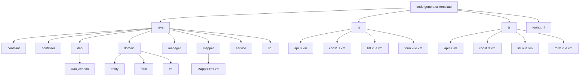
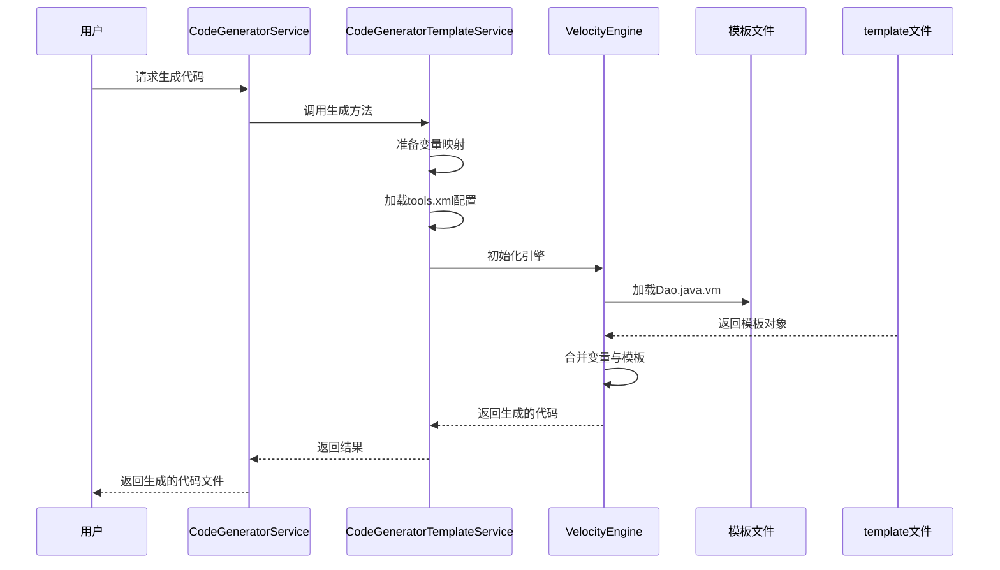
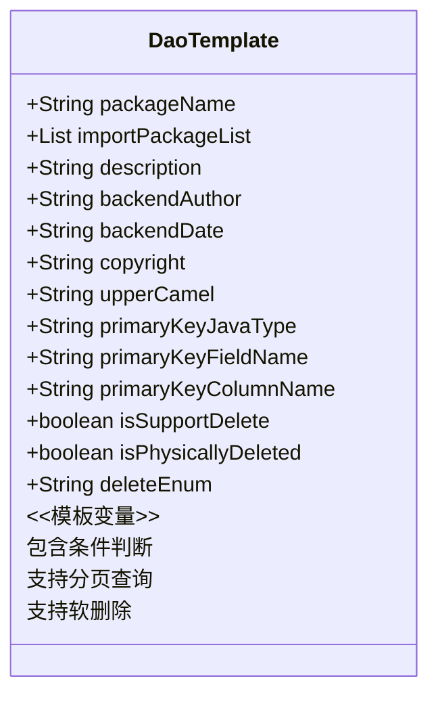
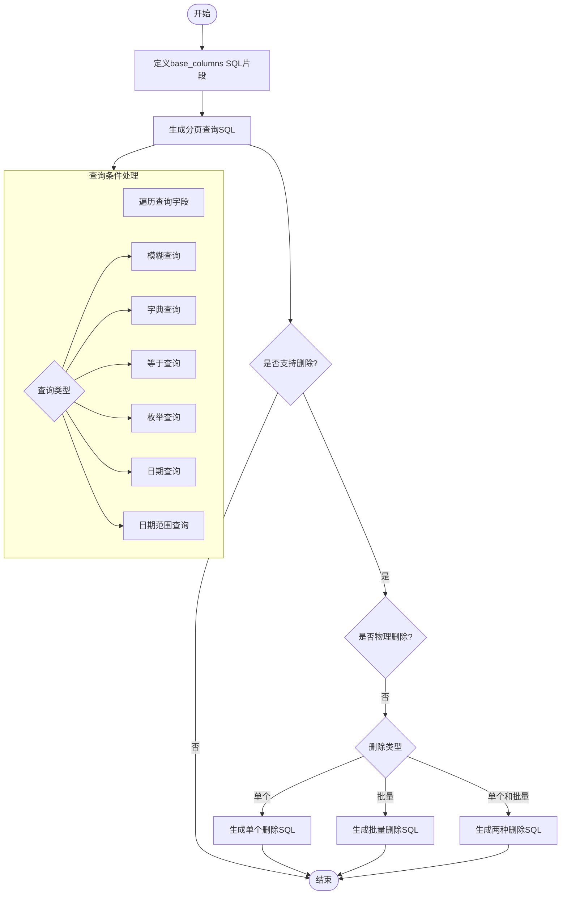
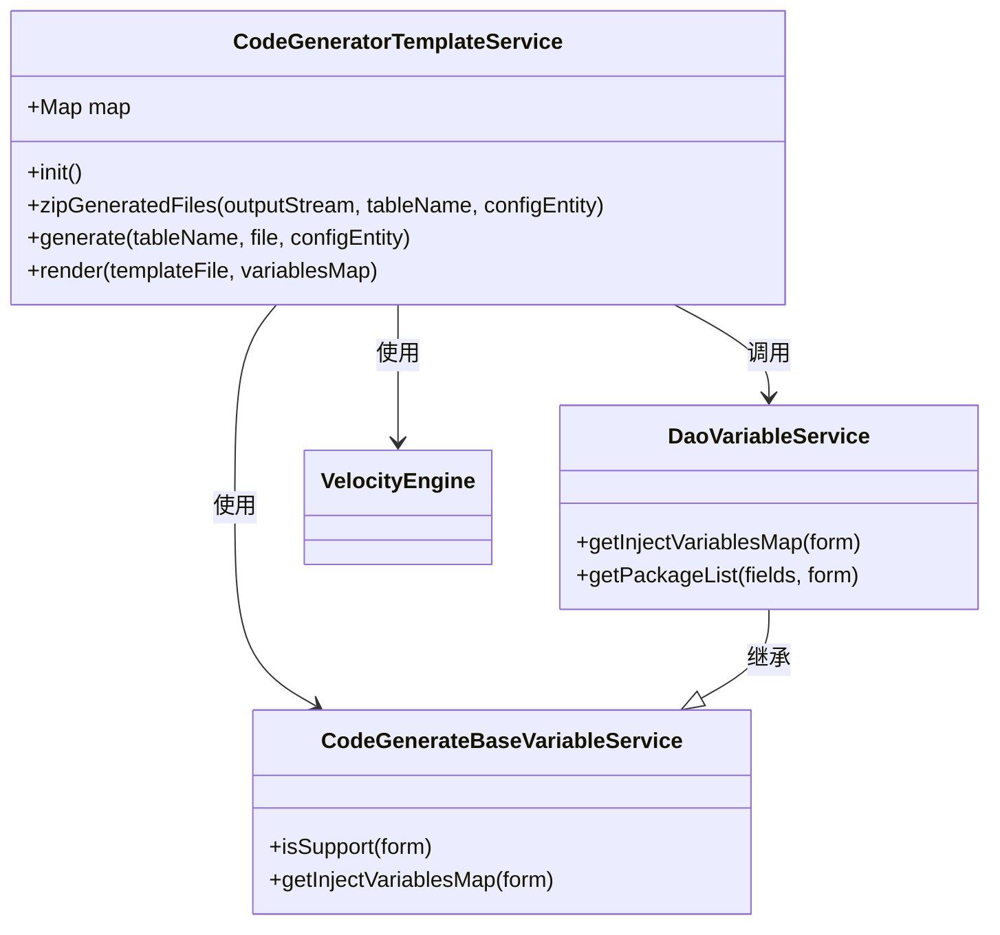
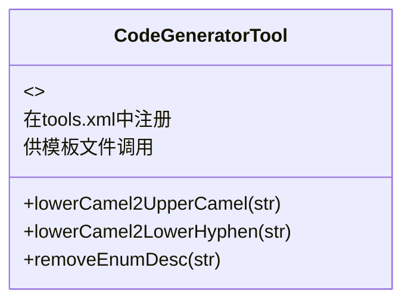
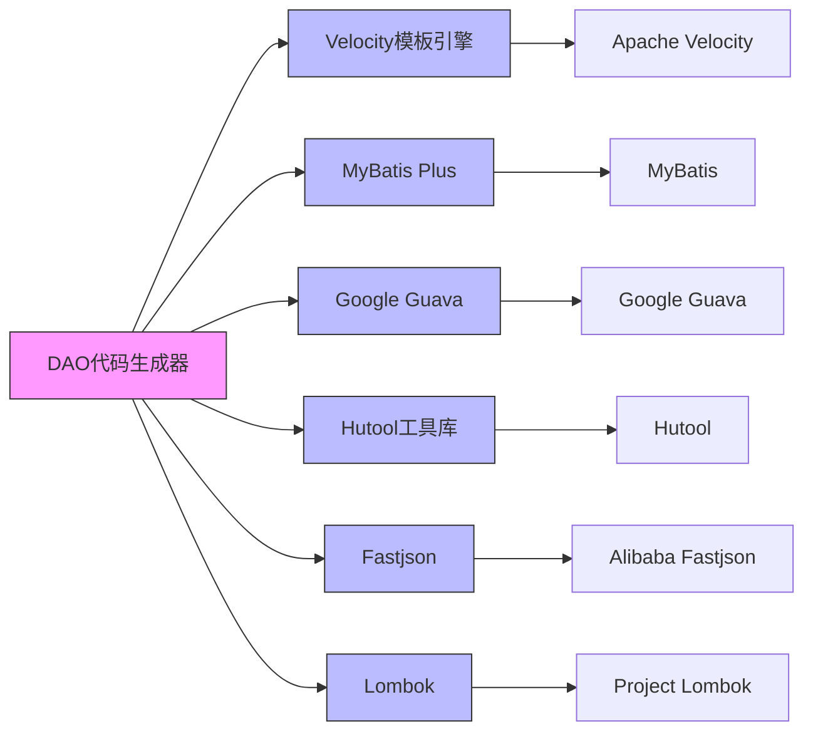

# DAO代码生成器模板

<cite>
**本文档引用文件**  
- [Dao.java.vm](file://smart-admin-api-java17-springboot3\sa-base\src\main\resources\code-generator-template\java\dao\Dao.java.vm)
- [Mapper.xml.vm](file://smart-admin-api-java17-springboot3\sa-base\src\main\resources\code-generator-template\java\mapper\Mapper.xml.vm)
- [CodeGeneratorTemplateService.java](file://smart-admin-api-java17-springboot3\sa-base\src\main\java\net\lab1024\sa\base\module\support\codegenerator\service\CodeGeneratorTemplateService.java)
- [DaoVariableService.java](file://smart-admin-api-java17-springboot3\sa-base\src\main\java\net\lab1024\sa\base\module\support\codegenerator\service\variable\backend\DaoVariableService.java)
- [CodeGeneratorTool.java](file://smart-admin-api-java17-springboot3\sa-base\src\main\java\net\lab1024\sa\base\module\support\codegenerator\util\CodeGeneratorTool.java)
- [tools.xml](file://smart-admin-api-java17-springboot3\sa-base\src\main\resources\code-generator-template\tools.xml)
- [Entity.java.vm](file://smart-admin-api-java17-springboot3\sa-base\src\main\resources\code-generator-template\java\domain\entity\Entity.java.vm)
- [AddForm.java.vm](file://smart-admin-api-java17-springboot3\sa-base\src\main\resources\code-generator-template\java\domain\form\AddForm.java.vm)
- [QueryForm.java.vm](file://smart-admin-api-java17-springboot3\sa-base\src\main\resources\code-generator-template\java\domain\form\QueryForm.java.vm)
</cite>

## 目录
1. [引言](#引言)
2. [项目结构](#项目结构)
3. [核心组件](#核心组件)
4. [架构概述](#架构概述)
5. [详细组件分析](#详细组件分析)
6. [依赖分析](#依赖分析)
7. [性能考虑](#性能考虑)
8. [故障排除指南](#故障排除指南)
9. [结论](#结论)

## 引言
本文档详细解析IOE-DREAM项目中基于Velocity模板引擎的DAO代码生成机制。该系统通过模板化方式自动生成DAO层代码，提高开发效率并保证代码一致性。文档将深入分析模板结构、变量替换规则和代码生成逻辑。

## 项目结构
代码生成器相关文件主要位于`sa-base`模块的资源目录和Java源码中，采用分层结构组织不同类型的模板文件。

**图示来源**
- [Dao.java.vm](file://smart-admin-api-java17-springboot3\sa-base\src\main\resources\code-generator-template\java\dao\Dao.java.vm)
- [Mapper.xml.vm](file://smart-admin-api-java17-springboot3\sa-base\src\main\resources\code-generator-template\java\mapper\Mapper.xml.vm)
- [tools.xml](file://smart-admin-api-java17-springboot3\sa-base\src\main\resources\code-generator-template\tools.xml)

**本节来源**
- [Dao.java.vm](file://smart-admin-api-java17-springboot3\sa-base\src\main\resources\code-generator-template\java\dao\Dao.java.vm)
- [Mapper.xml.vm](file://smart-admin-api-java17-springboot3\sa-base\src\main\resources\code-generator-template\java\mapper\Mapper.xml.vm)

## 核心组件
DAO代码生成器的核心组件包括Velocity模板文件、模板服务类、变量服务类和工具类。系统通过这些组件协同工作，实现代码的自动化生成。

**本节来源**
- [CodeGeneratorTemplateService.java](file://smart-admin-api-java17-springboot3\sa-base\src\main\java\net\lab1024\sa\base\module\support\codegenerator\service\CodeGeneratorTemplateService.java)
- [DaoVariableService.java](file://smart-admin-api-java17-springboot3\sa-base\src\main\java\net\lab1024\sa\base\module\support\codegenerator\service\variable\backend\DaoVariableService.java)
- [CodeGeneratorTool.java](file://smart-admin-api-java17-springboot3\sa-base\src\main\java\net\lab1024\sa\base\module\support\codegenerator\util\CodeGeneratorTool.java)

## 架构概述
DAO代码生成器采用模板驱动的架构，通过Velocity引擎将模板文件与数据模型结合，生成最终的Java代码。整个系统分为模板定义、数据准备、模板渲染三个主要阶段。

**图示来源**
- [CodeGeneratorTemplateService.java](file://smart-admin-api-java17-springboot3\sa-base\src\main\java\net\lab1024\sa\base\module\support\codegenerator\service\CodeGeneratorTemplateService.java)
- [Dao.java.vm](file://smart-admin-api-java17-springboot3\sa-base\src\main\resources\code-generator-template\java\dao\Dao.java.vm)

## 详细组件分析

### DAO模板分析
Dao.java.vm模板定义了DAO接口的基本结构，包括包声明、导入语句、接口定义和方法声明。

**图示来源**
- [Dao.java.vm](file://smart-admin-api-java17-springboot3\sa-base\src\main\resources\code-generator-template\java\dao\Dao.java.vm)
- [DaoVariableService.java](file://smart-admin-api-java17-springboot3\sa-base\src\main\java\net\lab1024\sa\base\module\support\codegenerator\service\variable\backend\DaoVariableService.java)

**本节来源**
- [Dao.java.vm](file://smart-admin-api-java17-springboot3\sa-base\src\main\resources\code-generator-template\java\dao\Dao.java.vm)
- [DaoVariableService.java](file://smart-admin-api-java17-springboot3\sa-base\src\main\java\net\lab1024\sa\base\module\support\codegenerator\service\variable\backend\DaoVariableService.java)

### Mapper XML模板分析
Mapper.xml.vm模板负责生成MyBatis的SQL映射文件，包含基础列定义、分页查询和删除操作。

**图示来源**
- [Mapper.xml.vm](file://smart-admin-api-java17-springboot3\sa-base\src\main\resources\code-generator-template\java\mapper\Mapper.xml.vm)
- [CodeGeneratorTemplateService.java](file://smart-admin-api-java17-springboot3\sa-base\src\main\java\net\lab1024\sa\base\module\support\codegenerator\service\CodeGeneratorTemplateService.java)

**本节来源**
- [Mapper.xml.vm](file://smart-admin-api-java17-springboot3\sa-base\src\main\resources\code-generator-template\java\mapper\Mapper.xml.vm)

### 模板服务分析
CodeGeneratorTemplateService是代码生成的核心服务类，负责管理所有模板的生成过程。

**图示来源**
- [CodeGeneratorTemplateService.java](file://smart-admin-api-java17-springboot3\sa-base\src\main\java\net\lab1024\sa\base\module\support\codegenerator\service\CodeGeneratorTemplateService.java)
- [DaoVariableService.java](file://smart-admin-api-java17-springboot3\sa-base\src\main\java\net\lab1024\sa\base\module\support\codegenerator\service\variable\backend\DaoVariableService.java)

**本节来源**
- [CodeGeneratorTemplateService.java](file://smart-admin-api-java17-springboot3\sa-base\src\main\java\net\lab1024\sa\base\module\support\codegenerator\service\CodeGeneratorTemplateService.java)
- [DaoVariableService.java](file://smart-admin-api-java17-springboot3\sa-base\src\main\java\net\lab1024\sa\base\module\support\codegenerator\service\variable\backend\DaoVariableService.java)

### 工具类分析
CodeGeneratorTool提供了一系列辅助方法，用于字符串格式转换和文本处理。

**图示来源**
- [CodeGeneratorTool.java](file://smart-admin-api-java17-springboot3\sa-base\src\main\java\net\lab1024\sa\base\module\support\codegenerator\util\CodeGeneratorTool.java)
- [tools.xml](file://smart-admin-api-java17-springboot3\sa-base\src\main\resources\code-generator-template\tools.xml)

**本节来源**
- [CodeGeneratorTool.java](file://smart-admin-api-java17-springboot3\sa-base\src\main\java\net\lab1024\sa\base\module\support\codegenerator\util\CodeGeneratorTool.java)
- [tools.xml](file://smart-admin-api-java17-springboot3\sa-base\src\main\resources\code-generator-template\tools.xml)

## 依赖分析
DAO代码生成器依赖于多个外部库和框架，形成完整的代码生成生态系统。

**图示来源**
- [pom.xml](file://smart-admin-api-java17-springboot3\sa-base\pom.xml)
- [CodeGeneratorTemplateService.java](file://smart-admin-api-java17-springboot3\sa-base\src\main\java\net\lab1024\sa\base\module\support\codegenerator\service\CodeGeneratorTemplateService.java)

**本节来源**
- [CodeGeneratorTemplateService.java](file://smart-admin-api-java17-springboot3\sa-base\src\main\java\net\lab1024\sa\base\module\support\codegenerator\service\CodeGeneratorTemplateService.java)

## 性能考虑
虽然代码生成是一次性操作，但仍需考虑生成过程的效率和资源使用。

1. **缓存机制**：Velocity引擎启用了文件资源加载器缓存，避免重复解析模板文件。
2. **批量处理**：系统支持一次性生成多个文件并打包为ZIP，减少I/O操作次数。
3. **内存管理**：生成的文件先写入临时目录，处理完成后立即清理，避免内存泄漏。
4. **并发安全**：每个生成请求使用独立的Velocity引擎实例，确保线程安全。

**本节来源**
- [CodeGeneratorTemplateService.java](file://smart-admin-api-java17-springboot3\sa-base\src\main\java\net\lab1024\sa\base\module\support\codegenerator\service\CodeGeneratorTemplateService.java)

## 故障排除指南
当DAO代码生成出现问题时，可参考以下排查步骤：

1. **检查模板文件路径**：确保模板文件存在于正确的资源目录中。
2. **验证变量映射**：确认所有必需的模板变量都已正确注入。
3. **检查依赖配置**：确保Velocity引擎和相关工具类正确初始化。
4. **查看日志输出**：检查系统日志中的错误信息，定位具体问题。
5. **验证数据模型**：确保传入的配置实体包含完整且正确的数据。

**本节来源**
- [CodeGeneratorTemplateService.java](file://smart-admin-api-java17-springboot3\sa-base\src\main\java\net\lab1024\sa\base\module\support\codegenerator\service\CodeGeneratorTemplateService.java)
- [DaoVariableService.java](file://smart-admin-api-java17-springboot3\sa-base\src\main\java\net\lab1024\sa\base\module\support\codegenerator\service\variable\backend\DaoVariableService.java)

## 结论
IOE-DREAM项目的DAO代码生成器通过Velocity模板引擎实现了高效的代码自动化生成。系统设计合理，结构清晰，通过模板变量和条件判断实现了高度的灵活性和可扩展性。开发者可以根据项目需求自定义模板，快速生成符合规范的DAO层代码，显著提升开发效率。