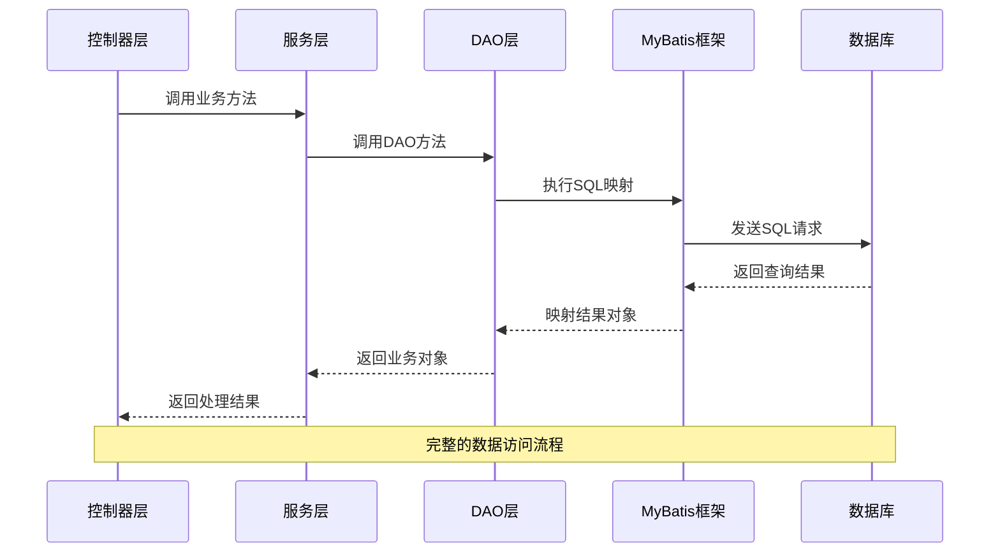
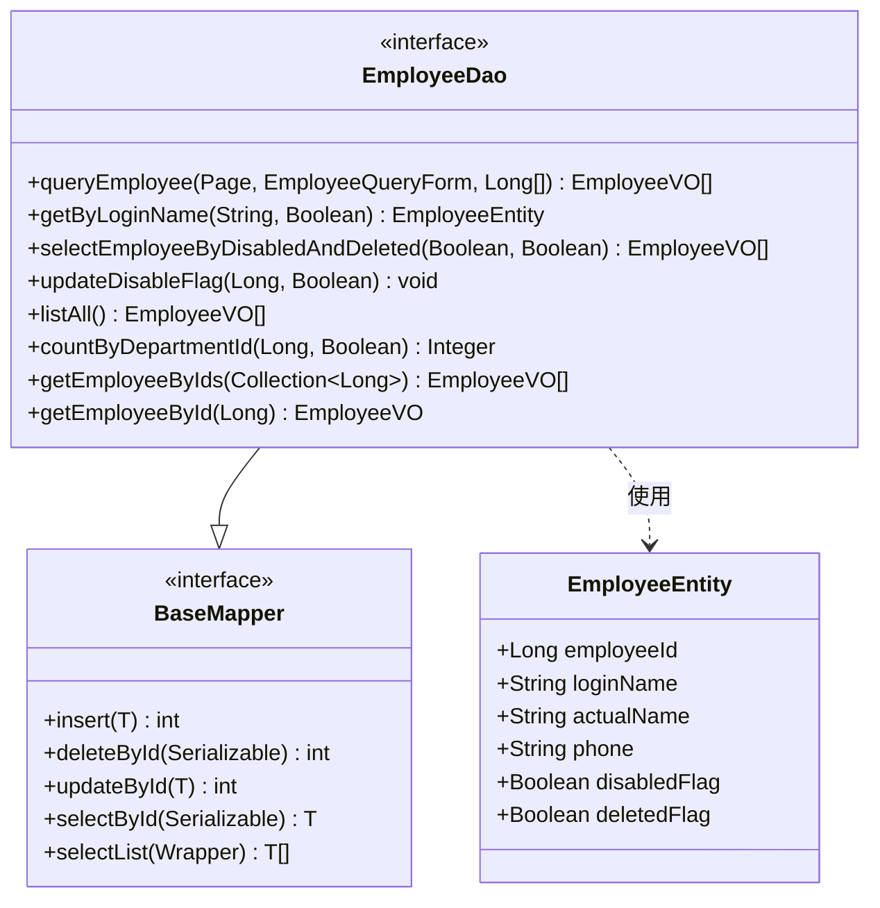
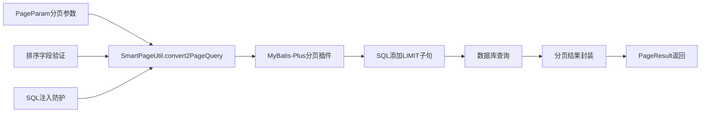
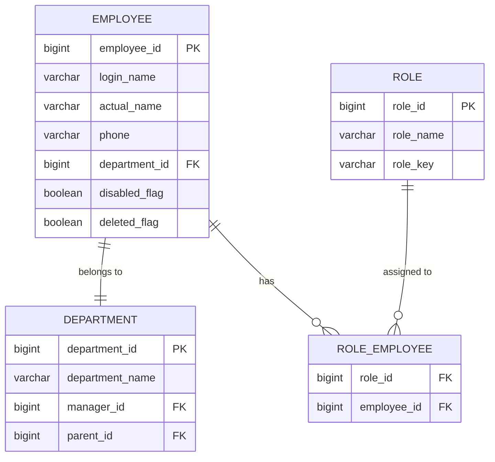
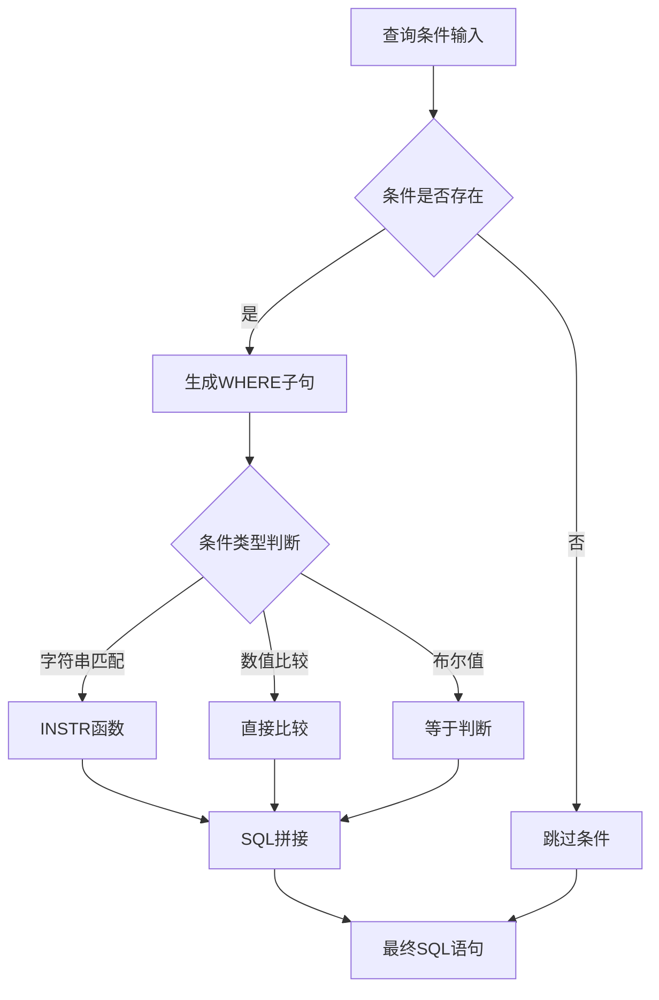
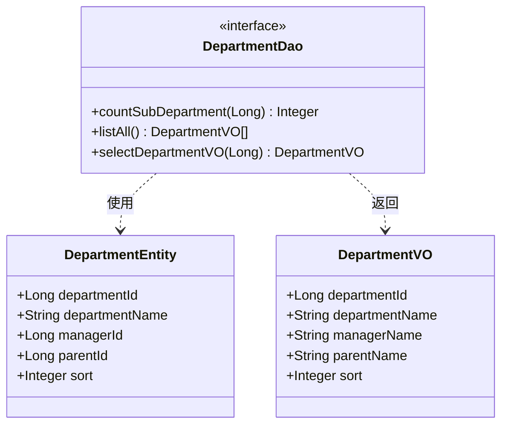
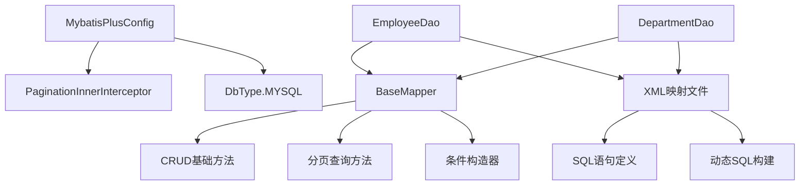
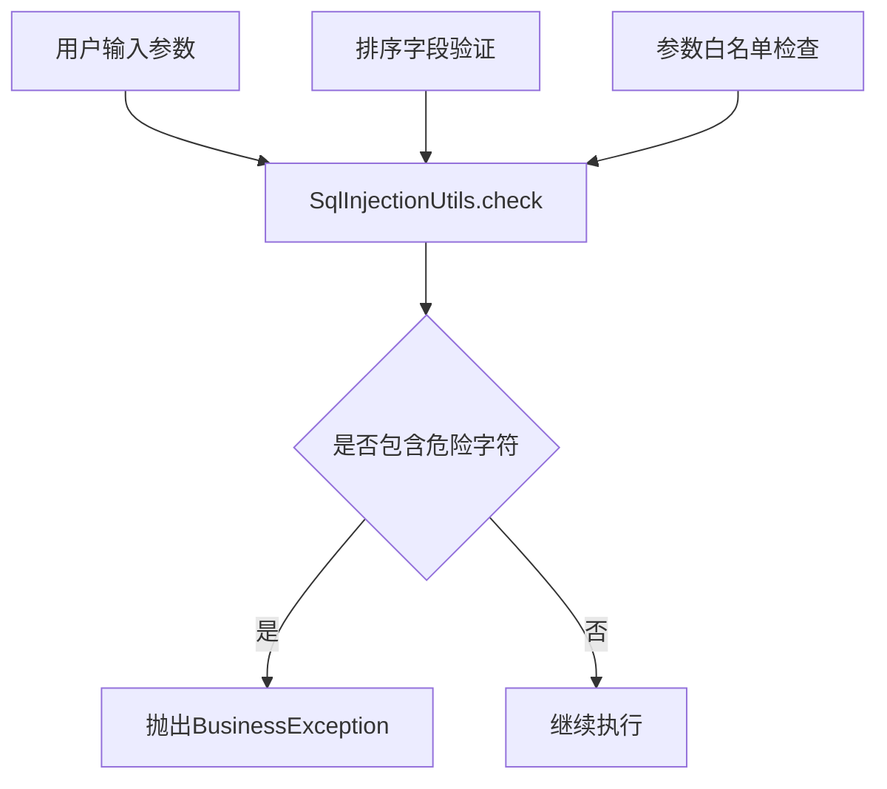

# DAO层

<cite>
**本文档中引用的文件**
- [EmployeeDao.java](file://smart-admin-api-java17-springboot3/sa-admin/src/main/java/net/lab1024/sa/admin/module/system/employee/dao/EmployeeDao.java)
- [EmployeeMapper.xml](file://smart-admin-api-java17-springboot3/sa-admin/src/main/resources/mapper/system/employee/EmployeeMapper.xml)
- [MybatisPlusConfig.java](file://smart-admin-api-java17-springboot3/sa-base/src/main/java/net/lab1024/sa/base/config/MybatisPlusConfig.java)
- [EmployeeEntity.java](file://smart-admin-api-java17-springboot3/sa-admin/src/main/java/net/lab1024/sa/admin/module/system/employee/domain/entity/EmployeeEntity.java)
- [EmployeeQueryForm.java](file://smart-admin-api-java17-springboot3/sa-admin/src/main/java/net/lab1024/sa/admin/module/system/employee/domain/form/EmployeeQueryForm.java)
- [EmployeeVO.java](file://smart-admin-api-java17-springboot3/sa-admin/src/main/java/net/lab1024/sa/admin/module/system/employee/domain/vo/EmployeeVO.java)
- [DepartmentDao.java](file://smart-admin-api-java17-springboot3/sa-admin/src/main/java/net/lab1024/sa/admin/module/system/department/dao/DepartmentDao.java)
- [DepartmentMapper.xml](file://smart-admin-api-java17-springboot3/sa-admin/src/main/resources/mapper/system/department/DepartmentMapper.xml)
- [BaseMapper.java](file://mybatis-plus-core-3.5.12.jar/com.baomidou.mybatisplus.core.mapper/BaseMapper.class)
</cite>

## 目录
1. [简介](#简介)
2. [项目结构](#项目结构)
3. [核心组件](#核心组件)
4. [架构概述](#架构概述)
5. [详细组件分析](#详细组件分析)
6. [依赖关系分析](#依赖关系分析)
7. [性能考虑](#性能考虑)
8. [故障排除指南](#故障排除指南)
9. [结论](#结论)

## 简介

DAO（Data Access Object）层是智能管理系统中的核心数据访问接口层，负责封装所有与数据库交互的操作。该系统采用MyBatis-Plus框架，通过@Mapper注解标识映射接口，实现了高效的数据持久化操作。DAO层不仅提供了基础的CRUD功能，还支持复杂的查询、分页、多表关联等高级数据访问需求。

## 项目结构

智能管理系统采用分层架构设计，DAO层位于业务逻辑层之下，直接与数据库交互。整个项目的DAO相关文件组织如下：

```mermaid
graph TB
subgraph "DAO层架构"
A[DAO接口层] --> B[MyBatis-Plus BaseMapper]
A --> C[@Mapper注解]
A --> D[@Param参数绑定]
E[XML映射文件] --> F[SQL语句定义]
E --> G[动态SQL构建]
H[实体类] --> I[Entity实体]
H --> J[VO视图对象]
H --> K[QueryForm查询参数]
end
subgraph "配置层"
L[MyBatisPlusConfig] --> M[分页插件]
L --> N[拦截器配置]
end
A --> E
A --> H
L --> A
```

**图表来源**
- [EmployeeDao.java](file://smart-admin-api-java17-springboot3/sa-admin/src/main/java/net/lab1024/sa/admin/module/system/employee/dao/EmployeeDao.java#L1-L111)
- [MybatisPlusConfig.java](file://smart-admin-api-java17-springboot3/sa-base/src/main/java/net/lab1024/sa/base/config/MybatisPlusConfig.java#L1-L34)

**章节来源**
- [EmployeeDao.java](file://smart-admin-api-java17-springboot3/sa-admin/src/main/java/net/lab1024/sa/admin/module/system/employee/dao/EmployeeDao.java#L1-L111)
- [DepartmentDao.java](file://smart-admin-api-java17-springboot3/sa-admin/src/main/java/net/lab1024/sa/admin/module/system/department/dao/DepartmentDao.java#L1-L36)

## 核心组件

### @Mapper注解标识

DAO层使用@Mapper注解标识MyBatis映射接口，这是MyBatis框架识别数据访问接口的关键标记。每个DAO接口都继承自BaseMapper，获得了基础的CRUD操作能力。

### BaseMapper继承机制

通过继承BaseMapper接口，DAO接口自动获得以下核心功能：
- **插入操作**：insert方法支持单条记录插入
- **删除操作**：deleteById、deleteByIds等批量删除方法
- **更新操作**：updateById、update方法
- **查询操作**：selectById、selectList、selectPage等查询方法

### 自定义查询方法

除了基础CRUD功能，DAO层还定义了大量自定义查询方法，这些方法针对具体的业务需求进行了优化：

| 方法类型 | 示例方法 | 功能描述 |
|---------|---------|---------|
| 条件查询 | getByLoginName | 根据登录名查询用户 |
| 组合查询 | queryEmployee | 复杂条件组合查询 |
| 关联查询 | selectEmployeeByDisabledAndDeleted | 多条件关联查询 |
| 统计查询 | countByDepartmentId | 统计部门员工数量 |
| 批量查询 | getEmployeeByIds | 批量查询员工信息 |

**章节来源**
- [EmployeeDao.java](file://smart-admin-api-java17-springboot3/sa-admin/src/main/java/net/lab1024/sa/admin/module/system/employee/dao/EmployeeDao.java#L24-L111)
- [BaseMapper.java](file://mybatis-plus-core-3.5.12.jar/com.baomidou.mybatisplus.core.mapper/BaseMapper.class#L33-L241)

## 架构概述

智能管理系统的DAO层采用了MyBatis-Plus框架，结合Spring Boot的自动配置机制，形成了一个高效、可扩展的数据访问架构。



**图表来源**
- [EmployeeDao.java](file://smart-admin-api-java17-springboot3/sa-admin/src/main/java/net/lab1024/sa/admin/module/system/employee/dao/EmployeeDao.java#L29-L34)
- [EmployeeMapper.xml](file://smart-admin-api-java17-springboot3/sa-admin/src/main/resources/mapper/system/employee/EmployeeMapper.xml#L5-L34)

## 详细组件分析

### 员工管理模块DAO分析

以EmployeeDao为例，展示了DAO层的核心功能和实现方式。

#### 接口定义结构



**图表来源**
- [EmployeeDao.java](file://smart-admin-api-java17-springboot3/sa-admin/src/main/java/net/lab1024/sa/admin/module/system/employee/dao/EmployeeDao.java#L25-L111)
- [EmployeeEntity.java](file://smart-admin-api-java17-springboot3/sa-admin/src/main/java/net/lab1024/sa/admin/module/system/employee/domain/entity/EmployeeEntity.java#L21-L102)

#### @Param注解参数绑定

DAO层通过@Param注解实现参数的显式绑定，确保SQL语句中的参数能够正确映射到Java方法参数：

```mermaid
flowchart TD
A[Java方法调用] --> B[参数验证]
B --> C[@Param注解解析]
C --> D[SQL语句构建]
D --> E[参数替换]
E --> F[数据库执行]
F --> G[结果映射]
G --> H[返回结果]
I[EmployeeDao.queryEmployee] --> J[Page分页参数]
I --> K[EmployeeQueryForm查询条件]
I --> L[departmentIdList部门列表]
J --> C
K --> C
L --> C
```

**图表来源**
- [EmployeeDao.java](file://smart-admin-api-java17-springboot3/sa-admin/src/main/java/net/lab1024/sa/admin/module/system/employee/dao/EmployeeDao.java#L29-L34)
- [EmployeeMapper.xml](file://smart-admin-api-java17-springboot3/sa-admin/src/main/resources/mapper/system/employee/EmployeeMapper.xml#L5-L34)

#### XML映射文件对应关系

每个DAO接口方法都对应着XML映射文件中的SQL语句，形成了强类型的映射关系：

| DAO方法 | XML语句ID | SQL功能 |
|---------|-----------|---------|
| queryEmployee | queryEmployee | 复杂条件查询员工列表 |
| getByLoginName | getByLoginName | 根据登录名查询用户 |
| updateDisableFlag | updateDisableFlag | 更新用户禁用状态 |
| getEmployeeById | getEmployeeById | 查询单个员工详情 |

**章节来源**
- [EmployeeDao.java](file://smart-admin-api-java17-springboot3/sa-admin/src/main/java/net/lab1024/sa/admin/module/system/employee/dao/EmployeeDao.java#L29-L111)
- [EmployeeMapper.xml](file://smart-admin-api-java17-springboot3/sa-admin/src/main/resources/mapper/system/employee/EmployeeMapper.xml#L5-L200)

### 复杂查询实现

#### 分页查询机制

系统通过MyBatis-Plus的分页插件实现高效的分页查询：



**图表来源**
- [MybatisPlusConfig.java](file://smart-admin-api-java17-springboot3/sa-base/src/main/java/net/lab1024/sa/base/config/MybatisPlusConfig.java#L26-L31)
- [EmployeeQueryForm.java](file://smart-admin-api-java17-springboot3/sa-admin/src/main/java/net/lab1024/sa/admin/module/system/employee/domain/form/EmployeeQueryForm.java#L21-L40)

#### 多表关联查询

DAO层支持复杂的多表关联查询，通过LEFT JOIN实现数据关联：



**图表来源**
- [EmployeeMapper.xml](file://smart-admin-api-java17-springboot3/sa-admin/src/main/resources/mapper/system/employee/EmployeeMapper.xml#L170-L176)
- [DepartmentMapper.xml](file://smart-admin-api-java17-springboot3/sa-admin/src/main/resources/mapper/system/department/DepartmentMapper.xml#L22-L31)

#### 条件筛选实现

系统通过动态SQL实现灵活的条件筛选：



**图表来源**
- [EmployeeMapper.xml](file://smart-admin-api-java17-springboot3/sa-admin/src/main/resources/mapper/system/employee/EmployeeMapper.xml#L12-L33)

**章节来源**
- [EmployeeMapper.xml](file://smart-admin-api-java17-springboot3/sa-admin/src/main/resources/mapper/system/employee/EmployeeMapper.xml#L5-L200)
- [DepartmentMapper.xml](file://smart-admin-api-java17-springboot3/sa-admin/src/main/resources/mapper/system/department/DepartmentMapper.xml#L1-L34)

### 部门管理模块DAO分析

部门管理模块展示了DAO层在组织架构管理中的应用：

#### 基础CRUD操作



**图表来源**
- [DepartmentDao.java](file://smart-admin-api-java17-springboot3/sa-admin/src/main/java/net/lab1024/sa/admin/module/system/department/dao/DepartmentDao.java#L21-L35)

#### 层级结构查询

部门管理支持层级结构的查询，通过递归关联实现父子部门关系：

| 查询方法 | 功能描述 | SQL特点 |
|---------|---------|---------|
| countSubDepartment | 统计子部门数量 | COUNT(*) + WHERE条件 |
| listAll | 获取全部部门列表 | LEFT JOIN + ORDER BY |
| selectDepartmentVO | 查询单个部门详情 | 多表关联 + 条件过滤 |

**章节来源**
- [DepartmentDao.java](file://smart-admin-api-java17-springboot3/sa-admin/src/main/java/net/lab1024/sa/admin/module/system/department/dao/DepartmentDao.java#L21-L35)
- [DepartmentMapper.xml](file://smart-admin-api-java17-springboot3/sa-admin/src/main/resources/mapper/system/department/DepartmentMapper.xml#L6-L33)

## 依赖关系分析

### MyBatis-Plus框架集成

系统通过MyBatisPlusConfig配置类集成了MyBatis-Plus框架的核心功能：



**图表来源**
- [MybatisPlusConfig.java](file://smart-admin-api-java17-springboot3/sa-base/src/main/java/net/lab1024/sa/base/config/MybatisPlusConfig.java#L26-L31)
- [BaseMapper.java](file://mybatis-plus-core-3.5.12.jar/com.baomidou.mybatisplus.core.mapper/BaseMapper.class#L33-L241)

### 实体类与DAO层关系

DAO层与实体类之间建立了清晰的数据映射关系：

| 组件类型 | 文件位置 | 主要功能 |
|---------|---------|---------|
| Entity实体 | EmployeeEntity | 数据库表映射 |
| VO视图对象 | EmployeeVO | 前端数据传输 |
| QueryForm查询参数 | EmployeeQueryForm | 查询条件封装 |

**章节来源**
- [EmployeeEntity.java](file://smart-admin-api-java17-springboot3/sa-admin/src/main/java/net/lab1024/sa/admin/module/system/employee/domain/entity/EmployeeEntity.java#L21-L102)
- [EmployeeVO.java](file://smart-admin-api-java17-springboot3/sa-admin/src/main/java/net/lab1024/sa/admin/module/system/employee/domain/vo/EmployeeVO.java#L21-L68)
- [EmployeeQueryForm.java](file://smart-admin-api-java17-springboot3/sa-admin/src/main/java/net/lab1024/sa/admin/module/system/employee/domain/form/EmployeeQueryForm.java#L21-L40)

## 性能考虑

### SQL语句优化

DAO层通过多种方式优化SQL执行性能：

1. **索引利用**：在EmployeeEntity中，employeeId、loginName、departmentId等字段都建立了适当的索引
2. **查询优化**：使用LEFT JOIN替代笛卡尔积查询，减少数据冗余
3. **条件优化**：通过动态SQL避免不必要的字段查询

### 缓存策略

虽然当前实现主要依赖数据库查询，但可以通过以下方式进一步优化：
- **结果缓存**：对频繁查询的静态数据建立缓存
- **查询缓存**：对相同查询条件的结果进行缓存
- **连接池优化**：合理配置数据库连接池参数

### 分页性能

分页查询通过MyBatis-Plus的分页插件实现，具有以下特点：
- **LIMIT优化**：只查询需要的记录范围
- **COUNT优化**：可选择性地执行COUNT查询
- **排序优化**：基于索引字段进行排序

## 故障排除指南

### 常见问题及解决方案

#### SQL注入防护

系统通过SmartPageUtil类实现了SQL注入防护机制：



**图表来源**
- [SmartPageUtil.java](file://smart-admin-api-java17-springboot3/sa-base/src/main/java/net/lab1024/sa/base/common/util/SmartPageUtil.java#L45-L50)

#### 参数绑定问题

当出现参数绑定错误时，通常是因为：
1. @Param注解的参数名称与XML中的#{parameter}不匹配
2. 参数类型不兼容
3. 参数为空但未正确处理

#### 查询性能问题

查询性能优化建议：
1. 检查SQL执行计划，优化索引
2. 减少不必要的JOIN操作
3. 限制查询结果集大小
4. 使用合适的分页参数

**章节来源**
- [SmartPageUtil.java](file://smart-admin-api-java17-springboot3/sa-base/src/main/java/net/lab1024/sa/base/common/util/SmartPageUtil.java#L45-L50)

## 结论

智能管理系统的DAO层通过MyBatis-Plus框架实现了高效、安全、可扩展的数据访问功能。主要特点包括：

1. **标准化设计**：统一的@Mapper注解和BaseMapper继承机制
2. **灵活查询**：支持复杂条件查询、多表关联、动态SQL
3. **性能优化**：内置分页插件、SQL注入防护、参数绑定优化
4. **类型安全**：强类型的接口设计和泛型支持
5. **易于维护**：清晰的代码结构和完善的注释

该DAO层设计为整个系统的数据访问提供了坚实的基础，支持了复杂的业务逻辑和高性能的数据操作需求。通过合理的架构设计和最佳实践的应用，确保了系统的稳定性和可扩展性。