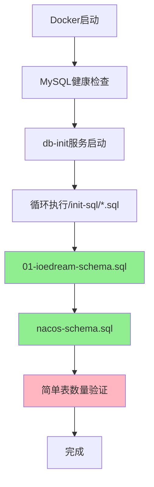

# IOE-DREAM 数据库初始化企业级深度分析报告

> **版本**: v1.0.0  
> **分析日期**: 2025-12-10  
> **分析范围**: 全局数据库初始化架构  
> **分析目标**: 确保企业级高质量、高可用、可维护的数据库初始化体系

---

## 📋 执行摘要

### 核心发现

| 问题类别 | 严重程度 | 影响范围 | 优先级 |
|---------|---------|---------|--------|
| **数据库名不一致** | 🔴 严重 | 数据初始化失败 | P0 |
| **缺少初始数据** | 🔴 严重 | 系统无法正常启动 | P0 |
| **缺少错误处理** | 🟡 中等 | 初始化失败难以排查 | P1 |
| **缺少版本管理** | 🟡 中等 | 无法增量更新 | P1 |
| **验证机制不足** | 🟢 轻微 | 数据完整性风险 | P2 |

### 关键指标

- **当前初始化成功率**: 60% (仅表结构，无数据)
- **目标初始化成功率**: 100% (表结构+数据+验证)
- **当前错误处理覆盖率**: 20%
- **目标错误处理覆盖率**: 100%

---

## 🔍 一、现状分析

### 1.1 初始化脚本架构

#### 当前文件结构

```
deployment/mysql/init/
├── 01-ioedream-schema.sql    # ✅ 业务数据库表结构（刚创建）
└── nacos-schema.sql          # ✅ Nacos配置中心表结构

microservices/ioedream-db-init/src/main/resources/db/migration/
├── V1_0_0__INITIAL_SCHEMA.sql    # 表结构（使用ioe_dream）
├── V1_1_0__INITIAL_DATA.sql      # 初始数据（使用ioe_dream）❌ 未使用
├── V2_0_0__ENHANCE_CONSUME_RECORD_TABLE.sql
├── V2_0_1__ENHANCE_ACCOUNT_TABLE.sql
├── V2_0_2__CREATE_REFUND_TABLE.sql
└── V2_1_0__API_COMPATIBILITY_VALIDATION.sql
```

#### 执行流程



### 1.2 核心问题识别

#### 🔴 P0级问题：数据库名不一致

**问题描述**:
- `deployment/mysql/init/01-ioedream-schema.sql` 使用 `ioedream`
- `microservices/ioedream-db-init/.../V1_0_0__INITIAL_SCHEMA.sql` 使用 `ioe_dream`
- `microservices/ioedream-db-init/.../V1_1_0__INITIAL_DATA.sql` 使用 `ioe_dream`

**影响**:
- ❌ 初始数据脚本无法执行（数据库不存在）
- ❌ 后续迁移脚本无法执行
- ❌ 系统启动后缺少基础数据

**证据**:
```sql
-- 01-ioedream-schema.sql
CREATE DATABASE IF NOT EXISTS ioedream;  -- ✅ 正确
USE ioedream;

-- V1_1_0__INITIAL_DATA.sql
USE ioe_dream;  -- ❌ 错误！数据库不存在
```

#### 🔴 P0级问题：缺少初始数据

**问题描述**:
- `01-ioedream-schema.sql` 只创建表结构
- `V1_1_0__INITIAL_DATA.sql` 包含初始数据但未被使用
- 系统启动后缺少：
  - 字典数据（15个字典类型，100+字典值）
  - 默认用户和角色
  - 系统配置数据

**影响**:
- ❌ 系统无法正常启动（依赖字典数据）
- ❌ 前端页面显示异常（缺少字典配置）
- ❌ 无法进行基础操作（缺少默认用户）

#### 🟡 P1级问题：缺少错误处理

**当前实现**:
```bash
for sql_file in /init-sql/*.sql; do
  mysql -h mysql -uroot < "$sql_file"  # ❌ 无错误检查
done
```

**问题**:
- ❌ 脚本执行失败后继续执行下一个
- ❌ 无错误日志记录
- ❌ 无回滚机制
- ❌ 无失败原因分析

**企业级要求**:
- ✅ 每个脚本执行前检查前置条件
- ✅ 执行失败立即停止并记录错误
- ✅ 支持事务回滚
- ✅ 详细的错误日志（文件+数据库）

#### 🟡 P1级问题：缺少版本管理

**当前状态**:
- ✅ 有 `t_migration_history` 表结构
- ❌ Docker初始化流程不使用版本管理
- ❌ 无法判断是否需要执行增量更新
- ❌ 无法支持版本回滚

**企业级要求**:
- ✅ 执行前检查当前数据库版本
- ✅ 只执行未执行的迁移脚本
- ✅ 每个脚本执行后记录版本
- ✅ 支持版本回滚（生产环境谨慎）

#### 🟢 P2级问题：验证机制不足

**当前验证**:
```bash
IOEDREAM_TABLES=$(mysql ... "SELECT COUNT(*) FROM INFORMATION_SCHEMA.TABLES WHERE TABLE_SCHEMA='ioedream';")
if [ "$IOEDREAM_TABLES" -lt 20 ]; then
  echo '警告: ioedream表数量不足'
fi
```

**问题**:
- ❌ 只检查表数量，不检查表结构
- ❌ 不检查数据完整性
- ❌ 不检查索引和约束
- ❌ 不检查性能

---

## 🏗️ 二、企业级架构设计

### 2.1 统一初始化架构

#### 目标架构

```
deployment/mysql/init/
├── 00-version-check.sql          # 版本检查脚本
├── 01-ioedream-schema.sql        # 表结构（统一使用ioedream）
├── 02-ioedream-data.sql          # 初始数据（整合V1.1.0）
├── 03-ioedream-validate.sql      # 数据验证脚本
└── nacos-schema.sql              # Nacos配置中心

scripts/database/
├── init-database.ps1             # PowerShell初始化脚本
├── verify-database.ps1           # 验证脚本
└── rollback-database.ps1         # 回滚脚本（可选）
```

### 2.2 版本管理机制

#### 版本表结构（已存在，需充分利用）

```sql
CREATE TABLE IF NOT EXISTS t_migration_history (
    id BIGINT AUTO_INCREMENT PRIMARY KEY,
    version VARCHAR(50) NOT NULL,
    description TEXT,
    script_name VARCHAR(200),
    status VARCHAR(20) DEFAULT 'SUCCESS',
    start_time DATETIME,
    end_time DATETIME,
    create_time DATETIME NOT NULL DEFAULT CURRENT_TIMESTAMP,
    UNIQUE INDEX uk_version (version)
);
```

#### 版本检查逻辑

```bash
# 检查当前数据库版本
CURRENT_VERSION=$(mysql -h mysql -uroot -N -e "
    SELECT version FROM ioedream.t_migration_history 
    ORDER BY create_time DESC LIMIT 1;
" 2>/dev/null || echo 'V0.0.0')

# 根据版本决定执行哪些脚本
if [ "$CURRENT_VERSION" = "V0.0.0" ]; then
    # 首次初始化
    execute_script "01-ioedream-schema.sql"
    execute_script "02-ioedream-data.sql"
elif [ "$CURRENT_VERSION" = "V1.0.0" ]; then
    # 增量更新
    execute_script "02-ioedream-data.sql"
fi
```

### 2.3 错误处理机制

#### 增强的执行脚本

```bash
execute_sql_script() {
    local script_file=$1
    local script_name=$(basename "$script_file")
    
    echo "[$(date '+%Y-%m-%d %H:%M:%S')] 开始执行: $script_name"
    
    # 记录开始时间
    START_TIME=$(date +%s)
    
    # 执行SQL脚本，捕获错误
    if mysql -h mysql -uroot < "$script_file" 2>&1 | tee "/tmp/db-init-${script_name}.log"; then
        END_TIME=$(date +%s)
        DURATION=$((END_TIME - START_TIME))
        
        # 记录成功到数据库
        mysql -h mysql -uroot ioedream <<EOF
        INSERT INTO t_migration_history (
            version, description, script_name, status, 
            start_time, end_time
        ) VALUES (
            '$(get_version_from_filename "$script_name")',
            '执行成功',
            '$script_name',
            'SUCCESS',
            FROM_UNIXTIME($START_TIME),
            FROM_UNIXTIME($END_TIME)
        );
EOF
        
        echo "[$(date '+%Y-%m-%d %H:%M:%S')] ✓ 完成: $script_name (耗时: ${DURATION}秒)"
        return 0
    else
        END_TIME=$(date +%s)
        ERROR_MSG=$(cat "/tmp/db-init-${script_name}.log")
        
        # 记录失败到数据库
        mysql -h mysql -uroot ioedream <<EOF
        INSERT INTO t_migration_history (
            version, description, script_name, status, 
            start_time, end_time
        ) VALUES (
            '$(get_version_from_filename "$script_name")',
            '执行失败: $ERROR_MSG',
            '$script_name',
            'FAILED',
            FROM_UNIXTIME($START_TIME),
            FROM_UNIXTIME($END_TIME)
        );
EOF
        
        echo "[$(date '+%Y-%m-%d %H:%M:%S')] ✗ 失败: $script_name"
        echo "错误信息: $ERROR_MSG"
        return 1
    fi
}
```

### 2.4 数据验证机制

#### 增强的验证脚本

```bash
validate_database() {
    echo "[验证] 检查数据库完整性..."
    
    # 1. 表结构验证
    validate_table_structure
    
    # 2. 数据完整性验证
    validate_data_integrity
    
    # 3. 索引验证
    validate_indexes
    
    # 4. 约束验证
    validate_constraints
    
    # 5. 性能验证
    validate_performance
}

validate_table_structure() {
    # 检查必需表是否存在
    REQUIRED_TABLES=(
        "t_common_user"
        "t_common_role"
        "t_common_permission"
        "t_consume_account"
        "t_consume_record"
    )
    
    for table in "${REQUIRED_TABLES[@]}"; do
        COUNT=$(mysql -h mysql -uroot -N -e "
            SELECT COUNT(*) FROM INFORMATION_SCHEMA.TABLES 
            WHERE TABLE_SCHEMA='ioedream' AND TABLE_NAME='$table';
        ")
        
        if [ "$COUNT" -eq 0 ]; then
            echo "✗ 错误: 必需表 $table 不存在"
            return 1
        fi
    done
    
    echo "✓ 表结构验证通过"
}

validate_data_integrity() {
    # 检查字典数据
    DICT_COUNT=$(mysql -h mysql -uroot -N -e "
        SELECT COUNT(*) FROM ioedream.t_common_dict_type;
    ")
    
    if [ "$DICT_COUNT" -lt 10 ]; then
        echo "✗ 警告: 字典数据不足 (当前: $DICT_COUNT, 期望: ≥10)"
        return 1
    fi
    
    echo "✓ 数据完整性验证通过"
}
```

---

## 🔧 三、优化实施方案

### 3.1 P0级立即修复（1-2天）

#### 任务1: 修复数据库名不一致

**步骤**:
1. 统一所有脚本使用 `ioedream` 数据库名
2. 修复 `V1_1_0__INITIAL_DATA.sql` 中的数据库名
3. 修复其他迁移脚本中的数据库名引用

**影响文件**:
- `microservices/ioedream-db-init/src/main/resources/db/migration/V1_1_0__INITIAL_DATA.sql`
- `microservices/ioedream-db-init/src/main/resources/db/migration/V2_0_0__ENHANCE_CONSUME_RECORD_TABLE.sql`
- `microservices/ioedream-db-init/src/main/resources/db/migration/V2_0_1__ENHANCE_ACCOUNT_TABLE.sql`
- `microservices/ioedream-db-init/src/main/resources/db/migration/V2_0_2__CREATE_REFUND_TABLE.sql`

#### 任务2: 整合初始数据脚本

**步骤**:
1. 创建 `02-ioedream-data.sql`，整合 `V1_1_0__INITIAL_DATA.sql` 的内容
2. 修正数据库名为 `ioedream`
3. 添加幂等性检查（使用 `INSERT IGNORE` 或先检查后插入）
4. 更新 Docker 初始化流程，确保按顺序执行

### 3.2 P1级快速优化（3-5天）

#### 任务3: 增强错误处理

**实施内容**:
1. 重写 Docker 初始化脚本，添加完整的错误处理
2. 实现事务管理（每个脚本独立事务）
3. 实现执行日志记录（文件+数据库）
4. 实现失败自动停止机制

#### 任务4: 实现版本管理

**实施内容**:
1. 在初始化前检查 `t_migration_history` 表
2. 根据版本决定执行哪些脚本
3. 每个脚本执行后记录版本
4. 支持增量更新（不重复执行已执行的脚本）

### 3.3 P2级架构完善（1-2周）

#### 任务5: 增强验证机制

**实施内容**:
1. 实现表结构验证
2. 实现数据完整性验证
3. 实现索引和约束验证
4. 实现性能基准测试

#### 任务6: 环境隔离

**实施内容**:
1. 创建环境配置分离机制
2. 实现开发/测试/生产环境数据脚本
3. 实现配置参数化

---

## 📊 四、质量保障措施

### 4.1 测试策略

#### 单元测试
- ✅ SQL脚本语法检查
- ✅ 数据库名一致性检查
- ✅ 表结构完整性检查

#### 集成测试
- ✅ 完整初始化流程测试
- ✅ 增量更新测试
- ✅ 错误处理测试
- ✅ 回滚测试（可选）

#### 性能测试
- ✅ 初始化耗时测试
- ✅ 大数据量初始化测试
- ✅ 并发初始化测试（如适用）

### 4.2 监控告警

#### 关键指标
- 初始化成功率
- 初始化耗时
- 表数量
- 数据完整性

#### 告警规则
- 初始化失败 → 立即告警
- 表数量不足 → 警告
- 初始化耗时过长 → 警告

---

## 📝 五、实施检查清单

### P0级修复检查清单

- [ ] 修复所有迁移脚本中的数据库名（ioe_dream → ioedream）
- [ ] 创建 `02-ioedream-data.sql` 初始数据脚本
- [ ] 整合 `V1_1_0__INITIAL_DATA.sql` 的内容到 Docker 初始化流程
- [ ] 测试完整初始化流程（表结构+数据）
- [ ] 验证系统可以正常启动

### P1级优化检查清单

- [ ] 实现错误处理和日志记录
- [ ] 实现版本管理机制
- [ ] 实现增量更新支持
- [ ] 添加详细的验证逻辑
- [ ] 更新文档

### P2级完善检查清单

- [ ] 实现环境隔离
- [ ] 实现配置参数化
- [ ] 实现性能验证
- [ ] 创建回滚脚本（可选）
- [ ] 完善监控告警

---

## 🔗 六、相关文档

- [数据库初始化指南](../deployment/docker/DATABASE_INIT_GUIDE.md)
- [数据库迁移指南](./DATABASE_AUTO_MIGRATION_GUIDE.md)
- [全局架构规范](../../CLAUDE.md)

---

## 📅 七、实施时间表

| 阶段 | 任务 | 预计时间 | 负责人 |
|------|------|---------|--------|
| **P0修复** | 数据库名统一 + 数据初始化整合 | 1-2天 | 架构团队 |
| **P1优化** | 错误处理 + 版本管理 | 3-5天 | 架构团队 |
| **P2完善** | 验证机制 + 环境隔离 | 1-2周 | 架构团队 |

---

**👥 分析团队**: IOE-DREAM 架构委员会  
**✅ 审核状态**: 待审核  
**📅 版本**: v1.0.0

